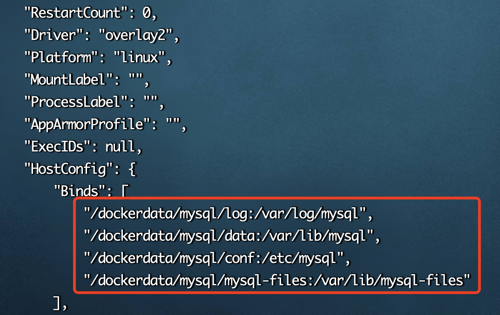
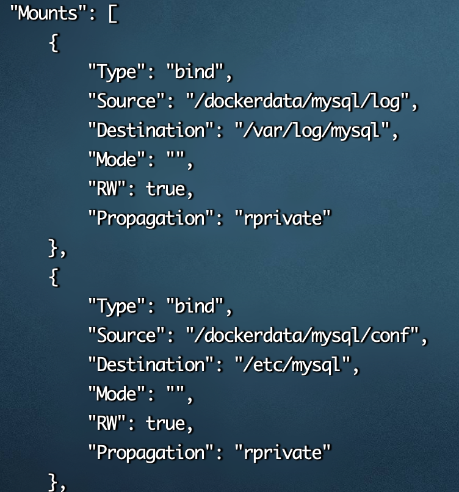

# docker容器数据卷与数据卷容器

## 一、容器数据卷

### 1. 什么是容器数据卷

docker 的理念将运行的环境打包形成容器运行，运行可以伴随容器，但是我们对数据的要求是希望持久化，容器之间可以共享数据，Docker 容器产生的数据，如果不通过 docker commit 生成新的镜像，使得数据作为容器的一部分保存下来，那么当容器被删除之后，数据也就没了，为了能够保存数据，在 docker 容器中使用卷。卷就是文件或者目录，存在于一个或者多个容器中，但是不属于联合文件系统，因此能够绕过 Union File System 提供一些用于持久化数据或共享数据的特点。

### 2. 容器数据卷的作用与特性

容器数据卷是一个特殊的文件或者目录，它将主机文件或者目录直接映射进容器中，可供一个或多个容器使用。容器数据卷设计的目的就是为了数据的持久化，它完全独立与容器的生命周期。因此，容器删除时，不会删除其挂载的数据卷，也不会存在类似的垃圾机制对容器存在的数据卷进行处理。

**容器数据卷的特性：**

- 数据卷可以在容器之间进行数据共享和重用
- 对数据卷里的内容做更改不会影响镜像的更新
- 对数据卷里的内容做修改，能直接生效，无论是在容器内操作还是本地操作
- 数据卷的生命周期一直持续到没有容器使用它为止，即使挂载数据卷的容器已经被删除。
- 数据卷在容器启动时初始化，如果容器使用的镜像在挂载点包含了数据，这些数据会拷贝到新初始化的数据卷中

### 3. 容器数据卷的添加

#### 3.1 方式一：通过命令添加数据卷

**匿名目录挂载**

匿名目录挂载只需要写容器内目录或者文件即可，而宿主机对应的目录会在`/var/lib/docker/volumes`路径下生成

```bash
//以交互模式运行容器，并使用-v 匿名挂载容器数据卷
docker run -it -v 容器内目录/文件的绝对路径[:rw/ro] -p 主机端口:容器端口 --name=容器名称 镜像ID/镜像名称[:版本号]

//以后台方式运行容器，并使用-v 匿名挂载容器数据卷 (推荐)
docker run -d -v 容器内目录/文件的绝对路径[:rw/ro] -p 主机端口:容器端口 --name=容器名称 镜像ID/镜像名称[:版本号]

//注意：如果出现Docker挂载宿主机目录显示cannot open directory .:Permission denied
解决办法：在挂载目录后面 多加一个--privileged=true参数即可
```

**具名目录挂载**

具名目录挂载相对于匿名目录挂载，就是在宿主机生成对应的目录时可以指定该目录的名称，同样目录也会在`/var/lib/docker/volumes`路径下生成。例如：匿名目录挂载生成的对应宿主机目录为`0a4ea838c43ccc9af377af6d2e641b2c9fd4977c4a56408d76d31c8719b9dd8f`一串随机的数字，而具名目录挂载就是可以将这一串随机的数字改成指定的目录名称

```bash
//这里没有使用--name=容器名称 去指定容器名称，则docker随机一个容器名称
docker run -it -v /root/hostVolume:/containerVolume centos
```

可以在`宿主机`中使用指令`docker inspect 容器ID/容器名称`来查看是否挂载成功(下面的截图是其他容器的挂载，仅做示意)



#### 3.2 方式二：通过 DockerFile 添加数据卷

案例：在 Host 宿主机的 /root 目录下创建一个 DockerFile 文件 (`名称随意`)，并通过 docker build 指令生成镜像来添加数据卷

1. 在 Host 宿主机的 /root 目录下创建一个 DockerFile 文件，并添加如下内容到文件中

```bash
#基于centos镜像进行构建
FROM centos

#数据卷只能指定容器数据卷，不能指定宿主机数据卷，因为并不能够保证在所有的宿主机上都存在这样的特定目录。
VOLUME ["/dataVolumeContainer1","/dataVolumeContainer2"]

#以 /bin/bash方式启动
CMD /bin/bash
```

2. 使用如下指令，把编写的 DockerFile 文件执行生成镜像，`注意：命令最后面是空格 + .`

```bash
docker build -f 宿主机中DockerFile文件的绝对路径 -t 新镜像名称[:版本号] .
```

3. 运行我们生成的 new-centos 镜像，就能够查看到在容器内中生成的数据卷
4. 那么容器内的数据卷文件 / 目录地址已经知道，对应的宿主机文件 / 目录的地址怎么查看？通过如下指令(下图依然只是示意作用)

```bash
docker inspect 容器ID/容器名称
```



## 二、数据卷容器

### 1. 什么是数据卷容器

命名的容器`已挂载数据卷`，其他的容器通过挂载这个容器 (父容器) 实现数据共享，挂载数据卷的容器，称为数据卷容器。通过数据卷容器可以实现容器间的数据共享。

### 2. 添加数据卷容器

```bash
docker run -it/-d  -p 主机端口:容器端口 --name=容器名称 --volumes-from 数据卷容器ID/数据卷容器名称 生成数据卷容器的镜像ID/镜像名称[:版本号]
```

### 3. 总结

简单来说就是：

1. 父容器中修改数据，子容器读得到；
2. 子容器中修改数据，父容器读得到；
3. 父容器删除不影响子容器读取数据；
4. 容器之间配置信息的传递，数据卷的生命周期一直持续到没有容器使用它为止。
