# docker网络模式以及容器间的网络通信

## 一、默认网络

在安装完 Docker 以后，会默认创建三种网络，可以通过`docker network ls`命令查看

```bash
[root@common-server ~]# docker network ls
NETWORK ID     NAME            DRIVER    SCOPE
d1d8e01c550f   bridge          bridge    local
ea6e8c7b7b95   host            host      local
0bdd0eb17415   none            null      local
```

在学习 Docker 网络之前，我们有必要先来了解一下这几种网络模式都是什么意思

| 网络模式  | 简介                                                         |
| --------- | ------------------------------------------------------------ |
| bridge    | 为每一个容器分配、设置 IP 等，并将容器连接到一个`docker0`虚拟网桥，默认为该模式。 |
| host      | 容器将不会虚拟出自己的网卡，配置自己的 IP 等，而是使用宿主机的 IP 和端口。 |
| none      | 容器有独立的 Network namespace，但并没有对其进行任何网络设置，如分配 veth pair 和网桥连接，IP 等。 |
| container | 新创建的容器不会创建自己的网卡和配置自己的 IP，而是和一个指定的容器共享 IP、端口范围等。(`不属于默认网络，但在Kubernetes中会使用到`) |

### 1. bridge 网络模式

在该模式中，Docker 守护进程创建了一个虚拟以太网桥 `docker0`，新建的容器会自动桥接到这个接口，附加在其上的任何网卡之间都能自动转发数据包。

    默认情况下，守护进程会创建一对对等虚拟设备接口 `veth pair`，将其中一个接口设置为容器的 `eth0` 接口（容器的网卡），另一个接口放置在宿主机的命名空间中，以类似 `vethxxx` 这样的名字命名，从而将宿主机上的所有容器都连接到这个内部网络上。

    关于 `bridge` 网络模式的使用，只需要在创建容器时通过参数 `--net bridge` 或者 `--network bridge` 指定即可，当然这也是创建容器默认使用的网络模式，也就是说这个参数是可以省略的。

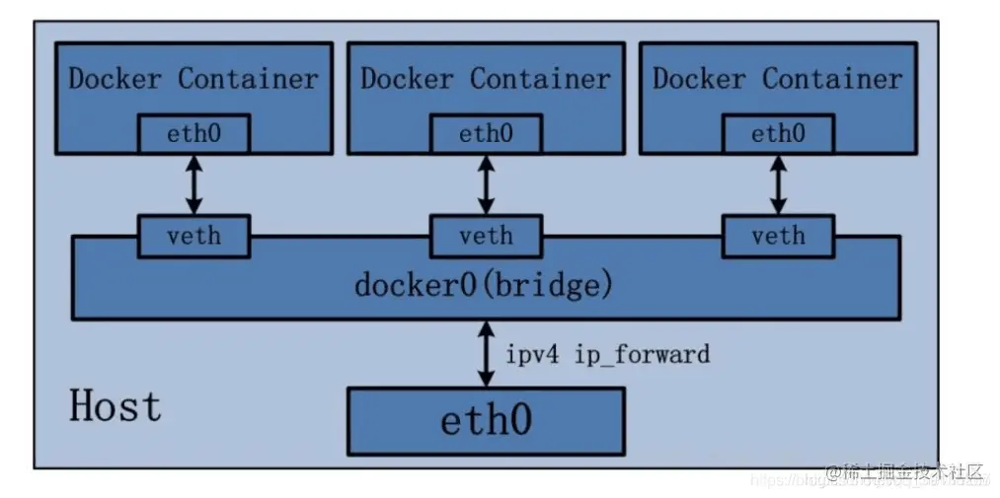

Bridge 桥接模式的实现步骤主要如下：

- Docker Daemon 利用 veth pair 技术，在宿主机上创建一对对等虚拟网络接口设备，假设为 veth0 和 veth1。而 veth pair 技术的特性可以保证无论哪一个 veth 接收到网络报文，都会将报文传输给另一方。
- Docker Daemon 将 veth0 附加到 Docker Daemon 创建的 docker0 网桥上。保证宿主机的网络报文可以发往 veth0。
- Docker Daemon 将 veth1 添加到 Docker Container 所属的 namespace 下，并被改名为 eth0。如此一来，宿主机的网络报文若发往 veth0，则立即会被 Container 的 eth0 接收，实现宿主机到 Docker Container 网络的联通性；同时，也保证 Docker Container 单独使用 eth0，实现容器网络环境的隔离性。

演示案例：

1. 运行一个基于`busybox` 镜像构建的容器 `mybox`，并查看容器的`ip`地址信息

```bash
[root@common-server ~]# docker run -it --name=mybox busybox
Unable to find image 'busybox:latest' locally
latest: Pulling from library/busybox
5cc84ad355aa: Pull complete 
Digest: sha256:5acba83a746c7608ed544dc1533b87c737a0b0fb730301639a0179f9344b1678
Status: Downloaded newer image for busybox:latest
/ # ip addr
1: lo: <LOOPBACK,UP,LOWER_UP> mtu 65536 qdisc noqueue qlen 1000
    link/loopback 00:00:00:00:00:00 brd 00:00:00:00:00:00
    inet 127.0.0.1/8 scope host lo
       valid_lft forever preferred_lft forever
17: eth0@if18: <BROADCAST,MULTICAST,UP,LOWER_UP,M-DOWN> mtu 1500 qdisc noqueue 
    link/ether 02:42:ac:11:00:02 brd ff:ff:ff:ff:ff:ff
    inet 172.17.0.2/16 brd 172.17.255.255 scope global eth0
       valid_lft forever preferred_lft forever
```

可以看到`mybox`容器有一个`lo 本地回环地址` 和 一个`17: eth0@if18`网卡

2. 查看宿主机的`ip`地址信息

```bash
[root@common-server ~]# ip addr
1: lo: <LOOPBACK,UP,LOWER_UP> mtu 65536 qdisc noqueue state UNKNOWN group default qlen 1000
    link/loopback 00:00:00:00:00:00 brd 00:00:00:00:00:00
    inet 127.0.0.1/8 scope host lo
       valid_lft forever preferred_lft forever
    inet6 ::1/128 scope host 
       valid_lft forever preferred_lft forever
2: ens32: <BROADCAST,MULTICAST,UP,LOWER_UP> mtu 1500 qdisc pfifo_fast state UP group default qlen 1000
    link/ether 00:0c:29:73:c9:d1 brd ff:ff:ff:ff:ff:ff
    inet 172.16.75.7/24 brd 172.16.75.255 scope global noprefixroute dynamic ens32
       valid_lft 82207sec preferred_lft 82207sec
    inet6 fd15:4ba5:5a2b:1008:8d1c:8ac8:cb48:b120/64 scope global noprefixroute dynamic 
       valid_lft 2591957sec preferred_lft 604757sec
    inet6 fe80::4cfc:6d4d:205f:d5f9/64 scope link noprefixroute 
       valid_lft forever preferred_lft forever
3: virbr0: <NO-CARRIER,BROADCAST,MULTICAST,UP> mtu 1500 qdisc noqueue state DOWN group default qlen 1000
    link/ether 52:54:00:4e:e6:68 brd ff:ff:ff:ff:ff:ff
4: virbr0-nic: <BROADCAST,MULTICAST> mtu 1500 qdisc pfifo_fast master virbr0 state DOWN group default qlen 1000
    link/ether 52:54:00:4e:e6:68 brd ff:ff:ff:ff:ff:ff
5: br-7a90a431cd30: <NO-CARRIER,BROADCAST,MULTICAST,UP> mtu 1500 qdisc noqueue state DOWN group default 
    link/ether 02:42:95:1e:35:02 brd ff:ff:ff:ff:ff:ff
6: docker0: <NO-CARRIER,BROADCAST,MULTICAST,UP> mtu 1500 qdisc noqueue state DOWN group default 
    link/ether 02:42:26:2a:24:17 brd ff:ff:ff:ff:ff:ff
    inet 172.17.0.1/16 brd 172.17.255.255 scope global docker0
       valid_lft forever preferred_lft forever
    inet6 fe80::42:26ff:fe2a:2417/64 scope link 
       valid_lft forever preferred_lft forever
18: veth8c57a51@if17: <BROADCAST,MULTICAST,UP,LOWER_UP> mtu 1500 qdisc noqueue master docker0 state UP group default 
    link/ether 8e:b0:6e:10:fa:7b brd ff:ff:ff:ff:ff:ff link-netnsid 0
    inet6 fe80::8cb0:6eff:fe10:fa7b/64 scope link 
       valid_lft forever preferred_lft forever
```

可以看到宿主机有一个`lo 本地回环地址`、一个`ens32`网卡 (即：`eth0`)、一个`docker0`网桥和一个`18: veth8c57a51@if17`网卡。

通过以上的比较可以发现，证实了之前所说的：守护进程会创建一对对等的虚拟设备接口 `veth pair`，将其中一个接口设置为容器的 `eth0` 接口（容器的网卡，即上图容器`mybox`的`17: eth0@if18`网卡），另一个接口放置在宿主机的命名空间中，以类似 `vethxxx` 这样的名字命名 (即：上图宿主机的`18: vetha1025cd@if17`网卡)。

同时，守护进程还会从网桥 `docker0` 的私有地址空间中分配一个 `ip` 地址和子网给该容器，并设置 `docker0` 的 `ip` 地址为容器的默认网关。也可以安装 `yum install -y bridge-utils` 以后，通过 `brctl show` 命令查看网桥信息。

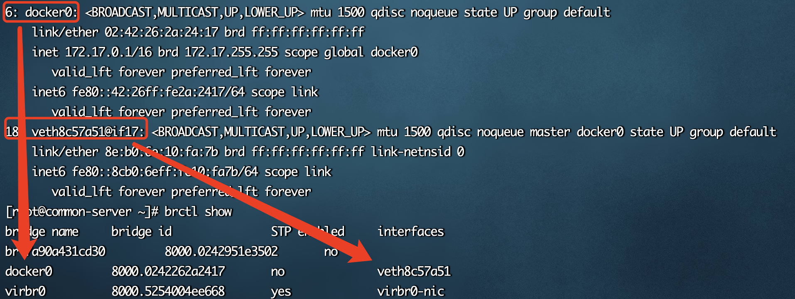

对于每个容器的 `IP` 地址和 `Gateway` 信息，我们可以通过 `docker inspect 容器名称|ID` 进行查看，在 `NetworkSettings` 节点中可以看到详细信息。

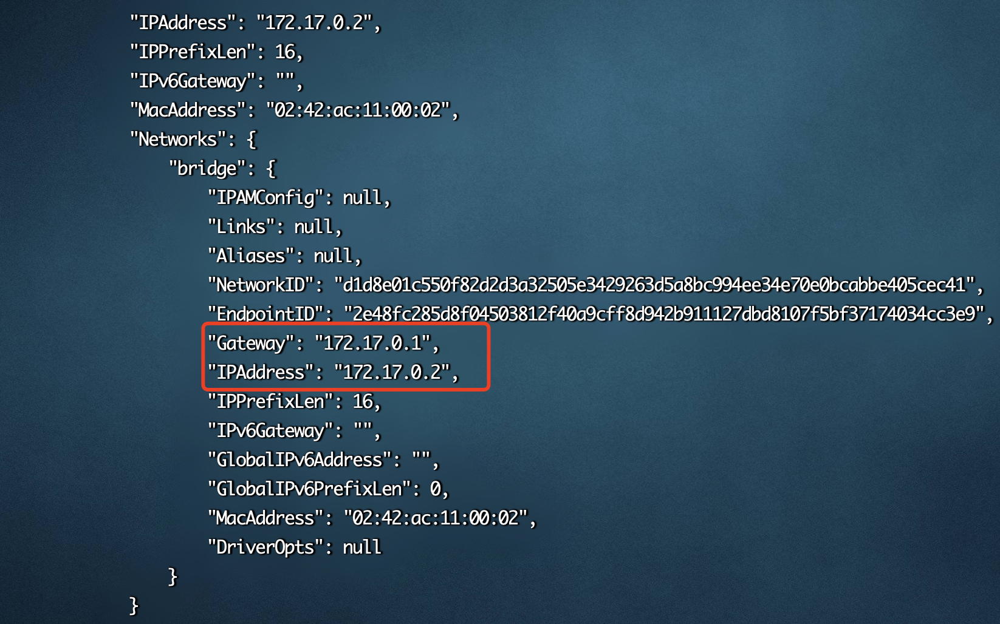

可以看到 `Gateway`网关地址为 `docker0` 的 `ip` 地址 `172.17.0.1`，容器的`ip`地址为`172.17.0.2`

我们还可以通过 `docker network inspect bridge` 查看所有 `bridge` 网络模式下的容器，在 `Containers` 节点中可以看到容器名称。

```bash
[root@common-server ~]# docker network inspect bridge
[
    {
        "Name": "bridge",
        "Id": "d1d8e01c550f82d2d3a32505e3429263d5a8bc994ee34e70e0bcabbe405cec41",
        "Created": "2023-11-14T14:49:54.711635237+08:00",
        "Scope": "local",
        "Driver": "bridge",
        "EnableIPv6": false,
        "IPAM": {
            "Driver": "default",
            "Options": null,
            "Config": [
                {
                    "Subnet": "172.17.0.0/16",
                    "Gateway": "172.17.0.1"
                }
            ]
        },
        "Internal": false,
        "Attachable": false,
        "Ingress": false,
        "ConfigFrom": {
            "Network": ""
        },
        "ConfigOnly": false,
        "Containers": {
            "4b3e7302489a0ec41796c29aea74dadea358ebb54156055c082fee3da68f7848": {
                "Name": "mybox",
                "EndpointID": "2e48fc285d8f04503812f40a9cff8d942b911127dbd8107f5bf37174034cc3e9",
                "MacAddress": "02:42:ac:11:00:02",
                "IPv4Address": "172.17.0.2/16",
                "IPv6Address": ""
            }
        },
        "Options": {
            "com.docker.network.bridge.default_bridge": "true",
            "com.docker.network.bridge.enable_icc": "true",
            "com.docker.network.bridge.enable_ip_masquerade": "true",
            "com.docker.network.bridge.host_binding_ipv4": "0.0.0.0",
            "com.docker.network.bridge.name": "docker0",
            "com.docker.network.driver.mtu": "1500"
        },
        "Labels": {}
    }
]
```

### 2. host 网络模式

 `host` 网络模式需要在创建容器时通过参数 `--net host` 或者 `--network host` 指定。

采用 `host` 网络模式的 `Docker Container`，可以直接使用宿主机的 `ip` 地址与外界进行通信，若宿主机的 `eth0` 是一个公有 `ip`，那么容器也拥有这个公有 `ip`。同时容器内服务的端口也可以使用宿主机的端口，无需额外进行 `NAT` 转换。

 `host` 网络模式可以让容器共享宿主机网络栈，这样的好处是外部主机与容器直接通信，但是容器的网络缺少隔离性。

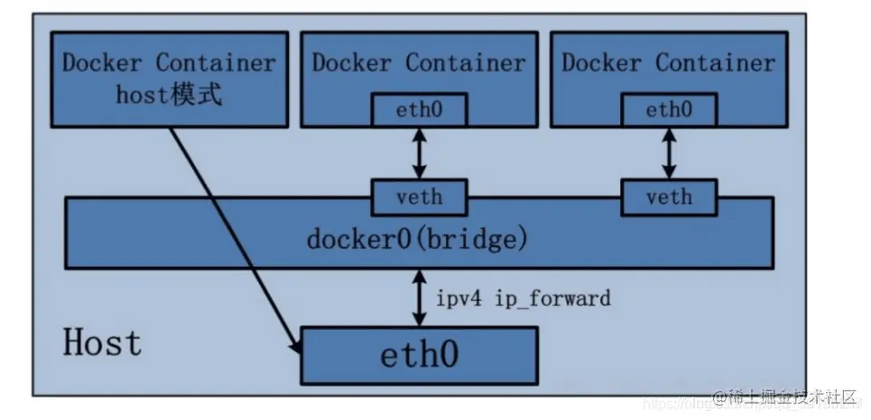

演示案例：

1. 运行一个基于`busybox` 镜像构建的容器 `hostbox`，并查看容器的 ip 地址信息

```bash
[root@common-server ~]# docker run -it --name=hostbox --net host busybox
/ # ip addr
1: lo: <LOOPBACK,UP,LOWER_UP> mtu 65536 qdisc noqueue qlen 1000
    link/loopback 00:00:00:00:00:00 brd 00:00:00:00:00:00
    inet 127.0.0.1/8 scope host lo
       valid_lft forever preferred_lft forever
    inet6 ::1/128 scope host 
       valid_lft forever preferred_lft forever
2: ens32: <BROADCAST,MULTICAST,UP,LOWER_UP> mtu 1500 qdisc pfifo_fast qlen 1000
    link/ether 00:0c:29:73:c9:d1 brd ff:ff:ff:ff:ff:ff
    inet 172.16.75.7/24 brd 172.16.75.255 scope global dynamic noprefixroute ens32
       valid_lft 81126sec preferred_lft 81126sec
    inet6 fd15:4ba5:5a2b:1008:8d1c:8ac8:cb48:b120/64 scope global dynamic noprefixroute 
       valid_lft 2591960sec preferred_lft 604760sec
    inet6 fe80::4cfc:6d4d:205f:d5f9/64 scope link noprefixroute 
       valid_lft forever preferred_lft forever
3: virbr0: <NO-CARRIER,BROADCAST,MULTICAST,UP> mtu 1500 qdisc noqueue qlen 1000
    link/ether 52:54:00:4e:e6:68 brd ff:ff:ff:ff:ff:ff
4: virbr0-nic: <BROADCAST,MULTICAST> mtu 1500 qdisc pfifo_fast master virbr0 qlen 1000
    link/ether 52:54:00:4e:e6:68 brd ff:ff:ff:ff:ff:ff
5: br-7a90a431cd30: <NO-CARRIER,BROADCAST,MULTICAST,UP> mtu 1500 qdisc noqueue 
    link/ether 02:42:95:1e:35:02 brd ff:ff:ff:ff:ff:ff
6: docker0: <NO-CARRIER,BROADCAST,MULTICAST,UP> mtu 1500 qdisc noqueue 
    link/ether 02:42:26:2a:24:17 brd ff:ff:ff:ff:ff:ff
    inet 172.17.0.1/16 brd 172.17.255.255 scope global docker0
       valid_lft forever preferred_lft forever
    inet6 fe80::42:26ff:fe2a:2417/64 scope link 
       valid_lft forever preferred_lft forever
```

可以看到`hostbox`容器有一个`lo 本地回环地址`、一个`ens32`网卡 (即：`eth0`) 和 一个`docker0`网桥

2. 查看宿主机的 ip 地址信息

```bash
[root@common-server ~]# ip addr
1: lo: <LOOPBACK,UP,LOWER_UP> mtu 65536 qdisc noqueue state UNKNOWN group default qlen 1000
    link/loopback 00:00:00:00:00:00 brd 00:00:00:00:00:00
    inet 127.0.0.1/8 scope host lo
       valid_lft forever preferred_lft forever
    inet6 ::1/128 scope host 
       valid_lft forever preferred_lft forever
2: ens32: <BROADCAST,MULTICAST,UP,LOWER_UP> mtu 1500 qdisc pfifo_fast state UP group default qlen 1000
    link/ether 00:0c:29:73:c9:d1 brd ff:ff:ff:ff:ff:ff
    inet 172.16.75.7/24 brd 172.16.75.255 scope global noprefixroute dynamic ens32
       valid_lft 81065sec preferred_lft 81065sec
    inet6 fd15:4ba5:5a2b:1008:8d1c:8ac8:cb48:b120/64 scope global noprefixroute dynamic 
       valid_lft 2591899sec preferred_lft 604699sec
    inet6 fe80::4cfc:6d4d:205f:d5f9/64 scope link noprefixroute 
       valid_lft forever preferred_lft forever
3: virbr0: <NO-CARRIER,BROADCAST,MULTICAST,UP> mtu 1500 qdisc noqueue state DOWN group default qlen 1000
    link/ether 52:54:00:4e:e6:68 brd ff:ff:ff:ff:ff:ff
4: virbr0-nic: <BROADCAST,MULTICAST> mtu 1500 qdisc pfifo_fast master virbr0 state DOWN group default qlen 1000
    link/ether 52:54:00:4e:e6:68 brd ff:ff:ff:ff:ff:ff
5: br-7a90a431cd30: <NO-CARRIER,BROADCAST,MULTICAST,UP> mtu 1500 qdisc noqueue state DOWN group default 
    link/ether 02:42:95:1e:35:02 brd ff:ff:ff:ff:ff:ff
6: docker0: <NO-CARRIER,BROADCAST,MULTICAST,UP> mtu 1500 qdisc noqueue state DOWN group default 
    link/ether 02:42:26:2a:24:17 brd ff:ff:ff:ff:ff:ff
    inet 172.17.0.1/16 brd 172.17.255.255 scope global docker0
       valid_lft forever preferred_lft forever
    inet6 fe80::42:26ff:fe2a:2417/64 scope link 
       valid_lft forever preferred_lft forever
```

可以看到宿主机的`ip`地址信息跟上图的`hostbox`容器的`ip`地址信息是一模一样的

### 3. none 网络模式

`none` 网络模式是指禁用网络功能，只有 `lo` 地址 (`local` 的简写)，代表 `127.0.0.1`，即 `localhost` 本地回环地址。在创建容器时通过参数 `--net none` 或者 `--network none` 指定。

 `none` 网络模式即不为 `Docker Container` 创建任何的网络环境，容器内部就只能使用 `loopback` 网络设备，不会再有其他的网络资源。可以说 `none` 模式为 `Docke Container` 做了极少的网络设定，但是俗话说得好 “少即是多”，在没有网络配置的情况下，作为 `Docker` 开发者，才能在这基础做其他无限多可能的网络定制开发。这也恰巧体现了 `Docker` 设计理念的开放。

演示案例：

运行一个基于`busybox` 镜像构建的容器 `nonebox`，并查看容器的 ip 地址信息

```bash
[root@common-server ~]# docker run -it --name=nonebox --net none busybox
/ # ip addr
1: lo: <LOOPBACK,UP,LOWER_UP> mtu 65536 qdisc noqueue qlen 1000
    link/loopback 00:00:00:00:00:00 brd 00:00:00:00:00:00
    inet 127.0.0.1/8 scope host lo
       valid_lft forever preferred_lft forever
```

可以看到`nonebox`容器有一个`lo 本地回环地址`

### 4. container 网络模式

`Container` 网络模式是 `Docker` 中一种较为特别的网络的模式。在创建容器时通过参数 `--net container:已运行的容器名称|ID` 或者 `--network container:已运行的容器名称|ID` 指定。

处于这个模式下的 `Docker` 容器会共享一个网络栈，这样两个容器之间可以使用 `localhost` 高效快速通信。

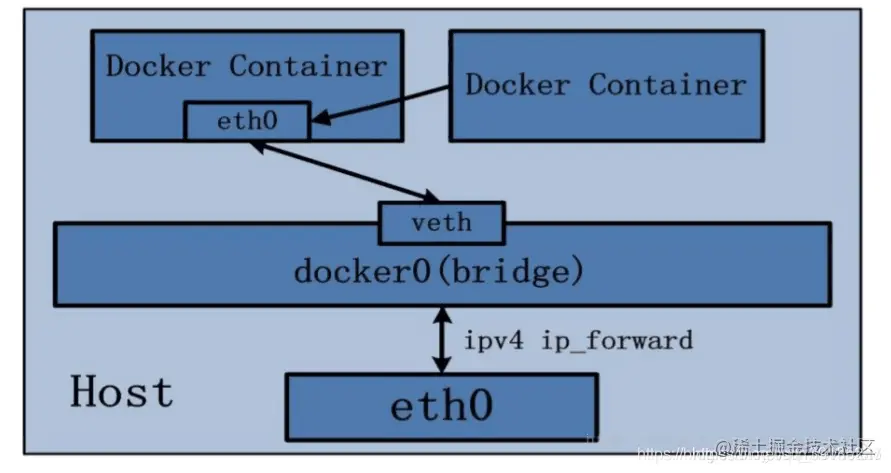

**`Container` 网络模式即新创建的容器不会创建自己的网卡，配置自己的 `ip`，而是和一个指定的容器共享 `ip`、端口范围等。** 同样两个容器除了网络方面相同之外，其他的如文件系统、进程列表等还是隔离的。

演示案例：

1. 运行一个基于`bridge`网络模式的`mybox` 容器创建`container`网络模式的容器 `containerbox`，并查看容器的`ip`地址信息

```bash
# 启动原先的mybox容器
[root@common-server ~]# docker start mybox
mybox
# 运行containerbox容器
[root@common-server ~]# docker run -it --name=containerbox --net container:mybox busybox
/ # ip addr
1: lo: <LOOPBACK,UP,LOWER_UP> mtu 65536 qdisc noqueue qlen 1000
    link/loopback 00:00:00:00:00:00 brd 00:00:00:00:00:00
    inet 127.0.0.1/8 scope host lo
       valid_lft forever preferred_lft forever
21: eth0@if22: <BROADCAST,MULTICAST,UP,LOWER_UP,M-DOWN> mtu 1500 qdisc noqueue 
    link/ether 02:42:ac:11:00:02 brd ff:ff:ff:ff:ff:ff
    inet 172.17.0.2/16 brd 172.17.255.255 scope global eth0
       valid_lft forever preferred_lft forever
```

可以看到`containerbox`容器有一个`lo 本地回环地址` 和 一个`21: eth0@if22`网卡

2. 查看`mybox` 容器的`ip`地址信息

```bash
[root@common-server ~]# docker exec -it mybox ip addr
1: lo: <LOOPBACK,UP,LOWER_UP> mtu 65536 qdisc noqueue qlen 1000
    link/loopback 00:00:00:00:00:00 brd 00:00:00:00:00:00
    inet 127.0.0.1/8 scope host lo
       valid_lft forever preferred_lft forever
21: eth0@if22: <BROADCAST,MULTICAST,UP,LOWER_UP,M-DOWN> mtu 1500 qdisc noqueue 
    link/ether 02:42:ac:11:00:02 brd ff:ff:ff:ff:ff:ff
    inet 172.17.0.2/16 brd 172.17.255.255 scope global eth0
       valid_lft forever preferred_lft forever
```

可以看到`mybox` 容器的`ip`地址信息跟上图的`containerbox`容器的`ip`地址信息是一模一样的

3. 查看宿主机的`ip`地址信息

```bash
[root@common-server ~]# ip addr
1: lo: <LOOPBACK,UP,LOWER_UP> mtu 65536 qdisc noqueue state UNKNOWN group default qlen 1000
    link/loopback 00:00:00:00:00:00 brd 00:00:00:00:00:00
    inet 127.0.0.1/8 scope host lo
       valid_lft forever preferred_lft forever
    inet6 ::1/128 scope host 
       valid_lft forever preferred_lft forever
2: ens32: <BROADCAST,MULTICAST,UP,LOWER_UP> mtu 1500 qdisc pfifo_fast state UP group default qlen 1000
    link/ether 00:0c:29:73:c9:d1 brd ff:ff:ff:ff:ff:ff
    inet 172.16.75.7/24 brd 172.16.75.255 scope global noprefixroute dynamic ens32
       valid_lft 79558sec preferred_lft 79558sec
    inet6 fd15:4ba5:5a2b:1008:8d1c:8ac8:cb48:b120/64 scope global noprefixroute dynamic 
       valid_lft 2591932sec preferred_lft 604732sec
    inet6 fe80::4cfc:6d4d:205f:d5f9/64 scope link noprefixroute 
       valid_lft forever preferred_lft forever
		... 省略无用信息
6: docker0: <BROADCAST,MULTICAST,UP,LOWER_UP> mtu 1500 qdisc noqueue state UP group default 
    link/ether 02:42:26:2a:24:17 brd ff:ff:ff:ff:ff:ff
    inet 172.17.0.1/16 brd 172.17.255.255 scope global docker0
       valid_lft forever preferred_lft forever
    inet6 fe80::42:26ff:fe2a:2417/64 scope link 
       valid_lft forever preferred_lft forever
22: vethde95565@if21: <BROADCAST,MULTICAST,UP,LOWER_UP> mtu 1500 qdisc noqueue master docker0 state UP group default 
    link/ether e2:8f:10:d2:1f:45 brd ff:ff:ff:ff:ff:ff link-netnsid 0
    inet6 fe80::e08f:10ff:fed2:1f45/64 scope link 
       valid_lft forever preferred_lft forever

```

通过以上测试可以发现，`Docker` 守护进程只创建了一对对等虚拟设备接口用于连接 `mybox` 容器和宿主机，而`containerbox` 容器则直接使用了 `mybox` 容器的网卡信息。

这个时候如果将`mybox`容器停止，会发现`containerbox` 容器就只剩下 `lo 本地回环地址`了

```bash
[root@common-server ~]# docker stop mybox 
mybox
[root@common-server ~]# docker exec -it containerbox ip addr
1: lo: <LOOPBACK,UP,LOWER_UP> mtu 65536 qdisc noqueue qlen 1000
    link/loopback 00:00:00:00:00:00 brd 00:00:00:00:00:00
    inet 127.0.0.1/8 scope host lo
       valid_lft forever preferred_lft forever
```

如果`mybox`容器重启以后，`containerbox` 容器也重启一下，就又可以获取到网卡信息了

```bash
[root@common-server ~]# docker start mybox 
mybox
[root@common-server ~]# docker restart containerbox 
containerbox
[root@common-server ~]#  docker exec -it containerbox ip addr
1: lo: <LOOPBACK,UP,LOWER_UP> mtu 65536 qdisc noqueue qlen 1000
    link/loopback 00:00:00:00:00:00 brd 00:00:00:00:00:00
    inet 127.0.0.1/8 scope host lo
       valid_lft forever preferred_lft forever
23: eth0@if24: <BROADCAST,MULTICAST,UP,LOWER_UP,M-DOWN> mtu 1500 qdisc noqueue 
    link/ether 02:42:ac:11:00:02 brd ff:ff:ff:ff:ff:ff
    inet 172.17.0.2/16 brd 172.17.255.255 scope global eth0
       valid_lft forever preferred_lft forever
```

## 二、自定义网络

虽然 `Docker` 提供的默认网络使用比较简单，但是为了保证各容器中应用的安全性，在实际开发中更推荐使用自定义的网络进行容器管理，以及启用容器名称到 `ip` 地址的自动 `DNS` 解析。

    从 `Docker 1.10` 版本开始，`docker daemon` 实现了一个内嵌的 `DNS server`，使容器可以直接通过容器名称通信。方法很简单，只要在创建容器时使用 `--name` 为容器命名即可。

    但是使用 `Docker DNS` 有个限制：只能在 `user-defined` 网络中使用。也就是说，默认的 `bridge` 网络是无法使用 `DNS` 的，所以我们就需要自定义网络。

### 1. 创建网络

1. 通过 `docker network create` 命令可以创建自定义网络模式，查看 `docker network create` 命令使用详情，发现可以通过 `-d` 或者 `--driver` 指定网络模式且默认是 `bridge` 网络模式。

2. 创建一个基于 `bridge` 网络模式的自定义网络模式 `custom_network`，完整命令如下：

```bash
docker network create custom_network
或者
docker network create -d bridge custom_network
```

3. 通过 `docker network ls` 查看本地网络：

```bash
[root@common-server ~]# docker network ls
NETWORK ID     NAME             DRIVER    SCOPE
d1d8e01c550f   bridge           bridge    local
0994c160a8ea   custom_network   bridge    local
ea6e8c7b7b95   host             host      local
0bdd0eb17415   none             null      local
```

4. 通过自定义网络模式 `custom_network` 创建容器：

```bash
docker run -di --name=custombox --net custom_network busybox
```

5. 可以通过 `docker inspect 容器名称|ID` 查看容器的网络信息，在 `NetworkSettings` 节点中可以看到详细信息

```bash
docker inspect custombox
```

### 2. 连接网络

1. 通过 `docker network connect 网络名称 容器名称` 为容器连接新的网络模式，这里我们为`mybox`容器添加`custom_network`网络

```bash
docker network connect custom_network mybox
```

2. 通过 `docker inspect 容器名称|ID` 查看容器的网络信息，可以看到`mybox`容器多增加了`custom_network`网络

```bash
 docker inspect mybox
```


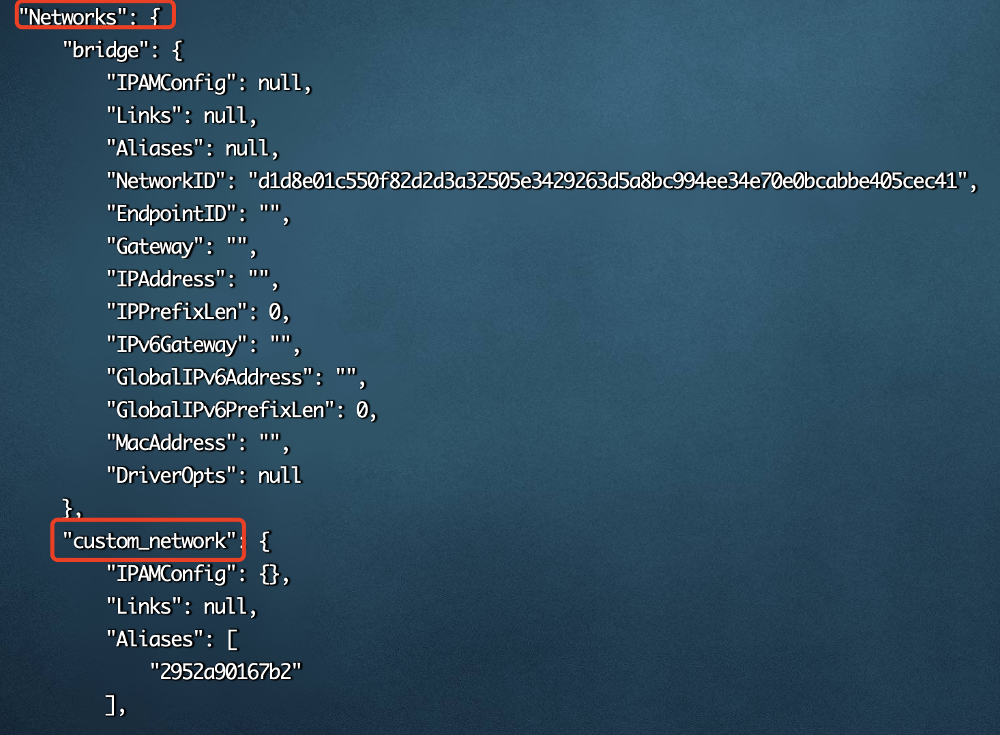

### 3. 断开网络

```bash
docker network disconnect custom_network mybox
```

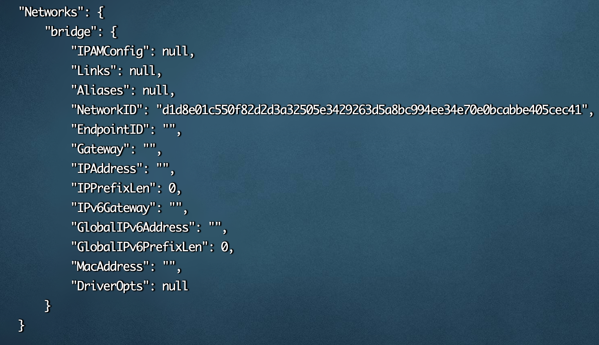

再次查看容器的网络信息，发现只剩下默认的 `bridge`网络了

### 4. 移除网络

可以通过 `docker network rm 网络名称` 命令移除`自定义`的网络，网络移除成功则会返回自定义的网络名称。

```bash
docker network rm custom_network
```

如果某个自定义网络模式被创建的容器使用了，则该网络模式无法被删除。

```bash
[root@common-server ~]# docker network rm custom_network
Error response from daemon: error while removing network: network custom_network id 0994c160a8eac25d32e9047a39cff7d8aff8524040fd1180a97109b061f28aec has active endpoints
[root@common-server ~]# docker stop custombox 
custombox
[root@common-server ~]# docker network rm custom_network
custom_network
```

## 三、容器间的网络通信

接下来我们通过所学的知识实现容器间的网络通信。首先明确一点，容器之间要想互相通信，必须要有属于同一个网络的网卡。

1. 我们先创建两个基于默认的 `bridge` 网络模式的容器

```bash
docker run -di --name=box busybox

docker run -di --name=otherbox busybox
```

2. 通过 `docker network inspect bridge` 查看两容器的具体 `ip` 信息

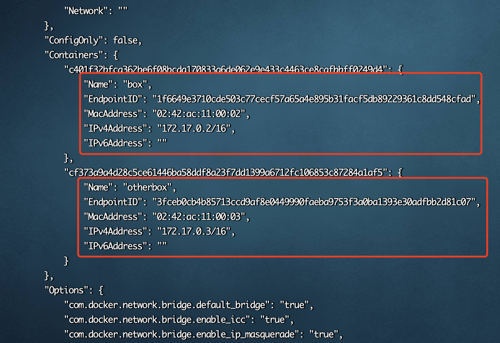

可以看到容器`box`的 ip 地址为`172.17.0.2`，容器`otherbox`的`ip`地址为`172.17.0.3`

3. 然后测试两容器间是否可以进行网络通信

```bash
//容器box ping 容器otherbox
docker exec -it box ping -c3 172.17.0.3

//容器otherbox ping 容器box
docker exec -it otherbox ping -c3 172.17.0.2
```

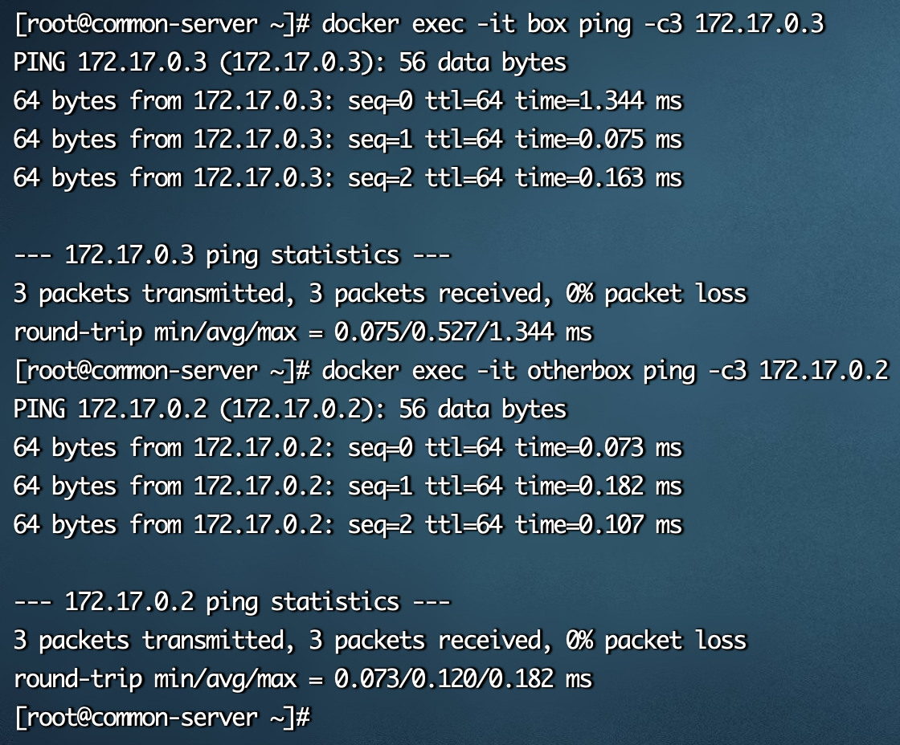

经过测试，从结果得知两个属于同一个网络的容器是可以互相进行网络通信的，但是由于容器经常会被删除和创建，其 IP 地址经常会发生变化，是不固定的。那容器内所有通信的 IP 地址也需要进行更改，那么能否使用固定的容器名称进行网络通信呢？我们接着继续测试

```bash
//容器box ping 容器otherbox
docker exec -it box ping -c3 otherbox

//容器otherbox ping 容器box
docker exec -it otherbox ping -c3 box
```


经过测试，从结果得知使用容器名称进行网络通信是不行的，那怎么实现这个功能呢？

前面说过，从 `Docker 1.10` 版本开始，`docker daemon` 实现了一个内嵌的 `DNS server`，使容器可以直接通过容器名称通信。方法很简单，只要在创建容器时使用 `--name` 为容器命名即可。

但是使用 `Docker DNS` 有个限制：只能在 `user-defined` 网络中使用。也就是说，默认的 `bridge` 网络是无法使用 `DNS` 的，所以我们就需要自定义网络。

4. 我们先基于 `bridge` 网络模式创建自定义网络 `custom_network`，然后创建两个基于`custom_network`自定义网络模式的容器

```bash
//创建自定义网络
docker network create custom_network

//基于自定义网络创建容器
docker run -di --name=custombox1 --net custom_network busybox
docker run -di --name=custombox2 --net custom_network busybox
```

5. 通过 `docker network inspect custom_network` 查看两容器的具体 `ip` 信息

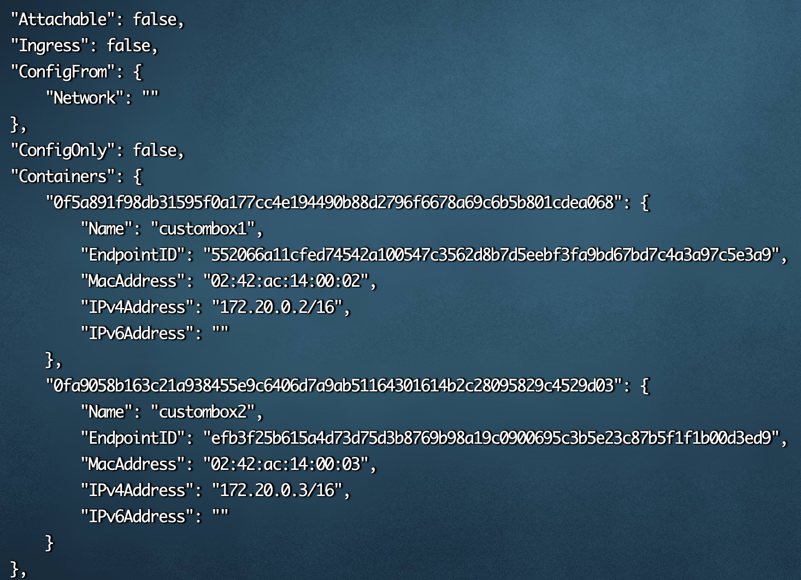

6. 然后测试两容器间是否可以通过网络名称进行网络通信，分别使用具体 `ip` 和容器名称进行网络通信

```bash
//通过容器ip地址，容器custombox1 ping 容器custombox2
docker exec -it custombox1 ping -c3 172.20.0.3

//通过容器名称，容器custombox1 ping 容器custombox2
docker exec -it custombox1 ping -c3 custombox2
```

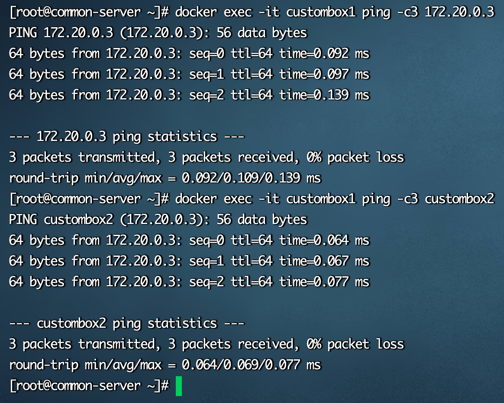

经过测试，从结果得知两个属于同一个自定义网络的容器是可以进行网络通信的，并且可以使用容器名称进行网络通信。

那如果此时我希望 `bridge` 网络下的容器也可以和 `custom_network` 网络下的容器进行网络又该如何操作？其实答案也非常简单：给 `bridge` 网络下的容器再添加一个新的 `custom_network` 网络即可。

```bash
//为容器box添加custom_network网络
docker network connect custom_network box

//容器custombox1 ping 容器box
docker exec -it custombox1 ping -c3 box

//容器box ping 容器custombox1
docker exec -it box ping -c3 custombox1
```

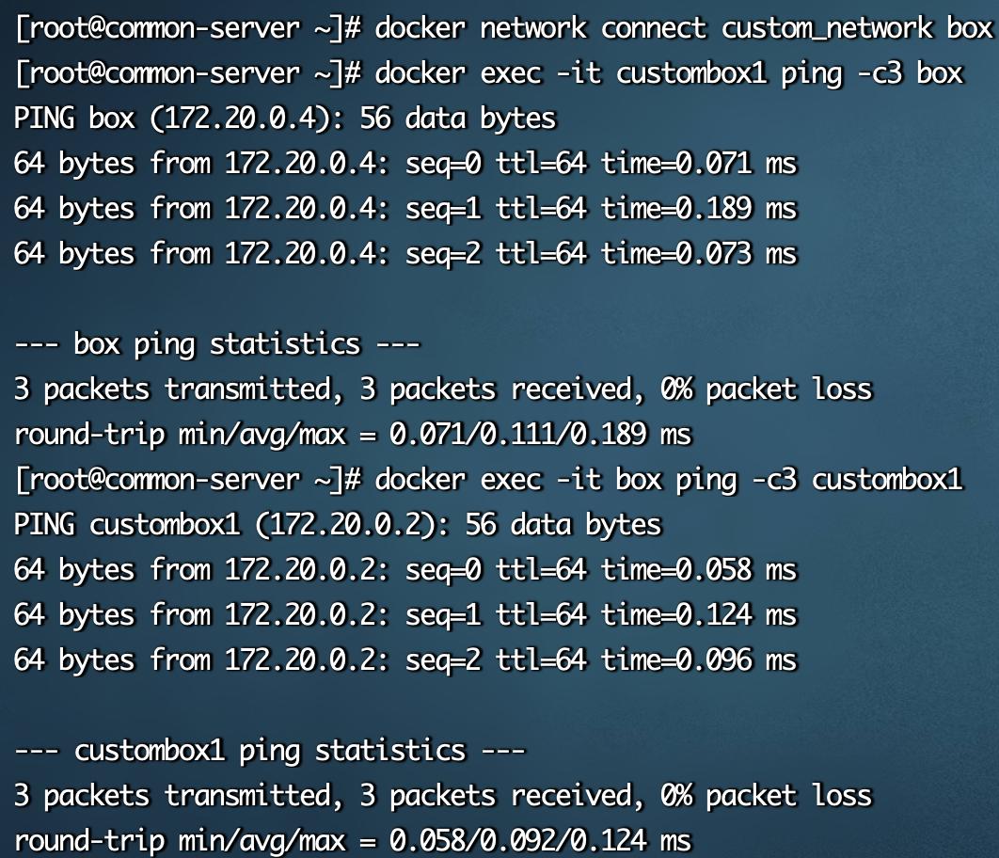
