# 中断系统

<!-- START doctoc generated TOC please keep comment here to allow auto update -->
<!-- DON'T EDIT THIS SECTION, INSTEAD RE-RUN doctoc TO UPDATE -->

- [一、概述](#%E4%B8%80%E6%A6%82%E8%BF%B0)
    - [1. 引起中断的各种因素](#1-%E5%BC%95%E8%B5%B7%E4%B8%AD%E6%96%AD%E7%9A%84%E5%90%84%E7%A7%8D%E5%9B%A0%E7%B4%A0)
    - [2. 中断系统需要解决的问题](#2-%E4%B8%AD%E6%96%AD%E7%B3%BB%E7%BB%9F%E9%9C%80%E8%A6%81%E8%A7%A3%E5%86%B3%E7%9A%84%E9%97%AE%E9%A2%98)
- [二、中断请求标记和中断判优逻辑](#%E4%BA%8C%E4%B8%AD%E6%96%AD%E8%AF%B7%E6%B1%82%E6%A0%87%E8%AE%B0%E5%92%8C%E4%B8%AD%E6%96%AD%E5%88%A4%E4%BC%98%E9%80%BB%E8%BE%91)
    - [1. 中断请求标记INTR](#1-%E4%B8%AD%E6%96%AD%E8%AF%B7%E6%B1%82%E6%A0%87%E8%AE%B0intr)
    - [2. 中断判优逻辑](#2-%E4%B8%AD%E6%96%AD%E5%88%A4%E4%BC%98%E9%80%BB%E8%BE%91)
        - [2.1 硬件实现(排队器)](#21-%E7%A1%AC%E4%BB%B6%E5%AE%9E%E7%8E%B0%E6%8E%92%E9%98%9F%E5%99%A8)
        - [2.2 软件实现(程序查询)](#22-%E8%BD%AF%E4%BB%B6%E5%AE%9E%E7%8E%B0%E7%A8%8B%E5%BA%8F%E6%9F%A5%E8%AF%A2)
- [三、中断服务程序入口地址的寻找](#%E4%B8%89%E4%B8%AD%E6%96%AD%E6%9C%8D%E5%8A%A1%E7%A8%8B%E5%BA%8F%E5%85%A5%E5%8F%A3%E5%9C%B0%E5%9D%80%E7%9A%84%E5%AF%BB%E6%89%BE)
    - [1. 硬件向量法](#1-%E7%A1%AC%E4%BB%B6%E5%90%91%E9%87%8F%E6%B3%95)
    - [2. 软件查询法](#2-%E8%BD%AF%E4%BB%B6%E6%9F%A5%E8%AF%A2%E6%B3%95)
- [四、中断响应](#%E5%9B%9B%E4%B8%AD%E6%96%AD%E5%93%8D%E5%BA%94)
    - [1. 响应中断的条件](#1-%E5%93%8D%E5%BA%94%E4%B8%AD%E6%96%AD%E7%9A%84%E6%9D%A1%E4%BB%B6)
    - [2. 响应中断的时间](#2-%E5%93%8D%E5%BA%94%E4%B8%AD%E6%96%AD%E7%9A%84%E6%97%B6%E9%97%B4)
    - [3. 中断隐指令](#3-%E4%B8%AD%E6%96%AD%E9%9A%90%E6%8C%87%E4%BB%A4)
        - [3.1 包含程序断点](#31-%E5%8C%85%E5%90%AB%E7%A8%8B%E5%BA%8F%E6%96%AD%E7%82%B9)
        - [3.2 寻找服务程序入口地址](#32-%E5%AF%BB%E6%89%BE%E6%9C%8D%E5%8A%A1%E7%A8%8B%E5%BA%8F%E5%85%A5%E5%8F%A3%E5%9C%B0%E5%9D%80)
        - [3.3 硬件关中断](#33-%E7%A1%AC%E4%BB%B6%E5%85%B3%E4%B8%AD%E6%96%AD)
- [五、保护现场和恢复现场](#%E4%BA%94%E4%BF%9D%E6%8A%A4%E7%8E%B0%E5%9C%BA%E5%92%8C%E6%81%A2%E5%A4%8D%E7%8E%B0%E5%9C%BA)
- [六、多重中断](#%E5%85%AD%E5%A4%9A%E9%87%8D%E4%B8%AD%E6%96%AD)
    - [1. 多重中断的概念](#1-%E5%A4%9A%E9%87%8D%E4%B8%AD%E6%96%AD%E7%9A%84%E6%A6%82%E5%BF%B5)
    - [2. 实现多重中断的条件](#2-%E5%AE%9E%E7%8E%B0%E5%A4%9A%E9%87%8D%E4%B8%AD%E6%96%AD%E7%9A%84%E6%9D%A1%E4%BB%B6)
    - [3. 屏蔽技术](#3-%E5%B1%8F%E8%94%BD%E6%8A%80%E6%9C%AF)
        - [3.1 屏蔽触发器的作用](#31-%E5%B1%8F%E8%94%BD%E8%A7%A6%E5%8F%91%E5%99%A8%E7%9A%84%E4%BD%9C%E7%94%A8)
        - [3.2 屏蔽字](#32-%E5%B1%8F%E8%94%BD%E5%AD%97)
        - [3.3 屏蔽技术可改变处理优先等级](#33-%E5%B1%8F%E8%94%BD%E6%8A%80%E6%9C%AF%E5%8F%AF%E6%94%B9%E5%8F%98%E5%A4%84%E7%90%86%E4%BC%98%E5%85%88%E7%AD%89%E7%BA%A7)
        - [3.4 新屏蔽字的设置](#34-%E6%96%B0%E5%B1%8F%E8%94%BD%E5%AD%97%E7%9A%84%E8%AE%BE%E7%BD%AE)
    - [4. 多重中断的断点保护](#4-%E5%A4%9A%E9%87%8D%E4%B8%AD%E6%96%AD%E7%9A%84%E6%96%AD%E7%82%B9%E4%BF%9D%E6%8A%A4)

<!-- END doctoc generated TOC please keep comment here to allow auto update -->

[TOC]

## 一、概述

中断在输入输出的时候已经有提到过，事实上中断不仅可以用在输入输出上，还可以用在系统调试等地方。

### 1. 引起中断的各种因素

1. 人为设置的中断：如转管指令。
2. 程序性事故：在指令或程序的运行过程中出现溢出、操作码不能识别、除法非法等。
3. 硬件故障：电源掉电等。
4. I/O设备：这个之前讲过了。
5. 外部事件：用键盘中断现行程序等。

### 2. 中断系统需要解决的问题

1. 各个中断源如何向CPU提出请求？
2. 各个中断源同时提出请求怎么办？
3. CPU什么条件、什么时间、以什么方式响应中断？
4. 中断结束后要返回继续执行原程序，如何包含断点和现场？
5. 如何寻找中断服务程序的入口地址？
6. 如何恢复现场，如何返回？
7. 处理中断的过程中又出现了新的中断怎么办？

这些问题一般是软件+硬件实现。

## 二、中断请求标记和中断判优逻辑

> 我们先解决各个中断源如何向CPU提出请和同时提出请求的问题。

### 1. 中断请求标记INTR

给每个中断源设置一个中断触发器INTR，通过这个触发器来判断这个中断源是否发出了中断请求。

多个INTR组成中断请求标记寄存器，下图举例：

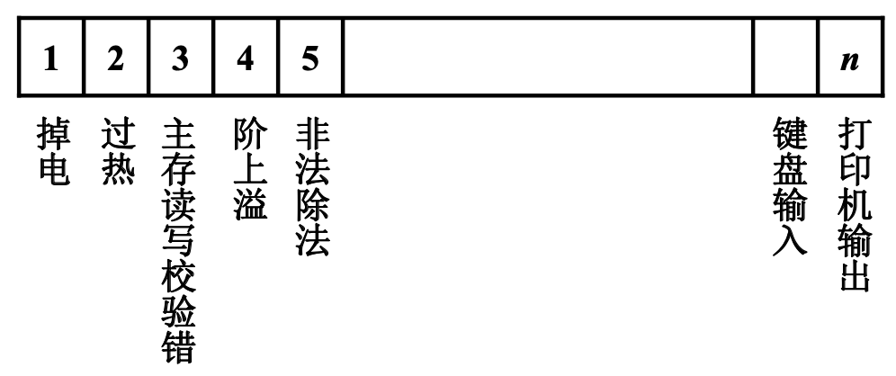

每个标记表示一种状态，INTR可以分散在各个中断源的接口电路中，逻辑上组成一个寄存器，也可以集中在CPU的中断小系统内。

### 2. 中断判优逻辑

有多个中断源同时发出中断请求，该响应哪一个呢？通常我们会根据中断源的重要性给中断源的中断请求划分优先级，这个分级就中断源的有分级，会通过中断判优逻辑来确定在现有的中断请求源当中，哪个中断源优先级最高，就响应哪个中断源。

判优逻辑分为硬件实现和软件实现，但目前大多数计算机都是通过硬件实现的。

#### 2.1 硬件实现(排队器)

硬件实现(排队器)又分两种：

1. 排队器分散在各个中断源的接口电路中，如之前介绍过的[链式排队器](输入输出设备-下.md#32-排队器)。
1. 集中在CPU内，或者在CPU外的某一个专门负责判优的机构里。

如下图是一个排队器的栗子，排队器的输出只有1位是有效的，且优先级低的INTR只有在优先级高的INTR没有输入的情况下才有效。

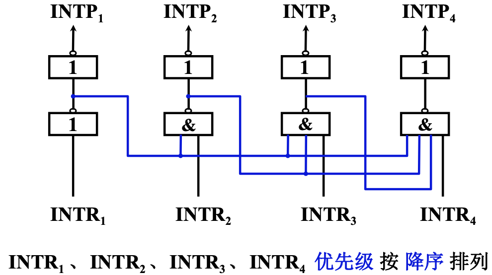

#### 2.2 软件实现(程序查询)

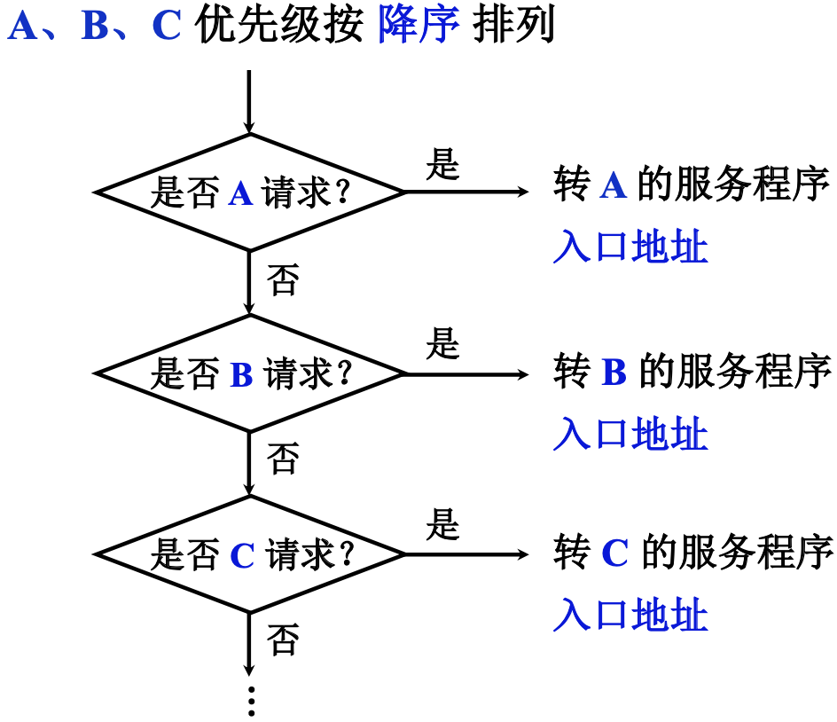

## 三、中断服务程序入口地址的寻找

> 接下来我们解决如何找到中断服务程序的入口地址的问题

### 1. 硬件向量法

所谓硬件向量法，就是用硬件的方式来形成中断向量：

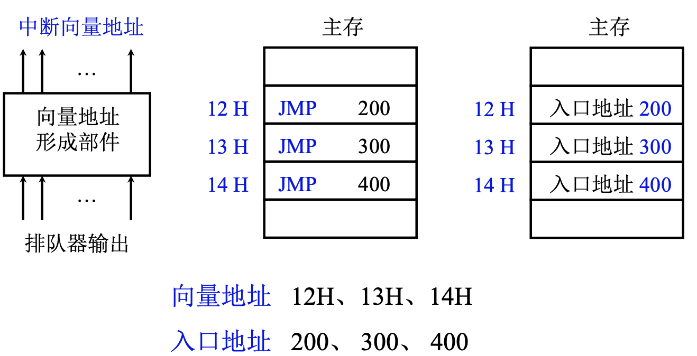

排队器的输出是只有一位有效的，只有优先级高的中断源能提出有效中断请求，优先级低的即使提出了也会被高优先级的屏蔽。

将排队器的输出给到向量形成部件，向量形成部件根据输入形成向量地址。

向量地址有两种办法给出：

1. 在中断向量地址的存储单元中存放一条跳转指令(JMP)，这条跳转指令中包含了中断服务的入口地址。
2. 在中断向量地址的存储单元中存放中断服务入口地址，要将这个地址送入到PC中，去执行中断服务程序。

这种方法速度快，但是设计灵活性低。

### 2. 软件查询法

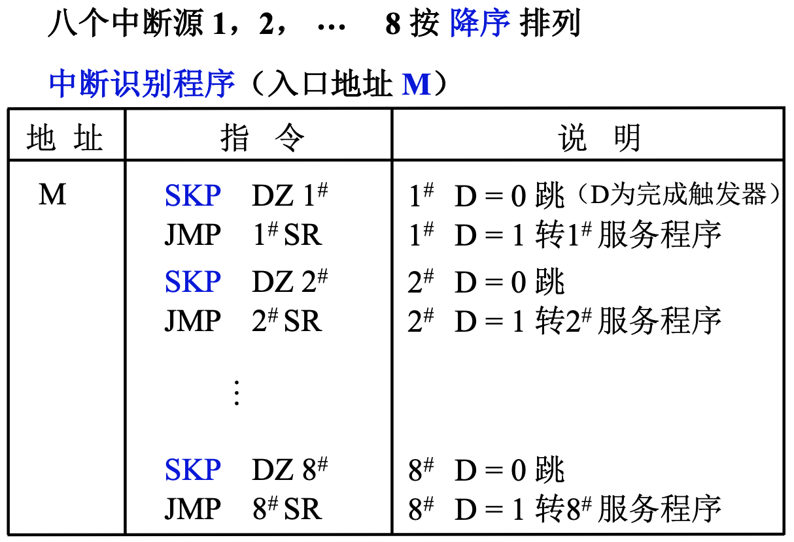

SKP指令是指跳过下一条指令，SKP DZ 1#表示 如果 D=0就跳过下一条指令。

## 四、中断响应

> CPU在什么时间、什么条件下响应中断？
> CPU在任何条件下都要立即响应中断吗？
> CPU在任何时间都能响应中断吗？
> 如果需要响应某个中断请求，CPU如何响应中断请求？

### 1. 响应中断的条件

是否只要发出了中断请求，那么就能进行响应呢？

如果CPU只能支持单重中断，CPU在响应某一个中断源的中断请求，且开始执行中断服务程序的情况下，即使有新的中断源发出新的中断请求，CPU也不会对其进行响应。

为了标识CPU是否允许响应中断请求，在CPU中有一个允许中断触发器EINT，当EINT=1时，允许CPU响应中断源发出的中断请求。

### 2. 响应中断的时间

一般而言，CPU只有在指令的执行结束阶段后才能响应中断请求。

有些机器的CPU的指令可能会比较复杂，执行时间比较长，为了及时处理一些异常事件，允许CPU在执行指令的过程中执行中断响应。

指令执行周期结束时刻由CPU发查询信号，这个查询信号送到每一个INTR(中断请求触发器)中，然后将中断请求信号发送到排队电路。

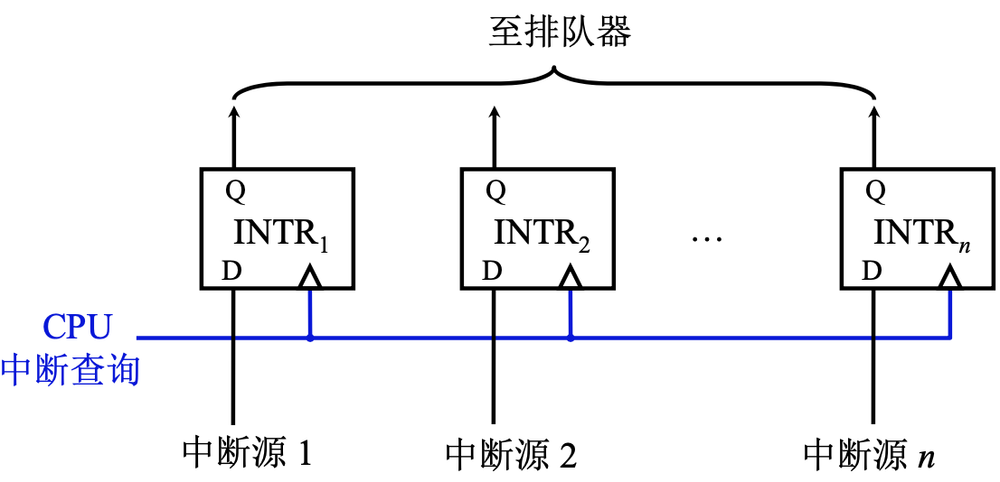

### 3. 中断隐指令

响应中断服务，一是要去执行中断服务程序，二为将来的中断返回做准备：保护程序断点和程序运行的软硬件状态。另外对应单中断CPU，在执行中断服务程序时不允许有新的中断请求打断正在执行的中断服务程序，即使是在允许多重中断的CPU中也不允许低优先级的服务中断请求打断正在执行的高优先级中断服务程序。

#### 3.1 包含程序断点

断点的保护有2种方法，一种是将断点或中断返回后要执行的指令保存到一个特定的内存地址；也可以把程序断点进栈。

#### 3.2 寻找服务程序入口地址

#### 3.3 硬件关中断

所谓关中断，就是将中断允许触发器置成0。关中断电路实现栗子：

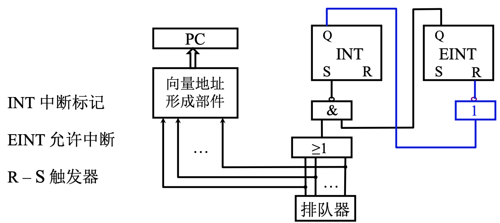

我们现在再来看一下这一小节的标题，中断隐指令，表示上面的3个步骤都是由计算机的硬件来完成的，并不是在某一条具体指令的驱动下完成的，也就是说中断隐指令并不是计算机指令集中的一条指令。

## 五、保护现场和恢复现场

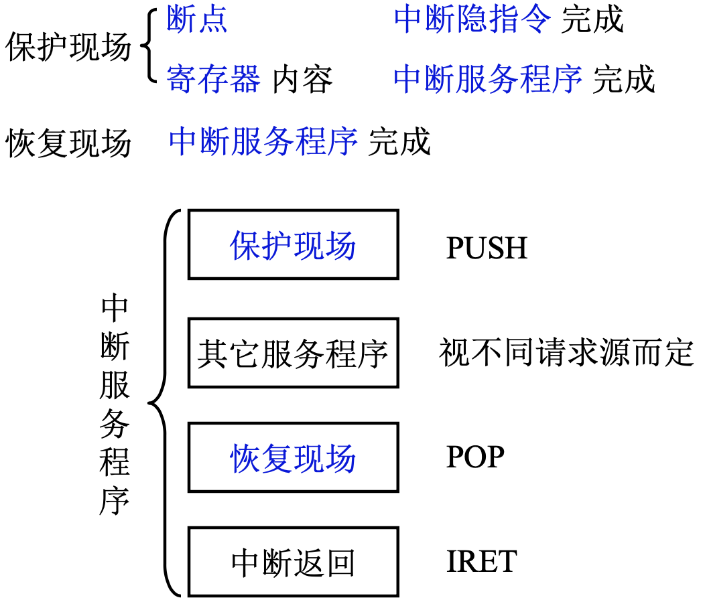

## 六、多重中断

> 如果在执行中断服务程序的过程中，出现了更重要的，需要及时处理的新事件，怎么办呢?

### 1. 多重中断的概念

多重中断是指CPU在执行中断服务程序时，出现新的、优先级更高的中断请求，那么CPU需要对这个中断请求进行响应。

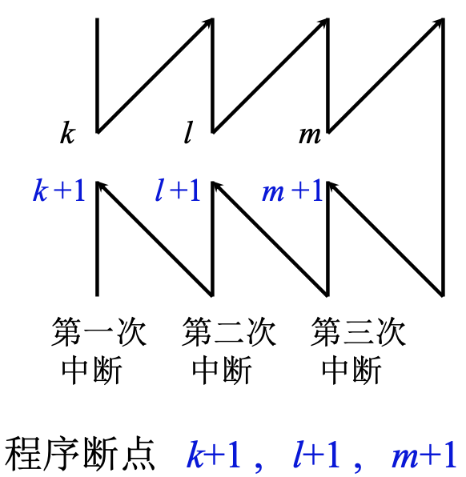

### 2. 实现多重中断的条件

1. 提前设置开中断指令：前面讲过响应中断的条件，CPU内部有一个允许中断触发器(EINT)，在中断服务响应过程中要想响应新的中断服务的话，EINT就要提前被打开，这样才能响应新的中断。
2. 优先级别搞的中断源有权中断优先级低的中断源：

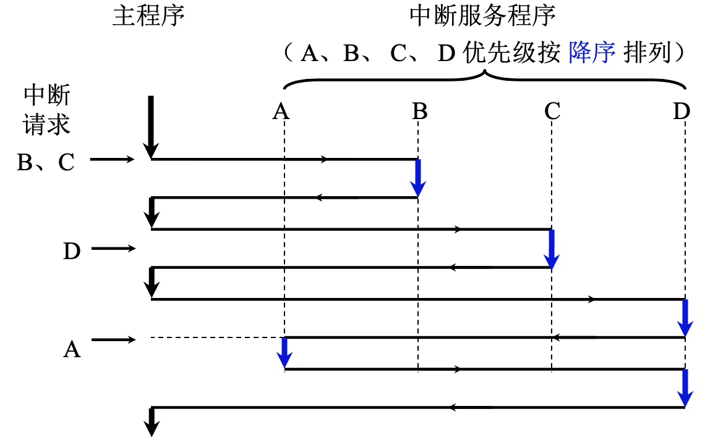

### 3. 屏蔽技术

可以使用中断屏蔽技术设置中断屏蔽字来改变中断服务的优先级，从而提高系统设计和响应的灵活性。

#### 3.1 屏蔽触发器的作用

中断屏蔽字要通过中断屏蔽触发器设置，这是在硬件上保存中断屏蔽字。

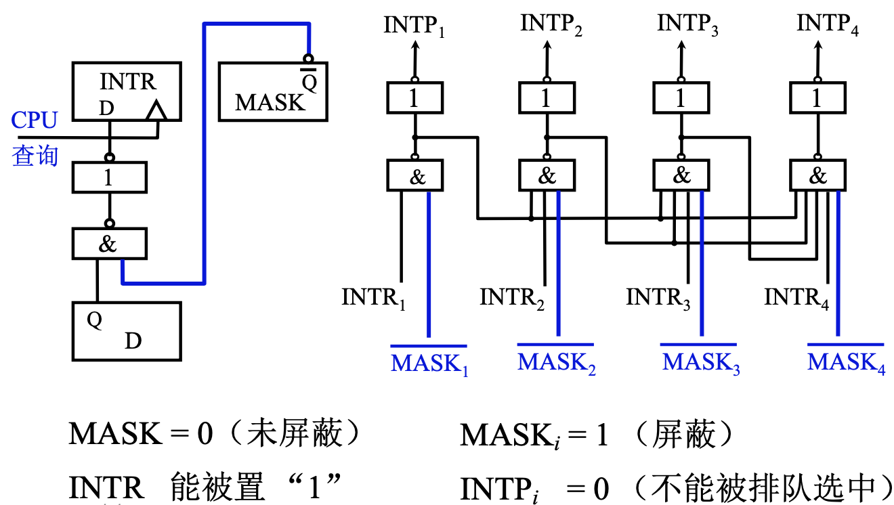

D：完成触发器，表示设备已经完成工作，要向设备提出中断请求。

这个中断请求要成功提出，MASK就要设置为0，表示没有被屏蔽。

上图右侧的图是之前介绍过的集中在CPU的排队器，这个排队器可以和中断屏蔽触发器结合进行使用，每个中断服务请求对应了一个中断屏蔽字，字的长度和中断源的个数相等，每个MASK对应中断屏蔽字中的一位。

#### 3.2 屏蔽字

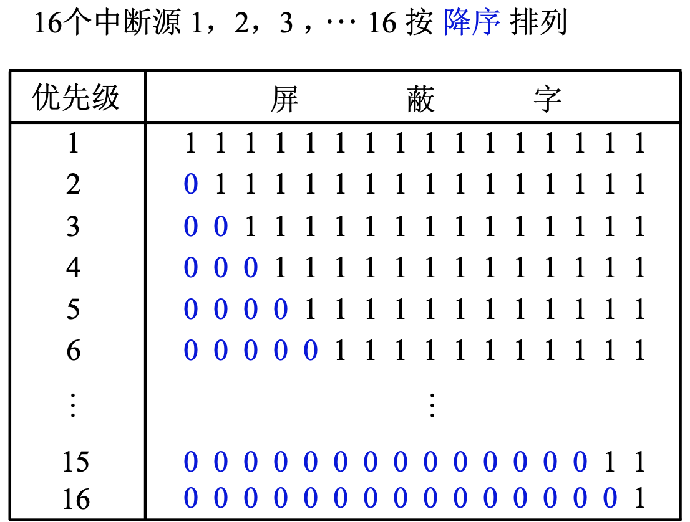

#### 3.3 屏蔽技术可改变处理优先等级

屏蔽技术可以改变处理优先级，不能改变响应优先级。响应优先级是硬件电路给出的，不可改变，处理优先级可通过重新设置屏蔽字，使中断源不能进入排队器进行排队，从而改变处理优先级。

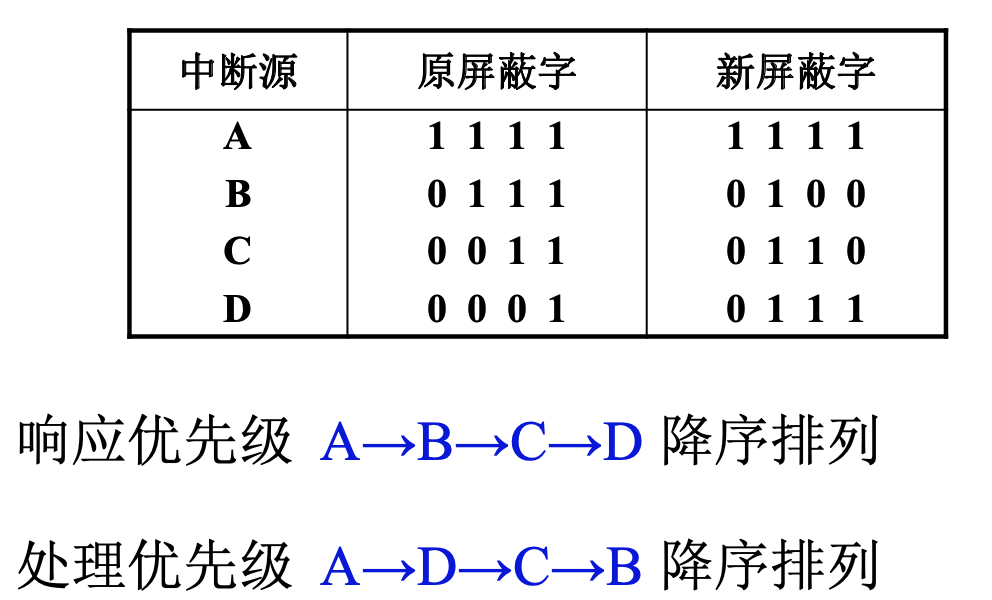

我们来看看究竟是怎么改变处理优先级的：

先来看看CPU执行程序原轨迹(原屏蔽字)：

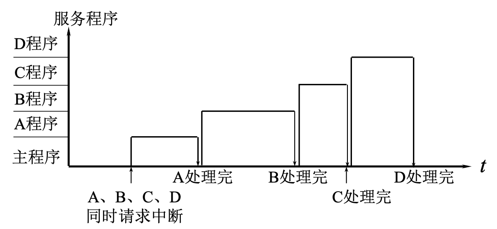

再来看看CPU执行程序新轨迹(新屏蔽字)：

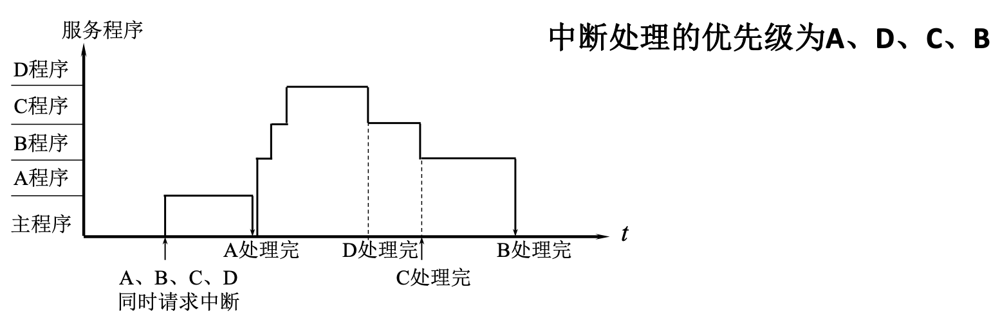

我们来简单分析一下：

1. ABCD同时请求中断；
2. A的优先级最高，响应A，屏蔽字被设置为A的屏蔽字，全1，BCD不能打断A的执行，A执行完后返回主程序；
3. 返回主程序，屏蔽字被置为主程序的屏蔽字，全0，表示谁都可以请求中断；
4. 此时B的响应优先级最高，响应B，屏蔽字被设置为B的屏蔽字，0100，对CD开放，可以打断B的执行；
5. 随着屏蔽字被修改，C的优先级最高，可以响应C的请求，屏蔽字被置为C的屏蔽字，0110，对AD开放，可以打断C的执行；
6. 此时D的响应优先级最高，响应D，屏蔽字被设置为D的屏蔽字，0111，对A开放，可以打断D的执行；
7. D处理完中断，返回C；
8. C处理完中断，返回B；
9. B处理完中断，返回主程序；

因此，得出来优先级为A>D>C>D，是不是非常简单！

#### 3.4 新屏蔽字的设置

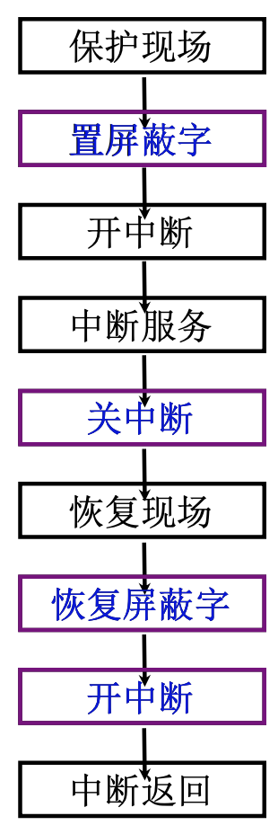

### 4. 多重中断的断点保护

1. 断点进栈：由中断隐指令完成。
2. 断点存入“0”地址：这个0是带引号的，不一定是真正的物理地址0，可以是某个特定的地址，也是有中断隐指令完成。

那么在中断周期我们要做下面几次操作：

1. 假如说我们把断点保存在了“0”地址，那么我们要把这个“0”地址送到MAR；
2. 命令存储器进行写操作；
3. 把断点写到“0”地址，断点在哪？在PC，保存了下一条要执行的指令的地址，因此要将PC的值送到MDR；
4. 再将MDR内容存入存储器。

但如果是在多重中断中就会出现问题：如果我们每次都将断点保存在**一个**“0”地址中，那么就会出现数据丢失。那么要如何解决呢？

解决方法如下：

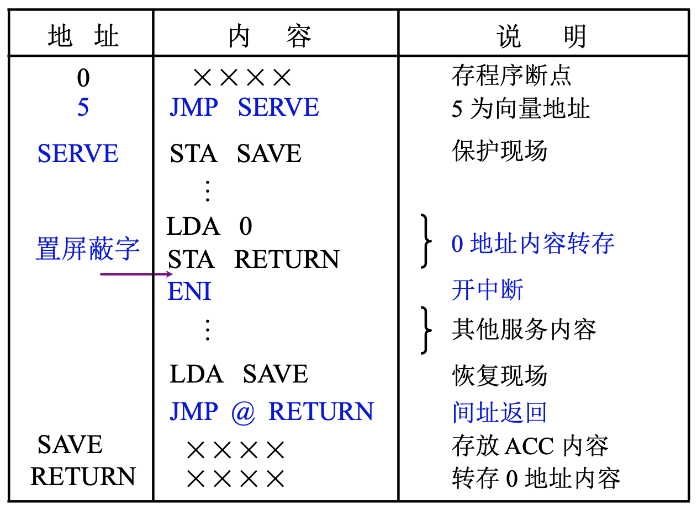

0是程序断点。

5是跳转指令，SERVE是程序中断服务入口地址。

STA SAVE表示将ACC寄存器中的内容保存到SAVE这个地址，进行现场保护。

LDA 0表示将地址为0的内存单元中的数据取出放入到ACC，即程序的断点，再通过STA RETURN将断点里的值又保存到了RETURN这个存储单元。这个过程完成了0地址内容转存，通过转存将程序的断点保护起来了。

这些都做完，执行开中断，然后执行相应的服务程序。

执行完中断服务程序，就要恢复线程，通过LAD SAVE将断点放回到ACC，因为之前我们把ACC的内容存到是SAVE中。

之后再通过一条间接跳转指令 JMP @ RETURN(这条指令不是跳到RETURN，而是跳到RETURN内存单元中保存的地址)，这个地址就是程序的断点，就是下一条要执行的指令。
