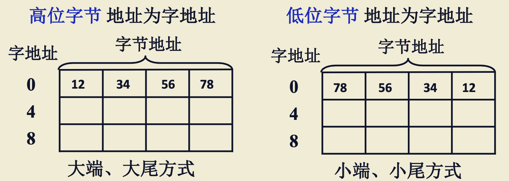

# 主存储器-上

<!-- START doctoc generated TOC please keep comment here to allow auto update -->
<!-- DON'T EDIT THIS SECTION, INSTEAD RE-RUN doctoc TO UPDATE -->

- [一、存储器分类](#%E4%B8%80%E5%AD%98%E5%82%A8%E5%99%A8%E5%88%86%E7%B1%BB)
    - [1. 按存储介质分类](#1-%E6%8C%89%E5%AD%98%E5%82%A8%E4%BB%8B%E8%B4%A8%E5%88%86%E7%B1%BB)
    - [2. 按存取方式分类](#2-%E6%8C%89%E5%AD%98%E5%8F%96%E6%96%B9%E5%BC%8F%E5%88%86%E7%B1%BB)
    - [3. 按在计算机中的作用分类](#3-%E6%8C%89%E5%9C%A8%E8%AE%A1%E7%AE%97%E6%9C%BA%E4%B8%AD%E7%9A%84%E4%BD%9C%E7%94%A8%E5%88%86%E7%B1%BB)
- [二、存储器的层次结构](#%E4%BA%8C%E5%AD%98%E5%82%A8%E5%99%A8%E7%9A%84%E5%B1%82%E6%AC%A1%E7%BB%93%E6%9E%84)
    - [1. 存储器三个主要特征的关系](#1-%E5%AD%98%E5%82%A8%E5%99%A8%E4%B8%89%E4%B8%AA%E4%B8%BB%E8%A6%81%E7%89%B9%E5%BE%81%E7%9A%84%E5%85%B3%E7%B3%BB)
    - [2. 缓存-主存层次和主存-辅存层次](#2-%E7%BC%93%E5%AD%98-%E4%B8%BB%E5%AD%98%E5%B1%82%E6%AC%A1%E5%92%8C%E4%B8%BB%E5%AD%98-%E8%BE%85%E5%AD%98%E5%B1%82%E6%AC%A1)
- [三、主存储器概述](#%E4%B8%89%E4%B8%BB%E5%AD%98%E5%82%A8%E5%99%A8%E6%A6%82%E8%BF%B0)
    - [1. 主存的基本组成](#1-%E4%B8%BB%E5%AD%98%E7%9A%84%E5%9F%BA%E6%9C%AC%E7%BB%84%E6%88%90)
    - [2. 主存和CPU的联系](#2-%E4%B8%BB%E5%AD%98%E5%92%8Ccpu%E7%9A%84%E8%81%94%E7%B3%BB)
    - [3. 主存中存储单元地址的分配](#3-%E4%B8%BB%E5%AD%98%E4%B8%AD%E5%AD%98%E5%82%A8%E5%8D%95%E5%85%83%E5%9C%B0%E5%9D%80%E7%9A%84%E5%88%86%E9%85%8D)
    - [4. 主存的技术指标](#4-%E4%B8%BB%E5%AD%98%E7%9A%84%E6%8A%80%E6%9C%AF%E6%8C%87%E6%A0%87)
- [四、半导体芯片简介](#%E5%9B%9B%E5%8D%8A%E5%AF%BC%E4%BD%93%E8%8A%AF%E7%89%87%E7%AE%80%E4%BB%8B)
    - [1. 半导体存储芯片的基本结构](#1-%E5%8D%8A%E5%AF%BC%E4%BD%93%E5%AD%98%E5%82%A8%E8%8A%AF%E7%89%87%E7%9A%84%E5%9F%BA%E6%9C%AC%E7%BB%93%E6%9E%84)
    - [2. 片选线的作用](#2-%E7%89%87%E9%80%89%E7%BA%BF%E7%9A%84%E4%BD%9C%E7%94%A8)
    - [3. 半导体存储芯片的译码驱动方式](#3-%E5%8D%8A%E5%AF%BC%E4%BD%93%E5%AD%98%E5%82%A8%E8%8A%AF%E7%89%87%E7%9A%84%E8%AF%91%E7%A0%81%E9%A9%B1%E5%8A%A8%E6%96%B9%E5%BC%8F)
        - [3.1 线选法](#31-%E7%BA%BF%E9%80%89%E6%B3%95)
        - [3.2 重合法](#32-%E9%87%8D%E5%90%88%E6%B3%95)
        - [3.3 线选法和重合法对比](#33-%E7%BA%BF%E9%80%89%E6%B3%95%E5%92%8C%E9%87%8D%E5%90%88%E6%B3%95%E5%AF%B9%E6%AF%94)
- [五、动态RAM刷新](#%E4%BA%94%E5%8A%A8%E6%80%81ram%E5%88%B7%E6%96%B0)
    - [1. 集中刷新](#1-%E9%9B%86%E4%B8%AD%E5%88%B7%E6%96%B0)
    - [2. 分散周期](#2-%E5%88%86%E6%95%A3%E5%91%A8%E6%9C%9F)
    - [3. 分散式刷新与集中式刷新相结合(异步刷新)](#3-%E5%88%86%E6%95%A3%E5%BC%8F%E5%88%B7%E6%96%B0%E4%B8%8E%E9%9B%86%E4%B8%AD%E5%BC%8F%E5%88%B7%E6%96%B0%E7%9B%B8%E7%BB%93%E5%90%88%E5%BC%82%E6%AD%A5%E5%88%B7%E6%96%B0)

<!-- END doctoc generated TOC please keep comment here to allow auto update -->

[TOC]

## 一、存储器分类

### 1. 按存储介质分类

1. 半导体存储器：TTL、MOS；易失；
2. 磁表面存储器：磁头、磁载体；非易失；
3. 磁芯存储器：硬磁材料、环状元件；非易失
4. 光盘存储器：激光、激光材料；非易失。

### 2. 按存取方式分类

1. 存取时间与物理地址无关(随机访问)
    - 随机存储器：在程序的执行过程中可读可写；
    - 只读存储器：在程序执行过程中只读；
2. 存取时间与物理地址有关(串行访问)
    - 顺序存取存储器：磁带；
    - 直接存取存储器：磁盘。

### 3. 按在计算机中的作用分类

## 二、存储器的层次结构

### 1. 存储器三个主要特征的关系

### 2. 缓存-主存层次和主存-辅存层次

缓存-主存层次：采用硬件的方式把缓存和主存连接起来，对系统、机器语言程序员透明；此层次是为了解决速度问题而存在的，因此采用硬件的方式连接缓存和主存；

主存-辅存层次：采用软硬件结合方式连接；主存和辅存是为了解决容量问题，速度相对而言不是主要的，因此采用软硬件结合的方式来连接二者。

> 主存和辅存组成的整体一般称为**虚拟存储器**，那虚拟存储器的空间如何定义呢？使用主存的空间来定义，还是用辅存的地址来定义？

答：使用一个新定义”**虚地址**“，也就是逻辑地址。

> 那缓存和主存之间使用什么地址？

答：使用**主存地址**。缓存是按内容查找的。

## 三、主存储器概述

### 1. 主存的基本组成

MAR保存了要访问的存储单元的地址，需要经过译码器进行译码才能选定要访问的存储单元；

MDR保存了要读出或者写入的数据，MDR中的数据究竟是写入还是读出，通过读写电路和控制电路来控制。

### 2. 主存和CPU的联系

CPU和主存的连接主要是三种信号：

1. 数据总线：完成CPU和主存的数据传输，直接连在MDR，实现双向数据传输；

2. 地址总线：连接在MAR和主存的地址总线，是单向的；

3. 控制信号(读、写)：单向，由CPU给主存储器。

### 3. 主存中存储单元地址的分配

直接上栗子：

12345678H 这个数据如何在主存储器中进行存储?(H表示16进制)

可以采用以下两种方式：

> 12345678H是十六进制数，表示成二进制的话，一个数占4位，一共是32位，4个字节；
>
> 字节是数据存储的最小单位，所以一字节可以用来存储两个数；
>
> 因此存储方式是 12 34 56 78

### 4. 主存的技术指标

1. 存储容量：主存存放二进制代码的总位数
2. 存储速度
    - 存取时间：存取的访问时间，即存储器给出地址到得到稳定的数据输入或输出的这段时间；
    - 存取周期：**连续**完成两次独立存储器操作所需的**最小时间间隔**。

> 存取时间和存取周期是不一样的，一般而言，存取周期要比存取时间要长，原因是存储器在读写操作之后，要有一段恢复时间，即：存取时间 + 恢复时间 = 存取周期

3. 存储器的带宽：单位时间能读取/写入的数据量。

## 四、半导体芯片简介

### 1. 半导体存储芯片的基本结构

结构如上图所示，除了核心结构存储矩阵、姨妈驱动、读写电路外，还有一些接口：

1. 地址线接口：输入接口，CPU或外部设备给出地址，表示要存/取的数据在存储矩阵的哪个位置，通过译码驱动电路选择指定的存储单元完成读写操作；

2. 数据线：数据线是双向的；

3. 片选线：单向，芯片选择信号，指出了这次操作给出的地址是不是针对这个存储芯片的地址，被选择的存储单元是不是在这个芯片中；可以用CS(芯片选择信号)或CE(芯片使能信号)表示；

4. 读写控制线：单向，可能是一根，也可以是两根。一根线时，用WE表示，低电平写，高电平读；两根线时，OE表示读，WE表示写；

通过地址线和数据线计算芯片容量的方法示例：

| 地址线(单向) | 数据线(双向) | 芯片容量  |
| ------------ | ------------ | --------- |
| 10           | 4            | 1k × 4位  |
|              | 1            | 16k × 1位 |

> 计算方法：
>
> 地址线是10位，表示有2^10个存储单元；
>
> 数据线是4位，表示每个存储单元有4位数据；
>
> 那么芯片容量就是 2^10 × 4 位，2^10是1k，所以可以表示为1k × 4位

### 2. 片选线的作用

如何用 16K × 1位 的存储芯片组成 64K × 8位 的存储器？

1. 16K表示芯片容量是16K，每一个存储单元保存1位信息；

2. 如果有8片芯片同时读写，那么每片芯片就给出或者写入1位信息，8个芯片连在一起就构成了8位，我们将这8片芯片分成一组，这样这一组就构成了16K × 8位的存储器；
3. 我们再将16K × 8位的存储器布置4组，就成了64K × 8位的存储器；
4. 每一组芯片(8个)要同时工作才能满足要求的8位，为了让它们同时工作，我们就用片选线将它们连接在一起；
5. 然后我们再把这64K的空间进行划分：

> 第一组：分配0~16K-1的地址
>
> 第二组：分配16~32K-1的地址
>
> ...
>
> 第四组：分配48K~64K-1的地址

当地址为 65 535 时，第四组片选有效，第一、第二、第三组片选线的片选信号无效，第四组有效。

总结一下片选线的作用：可以让某一片或某一组芯片同时工作。

### 3. 半导体存储芯片的译码驱动方式

#### 3.1 线选法

如图所示，给出了A0~A3 4根地址线，表示芯片有16个存储单元；数据线是D0~D7，一个是8位，该存储器是16×8位的。

> 4根地址线，地址线有0/1两种状态，2^4是16，所以有16个存储单元。

地址译码器：这里涉及到数电的知识(我也不会)，只需要知道A0~A3输入4位就可以选中右边0~15中的一根线，其他的不会有信号；比如输入0000，线0就会有信号，其他线路无信号，输入0001，线1就会有信号，其他线路无信号，以此类推。

假设地址译码器输入信号为 0000，字线选中0，读写控制电路输入0000000，位线选中0，那么就会输出[0, 0]这个存储单元的数据。

存在问题：不适应于容量稍大的芯片。假设是一个1M×8的存储器，有20个地址线，经过地址译码器译码后，会译码出1M根字线，大约是100万根线，如果做在芯片中会非常密集，难以集成。

#### 3.2 重合法

将地址分为两部分：行地址X，列地址Y；行列地址分别译码，且只能有一条地址是有效的；

上图给出的芯片中，数据线只有1位，即存储单元的位数只有1位；

假如X地址给的是0，那么只有X0这条线是有效的，即只有[0, 0]~[0, 31]的存储单元是被选中的；

假如Y地址给的是0，那么只有Y0这条线是有效的，图中Y0对呀的开关会打开，[0, 0]这个数据会被输出；

#### 3.3 线选法和重合法对比

假如地址线是20根，则译码出来的线的条数是

- 线选法：2^20，100万条；
- 重合法：假设分为X10条，Y10条，则结果为 2^10 + 2^10 = 2K条。

## 五、动态RAM刷新

> 这里跳过了RAM的的实现原理和电路结构，因为我也不大会，就不写了。

动态RAM利用电容存储电荷的方式保存信息，电容很小，容易漏电，一段时间内如果不对电容内信息再生，其中内容会消失。

即一段时间不访问电容，其存储的 "1"会漏电成"0"，因此动态RAM要刷新。

> 刷新只与行地址有关；
>
> 给出行地址后，一个行就会被选中，一个行电路上的所有的基本单元电路信息都会被送到读数据线上；
>
> 如果在读数据线和写数据线之间加上一个刷新放大器，就可以完成对某一行的全部信息刷新。

### 1. 集中刷新

以下均以刷新周期为2毫秒(即动态RAM芯片中，所有的电容在这2毫秒内都要完成一次信息的再生)，以128×128列矩阵为例。

以下假设存取周期为0.5微秒：

2毫秒可以分为4000个存取周期，其中前3872个周期可以供CPU、I/O进行读写，后面的128个周期专用于刷新操作，CPU和I/O都无法与芯片进行交互，只能等待。我们将这128个周期称为”死区“，占整个周期的3.2%。

### 2. 分散周期

以下假设存取周期为1微秒：

TC = TM + TR = 1微秒，即一个存取周期；TM为读写操作，TR为刷新操作；即每次都写都伴随着一次刷新操作，则128个存取周期即可刷新所有电容。

这种方式没有”死区“，但加长了存取周期，芯片性能下降，且存在过度刷新的问题。

### 3. 分散式刷新与集中式刷新相结合(异步刷新)

以下假设存取周期为0.5微秒：

分析：2毫秒内要刷新128个电容，那么我们可以把2毫秒平均分为128份，即每份15.6微秒，这15.6微秒里分出其中一个存取周期用于刷新。相对一小份时间(15.6微秒)来说，是集中式刷新，相对于总体(2毫秒)来说，是分散式刷新。

这种方式的”死区“为0.5微秒，若将刷新安排在指令译码阶段，不会出现”死区“。