# 主存储器-下

<!-- START doctoc generated TOC please keep comment here to allow auto update -->
<!-- DON'T EDIT THIS SECTION, INSTEAD RE-RUN doctoc TO UPDATE -->

- [一、CPU与存储器的连接](#%E4%B8%80cpu%E4%B8%8E%E5%AD%98%E5%82%A8%E5%99%A8%E7%9A%84%E8%BF%9E%E6%8E%A5)
    - [1. 存储器容量扩展](#1-%E5%AD%98%E5%82%A8%E5%99%A8%E5%AE%B9%E9%87%8F%E6%89%A9%E5%B1%95)
        - [1.1 位扩展](#11-%E4%BD%8D%E6%89%A9%E5%B1%95)
        - [1.2 字扩展](#12-%E5%AD%97%E6%89%A9%E5%B1%95)
        - [1.3 字、位扩展](#13-%E5%AD%97%E4%BD%8D%E6%89%A9%E5%B1%95)
    - [2. 存储器与CPU的连接](#2-%E5%AD%98%E5%82%A8%E5%99%A8%E4%B8%8Ecpu%E7%9A%84%E8%BF%9E%E6%8E%A5)
- [二、存储器的校验](#%E4%BA%8C%E5%AD%98%E5%82%A8%E5%99%A8%E7%9A%84%E6%A0%A1%E9%AA%8C)
    - [1. 为什么要对存储器的信息进行校验？](#1-%E4%B8%BA%E4%BB%80%E4%B9%88%E8%A6%81%E5%AF%B9%E5%AD%98%E5%82%A8%E5%99%A8%E7%9A%84%E4%BF%A1%E6%81%AF%E8%BF%9B%E8%A1%8C%E6%A0%A1%E9%AA%8C)
    - [2. 汉明码](#2-%E6%B1%89%E6%98%8E%E7%A0%81)
        - [2.1 汉明码组成](#21-%E6%B1%89%E6%98%8E%E7%A0%81%E7%BB%84%E6%88%90)
        - [2.2 汉明码分组](#22-%E6%B1%89%E6%98%8E%E7%A0%81%E5%88%86%E7%BB%84)
        - [2.3 组成汉明码的三要素](#23-%E7%BB%84%E6%88%90%E6%B1%89%E6%98%8E%E7%A0%81%E7%9A%84%E4%B8%89%E8%A6%81%E7%B4%A0)
        - [2.4 汉明码配置栗子](#24-%E6%B1%89%E6%98%8E%E7%A0%81%E9%85%8D%E7%BD%AE%E6%A0%97%E5%AD%90)
        - [2.5 汉明码纠错过程](#25-%E6%B1%89%E6%98%8E%E7%A0%81%E7%BA%A0%E9%94%99%E8%BF%87%E7%A8%8B)
        - [2.6 汉明码纠错栗子](#26-%E6%B1%89%E6%98%8E%E7%A0%81%E7%BA%A0%E9%94%99%E6%A0%97%E5%AD%90)
- [三、提高访存速度的措施](#%E4%B8%89%E6%8F%90%E9%AB%98%E8%AE%BF%E5%AD%98%E9%80%9F%E5%BA%A6%E7%9A%84%E6%8E%AA%E6%96%BD)
    - [1. 单体多字系统](#1-%E5%8D%95%E4%BD%93%E5%A4%9A%E5%AD%97%E7%B3%BB%E7%BB%9F)
    - [2. 多体并行系统](#2-%E5%A4%9A%E4%BD%93%E5%B9%B6%E8%A1%8C%E7%B3%BB%E7%BB%9F)
        - [1. 高位交叉](#1-%E9%AB%98%E4%BD%8D%E4%BA%A4%E5%8F%89)
        - [2. 低位交叉](#2-%E4%BD%8E%E4%BD%8D%E4%BA%A4%E5%8F%89)
        - [3. 低位交叉特点](#3-%E4%BD%8E%E4%BD%8D%E4%BA%A4%E5%8F%89%E7%89%B9%E7%82%B9)

<!-- END doctoc generated TOC please keep comment here to allow auto update -->

[TOC]

## 一、CPU与存储器的连接

### 1. 存储器容量扩展

一般而言，CPU的地址线条数较多，寻址空间范围较大，要构成一个主存储器需要的芯片较多；

扩展主要包括三部分：位扩展、字扩展和字、位扩展。

#### 1.1 位扩展

位扩展是增加字长，我们直接看一个栗子：现在我们有 1K×4位 的芯片，如何组成 1K×8位 的存储器？

通过前面的知识，我们可以很容易得出解：用2片 1K×4位 的芯片，使用相同的片选，即可得到1K×8位 的存储器，那么这个存储器 如何与CPU连接呢？

连接如下图所示：

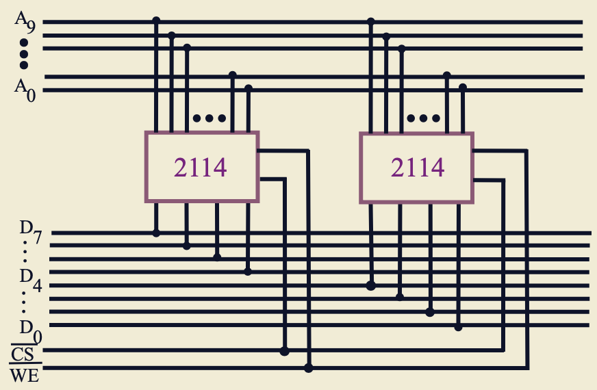

以2片2114芯片为例；

A0~A9是地址线，容量为1K，所以有10条地址线(2^10)，10根地址线同时与芯片相连；

D0~D7是数据线，8位，所以有8条，每一片芯片分别连接4根数据线；

CS是片选线，因为2片芯片要同时工作，所以必须连接同一根片选；

WE是读写信号。

> 思考：D0~D7是否可以乱序？
>
> 答案是可以的，只要不重复就行，输入顺序与读出顺序相同，因此存储在哪个存储单元并不重要。

#### 1.2 字扩展

字扩展是增加存储字的数量，我们还是看一个栗子：现在我们有 1K×8位 的芯片，如何组成 2K×8位 的存储器？

通过前面的知识，我们可以很容易得出解：用2片 1K×8位 的芯片，使用不同的片选线连接即可得到，下图展示如何与CPU连接：

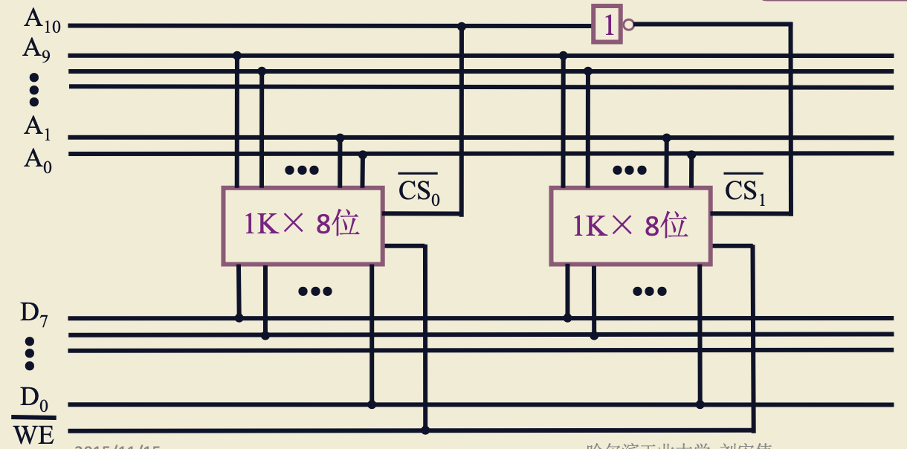

1K×8位的芯片需要10根地址线，10根地址线全部同时与2片芯片相连；

8位有8根数据线，全部同时与2片芯片相连；

2K有11根地址线(2^11)，多出的一根A10可以作为片选线CS，低电平的时候(0)其中芯片工作，高电平的时候另一片芯片工作；A10上的那个红色的方框1表示非门，取反；

WE是读写信号。

我们将0...(9个0)...0(一共11个0) ~ 0...1(9个1)...1(一共10个1)的地址分配给第一个芯片，将1...(9个0)...0(一共10个0) ~ 1...1(9个1)...1(一共11个1)的地址分配给第二个芯片。

#### 1.3 字、位扩展

顾名思义，是同事扩展字长和存储字的数量，我们继续看一个栗子：现在我们有 1K×4位 的芯片，如何组成 4K×8位 的存储器？

简单计算一下需要多少片芯片：4×8 = 32K位，32 ÷ (1×4) = 8，因此我们需要8片芯片；将这8片芯片先两两相连满足8位，再分成4组满足4K；

接下来我们看一下与CPU的连接图：

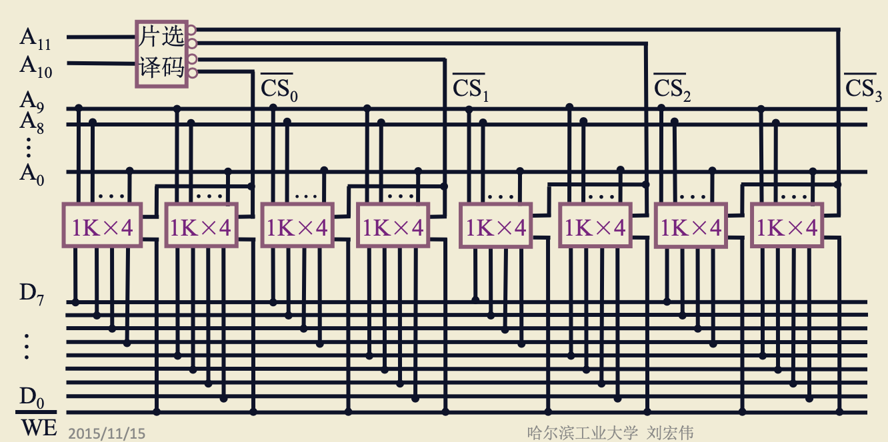

芯片是1K的，需要10根地址线，因此芯片先与A0~A9相连；

需要满足8位的使用要求，因此将芯片两两分组，分表接入数据线D0~D3，D4~D7；

4K的CPU有12根地址线，多出的2根A10、A11用作片选线，使用片选译码器(可以产生2^2=4种信号)译码出4根片选线CS0~CS4分别连接在4组芯片上，让这4组芯片在同一时间只有一组在工作，以此满足4K的要求；

WE是读写信号。

### 2. 存储器与CPU的连接

1. 地址线的连接：CPU给出地址，存储器要根据CPU给出的地址找到相应的存储单元；一般来说，地址的地位作为地址送入到存储器的地址线，高位作为芯片选择信号；
2. 数据线的连接：CPU的数据线的条数可能比存储器的位数要多，这时我们要做位扩展，使存储器的输出能满足CPU的要求；
3. 读/写命令线的连接：将读写线连接到每一个芯片，一般来说CPU给出读写命令，但ROM存储器除外，它只能读不能写；
4. 片选线的连接：片选线控制一次访问落在哪一片或几片芯片上；进行片选线的连接时，有2个要注意的点：
   - 要确认这次CPU操作，访问的存储器而不是I/O，因此存储器的访问信号一定要在片选信号体现；
   - 每一个内存的芯片，都有自己的地址范围，地址范围必须要满足CPU的要求，即每一根地址线都要用到，要保证每一个地址都是在访问范围内的；
5. 合理选择存储芯片：ROM和RAM要合理选择；保存系统程序和配置信息的地方一般选用ROM，因为不常改动；用户程序区和系统程序运行区，一般是可读可写的，因此一般用RAM；
6. 其他：时序、负载。

下面用一个栗子来理解一下。

现在要做CPU和存储器的连接，CPU有16根地址线，有8根数据线，MREQ作为访存信号(表示是否访问存储器)，存储芯片有RAM 1K×4位、4K×8位、8K×8位，ROM有 2K×8位4K×8位、8K×8位。存储器要求从6000H开始到67FFH是系统程序区，从6800开始到6BFFH是用户程序区；要求使用138译码器。

> 138译码器如下图
>
> 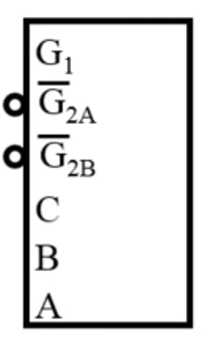
>
> 有3个输入：C、B、A，根据输入不同，8根地址线只有一个是有效的；
>
> 138译码器要想工作，G1、G2A、G2B要有输入，G1表示高电平有效，G2A和G2B表示低电平有效。

1. 写出对应的二进制地址码并确定使用的芯片类型

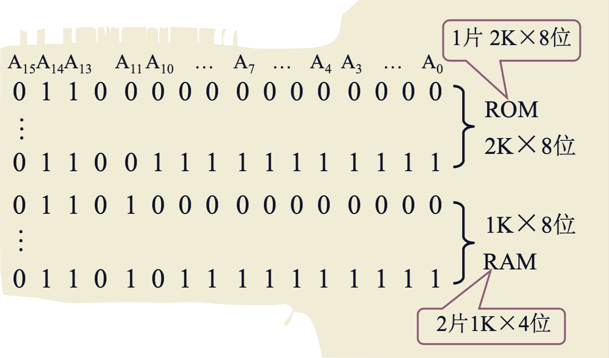

2. 分配地址线并确定片选信号

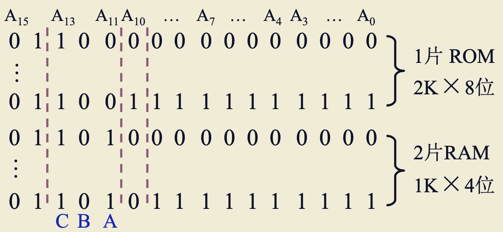

A10~A0接 2K×8位 ROM 的地址线；A9~A0接接 1K×4位 RAM 的地址线；

A13~A11分别接138译码器的C、B、A接口；

A14连接到138译码器的G1(高电平有效)；

A15连接到138译码器的G2A(低电平有效)；

MREQ连接到138译码器的G2B(低电平有效)；

最终，我们得到连接图如下：

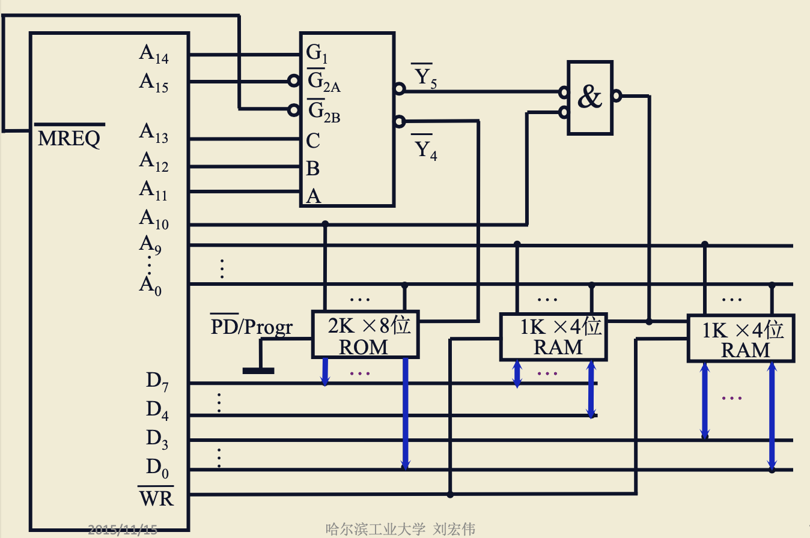

138译码器产生Y5和Y4，Y4低电平时，ROM工作，Y5低电平且A10低电平时，RAM工作。

ROM对数据线是单向的，RAM是双向的。

## 二、存储器的校验

### 1. 为什么要对存储器的信息进行校验？

以内存为例，内存是电子设备，信息保存在电容或触发器中；如果内存所处的电子环境比较复杂，或在空间环境下受到带电粒子的打击下，电容可能会充电或放电，触发器可能会发生翻转，存放在存储器中的信息就可能出错，所以要对存储器内的信息进行校验。

### 2. 汉明码

一般情况下，传输1位出错的概率是最大的，所以下面的内容，均以一位出错为前提。

#### 2.1 汉明码组成

1. 汉明码采用奇偶校验

> 奇偶校验
>
> 所谓的奇校验，就是给数据加上一个校验位，再加上原来的数据位，合在一起，使代码中1的个数是奇数个；
>
> 所谓的偶校验，就是给数据加上一个校验位，再加上原来的数据位，合在一起，使代码中1的个数是偶数个。

2. 汉明码采用分组校验

举一个分组奇偶校验栗子：

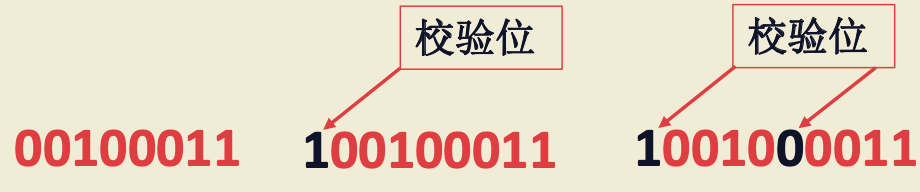

假设传输一个8位的数据 00100011，且采用偶校验；

单纯采用偶校验，则在数据的前面加上一个1，使得整个数据1的个数是偶数个；如果最后校验结果1的个数是奇数个，我们就认为这9位数发生了反转；

若采用分组校验，则可将数据分为两组：0010和0011，分别在两组数据前面加上校验位1和0，这样可以更精确的校验是哪里发生了错误。

3. 汉明码的分组是一种非划分方式

上面的例子是一种划分的分组方式，组和组之间没有重叠交叉；而汉明码是非划分方式，什么是非划分方式呢？我们还是举个栗子：

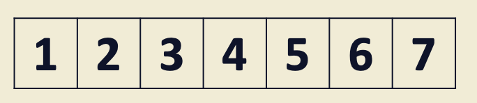

假设我们有7位数，分成3组，每组有一个校验位，共包括4位数据位，可以分成下面这种形式：

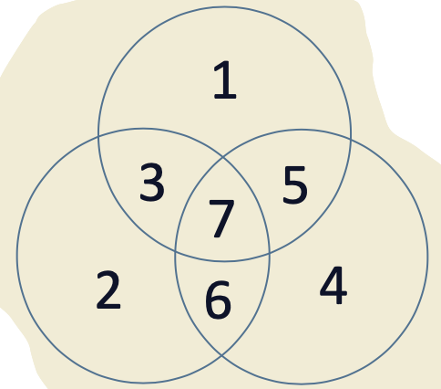

每一个圆代表一个分组；

1、2、4分别被分到了3组中，而且是每一组独有的一位；

1和2之间的位置放3，1和4之间的位置放5，2和4之间的位置放6，1、2、4之间的位置放7；

我们分成三组，每一组都是偶校验的方式，每组有4位数据，其中1位是校验位，它保障了每组数据1的个数是偶数个；

它的找错如下：

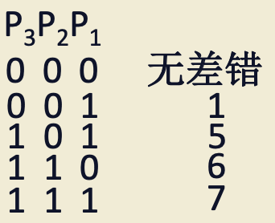

P1、P2、P3分表表示3组的校验结果，组内数据采用异或计算；再提一次，以下内容均以只错一位为前提进行计算。

| P3   |      | P1   | 结果及解释                                                   |
| ---- | ---- | ---- | ------------------------------------------------------------ |
|      | 0    | 0    | 无差错                                                       |
|      |      | 1    | 组1出错，因为只有组1出错，其他组没有出错，所以一定是组1独有的位出错，因此是数据1出错； |
| 1    | 0    |      | 组1、3出错，表示组1、3共同位出错，即数据5出错；              |
| 1    | 1    |      | 组2、3出错，表示组2、3共同位出错，即数据6出错；              |
| 1    | 1    | 1    | 组1、2、3出错，表示组1、2、3共同位出错，即数据7出错；        |

那么校验位应该放在哪里呢？

校验位放在1、2、4，至于为啥呢，后面会说。

如果我们将校验结果以二进制数表示，则该数给出了错的位置，如：

P3P2P1 = 000，无错；P3P2P1 = 001，数据1出错；P3P2P1 = 101，数据5出错...

> 妙啊

#### 2.2 汉明码分组

上面的栗子，分组依据是什么呢？我们来分析一下每组数据的位置特征：

组1的数据有：1、3、5、7，换算成二进制格式，发现最后一位都是1，即XXXX1；

组2的数据有：2、3、6、7，换算成二进制格式，发现倒数第二位位都是1，即XXX1X；

组3的数据有：4、5、6、7，换算成二进制格式，发现倒数第三位都是1，即XX1XX；

这个特征就是汉明码的编码规则；

我们可以发现，每一组比的其实就是1的那个位置，我们称为测试位；

其实每一组比较的也是测试位，如第一组的所有测试位异或为0，就表示没有错，如果得出结果是1，则表示出错了；

我们翻译测试位成十进制，可以得出测试位分别为：1、2、4...，这就是校验位的位置。

#### 2.3 组成汉明码的三要素

1. 汉明码的组成需增添几位检测位

检测位公式如下：
$$
2^k ≥ n + k + 1
$$
k：检测位个数，即分组数，要求一个分组有一个检测位，能指出是哪一位出错；

n：信息位，表示原数据有多少位；

2. 检测位的位置

$$
2^i (i = 0,1,2,3,...)
$$

3. 检测位的取值

检测位的取值与该位所在的检测“小组” 中承担的奇偶校验任务有关。

各检测位 Ci 所承担的检测小组为
C1 检测的 g1 小组包含第 1，3，5，7，9，11， ... 位置的二进制编码为X...XXX1
C2 检测的 g2 小组包含第 2，3，6，7，10，11，... 位置的二进制编码为X...XX1X
C4 检测的 g3 小组包含第 4，5，6，7，12，13，... 位置的二进制编码为X...X1XX
C8 检测的 g4 小组包含第 8，9，10，11，12，13，... 位置的二进制编码为X...1XXX

gi 小组独占第 2^(i-1) 位，位置的二进制编码为0...10...0
gi 和 gj 小组共同占第 2^(i-1) + 2^(j-1) 位，位置的二进制编码为0...010...010...0
gi、gj 和 gl 小组共同占第 2^(i-1) + 2^(j-1)+ 2^(l-1) 位，位置的二进制编码为0...010...010...010...0

#### 2.4 汉明码配置栗子

求 0101 按 “偶校验” 配置的汉明码

首先计算需要几个检测位：
$$
2^k ≥ n + k + 1
$$

根据上面的公式，n=4，可以得出k=3，即需要3个校验位；那么可以得出汉明码：

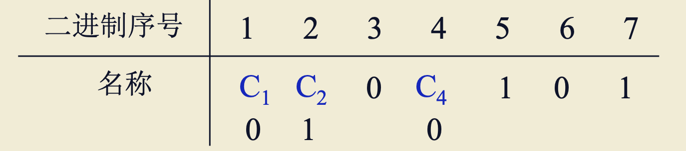

C1、C2、C3为检测位，最终得到汉明码 0100101。

#### 2.5 汉明码纠错过程

形成新的检测位 Pi ，其位数与增添的检测位有关，如 增 添 3 位 ( k = 3 ) ，新 的 检 测 位 为 P4、P2、P1；以 k = 3 为例，Pi 的取值为

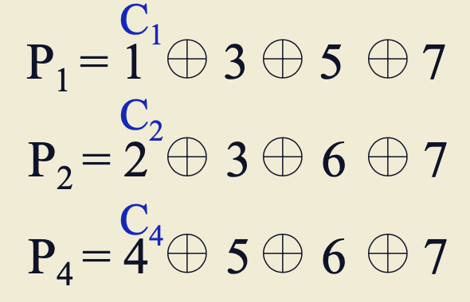

对于按 “偶校验” 配置的汉明码，不出错时 P1= 0，P2 = 0，P4 = 0

#### 2.6 汉明码纠错栗子

已知接收到的汉明码为0100111 (按配偶原则配置)，试问要求传送的信息是什么?

纠错过程如下：

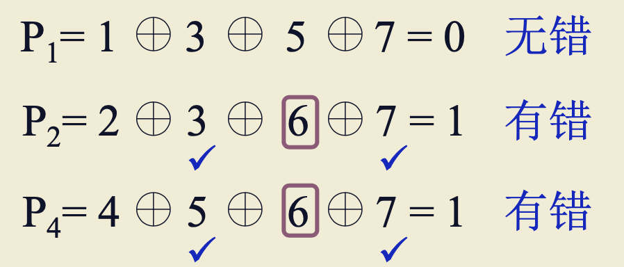

纠错结果 P4P2P1=110，第 6 位出错，可纠正为 0100101，传输信息为0101。

## 三、提高访存速度的措施

CPU和存储器之间的访问速度存在较大差距，二者访问速度不匹配会拉低计算机整体性能，因此要想办法提高存储器的访问速度。

提高访存速度的措施有：

1. 使用高速器件；
2. 采用层次结构：cache - 主存；
3. 调整主存结构。

接下来我们讲一下如何通过调整主存结构提高访存速度。

### 1. 单体多字系统

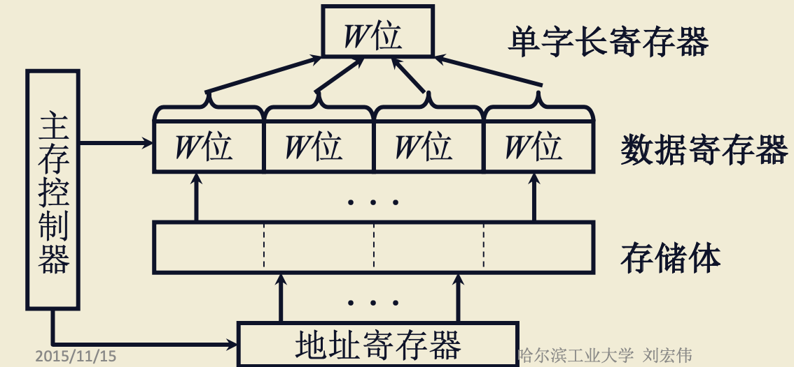

如上图所示，假设W=16，CPU一次取16位数据，我们可以一次从存储体中读取4个16位的数据到数据寄存器里，下次如果CPU有需要，可以直接从寄存器里读，从而提高了读取速度。

这种方式增加存储器的带宽。

存在问题：

1. 假设CPU要修改W位，它先要将修改的数据写到单字长寄存器，再写到数据寄存器；写入W位时，同时会将另外3W位的数据写到存储体，而这3W位数据有可能是错误的。如果要这种 单字长寄存器+数据寄存器 的方式完成W位的数据写入，还需要额外的硬件支持。
2. 存在使用效率的问题；如取出4条指令，第一条就是跳转指令，然后跳转的位置比较远，不在这4个指令的范围内，那么这次取数据就只有一条有用。

### 2. 多体并行系统

#### 1. 高位交叉

高位交叉即顺序编址；给存储体分配地址的时候，从某个存储体顺序往下编址。

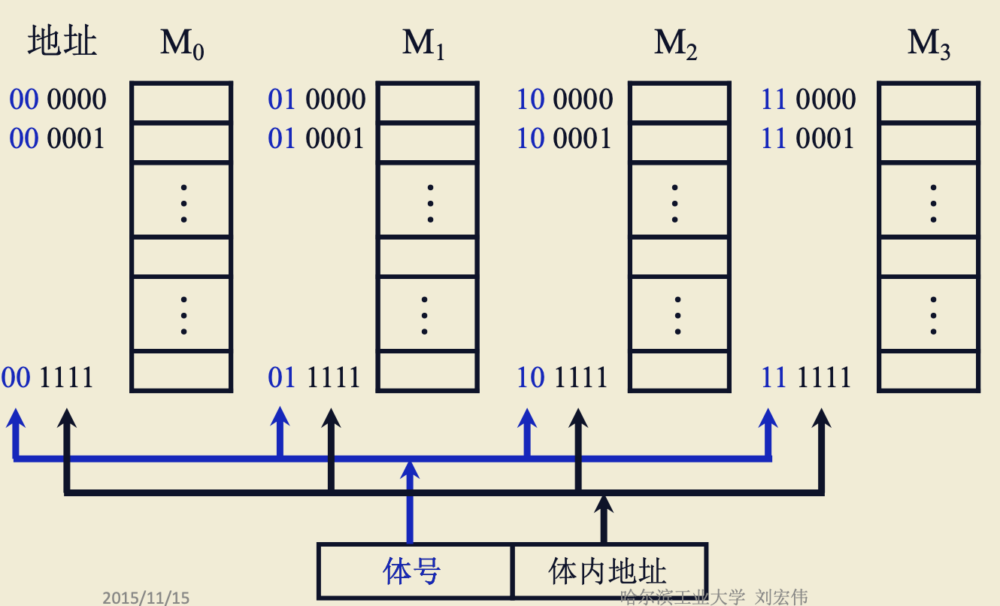

如图所示，假设每个存储体由16个存储单元，每个存储体占6位，如给M0分配000000~001111的地址，给他M1分配010000~001111的地址；前面2位，代表存储体编号，后面4位代表内部地址；假如CPU给出的地址前2位是00，就表示数据放在M0这个存储体上。

如果每个存储体都要自己MAR、MDR，那么这4个存储体就都可以并行工作，并行工作如下图：

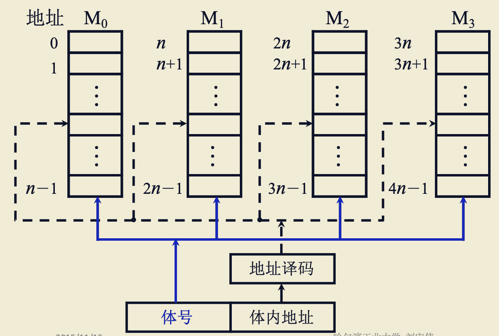

但这种结果只是有了并行工作的基础，并不具备并行工作的条件；按照程序和数据存储的特征(程序指令和数据一般是按序存放，如第一条指令放在了 0000，第二条指令大概率就会在0001，一直顺序执行下去)来说，会造成其中一块存储体非常繁忙，其他存储体空闲的情况。

> 高位交叉和片选的区别
>
> 片选是针对一个存储体内部的存储芯片，而高位交叉是针对多个存储体。

#### 2. 低位交叉

低位交叉即各个体轮流编址；给存储体分配地址的时候，横向分配，每个存储体轮流分配地址。

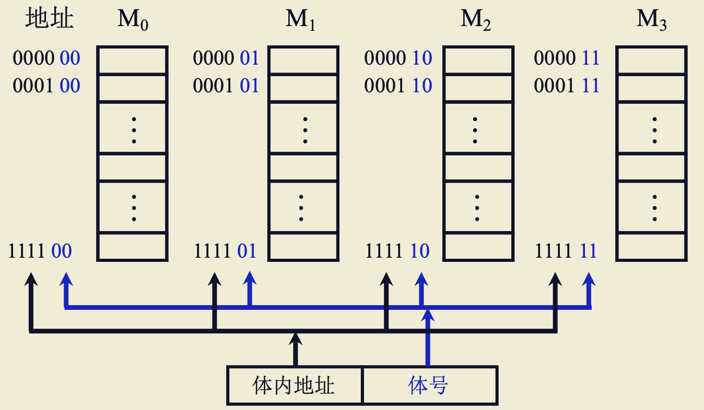

看图也很容易理解，前4位作为体内地址，用于确定存储单元，后2位用于确定所在存储体；

如果各个存储体完全独立，每个存储体都有自己的控制电路，那各个存储体就可以并行工作：

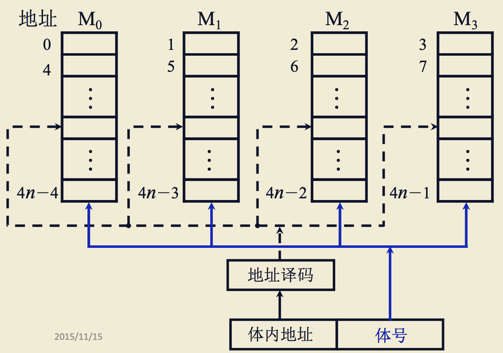

#### 3. 低位交叉特点

在不改变存取周期的前提下，增加存储器的带宽。

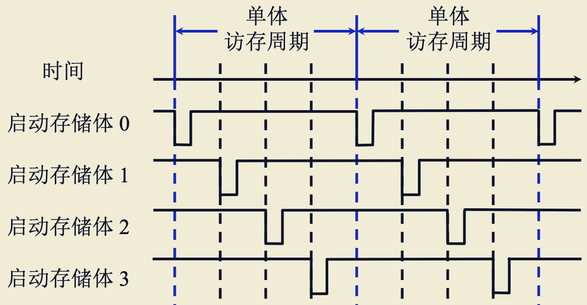

设四体低位交叉存储器，存取周期为T，总线传输周期为τ，为实现流水线方式存取，应满足 T = 4τ。

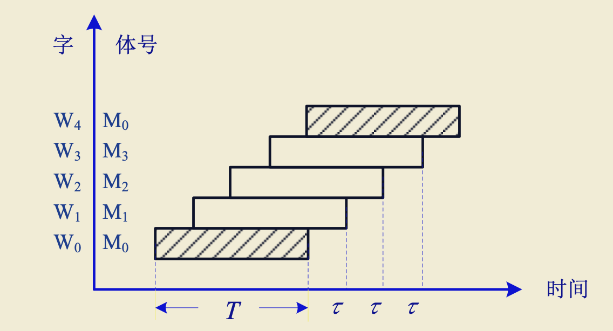

连续读取 4 个字所需的时间为 T+(4 -1)τ。

