# 定点运算和浮点运算

<!-- START doctoc generated TOC please keep comment here to allow auto update -->
<!-- DON'T EDIT THIS SECTION, INSTEAD RE-RUN doctoc TO UPDATE -->

- [一、移位运算](#%E4%B8%80%E7%A7%BB%E4%BD%8D%E8%BF%90%E7%AE%97)
    - [1. 移位的意义](#1-%E7%A7%BB%E4%BD%8D%E7%9A%84%E6%84%8F%E4%B9%89)
    - [2. 算术移位规则](#2-%E7%AE%97%E6%9C%AF%E7%A7%BB%E4%BD%8D%E8%A7%84%E5%88%99)
    - [3. 算术移位的硬件实现](#3-%E7%AE%97%E6%9C%AF%E7%A7%BB%E4%BD%8D%E7%9A%84%E7%A1%AC%E4%BB%B6%E5%AE%9E%E7%8E%B0)
    - [4. 算术移位和逻辑移位的区别](#4-%E7%AE%97%E6%9C%AF%E7%A7%BB%E4%BD%8D%E5%92%8C%E9%80%BB%E8%BE%91%E7%A7%BB%E4%BD%8D%E7%9A%84%E5%8C%BA%E5%88%AB)
- [二、定点数加减法运算](#%E4%BA%8C%E5%AE%9A%E7%82%B9%E6%95%B0%E5%8A%A0%E5%87%8F%E6%B3%95%E8%BF%90%E7%AE%97)
    - [1. 补码加减运算公式](#1-%E8%A1%A5%E7%A0%81%E5%8A%A0%E5%87%8F%E8%BF%90%E7%AE%97%E5%85%AC%E5%BC%8F)
    - [2. 举例](#2-%E4%B8%BE%E4%BE%8B)
    - [3. 溢出判断](#3-%E6%BA%A2%E5%87%BA%E5%88%A4%E6%96%AD)
        - [1. 一位符号位判断溢出](#1-%E4%B8%80%E4%BD%8D%E7%AC%A6%E5%8F%B7%E4%BD%8D%E5%88%A4%E6%96%AD%E6%BA%A2%E5%87%BA)
        - [2. 两个符号位判断溢出](#2-%E4%B8%A4%E4%B8%AA%E7%AC%A6%E5%8F%B7%E4%BD%8D%E5%88%A4%E6%96%AD%E6%BA%A2%E5%87%BA)
    - [4. 补码加减法的硬件配置](#4-%E8%A1%A5%E7%A0%81%E5%8A%A0%E5%87%8F%E6%B3%95%E7%9A%84%E7%A1%AC%E4%BB%B6%E9%85%8D%E7%BD%AE)
- [三、定点数乘法运算](#%E4%B8%89%E5%AE%9A%E7%82%B9%E6%95%B0%E4%B9%98%E6%B3%95%E8%BF%90%E7%AE%97)
    - [1. 分析笔算乘法](#1-%E5%88%86%E6%9E%90%E7%AC%94%E7%AE%97%E4%B9%98%E6%B3%95)
    - [2. 笔算乘法改进](#2-%E7%AC%94%E7%AE%97%E4%B9%98%E6%B3%95%E6%94%B9%E8%BF%9B)
    - [3. 改进后的笔算乘法过程(竖式)](#3-%E6%94%B9%E8%BF%9B%E5%90%8E%E7%9A%84%E7%AC%94%E7%AE%97%E4%B9%98%E6%B3%95%E8%BF%87%E7%A8%8B%E7%AB%96%E5%BC%8F)
    - [4. 小结](#4-%E5%B0%8F%E7%BB%93)
    - [5. 原码的乘法运算](#5-%E5%8E%9F%E7%A0%81%E7%9A%84%E4%B9%98%E6%B3%95%E8%BF%90%E7%AE%97)
        - [1. 原码一位乘运算规则](#1-%E5%8E%9F%E7%A0%81%E4%B8%80%E4%BD%8D%E4%B9%98%E8%BF%90%E7%AE%97%E8%A7%84%E5%88%99)
        - [2. 原码一位乘递推公式](#2-%E5%8E%9F%E7%A0%81%E4%B8%80%E4%BD%8D%E4%B9%98%E9%80%92%E6%8E%A8%E5%85%AC%E5%BC%8F)
        - [3. 栗子](#3-%E6%A0%97%E5%AD%90)
        - [4. 原码一位乘的硬件配置](#4-%E5%8E%9F%E7%A0%81%E4%B8%80%E4%BD%8D%E4%B9%98%E7%9A%84%E7%A1%AC%E4%BB%B6%E9%85%8D%E7%BD%AE)
- [四、定点数除法运算](#%E5%9B%9B%E5%AE%9A%E7%82%B9%E6%95%B0%E9%99%A4%E6%B3%95%E8%BF%90%E7%AE%97)
    - [1. 分析笔算除法](#1-%E5%88%86%E6%9E%90%E7%AC%94%E7%AE%97%E9%99%A4%E6%B3%95)
    - [2. 笔算除法和机器除法的比较](#2-%E7%AC%94%E7%AE%97%E9%99%A4%E6%B3%95%E5%92%8C%E6%9C%BA%E5%99%A8%E9%99%A4%E6%B3%95%E7%9A%84%E6%AF%94%E8%BE%83)
    - [3. 原码除法](#3-%E5%8E%9F%E7%A0%81%E9%99%A4%E6%B3%95)
        - [1. 恢复余数法](#1-%E6%81%A2%E5%A4%8D%E4%BD%99%E6%95%B0%E6%B3%95)
        - [2. 不恢复余数法](#2-%E4%B8%8D%E6%81%A2%E5%A4%8D%E4%BD%99%E6%95%B0%E6%B3%95)
- [五、浮点加减运算](#%E4%BA%94%E6%B5%AE%E7%82%B9%E5%8A%A0%E5%87%8F%E8%BF%90%E7%AE%97)
    - [1. 对阶](#1-%E5%AF%B9%E9%98%B6)
    - [2. 规格化](#2-%E8%A7%84%E6%A0%BC%E5%8C%96)
        - [1. 左规](#1-%E5%B7%A6%E8%A7%84)
        - [2. 右规](#2-%E5%8F%B3%E8%A7%84)
    - [3. 舍入](#3-%E8%88%8D%E5%85%A5)

<!-- END doctoc generated TOC please keep comment here to allow auto update -->

[TOC]

## 一、移位运算

### 1. 移位的意义

移位运算我们在小学就接触过了，例如单位换算：15m = 1500cm，小数点右移了2位。

注意上面的表述，是小数点向右移动了2位，这种表述在计算机中是不合适的，因为计算机中没有专门的硬件表示小数点，小数点是一约定的方式存在的，因此如果要用机器用语描述的话，应该是：15相对于小数点左移2位，即小数点不动。

**注意：在后续的内容中，出现的左移或者右移，都是数据相对小数点的移动。**

在数学中，左移表示绝对值扩大，右移表示绝对值缩小。在计算机中，如果是二进制数，左移则数据变为原来的2倍，右移则数据变为原来的1/2。

在计算机中，位移与加减法配合，能够实现乘除法运算。

### 2. 算术移位规则

移位运算首先要保证符号位不变。

下面的表格表示左移或右移过程中，多出来的位怎么填补数据：

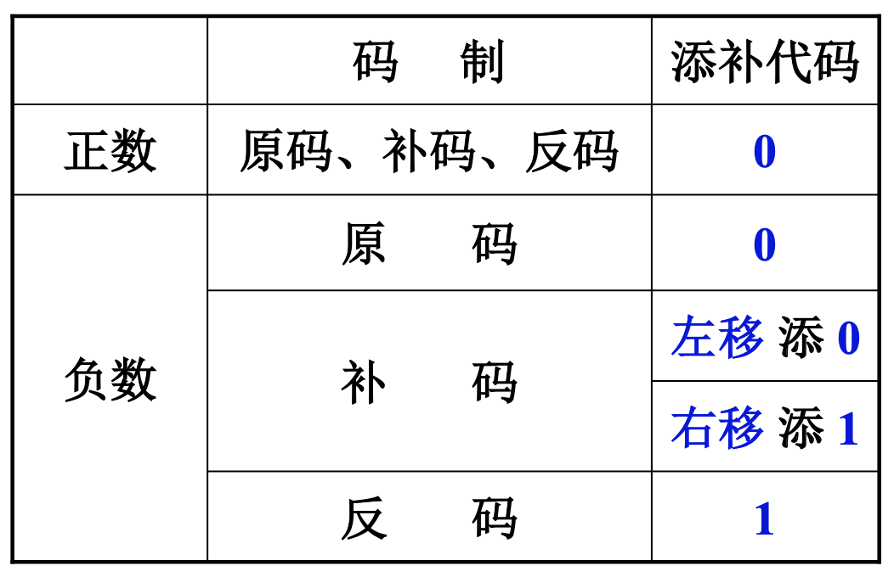

正数的原码、补码、反码相同，为了保证移位后真值不变，补0很好理解；

负数原码同理，直接补0即可；

负数反码，反码中0表示真值的1，1表示真值的0，因此多出来的位补1；

比较复杂的是负数补码，我们先来看一个数：

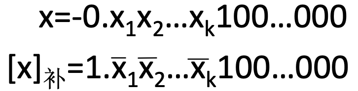

根据x求补码，去掉负号，最高位变为1，真值部分全部取反再加1，得到结果为：从右边数最后一个1为界，这个1左边的数取反，右边的数为0；所以可得：左移是低位(右边)空出了位，应该补0，右移是高位(左边)空出了位，应该补0的取反，即补1。

### 3. 算术移位的硬件实现

下面这个图要竖着看，上面的是左移操作，下面的是右移操作，有蓝色箭头的框框存的是真值，小框存的是符号位：

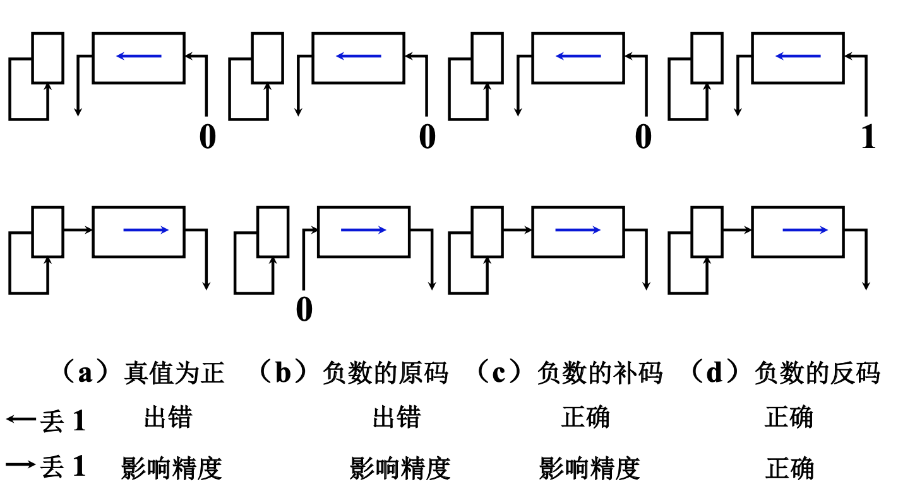

### 4. 算术移位和逻辑移位的区别

算术移位：有符号数的移位，符号位不参加移位；

逻辑移位：无符号数的移位，所有数都会参加移位。

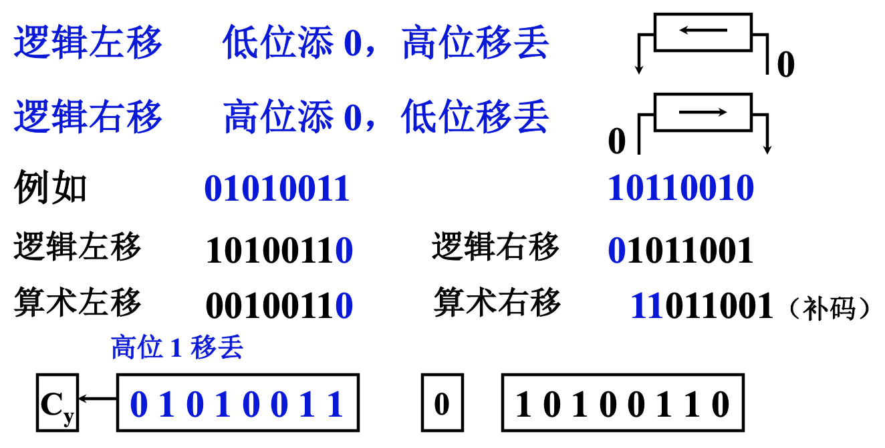

## 二、定点数加减法运算

之前我们提到过，同样是加法过程，如果用原码表示方式，可能做加法或减法，这对运算器来说是比较麻烦的，能否对加法和减法进行归一，只用加法就能完成加法和减法操作？由此我们引出了补码的概念，补码就解决了这个问题，因此我们的加减法运算，用的都是补码。

### 1. 补码加减运算公式

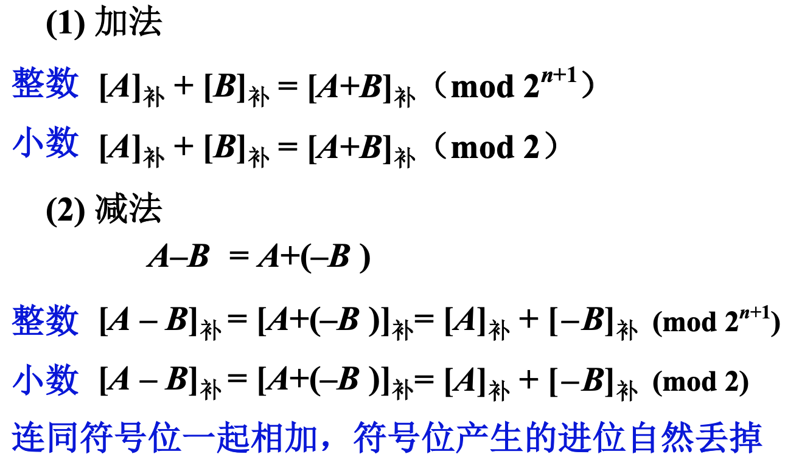

### 2. 举例

下面是两道例题，设就是题目：

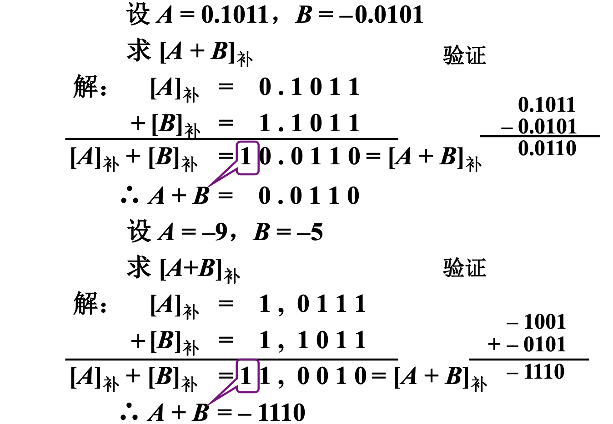

### 3. 溢出判断

#### 1. 一位符号位判断溢出

参加操作的两个数(减法时即为被减数和“求补”以后的减数)符号相同，其结果与原操作数的符号不同，即为溢出。(如果两个操作数符号不同，那么结果不可能会溢出)

硬件实现如下：

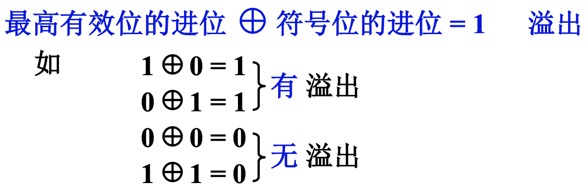

简单解释一下硬件实现的原理：

- 两个操作数是正数：符号位是0，符号位相加进位是0，真值相加，最高有效位的进位可能是1或0，如果进位为1，造成符号位变为1，则表示发生溢出，这个过程中最高有效位的进位与符号位进位不同；
- 两个操作数是负数：符号位是1，符号位相加进位是1，真值相加，最高有效位的进位可能是1或0，如果进位为0，造成符号位变为0，则表示发生溢出，这个过程中最高有效位的进位与符号位进位不同；
- 两个操作数一正一负：不可能产生溢出。

因此可以用最高有效位的进位和符号位的进位进行异或判断是否发生溢出。

#### 2. 两个符号位判断溢出

这个东西我也不甚明白，直接贴个图略过吧。

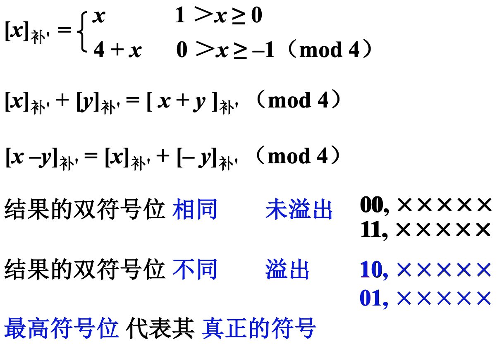

### 4. 补码加减法的硬件配置

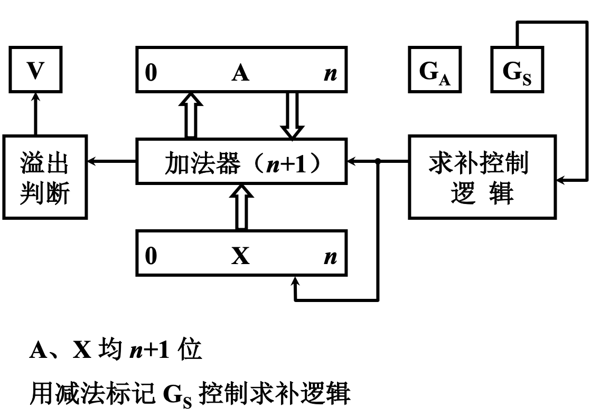

A：ACC寄存器，存放的是被加/减数；

X：存放加/减数；

GA、GS：两个标记，如果做加法，GA置为1，如果做减法，GS置为1；

求补控制逻辑：支持减法，用于求补。

## 三、定点数乘法运算

### 1. 分析笔算乘法

观察笔算乘法，可以得出要算乘法，计算机满足4点即可：

1. 符号位单独处理：计算机中非常容易实现，利用一个异或电路即可；
2. 乘数的某一位决定是否加被乘数：计算机中也非常容易实现，可以将乘数放到一个移位寄存器中 ，每次判断最低位是否为1，如果是1则加一个被乘数，判断完后右移一位，这样下次判断的依旧是最低位；
3. 4个位积一起相加：可以每次相加的时候，原来的位积向右移一位，再与被乘数相加；
4. 乘积的位数扩大一倍：两个寄存器保存乘积的值。

### 2. 笔算乘法改进

这个看个乐呵就行

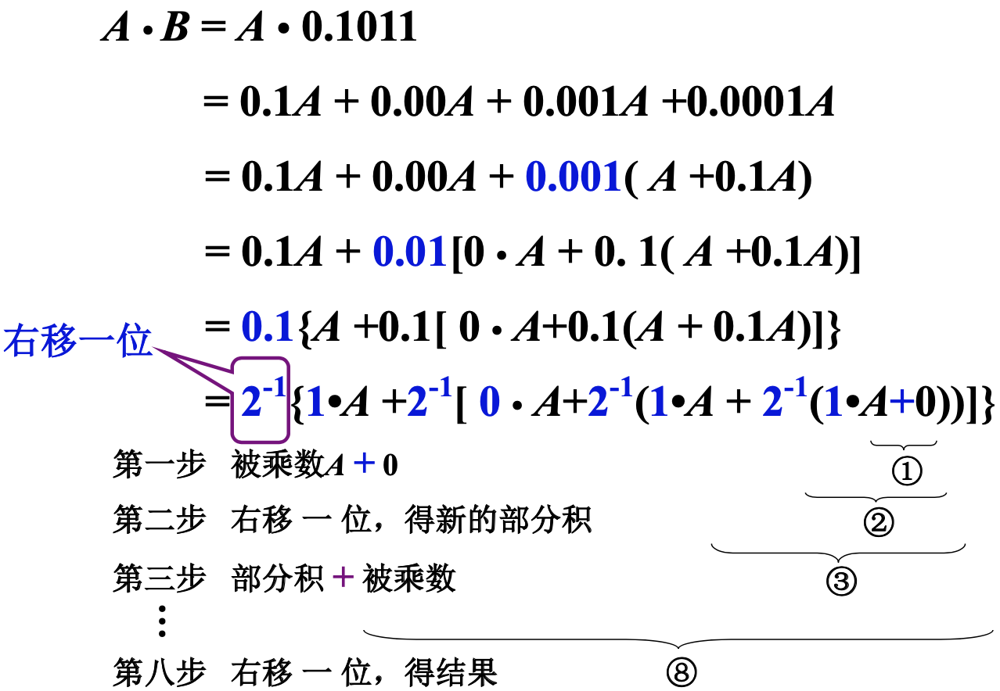

### 3. 改进后的笔算乘法过程(竖式)

这部分如果看不懂，可以结合下一部分小结一起来看。

要注意，只计算数值部分，不计算符号部分，符号部分是单独计算的。

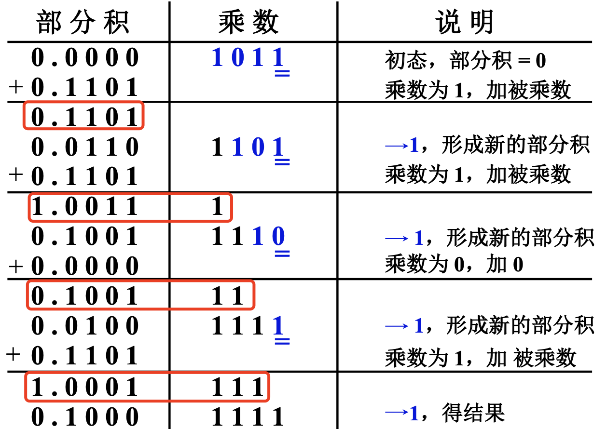

### 4. 小结

1. 乘法运算可以通过加法运算和以为运算实现，n=4，加4次，移4次；
2. 由乘数的末尾决定被乘数是否与原部分相加，然后右**移1位形成新的部分积**，同时**乘数右移1位**(末位移丢)，空出高位存放部分积的低位；
3. 被乘数只与部分积的高位相加；是否记得之前有提到过的ACC寄存器和MQ寄存器，ACC寄存器放的是部分积，MQ放的是乘数和低位结果，通过上面的图可以发现，被乘数只与ACC中的部分积相加，即被乘数只与部分积的高位相加，低位不参与运算。

根据过程，我们可以得出需要的硬件如下：3个寄存器，其中2个具有移位功能，1个全加器，需要n+1位。

### 5. 原码的乘法运算

#### 1. 原码一位乘运算规则

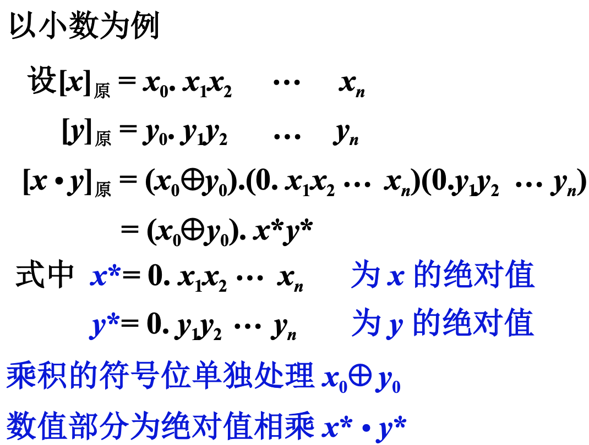

这部分也看看就好。

#### 2. 原码一位乘递推公式

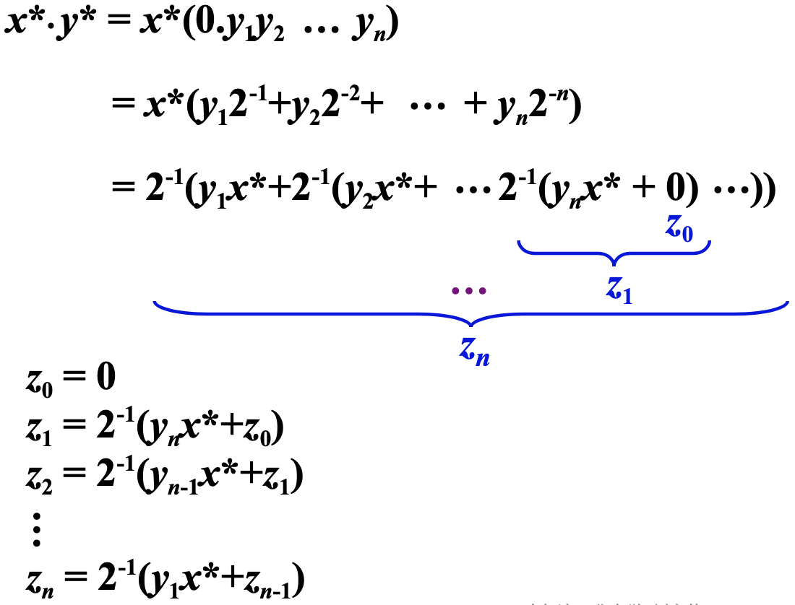

这部分也是看看就好。

#### 3. 栗子

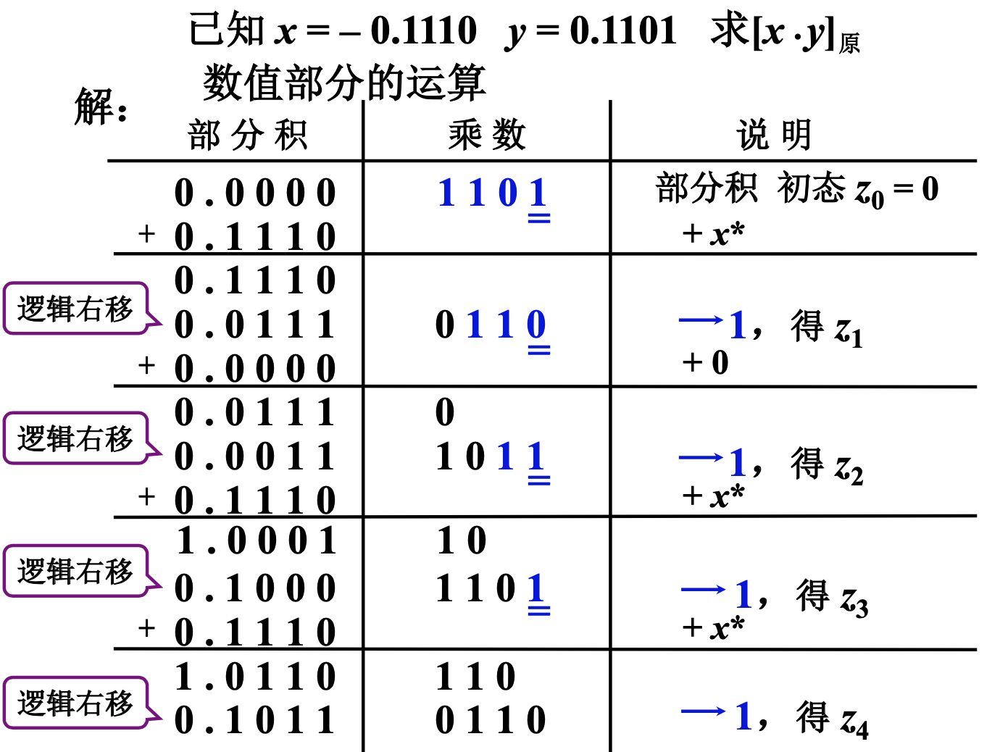

这个过程跟上面讲过的基本一致，这里就不复述了，计算结果如下：

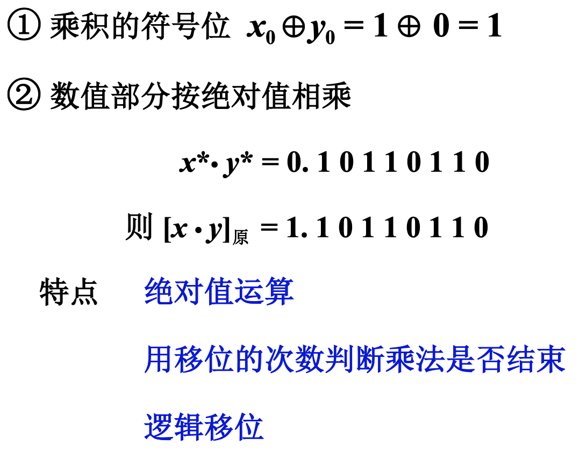

#### 4. 原码一位乘的硬件配置

硬件配置如下：

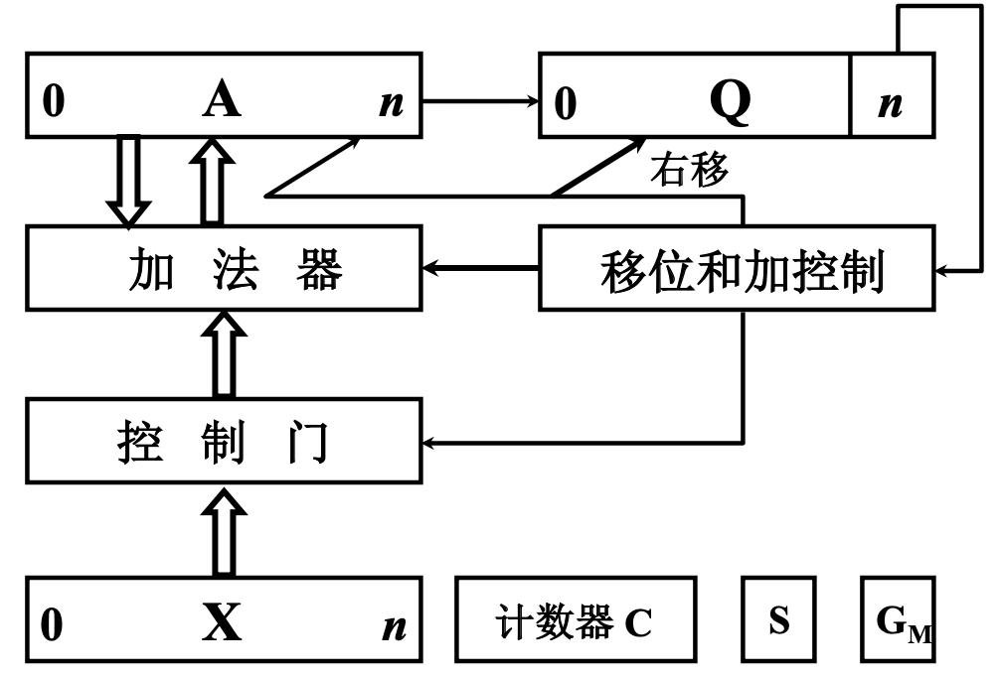

这个也跟之前的差不多，也不多做解释了。

## 四、定点数除法运算

### 1. 分析笔算除法

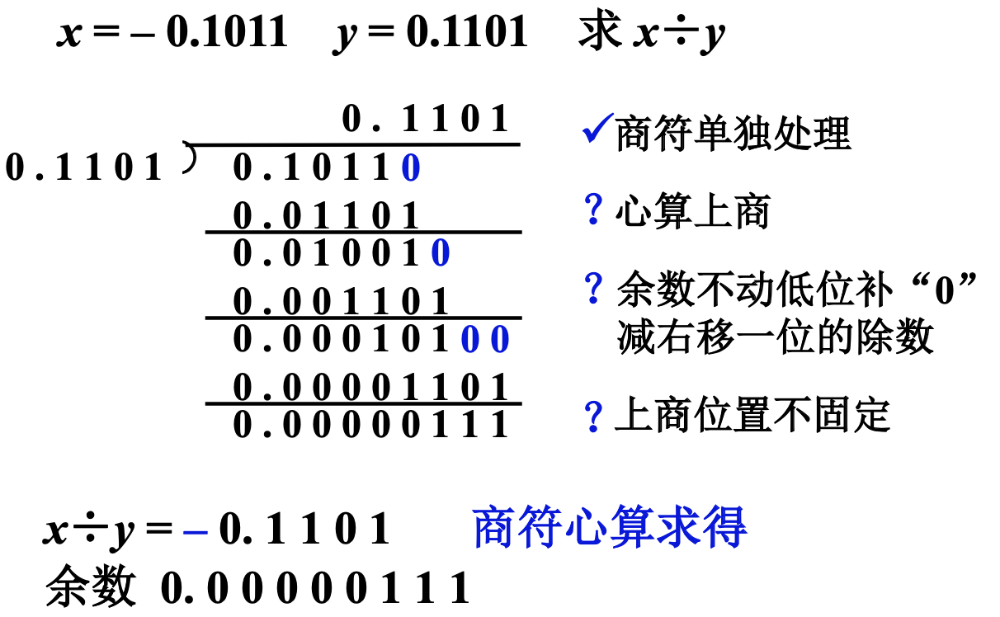

上图是一个二进制除法笔算过程，跟我们小学学的差不多，非常的简单(重新定义简单)，关于为啥结果是 -0.1101，或者说除到这里就不除了，是因为计算机存储字长有限，到这里就可以了。

观察笔算除法，可以得出要算除法，计算机需要满足以下四点要求：

1. 商符单独处理：这个在计算机非常简单，只需要一个异或电路即可；
2. 心算上商：计算机没有心，那么计算机要如何比较余数和移位后的被除数的大小？如何完成余数大上1，余数小上0的操作？
3. 余数不动低位补0，减右移一位的除数：随着计算的进行，余数的位数会越来越多，数值位从开始的4位变为最后的8位，除数也一直在右移，计算机中要如何实现；
4. 上商位置不固定；

### 2. 笔算除法和机器除法的比较

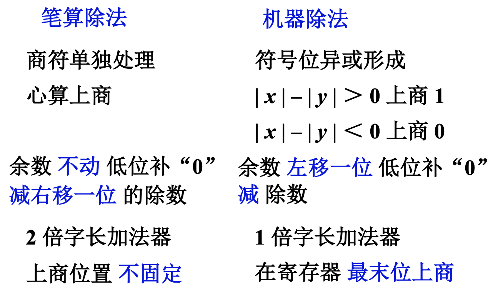

上面的x表示余数，y表示右移一位的除数。

### 3. 原码除法

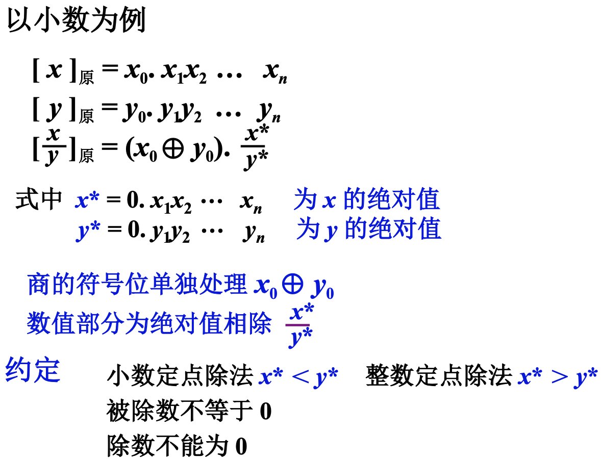

关于约定这里解释一下：

1. 小数定点除法 x绝对值 < y绝对值：由于能够保存的数据小数形式，也就是说数据都是小于1的，那么，它们运算的结果也是要存放在存小数的地方，也就是除法的结果依然是个小数，因此 x绝对值 < y绝对值；整数同理；

2. 被除数不等于 0：0除以任何数都等于0，不需要经过除法运算逻辑，直接走判0电路即可实现；
3. 除数不能为 0：这个没啥好说的，0不能作除数。

后面的除法中，我们都遵循这三条假设。

#### 1. 恢复余数法

直接上例题：

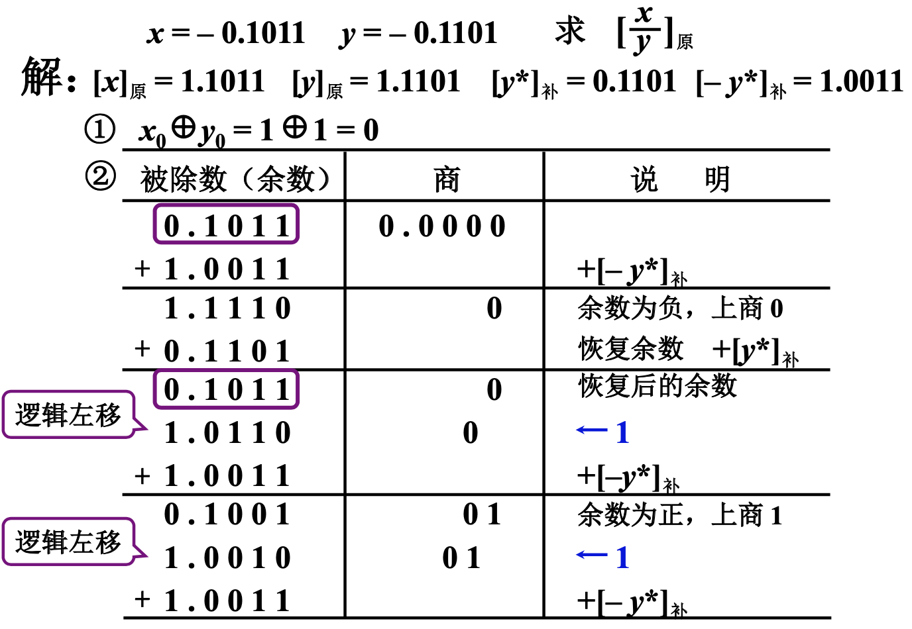

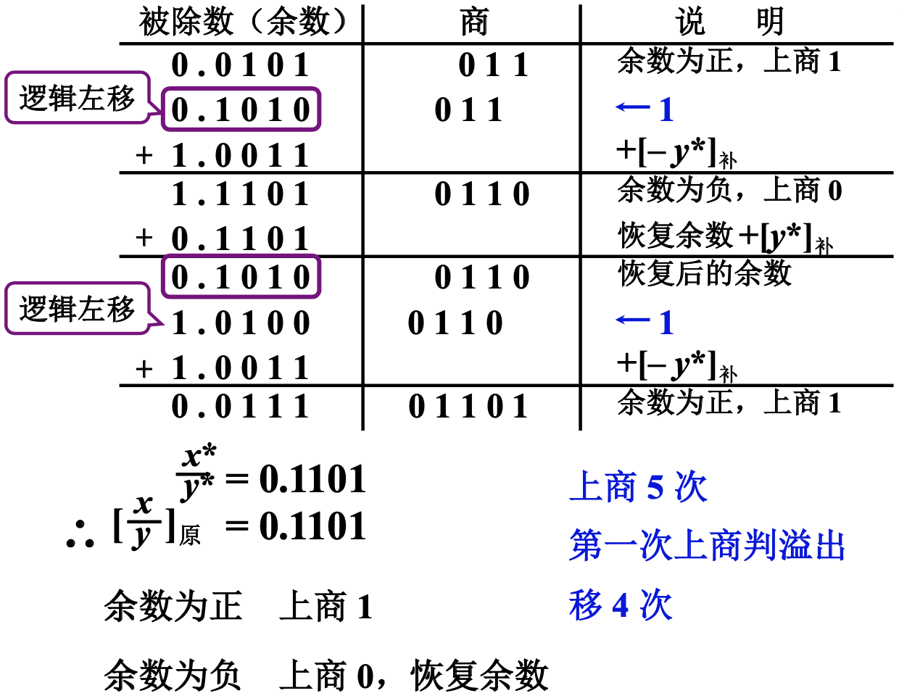

在计算除法的过程中，要比较移位后的余数和除数的大小，比较用的是减法，在计算机中，就是用余数，加上除数的补码来实现的，因此除了要求x和y的原码，还要求-y绝对值的补码。

因为我们的符号位是单独计算的，因此参与除法运算的是**x绝对值**、**y绝对值**和**-y绝对值的补码**。

第一步算出了符号位是0。

关于恢复余数：我们是不管青红皂白，先减一次除数，这个减是为了试探被除数，用以判断商是上0还是上1，如果是负数，表示被除数不够减，变负数了，因此要给它补回一个除数，这就是所谓的恢复余数。

> 这块仔细想想还是很好理解的，我们在做笔算除法的时候，如果发现被除数不够减，我们会给商上0，然后给被除数加上一个0再减，恢复余数法其实是提前减了，发现被除数变成了负数，再把减掉的还回去，继续进行下一轮比较。

#### 2. 不恢复余数法

我们先来总结一下恢复余数法的运算规则：

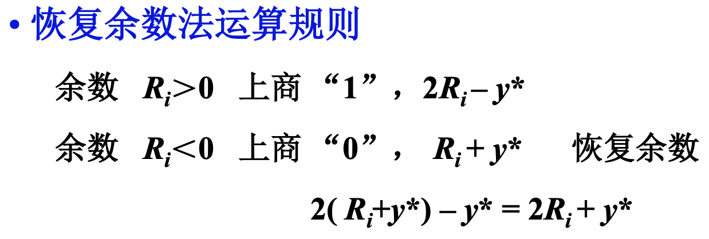

简单解释一下下哈：

我们回顾一下前面的除法运算过程，余数大于0，上商1，左移一位，再减去除数的绝对值，就可以表示为上面的第一行的公式，2就是扩大两倍嘛，代表左移。

余数小于0，上商0，恢复余数，就是上面的第二行，余数加除数绝对值。

那第三行的公式代表啥呢？余数+除数绝对值，代表恢复余数；2代表左移，减除数绝对值，表示下一轮比较，连起来就是一轮余数小于0的除法运算，可以简化成等号后面的公式。

接下来我们就可以引出不恢复余数法的运算规则了：

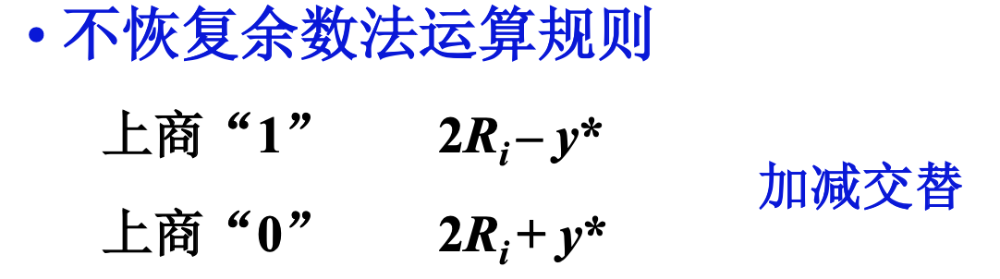

上商1，也就是余数大于0，就将余数左移一位，再减去y绝对值；

上商0，也就是余数小于0，就将余数左移一位，再加上y绝对值；

因此，不恢复余数法也被称为加减交替法。

> 非常的巧妙，每当学到这些东西，都会不禁的感叹，人真是很聪明的动物，令人兴奋，可能这就是学习计算机的魅力吧。

有的同学可能会比较懵，我们上栗子：

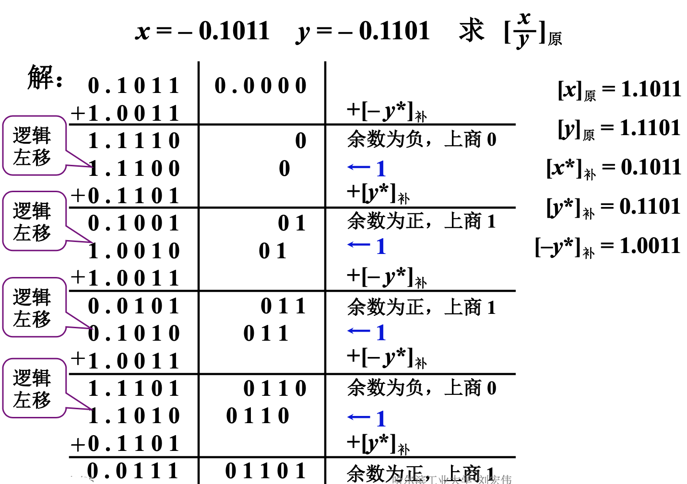

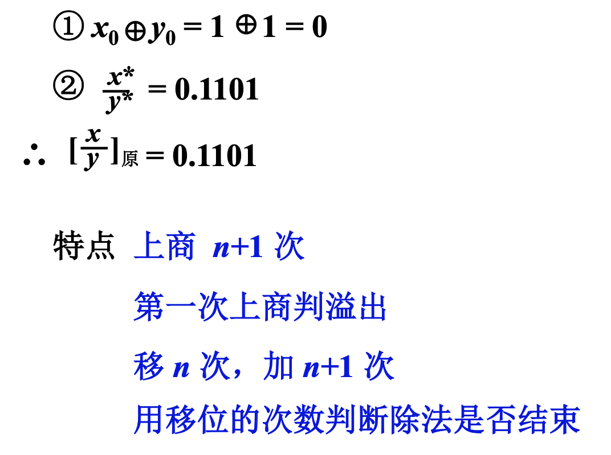

是不是比恢复余数法要简单，这其实是恢复余数法的一种改进。

## 五、浮点加减运算

我们先来看两个数x和y：

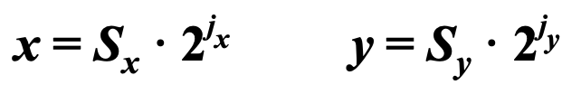

这两个都是浮点数，以x为例：Sx是浮点数的尾数，jx是阶码部分，2是基值，基值可以是2、4、8、16等，我们假设基值为2。

> 忘了的回去看[浮点数的表示](数的定点表示和浮点表示.md#2-浮点表示)，我就不重复说明了╭(╯^╰)╮。

### 1. 对阶

算术运算的常识是：两个浮点数要进行运算，他们的阶(指数)
必须是相同的。如果在基值相同的情况下，阶码的值不同，我们需要对阶码的值进行调整，而且调整阶码的同时，尾数也需要进行调整，通过阶码和尾数两部分的调整，保证参与运算的两个值的大小不发生变化，依然是原来的那两个值，保证运算结果的正确性。我们把调整阶码和尾数的过程叫对阶。

对阶首先要求阶差，要知道怎么调整：

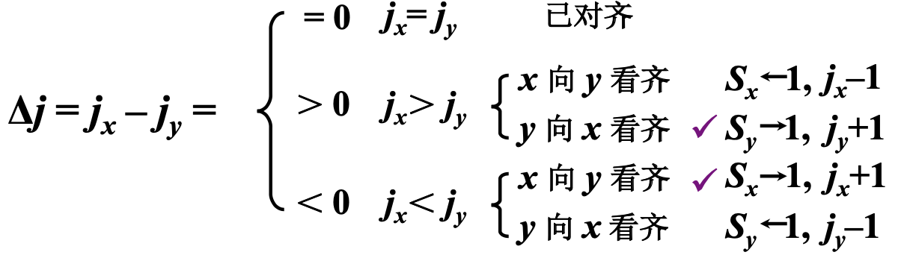

阶差等于0，已对齐，没啥好说的；

阶差大于0，表示jx大于jy，阶码有两种调整方式：

- Sx左移1位，jx-1
- Sy又移1位，jy+1

这两种方式都可以统一阶码，但Sx左移可能会丢失尾数的高位，导致数据错误，因此不可取；Sy右移可能会造成尾数低位丢失，会影响精度，但不会造成数据错误；因此对阶原则是小阶向大阶看齐。

阶差小于0的我就不分析了。

接下来我们来看个栗子：

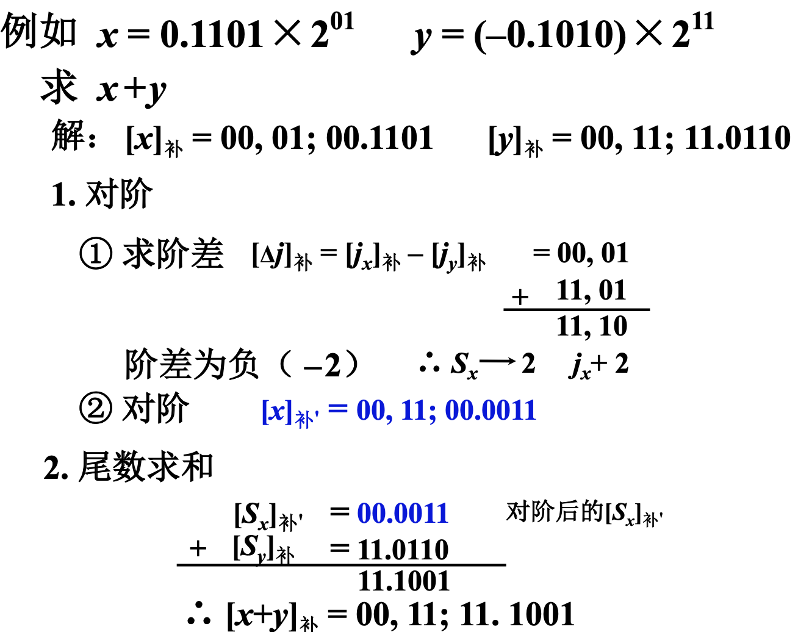

这里解释一下为什么要用两位符号位：两位符号位用于判断溢出，前一位代表符号位，后一位如果和前一位相同代表未溢出，不同代表溢出；第一位符号位才是真正的符号位。

### 2. 规格化

我们看到，上面算出来的数是11.1001，不是一个规格化的数，而计算机中存储的浮点数都是规格化的，我们先来复习一下规格化：

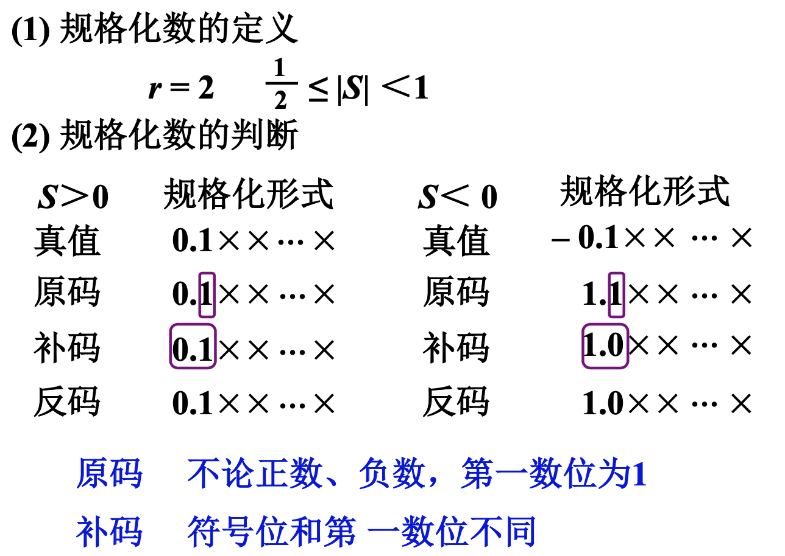

其实，我们判断一个规格化数采用的是第二种方法判断，而不是完全采用定义，为什么呢？

对于补码来说，有两个数是特例：

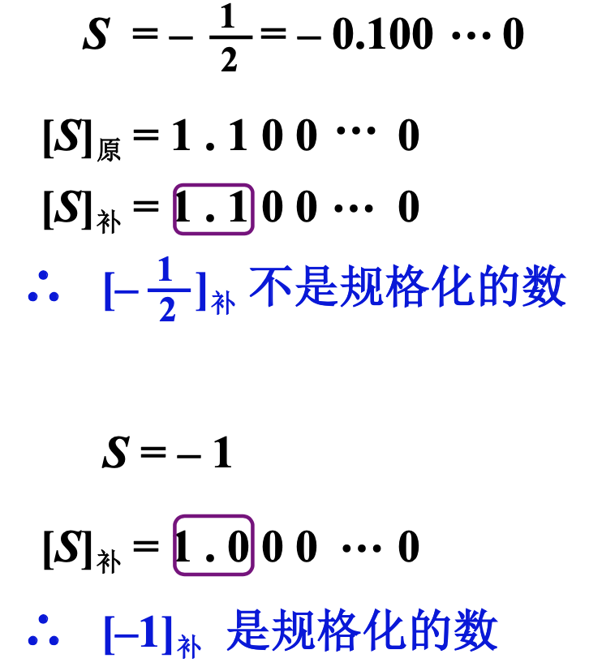

#### 1. 左规

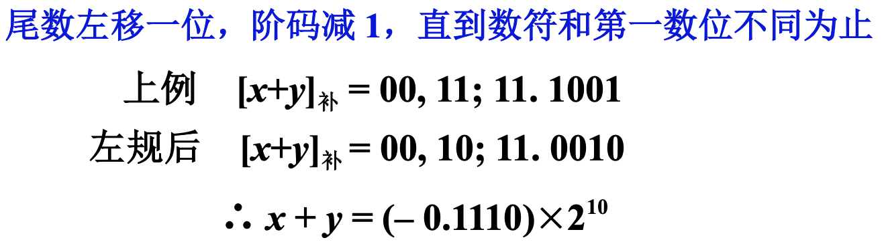

这种方式的前提是：数据要是补码表示方式。

#### 2. 右规

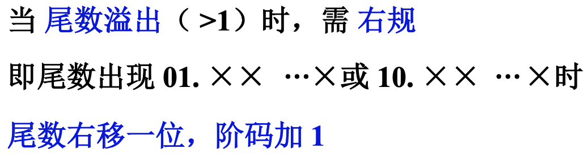

### 3. 舍入

舍入是指数据的长度超过了计算机中物理器件能保存数据的长度，数据的低位部分要进行处理，以保证数据能以较高的精度存储在计算机中。

在对接和右规的过程中，可能出现尾数末尾丢失引起误差，需要考虑舍入。

场景舍入方法有：

- 0 舍 1 入法，跟小学学的四舍五入差不多；
- 恒置 “1” 法：不管末尾或被丢弃的数据是什么，末位都是1。
