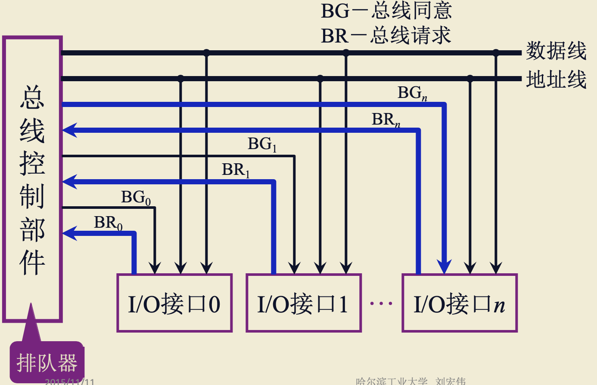

# 总线控制

<!-- START doctoc generated TOC please keep comment here to allow auto update -->
<!-- DON'T EDIT THIS SECTION, INSTEAD RE-RUN doctoc TO UPDATE -->

- [一、总线基本概念](#%E4%B8%80%E6%80%BB%E7%BA%BF%E5%9F%BA%E6%9C%AC%E6%A6%82%E5%BF%B5)
    - [1. 为什么要用总线](#1-%E4%B8%BA%E4%BB%80%E4%B9%88%E8%A6%81%E7%94%A8%E6%80%BB%E7%BA%BF)
    - [2. 什么是总线](#2-%E4%BB%80%E4%B9%88%E6%98%AF%E6%80%BB%E7%BA%BF)
    - [3. 总线上的信息传送](#3-%E6%80%BB%E7%BA%BF%E4%B8%8A%E7%9A%84%E4%BF%A1%E6%81%AF%E4%BC%A0%E9%80%81)
    - [4. 总线计算机结构举例](#4-%E6%80%BB%E7%BA%BF%E8%AE%A1%E7%AE%97%E6%9C%BA%E7%BB%93%E6%9E%84%E4%B8%BE%E4%BE%8B)
        - [4.1 单总线结构](#41-%E5%8D%95%E6%80%BB%E7%BA%BF%E7%BB%93%E6%9E%84)
        - [4.2 面向 CPU 的双总线结构](#42-%E9%9D%A2%E5%90%91-cpu-%E7%9A%84%E5%8F%8C%E6%80%BB%E7%BA%BF%E7%BB%93%E6%9E%84)
    - [5. 总线分类](#5-%E6%80%BB%E7%BA%BF%E5%88%86%E7%B1%BB)
- [二、总线控制](#%E4%BA%8C%E6%80%BB%E7%BA%BF%E6%8E%A7%E5%88%B6)
    - [1. 总线判优控制](#1-%E6%80%BB%E7%BA%BF%E5%88%A4%E4%BC%98%E6%8E%A7%E5%88%B6)
        - [1.1 基本概念](#11-%E5%9F%BA%E6%9C%AC%E6%A6%82%E5%BF%B5)
        - [1.2 链式查询方式](#12-%E9%93%BE%E5%BC%8F%E6%9F%A5%E8%AF%A2%E6%96%B9%E5%BC%8F)
        - [1.3 计数器定时查询方式](#13-%E8%AE%A1%E6%95%B0%E5%99%A8%E5%AE%9A%E6%97%B6%E6%9F%A5%E8%AF%A2%E6%96%B9%E5%BC%8F)
        - [1.4 独立请求方式](#14-%E7%8B%AC%E7%AB%8B%E8%AF%B7%E6%B1%82%E6%96%B9%E5%BC%8F)
- [三、总线通信控制](#%E4%B8%89%E6%80%BB%E7%BA%BF%E9%80%9A%E4%BF%A1%E6%8E%A7%E5%88%B6)
    - [1. 目的](#1-%E7%9B%AE%E7%9A%84)
    - [2. 总线传输周期](#2-%E6%80%BB%E7%BA%BF%E4%BC%A0%E8%BE%93%E5%91%A8%E6%9C%9F)
    - [3. 总线通信的四种方式](#3-%E6%80%BB%E7%BA%BF%E9%80%9A%E4%BF%A1%E7%9A%84%E5%9B%9B%E7%A7%8D%E6%96%B9%E5%BC%8F)
    - [4. 同步通信](#4-%E5%90%8C%E6%AD%A5%E9%80%9A%E4%BF%A1)
        - [4.1 同步式数据输入](#41-%E5%90%8C%E6%AD%A5%E5%BC%8F%E6%95%B0%E6%8D%AE%E8%BE%93%E5%85%A5)
        - [4.2 同步式数据输出](#42-%E5%90%8C%E6%AD%A5%E5%BC%8F%E6%95%B0%E6%8D%AE%E8%BE%93%E5%87%BA)
        - [4.3 同步式传输特点](#43-%E5%90%8C%E6%AD%A5%E5%BC%8F%E4%BC%A0%E8%BE%93%E7%89%B9%E7%82%B9)
    - [5. 异步通信](#5-%E5%BC%82%E6%AD%A5%E9%80%9A%E4%BF%A1)
        - [5.1 不互锁](#51-%E4%B8%8D%E4%BA%92%E9%94%81)
        - [5.2 半互锁](#52-%E5%8D%8A%E4%BA%92%E9%94%81)
        - [5.3 全互锁](#53-%E5%85%A8%E4%BA%92%E9%94%81)
    - [6. 半同步通信(同步、异步结合)](#6-%E5%8D%8A%E5%90%8C%E6%AD%A5%E9%80%9A%E4%BF%A1%E5%90%8C%E6%AD%A5%E5%BC%82%E6%AD%A5%E7%BB%93%E5%90%88)
    - [7. 分离式通信](#7-%E5%88%86%E7%A6%BB%E5%BC%8F%E9%80%9A%E4%BF%A1)

<!-- END doctoc generated TOC please keep comment here to allow auto update -->

[TOC]

## 一、总线基本概念

### 1. 为什么要用总线

一个完整的计算机硬件系统有许多部件组成，只有将部件连接起来，相互通信和协调工作，才能构建出一个完整的计算机硬件系统。

一种连接方法是分散连接：各个组件相互两两连接，但是这种方法线路众多、占用接口多，成本高昂，且系统难以扩展。

为了解决分散连接存在的问题而出现了总线连接。

### 2. 什么是总线

总线是连接各个部件的信息传输线，是**各个部件共享的传输介质。**

任何一个时刻，只有一对部件能在总线传输数据。

### 3. 总线上的信息传送

有两种传送方式：

- 串行：传输质量较高，适合远距离传输，如计算机之间的传输；
- 并行：多条数据线并行传输，传输过程中信号会相互干扰，若传输距离较长，到达接收方时信号可能会产生变形，因此并行传输一般用于短距离传输，如计算机机箱内传输；

### 4. 总线计算机结构举例

#### 4.1 单总线结构

所有部件连接到同一条总线上。

缺点很明显，由于任何一个时刻，只有一对部件能在总线传输数据，一对部件在传输数据，其他部件无法使用总线，将会停止工作，严重影响系统性能。

#### 4.2 面向 CPU 的双总线结构

为了解决总线占用的问题，很自然会想到拓展总线数量，面向COU的双总线结构即在CPU上拓展两条总线，一条连接I/O设备，一条直连主存。

该结构也是存在明显问题的，比如：主存想要与读取某个I/O设备的数据，需要同事占用M总线和I/O总线，导致CPU无法正常工作。

以上只是一些结构的举例，感兴趣可以自行了解更多，这里就不做赘述。

### 5. 总线分类

根据总线位置可分为：

1. 片内总线：芯片内部的总线

2. 系统总线：计算机各个部件之间的信息传送线 根据传输信号不同，又可以分为三类：
    - 数据总线：传输数据，双向，与集群字长，存储字长有关
    - 地址总线：单向，与存储地址、I/O地址有关
    - 控制总线：有出(存储器的读、写；总线运行、中断确认)，有入(中断请求、总线请求)

3. 通信总线：计算机之间 或 计算机系统与其他系统之间的通信 传输方式可分为：
    - 串行通信总线
    - 并行通信总线

## 二、总线控制

### 1. 总线判优控制

#### 1.1 基本概念

主设备：对总线有控制器

从设备：响应从主设备发来的总线命令

总线判优控制分类：

1. 集中式(重点介绍)
    - 链式查询
    - 计数器定时查询
    - 独立请求方式
2. 分布式

#### 1.2 链式查询方式

地址线：主设备取得了总线使用权后，不知道从设备是谁，通过地址总线来告诉它是要和谁进行数据交换

> 后续图中的地址线作用相同，后面将不再赘述其作用

BR：请求总线(Request Bus)，设备通过这条线向控制部件发出占用请求；

BS：总线忙，如果某一个设备占用了总线的控制权，就通过这条线告诉控制部件总线忙；

BG：总线授权线。

**总线判优过程**

> 可结合上图蓝色线理解

1. `接口1`和`接口n`同时通过`BR`向总线控制部件申请控制权；
2. 总线控制部件收到请求后，在可以让出总线使用权的情况下，通过BG依次向后询问是否申请了总线控制权；
3. BG到`接口0`，查询是否申请了总线控制权，`接口0`没有申请，则继续向后查询；
4. BG到`接口1`，查询是否申请了总线控制权，发现`接口1`申请了总线控制权，将总线控制权交由`接口1`，并且不再向后查询；
5. `接口1`通过BS告诉总线控制部件占用总线。

从上可以看出，该方法的判优与查询顺序有关，由连接方式事先确定，若一个设备比较靠后，可能永远不会得到总线控制权；此外该方式对电路故障非常敏感，若BG某一处电路故障，将无法继续向后传导；该结构的优点是结构简单，增删设备容易，优先级算法简单。

此结构一般用于微型计算机或简单的嵌入式结构。

#### 1.3 计数器定时查询方式

计数器：位于总线控制部件，其初始值可以自定，不一定是1。

设备地址：用于从设备的查找；每个设备会通过`计数器`分配到一个地址数

**总线判优过程**

> 可结合上图蓝色线理解

1. `接口1`和`接口n`同时通过`BR`向总线控制部件申请控制权；
2. 总线控制部件收到请求后，在可以让出总线使用权的情况下，并假设计数器的值为1，则通过设备地址发出计数器的值(本例为1)；
3. `接口0(假设其地址数为0)`通过设备地址接收到消息，不作处理；
4. `接口1(假设其地址数为1)`通过设备地址接收到消息，与其地址数相同，则通过BS告诉总线控制部件占用总线；
5. `接口n(假设其地址数为n)`通过设备地址接收到消息，不作处理；

从过程可以看出，其优先级与计数器的初始值有关，初始值的设定灵活，可以固定初始值，可以通过软件控制初始值。

#### 1.4 独立请求方式

每个设备有独立的BR和BG，判优逻辑取决于总线控制部件里的排队器。

这里的判优过程比较简单，就不解析了。

这种方式的缺点是需要的线路较多。

## 三、总线通信控制

### 1. 目的

解决通信双方协调配合的问题

### 2. 总线传输周期

1. 申请分配阶段：**主模块申请**，总线控制部件判优逻辑 或 总线仲裁决定；
2. 寻址阶段：主模块向从模块 **给出地址** 和 **命令**；
3. 传数阶段：主模块和从模块 **交换数据**；
4. 结束阶段：主模块 **撤销有关信息**。

### 3. 总线通信的四种方式

1. 同步通信：由 **统一时标** 控制数据传送；
2. 异步通信：采用 **应答方式**，没有公共适中标准；
3. 半同步通信：**同步、异步结合**；
4. 分离式通信：重复挖掘系统总线每个瞬间的潜力

### 4. 同步通信

#### 4.1 同步式数据输入

> **图例说明**
>
> T：表示一个传输周期
>
> 向下凹：低电平
>
> 向上凸：高电平
>
> 菱形：表示不确定高低电平信号

上图传输过程解释如下：

| T1前                                                         | T1                   | T                  | T3                             | T4           |
| ------------------------------------------------------------ | -------------------- | ------------------ | ------------------------------ | ------------ |
| 主设备(CPU)给出地址信号 先给地址信号是从模块要知道往哪个地址输入数据 | 主设备给出读命令信号 | 从设备给出数据信号 | 控制信号(读命令)、数据信号撤销 | 地址信号撤销 |

#### 4.2 同步式数据输出

过程与输入相似，这里就不多BB了。

这里要注意，数据信号和控制信号(写命令)不能调换顺序，写命令必须有数据做支撑。

#### 4.3 同步式传输特点

同步式数据传输特点：

1. 要有一个定宽、定距的时钟来控制传输过程；

2. 要在给定的时间完成操作。应用场景：同步式一般用在总线比较短、各个模块存取时间比较一致的情况下使用。

### 5. 异步通信

#### 5.1 不互锁

通信过程如下：

1. 主设备发出请求信号；
2. 从设备接收到信号后应答。

对，就是这么简单。主设备只管把信号发出去，不管从设备是否接收到信号，过一段时间就会撤销信号；从设备只管把应答信号发出去，不管主设备是否接收到，也是过一段时间就撤销信号。

这种模式传输信号并不可靠。

#### 5.2 半互锁

通信过程如下：

1. 主设备发出请求信号；
1. 从设备接收到信号后给主设备发出应答信号；
1. 主设备收到应答信号后再撤销请求信号。

半互锁是对不互锁模式的一种改进，多了一个应答，但从设备只管发出应答信号，不管主设备是否接收到应答信号，且从设备经过一段时间后会撤销应答信号。

那如果主设备没有收到从设备的应答信号呢？答：主设备会一直等待下去。

那么问题也很明显了：可能会导致主设备一直发送请求信号。

#### 5.3 全互锁

通信过程如下：

1. 主设备发出请求信号；
2. 从设备接收到信号后给主设备发出应答信号；
3. 主设备收到应答信号后再撤销请求信号；
4. 从设备收到主设备撤销请求信号后才撤销应答信号。

这种方式可以完成可靠传输。

### 6. 半同步通信(同步、异步结合)

同步体现在：**发送方** 用系统 **时钟前沿** 发信号，**接收方** 用系统 **时间后沿** 判断、识别；

异步体现在：运行不同速度的模块和谐工作，增加一条 **”等待“响应信号**  WAIT。

**以输入数据为例的半同步通信时序**

通信过程如下：

- T1 主模块发送地址
- T2 主模块发送命令
- Tw 当 WAIT 为低电平时，等待一个 T
- Tw 当 WAIT 为低电平时，等待一个 T
- ...
- T3 从模块提供数据
- T4 从模块撤销数据，主模块撤销命令

### 7. 分离式通信

上面三种通信是有一些共同点的，以一个输入数据总线传输周期为例，可以分为3步：

1. 主模块发地址、命令，此过程需要**占用总线**；
2. 从模块准备数据，此过程**不占用总线**；
3. 从模块向主模块发送数据，此过程**占用总线**。

我们不难发现，从模块准备数据时，是不需要占用总线的，总线处于空闲状态，这段时间总线是可以被利用的。

分离式通信即利用了这段时间，充分挖掘系统总线每个瞬间的潜力(老资本家了，让总线歇歇吧)。

分离式通信下，一个总线传输周期可以分为2个子周期：

1. 子周期1：主模块申请占用总线，发送地址和命令后放弃总线使用权；
2. 子周期2：从模块申请占用总线，将各种信息发送至总线上。

这样就充分提高了总线的有效占用。

**分离式通信特点**

1. 各模块有权申请占用总线；
2. 采用同步方式通信，不用等对方回答；
3. 各模块准备数据时，不占用总线；
4. 总线被占用时，无空闲。
