# 指令周期和指令流水

<!-- START doctoc generated TOC please keep comment here to allow auto update -->
<!-- DON'T EDIT THIS SECTION, INSTEAD RE-RUN doctoc TO UPDATE -->

- [一、CPU的功能](#%E4%B8%80cpu%E7%9A%84%E5%8A%9F%E8%83%BD)
    - [1. 控制器的功能](#1-%E6%8E%A7%E5%88%B6%E5%99%A8%E7%9A%84%E5%8A%9F%E8%83%BD)
    - [2. 运算器的功能](#2-%E8%BF%90%E7%AE%97%E5%99%A8%E7%9A%84%E5%8A%9F%E8%83%BD)
    - [3. CPU结构框图](#3-cpu%E7%BB%93%E6%9E%84%E6%A1%86%E5%9B%BE)
    - [4. CPU的寄存器](#4-cpu%E7%9A%84%E5%AF%84%E5%AD%98%E5%99%A8)
    - [5. 控制单元CU和中断系统](#5-%E6%8E%A7%E5%88%B6%E5%8D%95%E5%85%83cu%E5%92%8C%E4%B8%AD%E6%96%AD%E7%B3%BB%E7%BB%9F)
    - [6. ALU](#6-alu)
- [二、指令周期](#%E4%BA%8C%E6%8C%87%E4%BB%A4%E5%91%A8%E6%9C%9F)
    - [1. 指令周期基本概念](#1-%E6%8C%87%E4%BB%A4%E5%91%A8%E6%9C%9F%E5%9F%BA%E6%9C%AC%E6%A6%82%E5%BF%B5)
        - [1.1 指令周期](#11-%E6%8C%87%E4%BB%A4%E5%91%A8%E6%9C%9F)
        - [1.2 每条指令的指令周期不同](#12-%E6%AF%8F%E6%9D%A1%E6%8C%87%E4%BB%A4%E7%9A%84%E6%8C%87%E4%BB%A4%E5%91%A8%E6%9C%9F%E4%B8%8D%E5%90%8C)
        - [1.3 指令周期流程](#13-%E6%8C%87%E4%BB%A4%E5%91%A8%E6%9C%9F%E6%B5%81%E7%A8%8B)
        - [1.4 CPU工作周期的标志](#14-cpu%E5%B7%A5%E4%BD%9C%E5%91%A8%E6%9C%9F%E7%9A%84%E6%A0%87%E5%BF%97)
    - [2. 指令周期的数据流](#2-%E6%8C%87%E4%BB%A4%E5%91%A8%E6%9C%9F%E7%9A%84%E6%95%B0%E6%8D%AE%E6%B5%81)
        - [2.1 取指周期数据流](#21-%E5%8F%96%E6%8C%87%E5%91%A8%E6%9C%9F%E6%95%B0%E6%8D%AE%E6%B5%81)
        - [2.2 间址周期数据流](#22-%E9%97%B4%E5%9D%80%E5%91%A8%E6%9C%9F%E6%95%B0%E6%8D%AE%E6%B5%81)
        - [2.3 执行周期数据流](#23-%E6%89%A7%E8%A1%8C%E5%91%A8%E6%9C%9F%E6%95%B0%E6%8D%AE%E6%B5%81)
        - [2.4 中断周期数据流](#24-%E4%B8%AD%E6%96%AD%E5%91%A8%E6%9C%9F%E6%95%B0%E6%8D%AE%E6%B5%81)
- [三、指令流水](#%E4%B8%89%E6%8C%87%E4%BB%A4%E6%B5%81%E6%B0%B4)
    - [1. 如何提高机器速度](#1-%E5%A6%82%E4%BD%95%E6%8F%90%E9%AB%98%E6%9C%BA%E5%99%A8%E9%80%9F%E5%BA%A6)
    - [2. 系统的并行性](#2-%E7%B3%BB%E7%BB%9F%E7%9A%84%E5%B9%B6%E8%A1%8C%E6%80%A7)
    - [3. 指令流水的原理](#3-%E6%8C%87%E4%BB%A4%E6%B5%81%E6%B0%B4%E7%9A%84%E5%8E%9F%E7%90%86)
        - [3.1 指令的串行执行](#31-%E6%8C%87%E4%BB%A4%E7%9A%84%E4%B8%B2%E8%A1%8C%E6%89%A7%E8%A1%8C)
        - [3.2 指令的二级流水](#32-%E6%8C%87%E4%BB%A4%E7%9A%84%E4%BA%8C%E7%BA%A7%E6%B5%81%E6%B0%B4)
        - [3.3 影响指令流水效率加倍的因素](#33-%E5%BD%B1%E5%93%8D%E6%8C%87%E4%BB%A4%E6%B5%81%E6%B0%B4%E6%95%88%E7%8E%87%E5%8A%A0%E5%80%8D%E7%9A%84%E5%9B%A0%E7%B4%A0)
        - [3.4 指令的六级流水](#34-%E6%8C%87%E4%BB%A4%E7%9A%84%E5%85%AD%E7%BA%A7%E6%B5%81%E6%B0%B4)
    - [4. 影响指令流水线性能的因素](#4-%E5%BD%B1%E5%93%8D%E6%8C%87%E4%BB%A4%E6%B5%81%E6%B0%B4%E7%BA%BF%E6%80%A7%E8%83%BD%E7%9A%84%E5%9B%A0%E7%B4%A0)
        - [4.1 结构相关](#41-%E7%BB%93%E6%9E%84%E7%9B%B8%E5%85%B3)
        - [4.2 数据相关](#42-%E6%95%B0%E6%8D%AE%E7%9B%B8%E5%85%B3)
        - [4.3 控制相关](#43-%E6%8E%A7%E5%88%B6%E7%9B%B8%E5%85%B3)
    - [5. 流水线性能](#5-%E6%B5%81%E6%B0%B4%E7%BA%BF%E6%80%A7%E8%83%BD)
        - [5.1 吞吐率](#51-%E5%90%9E%E5%90%90%E7%8E%87)
        - [5.2 加速比](#52-%E5%8A%A0%E9%80%9F%E6%AF%94)
        - [5.3 流水线效率](#53-%E6%B5%81%E6%B0%B4%E7%BA%BF%E6%95%88%E7%8E%87)
    - [6. 流水线的多发技术](#6-%E6%B5%81%E6%B0%B4%E7%BA%BF%E7%9A%84%E5%A4%9A%E5%8F%91%E6%8A%80%E6%9C%AF)
        - [6.1 超标量技术](#61-%E8%B6%85%E6%A0%87%E9%87%8F%E6%8A%80%E6%9C%AF)
        - [6.2 超流水线技术](#62-%E8%B6%85%E6%B5%81%E6%B0%B4%E7%BA%BF%E6%8A%80%E6%9C%AF)
        - [6.3 超长指令字技术](#63-%E8%B6%85%E9%95%BF%E6%8C%87%E4%BB%A4%E5%AD%97%E6%8A%80%E6%9C%AF)
    - [7. 流水线结构](#7-%E6%B5%81%E6%B0%B4%E7%BA%BF%E7%BB%93%E6%9E%84)
        - [7.1 指令流水线结构](#71-%E6%8C%87%E4%BB%A4%E6%B5%81%E6%B0%B4%E7%BA%BF%E7%BB%93%E6%9E%84)
        - [7.2 运算流水线](#72-%E8%BF%90%E7%AE%97%E6%B5%81%E6%B0%B4%E7%BA%BF)

<!-- END doctoc generated TOC please keep comment here to allow auto update -->

[TOC]

## 一、CPU的功能

### 1. 控制器的功能

CPU最首先的功能就是对一条指令进行解释，即控制器功能。指令的解释包括了：

1. 取指令：将指令从内存单元取出来；
2. 分析指令：分析指令中指令码部分，分析指令要完成什么功能，分析指令是指令集中的哪一条指令；
3. 执行指令：发出各种操作指令，由各个相应的部件完成相应的操作；这些操作指令有先后顺序；
4. 控制程序输入及结果输出；
5. 总线管理：对总线的控制权、使用权进行管理；
6. 处理异常情况和特殊请求。

### 2. 运算器的功能

实现算术运算和逻辑运算，在之前的文章中详细的讲过了。

### 3. CPU结构框图

经过上面对CPU功能的分析，可以得出CPU有以下功能：

指令控制、操作控制、时间控制、中断处理、数据加工功能。

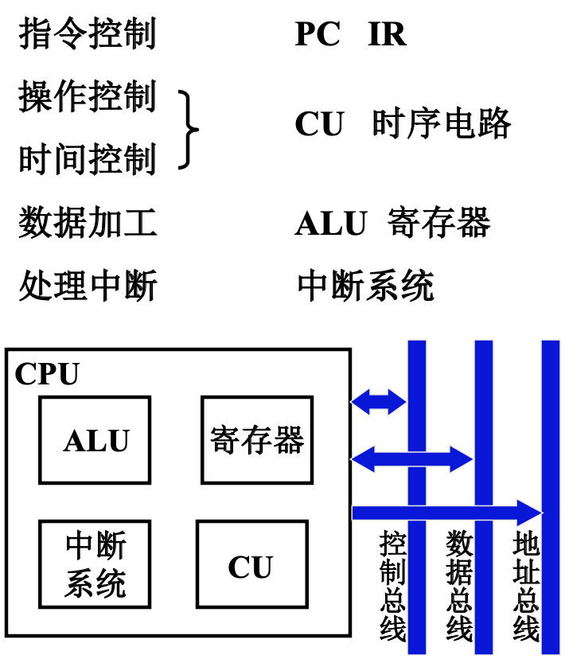

CPU通过总线与系统的其他部分进行通信，包括：

控制总线：双向。CPU发出的控制命令通过控制总线到达各个部件，数据向外；各个部件对CPU提出请求及外部设备状态也通过控制总线送入CPU，数据向内。

数据总线：双向。CPU通过数据总线向外写出数据，也可以通过数据总线从内存等读入数据。

地址总线：单向。都是由CPU发出送入内存或外部设备接口。

这些部件有的之前的文章已经讲过，有些没讲过的会专门拿出来讲一下。

### 4. CPU的寄存器

不同的CPU、不同的指令集结构对寄存器的设置是不一样的，因此这里只是对寄存器的一个抽象的讲解。

1. 用户可见寄存器
    - 通用寄存器：存放操作数；在某些机器，也可以作为某种寻址方式所需的专用寄存器(比如之前讲的基址寻址)。
    - 数据寄存器：存放操作数，需要满足各种类型的数据存放，比如保存整数的寄存器、保存浮点寄存器；有些寄存器可以把两个寄存器拼接存放双倍字长的数据，比如在讲乘法运算的时候，就将ACC寄存器和MQ寄存器拼接起来存放结果。
    - 地址寄存器：存放地址，其位数应满足最大寻址范围；用于特殊寻址方式，比如段基值，栈指针。
    - 条件码寄存器：存放条件码，可作程序分支的依据；如正、负、零、溢出、进位等。

2. 控制和状态寄存器
    - 控制寄存器：比如取指令流程用到：PC --> MAR --> M --> MDR --> IR，其中 MAR、MDR、IR 用户不可见，PC用户可见。
    - 状态寄存器：反映了指令执行结果的情况，或者是计算机软件、硬件的状态。状态寄存器可以用于存放条件码，跟之前的条件码寄存器类似。还有一种状态寄存器叫PSW寄存器，PSW是缩写，翻译过来是程序状态字，PSW寄存器用于存放程序状态字。

> 程序状态字
>
> 在调用子程序或发生中断的时候，为了能让程序正确的返回断点，返回之后还能接着执行给定程序，那么在调用子程序或发生中断前就要保护运行现场和程序断点，这些运行现场和程序断点包括了软件信息和硬件信息，这些信息是保存在寄存器当中的，有些保存程序状态的寄存器可以通过指令集中的指令进行读和写，有的不行，因为涉及状态比较多，如果为每一个状态都设计一条指令来读的话，那么指令集将会非常庞大，为了解决这个问题，设计者就把这些相关的寄存器集合成一个大的寄存器， 这个寄存器就是程序状态字。有些程序状态字比较大，会有几千位，但是可以用交换程序状态字的方式来完成现场的保存。

### 5. 控制单元CU和中断系统

1. CU：产生全部指令的微操作命令序列。任何一条指令要在CPU上执行，CPU要对指令进行译码，根据指令要完成的功能生成完成这些功能的微操命令。CPU要产生的不仅仅是微操命令，而是微操命令序列，即这些命令要按指定顺序执行。
2. 中断系统：下篇再说。

### 6. ALU

之前讲过了。

## 二、指令周期

### 1. 指令周期基本概念

#### 1.1 指令周期

指令周期是指取出并执行一条指令所需的全部时间。

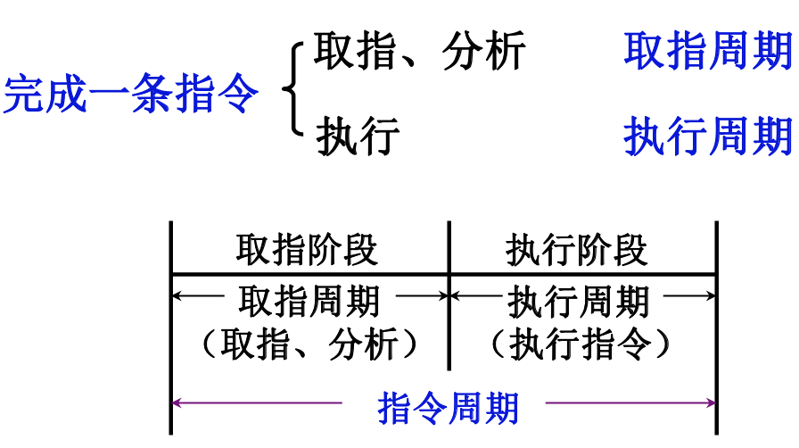

指令周期分为取值周期和执行周期，要注意，这只是一个栗子，不同的计算机分法可能不一致。

#### 1.2 每条指令的指令周期不同

实际上，即使在同一个CPU里，不同指令的指令周期的长度或指令周期里包含机器周期的长度也可能是不一样的。

比如：

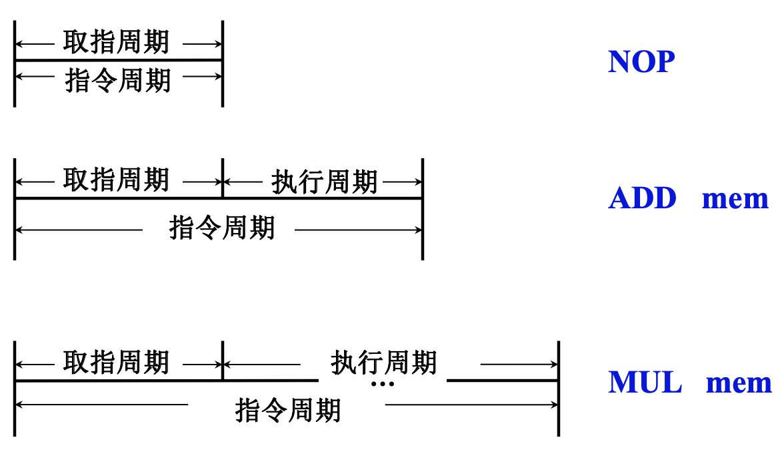

再比如在指令系统中知道，CPU要支持多种寻址方式，比如间接寻址，需要通过形式地址获取有效地址，再通过有效地址获取操作数，期间需要2次访存，如果将这两次访存都归到执行周期，那么执行周期就会比较长，因此我们可以在指令周期中专门加一个间址周期，那么一条指令的解释就由3个阶段构成：

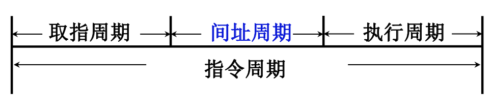

再比如如果计算机支持中断，那么就会在执行周期结束后去查询中断，如果有中断就要保存断点、保存现场等，这一系列操作都要在中断周期完成。

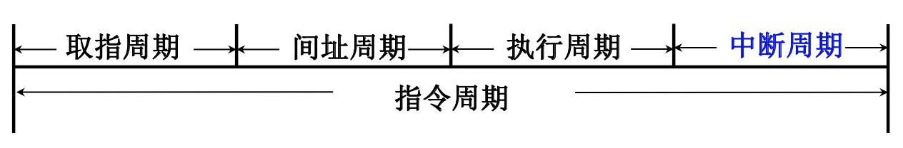

#### 1.3 指令周期流程

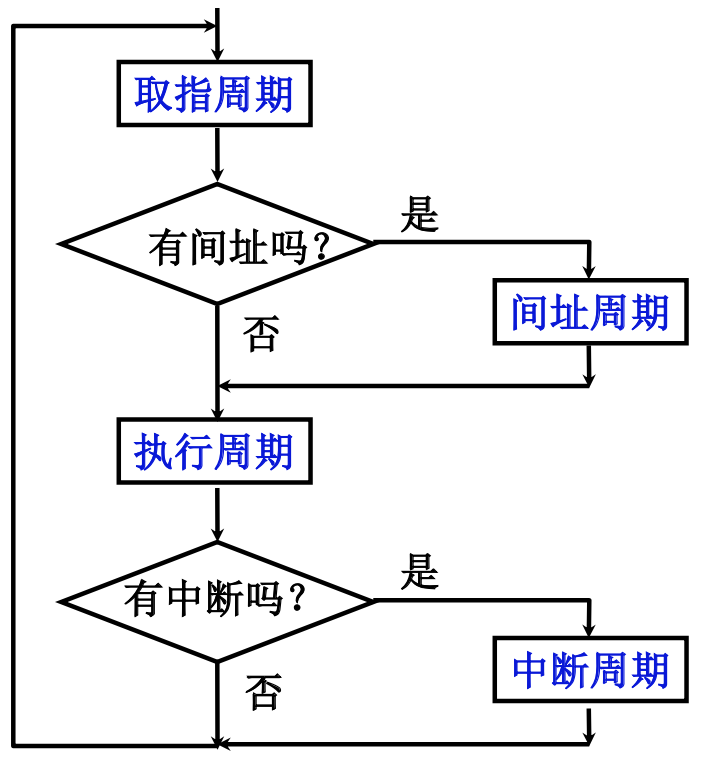

#### 1.4 CPU工作周期的标志

指令周期的不同阶段，控制器需要做不同的操作，控制器需要在指令周期不同的阶段发出不同的控制命令，因此控制器需要知道当前指令周期处于哪一个阶段。

CPU访存有4种性质：

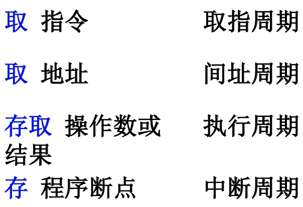

标识方式非常简单，就是用触发器：

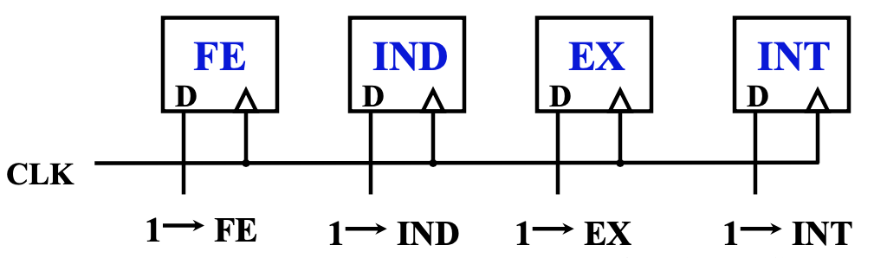

### 2. 指令周期的数据流

#### 2.1 取指周期数据流

取指周期数据流如下图所示(如果看不懂这些缩写，请自觉回去看[计算机基本组成](计算机基本组成.md)QVQ)：

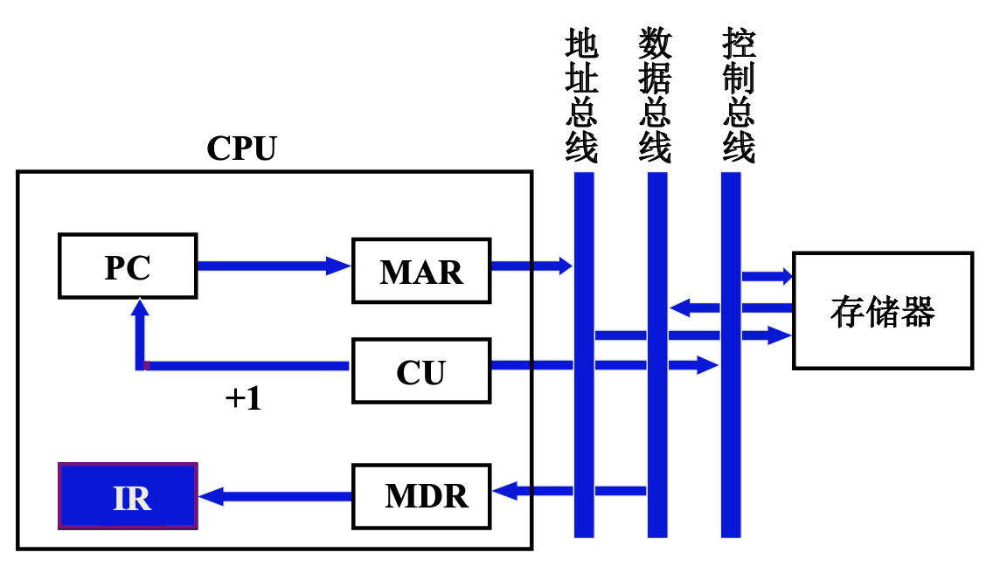

取指周期数据流先从PC开始，PC知道要取哪条指令，PC将指令地址给MAR，MAR将地址通过地址总线送到存储器，此时存储器已经知道指令地址。

接下来开始执行读操作，CU发出读命令，通过控制总线送到存储器，存储器将指令通过数据总线送到MDR中，MDR再将指令送到IR。

那么这次取指令是不是完成了呢？当然木油，我们还要为下一次操作做准备，如果没有发生跳转的话，下一条指令的地址就是PC+1，这个+1操作由CU完成。

#### 2.2 间址周期数据流

接下来我们看看间址周期数据流：

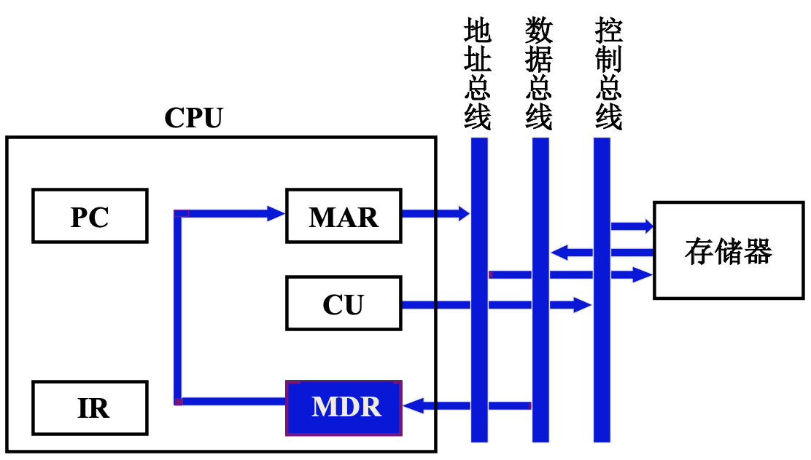

既然是间址周期，表示寻址方式是间接寻址，就要通过指令的地址码部分获取操作数真实的地址，这个地址码在IR和MDR中都有，数据流可以从这两个部件开始，我们假设这台机器从MDR开始，那么数据流情况就是MDR将地址码部分送入到MAR中，MAR通过地址总线将地址码送入到存储器，CU发出读命令，存储器将操作数的有效地址通过数据总线送入MDR中。

#### 2.3 执行周期数据流

不同指令的执行周期数据流不同，差异非常巨大，这里先不做介绍。

#### 2.4 中断周期数据流

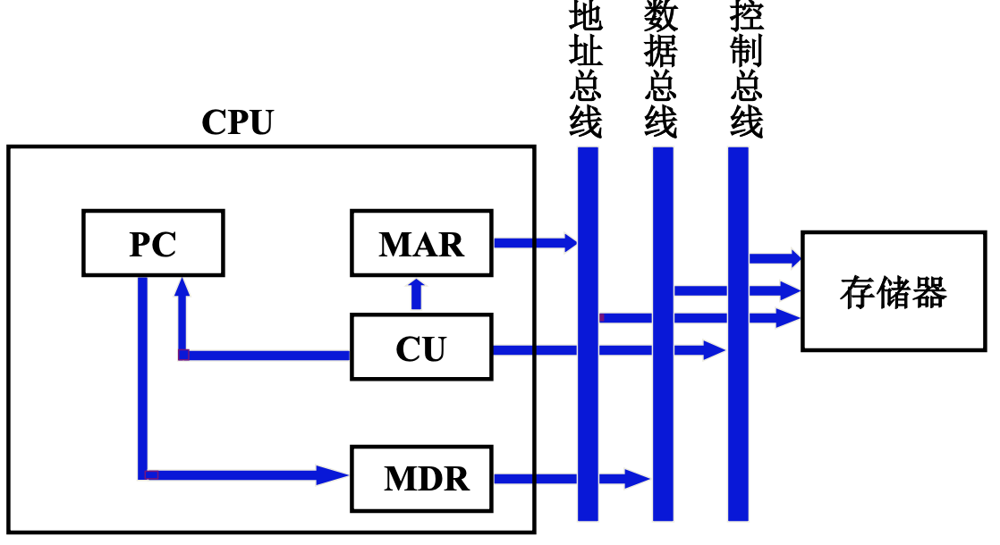

想要分析中断周期的数据流，我们首先要知道中断周期做了什么操作：

1. 保存中断断点；
2. 形成中断服务程序入口地址(这个后续再介绍)；
3. 硬件关中断。

上面的图主要反映了前两个操作。

要保存中断断点，就要知道将断点信息保存到哪个内存单元，在上图所示结构中，CU决定保存到哪个内存单元，因此数据流从CU开始。

CU将要保存断点的内存单元地址给MAR，MAR通过地址总线将地址送入存储器，CU再发出写命令。

接下来就是要保存断点了，那断点在哪里？断点就是中断服务回来要继续执行的程序，就是要执行的下一条指令，这个指令就存在PC，因此PC要将内容送入到MDR，MDR再通过数据总线送入到存储器，这样断点就保存完成。

接下来就要形成中断服务程序入口地址，因为这里暂不多讲，只需知道这个地址由CU产生，并将其送入到PC，那么接下来就会开始执行中断服务程序。

## 三、指令流水

指令流水线技术是现代计算机最常用、最有效的提高指令解释速度的方法。

### 1. 如何提高机器速度

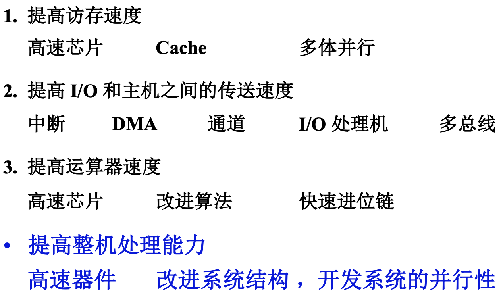

### 2. 系统的并行性

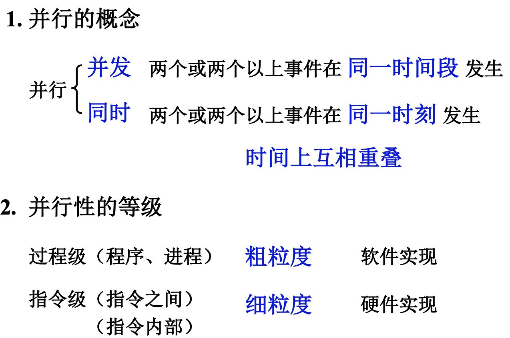

### 3. 指令流水的原理

为了分析简单，我们假设一条指令的执行过程只有取指令和执行指令2个阶段。

#### 3.1 指令的串行执行

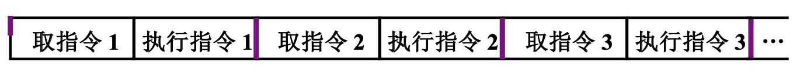

串行执行即 取指令1，执行指令1，执行完指令1后才开始取指令2。

如果我们在实现控制器的时候，将取指令和执行指令完全分开，独立实现，那么取指令的时候只有取指令部件在工作，执行指令的时候只有执行指令部件在工作，即总有一个部件是空闲的。

#### 3.2 指令的二级流水

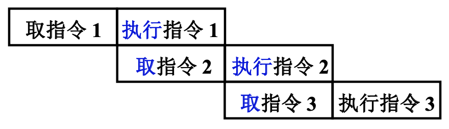

上图所示即二级流水：执行指令的同时取下一条指令。

若取指和执行阶段时间上**完全重叠**，指令周期减半，速度提高1倍。

当然，这是在理想情况下，并不是所有流水线都是理想流水线，并且指令之间也存在相关性，流水线一直处于满负荷状态是很难的。

#### 3.3 影响指令流水效率加倍的因素

这里指的加倍，还是指二级流水，仅仅是我们举的例子，现代处理器中，绝不仅仅是二级流水。

1. 执行时间 > 取指时间；解决方法可以是取指部件和执行部件之间加一个缓冲区，用于缓存取指部件取的指令，执行部件一旦空闲了，就可以去缓冲区获取指令进行执行。

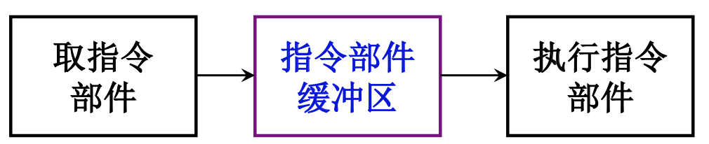

2.

条件转移指令对指令流水的影响；这里指的试试条件转移指令，无条件转移指令对流水线影响较小，因为在译码阶段即可得知转移地址；而条件转移指令必须在指令执行完成后才能知道是否发生转移，也才能确定下条指令地址，造成时间损失较多。解决方法有很多，比如分支预测，但不是重点，有兴趣可以自行查询。

#### 3.4 指令的六级流水

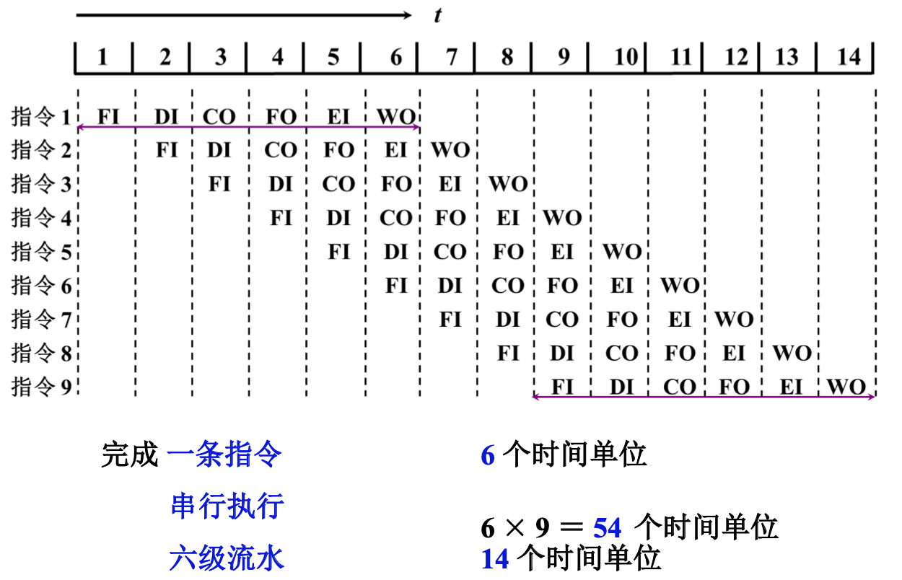

上图给出一个六级流水的栗子，横轴表示时间，纵轴表示指令，这个流水线被分成六级：FI(取指令)、DI(指令译码)、CO(形成操作数的地址)、FO(取出操作数)、EI(执行)、WO(写回操作数)。

假设每个阶段执行时间相同，指令之间不存在冲突，没有条件转移，如果采用串行的方式完成一条指令需要6个时间单位，完成9条需要54个时间单位；如果采用6级流水，那么只使用 了14个时间单位。

### 4. 影响指令流水线性能的因素

#### 4.1 结构相关

不同指令挣用同一功能部件产生资源冲突。

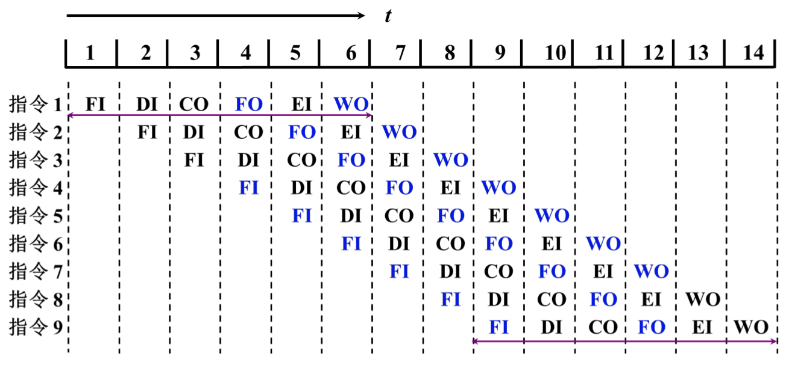

如上图所示，FI、FO、WO都要对内存进行访问，蓝色的部分表示会产生冲突，那有什么方法可以解决呢？

1. 停顿：比如在指令1和指令4在时间4发生了冲突，指令4的FI停顿，在时间5或者更靠后的位置再访问内存，这种方法也称为加入气泡。
2. 指令存储器和数据存储器分开。
3. 指令预取技术：取指部件可以在空闲时间，把多条指令从内存单元取出来，放到指令缓冲队列，适用于访问周期短的情况。

#### 4.2 数据相关

不同的指令因重叠操作，一条指令通常是前面读后面写，那么久可能改变操作数的读/写访问顺序。

数据相关一共有3种：

1. 写后读相关(RAW)：对某一个内存单元或者寄存器，要先完成写操作，再完成读操作。
2. 读后写相关(WAR)：对某一个内存单元或者寄存器，要先完成读操作，再完成写操作。
3. 写后写相关(WAW)：先写入，再写入，这两个写入是有时间先后顺序的，这个写入顺序由程序决定。

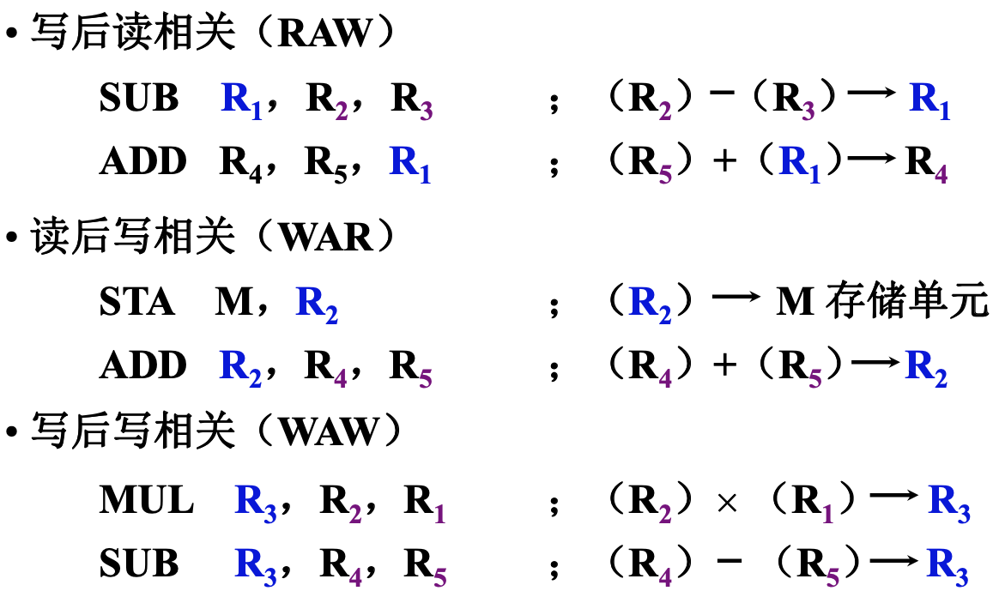

解决方法这里只简单提一下，有兴趣的同学自行查找资料。

1. 后推法：如果上图RAW的栗子，SUB指令要写R1，ADD指令就要等待，等R1被写入才开始执行。
2.

采用旁路技术：这里只简单讲下思路，还是RAW的栗子，采用后推法要等第一条指令执行完才能开始第二条指令，这里会存在时间浪费，事实上，当R2-R1完成的时候结果就已经出来了，可以直接送入到第二条指令的输入，而不需要先写入R1，再读取R1，这节省了时间。

#### 4.3 控制相关

控制相关是由专业指令引起的：

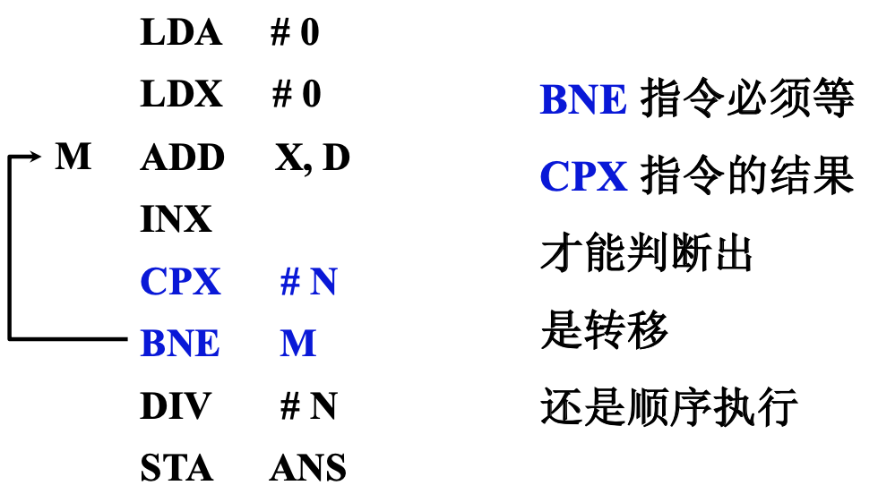

这在流水线中会造成浪费，我们结合之前的一个栗子看一下：

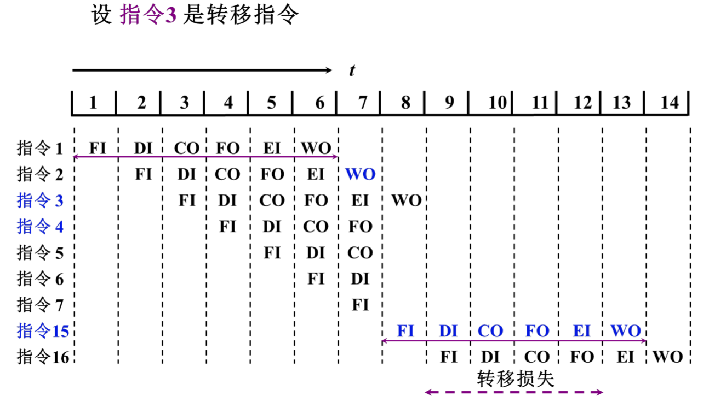

假设指令3是转移指令，我们知道转移指令要指令执行完成后才知道是否发生跳转，若不发生跳转，指令顺序执行，若发生跳转，要给出跳转后的指令地址。

指令3进入流水线执行，时间4指令4也进入流水线，时间5指令5进入流水线...

到时间7指令执行完，知道发生了跳转，跳转到指令15，但此时指令4、5、6等指令已经进入流水线，正常串行执行的话这些指令是不会被执行的，因此它们的执行结果要作废，然后从指令15开始分析、执行。

### 5. 流水线性能

要分析流水线的性能首先要知道流水线有哪些指标。

#### 5.1 吞吐率

单位时间内流水线所完成的指令或输出结果的数量称为吞吐率。

吞吐率有2个指标：

1. 最大吞吐率：流水线满负荷运作，没有发生资源冲突、没有发生数据相关，也没有转移指令等，这条流水线能达到的最大吞吐率。
1. 实际吞吐率：一段时间内完成的任务数或指令的条数除以完成这些任务花费的时间。

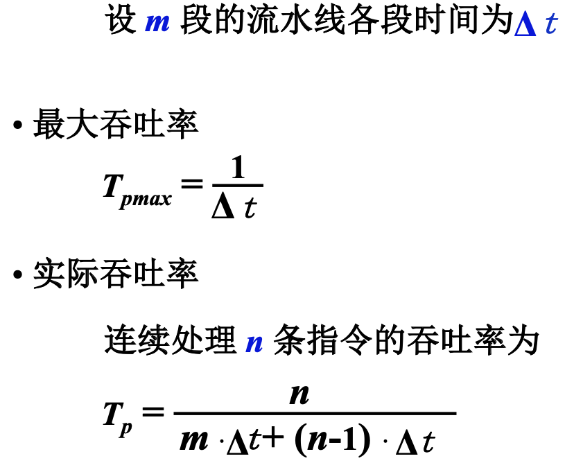

#### 5.2 加速比

加速比给出了如果我们采用流水的方式执行指令的话效果如何，加速比是指采用流水线技术和不采用流水线技术二者执行指令的速度的比值。

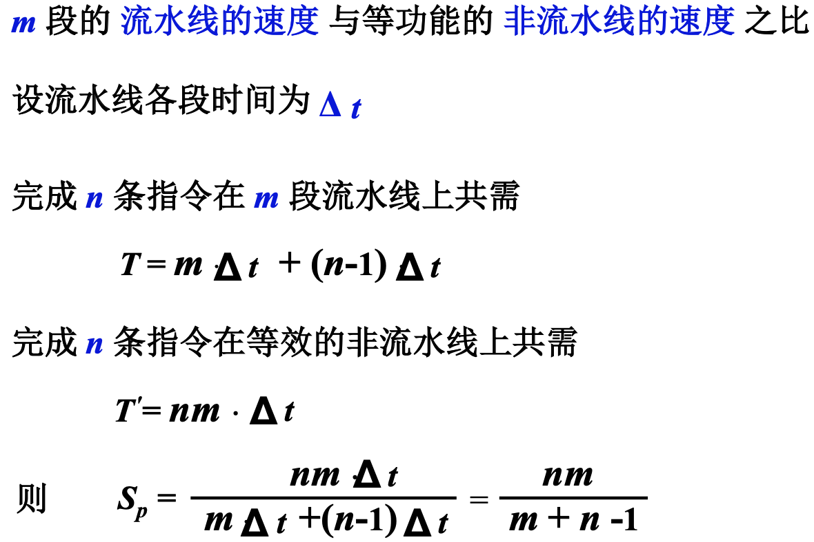

#### 5.3 流水线效率

所谓的流水线效率是指流水线中各功能段(硬件)的利用率。

由于流水线有**建立时间**(第一条指令从进入流水线到结果输出的时间)和**排空时间**(最后一条指令进入到流水线到结果输出的时间)，因此各个功能段的设备不可能一直处于工作状态。

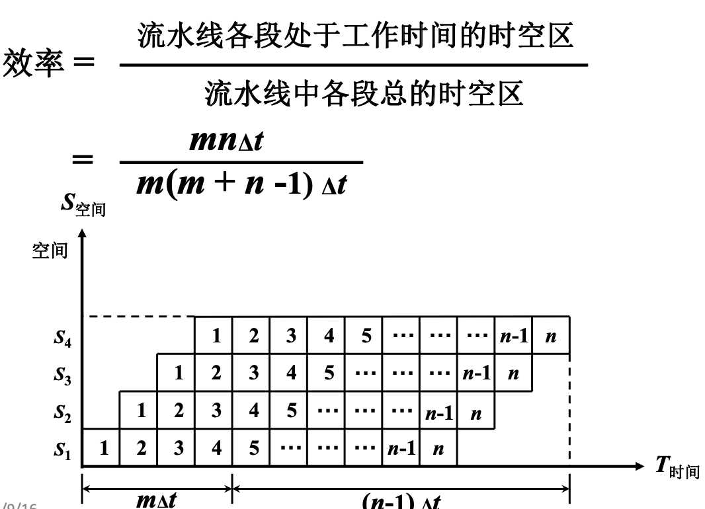

### 6. 流水线的多发技术

#### 6.1 超标量技术

在每个时钟周期内，有多条独立的指令进入到不同的流水线中执行，即并发多条独立指令，这种方法就是超标量技术。这样就要配置多个功能部件。

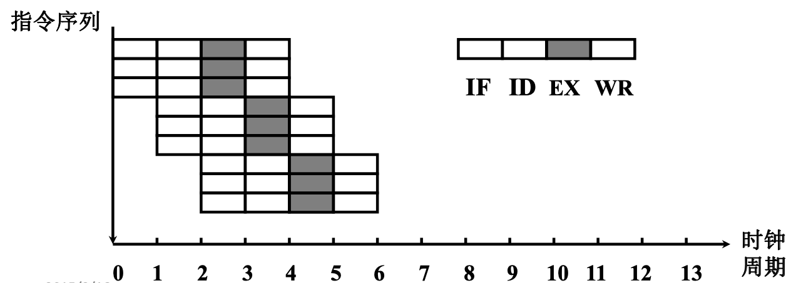

如上图所示，我们配置了3条独立的流水线，在每个时钟周期，可以有3条独立的指令进入流水线执行，这样跟只有一条流水线的最高加速比可以达到3倍。

这种情况下，不能调整指令的执行顺序，通过编译优化技术，把可并行执行的指令搭配起来。

#### 6.2 超流水线技术

把一个时钟周期进一步的细分，比如再细分成3段，在一个时钟周期之内，3条指令进入到流水线中，不是同时间进入流水线，而是分阶段进入流水线，那么一个功能部件在一个时钟周期内可以被使用多次。

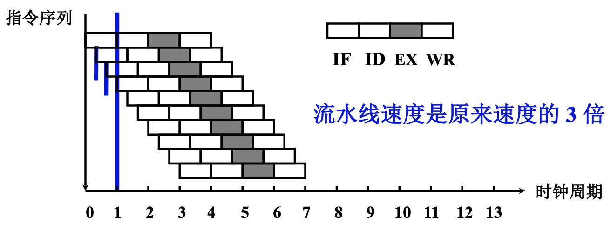

使用超流水技术一般来说也不能调整指令的执行顺序，要靠编译程序解决优化问题。

#### 6.3 超长指令字技术

由编译程序挖掘出指令间潜在的并行性，将多条能并行操作的指令组合成一条，具有多个操作码字段的超长指令字。

> 这个并行性的找，是根据部件的数量和种类来确定的。

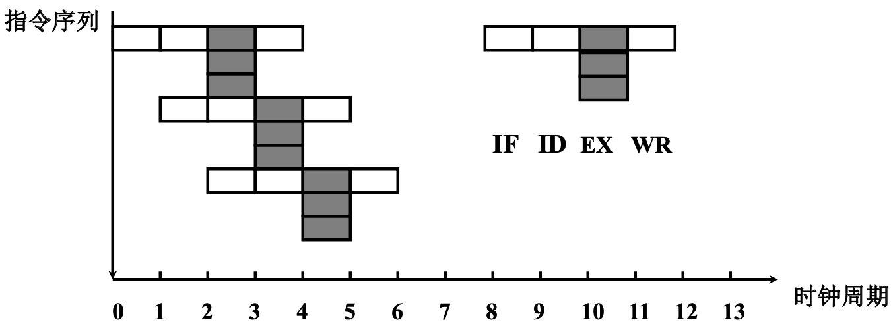

上图的灰色部分是执行部件，可以看到有多个执行部件。

### 7. 流水线结构

#### 7.1 指令流水线结构

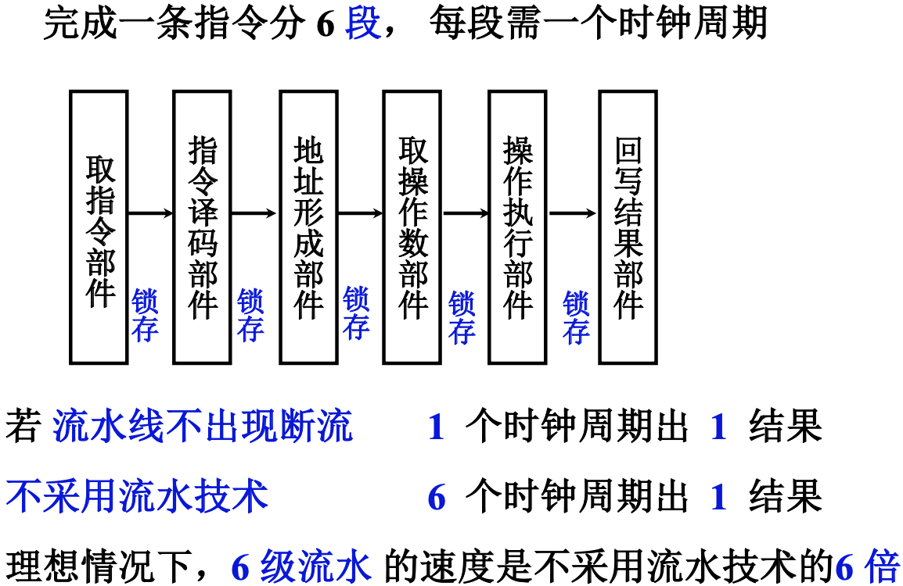

#### 7.2 运算流水线

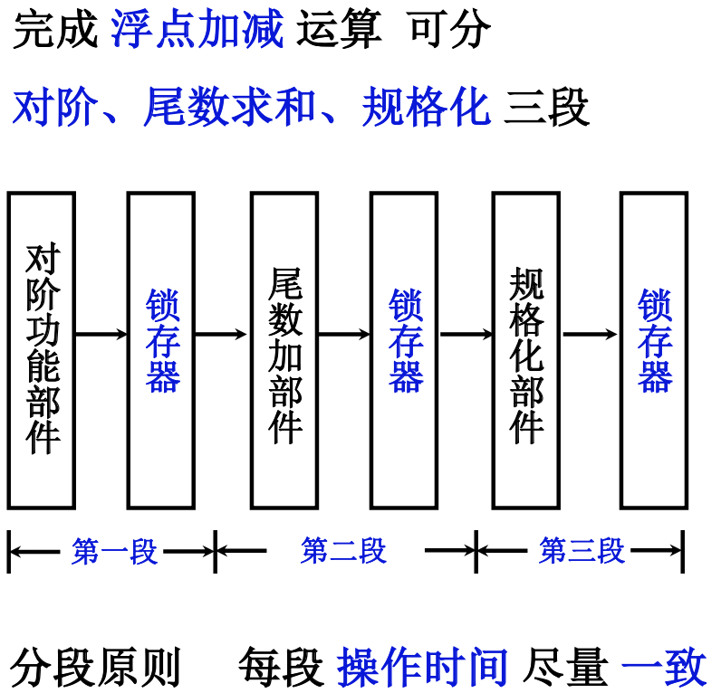

