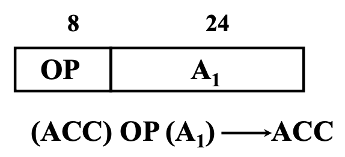
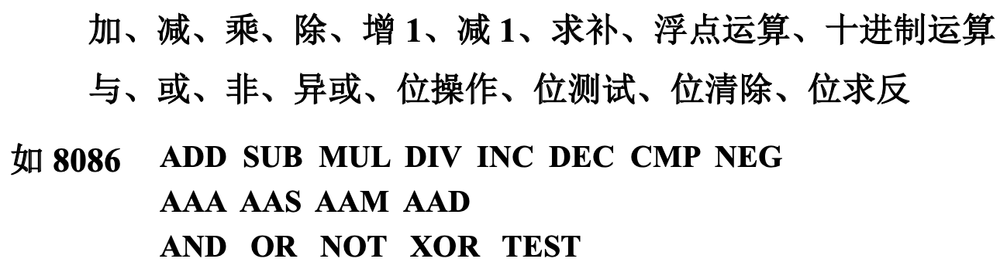
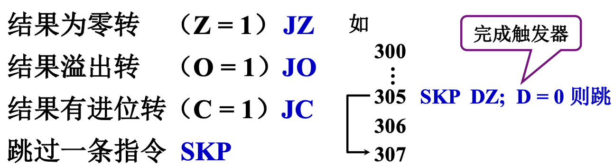
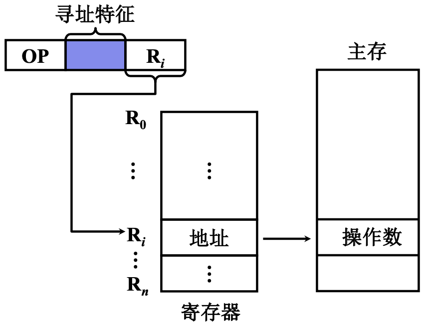

# 指令系统

<!-- START doctoc generated TOC please keep comment here to allow auto update -->
<!-- DON'T EDIT THIS SECTION, INSTEAD RE-RUN doctoc TO UPDATE -->

- [一、机器指令](#%E4%B8%80%E6%9C%BA%E5%99%A8%E6%8C%87%E4%BB%A4)
    - [1. 指令的一般格式](#1-%E6%8C%87%E4%BB%A4%E7%9A%84%E4%B8%80%E8%88%AC%E6%A0%BC%E5%BC%8F)
        - [1.1 操作码](#11-%E6%93%8D%E4%BD%9C%E7%A0%81)
        - [1.2 地址码](#12-%E5%9C%B0%E5%9D%80%E7%A0%81)
    - [2. 指令字长](#2-%E6%8C%87%E4%BB%A4%E5%AD%97%E9%95%BF)
    - [3. 小结](#3-%E5%B0%8F%E7%BB%93)
- [二、操作数类型和操作类型](#%E4%BA%8C%E6%93%8D%E4%BD%9C%E6%95%B0%E7%B1%BB%E5%9E%8B%E5%92%8C%E6%93%8D%E4%BD%9C%E7%B1%BB%E5%9E%8B)
    - [1. 操作数类型](#1-%E6%93%8D%E4%BD%9C%E6%95%B0%E7%B1%BB%E5%9E%8B)
    - [2. 数据在存储器中的存放方式](#2-%E6%95%B0%E6%8D%AE%E5%9C%A8%E5%AD%98%E5%82%A8%E5%99%A8%E4%B8%AD%E7%9A%84%E5%AD%98%E6%94%BE%E6%96%B9%E5%BC%8F)
        - [2.1 从任意位置开始存储](#21-%E4%BB%8E%E4%BB%BB%E6%84%8F%E4%BD%8D%E7%BD%AE%E5%BC%80%E5%A7%8B%E5%AD%98%E5%82%A8)
        - [2.2 从一个存储字的起始位置开始访问](#22-%E4%BB%8E%E4%B8%80%E4%B8%AA%E5%AD%98%E5%82%A8%E5%AD%97%E7%9A%84%E8%B5%B7%E5%A7%8B%E4%BD%8D%E7%BD%AE%E5%BC%80%E5%A7%8B%E8%AE%BF%E9%97%AE)
        - [2.3 边界对准方式](#23-%E8%BE%B9%E7%95%8C%E5%AF%B9%E5%87%86%E6%96%B9%E5%BC%8F)
    - [3. 操作类型](#3-%E6%93%8D%E4%BD%9C%E7%B1%BB%E5%9E%8B)
        - [1. 数据传送](#1-%E6%95%B0%E6%8D%AE%E4%BC%A0%E9%80%81)
        - [2. 算术逻辑操作](#2-%E7%AE%97%E6%9C%AF%E9%80%BB%E8%BE%91%E6%93%8D%E4%BD%9C)
        - [3. 移位操作](#3-%E7%A7%BB%E4%BD%8D%E6%93%8D%E4%BD%9C)
        - [4. 转移](#4-%E8%BD%AC%E7%A7%BB)
- [三、寻址方式](#%E4%B8%89%E5%AF%BB%E5%9D%80%E6%96%B9%E5%BC%8F)
    - [1. 指令寻址](#1-%E6%8C%87%E4%BB%A4%E5%AF%BB%E5%9D%80)
    - [2. 数据寻址](#2-%E6%95%B0%E6%8D%AE%E5%AF%BB%E5%9D%80)
        - [1. 立即寻址](#1-%E7%AB%8B%E5%8D%B3%E5%AF%BB%E5%9D%80)
        - [2. 直接寻址](#2-%E7%9B%B4%E6%8E%A5%E5%AF%BB%E5%9D%80)
        - [3. 隐含寻址](#3-%E9%9A%90%E5%90%AB%E5%AF%BB%E5%9D%80)
        - [4. 间接寻址](#4-%E9%97%B4%E6%8E%A5%E5%AF%BB%E5%9D%80)
        - [5. 寄存器寻址](#5-%E5%AF%84%E5%AD%98%E5%99%A8%E5%AF%BB%E5%9D%80)
        - [6. 寄存器间接寻址](#6-%E5%AF%84%E5%AD%98%E5%99%A8%E9%97%B4%E6%8E%A5%E5%AF%BB%E5%9D%80)
        - [7. 基址寻址](#7-%E5%9F%BA%E5%9D%80%E5%AF%BB%E5%9D%80)
        - [8. 变址寻址](#8-%E5%8F%98%E5%9D%80%E5%AF%BB%E5%9D%80)
        - [9. 相对寻址](#9-%E7%9B%B8%E5%AF%B9%E5%AF%BB%E5%9D%80)
        - [10. 堆栈寻址](#10-%E5%A0%86%E6%A0%88%E5%AF%BB%E5%9D%80)

<!-- END doctoc generated TOC please keep comment here to allow auto update -->

[TOC]

## 一、机器指令

### 1. 指令的一般格式

指令一般分为操作码字段和地址码字段。

#### 1.1 操作码

操作码反映机器做什么操作；实际上操作码的作用远远超过了指出计算机要做什么操作这个功能，很多机器还要指出要对什么数据进行操作，有的机器还指出了操作数的寻址方式。

操作码的长度可以是固定的也可以是可变的，长度固定的操作码一般用于指令字长较长的情况，上面的图我们看操作码字段是一块，这是逻辑的表示方式，实际上操作码可以分开，分成不同的位置进行表示；长度可变的操作码分散在指令字的不同字段中，这些后续会介绍到。

**扩展操作码技术**

为了实现操作码长度可变，我们要使用扩展操作码技术来扩展操作码的长度。

扩展的方式一般有两种：

- 保留一个编码的码点，作为扩展标志；
- 用操作码的某一位作为扩展标志。

我们主要讲保留码点的方式扩展。

如上图所示，我们假设指令总长度不变，是16位，OP(操作码)、A1、A2、A3各4位，如果我们不对操作码进行扩展，那么操作码只有16种，根本无法满足计算机的使用需求，指令的个数必须进行扩展。

如上图所示，我们可以用4个1作为扩展的码点。

4位操作码时从0000~1110有15条三地址指令；

如果前4位出现了4个1，表示指令的操作码至少是8位，即8位操作码；

...

如果前16位出现了16个1，表示指令的操作码至少是位，即16位操作码。

为了使计算机能知道操作码究竟有几位，在扩展操作码的时候必须遵守一个原则：**短操作码一定不能是长操作码的前缀**。

比如：二地址指令的高4位不能与三地址指令的操作码字段相同，否则指令译码时无法区分；这就是1111不用而作为二地址操作码标志的原因。

#### 1.2 地址码

下面假设指令字长为 32 位，操作码固定为 8 位

**四地址**

四地址的情况下，一共进行4次访存，寻址范围是2^6 = 64，寻址范围非常小，几乎不可用，我们就需要减少地址码的个数，增加访存范围。

**三地址**

如果我们用PC(程序计数器)替代A4，那么久可以多出6位，就成了三地址：

三地址的情况下，一共进行4次访存，寻址范围是2^8 = 256。

**二地址**

我们还可以进一步减少地址码的个数，比如我们可以用A1或A2来代替A3，可以不把计算结果保存到A3中，而是保存在源操作数所在的地址单元中，这样就变成了二地址。

二地址的情况下，一共进行4次访存，寻址范围是2^12 = 4K。

如果我们不将结果放在A1或A2，而是将结果放到ACC中(ACC在CPU中，不在内存)，那么访存次数将减少到3次。

**一地址**

顺着上面的思路，假如我们约定要想做特定的操作，其中一个操作数必须在ACC中，另一个操作数在内存中，并将操作结果放入到ACC中，那么地址码可以进一步减少到一位，即一地址。

这个地址只需指明除了ACC中的操作数外的另一名操作数在内存中的地址即可。

一地址的情况下，一共进行2次访存，寻址范围是2^24 = 16M。

**零地址**

> ？？？越来越过分了哈！

比如对ACC中的操作数进行取反、判断等逻辑，操作数通过隐含的方式指定到了ACC，这时候就不需要地址码；

再比如某些堆栈计算机，ADD(加法操作)就表示栈顶元素相加，并把结果保存到栈顶，这时候就不需要地址码。

### 2. 指令字长

### 3. 小结

1. 当用一些硬件资源替代指令中的地址码字段后
    - 可扩大指令的寻址范围(指令字长固定的话)
    - 可以缩短指令字长
    - 可以减少访存次数
2. 当指令的地址字段为寄存器时
    - 可缩短指令字长
    - 指令执行阶段不访存

## 二、操作数类型和操作类型

### 1. 操作数类型

操作数就是指令要进行处理的数据。

常见的操作数类型主要有以下几种(这个图横着看，如 地址 | 无符号证书)：

### 2. 数据在存储器中的存放方式

这个图之前在讲那啥的时候出现过，就是大端存储和小端存储。

那么数据在内存中如何存储呢？

下面假设存储字长64 位，机器字长32位，一个字节8位，一个半字16位，一个单字32位，一个双字64位。

#### 2.1 从任意位置开始存储

优点：不浪费存储资源。

缺点：除了访问一个字节之外，访问其他任何类型的数据，都可能划分两个存储周期的时间。读写控制比较复杂。

#### 2.2 从一个存储字的起始位置开始访问

那么要怎么在一个存储周期里取到数据呢？可以从一个存储字的起始位置开始访问：

每次存取数据，不管是什么类型，都从一个存储字的起始位置开始读写。

优点：物理访问何种类型的数据，在一个周期内均可完成，读写控制简单。

缺点：如上图所示，黑色部分都是浪费的存储资源，会浪费宝贵的存储资源。

#### 2.3 边界对准方式

那有没有一种方式，我全都要，既要能在一个存取周期内取到数据，又要节省存储资源呢？

哎，有，那就是边界对准方式：**从地址的整数倍位置开始访问**，我们先看下图：

字节：随便放，可以存储在任何一个内存单元中；

双字：占8个字节，在这个栗子中，可以从起始地址是8的倍数开始存放；

半字：占2个字节，在这个栗子中，可以从起始地址是2的倍数开始存放；

单字：占4个字节，在这个栗子中，可以从起始地址是4的倍数开始存放；

所谓的边界对准就是数据存放的起始地址是数据长度(按照编址单位进行计算)的整数倍。

本方案是前两个方案的折中，在一个存取周期内可以完成存储访问，空间浪费也不太严重。

### 3. 操作类型

#### 1. 数据传送

#### 2. 算术逻辑操作

#### 3. 移位操作

算术移位、逻辑移位、循环移位(带进位和不带进位)

#### 4. 转移

1. 无条件转移

JMP指令

2. 条件转移

3. 调用和返回

4. 陷阱与陷阱指令

陷阱指意外事故的通道，在执行一条指令的过程中，这条指令本身执行过程出现意外，比如操作码错误、除数为零等，都会引发陷阱指令。

陷阱指令一般不提供给用户直接使用，在出现事故时，由CPU自动产生并执行(隐指令)。

也有一些系统会提供用户使用的陷阱指令，如 8086 INT TYPE 软中断，用以完成系统调用。

5. 输入输出

并不是所有设备都有输入输出指令，如果I/O端口的编址空间被作为内存编址空间的一部分空间，就不需要输入输出指令，直接用访问存储器或内存设备的方式就可以进行输入输出。

如果I/O端口有独立的地址空间，那么久需要输入输出指令。

## 三、寻址方式

寻址就是确定**本条指令**的**操作数地址**或者**下一条**要执行**指令**的**指令地址**。所谓寻址，就是如何找到指令和操作数的地址。

寻址方式可以划分成两类：指令寻址和数据寻址。

### 1. 指令寻址

指令的寻址主要有两种方式：

- 顺序寻址：取完地址后顺序取下一条指令的地址；因为指令是存在PC中的，因此取完PC中的指令，要+1之后再取下一条指令的地址，即( PC ) + 1= PC。这里的的+1并不是字面意义上的+1，+1由步长决定。
- 跳跃：由专业指令指出，如下图：

### 2. 数据寻址

数据寻址形式比较多，先给出指令格式：

寻址特征指出了这条指令的寻址方式，接下来我们介绍一下寻址方式。

#### 1. 立即寻址

所谓立即寻址(或叫立即数寻址)即形式地址给出来的就是操作数，操作数直接进行操作码指定的运算。

立即寻址执行指令阶段不需要访存，因为在取指令的时候，操作数已经跟着指令一起取到了CPU；A的位数限制了立即数的范围。

#### 2. 直接寻址

所谓直接寻址即形式地址等于有效地址，EA = A，A就是操作数所在的内存单元地址。

如上图所示，LDA指令是指将操作数A从内存中取出，保存到ACC，要注意这是在我们的模型机中给出的规定，并不是所有机器都是这样的。

执行阶段需要访存一次，当然这是我们假设A只有一个地址码；

A的位数决定了该条指令操作数的寻址范围；

操作数的地址不易修改(必须修改A)。

#### 3. 隐含寻址

所谓隐含寻址即操作数的寻址方式隐含到操作码中，或参与运算的数据的地址由操作码指出。

如上图所示，ADD指令是一条加法指令，需要两个操作数相加，指令本身给出了一个操作数的地址A，另一个操作数隐含在ACC中。

指令中少了一个地址字段，可以缩短指令字长。

#### 4. 间接寻址

所谓间接寻址即操作数保存在某个内存单元中，指令给出的地址是保存这个操作数地址的内存单元地址，EA =(A)，有效地址由形式地址间接提供。

可扩大寻址范围：A的位数可能比较短，但在内存中EA的长度可以比较长，因此扩大了寻址范围。

便于编程：可以通过修改EA的内容来修改操作数，而不需要修改A的地址。

多次间址：主存中的地址前面有一个标志位，1表示这依然是一个形式地址，需要再次访存，直到标志位为0，表示这是个有效地址，通过有效地址找到操作数。

#### 5. 寄存器寻址

所谓寄存器寻址即它的有效地址就是寄存器的编号，EA = R。

在执行阶段不需要访存，操作数在寄存器中，寄存器在CPU中，执行速度快。

寄存器数量有限，可缩短指令字长 。

#### 6. 寄存器间接寻址

所谓寄存器间接寻址即操作数保存在内存中，操作数的地址保存在寄存器中，EA = ( R )。

这种方式执行阶段需要访存。

便于循环程序的编写，要修改操作数只需要修改寄存器中的地址即可。

#### 7. 基址寻址

所谓的基址寻址即基址寄存器中的内容加上指令中操作数地址，得到的地址就是操作数的有效地址。

基址寻址有两种形式：

一种是采用专用寄存器作为基址寄存器，EA = ( BR ) + A，BR 为基址寄存器。

- 扩大寻址范围：通过调整BR中的内容即可调整寻址范围。
- 有利于多道程序：多道程序分时执行的时候，程序的起始地址可以放在BR中，在执行过程中动态形成操作数地址，这种方式在计算机结构领域被称为程序的动态定位。

另一种形式是采用通用寄存器作为基址寄存器，

#### 8. 变址寻址

所谓变址寻址即指定一个变址寄存器，寄存器中的内容与A(指令中的形式地址)相加，得到有效地址，EA = ( IX ) +A，IX 为变址寄存器(专用)，通用寄存器也可以作为变址寄存器；其与基址寻址相似，但又有较大差异。

便于处理数组问题：A可以作为数组的起始位置，IX可以作为数组的下标，具体的我们看一个栗子。

设数据块首地址为 D，求 N 个数的平均值

#### 9. 相对寻址

所谓相对寻址即相对PC的地址，是PC里的内容加上形式地址得到有效地址，EA = ( PC ) + A，A是相对于当前指令的位移量(可正可负，补码)。

我们来看个相对寻址的栗子：

我们再看个按字节相对寻址的栗子：

#### 10. 堆栈寻址

堆栈分为两种：

- 硬堆栈：由两个或者多个寄存器作为栈顶，栈底部分依然在内存中；比如加法操作，两个操作数来自栈顶，操作结果放到内存中。
- 软堆栈：指定的一段内存空间。

先进后出(一个入出口) 栈顶地址由SP指出。

进栈分析：进栈前SP=2000H，进栈后SP-1=1FFFH；

出栈分析：出栈前SP=1FFFH，出栈后SP+1=2000H。

下面我们看个栗子：

