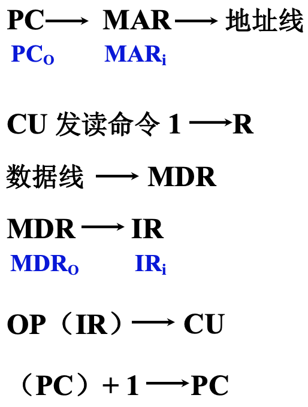
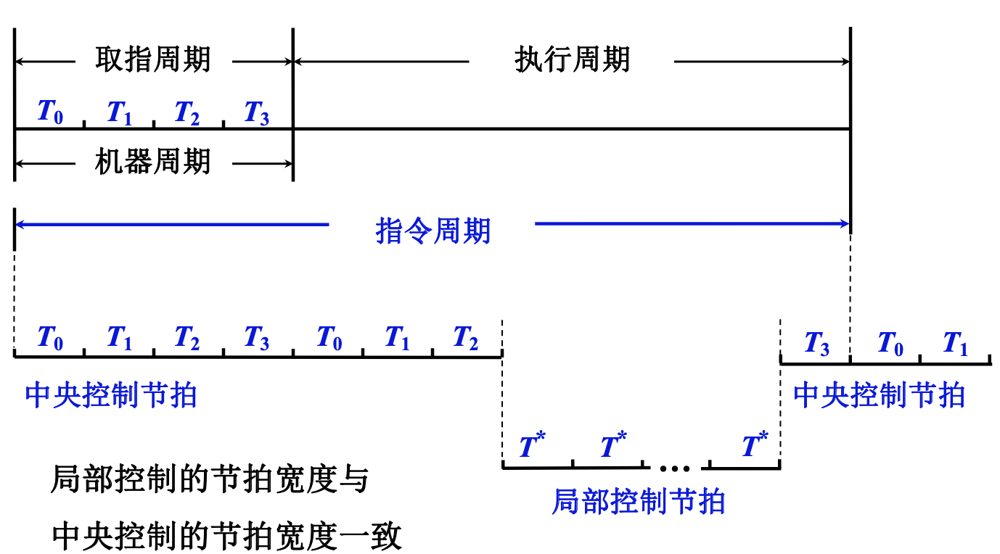

# 控制单元

<!-- START doctoc generated TOC please keep comment here to allow auto update -->
<!-- DON'T EDIT THIS SECTION, INSTEAD RE-RUN doctoc TO UPDATE -->

- [一、微操作命令分析](#%E4%B8%80%E5%BE%AE%E6%93%8D%E4%BD%9C%E5%91%BD%E4%BB%A4%E5%88%86%E6%9E%90)
    - [1. 取指周期](#1-%E5%8F%96%E6%8C%87%E5%91%A8%E6%9C%9F)
    - [2. 间址周期](#2-%E9%97%B4%E5%9D%80%E5%91%A8%E6%9C%9F)
    - [3. 执行周期](#3-%E6%89%A7%E8%A1%8C%E5%91%A8%E6%9C%9F)
        - [3.1 非访存指令](#31-%E9%9D%9E%E8%AE%BF%E5%AD%98%E6%8C%87%E4%BB%A4)
        - [3.2 访存指令](#32-%E8%AE%BF%E5%AD%98%E6%8C%87%E4%BB%A4)
        - [3.3 转移指令](#33-%E8%BD%AC%E7%A7%BB%E6%8C%87%E4%BB%A4)
        - [3.4. 三类指令的指令周期](#34-%E4%B8%89%E7%B1%BB%E6%8C%87%E4%BB%A4%E7%9A%84%E6%8C%87%E4%BB%A4%E5%91%A8%E6%9C%9F)
    - [4. 中断周期](#4-%E4%B8%AD%E6%96%AD%E5%91%A8%E6%9C%9F)
- [二、控制单元的功能](#%E4%BA%8C%E6%8E%A7%E5%88%B6%E5%8D%95%E5%85%83%E7%9A%84%E5%8A%9F%E8%83%BD)
    - [1. 控制单元的外特性](#1-%E6%8E%A7%E5%88%B6%E5%8D%95%E5%85%83%E7%9A%84%E5%A4%96%E7%89%B9%E6%80%A7)
        - [1.1 输入信号](#11-%E8%BE%93%E5%85%A5%E4%BF%A1%E5%8F%B7)
        - [1.2 输出信号](#12-%E8%BE%93%E5%87%BA%E4%BF%A1%E5%8F%B7)
    - [2. 控制信号举例](#2-%E6%8E%A7%E5%88%B6%E4%BF%A1%E5%8F%B7%E4%B8%BE%E4%BE%8B)
        - [2.1 不采用CPU内部总线的方式](#21-%E4%B8%8D%E9%87%87%E7%94%A8cpu%E5%86%85%E9%83%A8%E6%80%BB%E7%BA%BF%E7%9A%84%E6%96%B9%E5%BC%8F)
        - [2.2 采用CPU内部总线的方式](#22-%E9%87%87%E7%94%A8cpu%E5%86%85%E9%83%A8%E6%80%BB%E7%BA%BF%E7%9A%84%E6%96%B9%E5%BC%8F)
- [三、多级时序系统](#%E4%B8%89%E5%A4%9A%E7%BA%A7%E6%97%B6%E5%BA%8F%E7%B3%BB%E7%BB%9F)
    - [1. 机器周期](#1-%E6%9C%BA%E5%99%A8%E5%91%A8%E6%9C%9F)
    - [2. 时钟周期](#2-%E6%97%B6%E9%92%9F%E5%91%A8%E6%9C%9F)
    - [3. 多级时序系统](#3-%E5%A4%9A%E7%BA%A7%E6%97%B6%E5%BA%8F%E7%B3%BB%E7%BB%9F)
- [四、控制方式](#%E5%9B%9B%E6%8E%A7%E5%88%B6%E6%96%B9%E5%BC%8F)
    - [1. 同步控制方式](#1-%E5%90%8C%E6%AD%A5%E6%8E%A7%E5%88%B6%E6%96%B9%E5%BC%8F)
        - [1.1 采用定长的机器周期](#11-%E9%87%87%E7%94%A8%E5%AE%9A%E9%95%BF%E7%9A%84%E6%9C%BA%E5%99%A8%E5%91%A8%E6%9C%9F)
        - [1.2 采用不定长的机器周期](#12-%E9%87%87%E7%94%A8%E4%B8%8D%E5%AE%9A%E9%95%BF%E7%9A%84%E6%9C%BA%E5%99%A8%E5%91%A8%E6%9C%9F)
        - [1.3 采用中央控制和局部控制相结合的方法](#13-%E9%87%87%E7%94%A8%E4%B8%AD%E5%A4%AE%E6%8E%A7%E5%88%B6%E5%92%8C%E5%B1%80%E9%83%A8%E6%8E%A7%E5%88%B6%E7%9B%B8%E7%BB%93%E5%90%88%E7%9A%84%E6%96%B9%E6%B3%95)
    - [2. 异步控制](#2-%E5%BC%82%E6%AD%A5%E6%8E%A7%E5%88%B6)
    - [3. 联合控制方式](#3-%E8%81%94%E5%90%88%E6%8E%A7%E5%88%B6%E6%96%B9%E5%BC%8F)

<!-- END doctoc generated TOC please keep comment here to allow auto update -->

[TOC]

## 一、微操作命令分析

微操作命令：指令在解释过程中，由控制单元CU发出的一些指令，这些指令要完成的动作和整体指令相比要小得多，所以把这些操作命令称为微操作命令。

以下内容我们基于一个**假设**前提：**指令是定长的，长度和机器字长、存储字长相等，通过一次访存、一个主存周期就可以把响应的指令、操作数的地址取出放到CPU指定寄存器**。

完成一条指令分为4个工作周期：

1. 取指周期：把指令从给定的内存单元中取出来。
2. 间址周期：如果指令采用了间址寻址的方式，那么将在间址周期中将操作数的有效地址取出，放入到指令的指令码部分。
3. 执行周期：完成了对操作数的读取和操作。
4. 中断周期：如果有中断请求，CPU要中断响应。

下面就看看在4个周期里，控制单元要发出哪些控制命令。

### 1. 取指周期

上图没有给出ALU，因为取指周期不需要用到ALU。

| 操作                 | 说明                                                         |
| -------------------- | ------------------------------------------------------------ |
| PC -->MAR --> 地址线 | 要想取出指令，就要知道指令在哪，指令的地址在PC，PC将下一条指令的地址放到MAR，MAR通过地址线将地址送到存储器 |
| 1 --> R              | 由控制单元向存储器发出读命令。                               |
| M(MAR) --> MDR       | 存储器将指令通过数据总线送到MDR中。                          |
| MDR --> IR           | MDR将指令送到IR中，指令就被取出到了IR寄存器                  |
| OP(IR) --> CU        | 译码，将指令的操作码部分送入CU，由CU确认这条指令到底做什么操作 |
| (PC) + 1 --> PC      | 指令取完，PC中的值已经无效，需要+1更新PC的值，为下一次操作做准备 |

### 2. 间址周期

| 操作           | 说明                                                         |
| -------------- | ------------------------------------------------------------ |
| Ad(IR) --> MAR | 将指令地址码部分送到MAR中，MAR再通过地址总线将地址送到存储器 |
| 1 --> R        | 控制器向存储器发出读命令                                     |
| M(MAR) --> MDR | 存储器接收到读命令后，从MAR指定的地址中数据单元中取出操作数的有效地址，并通过数据总线传到MDR |
| MDR --> Ad(IR) | MDR将操作数的真实地址送到指令地址的操作码部分                |

### 3. 执行周期

不同的指令内容不同，我们分成3类举例讲解。

#### 3.1 非访存指令

#### 3.2 访存指令

1. 加法指令 ADD X

加法指令：将ACC中的内容，与内存单元地址为X中的内容相加，并把结果放入到ACC中。

| 操作                  | 说明                                                         |
| --------------------- | ------------------------------------------------------------ |
| Ad(IR) --> MAR        | 将指令中地址码部分(操作数地址)送到MAR中，MAR再通过地址总线将地址送到存储器 |
| 1 --> R               | 控制器向存储器发出读命令                                     |
| M(MAR) --> MDR        | 将操作数从存储器放到MDR                                      |
| (ACC) + (MDR) --> ACC | 将ACC中的内容与MDR中的内容相加，并把结果放入到ACC中          |

2. 存数之类 STA X

存数指令：这只是一个栗子，这个栗子的意思是将ACC中的内容保存到地址为X的内存单元中。

| 操作           | 说明                                                         |
| -------------- | ------------------------------------------------------------ |
| Ad(IR) --> MAR | 将指令中地址码部分送到MAR中，MAR再通过地址总线将地址送到存储器 |
| 1 --> W        | 控制器向存储器发出写命令                                     |
|                | 将ACC中的内容送入到MDR，准备进行写操作                       |
| MDR --> M(MAR) | 将MDR中的数据保存到MAR指定的内存单元中                       |

3. 取数指令 LDA X

取数指令：将地址为X的内存单元中的内容取出送到ACC中。

| 操作           | 说明                                                         |
| -------------- | ------------------------------------------------------------ |
| Ad(IR) --> MAR | 将指令中地址码部分送到MAR中，MAR再通过地址总线将地址送到存储器 |
| 1 --> R        | 控制器向存储器发出读命令                                     |
| M(MAR) --> MDR | 将操作数从存储器放到MDR                                      |
| MDR --> ACC    | 将MDR中的内容送入到ACC                                       |

#### 3.3 转移指令

#### 3.4. 三类指令的指令周期

这个只是简单的回顾一下，具体内容在上一篇文章已经讲过了。

### 4. 中断周期

前面讲过，中断周期主要做三件事：保存断点、形成中断服务程序入口地址和关中断。

保存断点有两种办法：程序断点存入“0”地址和程序断点进栈。上图分表分析了两种办法。

每条指令的解读这里就不多做赘述了，经过前面几种的洗礼看这个应该不成问题。

## 二、控制单元的功能

### 1. 控制单元的外特性

如上图所示，输入部分包括：

1. 指令寄存器：指令的操作码部分，控制单元要多操作码部分进行译码。
2. 时钟：控制单元在时钟信号的控制下进行工作。
3. 标志：这些标志是指令正确执行必须要有的，比如条件跳转指令，上条指令运行结果的标志就是本条指令是否发生跳转的标志。
4. 系统总线：来自系统总线的控制信号。

输出部分：

1. CPU内部的控制信号，控制CPU内部部件的执行。
2. 送到系统总线的控制信号：比如控制外部设备、控制总线的操作。

下面对输入信号和输出信号进行详细的分析。

#### 1.1 输入信号

1. 时钟：CU受时钟的限制，各种微操作命令在时钟信号的控制下，在指定时间被发出；一个时钟脉冲，可以发送一个操作命令或一组需同时执行的操作命令。
2. 指令寄存器：保存了要执行的那条指令，指令的操作码部分要送入到CU，CU对其进行译码，指出这条指令要做什么操作，以便在指令的执行阶段对不同的指令发出不同的控制信号。
3. 标志：CU受标记的控制，比如上面提到的条件跳转指令。
4. 外来信号：比如中断请求INTR、总线请求HRQ。

#### 1.2 输出信号

1. CPU内的各种控制信号：如寄存器之间的数据传输、对PC的内容进行修改、ALU的控制信号(如+、-、与、或等)等。
2. 送至控制总线的信号：如访存控制信号MREQ、访I/O / 存储器的控制信号、存储器读命令RD、存储器写命令WR、中断响应信号INTA、总线响应信号HLDA等。

### 2. 控制信号举例

#### 2.1 不采用CPU内部总线的方式

以ADD @X 为例，这条指令用的是间址寻址的方式。图中的C1、C2等表示控制电路。

先分析一下取指周期：

1. 指令地址由PC通过C0送到MAR；
1. MAR通过C1将地址送到存储器，同时CU要发出读命令；
1. 读到的指令通过C2送到MDR中；
1. MDR将指令通过C3送到IR；
1. IR的操作码部分通过C4送到CU进行译码；
1. PC+1。

在来看一下间址周期，因为是间址寻址，因此MDR和IR中的地址码部分都不是操作数的有效地址，需要找到操作数的有效地址：

1. MDR通过C5将指令地址码部分送到MAR；
2. MAR将地址码通过C1送到存储体；
3. CU发出读命令；
4. 存储体通过C2将操作数的有效地址送到MDR；
5. MDR通过C3将操作数的有效地址送到IR地址码部分。

我们再来看看执行周期：

1. MDR通过C5将操作数的有效地址送到MAR(因为经过间址周期，我们没有对MDR中的内容进行修改和重置，因此操作数的有效地址在MDR和IR中都有，我们选择从MDR中获取)；
2. MAR将地址码通过C1送到存储体；
3. CU发出读命令；
4. 存储体通过C2将操作数送到MDR；
5. C6、C7两个门打开，将操作数送入ALU；
6. 控制信号指明此次操作是加法操作；
7. 运算结果通过C8送到ACC。

#### 2.2 采用CPU内部总线的方式

以ADD @X 为例，取指周期如下：

这里先解释一下Y和Z的作用：ALU是组合逻辑电路，需要输入端的数据不变，因此需要在输入端加上保存操作数的寄存器，AC可以作为其中一个保存操作数的寄存器，再加入另一个保存操作数的寄存器Y；在不采用内部总线的时候，另一个操作数直接从MDR里读取即可，AC里的数据再读入ALU的过程不会用影响MDR里的数据读出，读出不会受到其数据变化的影响。Z的作用是存储运算结果。

具体过程我都写烦了，直接上图，不写了，摆烂。

间址周期过程如下：

执行周期过程如下：

## 三、多级时序系统

### 1. 机器周期

机器周期是指所有指令执行过程中的一个基准时间。

确定机器周期需要考虑的因素有：每条指令的执行步骤、每一步骤所需时间。

基准时间的确定一般以完成最复杂的指令功能的时间为准，即取指周期、间址周期、执行周期、中断周期中耗时最长、最复杂的微指令的耗时。实际上在指令解释的过程中，解释时间最长的操作，通常都是访存操作，因此通常情况下是以访问一次存储器的时间为基准。若指令字长=存储字长，则取指周期=机器周期。

### 2. 时钟周期

一个机器周期内可以完成若干个微操作，每个微操作需要一定时间，将一个机器周期分成若干个时间相等的时间段，这些时间段称为时钟周期(或节拍、状态)，时钟周期是控制计算机操作的最小时间单位。

用时钟周期控制产生一个或几个微操作命令。

下面我们看一个图：

CLK是机器时钟，我们利用时钟来产生节拍信号，不同的节拍是有先后顺序的，我们的节拍分成了T0~T3，在节拍的上升沿，可以让CU发出不同的控制命令来控制CPU内部的各个部件以及计算机的其他部分做出响应操作。

### 3. 多级时序系统

机器周期、节拍(状态)组成多级时序系统：一个指令周期包含若干个机器周期；一个机器周期包含若干个时钟周期。

## 四、控制方式

这里的控制方式是指产生不同微操作命令序列所用的时序控制方式，即已经产生了一个微操作，那下一个微操作什么时候产生。

### 1. 同步控制方式

任一微操作均由统一基准的时序信号控制。同步控制方式一定有统一的一个定宽、定距的时钟作为标准，每一个微操作都是在这个时钟信号下的指定节拍产生。

#### 1.1 采用定长的机器周期

以最长的微操作序列和最复杂的微操作作为标准，机器周期内含有的节拍数相同。

这种方法可能会在指令的某些阶段造成浪费。

#### 1.2 采用不定长的机器周期

机器周期内节拍数不等。

#### 1.3 采用中央控制和局部控制相结合的方法

### 2. 异步控制

异步控制无基准时标信号、无固定的周期节拍和严格的时钟同步，采用应答方式。

### 3. 联合控制方式

同步与异步相结合。

大部分情况采用同步控制，在一些特殊的微操作很难确定时间的时候采用异步控制，比如I/O指令。

其实这些在[总线的那一篇](总线控制.md#三总线通信控制)有讲过，是类似的。

