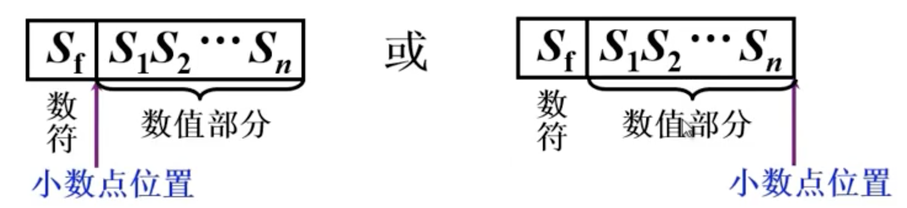
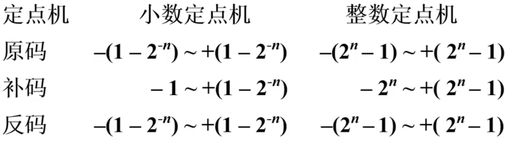
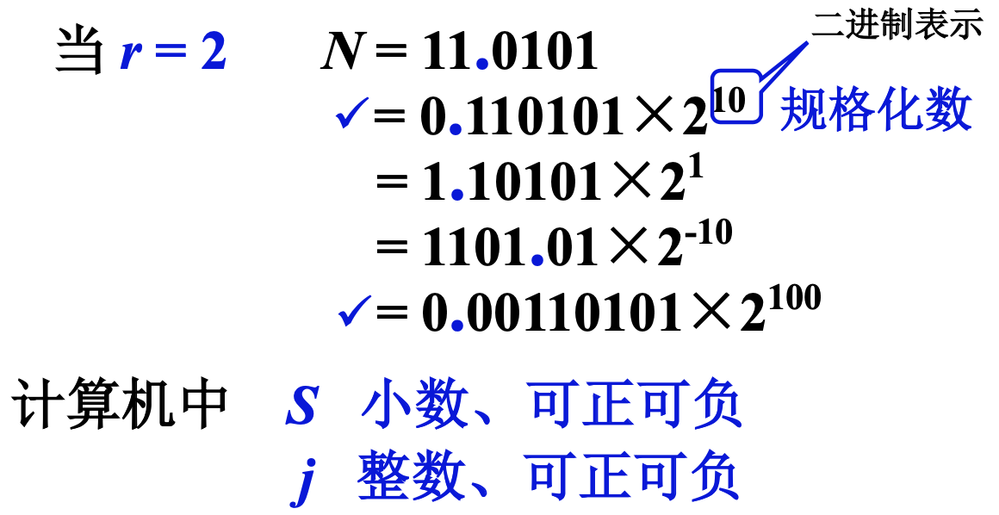
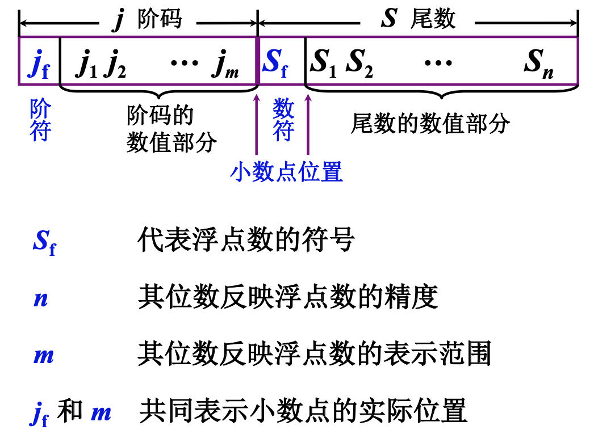
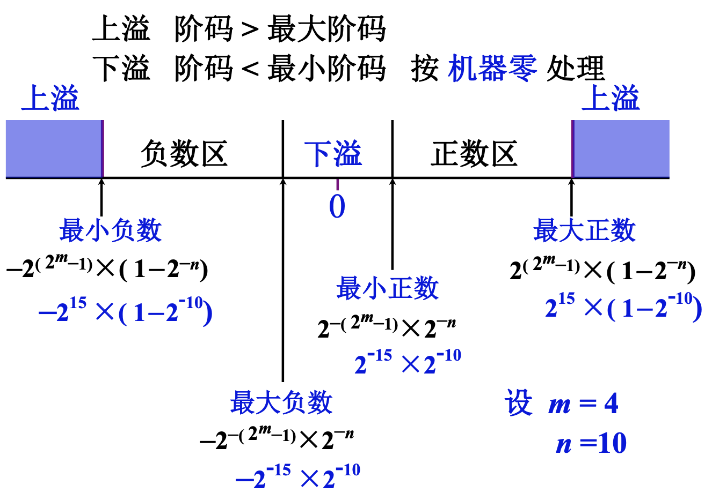
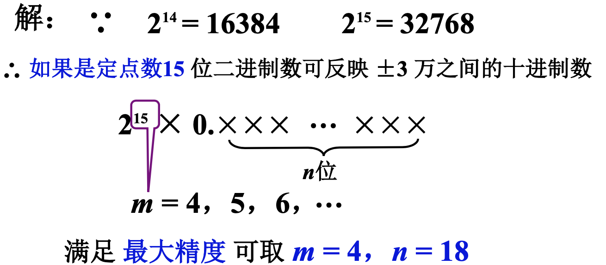
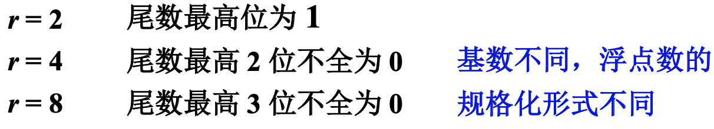
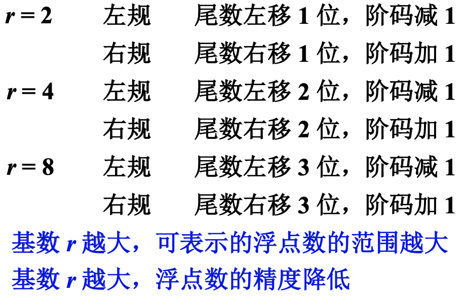
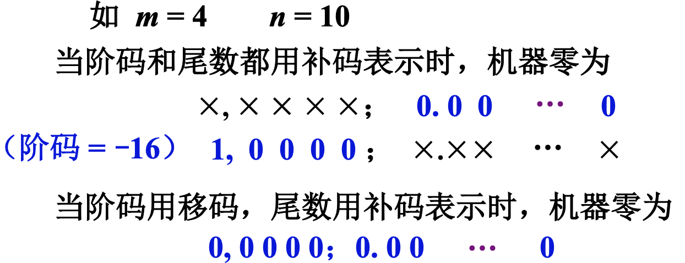
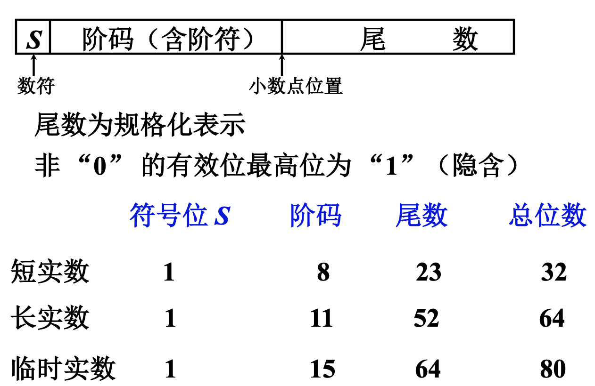

# 数的定点表示和浮点表示

<!-- START doctoc generated TOC please keep comment here to allow auto update -->
<!-- DON'T EDIT THIS SECTION, INSTEAD RE-RUN doctoc TO UPDATE -->

- [一、数的定点表示](#%E4%B8%80%E6%95%B0%E7%9A%84%E5%AE%9A%E7%82%B9%E8%A1%A8%E7%A4%BA)
- [二、浮点表示](#%E4%BA%8C%E6%B5%AE%E7%82%B9%E8%A1%A8%E7%A4%BA)
    - [1. 为什么要引入浮点数表示](#1-%E4%B8%BA%E4%BB%80%E4%B9%88%E8%A6%81%E5%BC%95%E5%85%A5%E6%B5%AE%E7%82%B9%E6%95%B0%E8%A1%A8%E7%A4%BA)
    - [2. 浮点表示](#2-%E6%B5%AE%E7%82%B9%E8%A1%A8%E7%A4%BA)
        - [1. 浮点数的表示形式](#1-%E6%B5%AE%E7%82%B9%E6%95%B0%E7%9A%84%E8%A1%A8%E7%A4%BA%E5%BD%A2%E5%BC%8F)
        - [2. 浮点数的表示范围](#2-%E6%B5%AE%E7%82%B9%E6%95%B0%E7%9A%84%E8%A1%A8%E7%A4%BA%E8%8C%83%E5%9B%B4)
        - [3. 练习](#3-%E7%BB%83%E4%B9%A0)
        - [4. 浮点数的规格化形式](#4-%E6%B5%AE%E7%82%B9%E6%95%B0%E7%9A%84%E8%A7%84%E6%A0%BC%E5%8C%96%E5%BD%A2%E5%BC%8F)
        - [5. 浮点数的规格化](#5-%E6%B5%AE%E7%82%B9%E6%95%B0%E7%9A%84%E8%A7%84%E6%A0%BC%E5%8C%96)
    - [3. 机器零](#3-%E6%9C%BA%E5%99%A8%E9%9B%B6)
- [三、IEEE754标准](#%E4%B8%89ieee754%E6%A0%87%E5%87%86)

<!-- END doctoc generated TOC please keep comment here to allow auto update -->

[TOC]

## 一、数的定点表示

所谓的定点表示，即小数点按约定的方式给出。

在计算机中，是没有专门的方式表示小数点的，通过约定来表示小数点，计算机的硬件、软件要共通遵守约定。根据小数点约定位置的不同，主要有两种形式：

小数点的位置在数符后面，表示存放和处理的都是小数；如果是补码形式，可以表示的为一个个整数是-1；

小数点的位置在数值后面，表示存放和处理的都是整数。

根据计算机放置小数点的位置将定点计算机分为两类：小数定点机和正数定点机。下面看下两种定点机表示三种机器数的范围：

## 二、浮点表示

### 1. 为什么要引入浮点数表示

1. 编程困难，程序员要调节小数点的位置；
2. 定点机数据的表示范围小，为了能表示两个大小相差很大的数据，需要很长的机器字长；

### 2. 浮点表示

浮点数的一般表示形式如下： 
$$
N = S × r^j
$$
 S：尾数，绝对值小于等于1；

j：阶码，整数；

r：尾数的基值，计算机中取2、4、8、16等。

> 类似高中学过的科学计数法。

数值的最高位非零，称为规格化数。

#### 1. 浮点数的表示形式

#### 2. 浮点数的表示范围

假设不考虑数据的规格化，无论是尾数还是阶码，都用原码形式表示。

> 最小负数

最小负数即绝对值最大的负数，则： 数符：为1，表示负数 数值：要使这个数是最小的负数，数值就要最大，那么数值部分就要全1，表示最大，即1-(2^-n)
阶码：要使这个数是最小的负数，阶数就要最大，阶码要是正数，符号位为0，数值位全为1，即2^m-1；基数为2，因此表示为-2^(2^m - 1)
最终表示为：-2^(2^m - 1) × (1-(2^-n))

> 最大负数

最大负数即绝对值最小的负数，则： 数符：为1，表示负数 数值：要使这个数是最大的负数，数值就要最小，那么数值部分就要全0，表示最小，即2^-n 阶码：要使这个数是最大的负数，阶数就要最小，阶码要是最大的负数，符号位为1，数值位全为1，即-(
2^m)-1，基数为2，因此表示为-2^(-(2^m)-1)
最终表示为：-2^(-(2^m)-1) × (2^-n)

> 最小正数和最大正数

这两个就不推导了，就是最小负数和最大负数的绝对值。

#### 3. 练习

设机器数字长为 24 位，欲表示±3万的十进制数， 试问在保证数的最大精度的前提下，除阶符、数符各 取1 位外，阶码、尾数各取几位？

#### 4. 浮点数的规格化形式

**为什么要采用规格化**

对数的规格化的目的尽可能的保留数的精度。如果采用原码表示，小数点后面，可能有多个0，这些0是真正的0，因为存储的机器字长是有限的，多出的数据将会被丢弃，规格化是为了能尽可能多的表示有效位数。

位数最高位指的是真值。

#### 5. 浮点数的规格化

规格化的方式很简单，就是左移或者右移数，然后调整阶码，使其真值不发生变化。就类似科学计数法。

### 3. 机器零

机器零的定义如下：

- 当浮点数尾数为0时，不论其阶码为何值，均按机器零处理；因为数规格化后，要求尾数的第一位不为0，如果尾数为0了，那自然就是机器零了；
- 当浮点数阶码等于或小于它所表示的最小数值时，不论其尾数为何值，按机器零处理；

这样做，有利于机器中“判0”电路的实现。

## 三、IEEE754标准

解释一下为什么尾数的最高位的“1”可以隐含，因为尾数采用规格化表示，则尾数的最高位一定是“1”，既然大家的最高位都是“1”，那么这个“1”就可以隐含，这样做相当于增大了尾数的位数，增加了表示精度。
