# 无符号数和有符号数

<!-- START doctoc generated TOC please keep comment here to allow auto update -->
<!-- DON'T EDIT THIS SECTION, INSTEAD RE-RUN doctoc TO UPDATE -->

- [一、无符号数和有符合数](#%E4%B8%80%E6%97%A0%E7%AC%A6%E5%8F%B7%E6%95%B0%E5%92%8C%E6%9C%89%E7%AC%A6%E5%90%88%E6%95%B0)
    - [1. 无符号数](#1-%E6%97%A0%E7%AC%A6%E5%8F%B7%E6%95%B0)
    - [2. 有符号数](#2-%E6%9C%89%E7%AC%A6%E5%8F%B7%E6%95%B0)
    - [3. 机器数与真值](#3-%E6%9C%BA%E5%99%A8%E6%95%B0%E4%B8%8E%E7%9C%9F%E5%80%BC)
- [二、原码表示法](#%E4%BA%8C%E5%8E%9F%E7%A0%81%E8%A1%A8%E7%A4%BA%E6%B3%95)
    - [1. 原码定义](#1-%E5%8E%9F%E7%A0%81%E5%AE%9A%E4%B9%89)
    - [2. 栗子](#2-%E6%A0%97%E5%AD%90)
    - [3. 原码特点](#3-%E5%8E%9F%E7%A0%81%E7%89%B9%E7%82%B9)
- [三、补码表示法](#%E4%B8%89%E8%A1%A5%E7%A0%81%E8%A1%A8%E7%A4%BA%E6%B3%95)
    - [1. 补的概念](#1-%E8%A1%A5%E7%9A%84%E6%A6%82%E5%BF%B5)
    - [2. 正数的补数即为其本身](#2-%E6%AD%A3%E6%95%B0%E7%9A%84%E8%A1%A5%E6%95%B0%E5%8D%B3%E4%B8%BA%E5%85%B6%E6%9C%AC%E8%BA%AB)
    - [3. 补码定义](#3-%E8%A1%A5%E7%A0%81%E5%AE%9A%E4%B9%89)
    - [4. 求补码的快捷方式](#4-%E6%B1%82%E8%A1%A5%E7%A0%81%E7%9A%84%E5%BF%AB%E6%8D%B7%E6%96%B9%E5%BC%8F)
- [四、反码表示法](#%E5%9B%9B%E5%8F%8D%E7%A0%81%E8%A1%A8%E7%A4%BA%E6%B3%95)
    - [1. 反码定义](#1-%E5%8F%8D%E7%A0%81%E5%AE%9A%E4%B9%89)
- [五、三种机器数的小结](#%E4%BA%94%E4%B8%89%E7%A7%8D%E6%9C%BA%E5%99%A8%E6%95%B0%E7%9A%84%E5%B0%8F%E7%BB%93)
- [六、移码表示法](#%E5%85%AD%E7%A7%BB%E7%A0%81%E8%A1%A8%E7%A4%BA%E6%B3%95)
    - [1. 移码定义](#1-%E7%A7%BB%E7%A0%81%E5%AE%9A%E4%B9%89)
    - [2. 移码和补码的比较](#2-%E7%A7%BB%E7%A0%81%E5%92%8C%E8%A1%A5%E7%A0%81%E7%9A%84%E6%AF%94%E8%BE%83)

<!-- END doctoc generated TOC please keep comment here to allow auto update -->

[TOC]

## 一、无符号数和有符合数

### 1. 无符号数

无符号数，就是没有正负号的数据。

无符号数的表示和存储非常简单，因为它只有数组部分。我们将它转换成二进制，按照规定的长度存储到寄存器中就可以了。如果无符号数存在计算机的寄存器中，那么寄存器的位数就直接反映了无符号数的表示范围。

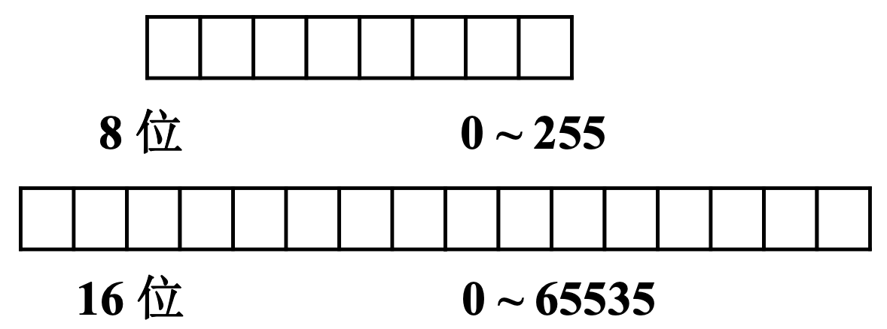

### 2. 有符号数

有符号数，就是有正负号的数。

有符号数分为两部分：符合部分和数值部分，只要将这两部分保存到计算机当中即可。

### 3. 机器数与真值

真值：平时用的数据的真实值，带有符号，即带符号的数，符号是正号或负号。

机器数：保存在计算机中的数，即符号数字化的数，符号是正号或负号。

在计算机中，符号要数值化，用数据来表示符号，可以用0/1来代表符号，一般用0来表示正号，1表示负号；机器数我们要保存三部分内容：数字的符号、小数点的位置和数的数值位。

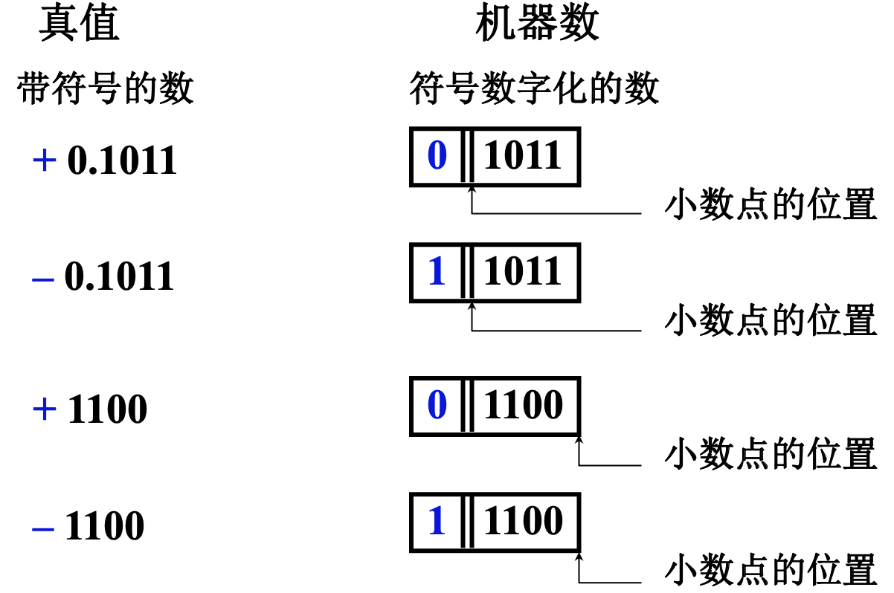

如上图所示，蓝色字体的数字表示符号，后面的数字直接存放在寄存器或存储元件当中，表示这个数的数值。

那小数点呢？在计算机中没有专门的硬件表示小数点，都是以约定的方式给出的。比如前两个数都是小数，我们可以约定符号位的后面就是小数点。

我们再看一下后面两个整数，同样要解决符号、数值、小数点的存放问题，因为表示的是整数，所以小数点约定在数值部分的最后。

> 再次强调：没有专门的硬件标识小数点，都是以约定的方式确定小数点的位置。

## 二、原码表示法

上面我们将符号数字化就已经给出了一种机器数的表示方式，我们将这种表示方式称为原码表示法。

**注意：下列内容如未特别提醒，均为二进制数。**

### 1. 原码定义

分为整数和小数，以数学的方式给出。

整数定义如下：

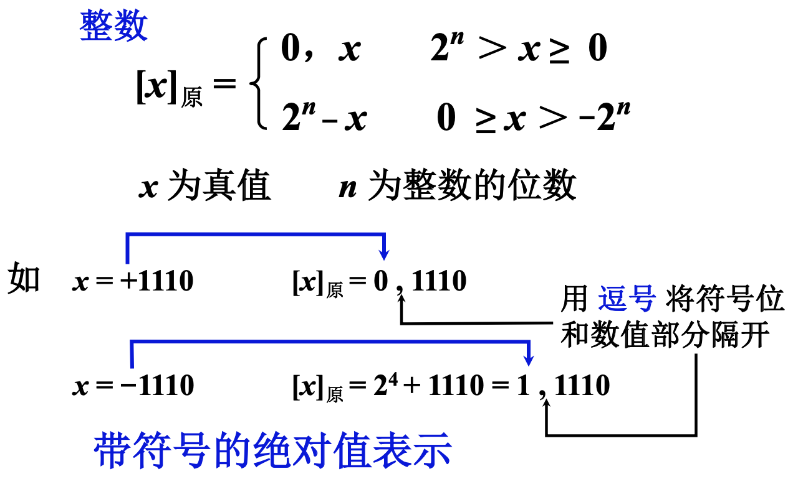

> 这里解释一下负数的表示为什么是(2^n)-x
>
> x为真值，1表示负数，数值部分的位数为n，要给x加上符号位，即在x前面加上1，实际上就相当于给x的绝对值加上2^n。

**原码其实就是带符号的绝对值表示。**

小数定义如下：

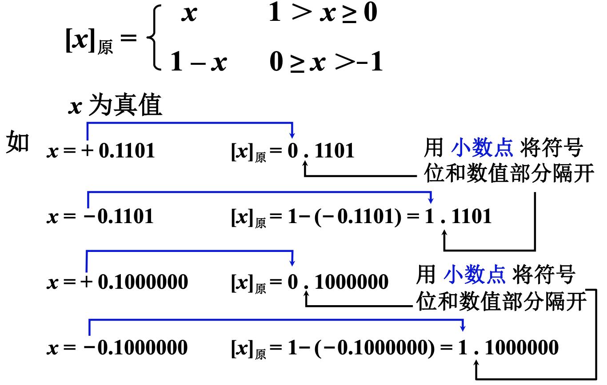

**再次声明，不论是整数的逗号，还是小数的小数点，计算机在存储的时候都不会实际存储，都是靠约定的方式进行表示，加上它们仅仅是为了人阅读的方便。**

### 2. 栗子

求 x = 0 的原码。

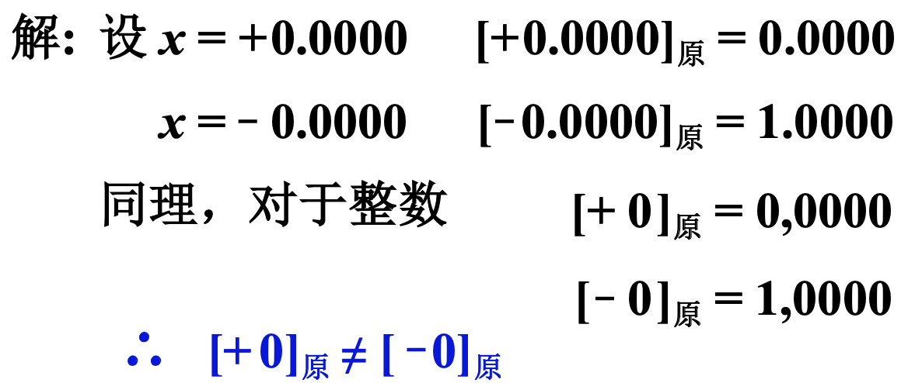

### 3. 原码特点

简单、直观。

但是在运算的时候会出现问题，比如在加法运算时：

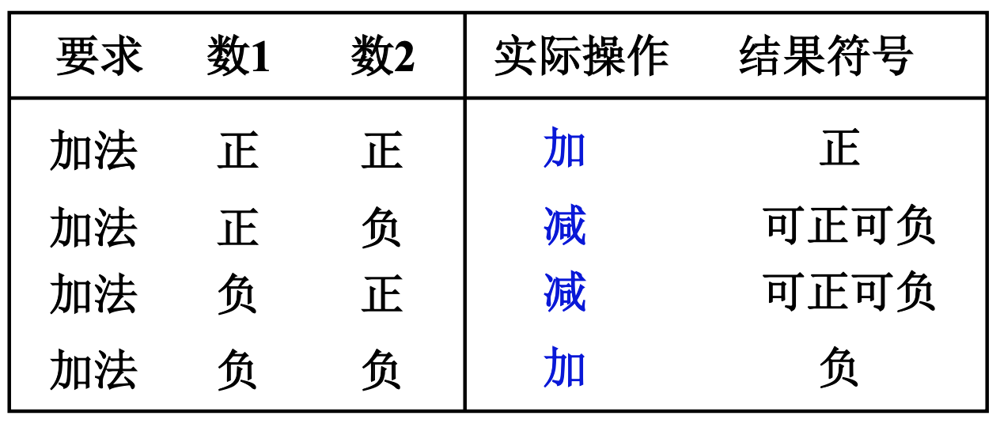

同样是加法过程，如果用原码表示方式，可能做加法或减法，这对运算器来说是比较麻烦的，能否对加法和减法进行归一，只用加法就能完成加法和减法操作？

这个问题进一步分析的话，就是能否找到一个与负数等价的正数来代替这个负数，将减法操作转换成加法操作。

## 三、补码表示法

### 1. 补的概念

我们以时钟的栗子来讲解。如下图所示，时钟上的时间为6点整，我们想要将时钟调整到3点，有两种方法：

- 逆时针转动3小时；
- 顺时针转动9小时。

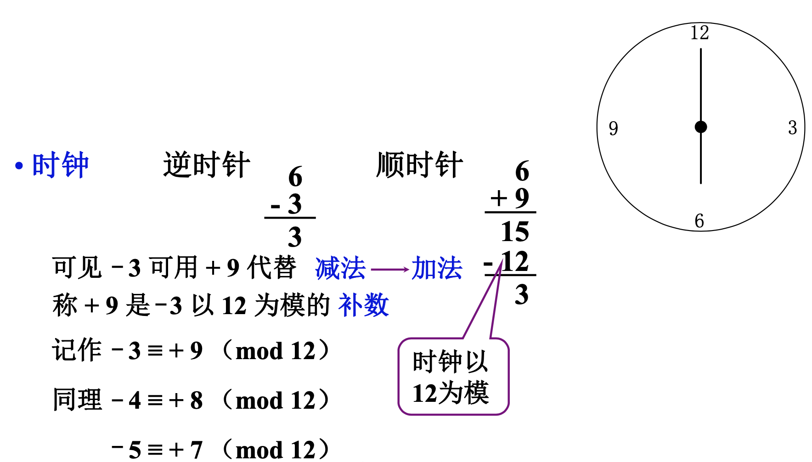

由此我们可以得到结论：

1. 一个负数加上”模“即得该负数的补数，补数是一个正数；
2. 一个正数和一个负数互为补数时，它们的绝对值之和几位模数。

计算机中与时钟非常相似，我们举一个计算机的栗子：

假设计数器是4位(模16)，要将 1011 变为 0000，同样有两种方法：

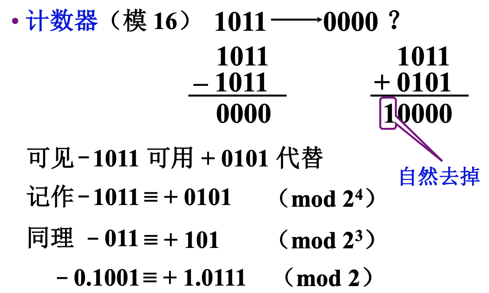

### 2. 正数的补数即为其本身

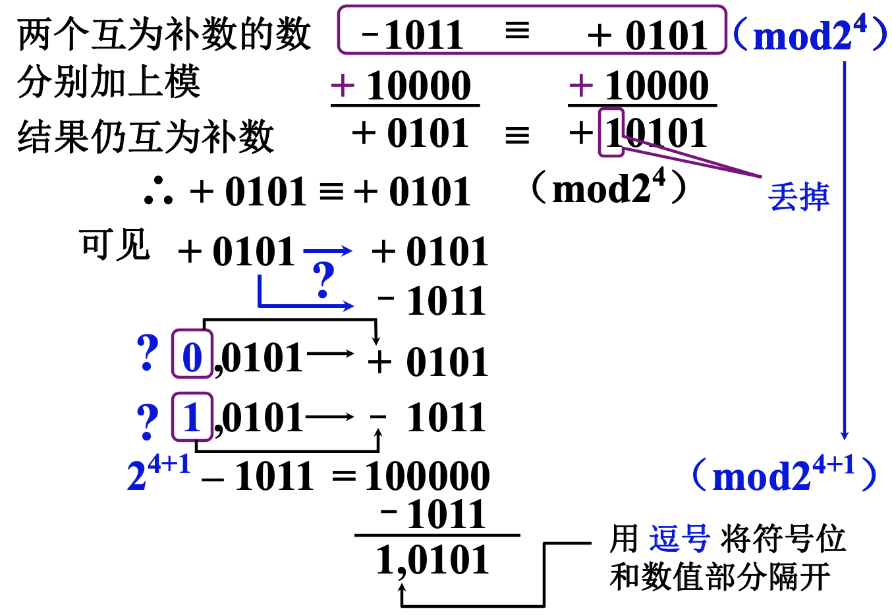

由上图可知，由于正数的补数即为其本身，-1011和0101的补数都是0101，那么如何区分这一个补数是正数的补数还是负数的补数呢？

可以在前面加上一个符号位。

以上面的例子举例，-1011变为补数需要加上2^4，如果想要在前面加个1作为负号的标识位，就需要再加一个2^4，2个2^4相加，即2^5；

再看一下0101的情况，0101先加上2^4，结果是10101，再加一个2^4，结果是100101，最高位的1溢出自然去掉，结果依旧是00101。

### 3. 补码定义

整数补码定义如下：

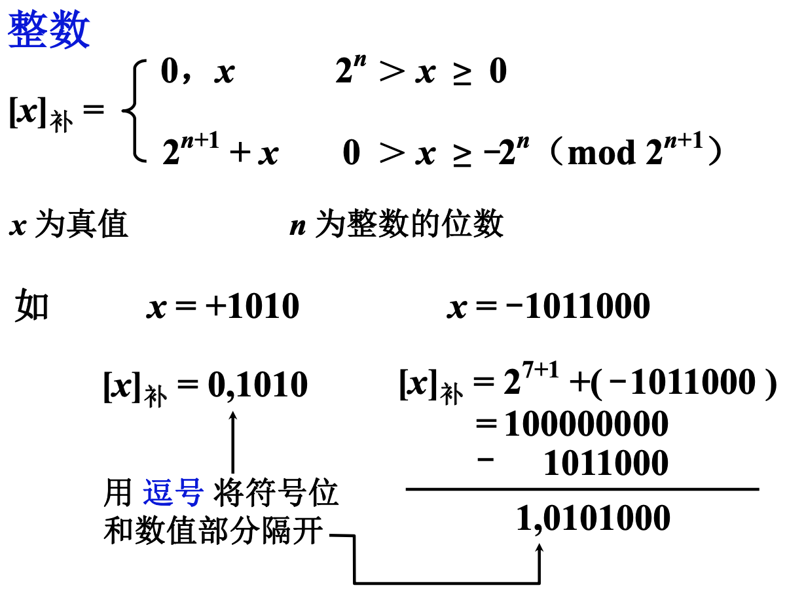

要注意，n是整数的位数，不包括符号位。

小数补码定义如下：

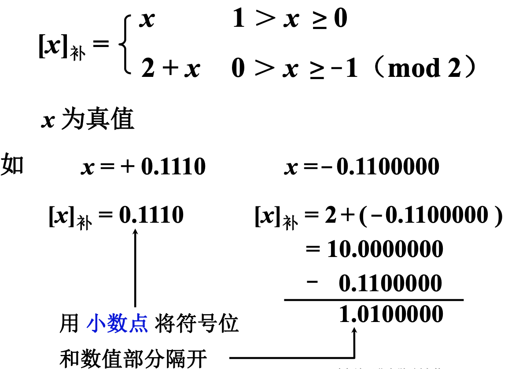

### 4. 求补码的快捷方式

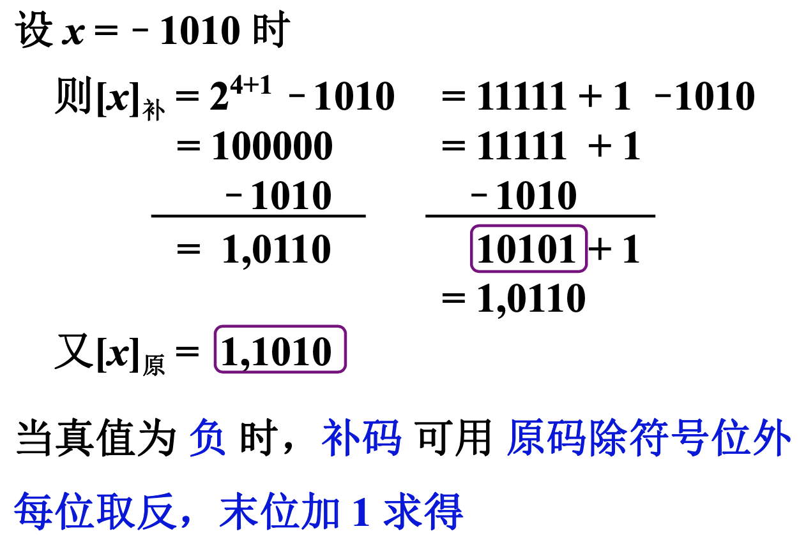

**前提条件：真值为负。**

## 四、反码表示法

### 1. 反码定义

整数反码定义如下：

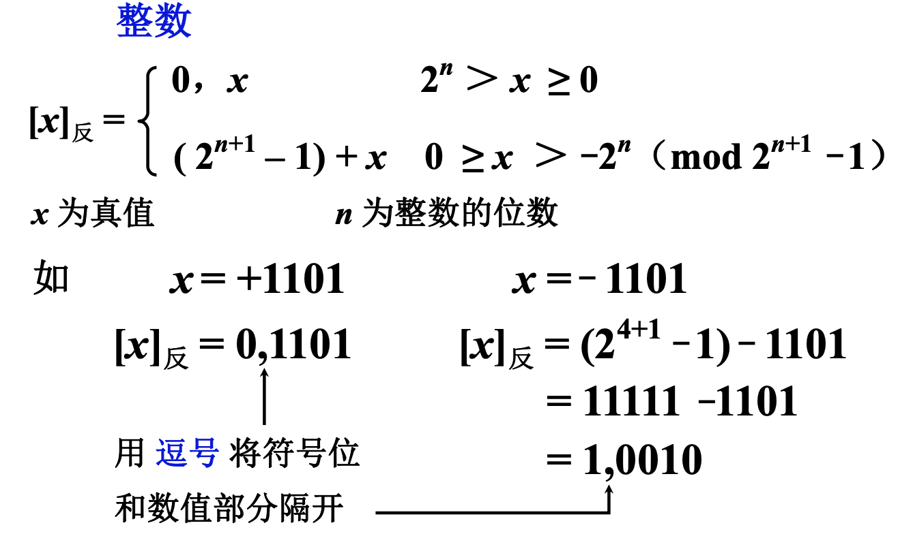

小数反码定义如下：

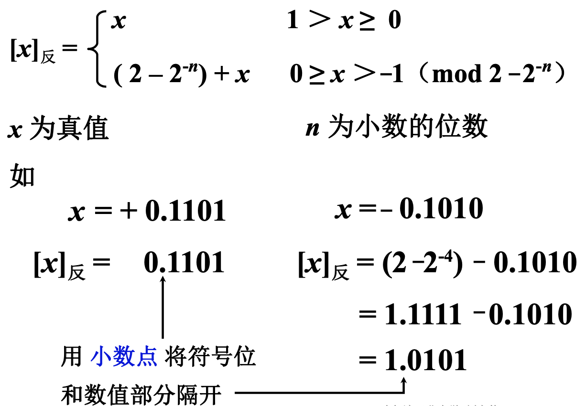

## 五、三种机器数的小结

1. 最高位为符号位，书写上用”,“(整数)或"."(小数)将数值部分和符号位隔开；
2. 对于正数，原码=补码=反码；
3. 对于负数，符号位为1，其数值部分：
    - 反码：原码除符号位外每位取反末位加1；
    - 补码：原码除符号位外每位取反末位加1。

## 六、移码表示法

补码在后面的运算中会大量使用到，既然如此，为啥还要有移码呢？

因为补码表示很难直接判断其真值大小：

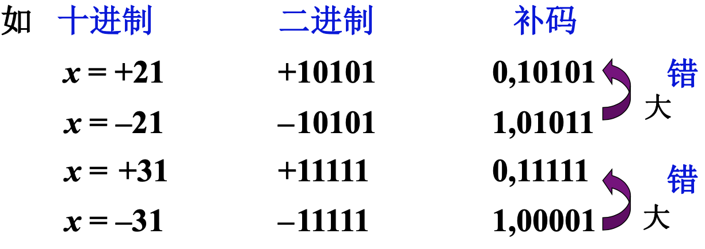

补码是 x + 2^(n+1)，变得不直观，那如果是 x + 2^n 情况就会不一样了：

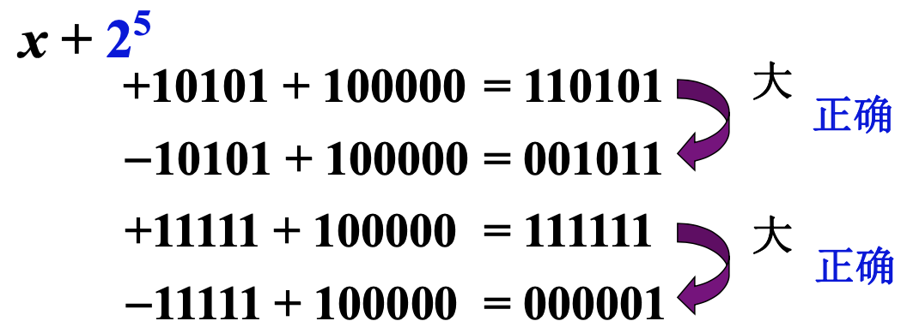

这种表示方式就是移码表示法。

### 1. 移码定义

移码不对正负数做区别，都加上 2^n。

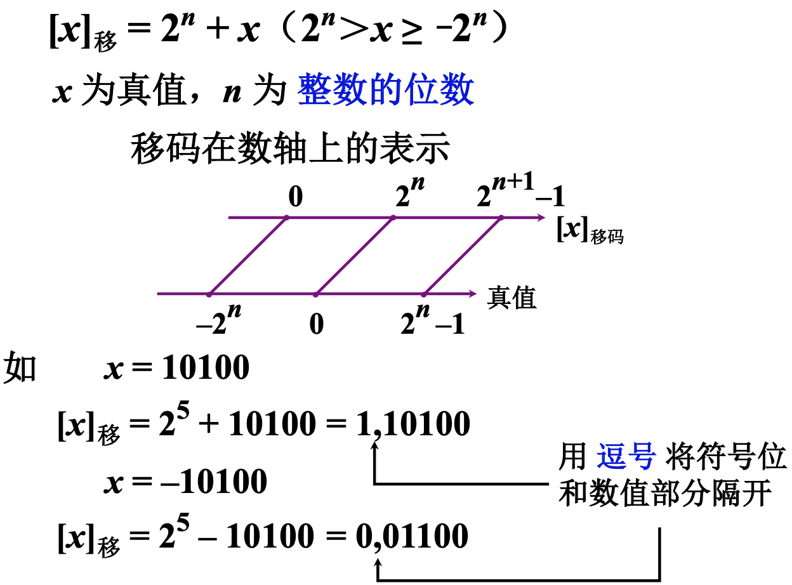

从定义上看，只有整数形式定义，没有小数形式定义，这与移码在计算机的数据表示当中的作用有关：通常情况下移码大小好判断，因此移码通常用来表示浮点数据表示的阶码(这个后续会提)，阶码都是整数，因此只有整数形式定义。

### 2. 移码和补码的比较

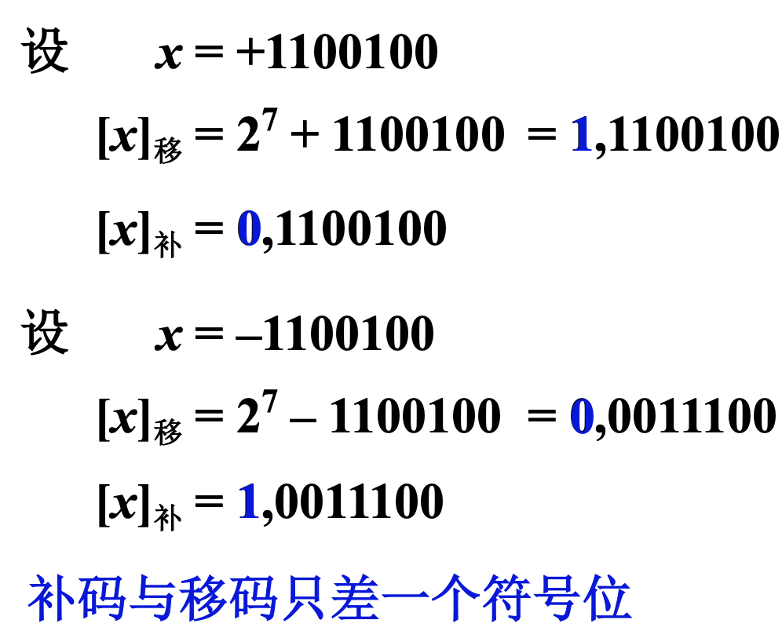
