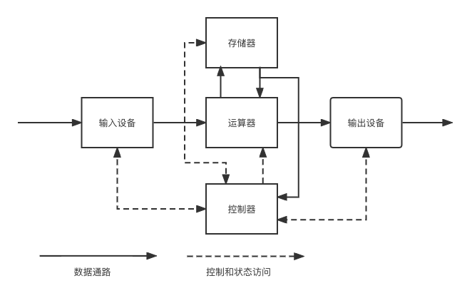
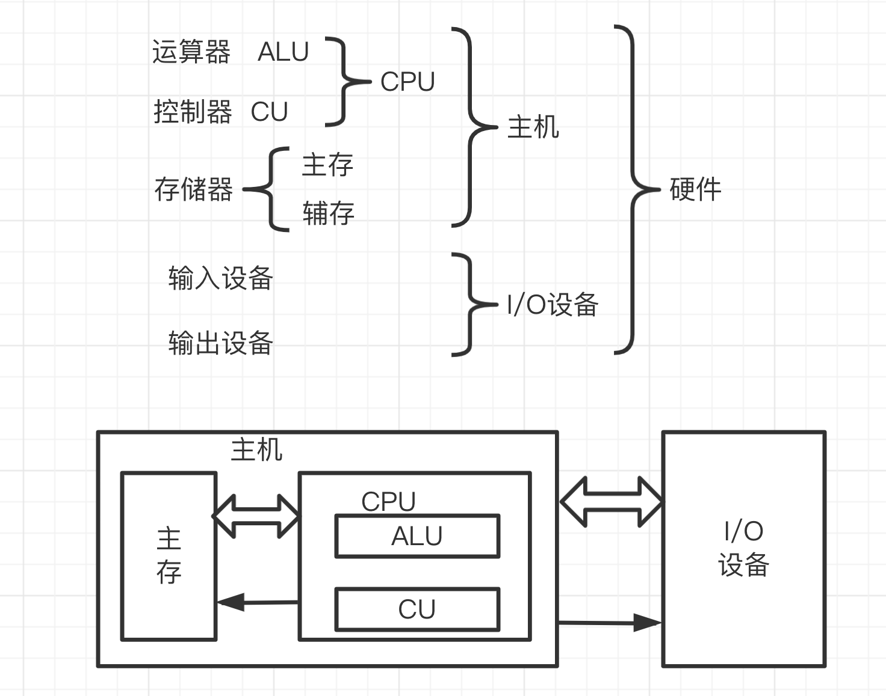
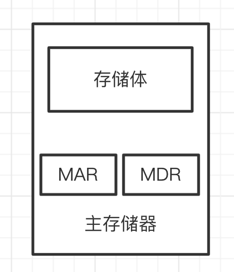
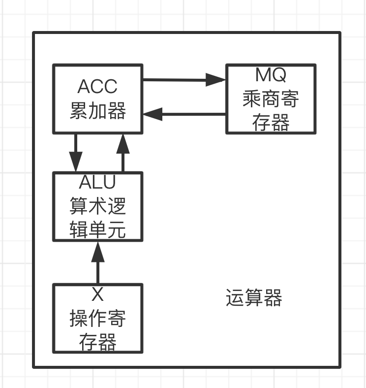
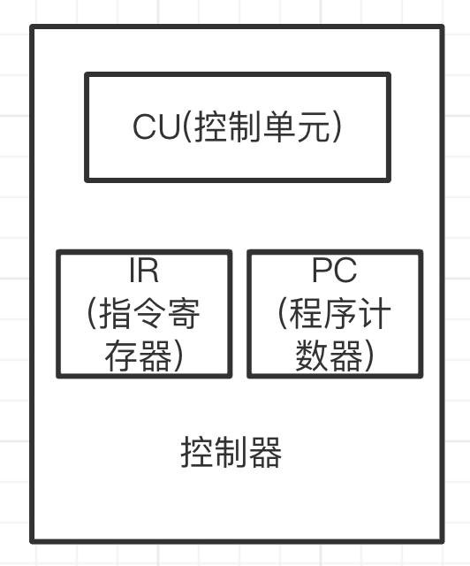
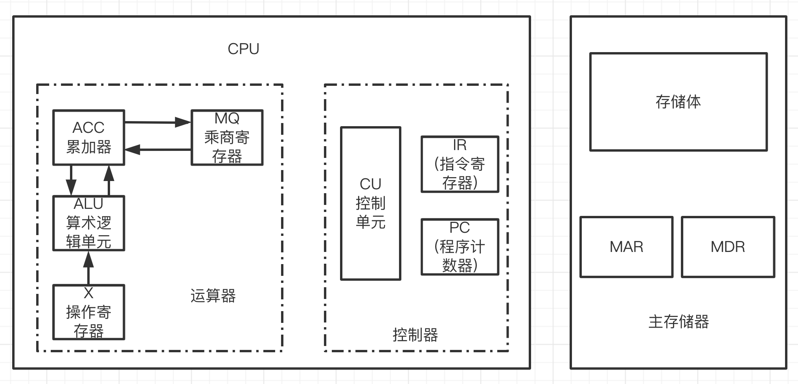
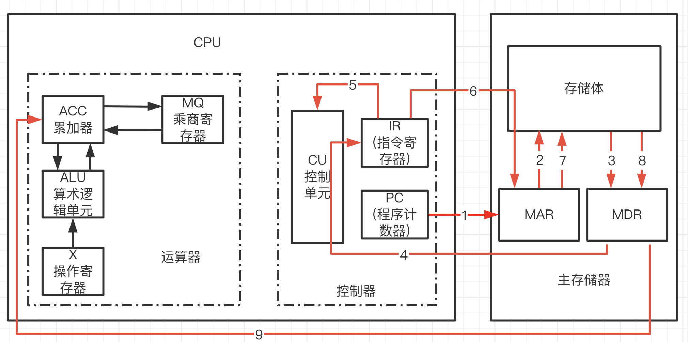

# 计算机基本组成

<!-- START doctoc generated TOC please keep comment here to allow auto update -->
<!-- DON'T EDIT THIS SECTION, INSTEAD RE-RUN doctoc TO UPDATE -->

- [一、冯·诺依曼计算机的特点](#%E4%B8%80%E5%86%AF%C2%B7%E8%AF%BA%E4%BE%9D%E6%9B%BC%E8%AE%A1%E7%AE%97%E6%9C%BA%E7%9A%84%E7%89%B9%E7%82%B9)
    - [1. 各大部件的作用](#1-%E5%90%84%E5%A4%A7%E9%83%A8%E4%BB%B6%E7%9A%84%E4%BD%9C%E7%94%A8)
    - [2. 现代计算机硬件框图](#2-%E7%8E%B0%E4%BB%A3%E8%AE%A1%E7%AE%97%E6%9C%BA%E7%A1%AC%E4%BB%B6%E6%A1%86%E5%9B%BE)
- [二、主机的基本组成](#%E4%BA%8C%E4%B8%BB%E6%9C%BA%E7%9A%84%E5%9F%BA%E6%9C%AC%E7%BB%84%E6%88%90)
    - [1. 存储器](#1-%E5%AD%98%E5%82%A8%E5%99%A8)
        - [1.1 存储体](#11-%E5%AD%98%E5%82%A8%E4%BD%93)
        - [1.2 MAR和MDR](#12-mar%E5%92%8Cmdr)
        - [1.3 工作过程](#13-%E5%B7%A5%E4%BD%9C%E8%BF%87%E7%A8%8B)
    - [2. 运算器](#2-%E8%BF%90%E7%AE%97%E5%99%A8)
        - [2.1 运算器各寄存器存储内容](#21-%E8%BF%90%E7%AE%97%E5%99%A8%E5%90%84%E5%AF%84%E5%AD%98%E5%99%A8%E5%AD%98%E5%82%A8%E5%86%85%E5%AE%B9)
        - [2.2 加法操作过程](#22-%E5%8A%A0%E6%B3%95%E6%93%8D%E4%BD%9C%E8%BF%87%E7%A8%8B)
        - [2.3 乘法操作过程](#23-%E4%B9%98%E6%B3%95%E6%93%8D%E4%BD%9C%E8%BF%87%E7%A8%8B)
        - [2.4 除法操作过程](#24-%E9%99%A4%E6%B3%95%E6%93%8D%E4%BD%9C%E8%BF%87%E7%A8%8B)
    - [3. 控制器](#3-%E6%8E%A7%E5%88%B6%E5%99%A8)
- [三、主机完成指令过程](#%E4%B8%89%E4%B8%BB%E6%9C%BA%E5%AE%8C%E6%88%90%E6%8C%87%E4%BB%A4%E8%BF%87%E7%A8%8B)

<!-- END doctoc generated TOC please keep comment here to allow auto update -->

[TOC]

## 一、冯·诺依曼计算机的特点

1. 计算机由五大部件组成
2. 指令和数据以同等地为存于存储器，可按地址寻访
3. 指令和数据用二进制表示
4. 指令由操作码和地址组成
5. 存储查程序
6. 以运算器为中心

冯·诺依曼计算机硬件框图如下：

### 1. 各大部件的作用

运算器(核心)ALU：算术运算、逻辑运算

控制器CU：指挥控制程序的运行，控制程序运行的先后顺序

存储器：存放数据和程序

输入设备：将信息转换成机器能识别的形式

输出设备：将结果转换成人熟悉的形式

### 2. 现代计算机硬件框图

## 二、主机的基本组成

### 1. 存储器

#### 1.1 存储体

存储体由存储单元组成，存储单元由存储元件组成，采用类别可如下表：

| 存储体 | 存储单元 | 存储元件 | 0/1       |
| ------ | -------- | -------- | --------- |
| 大楼   | 房间     | 床位     | 有人/无人 |

存储单元：存放一串二进制代码

存储字：存储单元中二进制代码的组合

存储字长：存储单元中二进制代码的位数(存储字的长度)

每一个存储单元赋予一个地址，一个存储单元中存储了存储字，可以通过存储单元的地址访问存储字，存储单元按地址寻访

#### 1.2 MAR和MDR

MAR：存储地址寄存器，反应存储单元的个数；保存存储单元的地址(编号)

MDR：存储器数据寄存器，反应存储字长；保存刚从存储体取出来的数据，或要送入存储体的数据

#### 1.3 工作过程

读数据：先通过MAR获得数据地址，得到地址去存储体中获取数据，将获取到的放入MDR

存数据：将数据放到MDR，再从MAR获取一个地址，将数据存入该地址中？(这部分瞎猜的)

### 2. 运算器

以下为累加器运算器，不同的结构寄存处数量有所不同

#### 2.1 运算器各寄存器存储内容

|      | ACC(累加器/累加寄存器) | MQ(乘商寄存器)     | X(操作寄存器) |
| ---- | ---------------------- | ------------------ | ------------- |
| 加法 | 被加数 和         |                    | 加数          |
| 减法 | 被减数 差         |                    | 减数          |
| 乘法 | 乘积高位               | 乘数 乘积低位 | 被乘数        |
| 除法 | 被除数 余数商     | 商                 | 除数          |

#### 2.2 加法操作过程

1. 得到指令 `加|M(加数的内存地址)`
2. 将被加数加载到ACC中
3. 通过M的地址获得到M的数据，放入到X中
4. 由算数逻辑单元完成相加操作(ACC+X)，并把结果放到ACC中

> 减法操作与加法操作类似

#### 2.3 乘法操作过程

1. 得到指令 `乘|M(乘数的内存地址)`
1. 将被乘数加载到ACC中
1. 通过M的地址获得到M的数据，放入到MQ中
1. 将被乘数从ACC加载到X中
1. ACC清零
1. 由算数逻辑单元完成相乘操作(X × MQ)，并把结果的高位放到ACC，低位放到MQ

其中，3、4可以并行

> 疑问：这里为什么要先将被乘数放入到ACC，再移到X，而不是直接将被乘数放到X中

#### 2.4 除法操作过程

1. 得到指令 `除|M(除数的内存地址)`
1. 将被除数加载到ACC中
1. 通过M的地址获得到M的数据，放入到X中
1. 由算数逻辑单元完成相除操作(ACC ÷ X)，并把结果放到MQ，余数放到ACC中

### 3. 控制器

完成一条指令可以分为以下几步：取指令、分析指令、执行指令

- 取指令：依靠PC(程序计数器)，PC存放单曲欲执行**指令的地址**，具有计数功能 (PC) + 1(这个数和机器结构有关) ---> PC
- 分析指令：依靠IR(指令寄存器)，IR存放当前欲执行的指令
- 执行指令：依靠CU(控制单元)，各种控制信号从CU发出

## 三、主机完成指令过程

通过上面的拆解，我们可以很容易的画出主机的结构图

> 取数指令过程

过程图如下

1. 从PC获取指令地址，拿指令地址去MAR
2. MAR拿到地址后去存储体获取数据
3. 存储体获取到数据后将数据放到MDR
4. 数据再从MDR送到IR
5. IR得到指令后将将指令送到CU
6. CU解析指令`指令码|操作数的地址`，发现是取数指令，IR拿操作数地址去MAR
7. MAR拿到地址后去存储体获取数据
8. 存储体获取到数据后将数据放到MDR
9. 数据再从MDR送到ACC

