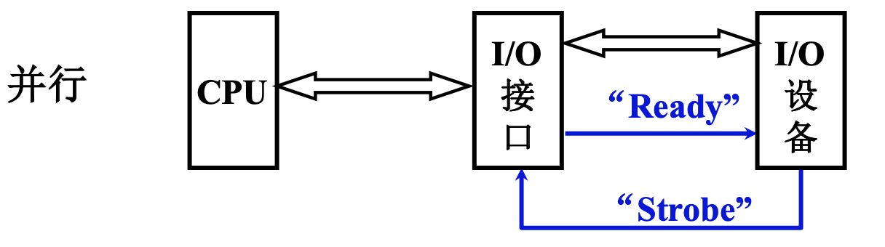
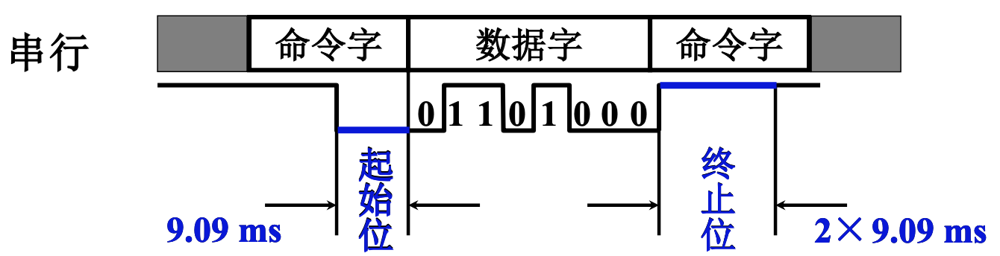
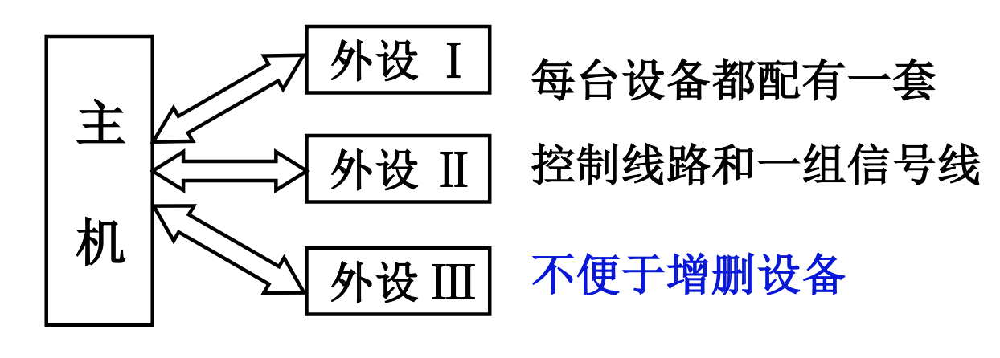
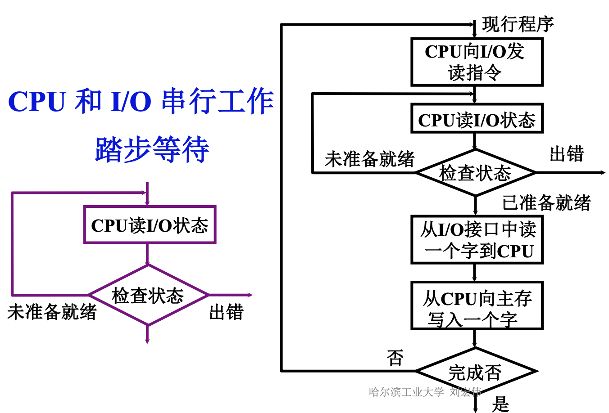
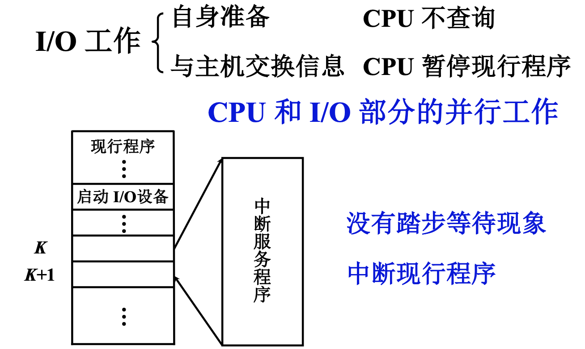
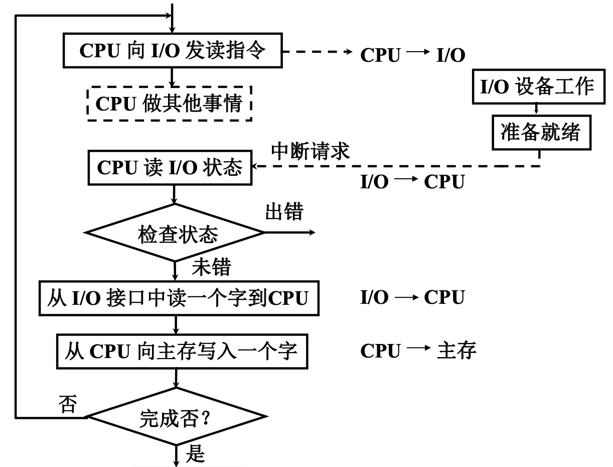
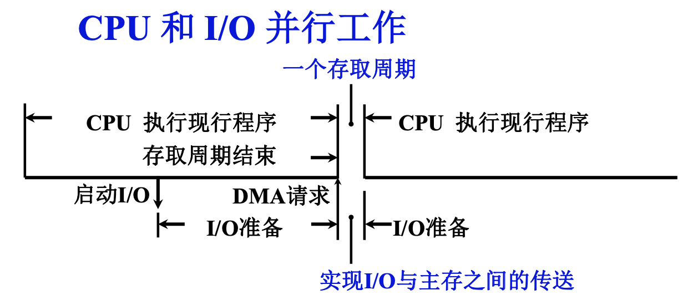
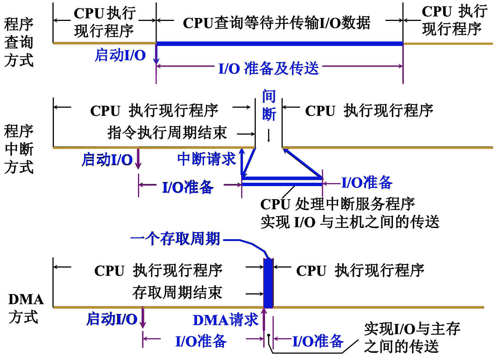

# 输入输出设备-上

<!-- START doctoc generated TOC please keep comment here to allow auto update -->
<!-- DON'T EDIT THIS SECTION, INSTEAD RE-RUN doctoc TO UPDATE -->

- [一、输入输出系统的组成](#%E4%B8%80%E8%BE%93%E5%85%A5%E8%BE%93%E5%87%BA%E7%B3%BB%E7%BB%9F%E7%9A%84%E7%BB%84%E6%88%90)
    - [1. I/O软件](#1-io%E8%BD%AF%E4%BB%B6)
    - [2. I/O硬件](#2-io%E7%A1%AC%E4%BB%B6)
- [二、I/O设备与主机的联系方式](#%E4%BA%8Cio%E8%AE%BE%E5%A4%87%E4%B8%8E%E4%B8%BB%E6%9C%BA%E7%9A%84%E8%81%94%E7%B3%BB%E6%96%B9%E5%BC%8F)
    - [1. I/O设备编址方式](#1-io%E8%AE%BE%E5%A4%87%E7%BC%96%E5%9D%80%E6%96%B9%E5%BC%8F)
    - [2. 设备选址](#2-%E8%AE%BE%E5%A4%87%E9%80%89%E5%9D%80)
    - [3. 数据传送方式](#3-%E6%95%B0%E6%8D%AE%E4%BC%A0%E9%80%81%E6%96%B9%E5%BC%8F)
    - [4. 联络方式](#4-%E8%81%94%E7%BB%9C%E6%96%B9%E5%BC%8F)
- [三、I/O设备和主机的连接方式](#%E4%B8%89io%E8%AE%BE%E5%A4%87%E5%92%8C%E4%B8%BB%E6%9C%BA%E7%9A%84%E8%BF%9E%E6%8E%A5%E6%96%B9%E5%BC%8F)
- [四、I/O设备与主机信息传送的控制方式](#%E5%9B%9Bio%E8%AE%BE%E5%A4%87%E4%B8%8E%E4%B8%BB%E6%9C%BA%E4%BF%A1%E6%81%AF%E4%BC%A0%E9%80%81%E7%9A%84%E6%8E%A7%E5%88%B6%E6%96%B9%E5%BC%8F)
    - [1. 程序查询方式](#1-%E7%A8%8B%E5%BA%8F%E6%9F%A5%E8%AF%A2%E6%96%B9%E5%BC%8F)
    - [2. 程序中断方式](#2-%E7%A8%8B%E5%BA%8F%E4%B8%AD%E6%96%AD%E6%96%B9%E5%BC%8F)
    - [3. DMA方式](#3-dma%E6%96%B9%E5%BC%8F)
    - [4. 三种方式的CPU工作效率比较](#4-%E4%B8%89%E7%A7%8D%E6%96%B9%E5%BC%8F%E7%9A%84cpu%E5%B7%A5%E4%BD%9C%E6%95%88%E7%8E%87%E6%AF%94%E8%BE%83)

<!-- END doctoc generated TOC please keep comment here to allow auto update -->

[TOC]

## 一、输入输出系统的组成

### 1. I/O软件

> I/O指令

主处理器/CPU指令集中的I/O指令，这些I/O指令编写到应用程序中，CPU执行这些I/O指令，控制外部设备，使CPU能和外部设备和主机之间能协调工作，I/O指令格式如下：

操作码：相当于I/O指令的标志，它表示这样的指令是I/O指令；

命令码：相当于CPU指令集中普通指令的操作码，指出了要对I/O设备做什么操作，比如输入、输出等；

设备码：I/O设备的编码，也就是I/O设备的地址，或者是I/O设备中某一个寄存器的地址，这些寄存器我们把它叫做I/O的端口。

> 通道指令

通道是一种小型的DMA处理机，能够实现I/O设备和主机之间之间进行信息传送；通道有自己的控制器，有的通道还有自己的处理器，有的通道还有自己的存储器；通道能执行由通道指令组成的通道程序，通道指令就是通道自身的指令。

通常情况下，编程人员在应用程序中为了调用外部设备工作，应用程序中需要增加广义I/O指令，通常情况下广义I/O指令需要指出参加数据传输的I/O设备，数据传输主存的首地址，传输数据的长度，传输的方向，操作系统根据广义I/O指令给出的参数已经要求的操作，会编写一个由通道指令组成的通道程序，并且把通道程序放在内存或者内存自己内存的指定位置，之后启动通道进行工作，通道拿到通道程序的首地址后，就可以执行通道程序，控制I/O设备完成相应的数据传输工作。

### 2. I/O硬件

包括输入输出的设备、I/O接口，设备通过接口连接在总线上，和主机完成信息交换；

如果采用通道方式连接，那么设备将连接在设备控制器上，设备控制器连接通道，通道连接子通道。

## 二、I/O设备与主机的联系方式

### 1. I/O设备编址方式

I/O设备是有地址的，主机要与设备联系的话，需要给出I/O设备的地址，所以首先要对I/O设备编址。

1. 统一编址

把I/O设备的地址看成是内存地址的一部分，比如内存地址是1M，我们把这1M地址中低地址部分或高地址部分拿出来，这部分地址作为I/O设备或端口的地址，如果输入输出指令，它的地址码部分地址落入到了I/O地址部分，那么这次输入或输出操作实际上是真的I/O设备进行，这种情况下CPU可以直接利用取数或存数指令访问和控制I/O设备，不需要单独的I/O指令，只要取数指令或读数指令。

这种方式编址，CPU指令会相对简单，如果内存地址较大，可以考虑使用这种编址方式。

2. 单独编址

在内存地址空间之外，专门设置地址空间。为了区分一条指令到底是对内存操作还是对I/O设备进行操作，在单独编址的计算机中，输入输出不能再采用系统原有的读数取数指令，要采用专用的I/O指令对设备进行控制和操作。

### 2. 设备选址

通过一个设备选择电路来识别设备是否被选中。电路比较容易，只要把CPU给出的地址和设备中保存的地址进行比较，如果两者相同表示设备选中。

### 3. 数据传送方式

1. 串行：数据一位一位传送，传输速度较慢，但适合远距离传输；
2. 并行：同时传输多位数据，有多条数据线，通常情况下数据线的条数是8的倍数。

### 4. 联络方式

主要是外部设备接收和发送数据的响应情况。

1. 立即响应

对一些结构简单的设备，状态、数量较少，接收或输入数据可以直接显示；

2. 异步工作采用应答信号

异步分为两种，并行和串行；

首先来看一下并行方式：

CPU和接口之间一般都是并行传输，所以我们现在讲的异步工作应答信号主要是I/O接口和I/O设备之间采用的；

为了并行工作，I/O设备和I/O接口之间要有多条数据线组成的类似总线结构的数据线来完成数据并行输入输出，双方之间采用应答信号；比如I/O设备要接收数据，I/O接口准备好数据后通过一个”ready“信号告诉I/O设备，接口中数据已经准备好，I/O设备对I/O接口中的数据进行读取，并且给出应答信号”strobe“。

再来看一下串行方式：

图片上面给出的是串行数据的格式，下面给出了一个栗子，为了能正常工作，首先传输时要有一个起始位，9.09ms一个低电平，在这个低电平结束之后若干位为数据位，数据位传输结束以后，给出2位高电平终止位，表示这次传输结束。

3. 同步工作采用同步时标

设备和主机之间要同步工作的话，必须有一个定时定宽的时标，通过时标来控制在某一个时间点必须开始某项工作，在某个时间点某项工作必须结束。

## 三、I/O设备和主机的连接方式

1. 辐射式连接

增加一个I/O设备，在主机中就需要增加一套控制电路对设备进行控制；在早期时，由于外部设备数量少，可采用这种方式。

2. 总线连接

外部设备通过接口与主机进行连接，接口能向外部设备传输主机的命令，可以向主机传输外部设备状态信息，接口还可以完成数据缓存，外部设备输入数据可以先缓存到接口中，完成数据的格式转换操作，再输入主机，或者主机的数据再接口中缓存。这种方式便于增删设备，因为接口一般会采用标准的方式制作。

## 四、I/O设备与主机信息传送的控制方式

### 1. 程序查询方式

这是最早的方式，在这种方式当中，CPU和外设是采用串行方式进行工作的。

以数据输入为例：

一般来说，外部设备的工作速度都比较慢，CPU工作速度快；外部设备接收到CPU指令后，开始数据准备，经过一段比较长的时间后，数据才能准备好，准备好后把数据送入到I/O接口中的数据缓存，然后将工作状态标志置位数据准备好，CPU只有查到数据准备好后才能进行数据传输，通过接口把数据先读入到CPU的某个寄存器，再将数据从寄存器转存入到某一个内存单元当中，在数据准备状态过程中，CPU一直处于原地踏步等待状态，没有去执行其他指令，没有去做其他工作，这样CPU的效率会非常低。

### 2. 程序中断方式

在这种方式当中，CPU实现了和外设采用部分并行的工作方式。在I/O设备进行数据准备的时候，CPU还可以执行自己的程序，不需要停止。

I/O设备工作可以分为两个阶段：自身准备阶段、与主机交换信息。在程序查询方式中，这两个阶段CPU都要参与。程序中断方式对程序查询方式进行了改进，I/O设备在自身准备阶段，CPU不进行查询，在I/O设备数据准备完成后，要真正与主机进行数据交换的时候，CPU才会暂停现行程序，为输入输出进行服务。

上图是假设在CPU执行到第K条命令时，收到外部设备发来的中断信号，在执行完第K条命令后，将程序现场进行保存，然后跳转到中断服务程序，通过中断服务程序完成数据的输入输出操作，完成后CPU又转回执行原来的程序。

从上图可以看出，I/O设备自身准备阶段，CPU没有参与，可以继续执行现行程序，当外部设备数据准备完成后，主动通知CPU，请求协助完成数据传输工作。

这种方式只是部分解放了CPU：

1. 在传输数据时依然需要CPU参与；
2. CPU在接收到中断信号时，需要保护程序现场，中断服务结束后需要恢复程序现场，这一切需要指令来完成，需要一定时间；假如传输数据量非常小，可能会需要十几条甚至几十条指令来进行程序现场的保护和恢复，依然要消耗CPU较多时间。

程序中断方式流程如下：

### 3. DMA方式

将CPU进一步从数据的输入输出的工作解放出来，使外部设备和内存之间可以建立直接的连接，由DMA控制器或接口直接控制外部设备和内存之间进行数据交换。这样在数据交换过程中，也不需要CPU参与了，进一步解放了CPU。

内存要和外部设备进行数据交换，一定要使用到总线，包括地址线、数据线、控制线，如果DMA利用这些总线，CPU就要将这些总线的控制权让出来，让出的时间，就是一个存取周期。在这个存取周期内，如果DMA要完成内存和I/O之间的数据交换，那么这个存取周期就交给DMA，总线的控制权也要交由DMA。
这种方式我们也称为周期挪用(周期窃取)。

在上图蓝色字体所示的存取周期中，CPU要让出总线控制权给DMA，无法进行访存，但依然可以执行指令；现代计算机的指令，并不是要用时再到内存中取得，而是需要预取，在执行一条指令前，可能已经有若干条指令被预取到CPU的指令缓存中，只要这些指令不需要访存，CPU就可以利用指令缓存中的指令和数据缓存中的数据继续执行主程序中的指令。

### 4. 三种方式的CPU工作效率比较

