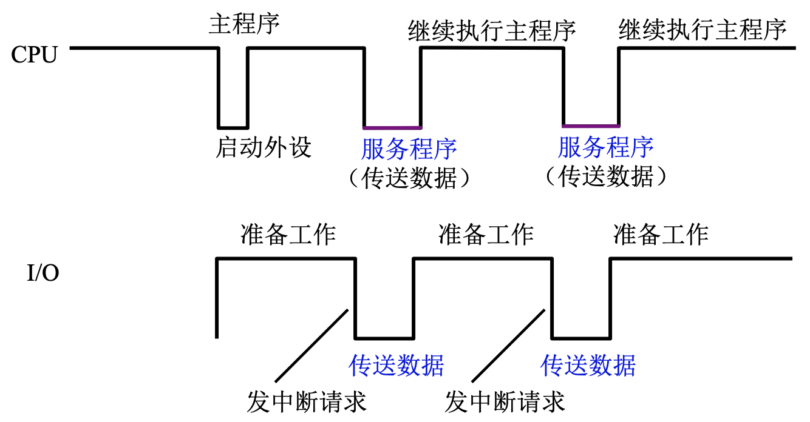

# 输入输出设备-下

<!-- START doctoc generated TOC please keep comment here to allow auto update -->
<!-- DON'T EDIT THIS SECTION, INSTEAD RE-RUN doctoc TO UPDATE -->

- [一、程序查询方式](#%E4%B8%80%E7%A8%8B%E5%BA%8F%E6%9F%A5%E8%AF%A2%E6%96%B9%E5%BC%8F)
    - [1. 程序查询流程](#1-%E7%A8%8B%E5%BA%8F%E6%9F%A5%E8%AF%A2%E6%B5%81%E7%A8%8B)
    - [2. 程序流程](#2-%E7%A8%8B%E5%BA%8F%E6%B5%81%E7%A8%8B)
    - [3. 程序查询方式的接口电路](#3-%E7%A8%8B%E5%BA%8F%E6%9F%A5%E8%AF%A2%E6%96%B9%E5%BC%8F%E7%9A%84%E6%8E%A5%E5%8F%A3%E7%94%B5%E8%B7%AF)
- [二、程序中断方式](#%E4%BA%8C%E7%A8%8B%E5%BA%8F%E4%B8%AD%E6%96%AD%E6%96%B9%E5%BC%8F)
    - [1. 中断的概念](#1-%E4%B8%AD%E6%96%AD%E7%9A%84%E6%A6%82%E5%BF%B5)
    - [2. 中断的产生](#2-%E4%B8%AD%E6%96%AD%E7%9A%84%E4%BA%A7%E7%94%9F)
    - [3. 程序中断方式的接口电路](#3-%E7%A8%8B%E5%BA%8F%E4%B8%AD%E6%96%AD%E6%96%B9%E5%BC%8F%E7%9A%84%E6%8E%A5%E5%8F%A3%E7%94%B5%E8%B7%AF)
        - [3.1 配置中断请求触发器和中断屏蔽触发器](#31-%E9%85%8D%E7%BD%AE%E4%B8%AD%E6%96%AD%E8%AF%B7%E6%B1%82%E8%A7%A6%E5%8F%91%E5%99%A8%E5%92%8C%E4%B8%AD%E6%96%AD%E5%B1%8F%E8%94%BD%E8%A7%A6%E5%8F%91%E5%99%A8)
        - [3.2 排队器](#32-%E6%8E%92%E9%98%9F%E5%99%A8)
        - [3.3 中断向量地址形成部件](#33-%E4%B8%AD%E6%96%AD%E5%90%91%E9%87%8F%E5%9C%B0%E5%9D%80%E5%BD%A2%E6%88%90%E9%83%A8%E4%BB%B6)
        - [3.4 程序中断方式接口电路的基本组成](#34-%E7%A8%8B%E5%BA%8F%E4%B8%AD%E6%96%AD%E6%96%B9%E5%BC%8F%E6%8E%A5%E5%8F%A3%E7%94%B5%E8%B7%AF%E7%9A%84%E5%9F%BA%E6%9C%AC%E7%BB%84%E6%88%90)
    - [4. I/O中断处理过程](#4-io%E4%B8%AD%E6%96%AD%E5%A4%84%E7%90%86%E8%BF%87%E7%A8%8B)
        - [4.1 CPU响应中断的条件和时间](#41-cpu%E5%93%8D%E5%BA%94%E4%B8%AD%E6%96%AD%E7%9A%84%E6%9D%A1%E4%BB%B6%E5%92%8C%E6%97%B6%E9%97%B4)
        - [4.2 I/O中断处理过程](#42-io%E4%B8%AD%E6%96%AD%E5%A4%84%E7%90%86%E8%BF%87%E7%A8%8B)
    - [5. 中断服务程序流程](#5-%E4%B8%AD%E6%96%AD%E6%9C%8D%E5%8A%A1%E7%A8%8B%E5%BA%8F%E6%B5%81%E7%A8%8B)
        - [5.1 中断服务程序的流程](#51-%E4%B8%AD%E6%96%AD%E6%9C%8D%E5%8A%A1%E7%A8%8B%E5%BA%8F%E7%9A%84%E6%B5%81%E7%A8%8B)
        - [5.2 单重中断和多重中断](#52-%E5%8D%95%E9%87%8D%E4%B8%AD%E6%96%AD%E5%92%8C%E5%A4%9A%E9%87%8D%E4%B8%AD%E6%96%AD)
        - [5.3 单重中断和多重中断的服务程序流程](#53-%E5%8D%95%E9%87%8D%E4%B8%AD%E6%96%AD%E5%92%8C%E5%A4%9A%E9%87%8D%E4%B8%AD%E6%96%AD%E7%9A%84%E6%9C%8D%E5%8A%A1%E7%A8%8B%E5%BA%8F%E6%B5%81%E7%A8%8B)
        - [5.4 主程序和服务程序抢占CPU示意图](#54-%E4%B8%BB%E7%A8%8B%E5%BA%8F%E5%92%8C%E6%9C%8D%E5%8A%A1%E7%A8%8B%E5%BA%8F%E6%8A%A2%E5%8D%A0cpu%E7%A4%BA%E6%84%8F%E5%9B%BE)
- [三、DMA方式](#%E4%B8%89dma%E6%96%B9%E5%BC%8F)
    - [1. DMA方式的特点](#1-dma%E6%96%B9%E5%BC%8F%E7%9A%84%E7%89%B9%E7%82%B9)
        - [1.1 DMA和程序中断两种方式的数据通路](#11-dma%E5%92%8C%E7%A8%8B%E5%BA%8F%E4%B8%AD%E6%96%AD%E4%B8%A4%E7%A7%8D%E6%96%B9%E5%BC%8F%E7%9A%84%E6%95%B0%E6%8D%AE%E9%80%9A%E8%B7%AF)
        - [1.2 DMA与主存交换数据的三种方式](#12-dma%E4%B8%8E%E4%B8%BB%E5%AD%98%E4%BA%A4%E6%8D%A2%E6%95%B0%E6%8D%AE%E7%9A%84%E4%B8%89%E7%A7%8D%E6%96%B9%E5%BC%8F)
    - [2. DMA接口的功能和组成](#2-dma%E6%8E%A5%E5%8F%A3%E7%9A%84%E5%8A%9F%E8%83%BD%E5%92%8C%E7%BB%84%E6%88%90)
        - [2.1 DMA接口功能](#21-dma%E6%8E%A5%E5%8F%A3%E5%8A%9F%E8%83%BD)
        - [2.2 DMA接口组成](#22-dma%E6%8E%A5%E5%8F%A3%E7%BB%84%E6%88%90)
    - [3. DMA工作过程](#3-dma%E5%B7%A5%E4%BD%9C%E8%BF%87%E7%A8%8B)
        - [3.1 DMA传送过程](#31-dma%E4%BC%A0%E9%80%81%E8%BF%87%E7%A8%8B)
        - [3.2 DMA接口与系统的连接方式](#32-dma%E6%8E%A5%E5%8F%A3%E4%B8%8E%E7%B3%BB%E7%BB%9F%E7%9A%84%E8%BF%9E%E6%8E%A5%E6%96%B9%E5%BC%8F)
        - [3.3 DMA方式与程序中断方式的比较](#33-dma%E6%96%B9%E5%BC%8F%E4%B8%8E%E7%A8%8B%E5%BA%8F%E4%B8%AD%E6%96%AD%E6%96%B9%E5%BC%8F%E7%9A%84%E6%AF%94%E8%BE%83)
    - [4. DMA接口类型](#4-dma%E6%8E%A5%E5%8F%A3%E7%B1%BB%E5%9E%8B)
        - [3.3 多路型DMA接口的工作原理](#33-%E5%A4%9A%E8%B7%AF%E5%9E%8Bdma%E6%8E%A5%E5%8F%A3%E7%9A%84%E5%B7%A5%E4%BD%9C%E5%8E%9F%E7%90%86)

<!-- END doctoc generated TOC please keep comment here to allow auto update -->

[TOC]

## 一、程序查询方式

### 1. 程序查询流程

单设备程序查询流程如下图所示：

CPU执行到输入输出指令，发出启动设备命令，响应设备接收到命令后，开始数据准备，数据准备好后传输给CPU，CPU在发出设备启动命令后就开始检查设备状态标记，查询设备数据是否已经准备好，如果准备就绪，就进行数据交换，如果没有准备就绪，CPU就处于一直踏步状态，通过循环的方式检查设备是否准备好，直到设备准备好，开始交换数据为止。

在这个过程中要使用三条指令：

1. 测试指令：负责检查状态标记；
2. 转移指令：检查是否准备就绪；
3. 数据传送指令：交换数据。

多个设备程序查询流程如下图所示：

需要把参与传送的设备，根据优先级进行排序，优先级越高的设备，被查询到的时间越早。

上图所示，设备1优先级最高，会先检查设备是否准备就绪，如果准备就绪就处理设备1和内存之间的数据交换；如果没有准备就绪，就检查次优先级设备是否准备就绪。

### 2. 程序流程

根据程序查询流程，可以设计一个程序流程，来实现程序查询流程。

首先要保存寄存器内容，因为程序查询方式要完成内存和外部设备之间的数据输入输出，需要借助CPU的某一个寄存器对数据进行暂存，如果寄存器中的数据有用的，那要对这个寄存器中的数据进行保存，可以把它写入到某一个内存单元中或者放到其他的寄存器中保存。

程序流程设计如下图所示：

1. 设置计数器的值：为了控制传输的数据量，这次究竟传输多少数据；计数器的值设置有2中方式，一种是将计数器的值设置为N(要传输字的数据)
   ，每完成一次传输，计数器的值就减一，直到减到零为止，就完成了数据传输；另一种是将计数器设置为负数，并且负数用补码表示，每传输一个字，给计数器的值加一，直到计数器的值溢出，变为零，表示传输结束。
2. 设置主存缓冲区首址：为了完成内存和I/O之间数据传输，要知道内存块的起始地址是，所以要设置主存缓冲期的地址，保存或读取数据，就从这个缓冲区首地址开始；
3. 启动外设：让外部设备准备；
4. 查询I/O接口状态是否准备好，直到状态标记表明数据已经准备好，查询操作才会停止；
5. 传输数据；
6. 修改主存地址：为输入输出下一个字做准备；
7. 修改计数值：表明还有多少数据要交换；
8. 判断是否传输完，没有传输完再次启动外设，直到数据传输完。

### 3. 程序查询方式的接口电路

以输入为例(将外部设备的数据，输入到主机当中)，电路图如下图所示：

设备选择电路：由它确认一个设备是否就是参加这次传输的设备，给出来的设备选择信号，是整个I/O接口电路的选择信号，只有这个信号有效的，整个接口电路才会有效；如果信号SEL有效，且启动命令有效，I/O接口就会开始工作；

1. CPU通过地址线将外部设备的地址传输到设备选择电路，设备选择电路将地址与自己的地址或端口进行比较，如果匹配，表示本次启动的就是连接在这个接口上的电路设备，SEL有效；若启动命令和SEL都有效，那么就会对两个状态标记(D和B)
   进行置位，到目前为止，只是CPU发出读命令，设备还没有开始工作，因此**标记D为0，表示数据还没有准备好，标记B为1，表示设备忙，开始工作**。

2. B标记启动设备，设备接收到B的标记信号后，以及启动命令，设备开始工作，把数据准备好；
3. 数据通过输入数据线保存到DBR数据缓存当中；
4. 设备工作结束，设备通过设备状态线，向接口电路送入设备工作结束信号，这个信号会修改电路接口中的两个标记，**标记D修改为1，表示数据准备完成，标记B改为0，表示设备空闲，工作完成，D信号被送出，表示准备工作完成**；
5. 在标记D从0变为1的过程中，CPU一直在踏步查询，查询的信号就是D，看D是否为1，只要D不是1，就一直查询；当D变成1时，说明数据已经被放入DBR，CPU可以进行数据传输，CPU就通过数据线将数据读入，这是工作过程结束。

## 二、程序中断方式

### 1. 中断的概念

CPU在执行程序的过程中，如果发生意外或特殊事件，CPU要中断当前程序的执行，转而处理这个特殊或意外事件，通过执行中断服务程序的方式来处理，处理结束之后，要返回到被中断的程序断点，这个过程叫做中断。

如上图所示，CPU执行到第K条指令结束的时候，会去查询是否有中断请求，如果有，能不能进行响应，如果可以响应，CPU就要中断现行程序；

中断的过程是比较复杂的，比如要把程序的断点保存，因为中断服务程序结束后返回，要知道从哪开始执行程序；要保存中断现场，有些寄存器有值，中断服务可能要用到这些寄存器，因此要提前保存好寄存器中原有的值。

保存好断点和现场后，就会执行中断服务程序，执行结束后，根据保存的断点，会回到K+1条指令，接着执行第K+1条指令。

### 2. 中断的产生

首先要了解什么是中断源，中断源是在主机外部、主机内部、CPU外部、CPU内部能引发中断的因素，都称为中断源。

下列以打印机为例：

图示比较简单清晰，这里就不多做解释。

### 3. 程序中断方式的接口电路

#### 3.1 配置中断请求触发器和中断屏蔽触发器

外部设备对中断请求标志进行设置，表示有中断请求，这个中断请求标志能否变成中断请求信号，向CPU发出中断请求，还要看这个中断信号是否被屏蔽掉，因为有时候CPU正在执行的程序或正在执行的中断服务程序的优先级比这个设备提出的中断优先级更高，那么这个中断标志会被屏蔽掉，不会发出中断请求，所以还需要一个中断屏蔽触发器；

当D和MASK都输出1的时候，中断请求触发器会被设置为1，指令周期技术之前，CPU会发出中断查询信号，这个查询信号会使INTR的D端信号送入到输出当中，产生中断请求。

#### 3.2 排队器

在同一时刻向CPU发出中断请求的设备可能有多个，这些设备的优先级是不一样的，比如高速设备的优先级是比较高的，如果高速设备的数据不及时响应，设备中的数据可能会丢失；所以我们需要一个排队器来确定提出中断请求的设备中，优先级最高的是哪个设备，经过排队器后，只有优先级最高的设备提出的中断请求才会被响应。

排队器可以通过硬件或软件的方式进行实现，本文主要讲硬件的方式，软件的会放在后续讲。

硬件实现排队有两种方式，一种是将排队电路集中放在CPU内部，另一种是将排队电路放在每一个接口中，每一个接口的和排队相关的电路连接在一起，就组成了一个链，这种称为链式排队器。

上图是一种链式排队器，如果INTP1是高电平，也就是输出1，那么后面的INTP都会被清零，都是低电平，输出是0；

下面假设，INTR1没有提出中断请求，INTP2提出中断请求，往后的INTR不进行设置(因为不重要)。

INTR2输入高电平，经过与非门，INTP整体为高电平；传递到了INTP3，那么INTP3变成了低电平，因为前面有一个非门，对高电平取反；这个高电平会一直向下传播，也就是后面的INTP都会是低电平，只有INTP1和INTP2是高电平。

这个排队器的输出为若干个1和若干个0，即1100...，可以看出请求优先级最高的是若干个1的最后那个1。

那么要如何从输出中找到优先级最高的请求，方法有很多，这里给出其中一个：将INTR和INTP进行**与非**操作，那么在所有INTP中输出中，只有一个值是高电平，通过这种方式确定了有中断请求的优先级最高的中断源。

#### 3.3 中断向量地址形成部件

如果要响应一个中断服务程序，CPU要知道这个中断服务程序的入口地址，也就是中断服务程序在内存中的首地址，这个地址要通过中断向量地址形成部件来形成入口地址。

中断向量地址的形成同样有软件和硬件的方法，这里依然只介绍硬件的方法，软件的会在后续讲。

硬件向量法：由**硬件**产生**向量地址**，再**由向量地址**找到**入口地址**。

这里有几个概念需要区分好：

- 中断号：中断的编号，比如8086中，支持256个中断，这256个中断被编号成0~255；
-
中断向量：可以理解成中断服务程序的入口地址，比如X86系列中，可以理解成中断服务程序的段地址和偏移量组成的向量，有时候也指程序状态字，比如CPU发生中断时候，一些体现结构的寄存器或者表示程序状态的寄存器，这些寄存器指令无法进行读取，那么在计算机内部就集成成一个字，这个字称为程序状态字，这个适合所谓中断向量就是指和中断服务程序相关的入口地址，包括段地址、偏移量，也包括执行中断服务程序需要的一些状态信息；
- 中断服务程序入口地址：由中断向量生成；
- 向量地址：保存中断向量的内存单元的地址。

中断向量地址形成部件的输入是排队器的输出，输出对应了中断向量地址。

#### 3.4 程序中断方式接口电路的基本组成

经过上面的铺垫，我们可以得到程序中断方式接口电路的基本组成：

### 4. I/O中断处理过程

#### 4.1 CPU响应中断的条件和时间

条件：CPU内部有一个允许中断触发器EINT，这个触发器等于1时允许中断；可以用将EINT置为1指令将EINT置为1，用**关中断**指令将EINT置为0或者硬件**自动复位**。

时间：当D=**1**(随机)且MASK=**0**时，在每条指令执行阶段的结束前，**CPU**发**中断查询信号**(将 INTR 置“1”)。

#### 4.2 I/O中断处理过程

过程如下图所示：

### 5. 中断服务程序流程

#### 5.1 中断服务程序的流程

1. 保护现场
    -
    程序断点的保护：有两部分，一部分是中断返回后，下一条要执行的指令地址，这个就是当前PC保存的指令的值；另一部分是程序执行状态，那些不能由指令直接读取的状态，这部分由硬件完成，称为中断隐指令，这并不是一条指令，而是硬件要自动执行的一些列操作，后续还会提到；
    - 寄存器内容的保护：一些在中断服务程序中要用到的寄存器，这些寄存器中的值要提前保护起来，因为中断返回后，主程序可能还需要这些寄存器的值；这些寄存器一般是在中断服务程序中利用进栈指令进行保存的；

2. 中断服务：对不同的 I/O 设备具有不同内容的设备服务；
2. 恢复现场：如果保护现场时使用的是进栈指令，那么恢复时就可以用出栈指令进行恢复；保护现场不一定要用进栈指令，可以将寄存器的内容移到其他寄存器，也可以降寄存器内容放到存储单元中，只要能够恢复原样即可；
2. 中断返回：使用中断返回指令。

#### 5.2 单重中断和多重中断

单重中断：CPU在执行中断服务程序的时候，有新的中断请求，不管新的中断请求优先级如何，都不能中断现行的中断服务程序，即**不允许中断**现行的**中断服务程序**；

多重中断：CPU在执行中断服务程序的时候，**允许优先级更高**的中断源**中断现行的中断服务程序**。

#### 5.3 单重中断和多重中断的服务程序流程

二者前面的步骤都是类似的，主要区别在中断服务程序，即开中断的位置；关中断是将EINT(允许中断触发器)=0，此时即使有中断请求，CPU也不会响应，开中断将EINT=1，此时CPU可以响应中断请求。

#### 5.4 主程序和服务程序抢占CPU示意图

**宏观** 上 CPU 和 I/O **并行** 工作，**微观** 上 CPU **中断现行程序** 为 I/O 服务。

## 三、DMA方式

### 1. DMA方式的特点

#### 1.1 DMA和程序中断两种方式的数据通路

从上图可知，中断方式下主存和I/O设备想交换数据，必须经过CPU的寄存器(在给定模型机下，用的是ACC寄存器)
，设备在准备数据的时候不需要CPU协助，可以并行处理，但在真正进行数据交换的时候，需要CPU执行中断服务程序，完成数据输入输出操作。

DMA进一步解放CPU，主存和I/O设备可以通过DMA接口直接连接彼此进行数据传送，不需要经过CPU。

#### 1.2 DMA与主存交换数据的三种方式

1. 停止CPU访问主存

在一块数据交换的开始，CPU放弃总线控制权和对内存的访问交给DMA接口，从控制的角度来说比较简单，适合大量的数据传输；如果在将控制权交给DMA时，CPU的指令缓存有指令，或接下来要执行的指令已经加载到缓存，且指令不需要访问内存，那么CPU可以继续工作，否则将处于保持状态；但这种方式不能充分发挥CPU对主存的利用率，因为即使是一块的数据传输，也是一个字一个字的传输，传输间隔可能比较大，这个时间可能会超过一个主存周期，也就是说在传输间隔这个时间里，虽然DMA没有直接使用主存，但是依然占用主存占用权，CPU不能利用和访问主存。

如上图所示，蓝色部分有大量的传输间隔，间隔期间CPU不能使用主存，主要是这部分时间被浪，降低了CPU对主存的利用率。

2. 周期挪用(周期窃取)

这里的周期是指**访存周期**，如果DMA接口准备好了数据传输，就申请总线使用权，占用一个或几个内存访问周期，完成数据传输，在数据传输间隔或数据准备阶段，DMA放弃对总线的占用和内存的访问权。

DMA访问主存有3种可能：

- CPU此时不访存，直接将主存访问权分配给DMA；
- CPU正在访存，DMA需要等待，不能抢占；
- CPU与DMA同时请求访存，此时CPU将总线控制权让给DMA，因为DMA连接的都是高速设备，如果不及时响应，可能会出现数据丢失(我西皮优这么没有牌面的吗！恼)。

下图很形象的描述了周期挪用：

3. DMA与CPU交替访问

这种方法实用性并不是很强；将CPU工作周期分为两部分：C1专供DMA访存，C2专供CPU访存；因为分配时间固定，DMA不需要发出请求申请和归还主存和总线的使用权，速度会比较快。

### 2. DMA接口的功能和组成

#### 2.1 DMA接口功能

1. 向CPU申请DMA传送，提出总线和内存占用请求；
2. 处理总线控制权的转交；
3. 管理系统总线、控制数据传输；
4. 确定数据传送的首地址和长度，传输数据的方向，传输过程中药修正传输的数据地址和长度(修改长度主要是为了确定数据传输是否结束)；
5. DMA传输结束时，要给出操作完成信号，使CPU能做进一步的处理。

#### 2.2 DMA接口组成

接口组成如上图所示，假设是单总线结构。

AR：地址寄存器，要传输数据，CPU首先要告诉DMA接口，传输的地址是什么，也就是从内存的哪个地址开始数据传输，或者输入的数据从内存的哪个地址开始存放，所以需要一个地址寄存器；

WC：计数器，要知道传输的数据量，所以需要一个计数器；

> 假设我们是从低地址开始传输数据，每次传输数据的单位和编址单位相同，那么每完成一个数据的输入或输出，要对AR进行修改，给AR加一，另外WC是字数计数，假设采用补码的方式，每传输一个数据，就给WC加一。

BR：数据缓冲器，外部设备的数据获取内存的数据要暂存在接口的数据缓冲器中；

DAR：设备地址寄存器，这个寄存器有两个作用：一是供设备选择电路使用，看这次访问的设备是不是当前连接的设备，可以把设备地址保存到这个寄存器中；二是对硬盘这类设备访问的时候，可以用来保存柱面号，磁道号，扇区号，以供在数据传输时确认数据传输地址。

> AR通过地址线将要访问的内存地址送给主存，要访问内存的首地址通过数据线给AR设置，数据的数量通过数据线给WC设值，设备的地址也通过数据线设置，数据的输入输出也通过数据线传输；BR与设备相连。

DMA控制逻辑：输入输出过程由其控制，要控制接口内部进行协调工作，控制程序发出指定信号，比如向CPU发出DMA请求，向主存发出读写控制信号；

> 外部设备要想进行数据传输，要向DMA控制逻辑发出请求信号DREQ，DMA要向CPU发出控制信号，DMA控制逻辑要对设备给出应答信号DACK。

中断机构：用于数据传输完以后，对后续的工作进行处理；

> 如WC等于零，表示传输结束，会向中断机构发出溢出信号，中断机构的中断请求触发器置1，当一条指令执行结束后，由中断机构向CPU发出中断请求，由CPU做数据传输后的处理。

### 3. DMA工作过程

#### 3.1 DMA传送过程

传送过程分为：预处理、数据传输、后处理。

预处理通过几天输入输出指令预置如下信息：

- 通知DMA控制逻辑传送方向(输入/输出)；
- 给DMA的DAR设置设备地址；
- 给DMA的AR设置要访问的主存地址以及给DMA的WC设置传送字数。

DMA传送过程示意图如下：

下面以数据输出为例：

1. BR将数据传输到设备中；
2. 设备接收完数据后，发请求DREQ到DMA控制器，告诉它BR已经空了，可以继续传送数据；
3. DMA控制器向CPU发出总线占用请求；
4. CPU在运行的情况下，会给出应答信号HLDA，内存和总线交给DMA；
5. AR给出内存单元的访问地址；
6. DMA对设备给出应答DACK，告诉设备已经开始了新的传输；
7. 主存中的数据通过数据线写入到BR，同时修改AR和WC，修改完后通过WC判断传输是否结束；若未结束，回到步骤3；若数据传输完成，由WC发出溢出信号通知中断机构，再由中断机构向CPU发出中断请求，由CPU做后处理。

后处理：

1. 校验送入主存的数据是否正确；
2. 是否继续用DMA；
3. 测试传输过程是否正确，错则转诊断程序。

后处理由中断服务程序完成。

#### 3.2 DMA接口与系统的连接方式

1. 具有公共请求线的DMA请求

这张图一看就会很熟悉，就是总线仲裁采用的串行连接方式。

DMA接口通过地址线和数据线与主存连接，所有DMA接口共享一条请求线，这条线是连接CPU的，各个DMA接口也是有优先级的，越靠近CPU的DMA接口优先级越高。优缺点可参考总线。

2. 独立的DMA请求

这张图一看也会很熟悉，就是总线仲裁采用的独立请求方式。

DMA接口依然和地址线和数据线连接，每个DMA接口有独立的DMA请求线连接到CPU。

#### 3.3 DMA方式与程序中断方式的比较

|              | 中断方式     | DMA方式      |
| ------------ | ------------ | ------------ |
| 数据传输     | 程序         | 硬件         |
| 响应时间     | 指令执行结束 | 存取周期结束 |
| 处理异常情况 | 能           | 不能         |
| 中断请求     | 传输数据     | 后处理       |
| 优先级       | 低           | 高           |

### 4. DMA接口类型

1. 选择型

在**物理上**连接**多个**设备，在**逻辑上**只允许连接**一个**设备。

如上图所示
，DMA接口的各种寄存器、时序电路只有一套，也就是说某一个设备要使用接口进行数据传输，CPU通过运行输入输出命令对接口寄存器进行设置，设置成了某一个设备与主存交换需要的值，其他设备就无法使用该DMA接口进行数据传输，因此即使连接了多个设备，但只有一个设备能够通过DMA接口与内存进行数交换。

2. 多路型

在**物理上**连接**多个**设备，在**逻辑上**允许连接**多个**设备同时工作。

下面以通道为例：

通道是一种小型的DMA处理器，也是一种DMA接口，一个通道下面包含了多个子通道，每一个子通道都要全套的寄存器，这些子通道可以控制多个设备；当CPU执行到了输入输出指令，CPU就可以给相应的子通道设置值，设置完以后继续执行主程序，碰到下一条输入输出指令，如果这个设备使用的是不同的子通道，CPU会对另一条子通道进行设置，外部设备可以在之后的时间里可以进行数据准备，多个外部设备可以并行准备，外部设备准备好了，外部设备通过子通道向通道提出数据传输请求，此时不同设备的数据传输是串行执行。

#### 3.3 多路型DMA接口的工作原理

图比较简单，就不多做介绍了。
