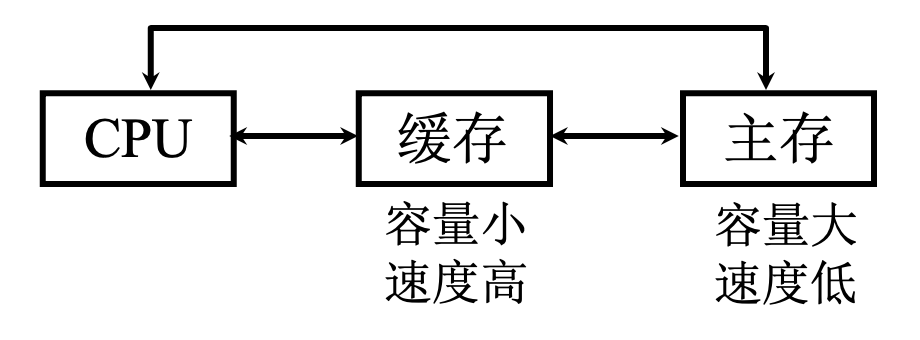
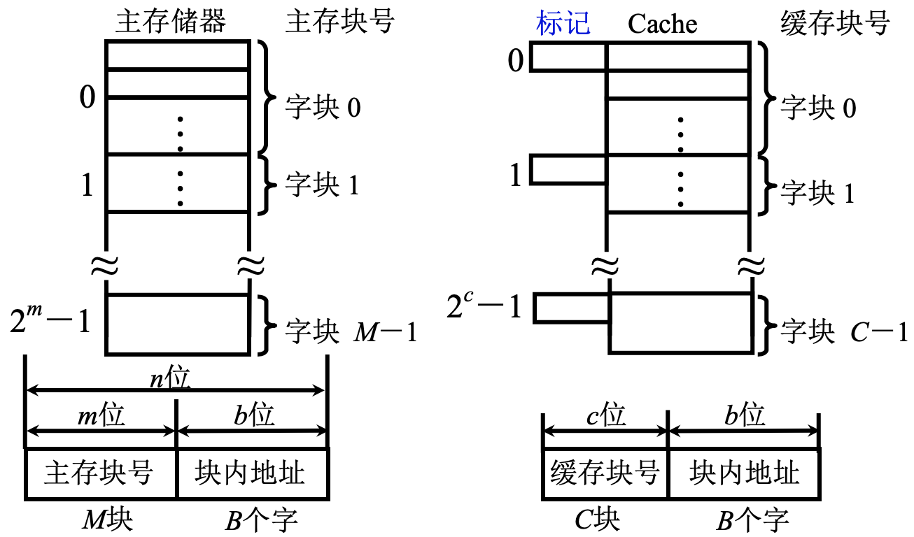
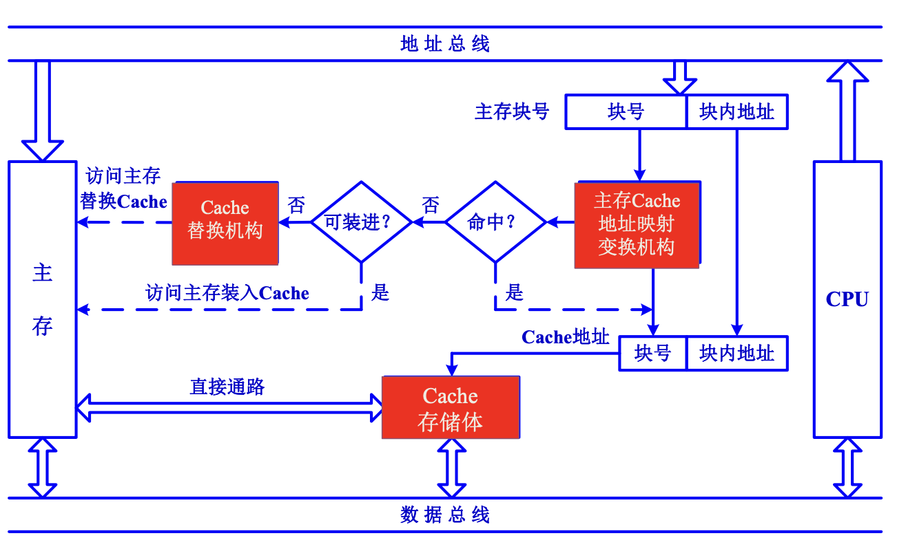
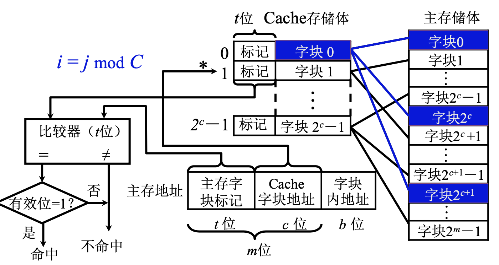
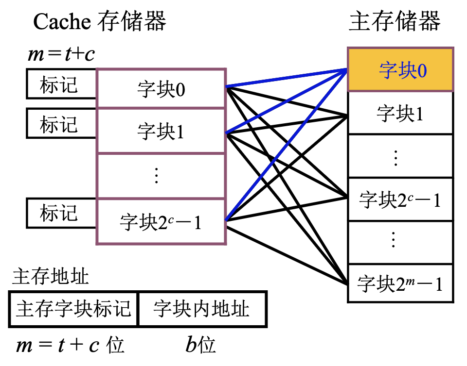
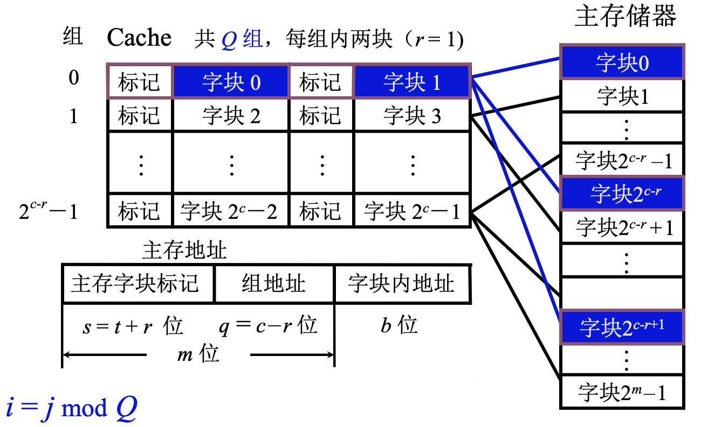

# 高速缓冲存储器

<!-- START doctoc generated TOC please keep comment here to allow auto update -->
<!-- DON'T EDIT THIS SECTION, INSTEAD RE-RUN doctoc TO UPDATE -->

- [一、为什么要用高速缓冲存储器](#%E4%B8%80%E4%B8%BA%E4%BB%80%E4%B9%88%E8%A6%81%E7%94%A8%E9%AB%98%E9%80%9F%E7%BC%93%E5%86%B2%E5%AD%98%E5%82%A8%E5%99%A8)
- [二、cache工作原理](#%E4%BA%8Ccache%E5%B7%A5%E4%BD%9C%E5%8E%9F%E7%90%86)
    - [1. 主存和cache的编址](#1-%E4%B8%BB%E5%AD%98%E5%92%8Ccache%E7%9A%84%E7%BC%96%E5%9D%80)
    - [2. 命中与未命中](#2-%E5%91%BD%E4%B8%AD%E4%B8%8E%E6%9C%AA%E5%91%BD%E4%B8%AD)
    - [3. cache命中率](#3-cache%E5%91%BD%E4%B8%AD%E7%8E%87)
    - [4. cache基本结构](#4-cache%E5%9F%BA%E6%9C%AC%E7%BB%93%E6%9E%84)
    - [5. cache读写操作](#5-cache%E8%AF%BB%E5%86%99%E6%93%8D%E4%BD%9C)
        - [1. 读操作](#1-%E8%AF%BB%E6%93%8D%E4%BD%9C)
        - [2. 写操作](#2-%E5%86%99%E6%93%8D%E4%BD%9C)
- [三、Cache–主存的地址映射](#%E4%B8%89cache%E4%B8%BB%E5%AD%98%E7%9A%84%E5%9C%B0%E5%9D%80%E6%98%A0%E5%B0%84)
    - [1. 直接相连映射](#1-%E7%9B%B4%E6%8E%A5%E7%9B%B8%E8%BF%9E%E6%98%A0%E5%B0%84)
    - [2. 全相连映射](#2-%E5%85%A8%E7%9B%B8%E8%BF%9E%E6%98%A0%E5%B0%84)
    - [3. 组相连映射](#3-%E7%BB%84%E7%9B%B8%E8%BF%9E%E6%98%A0%E5%B0%84)
- [四、替换算法](#%E5%9B%9B%E6%9B%BF%E6%8D%A2%E7%AE%97%E6%B3%95)

<!-- END doctoc generated TOC please keep comment here to allow auto update -->

[TOC]

## 一、为什么要用高速缓冲存储器

CPU的发展速度快，内存速度提升比较慢，二者访问速度存在剪刀差；CPU执行指令时，需要的指令、数据、执行结果都要取自或保存到存储器中，CPU再快，取不到指令、数据，也无法完成操作，只能空等。

cache就是为了解决空等问题。在CPU和主存中加入一级存储量小，但存储快的存储设备，这个存储设备就是cache，用静态ROM实现；cache和主存比速度高容量小，和CPU比容量大速度低。

当然，要能切实提高CPU访问主存的速度，就要保证CPU需要的大部分指令、数据在cache中能找到，我们要依靠程序访问的局部性原理。

> 程序访问的局部性原理
>
> 1. 时间局部性：当前正在使用的指令和数据，在不久的将来，还会被使用到。
> 2. 空间局部性：当前正在使用的指令或数据，在不久的将来，相邻的数据和指令可能会被用到。

根据时间局部性，我们需要将正在使用的指令和数据放入cache；根据空间局部性，我们不仅要把当前正在使用的执行和数据放入cache，相邻的指令和数据也要放入cache。该原理非常明确的说出了cache和主存之间数据交换的单位是块，块中既包括了正在使用的也包括相邻的，块的大小，要通过实验的方式来确定。

## 二、cache工作原理

### 1. 主存和cache的编址

如图所示，左边是主存，右边是cache；

将主存和cache分成大小相等的块，主存中一共有M快，cache中有C块，主存的量远远大于cache的量(M>>C)；

那么CPU给出的地址可以分为两部分，一部分是块内偏移地址，它的位数决定了块的大小，比如一个块包含了16字节，并且内存的编址单位是字节，那么块内地址部分是4位，剩余的部分是主存块号，实际应用中cache地址意义不大，也不需要真正形成cache地址。

另外，内存块和cache块大小是一致的，块内地址位数相同，一个块在内存和cache直接传输的时候，是整体进行传送，块内字节顺序不会发生任何变化，因此二者块内地址完全相同。

注意看图可以发现，cache还有一个标记，它实际上标记了主存块和cache块之间的对应关系：如果一个主存块调入到了cache中，那么可以把主存块号写入到标记中，将来CPU给出一个内存地址，希望在cache中访问到数据，那就可以先拿出地址的主存块号与cache中的标记进行比较，如果和某一个cache块相等，并且这个cache块是有效的，这个块里就保存了CPU需要的数据，可以直接从cache中获取。

### 2. 命中与未命中

cache有C块，主存有M块，M >> C；因此不是主存中所有的块都能放入cache中的。

命中：要访问的块已经调入了cache中，主存块与缓存块 **建立** 了对应关系；

未命中：要访问的块没有调入cache，CPU必须到主存中获取，主存块与缓存块 **未建立** 对应关系。

用 **标记记录** 与某缓存块建立了对应关系的主存块号。

### 3. cache命中率

CPU 欲访问的信息在 Cache 中的 **比率**。命中率与cache的容量和块长有关。

一般cache块大小可取4~8字节，块长取一个存储周期内，从主存调取信息的长度。

### 4. cache基本结构

基本结构如上图所示。

CPU想要读取数据，要给出地址，地址包括块号和块内地址；将块号送入主存叉车地址映射变换机构，判断是否命中，如果发生命中，需要给出当前内存块保存在哪个cache块中，要形成一个cache块号；如果没有命中，要查询cache中是否还有空间能装入主存块，如果有就将访问的主存块装入cache中，如果没有足够的空间，就要启用cache替换结构，退出某个cache块，并把访问的主存块放入cache中。

### 5. cache读写操作

#### 1. 读操作

读操作如下图所示：

#### 2. 写操作

写操作会造成cache和主存的不一致，比如只对cache写不对主存写，因此写操作中一定要解决cache和主存一致性的问题。解决一致性主要有两种方法：

**写直达法(Write – through)**

写操作时数据既写入Cache又写入主存，写操作时间就是访问主存的时间；Cache块退出时，不需要对主存执行写操作，更新策略比较容易实现。这种方法的优点是cache和主存数据时刻保持一致；缺点是可能会造成CPU对同一个内存单元进行反复的写。

**2. 写回法(Write – back)**

写操作时只把数据写入 Cache 而不写入主存 当 Cache 数据被替换出去时才写回主存；写操作时间就是访问 Cache 的时间；Cache块退出时，被替换的块需写回主存，增加了Cache
的复杂性。这种方法的优点是不会对一个内存单元反复写；缺点是在多处理器的情况下，每个处理器都有自己的cache，内存的一个块在每个cache中都有一个副本，这样就会造成多个副本之间一致性的问题。

## 三、Cache–主存的地址映射

### 1. 直接相连映射

主存中任意一个给定的块，只能映射到/装载到某一个指定的cache块中。

以cache存储体大小为度量，将主存储体划分为若干个cache存储体大小的区，每个区和cache体大小相同，每个字块的大小和cache存储体字块大小相同，这样每个区的字块都可以要从0开始，一直到(2^c)
-1；那么任何区的第0块，都只能放到cache块的第0块中；这种映射方式称为直接映射。

主存地址可以分成3部分：

1. 区号：即主存块标记
2. 块号：即cache字块地址；
3. 偏移地址：即字块内地址。

由于cache中的cache0可能存储任何一个区的字块0，所以cache中采用标记来区分是主存储体的哪个字块。

这种映射方式结构简单，速度快，地址变换过程中，可以根据cache块地址直接找到cache块；但cache利用率可能会很低，cache调入时冲突的概率会很大。

### 2. 全相连映射

主存中的任意一个块，可以放入到cache的任一个块中。

这种映射方式的优点是cache利用率提高了，只要有空闲块，主存块就可以调入到cache中；缺点是电路复杂且查找效率慢了，根据地址查找一个块，需要遍历比较cache中所有块标记。

### 3. 组相连映射

组相连映射是直接合全相连映射的折中。

先把cache分成块，cache块再分成若干个组；主存储器中字块分区，区的大小与cache中组数相同，也就是cache中有多少组，主存储器的每个分区就有多少个字块；映像的时候，每个区的第0块，可以放到第0组的任一个字块，也就是主存储器的字块的区号，决定了了这个字块可以装入到哪一个组。

这种方法，和直接相连相比，一个块有多个位置，即使其中的一个位置被占用了，如果另一个块位置是空的，可以直接调入；和全相连相比，如果查找某一个内存块是否调入到了cache中，只需要确定它在某个区的多少块，块的标号是多少，给出标号后找到给定的组，比较的时候，比较给定组的几个字块，与标记中的区号比即可，不需与每一个cache块比较，比较量比全相连要小得多。

## 四、替换算法

当访问了一个内存块后，发现cache中没有空间存放该内存块，那么必须有一个cache中的块被替换出来，使得内存块能装入cache，这就是替换算法，也就是选择哪一个cache块从cache中退出。

1. 先进先出(FIFO)算法：这种算法认为，先进入cache的内存块，CPU已经用完了，或者在不久的将来不会再利用这个块的信息，因此将其替换出去。但这种方法不能非常好的体现出程序的局部性原理。
2. 近期最少使用(LRU)算法：在最近的一段时间里，使用最少的块，将来也可能不会被使用，或者即使要使用，也是很长时间后。这种方法比较好的体现了程序的局部性原理，应用较广。