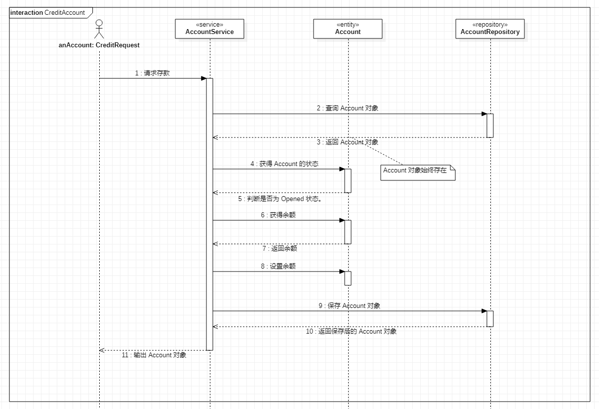
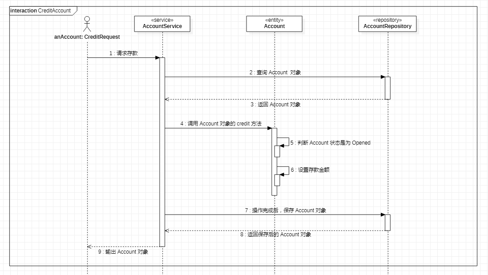

# DDD-面向对象思想
<!-- START doctoc generated TOC please keep comment here to allow auto update -->
<!-- DON'T EDIT THIS SECTION, INSTEAD RE-RUN doctoc TO UPDATE -->

- [一、属性和操作](#%E4%B8%80%E5%B1%9E%E6%80%A7%E5%92%8C%E6%93%8D%E4%BD%9C)
- [二、对象建模](#%E4%BA%8C%E5%AF%B9%E8%B1%A1%E5%BB%BA%E6%A8%A1)
  - [1. Account 建模](#1-account-%E5%BB%BA%E6%A8%A1)
  - [2. Account Credit](#2-account-credit)
- [三、组合与聚合](#%E4%B8%89%E7%BB%84%E5%90%88%E4%B8%8E%E8%81%9A%E5%90%88)
- [四、总结](#%E5%9B%9B%E6%80%BB%E7%BB%93)

<!-- END doctoc generated TOC please keep comment here to allow auto update -->

[TOC]

面向对象是一种对**世界**理解和抽象的方法。那么**对象**是什么呢？

对象是对世界的理解和抽象，世界又代称为**万物**。理解世界是比较复杂的，但是世界又是由**事物**组成的。

正是这样的一种关系，认识事物是极其重要的。那什么是**事物**呢？

事物：由**事**和**物**两个方面组成。事即事情，物即物体，那什么是事情？什么是物体呢？

- **意志的行为**是为事。
- 存在的一切是为物，物体又是由属性和行为组成的。

由于**对象**是对**事物**的理解和抽象，所以对象就是对一个事物的属性和行为的理解和抽象。正是这样的一种关系，**面向对象**就是对一个事物的**属性和行为**的理解和抽象的方法。

理解对象以及抽象“对象”就是在理解和抽象事物的属性和行为。


## 一、属性和操作

面向对象的核心是**对象**，对象是由**属性**和**方法**组合而成的。在使用面向对象进行分析、设计、编码的时候，你**首先**应该想到的是**属性**和**方法**组合形成的对象。在需要组合的时候就不应该出现只包含属性的对象或者只包含方法的对象。

- 何时需要属性和方法组合的对象呢？
- 何时只需要包含属性的对象呢？
- 何时只需要包含方法的对象呢？

事物由事情和物体组成。事情是行为，物体是属性。

- 当你**需要**抽象一个事物的**事情和物体**时就需要属性和方法的组合。
- 当你只**需要**抽象一个事物的**物体**时就只需要**属性**。
- 当你只**需要**抽象一个事物的**事情**时就只需要**方法**。

## 二、对象建模

在数据库系统中，它们关心的是事物中的**物体**，所以在抽象事物时它们只抽象了事物中的属性。在应用系统中，它们关心的是表达事物的三种方式（属性和方法的组合、只包含属性、只包含方法），所以在抽象事物时需要思考你需要那种方式。

只要需要抽象事物（事情和物体）中的属性，也就是物体的这部分，那有可能是需要持久化的。只要需要持久化，通常是保存到关系型数据库中，在关系型数据库中的表（Table）基本上是与面向对象中的对象（Object）的属性是一一对应的。

由于数据库中的表只抽象了事物中的属性，所以它有可能是不完整的。就抽象事物的属性来说依然有两种：只抽象事物的属性、抽象事物的属性和方法的组合。

正是数据库中**表**的这种抽象形成了数据模型，它对比对象模型是不完整，所以在面向对象分析（OOA）时一定要采用对象（事物）抽象而不是数据（属性、物体）抽象。

### 1. Account 建模

举个例子：

简单金融账户（Account）

属性有：账号（id）、余额（balance）、状态（status）

操作有：开户（open）、注销（close）、存钱（credit）、取钱（debit）。

数据模型的只需要设计字段（fields）和关联关系，所以下面的 SQL 基本已完成。

```sql
create table account
(
    id      integer,
    balance integer,
    status  integer
);
```

如果把上述 SQL 转换成 Java 的对象的话，得到将是一个用面向对象设计的数据模型，而不是完整的对象模型。这种模型在 Java 开发中非常普遍，这是数据模型思维所导致的结果。

```java
@Getter
@Setter
public class Account {
    private int id;
    private int balance;
    private AccountStatus status;
}
```

如果使用对象模型的思维来设计模型，从接口上来看，他应该是这样的：

```java
public interface Account {
    int getId();
    int getBalance();
    AccountStatus getStatus();
    void open();
    void close();
    void credit(int amount);
    void debit(int amount);
}
```

如果 Account 接口符合金融账户的设计，那么 Account 最简单地实现应该如下：

```java
@Getter
public class Account {
    private int id;
    private int balance;
    private AccountStatus status;

    public void open() {
        this.status = AccountStatus.OPENED;
    }
    public void close() {
        this.status = AccountStatus.CLOSED;
    }
    public void credit(int amount) {
        this.balance += amount;
    }
    public void debit(int amount) {
        this.balance -= amount;
    }
}
```

这是从两个建模的角度来对比对象模型和数据模型的不同，下面我们还要从完整地执行流程来对比。

### 2. Account Credit

- 数据模型(贫血模型)

首先是使用数据模型所设计的时序图，因为数据模型下的 Account 不包含业务逻辑，所有的业务逻辑都在 AccountService 中，所以通常称为业务逻辑服务（层）或者事务脚本。如图下：



使用 Java 代码的实现：

```java
public class AccountService {

    private final AccountRepository accountRepository;

    public AccountService(AccountRepository accountRepository) {
        this.accountRepository = accountRepository;
    }

    public Account creditAccount(int accountId, int amount) {
        var account = this.accountRepository.findById(accountId)
                .orElseThrow(() -> new AccountException("The Account was not found"));
        if (AccountStatus.OPENED != account.getStatus()) {
            throw new AccountException("The Account is not open");
        }
        account.setBalance(account.getBalance() + amount);
        return this.accountRepository.save(account);
    }
}
```

- 对象模型(充血模型)

现在我们要使用对象模型的思维进行设计时序图：



使用 Java 代码的实现：

```java
public class AccountService {

    private final AccountRepository accountRepository;

    public AccountService(AccountRepository accountRepository) {
        this.accountRepository = accountRepository;
    }

    public Account creditAccount(int accountId, int amount) {
        var account = this.accountRepository.findById(accountId)
                .orElseThrow(() -> new AccountException("The Account was not found"));
        account.debit(amount);
        return this.accountRepository.save(account);
    }
}
```

在 AccountService 的 creditAccount 方法中已经没有了业务代码，更多地是协调调用执行流程。对于这种只用来实现执行流程，不在包含业务逻辑的服务对象，将它们称为应用服务(Application Service)。

举个家政服务公司与 AccountService 相似的例子：

比如你想请一位保洁阿姨给家里做一做清洁工作，首先是你打电话给家政服务公司说你要给家里做一做清洁工作，然后家政公司安排一位保洁阿姨去你家帮忙完成清洁工作，在这个过程中家政公司主要做了接待、协调、安排、最后可能包含一些保洁阿姨的绩效等一系列工作。上面的 AccountService 也一样是在做这样的一件事情。所以在对象模型中，AccountService 只需要做像家政公司这样协调工作，具体地工作由保洁阿姨来完成，这里的保洁阿姨就相当于 Account 对象。

从两处对比来看，采用数据模型建模配合业务逻辑服务的方式更像是过程化编程，只是在使用面向对象语言来编写过程化代码。而采用对象模型配合应用服务的方式才是符合面向对象编程。

## 三、组合与聚合

在多数的业务开发中，普遍提到的是关联关系（一对一、一对多、多对多）和继承泛化，很少去关注组合与聚合，但是组合与聚合在面向对象中是相当重要的。

组合与聚合是在探讨整体与部分的关系，这种整体与部分的关系是一种比关联关系更强的关系。比如：汽车与轮胎，汽车是一个整体，轮胎是汽车的一部分。如果汽车没有轮胎，那么就无法构成汽车的完整性，所以在讨论整体与部分的关系时，要特别注意**整体对部分的依赖性而不是部分对整体的依赖**。

首先通过一个人进食过程的用例来考虑整体与部分的依赖关系，然后在例子中说明组合与聚合区别和联系。

这个进食过程需要多个人体器官协作配合。首先是通过一种方式将食物送进口腔，由牙齿的咀嚼和舌头的搅拌，再由喉咙吞咽，从食道进入胃中，在通过胃里进行初步消化，将饮食变成食糜，然后传入小肠后，在脾的运化作用下，精微物质被吸收。

**注意**：这个从嘴到胃的执行过程并不是一个 Input/Output 方式，而是一个 Stream 方式，后面还有连接。从这个角度来考虑嘴只是 Stream 的入口，但是这个用例主要是想说明整体与部分的联系，所以把这种连接的每一个部分修改成 Input/Output 调用方式。

为这次进食过程来建模吧！首先确定关键的对象模型有：人(Person)、嘴(Mouth)、食道(Esophagus)、胃(Stomach)、肠道(Intestine)。代码如下：

```java
// 嘴
public class Mouth {
    public Object chew(Object food) {
        return food;
    }
}

// 食道
public class Esophagus {
    public Object transfer(Object paste) {
        return paste;
    }
}

// 胃
public class Stomach {
    public Object fill(Object paste) {
        return paste;
    }
}

// 肠道
public class Intestine {
    public void absorb(Object chyme) {
        // absorbing...
    }
}

public class Person {
    private final Mouth mouth;
    private final Esophagus esophagus;
    private final Stomach stomach;
    private final Intestine intestine;

    public Person() {
        this.mouth = new Mouth();
        this.esophagus = new Esophagus();
        this.stomach = new Stomach();
        this.intestine = new Intestine();
    }

    public void eat(Object food) { // 进食。
        var paste = this.mouth.chew(food); // 咀嚼形成浆糊。
        paste = this.esophagus.transfer(paste); // 通过食道传送食物。
        var chyme = this.stomach.fill(paste); // 填充到胃里形成食糜。
        this.intestine.absorb(chyme); // 在肠道里吸收营养。
        // 便秘中...
    }
}

public class PersonTests {
    public static void main(String[] args) {
        new Person().eat("chips");
    } 
}
```

在整个进食流程中，是由人(Person)做的吃(eat)这个动作开始，然后由人体内部的多个参与的部分对象协调完成的，这就是整体与部分的关系。Person 是个整体，Mouth, Esophagus, Stomach, Intestine 是整体内的部分。然后在考虑一个事情，这些部分对象是不是依附在整体对象上，比如：嘴是不是独立于人体不能存活，伴随着人的存在而存在，消亡而消亡。**这种部分对象的创建、存在和消亡都是和整体对象一起的就称为组合**。而聚合就不像组合的整体与部分的关系那么强，比如：汽车与轮胎是一个整体与部分的关系，汽车没有轮胎肯定跑不了。但是汽车可以更换轮胎，这种可以更换的关系就没有组合关系那么强。除了更换还有缺少的，比如：螃蟹有八条腿，总的来说螃蟹没有腿肯定是无法行走的，但是缺少一个两个还是能行走的，可能行走有一些困难。**这样的可以在初始化之后能够更换的或者不需要强制完整的整体与部分的关系称之为聚合**。

随着时间的向前和空间的扩大，组合和聚合还是会存在转换的情况，比如未来人可以换嘴、进食流程不需要嘴的参与，再比如说一次性轿车，出厂后就不能维修更换等等。所以在讨论组合与聚合的关系时，要在一定的限界下来讨论。

## 四、总结

- 对象建模，通过对象模型与数据模型的对比来说明需要一种对象模型的思维。
- 对象建模的应用，通过账户存款的业务来简要说明如何使用对象模型。
- 组合与聚合，通过重点说明组合与聚合，让其在对象模型的基础上，讨论整体与部分的关系。
- 拓展：可以了解一下 **贫血模型** 和 **充血模型** 。