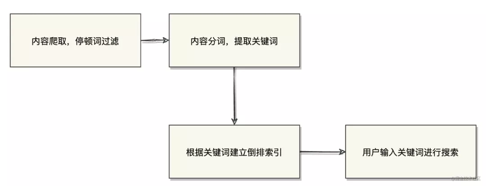
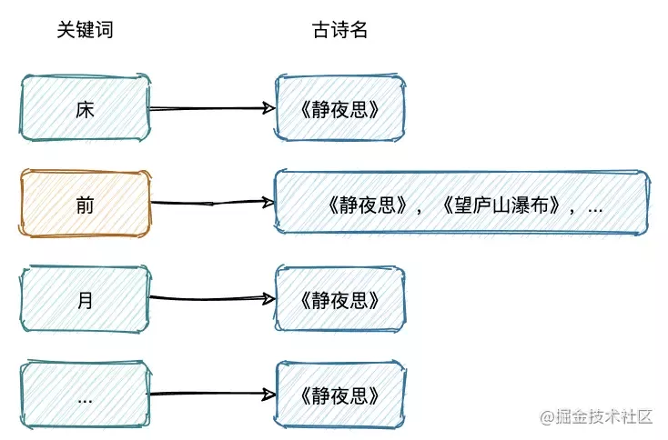
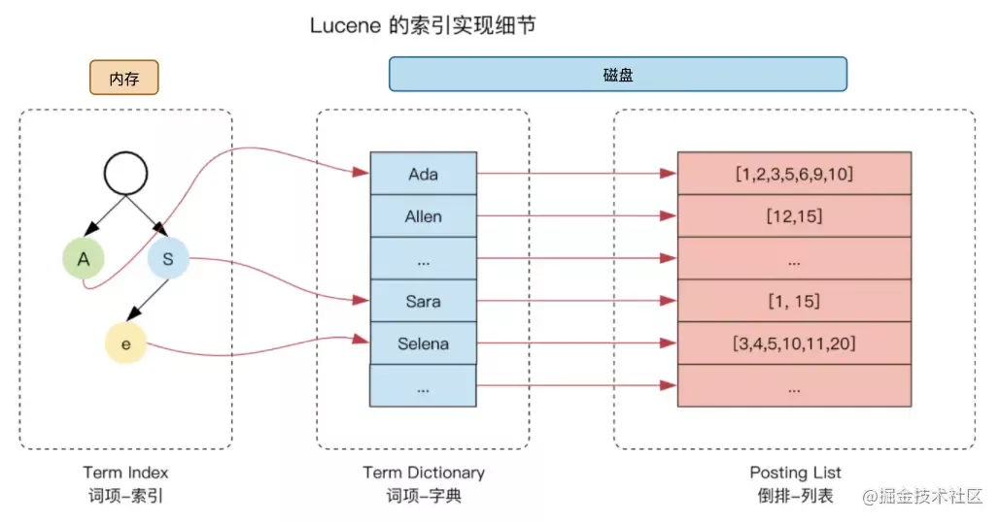
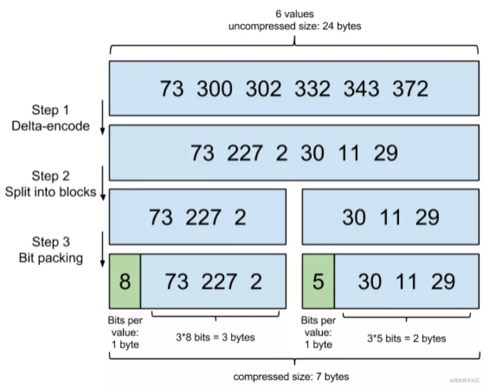
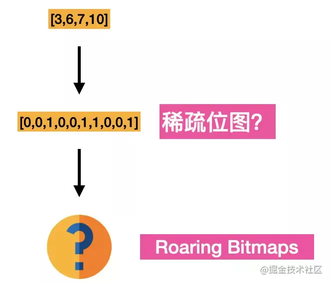
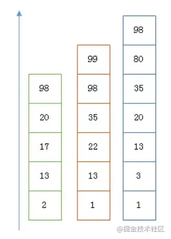

# Elasticsearch如何做到快速检索

<!-- START doctoc generated TOC please keep comment here to allow auto update -->
<!-- DON'T EDIT THIS SECTION, INSTEAD RE-RUN doctoc TO UPDATE -->

- [零、开篇](#%E9%9B%B6%E5%BC%80%E7%AF%87)
- [一、关于搜索](#%E4%B8%80%E5%85%B3%E4%BA%8E%E6%90%9C%E7%B4%A2)
- [二、倒排索引](#%E4%BA%8C%E5%80%92%E6%8E%92%E7%B4%A2%E5%BC%95)
    - [1. 几个概念](#1-%E5%87%A0%E4%B8%AA%E6%A6%82%E5%BF%B5)
    - [2. 索引内部结构](#2-%E7%B4%A2%E5%BC%95%E5%86%85%E9%83%A8%E7%BB%93%E6%9E%84)
- [三、关于 postings list 的一些巧技](#%E4%B8%89%E5%85%B3%E4%BA%8E-postings-list-%E7%9A%84%E4%B8%80%E4%BA%9B%E5%B7%A7%E6%8A%80)
    - [1. 压缩](#1-%E5%8E%8B%E7%BC%A9)
    - [2. 联合查询](#2-%E8%81%94%E5%90%88%E6%9F%A5%E8%AF%A2)
- [五、总结](#%E4%BA%94%E6%80%BB%E7%BB%93)

<!-- END doctoc generated TOC please keep comment here to allow auto update -->

[TOC]

## 零、开篇

本文不会关注 ES 里面的分布式技术、相关 API 的使用，而是专注分享下 **”ES 如何快速检索“** 这个主题上面。

本文大致包括以下内容：

- 关于搜索
- 传统关系型数据库和 ES 的差别
- 搜索引擎原理
- 细究倒排索引
- 倒排索引具体是个什么样子的（posting list -> term dic -> term index）
- 关于 postings list 的一些巧技 （FOR、Roaring Bitmaps）
- 如何快速做联合查询？

## 一、关于搜索

先设想一个关于搜索的场景，假设我们要搜索一首诗句内容中带“前”字的古诗，


用 传统关系型数据库和 ES 实现会有什么差别？

如果用像 MySQL 这样的 RDBMS 来存储古诗的话，我们应该会去使用这样的 SQL 去查询

```
select name from poems where content like "%前%";
```

这种我们称为顺序扫描法，需要遍历所有的记录进行匹配。

不但效率低，而且不符合我们搜索时的期望，比如我们在搜索“ABCD"这样的关键词时，通常还希望看到"A","AB","CD",“ABC”的搜索结果。

于是乎就有了专业的搜索引擎，比如我们今天的主角 -- ES。

**搜索引擎原理**

搜索引擎的搜索原理简单概括的话可以分为这么几步，



- 内容爬取，停顿词过滤，比如一些无用的像"的"，“了”之类的语气词/连接词
- 内容分词，提取关键词
- 根据关键词建立**倒排索引**
- 用户输入关键词进行搜索

这里我们就引出了一个概念，也是我们今天的要剖析的重点 - **倒排索引**。也是 ES 的核心知识点。

如果你了解 ES 应该知道，ES 可以说是对 Lucene 的一个封装，里面关于倒排索引的实现就是通过 lucene 这个 jar 包提供的 API 实现的，所以下面讲的关于倒排索引的内容实际上都是 lucene 里面的内容。

## 二、倒排索引

首先我们还不能忘了我们之前提的搜索需求，先看下建立倒排索引之后，我们上述的查询需求会变成什么样子：



这样我们一输入“前”，借助倒排索引就可以直接定位到符合查询条件的古诗。

当然这只是一个很大白话的形式来描述倒排索引的简要工作原理。在 ES  中，这个倒排索引是具体是个什么样的，怎么存储的等等，这些才是倒排索引的精华内容。

### 1. 几个概念

在进入下文之前，先描述几个前置概念。

**term**

关键词这个东西是我自己的讲法，在 ES 中，关键词被称为 **term**。

**postings list**

还是用上面的例子，`{静夜思, 望庐山瀑布}`是 "前" 这个 term 所对应列表。在 ES 中，这些被描述为所有包含特定 term 文档的 id 的集合。由于整型数字 integer 可以被高效压缩的特质，integer 是最适合放在 postings list 作为文档的唯一标识的，ES 会对这些存入的文档进行处理，转化成一个唯一的整型 id。

再说下这个 id 的范围，在存储数据的时候，在每一个 shard 里面，ES 会将数据存入不同的 segment，这是一个比 shard 更小的分片单位，这些 segment 会定期合并。在每一个 segment 里面都会保存最多 2^31 个文档，每个文档被分配一个唯一的 id，从`0`到`(2^31)-1`。


相关的名词都是 ES 官方文档给的描述，后面参考材料中都可以找到出处。

### 2. 索引内部结构

上面所描述的倒排索引，仅仅是一个很粗糙的模型。真的要在实际生产中使用，当然还差的很远。

在实际生产场景中，比如 ES 最常用的日志分析，日志内容进行分词之后，可以得到多少的 term？

那么如何快速的在海量 term 中查询到对应的 term 呢？遍历一遍显然是不现实的。

**term dictionary**

于是乎就有了 **term dictionary**，ES 为了能快速查找到 term，将所有的 term 排了一个序，二分法查找。是不是感觉有点眼熟，这不就是 MySQL 的索引方式的，直接用 B+树建立索引词典指向被索引的数据。

**term index**

但是问题又来了，你觉得 Term Dictionary 应该放在哪里？肯定是放在内存里面吧？磁盘 io 那么慢。就像 MySQL 索引就是存在内存里面了。

但是如果把整个 term dictionary 放在内存里面会有什么后果呢？

**内存爆了...**

别忘了，ES 默认可是会对全部 text 字段进行索引，必然会消耗巨大的内存，为此 ES 针对索引进行了深度的优化。在保证执行效率的同时，尽量缩减内存空间的占用。

于是乎就有了 **term index**。

Term index 从数据结构上分类算是一个“Trie 树”，也就是我们常说的字典树。这是一种专门处理字符串匹配的数据结构，用来解决在一组字符串集合中快速查找某个字符串的问题。

这棵树不会包含所有的 term，它包含的是 term 的一些前缀（这也是字典树的使用场景，公共前缀）。通过 term index 可以快速地定位到 term dictionary 的某个 offset，然后从这个位置再往后顺序查找。就像右边这个图所表示的。（怎么样，像不像我们查英文字典，我们定位 S 开头的第一个单词，或者定位到 Sh 开头的第一个单词，然后再往后顺序查询）

lucene 在这里还做了两点优化，一是 term dictionary 在磁盘上面是分 block 保存的，一个 block 内部利用**公共前缀压缩**，比如都是 Ab 开头的单词就可以把 Ab 省去。二是 term index 在内存中是以 FST（finite state transducers）的数据结构保存的。

FST 有两个优点：

空间占用小。 通过对词典中单词前缀和后缀的重复利用，压缩了存储空间

查询速度快。 O(len(str)) 的查询时间复杂度。

FST 的理论比较复杂，本文不细讲

延伸阅读：https://www.shenyanchao.cn/blog/2018/12/04/lucene-fst/

OK，现在我们能得到 lucene 倒排索引大致是个什么样子的了。



## 三、关于 postings list 的一些巧技

在实际使用中，postings list 还需要解决几个痛点，

- postings list 如果不进行压缩，会非常占用磁盘空间，
- 联合查询下，如何快速求交并集（intersections and unions）

对于如何压缩，可能会有人觉得没有必要，”posting list 不是已经只存储文档 id 了吗？还需要压缩？”，但是如果在 posting list 有百万个 doc id 的情况，压缩就显得很有必要了。（比如按照朝代查询古诗？），至于为啥需要求交并集，ES 是专门用来搜索的，肯定会有很多联合查询的需求吧 （AND、OR）。

按照上面的思路，我们先将如何压缩。

### 1. 压缩

**Frame of Reference**

在 lucene 中，要求 postings lists 都要是有序的整形数组。这样就带来了一个很好的好处，可以通过 增量编码（delta-encode）这种方式进行压缩。

比如现在有 id 列表 `[73, 300, 302, 332, 343, 372]`，转化成每一个 id 相对于前一个 id 的增量值（第一个 id 的前一个 id 默认是 0，增量就是它自己）列表是`[73, 227, 2, 30, 11, 29]`。**在这个新的列表里面，所有的 id 都是小于 255 的，所以每个 id 只需要一个字节存储**。

实际上 ES 会做的更加精细：



它会把所有的文档分成很多个 block，每个 block 正好包含 256 个文档，然后单独对每个文档进行增量编码，计算出存储这个 block 里面所有文档最多需要多少位来保存每个 id，并且把这个位数作为头信息（header）放在每个 block 的前面。这个技术叫 **Frame of Reference**。

上图也是来自于 ES 官方博客中的一个示例（假设每个 block 只有 3 个文件而不是 256）。

FOR 的步骤可以总结为：


进过最后的位压缩之后，整型数组的类型从固定大小 (8,16,32,64 位)4 种类型,扩展到了[1-64] 位共 64 种类型。

通过以上的方式可以极大的节省 posting list 的空间消耗，提高查询性能。不过 ES 为了提高 filter 过滤器查询的性能，还做了更多的工作，那就是**缓存**。

**Roaring Bitmaps (for filter cache)**

在 ES 中，可以使用 filters 来优化查询，filter 查询只处理文档是否匹配与否，不涉及文档评分操作，查询的结果可以被缓存。

对于 filter 查询，es 提供了 filter cache 这种特殊的缓存，filter cache 用来存储 filters 得到的结果集。缓存 filters 不需要太多的内存，它只保留一种信息，即哪些文档与 filter 相匹配。同时它可以由其它的查询复用，极大地提升了查询的性能。

我们上面提到的 Frame Of Reference 压缩算法对于 postings list 来说效果很好，但对于需要存储在内存中的 filter cache 等不太合适。

filter cache 会存储那些经常使用的数据，针对 filter 的缓存就是为了加速处理效率，对压缩算法要求更高。

对于这类 postings list，ES 采用不一样的压缩方式。那么让我们一步步来。

首先我们知道 postings list 是 Integer 数组，具有压缩空间。

假设有这么一个数组，我们第一个压缩的思路是什么？用位的方式来表示，每个文档对应其中的一位，也就是我们常说的位图，bitmap。

它经常被作为索引用在数据库、查询引擎和搜索引擎中，并且位操作（如 and 求交集、or 求并集）之间可以并行，效率更好。



但是，位图有个很明显的缺点，不管业务中实际的元素基数有多少，它占用的内存空间都恒定不变。也就是说不适用于稀疏存储。业内对于稀疏位图也有很多成熟的压缩方案，lucene 采用的就是**roaring bitmaps**。

我这里用简单的方式描述一下这个压缩过程是怎么样：


将 doc id 拆成高 16 位，低 16 位。对高位进行聚合 (以高位做 key，value 为有相同高位的所有低位数组)，根据低位的数据量 (不同高位聚合出的低位数组长度不相同)，使用不同的 container(数据结构) 存储。

- len<4096 ArrayContainer 直接存值
- len>=4096 BitmapContainer 使用 bitmap 存储

分界线的来源：value 的最大总数是为`2^16=65536`. 假设以 bitmap 方式存储需要 `65536bit=8kb`,而直接存值的方式，一个值 2 byte，4K 个总共需要`2byte*4K=8kb`。所以当 value 总量 <4k 时,使用直接存值的方式更节省空间。

空间压缩主要体现在:

- 高位聚合 (假设数据中有 100w 个高位相同的值,原先需要 100w*2byte,现在只要 1*2byte)
- 低位压缩

缺点就在于位操作的速度相对于原生的 bitmap 会有影响。

这就是 trade-off 呀。平衡的艺术。

### 2. 联合查询

讲完了压缩，我们再来讲讲联合查询。

先讲简单的，如果查询有 filter cache，那就是直接拿 filter cache 来做计算，也就是说位图来做 AND 或者 OR 的计算。

如果查询的 filter 没有缓存，那么就用 skip list 的方式去遍历磁盘上的 postings list。



以上是三个 posting list。我们现在需要把它们用 AND 的关系合并，得出 posting list 的交集。首先选择最短的 posting list，逐个在另外两个 posting list 中查找看是否存在，最后得到交集的结果。遍历的过程可以跳过一些元素，比如我们遍历到绿色的 13 的时候，就可以跳过蓝色的 3 了，因为 3 比 13 要小。

用 skip list 还会带来一个好处，还记得前面说的吗，postings list 在磁盘里面是采用 FOR 的编码方式存储的

会把所有的文档分成很多个 block，每个 block 正好包含 256 个文档，然后单独对每个文档进行增量编码，计算出存储这个 block 里面所有文档最多需要多少位来保存每个 id，并且把这个位数作为头信息（header）放在每个 block 的前面。

因为这个 FOR 的编码是有解压缩成本的。利用 skip list，**除了跳过了遍历的成本，也跳过了解压缩这些压缩过的 block 的过程，从而节省了 cpu**。

## 五、总结

下面我们来做一个技术总结（感觉有点王刚老师的味道😂）

- 为了能够快速定位到目标文档，ES 使用倒排索引技术来优化搜索速度，虽然空间消耗比较大，但是搜索性能提高十分显著。
- 为了能够在数量巨大的 terms 中快速定位到某一个 term，同时节约对内存的使用和减少磁盘 io 的读取，lucene 使用 "term index -> term dictionary -> postings list" 的倒排索引结构，通过 **FST** 压缩放入内存，进一步提高搜索效率。
- 为了减少  postings list 的磁盘消耗，lucene 使用了 **FOR**（Frame of Reference）技术压缩，带来的压缩效果十分明显。
- ES 的 filter 语句采用了 **Roaring Bitmap** 技术来缓存搜索结果，保证高频 filter 查询速度的同时降低存储空间消耗。
- 在联合查询时，在有 filter cache 的情况下，会直接利用位图的原生特性快速求交并集得到联合查询结果，否则使用 **skip list** 对多个 postings list 求交并集，跳过遍历成本并且节省部分数据的解压缩 cpu 成本

**Elasticsearch 的索引思路**

将磁盘里的东西尽量搬进内存，减少磁盘随机读取次数 (同时也利用磁盘顺序读特性)，结合各种压缩算法，用及其苛刻的态度使用内存。

所以，对于使用 Elasticsearch 进行索引时需要注意:

- 不需要索引的字段，一定要明确定义出来，因为默认是自动建索引的
- 同样的道理，对于 String 类型的字段，不需要 analysis 的也需要明确定义出来，因为默认也是会 analysis 的
- 选择有规律的 ID 很重要，随机性太大的 ID(比如 Java 的 UUID) 不利于查询

最后说一下，技术选型永远伴随着业务场景的考量，**每种数据库都有自己要解决的问题（或者说擅长的领域），对应的就有自己的数据结构，而不同的使用场景和数据结构，需要用不同的索引，才能起到最大化加快查询的目的。**

这篇文章讲的虽是 Lucene 如何实现倒排索引，如何精打细算每一块内存、磁盘空间、如何用诡谲的位运算加快处理速度，但往高处思考，再类比一下 MySQL，你就会发现，虽然都是索引，但是实现起来，截然不同。笼统的来说，b-tree 索引是为写入优化的索引结构。当我们不需要支持快速的更新的时候，可以用预先排序等方式换取更小的存储空间，更快的检索速度等好处，其代价就是更新慢，就像 ES。

