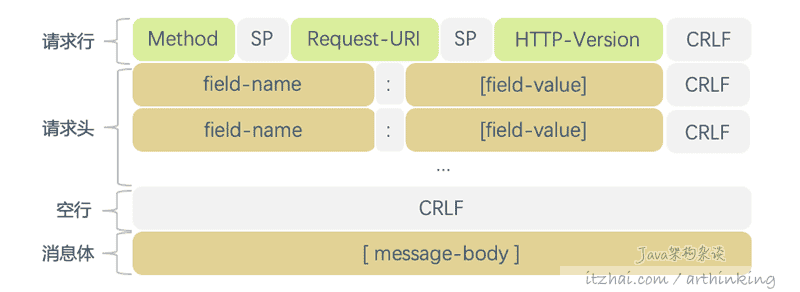

# HTPP/1.1

[TOC]

## HTTP/1.1基本概念

### 1. 可扩展

正是因为HTTP规范中限制很少，告诉你可以做什么，但是不会告诉你各种条条框框不能做什么，所以，很容易扩展，这也是为什么从HTTP/0.9诞生，一直扩展升级，添加更多的特性的原因。

### 2. 传输可靠性

由于底层是基于TCP协议的，所以继承了TCP传输数据的可靠性，主要体现在：

- 数据的顺序传输；

- 丢包重传，保证可靠；
- 连接维护；
- 流量控制，保证稳定；
- 拥塞控制，及时调整，最大程度保证传输正常进行。

### 3. 基于请求应答模式

只有一方先主动发起连接和请求之后，接收方才可以进行响应。HTTP正是基于这种一问一答的请求应答模式。如果客户端不请求，服务端就不会搭理客户端。

虽然后面HTTP/2出现了服务端推送，但是也是针对特定资源的推送，并不是服务端想推送什么就推送什么。

### 4. 无状态

有状态意味着一定会通过某种状态标识为去追踪状态，就像TCP的状态机，TCP请求头有特定的状态标识位来维护连接的状态。

HTTP并没有提供记录状态的地方，也就是说在交互性场景中，HTTP没有记忆能力。这就会导致这样的问题：

同一个用户多次访问一个网站，都需要重复读做身份验证。

**即使开启了keep-alive机制，也只是TCP层面的维持连接，对于HTTP层来说，看起来还是无状态的。**

**我们不能每次都要让用户输入账号密码进行身份验证吧，为此才会出现Cookie和Session，为HTTP弥补了状态存储的问题。**

### 5. 明文传输，不安全

我们通过抓包工具抓HTTP/1.1的包，通过肉眼都可以看到请求头和请求体里面的内容，那么用户登录请求的时候，传输的账号密码以下子就可以捕获到了。

我们知道，数据在网络中请求的链路是很漫长的，只要任何一个环节抓到了你的包，你的数据就泄露了。这也是为什么要推出HTTPS的原因。

### 6. 性能较差(请求-应答)

由于使用请求应答机制，每次都需要传一大段请求头，效率比较差。

另外，HTTP/1.1基于请求-应答模式，在应用层存在队头阻塞问题，并且TCP层同样会存在TCP的队头阻塞问题，导致性能比较差，需要通过各种奇门妙招去优化网络请求。

效率问题正是促使HTTP/2、HTTP/3诞生的原因之一。


## HTTP/1.1报文详解

HTTP是基于TCP的，HTTP作为应用层协议，会在TCP/IP协议栈往下传递的时候，不断封装数据帧，如下图：


上面HTTP正文即是以HTTP报文格式来组织的。

### 1. HTTP报文组成部分

HTTP请求和响应都使用如下通用的格式：


- `start-line`：起始行，起始行可以为以下两者之一：

  - `Request-Line`：请求行，如：

    - ```
      GET /hello-world2.html HTTP/1.1
      ```

  - `Status-Line`：状态行，如：

    - ```
      HTTP/1.1 200 OK
      ```

- `*(message-header CRLF)`：0个或者多个`消息头`；

- `CRLF`：一个空行；

- `[message-body]`：可选的消息体；

可以分别把请求报文和响应报文分开来描述：

**请求报文**



**响应报文**


**可以发现，请求报文和响应报文格式就起始行不一样。**

### 2. 请求行

请求行格式：

```
Request-Line = Method SP Request-URI SP HTTP-Version CRLF
```

#### 1. Method

方法是区分大消息的，以下是常用的方法：

| 方法             | 说明                                             |
| :--------------- | :----------------------------------------------- |
| OPTIONS          | 列出可以对服务器资源执行哪些方法                 |
| GET              | 获取资源                                         |
| HEAD             | 获取资源的首部，与GET类似，但是不会响应消息体    |
| POST             | 向服务器提交数据                                 |
| PUT              | 将请求主体部分存储在服务器上                     |
| DELETE           | 删除资源                                         |
| TRACE            | 对可能经过代理服务器传送到服务器上的报文进行追踪 |
| CONNECT          | 建立连接隧道                                     |
| extension-method | 扩展方法                                         |

另外，服务器还可以实现一些自己的请求方法，这些附加的方法是对HTTP规范的扩展，因此也成为扩展方法。

> extension-method = token


下面逐个方法介绍下：

**GET**

GET方法意味着可以检索 Request-URI标识的任何信息。

如果Request-URI涉及到创建数据，则应该将新建的数据作为响应实体返回。

如果请求消息包含 If-Modified-Since，If-Unmodified-Since，If-Match，If-None_match或If-Range标头字段，则此时的Get为条件GET。通过使用缓存标头，可以尽可能避免不必要的网络传输。

如果请求标头包含Range，则GET方法变为部分GET。

**HEAD**

HEAD方法与GET方法很类似，但是HEAD方法在在响应中只返回首部，不会返回消息体。

这就允许客户端再不用获取实际资源的情况下，对资源首部进行检查。如：

- 检查资源是否有更新：如果获取到的 Content-Length、Content-MD5、ETag、Last-Modified与之前获取到的值不同，那么缓存应该被视为过期；
- 查看响应状态码，查看资源是否存在；
- 获取首部更多信息，判断资源情况。

**POST**

POST方法起初是用来向服务器传输数据的，通常用来提交HTML的表单到服务器。

**PUT**

PUT方法用于向服务器写入资源，如果Request-URI对应的资源已经存在的话，就进行更新。

> 注意：
>
> POST用于向服务器发送数据，PUT用于向服务器上的资源中存储数据。

**DELETE**

请求服务器删除URL所指示的资源，但是客户端无法保证删除操作一定会被执行，除非在响应式服务器打算删除资源或者将其移动到无法访问的位置。可能的响应：

- 如果响应包含描述状态的实体，则响应200（确定）；
- 如果尚未执行删除操作，则响应202（接受）；
- 如果已执行该操作，并且响应不包含任何实体，则响应204（无内容）。

此方法的响应不可缓存。

**TRACE**

一个请求从客户端到服务端，中间可能会经历各种代理、网关等程序，每个中间节点都可能修改原始HTTP请求。为此，通过TRACE，服务端会在接收到请求后反馈一个TRACE响应，并且在响应主体中携带它收到的原始请求报文。客户端拿到TRACE响应，就可以进行测试和诊断了。其中Via标头字段特别有用，它用于充当请求链的跟踪。

可以使用Max-Forwards标头字段限制请求链的长度，这对于测试无限循环中转发消息的代理很有用。

如果请求有效，则响应应该在实体正文中包含整个请求消息，其 Content-Type为"message/http"。对此方法的响应绝对不能缓存。

> TRACE允跨站点跟踪问题，并且可能使黑客可以选择窃取您的cookie信息。基于安全的考虑，一般的服务器会关掉TRACE：
>
> ```markup
> TraceEnable off
> ```
>
> 这样执行TRACE会导致客户端收到一个405不允许使用方法的状态码。

**CONNECT**

CONNECT 方法可以开启一个客户端与所请求资源之间的双向沟通的通道。它可以用来创建隧道（tunnel）。

例如，**`CONNECT`** 可以用来访问采用了 SSL/HTTPS 协议的站点。客户端要求代理服务器将 TCP 连接作为通往目的主机隧道。之后该服务器会代替客户端与目的主机建立连接。连接建立好之后，代理服务器会面向客户端发送或接收 TCP 消息流。

**OPTIONS**

通过该方法，可以请求服务器获取Request-URI对应支持的各种通信选项的信息。最常见的如：询问服务器当前URI支持哪些请求方法。

此方法响应不能缓存。

**方法的安全性与幂等性**

所谓安全性，就是无论方法执行多少次，服务器上的数据都不会被改变。

`安全方法`：GET、HEAD；

`不安全方法`：POST、PUT、DELETE操作则会改动数据。

所谓幂等，就是多次执行一个方法，结果都是相同的。

`幂等方法`：GET、HEAD、PUT、DELETE；

`非幂等方法`：POST。

#### 2. Request-URI

**URL**

URL，Uniform Resource Locator，统一资源定位符，描述了一台特定服务器上某个资源的特定位置，由三部分组成：

- `secheme方案`：指定方位资源所使用的协议类型，如HTTPS；
- `主机与端口`：英特网地址，即域名，这里默认为80端口；
- `路径`：其余部分指定web服务器上的某个资源。

**URI**

URI，Uniform Resource Identifier，统一资源标识符，能够唯一的标识网上的一个资源。

**几乎所有的 URI都是URL。**

#### 3. HTTP-Version

指定了当前请求用到的HTTP协议版本。

#### 4. 消息头

通过传递消息头(首部)，服务器和客户端可以把自己的信息或者是请求响应相关信息进行传递。

可以把首部分为：通用首部，请求首部，响应首部，实体首部，扩展首部。

- **通用首部**

有些首部，不管是请求还是响应都会出现他们的身影，我们把他们归类为通用首部。常见通用首部如下表格所示：

| 首部              | 说明                                                         |
| :---------------- | :----------------------------------------------------------- |
| Cache-Control     | 通过指定指令来实现缓存机制                                   |
| Connection        | **Connection** 头（header） 决定当前的事务完成后，是否会关闭网络连接。如果该值是“keep-alive”，网络连接就是持久的，不会关闭，使得对同一个服务器的请求可以继续在该连接上完成： Connection: keep-alive Connection: close |
| Data              | 提供报文创建的时间                                           |
| MIME-Version      | 提供发送端使用的MIME版本                                     |
| Trailer           | 允许发送方在分块发送的消息后面添加额外的元信息，这些元信息可能是随着消息主体的发送动态生成的，比如消息的完整性校验，消息的数字签名，或者消息经过处理之后的最终状态等。 |
| Transfer-Encoding | 告知接收端报文的编码方式                                     |
| Upgrade           | 允许客户端指定它支持并且希望使用的通信协议，如果服务器认为适合，则切换协议，服务器必须使用101(交换协议)中的Upgrade标头字段响应，以知识正在交换的协议。 |
| Via               | 显示报文经过的中间节点，用来追踪消息转发情况，防止循环请求，以及识别在请求或响应传递链中消息发送者对于协议的支持能力 |
| Warning           | 包含报文当前状态可能存在的问题。在响应中可以出现多个 Warning 首部。一般来说， Warning 首部可以应用于任何类型的报文。然而一部分警告码（warn-code）是为缓存代理服务器定制的，并且只可以应用在响应报文中。 |

- **请求首部**

客户端通过传递请求头字段，将有关请求以及有关客户端本身的其他信息传递给服务器，这些字段充当请求修饰符，其语义等同于编程语言方法调用中的参数。

常见的请求头如下：

**Accept首部**

| 首部            | 说明                             |
| :-------------- | :------------------------------- |
| Accept          | 表明客户端能够接受的媒体类型     |
| Accept-Charset  | 表明客户端能够接受的字符集       |
| Accept-Encoding | 表明客户端能够接受的编码方式     |
| Accept-Language | Section 14.4                     |
| TE              | 表明客户端能够接受的扩展传输编码 |

**条件请求首部**

| 首部                | 说明                                                         |
| :------------------ | :----------------------------------------------------------- |
| Expect              | 指示客户端要求特定的服务器行为 目前规范中只规定了 "100-continue" 这一个期望条件：通知接收方客户端要发送一个体积可能很大的消息体，期望收到状态码为100 (Continue) 的临时回复 |
| If-Match            | 请求首部 **`If-Match`** 的使用表示这是一个条件请求。在请求方法为 GET 和 HEAD 的情况下，服务器仅在请求的资源满足此首部列出的 `ETag`值时才会返回资源。而对于 PUT 或其他非安全方法来说，只有在满足条件的情况下才可以将资源上传。 |
| If-Modified-Since   | **`If-Modified-Since`** 是一个条件式请求首部，服务器只在所请求的资源在给定的日期时间之后对内容进行过修改的情况下才会将资源返回，状态码为 200 。如果请求的资源从那时起未经修改，那么返回一个不带有消息主体的 304 响应，而在 `Last-Modified` 首部中会带有上次修改时间。 不同于 `If-Unmodified-Since`, `If-Modified-Since` 只可以用在GET 或 HEAD 请求中。 |
| If-None-Match       | 对于 `GET` 和 `HEAD` 请求方法来说，当且仅当服务器上没有任何资源的 `ETag` 属性值与这个首部中列出的相匹配的时候，服务器端会才返回所请求的资源，响应码为 `200`。对于其他方法来说，当且仅当最终确认没有已存在的资源的 `ETag` 属性值与这个首部中所列出的相匹配的时候，才会对请求进行相应的处理。 |
| If-Range            | **`If-Range`** HTTP 请求头字段用来使得 **`Range`** 头字段在一定条件下起作用：当字段值中的条件得到满足时，**`Range`** 头字段才会起作用，同时服务器回复`206` 部分内容状态码，以及**`Range`** 头字段请求的相应部分；如果字段值中的条件没有得到满足，服务器将会返回 `200` `OK` 状态码，并返回完整的请求资源。 |
| If-Unmodified-Since | HTTP协议中的 **`If-Unmodified-Since`** 消息头用于请求之中，使得当前请求成为条件式请求：只有当资源在指定的时间之后没有进行过修改的情况下，服务器才会返回请求的资源，或是接受 `POST` 或其他 `non-safe` 方法的请求。如果所请求的资源在指定的时间之后发生了修改，那么会返回`412`(Precondition Failed) 错误。 |
| Range               | The **`Range`** 是一个请求首部，告知服务器返回文件的哪一部分。在一个 `Range` 首部中，可以一次性请求多个部分，服务器会以 multipart 文件的形式将其返回。如果服务器返回的是范围响应，需要使用 ``206 `Partial Content` 状态码。假如所请求的范围不合法，那么服务器会返回`416`Range Not Satisfiable` 状态码，表示客户端错误。服务器允许忽略 `Range` 首部，从而返回整个文件，状态码用 `200`。 |

**安全请求首部**

| 首部          | 说明                                                         |
| :------------ | :----------------------------------------------------------- |
| Authorization | HTTP协议中的 **`Authorization`** 请求消息头含有服务器用于验证用户代理身份的凭证，通常会在服务器返回`401` `Unauthorized` 状态码以及WWW-Authenticate`消息头之后在后续请求中发送此消息头。 |
| Cookie        | **`Cookie`** 是一个请求首部，其中含有先前由服务器通过 `Set-Cookie`首部投放并存储到客户端的 HTTP `cookies`。 |
| Cookie2       | 这个已经被废弃的 **`Cookie2`** 请求首部曾经被用来告知浏览器该用户代理支持“新型” cookies，但是现代的用户代理一般使用 `Cookie` 来替代 Cookie2**。** |

**代理请求首部**

| 首部                | 说明                                                         |
| :------------------ | :----------------------------------------------------------- |
| Max-Forwards        | 在通往源端服务器的路径上，将请求转发给其他代理或者网关的最大次数，与TRACE方法类似。 |
| Proxy-Authorization | **`Proxy-Authorization`** 是一个请求首部，其中包含了用户代理提供给代理服务器的用于身份验证的凭证。这个首部通常是在服务器返回了 `407` `Proxy Authentication Required` 响应状态码及 `Proxy-Authenticate` 首部后发送的。 |
| Proxy-Connection    | 同Connection，不过这个首部是在与代理建立连接时使用。         |

- **响应首部**

| 首部        | 说明                                                         |
| :---------- | :----------------------------------------------------------- |
| Age         | **`Age`** 消息头里包含对象在缓存代理中存贮的时长，以秒为单位。 Age的值通常接近于0。表示此对象刚刚从原始服务器获取不久；其他的值则是表示代理服务器当前的系统时间与此应答中的通用头 `Date` 的值之差。 |
| Retry-After | 在HTTP协议中，响应首部 **`Retry-After`** 表示用户代理需要等待多长时间之后才能继续发送请求。这个首部主要应用于以下两种场景： - 当与 `503` 响应一起发送的时候，表示服务下线的预期时长； - 当与重定向响应一起发送的时候，比如 `301` (Moved Permanently，永久迁移)，表示用户代理在发送重定向请求之前需要等待的最短时间。 |
| Server      | **`Server`** 首部包含了处理请求的源头服务器所用到的软件相关信息。 避免描述的过于详细，因为这有可能泄露服务器内部实现细节，或者被攻击者找到已知安全漏洞。 |
| Title       | 对于HTML文档来说，就是HTML文案定的源端给出的标题。 该首部定义与原始的 HTTP/1.0草案，并未列入RFC2616。 |
| Warning     | **`Warning`** 是一个通用报文首部，包含报文当前状态可能存在的问题。在响应中可以出现多个 Warning 首部。 一般来说， Warning 首部可以应用于任何类型的报文。然而一部分警告码（warn-code）是为缓存代理服务器定制的，并且只可以应用在响应报文中。格式：`Warning: <warn-code> <warn-agent> <warn-text> [<warn-date>]` |

