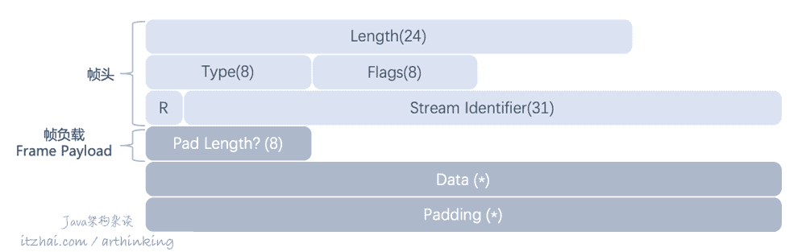
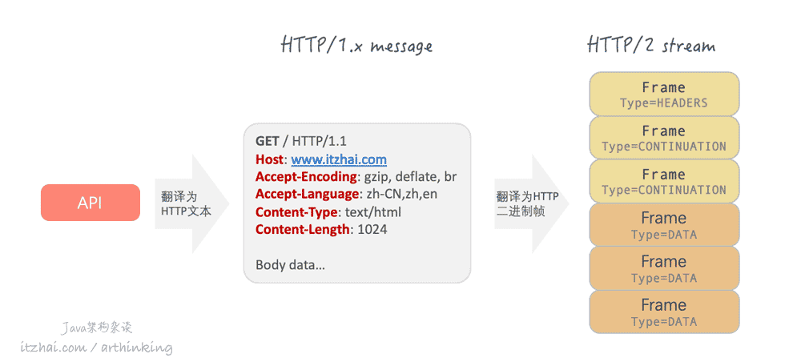
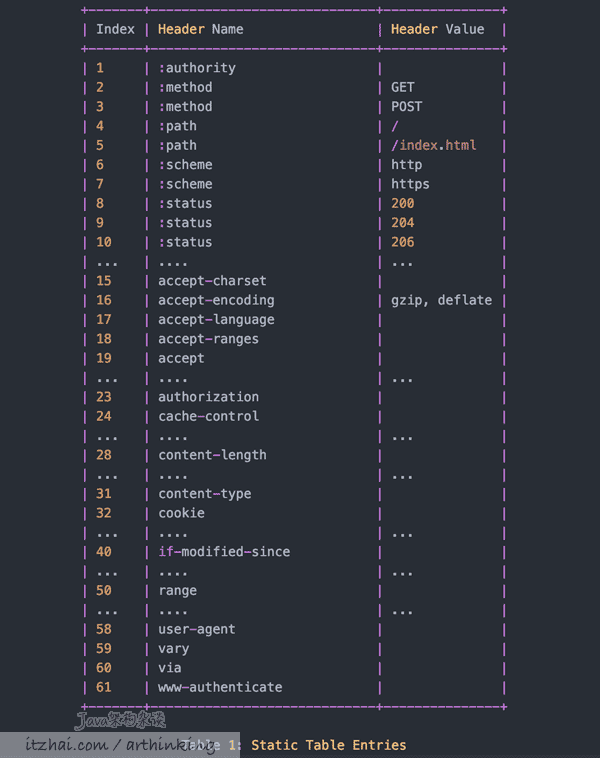
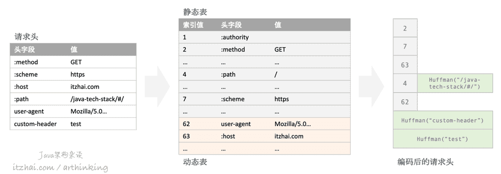
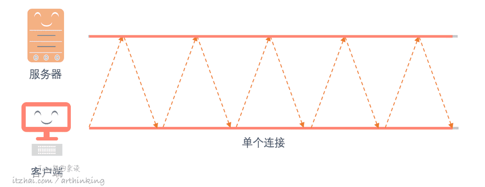
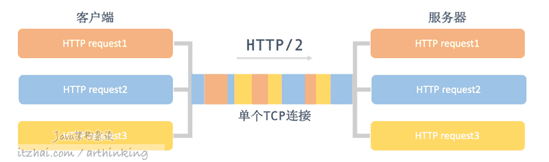
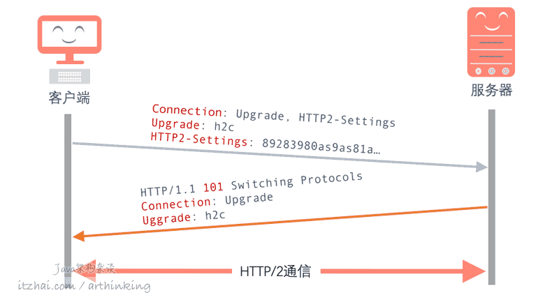
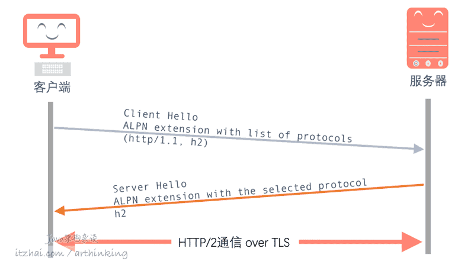
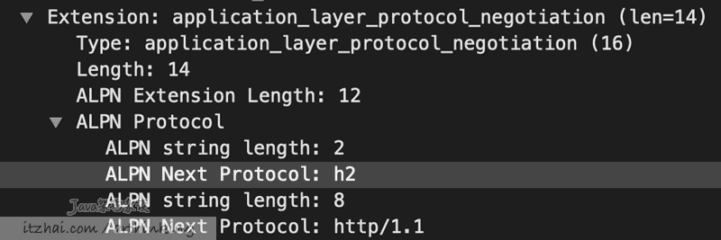

# HTTP/2

<!-- START doctoc generated TOC please keep comment here to allow auto update -->
<!-- DON'T EDIT THIS SECTION, INSTEAD RE-RUN doctoc TO UPDATE -->

- [0. HTTP/1.1的问题](#0-http11%E7%9A%84%E9%97%AE%E9%A2%98)
- [1. 兼容HTTP/1](#1-%E5%85%BC%E5%AE%B9http1)
- [2. 二进制帧](#2-%E4%BA%8C%E8%BF%9B%E5%88%B6%E5%B8%A7)
  - [HTTP/2与HTTP/1.X的格式转换](#http2%E4%B8%8Ehttp1x%E7%9A%84%E6%A0%BC%E5%BC%8F%E8%BD%AC%E6%8D%A2)
- [3. 头信息压缩](#3-%E5%A4%B4%E4%BF%A1%E6%81%AF%E5%8E%8B%E7%BC%A9)
  - [关于起始行](#%E5%85%B3%E4%BA%8E%E8%B5%B7%E5%A7%8B%E8%A1%8C)
  - [HPACK](#hpack)
  - [HPACK头部压缩](#hpack%E5%A4%B4%E9%83%A8%E5%8E%8B%E7%BC%A9)
- [4. 流传输](#4-%E6%B5%81%E4%BC%A0%E8%BE%93)
  - [HTTP/1.1队头阻塞](#http11%E9%98%9F%E5%A4%B4%E9%98%BB%E5%A1%9E)
  - [流传输与连接多路复用](#%E6%B5%81%E4%BC%A0%E8%BE%93%E4%B8%8E%E8%BF%9E%E6%8E%A5%E5%A4%9A%E8%B7%AF%E5%A4%8D%E7%94%A8)
    - [KEEP-ALIVE与HTTP/2连接多路复用](#keep-alive%E4%B8%8Ehttp2%E8%BF%9E%E6%8E%A5%E5%A4%9A%E8%B7%AF%E5%A4%8D%E7%94%A8)
    - [多路复用的好处](#%E5%A4%9A%E8%B7%AF%E5%A4%8D%E7%94%A8%E7%9A%84%E5%A5%BD%E5%A4%84)
    - [流传输问题](#%E6%B5%81%E4%BC%A0%E8%BE%93%E9%97%AE%E9%A2%98)
- [5. 安全升级](#5-%E5%AE%89%E5%85%A8%E5%8D%87%E7%BA%A7)
- [6. ALPN](#6-alpn)
  - [创建H2C连接](#%E5%88%9B%E5%BB%BAh2c%E8%BF%9E%E6%8E%A5)
  - [通过ALPN创建H2连接](#%E9%80%9A%E8%BF%87alpn%E5%88%9B%E5%BB%BAh2%E8%BF%9E%E6%8E%A5)
- [7. 服务器推送](#7-%E6%9C%8D%E5%8A%A1%E5%99%A8%E6%8E%A8%E9%80%81)
  - [服务器推送设置](#%E6%9C%8D%E5%8A%A1%E5%99%A8%E6%8E%A8%E9%80%81%E8%AE%BE%E7%BD%AE)

<!-- END doctoc generated TOC please keep comment here to allow auto update -->


[TOC]

## 0. HTTP/1.1的问题

HTTP/1.1的问题也是很多的，主要是连接缓慢，服务器只能按顺序响应，如果某个请求花了很长时间，就会出现请求队头阻塞，从而影响其他请求。前端针对这些问题的优化小技巧很多，如：域名拆分、资源合并、精灵图、资源预取等。为了从协议上进行优化，Google推出了SPDY协议，最终导致推动了HTTP/2的推出。在2015年，HTTP/2发布了。

有两个具体的实现：

- 基于HTTPS的实现：HTTP/2 over TLS，一般简写为h2；
- 基于HTTP的实现：HTTP/2 over TCP，一般简写为h2c。

虽然基于TLS的实现是其中一个选项，但是主流的浏览器团队开始只支持HTTP/2 over TLS，所以，实际上，我们要用到HTTP/2，都是要基于HTTPS的。TLS必须在V1.2以上。

下面介绍HTTP2的一些特点。


## 1. 兼容HTTP/1

HTTP/1.1应用是很广泛的，想要基于现有的协议，推出新版本，就必须向下兼容，不然除了新项目，没人敢这么贸然升级。

所以，HTTP/2协议也是兼容HTTP/1中的特性的。也就是说一个网站升级到HTTP2，几乎不用作什么改动，因为对网站来说，用到的各种HTTP帧信息的含义都是一样的，但是HTTP2的实现者，如浏览器、服务器中间件等会按照HTTP2的要求来实现请求处理和响应。

**也就是说，对于同样一个支持HTTP/1.1的网站，只要浏览器和服务器都支持HTTP/2，那么HTTP/2就可以启用了。**


## 2. 二进制帧

在HTTP/1.1中，头信息是文本格式的(ASCII码)，body消息可以是文本或者二进制。而HTTP/2则彻底改为了二进制数据，以帧为单位，可以分为头信息帧和数据帧。

采用了二进制后，使得报文具有更高的压缩性，提高传输效率和解析效率，不容易出错，因为可以有效的处理空白、大写、空白链接、行尾等问题。

帧格式如下：



- 帧头，9个字节，包括：
  - Length：帧长度，无符号整数，24bit，表示Frame Payload(帧负载)所占用的字节数；
  - Type：帧类型，8bit，定义帧负载的具体格式，HTTP/2定义了10中帧类型，具体参考下面表格；
  - Flags：帧标志位：8bit，服务于具体的帧类型，默认值0x0；
  - R：帧保留比特，固定值为0x0；
  - Stream Identifier：流标识符，标识该帧属于哪个流；
- 帧负载，Frame Payload，存放帧具体的内容：
  - Pad Length：8bit，标识填充的字节长度，取决于PADDED标识是否被设置；
  - Data：实际的帧数据；
  - Padding：填充内容，为若干个0x0字节，受PADDED标识控制是否显示。

帧有如下类型：

| 帧类型                   | 说明                                                         |
| ------------------------ | ------------------------------------------------------------ |
| DATA (type=0x0)          | HTTP请求体信息                                               |
| HEADERS (type=0x1)       | HTTP请求头                                                   |
| PRIORITY (type=0x2)      | 为流指定建议的优先级，它可以在任何流状态下发送， 包括空闲或关闭的流 |
| RST_STREAM (type=0x3)    | 发送终止流的信号                                             |
| SETTINGS (type=0x4)      | 发送连接的配置参数                                           |
| PUSH_PROMISE (type=0x5)  | 对资源的推送承诺                                             |
| PING (type=0x6)          | 测量往返时间和探测连接状态                                   |
| GOAWAY (type=0x7)        | 通知对等方停止为当前连接创建流                               |
| WINDOW_UPDATE (type=0x8) | 流量控制，分为单独的流和整个连接的控制                       |
| COTINUATION (type=0x9)   | 延续帧，用来延续一个报头区块的碎片序列。一个延续帧后面可以跟随一个或者多个延续帧，最后的一个延续帧会设置 END_HEADERS标志。 |

### HTTP/2与HTTP/1.X的格式转换

如下图，有很多工具可以发起HTTP请求，最终都会翻译为HTTP报文，HTTP/1.x文本格式的报文也可以转换为HTTP/2帧格式的报文：



也就是说，对于应用程序，发送HTTP请求的API还是那些，但是底层的HTTP实现程序会根据协商情况自动转换到HTTP/1.x的报文或者HTTP/2的报文，转换过程是透明的，用户尽管用API就好了。

## 3. 头信息压缩

### 关于起始行

在HTTP/2中废除了起始行，转而使用头字段替换。

我们通过开发者工具，查看HTTP2网站的请求：

```
Request Headers

:authority: www.cnblogs.com
:method: GET
:path: /arthinking/
:scheme: https
```

会发现，最开始多出了几个冒号打头的头字段，这是HTTP/2的伪头字段(Pseudo-Header Fields)，其中：

- `:authority`代表域名；
- `:method`代表请求方法；
- `:path`代表请求路径；
- `:scheme代表请求协议。

**HTTP/1.1中的头部是没有压缩的，造成了不小的带宽浪费。**

在RFC7541中，定义了头部压缩算法，HPACK。下面简单介绍下其工作原理。

### HPACK

简单来说，HPACK算法是这样的：

- 在服务器和客户端之间维护一份相同的静态表，包含常见的头字段名称，以及头字段名称和常见值的组合；
- 在服务器和客户端之间维护一份相同的动态表，在静态表后面，结构相同，每次通信之后，不断添加新的头字段内容到动态表里面，这样请求越多，动态表就越完善了；
- 每个头字段在表中头中都约定一个索引号，那么发送的时候，只需要发送这个索引号就可以了，极大的节省了传输空间。

常见的静态表头字段：



### HPACK头部压缩

如下图，确定请求字段之后，会到静态表和动态表里面查询，如果表里面存在该头信息，则会选取索引编号进行传递，其他的不存在的内容则进行哈夫曼编码传递。



在本轮通信完成之后，新的头字段会根据索引控制规则选择性的追加到服务器和客户端的动态表中。

**静态表和动态表中的内容越多，就可以用越多的索引替代请求头，针对网站中有大量的重复首部的情况，如cookie信息等，极大的提高了速度。**

## 4. 流传输

### HTTP/1.1队头阻塞

先来说下HTTP/1.1中的队头阻塞。

前面我们提到，HTTP是基于请求应答模型的，在非管道传输的情况下，只要请求的应答还没有收到，同一个TCP连接的下一个请求就会被阻塞住，发不出去。如果要能够同时发，就不得不同时创建多个TCP连接了：



这也就是我们所说的HTTP/1.1中的队头阻塞。

### 流传输与连接多路复用

在HTTP/2中，由于是基于帧的发送，于是取消了这个针对单个请求的阻塞行为，而是可以在一个连接中，同时传递多个请求的数据，**每个请求对应的所有数据报组成一个数据流，每个数据流都有一个独一无二的编号**，帧中的`Stream Identifier`就是流ID表示。流与流之间是并行发送的，乱序的，而在流内发送和接收是顺序的。如下图所示：



这样**通过连接复用就支持多个请求同时发送了，避免了HTTP/1.1的请求队头阻塞。**

另外，HTTP/2中规定，**客户端发出的数据流，ID为奇数，服务器发出的流，ID为偶数。**

如果数据发送到一半，客户端或者服务器不想接收了，**可以发送一个`RST_STREAM`帧来取消这个数据流，而不用关闭TCP连接**。

另外，可以给流指定优先级，优先级越高的流，越快得到服务器的响应。

#### KEEP-ALIVE与HTTP/2连接多路复用

由于HTTP/2支持这种连接复用，也就不需要keep-alive了，HTTP/1.1的管道化keep-alive机制，相当于单线程，而HTTP/2的连接复用，则相当于多线程。

#### 多路复用的好处

由于HTTP/2引入了多路复用，优化了一些HTTP/1.1的问题：

- 请求管道化；
- 解决了HTTP/1.1请求队头阻塞问题；
- 复用TCP连接，减少了连接开销。

#### 流传输问题

HTTP/2通过请求多路复用解决了应用程序层的队头阻塞，但队头阻塞问题仍然存在于传输层。因为底层还是通过TCP进行传输的，所以TCP层有什么问题，那么流传输也就会有对应问题了。

假设有一个响应体的某些包丢失了，那么应用程序就会一直等待接收该响应中丢失的包，服务器也会尝试重传，那么后续的服务端响应可能就被这个丢包问题给阻塞了。

## 5. 安全升级

HTTP/2最初被设计为仅可以通过加密协议进行传输，但是遭到反对之后，修订版中除了加密传输之外，还可以选择纯文本版本。

前面我们提到，HTTP/2有两个具体的实现：

- 基于HTTPS的实现：HTTP/2 over TLS，一般简写为h2；
- 基于HTTP的实现：HTTP/2 over TCP，一般简写为h2c。

虽然基于TLS的实现是其中一个选项，但是主流的浏览器团队开始只支持HTTP/2 over TLS，所以，实际上，我们要用到HTTP/2，都是要基于HTTPS的。

这样，我们用上了h2之后，就避免了明文传输的各种安全问题，如：数据报被截获、中间人攻击等，尽可能的保证了我们网站的安全。

并且HTTPS要求TLS必须在V1.2以上，这也就避免了过时的加密套件导致的安全漏洞问题。

## 6. ALPN

Application-Layer Protocol Negotiation (**ALPN**)是TLS的扩展，它允许应用程序协商在安全连接上执行的协议，以避免额外的往返行程。

### 创建H2C连接

首先我们还是先看看没有用到TLS的h2c的连接创建过程。

h2c连接由于没有加密，因此可以直接使用Upgrade请求头来协商连接的升级。



当客户端发起HTTP请求的时候，并不知道下一站是否支持HTTP/2，于是会在请求头包含`Upgrade:h2c`标识自己是支持HTTP/2的，同时通过`HTTP2-Settings`头发送Base64编码的SETTINGS帧信息。

由于升级只应该用于直接连接，所以发送HTTP2-Settings的客户端必须将`HTTP2-Settings`作为连接选项包含在`Connection`请求头中，防止被中间代理进行转发给下一跳了。

接收端收到后，如果发现自己也支持，就会协商一起使用HTTP/2了，然后返回`101`切换协议的状态码，接下来就可以发送HTTP/2帧了。

### 通过ALPN创建H2连接

h2是基于TLS的，为此，需要用到ALPN来协商升级。



在客户端发送的Client Hello请求中，会携带一个ALPN扩展信息，里面列出了客户端支持的协议，通过Wireshark抓包可以观察到如下内容：



服务端回复Server Hello的时候，会携带一个ALPN扩展信息，指明最终选择的协议。如果回复的是h2，则表示最终协商使用了HTTP/2协议，后续开始使用HTTP/2进行通信。

## 7. 服务器推送

HTTP/1中，支持服务器将资源推送到服务器，而无需服务器的请求。客户端可以选择是否接收服务端推送的数据。

**通过服务器推送，消除了对内联资源的优化需求。但是服务器推送不能替代WebSocket技术。**

举个例子，假设客户端请求的一个index.html页面中同时包含了其他的图片和样式资源：

```
<html>
<head><link rel="stylesheet" href="style.css" /></head>
<body></body>
</html>
```

如果是HTTP/1.1需要发送三个请求：

- GET /index.html HTTP/1.1
- GET /style.css HTTP/1.1
- GET /itzhai-logo.png HTTP/1.1

在HTTP/1.1中，为了减少这种情况，于是对资源进行内联：

- css样式内嵌到HTML文档中；
- 图片通过base64编码直接放到HTML中。

而在HTTP/2中，服务器则可以在接收到客户端的index.html页面请求后，把index.html、style.css、itzhai-logo.png一次性发送给浏览器。

### 服务器推送设置

为了实现服务器推送，可以在服务器中进行相应的配置，比如我们用的是Nginx服务器，那么可以通过http2_push命令进行配置：

```
server {
    listen 443 ssl http2;
    ···//省略
    location / {
        ···//省略
        http2_push /style.css；
        http2_push /itzhai-logo.png;
    }
}
```

