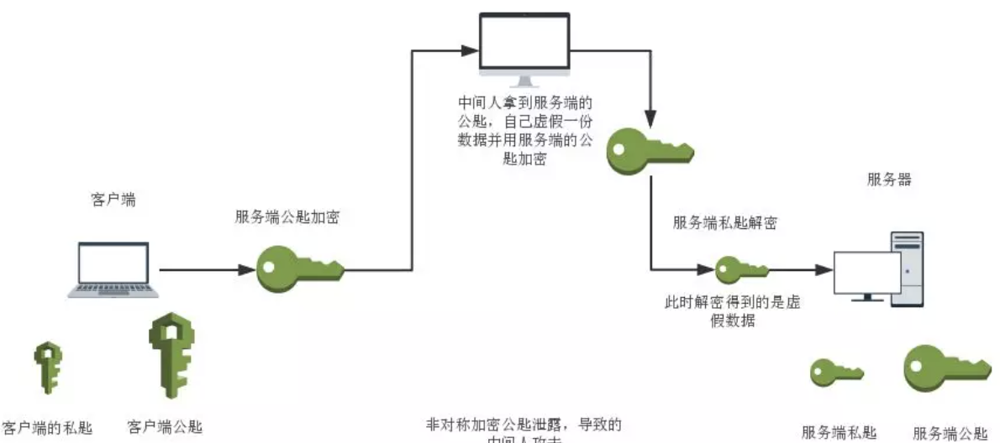
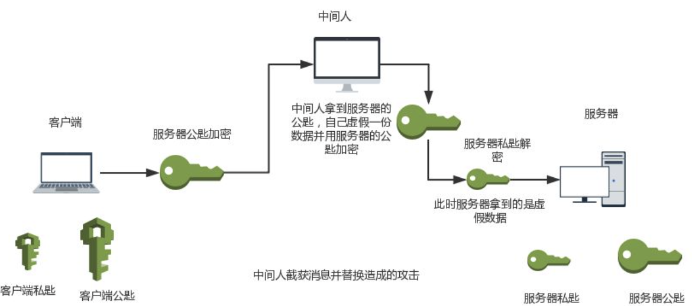
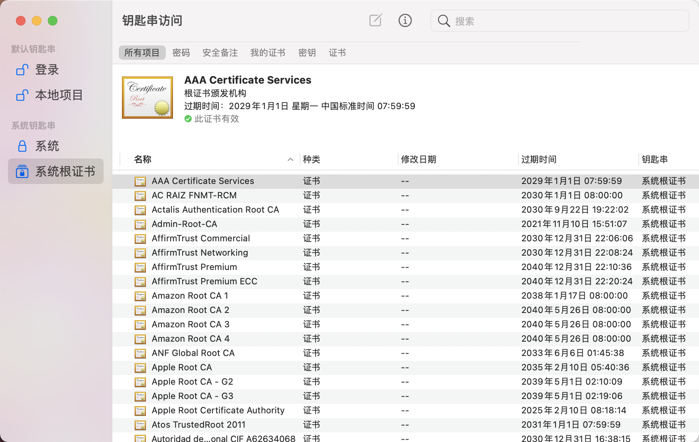
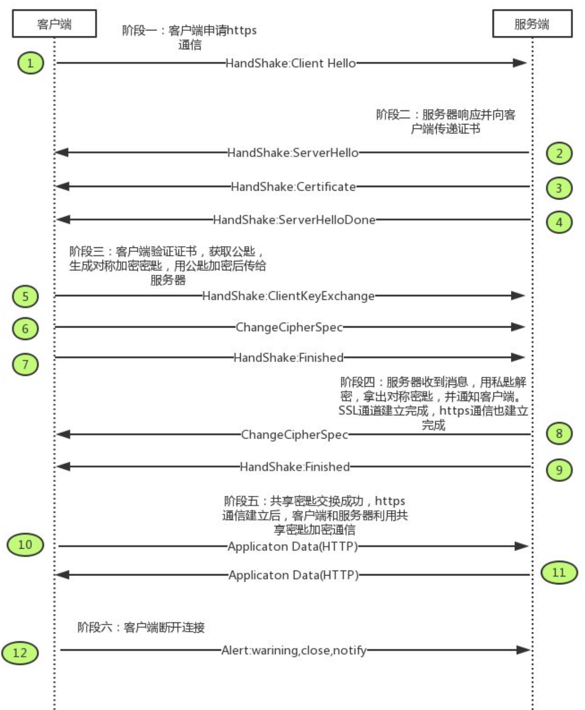

# HTTP 知识点

目录
+ [https](#https)
  - [为什么需要https](#为什么需要https)
  - [https基本概念](#https基本概念)
  - [https原理](#https原理)
  - [https的使用](#https的使用)
  - [Nginx支持HTTPS](#Nginx支持HTTPS)

## https
HTTPS（全称：Hypertext Transfer Protocol Secure，超文本传输安全协议），是以**安全为目标**的HTTP通道，简单讲是HTTP的安全版。


### 为什么需要https
使用https的原因其实很简单，就是因为http的不安全。  
当往服务器发送比较隐私的数据（比如说你的银行卡，身份证）时，如果使用http进行通信，那么安全性将得不到保障。  
首先数据在传输的过程中，数据可能被中间人抓包拿到，那么数据就会被中间人窃取。  
其次数据被中间人拿到后，中间人可能对数据进行修改或者替换，然后发往服务器。  
最后服务器收到数据后，也无法确定数据有没有被修改或替换。

总结下来，http存在三个弊端：
- 无法保证消息的保密性；
- 无法保证消息的完整性和准确性；
- 无法保证消息来源的可靠性。

### https基本概念
为了解决http中存在的问题，https采用了一些加解密，数字证书，数字签名的技术来实现。

#### 对称加密与非对称加密
为了保证消息的保密性，就需要用到加密和解密。**加解密算法目前主流的分为对称加密和非对称加密**。

1. 对称加密（共享密匙加密）：**客户端和服务器共用一个密匙用来对消息加解密，这种方式称为对称加密**。客户端和服务器约定好一个加密的密匙。客户端在发消息前用该密匙对消息加密，发送给服务器后，服务器再用该密匙进行解密拿到消息。  
  

对称加密的优点：
- 对称加密解决了http中消息保密性的问题

对称加密的缺点：
- 对称加密虽然保证了消息保密性，但是因为客户端和服务器共享一个密匙，这样就使得密匙特别容易泄露；
- 因为密匙泄露风险较高，所以很难保证消息来源的可靠性、消息的完整性和准确性。


2. 非对称加密（公有密匙加密）：**客户端和服务端均拥有一个公有密匙和一个私有密匙；公有密匙可以对外暴露，而私有密匙只有自己可见。**

使用公有密匙加密的消息，只有对应的私有密匙才能解开。反过来，使用私有密匙加密的消息，只有公有密匙才能解开。这样客户端在发送消息前，先用服务器的公匙对消息进行加密，服务器收到后再用自己的私匙进行解密。

非对称加密的优点：
- 非对称加密采用公有密匙和私有密匙的方式，解决了http中消息保密性问题，而且使得私有密匙泄露的风险降低；
- 因为公匙加密的消息只有对应的私匙才能解开，所以较大程度上保证了消息的来源性以及消息的准确性和完整性。

非对称加密的缺点：
- 非对称加密时需要使用到接收方的公匙对消息进行加密，但是公匙不是保密的，任何人都可以拿到，中间人也可以。那么中间人可以做两件事，第一件是中间人可以在客户端与服务器交换公匙的时候，将客户端的公匙替换成自己的，这样服务器拿到的公匙将不是客户端的，而是中间人的，服务器也无法判断公匙来源的正确性。第二件是中间人可以不替换公匙，但是他可以截获客户端发来的消息，然后篡改，再用服务器的公匙加密再发往服务器，服务器将收到错误的消息；  
  
  

- 非对称加密的性能相对对称加密来说会慢上几倍甚至几百倍，比较消耗系统资源。

#### 数字证书与数字签名
为了解决非对称加密中公匙来源的不安全性。我们可以使用数字证书和数字签名来解决。

**数字证书的申请**  
在现实中，有一些专门的权威机构用来颁发数字证书，这些机构称为认证中心（CA Certificate Authority）。

过程大致如下：
1. 自己本地先生成一对密匙，然后拿着自己的公匙以及其他信息（比如说企业名称啊什么的）去CA申请数字证书；
2. CA在拿到这些信息后，会选择一种单向Hash算法（比如说常见的MD5）对这些信息进行加密，加密之后的东西我们称之为摘要；
3. 单向Hash算法有一种特点就是单向不可逆的，只要原始内容有一点变化，加密后的数据都将会是千差万别（当然也有很小可能性会重复，可以了解一下鸽巢原理），这样就防止了信息被篡改；
4. 生成摘要后还不算完，CA还会用自己的私匙对摘要进行加密，摘要加密后的数据我们称之为数字签名；
5. 最后，CA将会把我们的申请信息（包含服务器的公匙）和数字签名整合在一起，由此而生成数字证书，然后CA将数字证书传递给我们。

**数字证书怎么起作用**  
服务器在获取到数字证书后，服务器会将数字证书发送给客户端，客户端就需要用CA的公匙解密数字证书并验证数字证书的合法性。  
那我们如何能拿到CA的公匙呢？我们的电脑和浏览器中已经内置了一部分权威机构的根证书，这些根证书中包含了CA的公匙。  


之所以是根证书，是因为现实生活中，认证中心是分层级的，也就是说有顶级认证中心，也有下面的各个子级的认证中心，是一个树状结构，计算机中内置的是最顶级机构的根证书，而且根证书的公匙在子级也是适用的。

客户端用CA的公匙解密数字证书，如果解密成功则说明证书来源于合法的认证机构。解密成功后，客户端就拿到了摘要。

此时，客户端会按照和CA一样的Hash算法将申请信息生成一份摘要，并和解密出来的那份做对比，如果相同则说明内容完整，没有被篡改。最后，客户端安全的从证书中拿到服务器的公匙就可以和服务器进行安全的非对称加密通信了。服务器想获得客户端的公匙也可以通过相同方式。

### https原理
https没有采用单一的技术去实现，而是根据他们的特点，充分的将这些技术整合进去，以达到性能与安全最大化。这套整合的技术我们称之为**SSL（Secure Scoket Layer 安全套接层）**。所以https并非是一项新的协议，它只是在http上披了一层加密的外壳。

https的建立：  


这里把https建立到断开分为6个阶段，12过程，以下对过程一一解释：
1. **客户端通过发送Client Hello报文开始SSL通信**。报文中包含客户端支持的SSL的指定版本、加密组件（Cipher Suite）列表（所使用的加密算法及密匙长度等）；
2. **服务器可进行SSL通信时，会以Server Hello报文作为应答**。和客户端一样，在报文中包含SSL版本以及加密组件；服务器的加密组件内容是从接收到的客户端加密组件内筛选出来的；
3. **服务器发送证书报文**。报文中包含公开密匙证书；
4. **最后服务器发送Server Hello Done报文通知客户端**。最初阶段的SSL握手协商部分结束；
5. SSL第一次握手结束之后，**客户端以Client Key Exchange报文作为回应**。报文包含通信加密中使用的一种被称为Pre-master secret的随机密码串；**该报文已用步骤3中的公开密匙进行加密**；
6. **接着客户端继续发送Change Cipher Spec报文**。该报文会提示服务器，在此报文之后的通信会采用Pre-master secret密匙加密；
7. **客户端发送Finished报文**。该报文包含连接至今的全部报文的整体校验值；这次握手协商是否能够成功，要以服务器是否能够正确解密该报文作为判定标准；
8. **服务器同样发送Change Cipher Spec报文**；
9. **服务器同样发送Finished报文**；
10. **服务器和客户端的Finished报文交换完毕之后，SSL连接就算建立完成**。当然，通信会受到SSL的保护；从此处开始进行应用层协议的通信，即发送HTTP请求；
11. **应用层协议通信，即发送HTTP相应**；
12. **最后由客户端断开连接**。断开连接时，发送close_notify报文；上图做了一些省略，这步之后再发送TCP FIN报文(类似四次挥手？)来关闭与TCP的通信。

另外，在以上流程图中，应用层发送数据时会附加一种叫做**MAC（Message Authentication Code）**的报文摘要。MAC能够查知报文是否遭到篡改，从而保证报文的完整性。

https总的来说就是：**先是利用数字证书保证服务器端的公匙可以安全无误的到达客户端，然后再用非对称加密安全的传递共享密匙，最后用共享密匙安全的交换数据**。

### https的使用
https通信非常安全，但并非所有通信都有必要用到https，使用它时需要考虑以下几个问题：
1. https虽然提供了消息安全传输的通道，但是每次消息的加解密十分耗时，消息系统资源。所以，除非在一些对安全性比较高的场景下，比如银行系统，购物系统中我们必须要使用https进行通信，其他一些对安全性要求不高的场景，我们其实没必要使用https；
2. 使用https需要使用到数字证书，但是一般权威机构颁发的数字证书都是收费的，而且价格也是不菲的，所以对于一些个人网站特别是学生来讲，如果对安全性要求不高，也没必要使用https。

### Nginx支持HTTPS

1. 部署Nginx  
Nginx将采用docker的方式部署  

> 拷贝Nginx默认配置(此步骤可根据需要选择性跳过)  
> 先用docker运行一次Nginx，由于之后我们要把宿主机的Nginx配置文件映射到Docker容器中去，运行一次方便我们拷贝默认配置  
> `docker run -p 80:80 --name nginx \
   -v /mydata/nginx/html:/usr/share/nginx/html \
   -v /mydata/nginx/logs:/var/log/nginx  \
   -d nginx:1.10`  
> 运行成功后将容器中的Nginx配置目录拷贝到宿主机上去  
> `docker container cp nginx:/etc/nginx /mydata/nginx/`  
> 将宿主机上的nginx目录改名为conf，要不然/mydata/nginx/nginx这个配置文件目录看着有点别扭  
> `mv /mydata/nginx/nginx /mydata/nginx/conf`  


使用Docker命令启动Nginx服务，需要映射好配置文件，由于我们要支持HTTPS，还需要开放443端口
```shell script
docker run -p 80:80 -p 443:443 --name mynginx \
-v /mydata/nginx/html:/usr/share/nginx/html \
-v /mydata/nginx/logs:/var/log/nginx  \
-v /mydata/nginx/conf:/etc/nginx \
-d nginx
```

2. 配置支持HTTPS
将生成好的SSL证书和私钥拷贝到Nginx的html/ssl目录下，即示例中的`/mydata/nginx/html/ssl`目录

接下来我们需要给blog.xxx.com这个域名添加HTTPS支持，在/mydata/nginx/conf/conf.d/目录下添加Nginx配置文件blog.conf，配置文件内容如下：
```
server {
    listen       80; # 同时支持HTTP
    listen       443 ssl; # 添加HTTPS支持
    server_name  blog.xxx.com;
  
    #SSL配置
    ssl_certificate      /usr/share/nginx/html/ssl/xxx.crt; # 配置证书
    ssl_certificate_key  /usr/share/nginx/html/ssl/blog_nopass.key; # 配置证书私钥
    ssl_protocols        TLSv1 TLSv1.1 TLSv1.2; # 配置SSL协议版本
    ssl_ciphers          ECDHE-RSA-AES128-GCM-SHA256:HIGH:!aNULL:!MD5:!RC4:!DHE; # 配置SSL加密算法
    ssl_prefer_server_ciphers  on; # 优先采取服务器算法
    ssl_session_cache    shared:SSL:10m; # 配置共享会话缓存大小
    ssl_session_timeout  10m; # 配置会话超时时间

    location / {
        root   /usr/share/nginx/html/www;
        index  index.html index.htm;
    }

    error_page   500 502 503 504  /50x.html;
    location = /50x.html {
        root   /usr/share/nginx/html;
    }
}
```

通过域名可以使用HTTPS访问我们的SpringBoot应用：  
这是一个新的配置文件
```
server {
    listen       80; # 同时支持HTTP
    listen       443 ssl; # 添加HTTPS支持
    server_name  api.macrozheng.com; #修改域名

    #ssl配置
    ssl_certificate      /usr/share/nginx/html/ssl/xxx.crt; # 配置证书
    ssl_certificate_key  /usr/share/nginx/html/ssl/xxx.key; # 配置证书私钥
    ssl_protocols        TLSv1 TLSv1.1 TLSv1.2; # 配置SSL协议版本 # 配置SSL加密算法
    ssl_ciphers          ECDHE-RSA-AES128-GCM-SHA256:HIGH:!aNULL:!MD5:!RC4:!DHE;
    ssl_prefer_server_ciphers  on; # 优先采取服务器算法
    ssl_session_cache    shared:SSL:10m; # 配置共享会话缓存大小
    ssl_session_timeout  10m; # 配置会话超时时间

    location / {
        proxy_pass   http://192.168.3.101:8080; # 设置代理服务访问地址
        proxy_set_header  Host $http_host; # 设置客户端真实的域名（包括端口号）
        proxy_set_header  X-Real-IP  $remote_addr; # 设置客户端真实IP
        proxy_set_header  X-Forwarded-For $proxy_add_x_forwarded_for; # 设置在多层代理时会包含真实客户端及中间每个代理服务器的IP
        proxy_set_header X-Forwarded-Proto $scheme; # 设置客户端真实的协议（http还是https）
        index  index.html index.htm;
    }

    error_page   500 502 503 504  /50x.html;
    location = /50x.html {
        root   /usr/share/nginx/html;
    }
}
```