# 2021虾皮服务端15连问

<!-- START doctoc generated TOC please keep comment here to allow auto update -->
<!-- DON'T EDIT THIS SECTION, INSTEAD RE-RUN doctoc TO UPDATE -->

- [1. 排序链表](#1-%E6%8E%92%E5%BA%8F%E9%93%BE%E8%A1%A8)
- [2. 对称与非对称加密算法的区别](#2-%E5%AF%B9%E7%A7%B0%E4%B8%8E%E9%9D%9E%E5%AF%B9%E7%A7%B0%E5%8A%A0%E5%AF%86%E7%AE%97%E6%B3%95%E7%9A%84%E5%8C%BA%E5%88%AB)
- [3. TCP如何保证可靠性](#3-tcp%E5%A6%82%E4%BD%95%E4%BF%9D%E8%AF%81%E5%8F%AF%E9%9D%A0%E6%80%A7)
- [4. 聊聊五种IO模型](#4-%E8%81%8A%E8%81%8A%E4%BA%94%E7%A7%8Dio%E6%A8%A1%E5%9E%8B)
    - [4.1 阻塞IO 模型](#41-%E9%98%BB%E5%A1%9Eio-%E6%A8%A1%E5%9E%8B)
    - [4.2 非阻塞IO模型](#42-%E9%9D%9E%E9%98%BB%E5%A1%9Eio%E6%A8%A1%E5%9E%8B)
    - [4.3 IO多路复用模型](#43-io%E5%A4%9A%E8%B7%AF%E5%A4%8D%E7%94%A8%E6%A8%A1%E5%9E%8B)
    - [4.4 IO模型之信号驱动模型](#44-io%E6%A8%A1%E5%9E%8B%E4%B9%8B%E4%BF%A1%E5%8F%B7%E9%A9%B1%E5%8A%A8%E6%A8%A1%E5%9E%8B)
    - [4.5 IO模型之异步IO(AIO)](#45-io%E6%A8%A1%E5%9E%8B%E4%B9%8B%E5%BC%82%E6%AD%A5ioaio)
- [5. hystrix 工作原理](#5-hystrix-%E5%B7%A5%E4%BD%9C%E5%8E%9F%E7%90%86)
- [6. 延时场景处理](#6-%E5%BB%B6%E6%97%B6%E5%9C%BA%E6%99%AF%E5%A4%84%E7%90%86)
- [7. https请求过程](#7-https%E8%AF%B7%E6%B1%82%E8%BF%87%E7%A8%8B)
- [8. 聊聊事务隔离级别，以及可重复读实现原理](#8-%E8%81%8A%E8%81%8A%E4%BA%8B%E5%8A%A1%E9%9A%94%E7%A6%BB%E7%BA%A7%E5%88%AB%E4%BB%A5%E5%8F%8A%E5%8F%AF%E9%87%8D%E5%A4%8D%E8%AF%BB%E5%AE%9E%E7%8E%B0%E5%8E%9F%E7%90%86)
    - [8.1 数据库四大隔离级别](#81-%E6%95%B0%E6%8D%AE%E5%BA%93%E5%9B%9B%E5%A4%A7%E9%9A%94%E7%A6%BB%E7%BA%A7%E5%88%AB)
    - [8.2 Read View可见性规则](#82-read-view%E5%8F%AF%E8%A7%81%E6%80%A7%E8%A7%84%E5%88%99)
    - [8.3 可重复读实现原理](#83-%E5%8F%AF%E9%87%8D%E5%A4%8D%E8%AF%BB%E5%AE%9E%E7%8E%B0%E5%8E%9F%E7%90%86)
- [9. 聊聊索引在哪些场景下会失效？](#9-%E8%81%8A%E8%81%8A%E7%B4%A2%E5%BC%95%E5%9C%A8%E5%93%AA%E4%BA%9B%E5%9C%BA%E6%99%AF%E4%B8%8B%E4%BC%9A%E5%A4%B1%E6%95%88)
- [10. 什么是虚拟内存](#10-%E4%BB%80%E4%B9%88%E6%98%AF%E8%99%9A%E6%8B%9F%E5%86%85%E5%AD%98)
- [11. 排行榜的实现，比如高考成绩排序](#11-%E6%8E%92%E8%A1%8C%E6%A6%9C%E7%9A%84%E5%AE%9E%E7%8E%B0%E6%AF%94%E5%A6%82%E9%AB%98%E8%80%83%E6%88%90%E7%BB%A9%E6%8E%92%E5%BA%8F)
- [12.分布式锁实现](#12%E5%88%86%E5%B8%83%E5%BC%8F%E9%94%81%E5%AE%9E%E7%8E%B0)
    - [12.1 命令setnx + expire分开写](#121-%E5%91%BD%E4%BB%A4setnx--expire%E5%88%86%E5%BC%80%E5%86%99)
    - [12.2 setnx + value值是过期时间](#122-setnx--value%E5%80%BC%E6%98%AF%E8%BF%87%E6%9C%9F%E6%97%B6%E9%97%B4)
    - [12.3 set的扩展命令（set ex px nx）（注意可能存在的问题）](#123-set%E7%9A%84%E6%89%A9%E5%B1%95%E5%91%BD%E4%BB%A4set-ex-px-nx%E6%B3%A8%E6%84%8F%E5%8F%AF%E8%83%BD%E5%AD%98%E5%9C%A8%E7%9A%84%E9%97%AE%E9%A2%98)
    - [12.4 set ex px nx + 校验唯一随机值,再删除](#124-set-ex-px-nx--%E6%A0%A1%E9%AA%8C%E5%94%AF%E4%B8%80%E9%9A%8F%E6%9C%BA%E5%80%BC%E5%86%8D%E5%88%A0%E9%99%A4)
    - [12.5 Redisson](#125-redisson)
- [13. 零拷贝](#13-%E9%9B%B6%E6%8B%B7%E8%B4%9D)
    - [13.1 传统IO流程](#131-%E4%BC%A0%E7%BB%9Fio%E6%B5%81%E7%A8%8B)
    - [13.2 mmap+write实现的零拷贝](#132-mmapwrite%E5%AE%9E%E7%8E%B0%E7%9A%84%E9%9B%B6%E6%8B%B7%E8%B4%9D)
    - [13.3 sendfile实现的零拷贝](#133-sendfile%E5%AE%9E%E7%8E%B0%E7%9A%84%E9%9B%B6%E6%8B%B7%E8%B4%9D)
    - [13.4 sendfile+DMA scatter/gather实现的零拷贝](#134-sendfiledma-scattergather%E5%AE%9E%E7%8E%B0%E7%9A%84%E9%9B%B6%E6%8B%B7%E8%B4%9D)
- [14. synchronized](#14-synchronized)
    - [14.1 monitorenter、monitorexit、ACC_SYNCHRONIZED](#141-monitorentermonitorexitacc_synchronized)
    - [14.2 monitor监视器](#142-monitor%E7%9B%91%E8%A7%86%E5%99%A8)
    - [14.3 Java Monitor 的工作机理](#143-java-monitor-%E7%9A%84%E5%B7%A5%E4%BD%9C%E6%9C%BA%E7%90%86)
    - [14.4 对象与monitor关联](#144-%E5%AF%B9%E8%B1%A1%E4%B8%8Emonitor%E5%85%B3%E8%81%94)
- [15. 分布式id生成方案有哪些？什么是雪花算法？](#15-%E5%88%86%E5%B8%83%E5%BC%8Fid%E7%94%9F%E6%88%90%E6%96%B9%E6%A1%88%E6%9C%89%E5%93%AA%E4%BA%9B%E4%BB%80%E4%B9%88%E6%98%AF%E9%9B%AA%E8%8A%B1%E7%AE%97%E6%B3%95)

<!-- END doctoc generated TOC please keep comment here to allow auto update -->

## 1. 排序链表

给你链表的头结点head ，请将其按升序排列并返回排序后的链表 。

**实例1：**

```
输入：head = [4,2,1,3]
输出：[1,2,3,4]
```

**实例2：**

```
输入：head = [-1,5,3,4,0]
输出：[-1,0,3,4,5]
```

这道题可以用**双指针+归并排序**算法解决，主要以下四个步骤

1. 快慢指针法，遍历链表找到中间节点

2. 中间节点切断链表

3. 分别用归并排序排左右子链表

4. 合并子链表

完整代码如下：

```java
class Solution {
    public ListNode sortList(ListNode head) {
        //如果链表为空，或者只有一个节点，直接返回即可，不用排序
        if (head == null || head.next == null)
            return head;

        //快慢指针移动，以寻找到中间节点
        ListNode slow = head;
        ListNode fast = head;
        while(fast.next!=null && fast.next.next !=null){
          fast = fast.next.next;
          slow = slow.next;
        }
        //找到中间节点，slow节点的next指针，指向mid
        ListNode mid = slow.next;
        //切断链表
        slow.next = null;

        //排序左子链表
        ListNode left = sortList(head);
        //排序左子链表
        ListNode right = sortList(mid);

        //合并链表
        return merge(left,right);
    }

    public ListNode merge(ListNode left, ListNode right) {
       ListNode head = new ListNode(0);
       ListNode temp = head;
       while (left != null && right != null) {
           if (left.val <= right.val) {
                temp.next = left;
                left = left.next;
            } else {
                temp.next = right;
                right = right.next;
            }
            temp = temp.next;
        }
        if (left != null) {
            temp.next = left;
        } else if (right != null) {
            temp.next = right;
        }
        return head.next;
    }
}
```

## 2. 对称与非对称加密算法的区别

先复习一下相关概念：

- 明文：指没有经过加密的信息/数据。

- 密文：明文被加密算法加密之后，会变成密文，以确保数据安全。

- 密钥：是一种参数，它是在明文转换为密文或将密文转换为明文的算法中输入的参数。密钥分为对称密钥与非对称密钥。

- 加密：将明文变成密文的过程。

- 解密：将密文还原为明文的过程。

对称加密算法：加密和解密使用**相同密钥**的加密算法。常见的对称加密算法有**AES、3DES、DES、RC5、RC6**等。

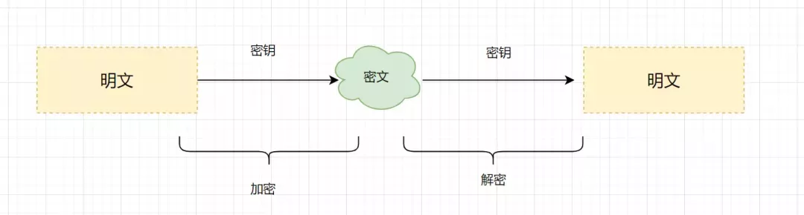

**非对称加密算法**：非对称加密算法需要两个密钥（公开密钥和私有密钥）。公钥与私钥是成对存在的，如果用公钥对数据进行加密，只有对应的私钥才能解密。主要的非对称加密算法有：**RSA、Elgamal、DSA、D-H、ECC**。

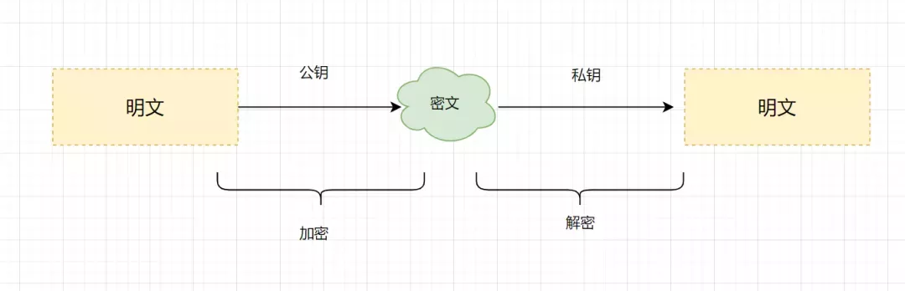

## 3. TCP如何保证可靠性

- 首先，TCP的连接是基于三次握手，而断开则是四次挥手。确保连接和断开的可靠性。

- 其次，TCP的可靠性，还体现在有状态；TCP会记录哪些数据发送了，哪些数据被接收了，哪些没有被接收，并且保证数据包按序到达，保证数据传输不出差错。

- 再次，TCP的可靠性，还体现在可控制。它有报文校验、ACK应答、超时重传(发送方)、失序数据重传（接收方）、丢弃重复数据、流量控制（滑动窗口）和拥塞控制等机制。

## 4. 聊聊五种IO模型

### 4.1 阻塞IO 模型

假设应用程序的进程发起IO调用，但是如果内核的数据还没准备好的话，那应用程序进程就一直在阻塞等待，一直等到内核数据准备好了，从内核拷贝到用户空间，才返回成功提示，此次IO操作，称之为阻塞IO。

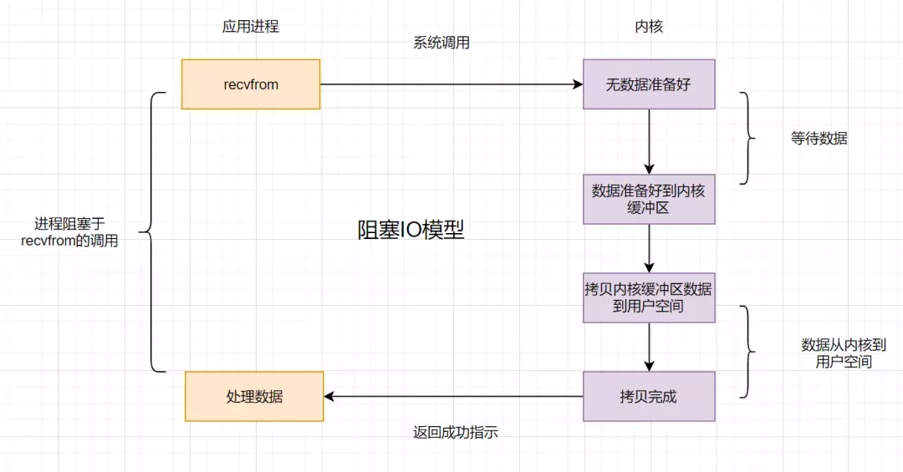

### 4.2 非阻塞IO模型

如果内核数据还没准备好，可以先返回错误信息给用户进程，让它不需要等待，而是通过轮询的方式再来请求。这就是非阻塞IO，流程图如下：

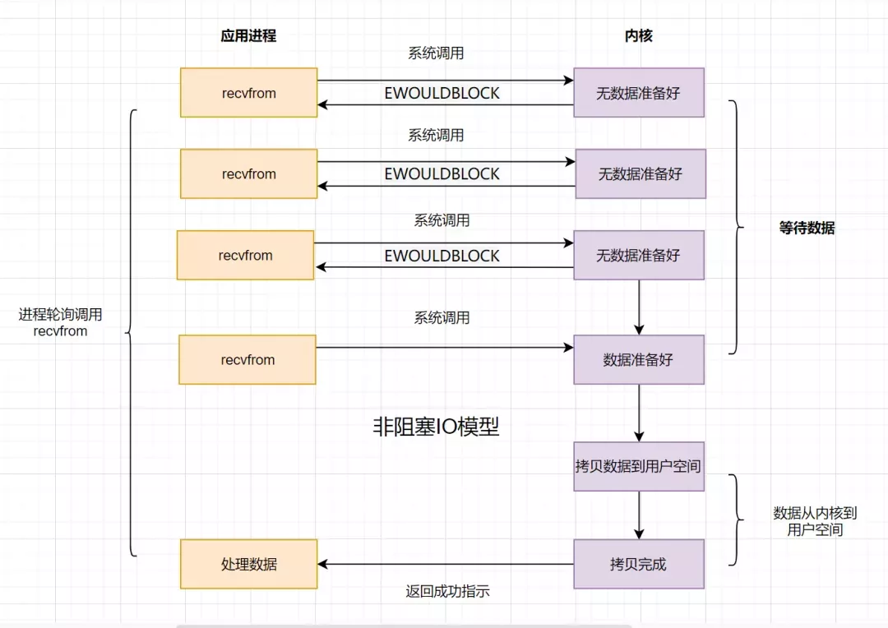

### 4.3 IO多路复用模型

**IO多路复用之select**

应用进程通过调用select函数，可以同时监控多个fd，在select函数监控的fd中，只要有任何一个数据状态准备就绪了，select函数就会返回可读状态，这时应用进程再发起recvfrom请求去读取数据。

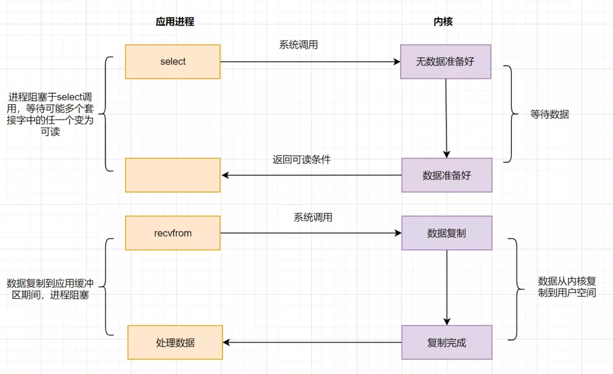

select有几个缺点：

- 最大连接数有限，在Linux系统上一般为1024。

- select函数返回后，是通过遍历fdset，找到就绪的描述符fd。

**IO多路复用之epoll**

为了解决select存在的问题，多路复用模型epoll诞生，它采用事件驱动来实现，流程图如下：

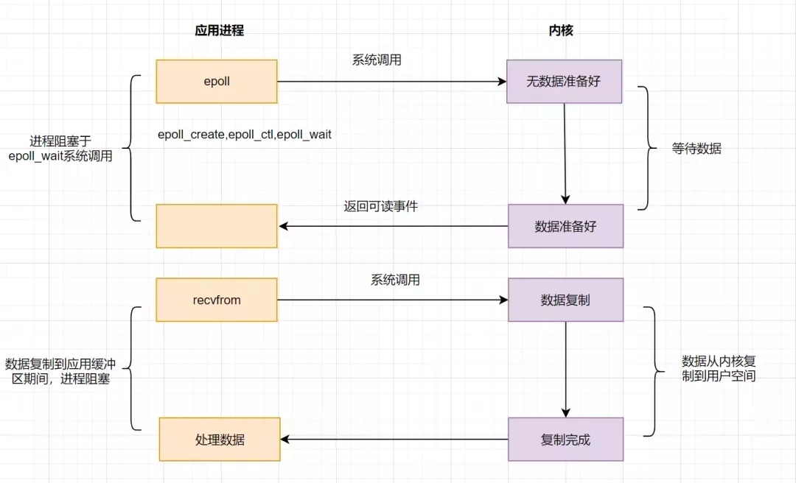

epoll先通过epoll_ctl()来注册一个fd（文件描述符），一旦基于某个fd就绪时，内核会采用回调机制，迅速激活这个fd，当进程调用epoll_wait()时便得到通知。这里去掉了遍历文件描述符的坑爹操作，而是采用监听事件回调的机制。这就是epoll的亮点。

### 4.4 IO模型之信号驱动模型

信号驱动IO不再用主动询问的方式去确认数据是否就绪，而是向内核发送一个信号（调用sigaction的时候建立一个SIGIO的信号），然后应用用户进程可以去做别的事，不用阻塞。当内核数据准备好后，再通过SIGIO信号通知应用进程，数据准备好后的可读状态。应用用户进程收到信号之后，立即调用recvfrom，去读取数据。

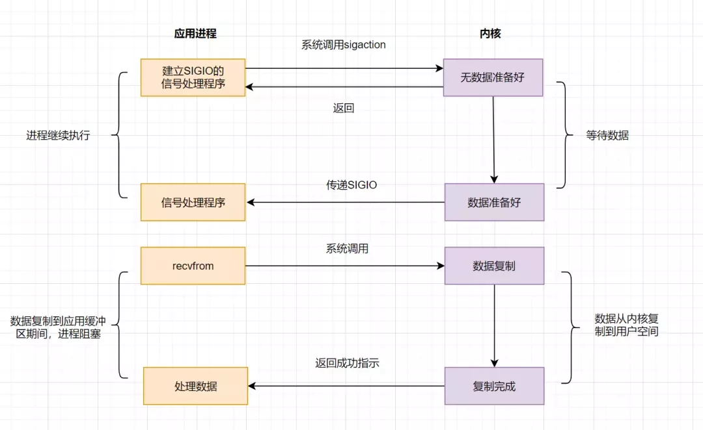

### 4.5 IO模型之异步IO(AIO)

AIO实现了IO全流程的非阻塞，就是应用进程发出系统调用后，是立即返回的，但是立即返回的不是处理结果，而是表示提交成功类似的意思。等内核数据准备好，将数据拷贝到用户进程缓冲区，发送信号通知用户进程IO操作执行完毕。

流程如下：

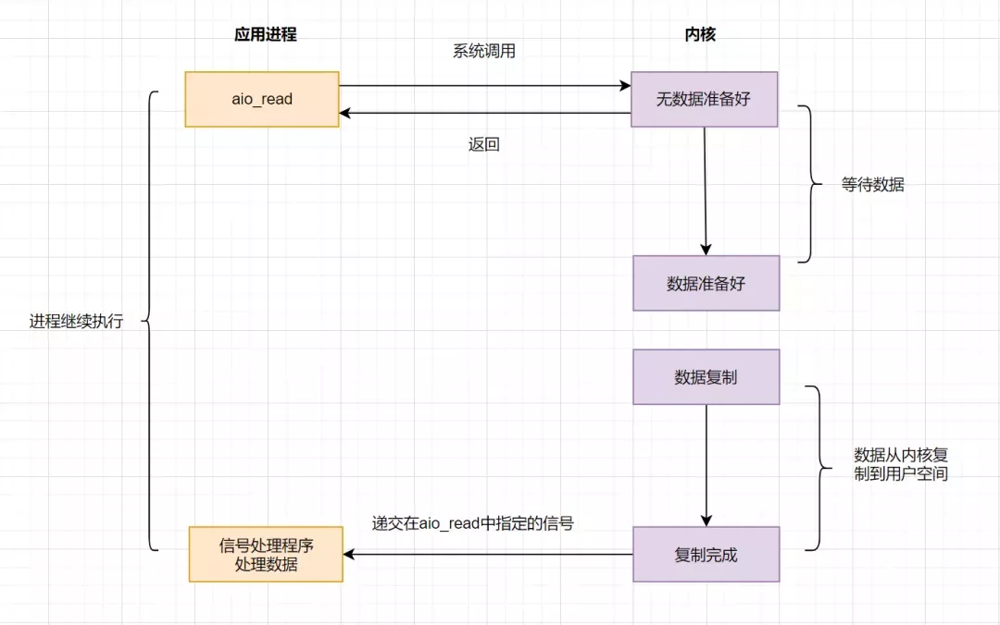

## 5. hystrix 工作原理

Hystrix 工作流程图如下：

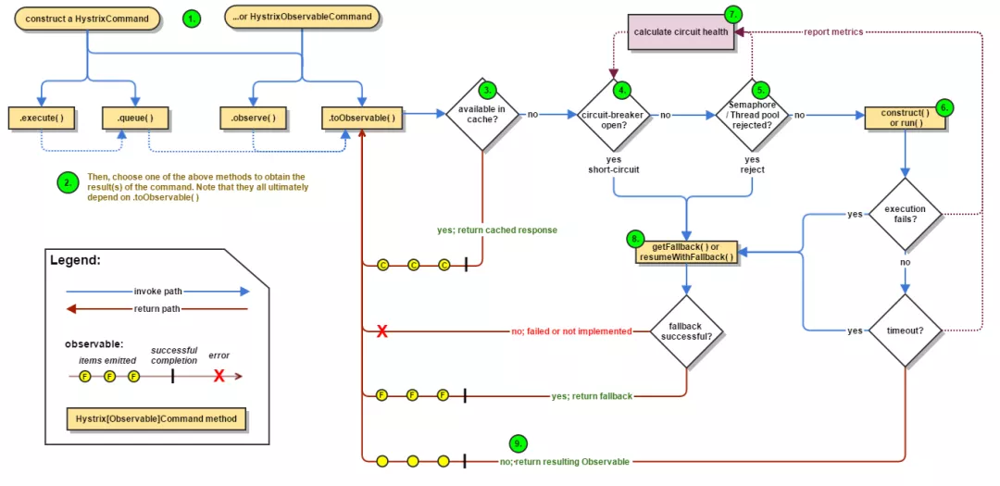

1. 构建命令
   
   Hystrix 提供了两个命令对象：HystrixCommand和HystrixObservableCommand，它将代表你的一个依赖请求任务，向构造函数中传入请求依赖所需要的参数。

2. 执行命令
   
   有四种方式执行Hystrix命令。分别是：
- R execute()：同步阻塞执行的，从依赖请求中接收到单个响应。

- Future queue()：异步执行，返回一个包含单个响应的Future对象。

- Observable observe()：创建Observable后会订阅Observable，从依赖请求中返回代表响应的Observable对象

- Observable toObservable()：cold observable，返回一个Observable，只有订阅时才会执行Hystrix命令，可以返回多个结果
3. 检查响应是否被缓存
   
   如果启用了 Hystrix缓存，任务执行前将先判断是否有相同命令执行的缓存。如果有则直接返回包含缓存响应的Observable；如果没有缓存的结果，但启动了缓存，将缓存本次执行结果以供后续使用。

4. 检查回路器是否打开 
   
   回路器(circuit-breaker)和保险丝类似，保险丝在发生危险时将会烧断以保护电路，而回路器可以在达到我们设定的阀值时触发短路(比如请求失败率达到50%)，拒绝执行任何请求。

       如果回路器被打开，Hystrix将不会执行命令，直接进入Fallback处理逻辑。

5. 检查线程池/信号量/队列情况 
   
   Hystrix 隔离方式有线程池隔离和信号量隔离。当使用Hystrix线程池时，Hystrix 默认为每个依赖服务分配10个线程，当10个线程都繁忙时，将拒绝执行命令,，而是立即跳到执行fallback逻辑。

6. 执行具体的任务 
   
   通过HystrixObservableCommand.construct() 或者 HystrixCommand.run() 来运行用户真正的任务。

7. 计算回路健康情况 
   
   每次开始执行command、结束执行command以及发生异常等情况时，都会记录执行情况，例如：成功、失败、拒绝和超时等指标情况，会定期处理这些数据，再根据设定的条件来判断是否开启回路器。

8. 命令失败时执行Fallback逻辑 
   
   在命令失败时执行用户指定的 Fallback 逻辑。上图中的断路、线程池拒绝、信号量拒绝、执行执行、执行超时都会进入Fallback处理。

9. 返回执行结果 
   
   原始对象结果将以Observable形式返回，在返回给用户之前，会根据调用方式的不同做一些处理。

## 6. 延时场景处理

日常开发中，我们经常遇到这种业务场景，如：外卖订单超30分钟未支付，则自动取消订单；用户注册成功15分钟后，发短信消息通知用户等等。这就是延时任务处理场景。针对此类场景我们主要有以下几种处理方案：

- JDK的DelayQueue延迟队列

- 时间轮算法

- 数据库定时任务（如Quartz）

- Redis ZSet 实现

- MQ 延时队列实现

## 7. https请求过程

- HTTPS = HTTP + SSL/TLS，即用SSL/TLS对数据进行加密和解密，Http进行传输。

- SSL，即Secure Sockets Layer（安全套接层协议），是网络通信提供安全及数据完整性的一种安全协议。

- TLS，即Transport Layer Security(安全传输层协议)，它是SSL 3.0的后续版本。

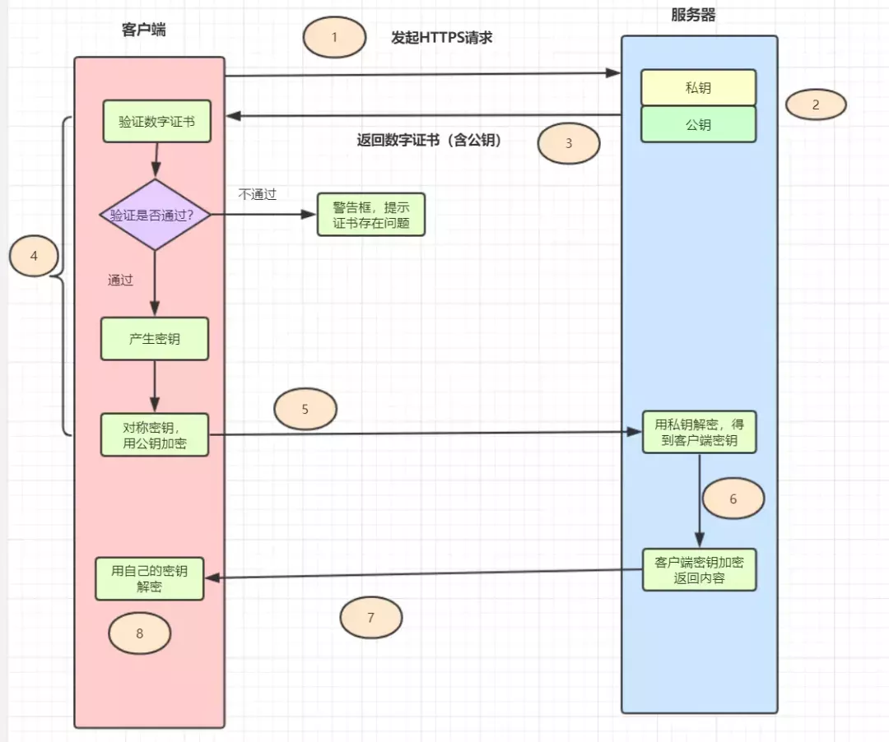

1. 用户在浏览器里输入一个https网址，然后连接到server的443端口。

2. 服务器必须要有一套数字证书，可以自己制作，也可以向组织申请，区别就是自己颁发的证书需要客户端验证通过。这套证书其实就是一对公钥和私钥。

3. 服务器将自己的数字证书（含有公钥）发送给客户端。

4. 客户端收到服务器端的数字证书之后，会对其进行检查，如果不通过，则弹出警告框。如果证书没问题，则生成一个密钥（对称加密），用证书的公钥对它加密。

5. 客户端会发起HTTPS中的第二个HTTP请求，将加密之后的客户端密钥发送给服务器。

6. 服务器接收到客户端发来的密文之后，会用自己的私钥对其进行非对称解密，解密之后得到客户端密钥，然后用客户端密钥对返回数据进行对称加密，这样数据就变成了密文。

7. 服务器将加密后的密文返回给客户端。

8. 客户端收到服务器发返回的密文，用自己的密钥（客户端密钥）对其进行对称解密，得到服务器返回的数据。

## 8. 聊聊事务隔离级别，以及可重复读实现原理

### 8.1 数据库四大隔离级别

为了解决并发事务存在的**脏读、不可重复读、幻读**等问题，数据库大叔设计了四种隔离级别。分别是**读未提交，读已提交，可重复读，串行化**（Serializable）。

- 读未提交隔离级别：只限制了两个数据不能同时修改，但是修改数据的时候，即使事务未提交，都是可以被别的事务读取到的，这级别的事务隔离有脏读、重复读、幻读的问题；

- 读已提交隔离级别：当前事务只能读取到其他事务提交的数据，所以这种事务的隔离级别解决了脏读问题，但还是会存在重复读、幻读问题；

- 可重复读：限制了读取数据的时候，不可以进行修改，所以解决了重复读的问题，但是读取范围数据的时候，是可以插入数据，所以还会存在幻读问题；

- 串行化：事务最高的隔离级别，在该级别下，所有事务都是进行串行化顺序执行的。可以避免脏读、不可重复读与幻读所有并发问题。但是这种事务隔离级别下，事务执行很耗性能。

四大隔离级别，都会存在哪些**并发问题**呢

| 隔离级别 | 脏读  | 不可重复读 | 幻读  |
| ---- | --- | ----- | --- |
| 读未提交 | √   | √     | √   |
| 读已提交 | ×   | √     | √   |
| 可重复读 | ×   | ×     | √   |
| 串行化  | ×   | ×     | ×   |

### 8.2 Read View可见性规则

| 变量             | 描述                                                |
| -------------- | ------------------------------------------------- |
| m_ids          | 当前系统中那些活跃(未提交)的读写事务ID, 它数据结构为一个List。              |
| max_limit_id   | 表示生成Read View时，系统中应该分配给下一个事务的id值。                 |
| min_limit_id   | 表示在生成Read View时，当前系统中活跃的读写事务中最小的事务id，即m_ids中的最小值。 |
| creator_trx_id | 创建当前Read View的事务ID                                |

Read View的**可见性规则**如下：

1. 如果数据事务ID `trx_id < min_limit_id`，表明生成该版本的事务在生成`Read View`前，已经提交(因为事务ID是递增的)，所以该版本可以被当前事务访问。

2. 如果`trx_id>= max_limit_id`，表明生成该版本的事务在生成`Read View`后才生成，所以该版本不可以被当前事务访问。

3. 如果 `min_limit_id =<trx_id< max_limit_id`,需要分3种情况讨论

> - 1）如果`m_ids`包含`trx_id`,则代表`Read View`生成时刻，这个事务还未提交，但是如果数据的`trx_id`等于`creator_trx_id`的话，表明数据是自己生成的，因此是可见的。
> 
> - 2）如果`m_ids`包含`trx_id`，并且`trx_id`不等于`creator_trx_id`，则`Read View`生成时，事务未提交，并且不是自己生产的，所以当前事务也是看不见的；
> 
> - 3）如果`m_ids`不包含`trx_id`，则说明你这个事务在`Read View`生成之前就已经提交了，修改的结果，当前事务是能看见的。

### 8.3 可重复读实现原理

数据库是通过加锁实现隔离级别的，比如，你想一个人静静，不被别人打扰，你可以把自己关在房子，并在房门上加上一把锁！串行化隔离级别就是加锁实现的。但是如果频繁加锁，性能会下降。因此设计数据库的大叔想到了**MVCC**。

可重复读的实现原理就是**MVCC多版本并发控制**。在一个事务范围内，两个相同的查询，读取同一条记录，却返回了不同的数据，这就是**不可重复读**。可重复读隔离级别，就是为了解决**不可重复读**问题。

查询一条记录，基于**MVCC**，是怎样的流程呢？

1. 获取事务自己的版本号，即事务ID

2. 获取Read View

3. 查询得到的数据，然后Read View中的事务版本号进行比较。

4. 如果不符合Read View的可见性规则， 即就需要Undo log中历史快照;

5. 最后返回符合规则的数据

InnoDB 实现**MVCC**，是通过`Read View + Undo Log`实现的，`Undo Log`保存了历史快照，`Read View`可见性规则帮助判断当前版本的数据是否可见。

可重复读（RR）隔离级别，是如何解决不可重复读问题的？

假设存在事务A和B，SQL执行流程如下

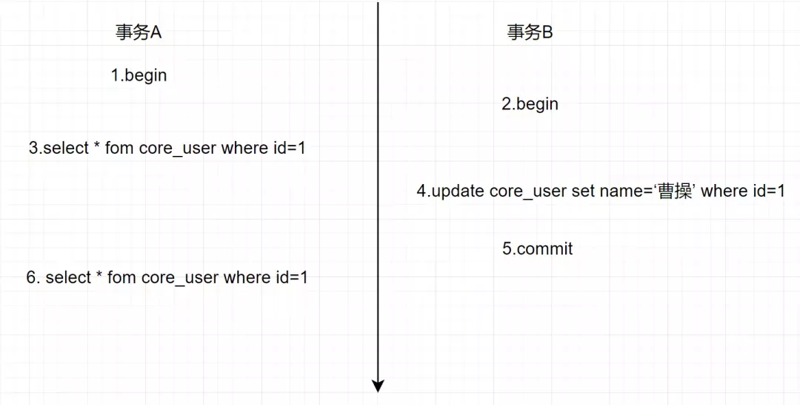

在可重复读（RR）隔离级别下，一个事务里只会获取一次`read view`，都是副本共用的，从而保证每次查询的数据都是一样的。

假设当前有一张core_user表，插入一条初始化数据,如下：


基于MVCC，我们来看看执行流程

1. A开启事务，首先得到一个事务ID为100

2. B开启事务，得到事务ID为101

3. 事务A生成一个Read View，read view对应的值如下

| 变量             | 值       |
| -------------- | ------- |
| m_ids          | 100，101 |
| max_limit_id   | 102     |
| min_limit_id   | 100     |
| creator_trx_id | 100     |

然后回到版本链：开始从版本链中挑选可见的记录：


由图可以看出，最新版本的列name的内容是孙权，该版本的trx_id值为100。开始执行**read view可见性规则**校验：

`min_limit_id(100)=<trx_id（100）<102;  
creator_trx_id = trx_id =100;  
`

由此可得，trx_id=100的这个记录，当前事务是可见的。所以查到是**name为孙权**的记录。

4. 事务B进行修改操作，把名字改为曹操。把原数据拷贝到undo log，然后对数据进行修改，标记事务ID和上一个数据版本在undo log的地址。

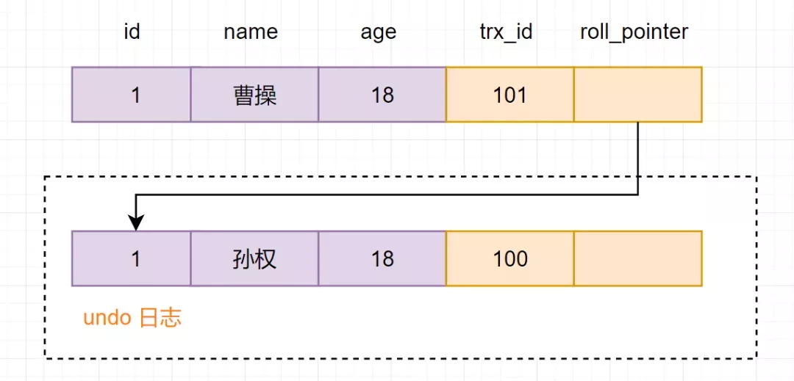

5. 事务B提交事务

6. 事务A再次执行查询操作，因为是RR（可重复读）隔离级别，因此会复用老的Read View副本，Read View对应的值如下

| 变量             | 值       |
| -------------- | ------- |
| m_ids          | 100，101 |
| max_limit_id   | 102     |
| min_limit_id   | 100     |
| creator_trx_id | 100     |

然后再次回到版本链：从版本链中挑选可见的记录：


从图可得，最新版本的列name的内容是曹操，该版本的trx_id值为101。开始执行read view可见性规则校验：

> min_limit_id(100)=<trx_id（101）<max_limit_id（102)；
> 因为m_ids{100,101}包含trx_id（101）， 
> 并且creator_trx_id (100) 不等于trx_id（101）

所以，`trx_id=101`这个记录，对于当前事务是不可见的。这时候呢，版本链`roll_pointer`跳到下一个版本，`trx_id=100`这个记录，再次校验是否可见：

> min_limit_id(100)=<trx_id（100）< max_limit_id（102)；
> 因为m_ids{100,101}包含trx_id（100）， 
> 并且creator_trx_id (100) 等于trx_id（100）

所以，trx_id=100这个记录，对于当前事务是可见的，所以两次查询结果，都是name=孙权的那个记录。即在可重复读（RR）隔离级别下，复用老的Read View副本，解决了不可重复读的问题。

## 9. 聊聊索引在哪些场景下会失效？

1. 查询条件包含or，可能导致索引失效

2. 如果字段类型是字符串，where时一定用引号括起来，否则索引失效  

3. like通配符可能导致索引失效。  

4. 联合索引，查询时的条件列不是联合索引中的第一个列，索引失效。  

5. 在索引列上使用mysql的内置函数，索引失效。  

6. 对索引列运算（如，+、-、*、/），索引失效。  

7. 索引字段上使用（！= 或者 < >，not in）时，可能会导致索引失效。  

8. 索引字段上使用is null， is not null，可能导致索引失效。  

9. 左连接查询或者右连接查询查询关联的字段编码格式不一样，可能导致索引失效。  

10. mysql估计使用全表扫描要比使用索引快，则不使用索引。

## 10. 什么是虚拟内存

> 虚拟内存，是虚拟出来的内存，它的核心思想就是确保每个程序拥有自己的地址空间，地址空间被分成多个块，每一块都有连续的地址空间。同时物理空间也分成多个块，块大小和虚拟地址空间的块大小一致，操作系统会自动将虚拟地址空间映射到物理地址空间，程序只需关注虚拟内存，请求的也是虚拟内存，真正使用却是物理内存。

现代操作系统使用**虚拟内存**，即虚拟地址取代物理地址，使用虚拟内存可以有2个好处：

- 虚拟内存空间可以远远大于物理内存空间

- 多个虚拟内存可以指向同一个物理地址

零拷贝实现思想，就利用了**虚拟内存**这个点：多个虚拟内存可以指向同一个物理地址，可以把内核空间和用户空间的虚拟地址映射到同一个物理地址，这样的话，就可以减少IO的数据拷贝次数啦，示意图如下：

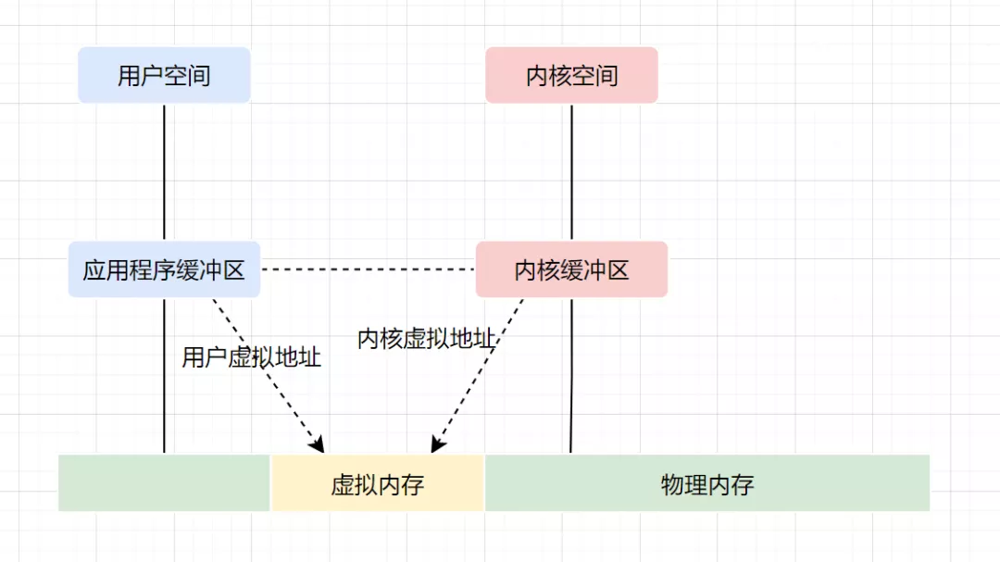

## 11. 排行榜的实现，比如高考成绩排序

排行版的实现，一般使用redis的**zset**数据类型。

- 使用格式如下：

> zadd key score member [score member ...]，zrank key member

- 层内部编码：ziplist（压缩列表）、skiplist（跳跃表）

- 使用场景如排行榜，社交需求（如用户点赞）

实现demo如下：

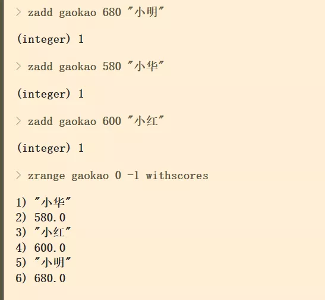

## 12.分布式锁实现

分布式锁，是控制分布式系统不同进程共同访问共享资源的一种锁的实现。秒杀下单、抢红包等等业务场景，都需要用到分布式锁，我们项目中经常使用Redis作为分布式锁。

选了Redis分布式锁的几种实现方法，大家来讨论下，看有没有啥问题哈。

- 命令setnx + expire分开写

- setnx + value值是过期时间

- set的扩展命令（set ex px nx）

- set ex px nx + 校验唯一随机值，再删除

- Redisson

### 12.1 命令setnx + expire分开写

```java
if（jedis.setnx(key,lock_value) == 1）{ //加锁
    expire（key，100）; //设置过期时间
    try {
        do something  //业务请求
    }catch(){
  }
  finally {
       jedis.del(key); //释放锁
    }
}
```

如果执行完`setnx`加锁，正要执行`expire`设置过期时间时，进程crash掉或者要重启维护了，那这个锁就“长生不老”了，别的线程永远获取不到锁啦，所以分布式锁不能这么实现。

### 12.2 setnx + value值是过期时间

```java
long expires = System.currentTimeMillis() + expireTime; //系统时间+设置的过期时间  
String expiresStr = String.valueOf(expires);

// 如果当前锁不存在，返回加锁成功  
if (jedis.setnx(key, expiresStr) == 1) {  
 return true;  
}   
// 如果锁已经存在，获取锁的过期时间  
String currentValueStr = jedis.get(key);

// 如果获取到的过期时间，小于系统当前时间，表示已经过期  
if (currentValueStr != null && Long.parseLong(currentValueStr) < System.currentTimeMillis()) {

 // 锁已过期，获取上一个锁的过期时间，并设置现在锁的过期时间（不了解redis的getSet命令的小伙伴，可以去官网看下哈）  
 String oldValueStr = jedis.getSet(key_resource_id, expiresStr);  
   
 if (oldValueStr != null && oldValueStr.equals(currentValueStr)) {  
 // 考虑多线程并发的情况，只有一个线程的设置值和当前值相同，它才可以加锁  
 return true;  
 }  
}  
   
//其他情况，均返回加锁失败  
return false;  
```

笔者看过有开发小伙伴就是这么实现分布式锁的，但是这种方案也有这些缺点：

- 过期时间是客户端自己生成的，分布式环境下，每个客户端的时间必须同步。

- 没有保存持有者的唯一标识，可能被别的客户端释放/解锁。

- 锁过期的时候，并发多个客户端同时请求过来，都执行了`jedis.getSet()`，最终只能有一个客户端加锁成功，但是该客户端锁的过期时间，可能被别的客户端覆盖。

### 12.3 set的扩展命令（set ex px nx）（注意可能存在的问题）

```java
if（jedis.set(key, lock_value, "NX", "EX", 100s) == 1）{ //加锁 
    try { 
        do something  //业务处理 
    }catch(){ 
  } 
  finally { 
       jedis.del(key); //释放锁 
    } 
}
```

这个方案可能存在这样的问题：

- 锁过期释放了，业务还没执行完。

- 锁被别的线程误删。

### 12.4 set ex px nx + 校验唯一随机值,再删除

```java
if（jedis.set(key, uni_request_id, "NX", "EX", 100s) == 1）{ //加锁 
    try { 
        do something  //业务处理 
    }catch(){ 
  } 
  finally { 
       //判断是不是当前线程加的锁,是才释放 
       if (uni_request_id.equals(jedis.get(key))) { 
        jedis.del(key); //释放锁 
        } 
    } 
}
```

在这里，判断当前线程加的锁和释放锁是不是一个原子操作。如果调用jedis.del()释放锁的时候，可能这把锁已经不属于当前客户端，会解除他人加的锁。

一般也是用lua脚本代替。lua脚本如下：

```lua
if redis.call('get',KEYS[1]) == ARGV[1] then  
   return redis.call('del',KEYS[1])  
else 
   return 0 
end;
```

这种方式比较不错了，一般情况下，已经可以使用这种实现方式。但是存在锁过期释放了，业务还没执行完的问题（实际上，估算个业务处理的时间，一般没啥问题了）。

### 12.5 Redisson

分布式锁可能存在锁过期释放，业务没执行完的问题。有些小伙伴认为，稍微把锁过期时间设置长一些就可以啦。其实我们设想一下，是否可以给获得锁的线程，开启一个定时守护线程，每隔一段时间检查锁是否还存在，存在则对锁的过期时间延长，防止锁过期提前释放。

当前开源框架Redisson就解决了这个分布式锁问题。我们一起来看下Redisson底层原理是怎样的吧：

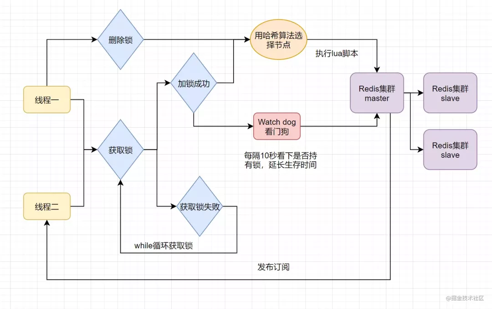

只要线程一加锁成功，就会启动一个`watch dog`看门狗，它是一个后台线程，会每隔10秒检查一下，如果线程1还持有锁，那么就会不断的延长锁key的生存时间。因此，Redisson就是使用Redisson解决了锁过期释放，业务没执行完问题。

## 13. 零拷贝

零拷贝就是不需要将数据从一个存储区域复制到另一个存储区域。它是指在传统IO模型中，指CPU拷贝的次数为0。它是IO的优化方案

- 传统IO流程

- 零拷贝实现之mmap+write

- 零拷贝实现之sendfile

- 零拷贝实现之带有DMA收集拷贝功能的sendfile

### 13.1 传统IO流程

**流程图如下：**

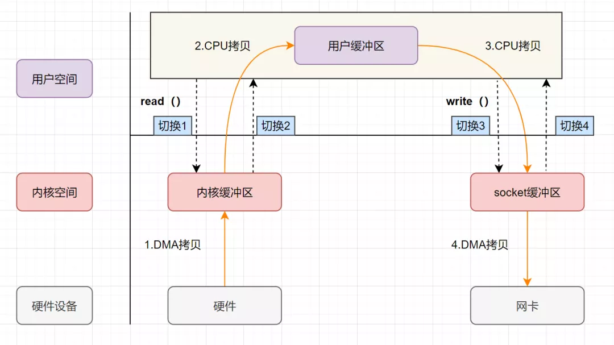

- 用户应用进程调用read函数，向操作系统发起IO调用，**上下文从用户态转为内核态（切换1）**

- DMA控制器把数据从磁盘中，读取到内核缓冲区。

- CPU把内核缓冲区数据，拷贝到用户应用缓冲区，**上下文从内核态转为用户态（切换2）**，read函数返回

- 用户应用进程通过write函数，发起IO调用，**上下文从用户态转为内核态（切换3）**

- CPU将应用缓冲区中的数据，拷贝到socket缓冲区

- DMA控制器把数据从socket缓冲区，拷贝到网卡设备，**上下文从内核态切换回用户态（切换4）**，write函数返回

从流程图可以看出，传统IO的读写流程，包括了4次上下文切换（4次用户态和内核态的切换），4次数据拷贝（**两次CPU拷贝以及两次的DMA拷贝**)。

### 13.2 mmap+write实现的零拷贝

mmap 的函数原型如下：

```c
void *mmap(void *addr, size_t length, int prot, int flags, int fd, off_t offset);
```

- addr：指定映射的虚拟内存地址

- length：映射的长度

- prot：映射内存的保护模式

- flags：指定映射的类型

- fd:进行映射的文件句柄

- offset:文件偏移量

mmap使用了**虚拟内存**，可以把内核空间和用户空间的虚拟地址映射到同一个物理地址，从而减少数据拷贝次数！

`mmap+write`实现的零拷贝流程如下：

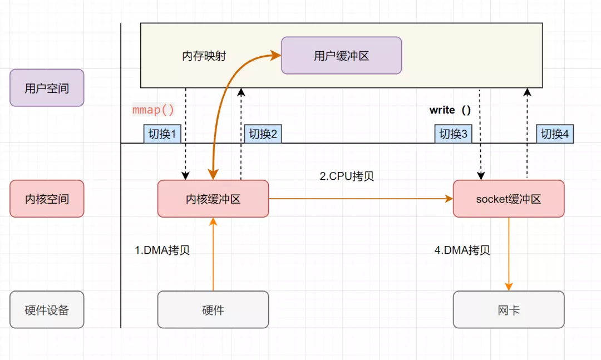

- 户进程通过`mmap方法`向操作系统内核发起IO调用，**上下文从用户态切换为内核态**。

- CPU利用DMA控制器，把数据从硬盘中拷贝到内核缓冲区。

- **上下文从内核态切换回用户态**，mmap方法返回。

- 用户进程通过`write`方法向操作系统内核发起IO调用，**上下文从用户态切换为内核态**。

- CPU将内核缓冲区的数据拷贝到的socket缓冲区。

- CPU利用DMA控制器，把数据从socket缓冲区拷贝到网卡，**上下文从内核态切换回用户态**，write调用返回。

可以发现，`mmap+write`实现的零拷贝，I/O发生了**4**次用户空间与内核空间的上下文切换，以及3次数据拷贝。其中3次数据拷贝中，包括了**2次DMA拷贝和1次CPU拷贝**。

`mmap`是将读缓冲区的地址和用户缓冲区的地址进行映射，内核缓冲区和应用缓冲区共享，所以节省了一次CPU拷贝‘’并且用户进程内存是**虚拟的**，只是**映射**到内核的读缓冲区，可以节省一半的内存空间。

### 13.3 sendfile实现的零拷贝

`sendfile`是Linux2.1内核版本后引入的一个系统调用函数，API如下：

```c
ssize_t sendfile(int out_fd, int in_fd, off_t *offset, size_t count);
```

- out_fd: 为待写入内容的文件描述符，一个socket描述符。，

- in_fd: 为待读出内容的文件描述符，必须是真实的文件，不能是socket和管道。

- offset：指定从读入文件的哪个位置开始读，如果为NULL，表示文件的默认起始位置。

- count：指定在fdout和fdin之间传输的字节数。

sendfile表示在两个文件描述符之间传输数据，它是在**操作系统内核**中操作的，**避免了数据从内核缓冲区和用户缓冲区之间的拷贝操作**，因此可以使用它来实现零拷贝。

sendfile实现的零拷贝流程如下：

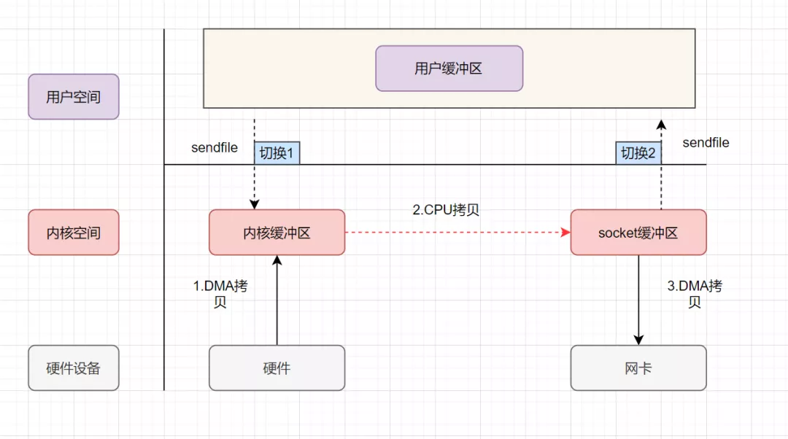

1. 用户进程发起sendfile系统调用，**上下文（切换1）从用户态转向内核态**

2. DMA控制器，把数据从硬盘中拷贝到内核缓冲区。

3. CPU将读缓冲区中数据拷贝到socket缓冲区

4. DMA控制器，异步把数据从socket缓冲区拷贝到网卡

5. **上下文（切换2）从内核态切换回用户态**，sendfile调用返回。

可以发现，`sendfile`实现的零拷贝，I/O发生了**2**次用户空间与内核空间的上下文切换，以及3次数据拷贝。其中3次数据拷贝中，包括了**2次DMA拷贝和1次CPU拷贝**。那能不能把CPU拷贝的次数减少到0次呢？有的，即`带有DMA收集拷贝功能的sendfile`！

### 13.4 sendfile+DMA scatter/gather实现的零拷贝

linux 2.4版本之后，对`sendfile`做了优化升级，引入SG-DMA技术，其实就是对DMA拷贝加入了`scatter/gather`操作，它可以直接从内核空间缓冲区中将数据读取到网卡。使用这个特点搞零拷贝，即还可以多省去**一次CPU拷贝**。

sendfile+DMA scatter/gather实现的零拷贝流程如下：

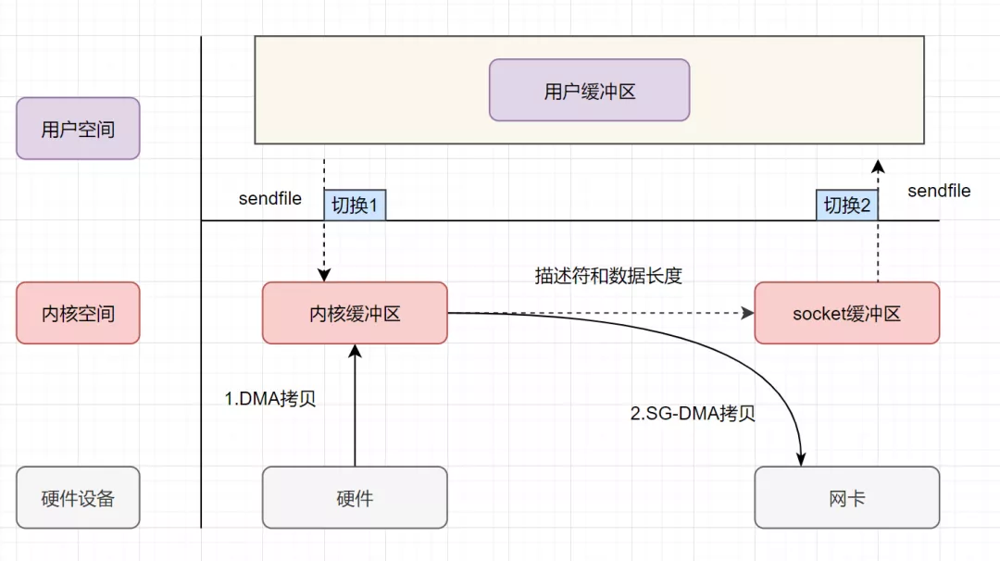

1. 用户进程发起sendfile系统调用，**上下文（切换1）从用户态转向内核态**

2. DMA控制器，把数据从硬盘中拷贝到内核缓冲区。

3. CPU把内核缓冲区中的**文件描述符信息**（包括内核缓冲区的内存地址和偏移量）发送到socket缓冲区

4. DMA控制器根据文件描述符信息，直接把数据从内核缓冲区拷贝到网卡

5. **上下文（切换2）从内核态切换回用户态**，sendfile调用返回。

可以发现，`sendfile+DMA scatter/gather`实现的零拷贝，I/O发生了**2**次用户空间与内核空间的上下文切换，以及2次数据拷贝。其中2次数据拷贝都是包**DMA拷贝**。这就是真正的 **零拷贝（Zero-copy)** 技术，全程都没有通过CPU来搬运数据，所有的数据都是通过DMA来进行传输的。

## 14. synchronized

synchronized是Java中的关键字，是一种同步锁。synchronized关键字可以作用于方法或者代码块。

一般面试时。可以这么回答：

- 反编译后，monitorenter、monitorexit、ACC_SYNCHRONIZED

- monitor监视器

- Java Monitor 的工作机理

- 对象与monitor关联

### 14.1 monitorenter、monitorexit、ACC_SYNCHRONIZED

如果**synchronized**作用于**代码块**，反编译可以看到两个指令：`monitorenter、monitorexit`，JVM使用`monitorenter和monitorexit`两个指令实现同步；如果作用synchronized作用于**方法**，反编译可以看到`ACCSYNCHRONIZED标记`，JVM通过在方法访问标识符(flags)中加入`ACCSYNCHRONIZED`来实现同步功能。

- 同步代码块是通过`monitorenter和monitorexit`来实现，当线程执行到monitorenter的时候要先获得monitor锁，才能执行后面的方法。当线程执行到monitorexit的时候则要释放锁。

- 同步方法是通过中设置`ACCSYNCHRONIZED`标志来实现，当线程执行有ACCSYNCHRONIZED标志的方法，需要获得monitor锁。每个对象都与一个monitor相关联，线程可以占有或者释放monitor。

### 14.2 monitor监视器

monitor是什么呢？操作系统的管程（monitors）是概念原理，ObjectMonitor是它的原理实现。

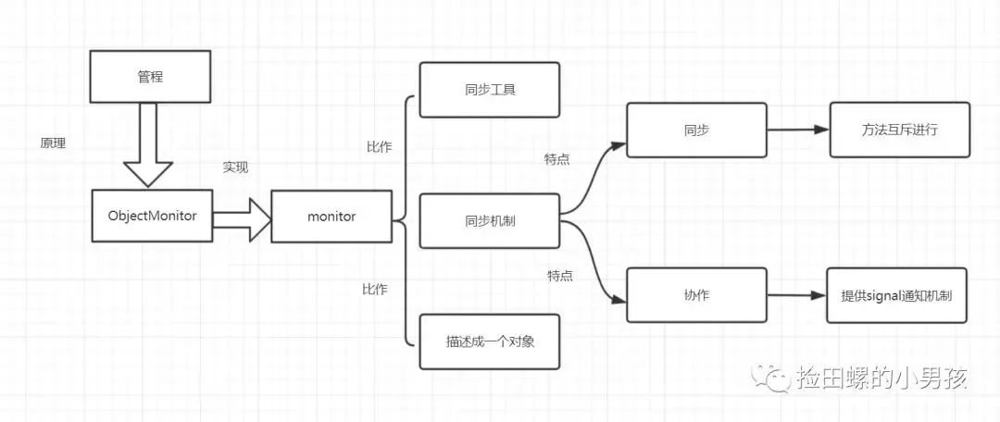

在Java虚拟机（HotSpot）中，Monitor（管程）是由ObjectMonitor实现的，其主要数据结构如下：

```c
ObjectMonitor() {
    _header       = NULL;
    _count        = 0; // 记录个数
    _waiters      = 0,
    _recursions   = 0;
    _object       = NULL;
    _owner        = NULL;
    _WaitSet      = NULL;  // 处于wait状态的线程，会被加入到_WaitSet
    _WaitSetLock  = 0 ;
    _Responsible  = NULL ;
    _succ         = NULL ;
    _cxq          = NULL ;
    FreeNext      = NULL ;
    _EntryList    = NULL ;  // 处于等待锁block状态的线程，会被加入到该列表
    _SpinFreq     = 0 ;
    _SpinClock    = 0 ;
    OwnerIsThread = 0 ;
  }
```

ObjectMonitor中几个关键字段的含义如图所示：

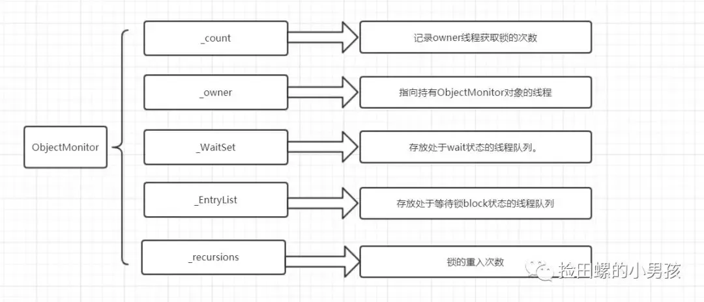

### 14.3 Java Monitor 的工作机理

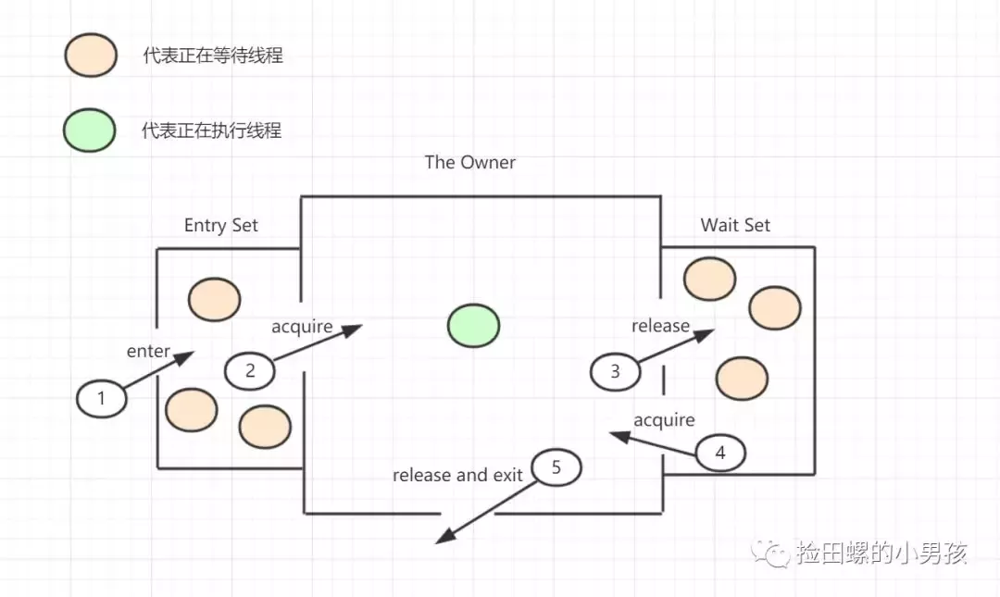

- 想要获取monitor的线程，首先会进入EntryList队列。

- 当某个线程获取到对象的monitor后，进入Owner区域，设置为当前线程,同时计数器count加1。

- 如果线程调用了wait()方法，则会进入WaitSet队列。它会释放monitor锁，即将owner赋值为null，count自减1,进入WaitSet队列阻塞等待。

- 如果其他线程调用 notify() / notifyAll() ，会唤醒WaitSet中的某个线程，该线程再次尝试获取monitor锁，成功即进入Owner区域。

- 同步方法执行完毕了，线程退出临界区，会将monitor的owner设为null，并释放监视锁。

### 14.4 对象与monitor关联

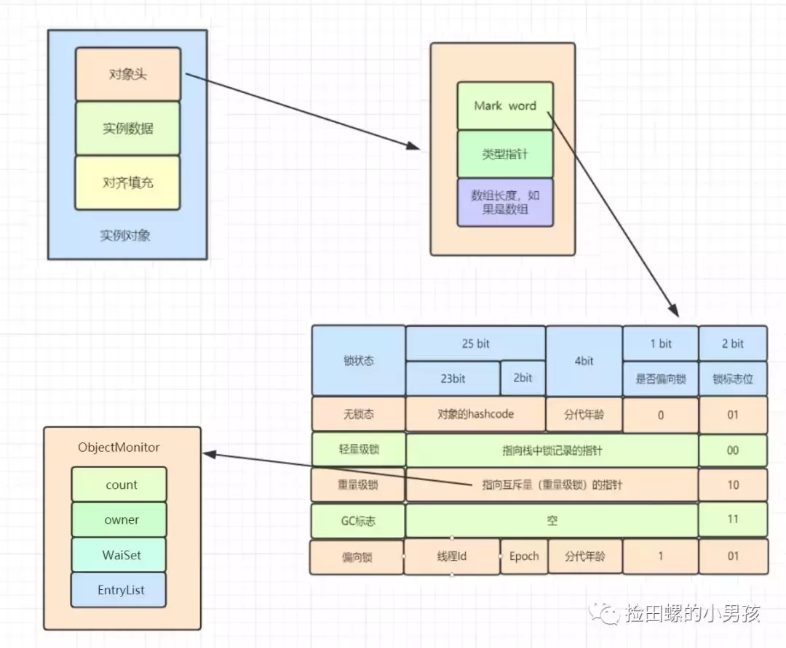

- 在HotSpot虚拟机中,对象在内存中存储的布局可以分为3块区域：**对象头（Header），实例数据（Instance Data）和对象填充（Padding）**。

- 对象头主要包括两部分数据：**Mark Word（标记字段）、Class Pointer（类型指针）**。

Mark Word 是用于存储对象自身的运行时数据，如哈希码（HashCode）、GC分代年龄、锁状态标志、线程持有的锁、偏向线程 ID、偏向时间戳等。

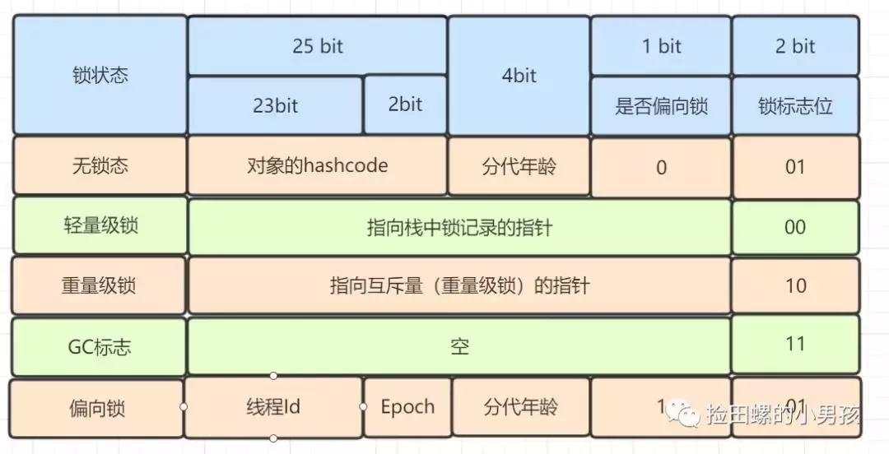

**重量级锁，指向互斥量的指针。其实synchronized是重量级锁，也就是说Synchronized的对象锁，Mark Word锁标识位为10，其中指针指向的是Monitor对象的起始地址。**

## 15. 分布式id生成方案有哪些？什么是雪花算法？

分布式id生成方案主要有：

- UUID

- 数据库自增ID

- 基于雪花算法（Snowflake）实现

- 百度 （Uidgenerator）

- 美团（Leaf）

什么是**雪花算法**？

> 雪花算法是一种生成分布式全局唯一ID的算法，生成的ID称为Snowflake IDs。这种算法由Twitter创建，并用于推文的ID。

一个Snowflake ID有64位。

- 第1位：Java中long的最高位是符号位代表正负，正数是0，负数是1，一般生成ID都为正数，所以默认为0。

- 接下来前41位是时间戳，表示了自选定的时期以来的毫秒数。

- 接下来的10位代表计算机ID，防止冲突。

- 其余12位代表每台机器上生成ID的序列号，这允许在同一毫秒内创建多个Snowflake ID。