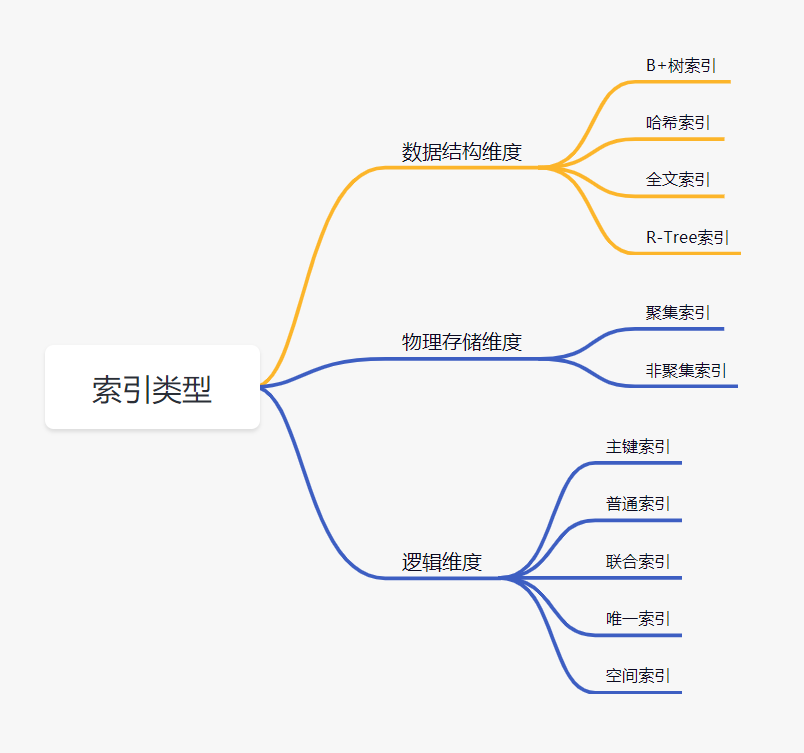
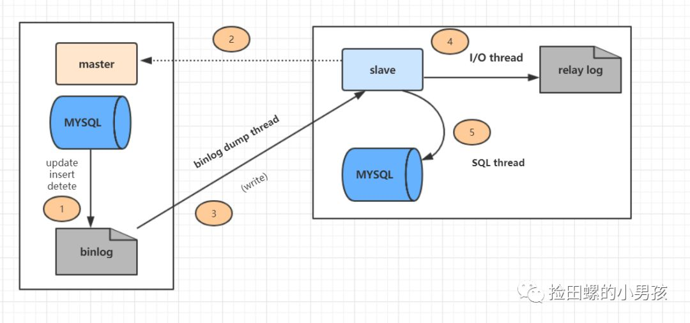
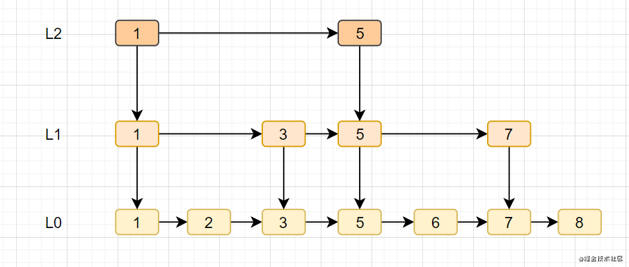
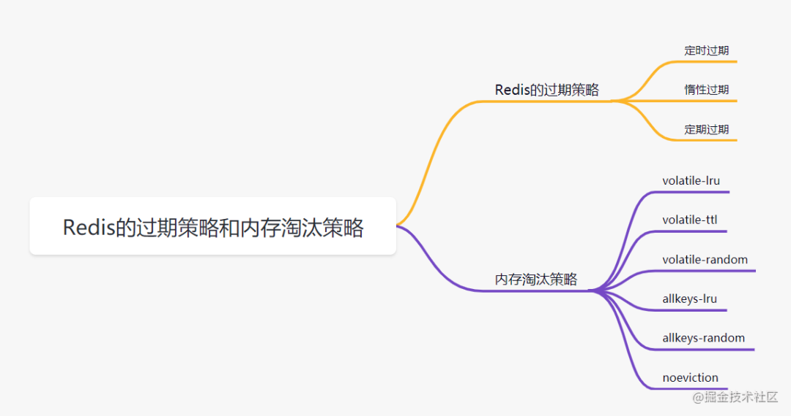

# 2022-社招后端(三年工作经验一面)

<!-- START doctoc generated TOC please keep comment here to allow auto update -->
<!-- DON'T EDIT THIS SECTION, INSTEAD RE-RUN doctoc TO UPDATE -->

- [1. Mysql索引在什么情况下会失效](#1-mysql%E7%B4%A2%E5%BC%95%E5%9C%A8%E4%BB%80%E4%B9%88%E6%83%85%E5%86%B5%E4%B8%8B%E4%BC%9A%E5%A4%B1%E6%95%88)
- [2. MySql的存储引擎InnoDB与MyISAM的区别](#2-mysql%E7%9A%84%E5%AD%98%E5%82%A8%E5%BC%95%E6%93%8Einnodb%E4%B8%8Emyisam%E7%9A%84%E5%8C%BA%E5%88%AB)
- [3. mysql在项目中的优化场景，慢查询解决等](#3-mysql%E5%9C%A8%E9%A1%B9%E7%9B%AE%E4%B8%AD%E7%9A%84%E4%BC%98%E5%8C%96%E5%9C%BA%E6%99%AF%E6%85%A2%E6%9F%A5%E8%AF%A2%E8%A7%A3%E5%86%B3%E7%AD%89)
- [4. Mysql有什么索引，索引模型是什么](#4-mysql%E6%9C%89%E4%BB%80%E4%B9%88%E7%B4%A2%E5%BC%95%E7%B4%A2%E5%BC%95%E6%A8%A1%E5%9E%8B%E6%98%AF%E4%BB%80%E4%B9%88)
- [5. B-树与B+树的区别？为什么不用红黑树](#5-b-%E6%A0%91%E4%B8%8Eb%E6%A0%91%E7%9A%84%E5%8C%BA%E5%88%AB%E4%B8%BA%E4%BB%80%E4%B9%88%E4%B8%8D%E7%94%A8%E7%BA%A2%E9%BB%91%E6%A0%91)
- [6. Mysql主从同步怎么做](#6-mysql%E4%B8%BB%E4%BB%8E%E5%90%8C%E6%AD%A5%E6%80%8E%E4%B9%88%E5%81%9A)
- [7. 乐观锁与悲观锁的区别？](#7-%E4%B9%90%E8%A7%82%E9%94%81%E4%B8%8E%E6%82%B2%E8%A7%82%E9%94%81%E7%9A%84%E5%8C%BA%E5%88%AB)
- [8. 聊聊binlog日志](#8-%E8%81%8A%E8%81%8Abinlog%E6%97%A5%E5%BF%97)
- [9. Redis 持久化有哪几种方式，怎么选？](#9-redis-%E6%8C%81%E4%B9%85%E5%8C%96%E6%9C%89%E5%93%AA%E5%87%A0%E7%A7%8D%E6%96%B9%E5%BC%8F%E6%80%8E%E4%B9%88%E9%80%89)
  - [9.1 AOF 持久化](#91-aof-%E6%8C%81%E4%B9%85%E5%8C%96)
  - [9.2 RDB](#92-rdb)
  - [9.3 如何选择RDB和AOF](#93-%E5%A6%82%E4%BD%95%E9%80%89%E6%8B%A9rdb%E5%92%8Caof)
- [10. Redis 主从同步是怎样的过程？](#10-redis-%E4%B8%BB%E4%BB%8E%E5%90%8C%E6%AD%A5%E6%98%AF%E6%80%8E%E6%A0%B7%E7%9A%84%E8%BF%87%E7%A8%8B)
- [11. 聊聊Redis的zset，它是怎么实现的？](#11-%E8%81%8A%E8%81%8Aredis%E7%9A%84zset%E5%AE%83%E6%98%AF%E6%80%8E%E4%B9%88%E5%AE%9E%E7%8E%B0%E7%9A%84)
- [12. Redis 过期策略和内存淘汰策略](#12-redis-%E8%BF%87%E6%9C%9F%E7%AD%96%E7%95%A5%E5%92%8C%E5%86%85%E5%AD%98%E6%B7%98%E6%B1%B0%E7%AD%96%E7%95%A5)
  - [12.1 Redis的过期策略](#121-redis%E7%9A%84%E8%BF%87%E6%9C%9F%E7%AD%96%E7%95%A5)
  - [12.2 Redis 内存淘汰策略](#122-redis-%E5%86%85%E5%AD%98%E6%B7%98%E6%B1%B0%E7%AD%96%E7%95%A5)
- [13. Hashmap 是怎样实现的？为什么要用红黑树，而不用平衡二叉树？为什么在1.8中链表大于8时会转红黑树？HashMap是线性安全的嘛？如何保证安全？](#13-hashmap-%E6%98%AF%E6%80%8E%E6%A0%B7%E5%AE%9E%E7%8E%B0%E7%9A%84%E4%B8%BA%E4%BB%80%E4%B9%88%E8%A6%81%E7%94%A8%E7%BA%A2%E9%BB%91%E6%A0%91%E8%80%8C%E4%B8%8D%E7%94%A8%E5%B9%B3%E8%A1%A1%E4%BA%8C%E5%8F%89%E6%A0%91%E4%B8%BA%E4%BB%80%E4%B9%88%E5%9C%A818%E4%B8%AD%E9%93%BE%E8%A1%A8%E5%A4%A7%E4%BA%8E8%E6%97%B6%E4%BC%9A%E8%BD%AC%E7%BA%A2%E9%BB%91%E6%A0%91hashmap%E6%98%AF%E7%BA%BF%E6%80%A7%E5%AE%89%E5%85%A8%E7%9A%84%E5%98%9B%E5%A6%82%E4%BD%95%E4%BF%9D%E8%AF%81%E5%AE%89%E5%85%A8)
  - [13.1 Hashmap 是怎样实现的？](#131-hashmap-%E6%98%AF%E6%80%8E%E6%A0%B7%E5%AE%9E%E7%8E%B0%E7%9A%84)
  - [13.2 为什么要用红黑树，为什么不用二叉树？为什么不用平衡二叉树？](#132-%E4%B8%BA%E4%BB%80%E4%B9%88%E8%A6%81%E7%94%A8%E7%BA%A2%E9%BB%91%E6%A0%91%E4%B8%BA%E4%BB%80%E4%B9%88%E4%B8%8D%E7%94%A8%E4%BA%8C%E5%8F%89%E6%A0%91%E4%B8%BA%E4%BB%80%E4%B9%88%E4%B8%8D%E7%94%A8%E5%B9%B3%E8%A1%A1%E4%BA%8C%E5%8F%89%E6%A0%91)
  - [13.3 为什么在1.8中链表大于8时会转红黑树？](#133-%E4%B8%BA%E4%BB%80%E4%B9%88%E5%9C%A818%E4%B8%AD%E9%93%BE%E8%A1%A8%E5%A4%A7%E4%BA%8E8%E6%97%B6%E4%BC%9A%E8%BD%AC%E7%BA%A2%E9%BB%91%E6%A0%91)
  - [13.4 HashMap是线性安全的嘛？如何保证安全？](#134-hashmap%E6%98%AF%E7%BA%BF%E6%80%A7%E5%AE%89%E5%85%A8%E7%9A%84%E5%98%9B%E5%A6%82%E4%BD%95%E4%BF%9D%E8%AF%81%E5%AE%89%E5%85%A8)
- [14. select 和 epoll 的区别](#14-select-%E5%92%8C-epoll-%E7%9A%84%E5%8C%BA%E5%88%AB)
  - [14.1 IO多路复用之select](#141-io%E5%A4%9A%E8%B7%AF%E5%A4%8D%E7%94%A8%E4%B9%8Bselect)
  - [14.2 IO多路复用之epoll](#142-io%E5%A4%9A%E8%B7%AF%E5%A4%8D%E7%94%A8%E4%B9%8Bepoll)
- [15. http与https的区别，https的原理，如何加密的？](#15-http%E4%B8%8Ehttps%E7%9A%84%E5%8C%BA%E5%88%ABhttps%E7%9A%84%E5%8E%9F%E7%90%86%E5%A6%82%E4%BD%95%E5%8A%A0%E5%AF%86%E7%9A%84)
- [16. Raft算法原理](#16-raft%E7%AE%97%E6%B3%95%E5%8E%9F%E7%90%86)
  - [16.1  Raft 角色](#161-%C2%A0raft-%E8%A7%92%E8%89%B2)
  - [16.2 领导选举过程](#162-%E9%A2%86%E5%AF%BC%E9%80%89%E4%B8%BE%E8%BF%87%E7%A8%8B)
  - [16.2 日志复制](#162-%E6%97%A5%E5%BF%97%E5%A4%8D%E5%88%B6)
- [17. 消息中间件如何做到高可用](#17-%E6%B6%88%E6%81%AF%E4%B8%AD%E9%97%B4%E4%BB%B6%E5%A6%82%E4%BD%95%E5%81%9A%E5%88%B0%E9%AB%98%E5%8F%AF%E7%94%A8)
- [18. 消息队列怎么保证不丢消息的](#18-%E6%B6%88%E6%81%AF%E9%98%9F%E5%88%97%E6%80%8E%E4%B9%88%E4%BF%9D%E8%AF%81%E4%B8%8D%E4%B8%A2%E6%B6%88%E6%81%AF%E7%9A%84)
  - [18.1 生产者保证不丢消息](#181-%E7%94%9F%E4%BA%A7%E8%80%85%E4%BF%9D%E8%AF%81%E4%B8%8D%E4%B8%A2%E6%B6%88%E6%81%AF)
  - [18.2 存储端不丢消息](#182-%E5%AD%98%E5%82%A8%E7%AB%AF%E4%B8%8D%E4%B8%A2%E6%B6%88%E6%81%AF)
  - [18.3 消费阶段不丢消息](#183-%E6%B6%88%E8%B4%B9%E9%98%B6%E6%AE%B5%E4%B8%8D%E4%B8%A2%E6%B6%88%E6%81%AF)
- [19. Redis如何保证高可用？聊聊Redis的哨兵机制](#19-redis%E5%A6%82%E4%BD%95%E4%BF%9D%E8%AF%81%E9%AB%98%E5%8F%AF%E7%94%A8%E8%81%8A%E8%81%8Aredis%E7%9A%84%E5%93%A8%E5%85%B5%E6%9C%BA%E5%88%B6)

<!-- END doctoc generated TOC please keep comment here to allow auto update -->

## 1. Mysql索引在什么情况下会失效

- 查询条件包含or，可能导致索引失效

- 如何字段类型是字符串，where时一定用引号括起来，否则索引失效

- like通配符可能导致索引失效。

- 联合索引，查询时的条件列不是联合索引中的第一个列，索引失效。

- 在索引列上使用mysql的内置函数，索引失效。

- 对索引列运算（如，+、-、*、/），索引失效。

- 索引字段上使用（！= 或者 < >，not in）时，可能会导致索引失效。

- 索引字段上使用is null， is not null，可能导致索引失效。

- 左连接查询或者右连接查询查询关联的字段编码格式不一样，可能导致索引失效。

- mysql估计使用全表扫描要比使用索引快,则不使用索引。

## 2. MySql的存储引擎InnoDB与MyISAM的区别

- InnoDB支持事务，MyISAM不支持事务

- InnoDB支持外键，MyISAM不支持外键

- InnoDB 支持 MVCC(多版本并发控制)，MyISAM 不支持

- select count(*) from table时，MyISAM更快，因为它有一个变量保存了整个表的总行数，可以直接读取，InnoDB就需要全表扫描。

- Innodb不支持全文索引，而MyISAM支持全文索引（5.7以后的InnoDB也支持全文索引）

- InnoDB支持表、行级锁，而MyISAM支持表级锁。

- InnoDB表必须有主键，而MyISAM可以没有主键

- Innodb表需要更多的内存和存储，而MyISAM可被压缩，存储空间较小。

- Innodb按主键大小有序插入，MyISAM记录插入顺序是，按记录插入顺序保存。

## 3. mysql在项目中的优化场景，慢查询解决等

我们面对慢查询，首先想到的就是**加索引**。你可以给面试官描述一下，一个加了索引的SQL，是怎么执行查找的。

还有就是order by，group by原理，深分页等等，都跟慢查询息息相关。

最后就是慢查询的排查解决手段：

打开慢查询日志`slow_query_log`，确认SQL语句是否占用过多资源，用`explain`查询执行计划、对`group by、order by、join`等语句优化，如果数据量实在太大，是否考虑分库分表等等。

## 4. Mysql有什么索引，索引模型是什么



数据结构维度来讲的话，一般使用都是B+树索引。

## 5. B-树与B+树的区别？为什么不用红黑树

**B-树与B+树的区别：**

- B-树内部节点是保存数据的；而B+树内部节点是不保存数据的，只作索引作用，它的叶子节点才保存数据。

- B+树相邻的叶子节点之间是通过链表指针连起来的，B-树却不是。

- 查找过程中，B-树在找到具体的数值以后就结束，而B+树则需要通过索引找到叶子结点中的数据才结束

- B-树中任何一个关键字出现且只出现在一个结点中，而B+树可以出现多次。

**为什么索引结构默认使用B+树，而不是B-Tree，Hash哈希，二叉树，红黑树？**

- Hash哈希，只适合等值查询，不适合范围查询。

- 一般二叉树，可能会特殊化为一个链表，相当于全表扫描。

- 红黑树，是一种特化的平衡二叉树，MySQL 数据量很大的时候，索引的体积也会很大，内存放不下的而从磁盘读取，树的层次太高的话，读取磁盘的次数就多了。

- B-Tree，叶子节点和非叶子节点都保存数据，相同的数据量，B+树更矮壮，也是就说，相同的数据量，B+树数据结构，查询磁盘的次数会更少。

## 6. Mysql主从同步怎么做

大家要熟悉MySQL**主从复制原理**哈：

详细的主从复制过程如图：



上图主从复制过程分了五个步骤进行：

1. 主库的更新SQL(update、insert、delete)被写到binlog

2. 从库发起连接，连接到主库。

3. 此时主库创建一个`binlog dump thread`，把`binlog`的内容发送到从库。

4. 从库启动之后，创建一个`I/O`线程，读取主库传过来的`binlog`内容并写入到`relay log`

5. 从库还会创建一个SQL线程，从`relay log`里面读取内容，从`ExecMasterLog_Pos`位置开始执行读取到的更新事件，将更新内容写入到`slave`的db

主从同步这块呢，还涉及到**如何保证主从一致的**、**数据库主从延迟的原因与解决方案**、**数据库的高可用方案**。

## 7. 乐观锁与悲观锁的区别？

**悲观锁：**

悲观锁她专一且缺乏安全感了，她的心只属于当前事务，每时每刻都担心着它心爱的数据可能被别的事务修改，所以一个事务拥有（获得）悲观锁后，其他任何事务都不能对数据进行修改啦，只能等待锁被释放才可以执行。

`select ...for update`就是悲观锁一种实现。

**乐观锁：**

乐观锁的“乐观情绪”体现在，它认为数据的变动不会太频繁。因此，它允许多个事务同时对数据进行变动。实现方式：乐观锁一般会使用版本号机制或CAS算法实现。

## 8. 聊聊binlog日志

binlog是归档日志，属于**MySQL Server**层的日志。可以实现**主从复制和数据恢复**两个作用。当需要恢复数据时，可以取出某个时间范围内的binlog进行重放恢复即可。

binlog 日志有三种格式，分别是`statement，row和mixed`。

如果是`statement`格式，binlog记录的是**SQL的原文**，他可能会导致主库不一致(主库和从库选的索引不一样时)。我们来分析一下。假设主库执行删除这个SQL（其中`a和create_time`都有索引）如下：

```sql
delete from t where a > '666' and create_time<'2022-03-01' limit 1;
```

我们知道，数据选择了`a`索引和选择`create_time`索引，最后`limit 1`出来的数据一般是不一样的。所以就会存在这种情况：在binlog = `statement`格式时，主库在执行这条SQL时，使用的是索引a，而从库在执行这条SQL时，使用了索引`create_time`。最后主从数据不一致了。

**如何解决这个问题呢？**

可以把binlog格式修改为`row`。`row`格式的`binlog`日志，记录的不是**SQL原文**，而是两个`event:Table_map 和 Delete_rows`。Table_map event说明要操作的表，Delete_rows event用于定义要删除的行为，记录删除的具体行数。`row`格式的binlog记录的就是要删除的主键ID信息，因此不会出现主从不一致的问题。

但是如果SQL删除10万行数据，使用row格式就会很占空间的，10万条数据都在binlog里面，写binlog的时候也很耗IO。但是`statement`格式的binlog可能会导致数据不一致，因此设计MySQL的大叔想了一个折中的方案，`mixed`格式的binlog。所谓的mixed格式其实就是`row`和`statement`格式混合使用，当MySQL判断可能数据不一致时，就用`row`格式，否则使用就用`statement`格式。

## 9. Redis 持久化有哪几种方式，怎么选？

既然它是基于内存的，如果Redis服务器挂了，数据就会丢失。为了避免数据丢失了，Redis提供了两种持久化方式，**RDB和AOF**。

### 9.1 AOF 持久化

AOF（append only file） 持久化，采用日志的形式来记录每个写操作，追加到AOF文件的末尾。**Redis默认情况是不开启AOF的**。重启时再重新执行AOF文件中的命令来恢复数据。它主要解决数据持久化的实时性问题。

AOF是**执行完命令后才记录日志的**。为什么不先记录日志再执行命令呢？这是因为Redis在向AOF记录日志时，不会先对这些命令进行语法检查，如果先记录日志再执行命令，日志中可能记录了错误的命令，Redis使用日志回复数据时，可能会出错。

正是因为执行完命令后才记录日志，所以不会阻塞当前的写操作。但是会存在**两个风险**：

1. 执行完命令还没记录日志时，宕机了会导致数据丢失

2. AOF不会阻塞当前命令，但是可能会阻塞下一个操作。

这两个风险最好的解决方案是折中妙用**AOF机制的三种写回策略** `appendfsync`：

1. always，**同步写回**，每个子命令执行完，都立即将日志写回磁盘。

2. everysec，每个命令执行完，只是先把日志写到AOF内存缓冲区，每隔一秒同步到磁盘。

3. no：只是先把日志写到AOF内存缓冲区，由操作系统去决定何时写入磁盘。

`always`同步写回，可以基本保证数据不丢失，`no`策略则性能高但是数据可能会丢失，一般可以考虑折中选择`everysec`。

如果接受的命令越来越多，AOF文件也会越来越大，文件过大还是会带来性能问题。日志文件过大怎么办呢？**AOF重写机制**！就是随着时间推移，AOF文件会有一些冗余的命令如：无效命令、过期数据的命令等等，AOF重写机制就是把它们合并为一个命令（类似批处理命令），从而达到**精简压缩空间**的目的。

**AOF重写**会阻塞嘛？AOF日志是由主线程会写的，而重写则不一样，重写过程是由后台子进程**bgrewriteaof**完成。

- **AOF的优点**：数据的一致性和完整性更高，秒级数据丢失。

- **缺点**：相同的数据集，AOF文件体积大于RDB文件。数据恢复也比较慢。

### 9.2 RDB

因为AOF持久化方式，如果操作日志非常多的话，**Redis恢复就很慢**。有没有在宕机快速恢复的方法呢，有的，RDB！

**RDB**，就是把内存数据以**快照**的形式保存到磁盘上。和AOF相比，它记录的是某一时刻的数据，而不是操作。

> 什么是快照？可以这样理解，给当前时刻的数据，拍一张照片，然后保存下来。

RDB持久化，是指在指定的时间间隔内，执行指定次数的写操作，将内存中的数据集快照写入磁盘中，它是Redis默认的持久化方式。执行完操作后，在指定目录下会生成一个dump.rdb文件，Redis 重启的时候，通过加载dump.rdb文件来恢复数据。RDB触发机制主要有以下几种：


RDB通过`bgsave`命令的执行全量快照，可以**避免阻塞主线程**。basave命令会fork一个子进程，然后该子进程会负责创建RDB文件，而服务器进程会继续处理命令请求

**快照时，数据能修改嘛？**  Redis接住操作系统的写时复制技术（**copy-on-write，COW**）,在执行快照的同时，正常处理写操作。

虽然`bgsave`执行不会阻塞主线程，但是频繁执行全量快照也会带来性能开销。比如bgsave子进程需要通过fork操作从主线程创建出来，创建后不会阻塞主线程，但是创建过程是会阻塞主线程的。可以做**增量快照**。

- **RDB的优点**：与AOF相比，恢复大数据集的时候会更快，它适合大规模的数据恢复场景，如备份，全量复制等

- **缺点**：没办法做到实时持久化/秒级持久化。

Redis4.0开始支持**RDB和AOF的混合持久化**，就是内存快照以一定频率执行，两次快照之间，再使用AOF记录这期间的所有命令操作。

### 9.3 如何选择RDB和AOF

- 如果数据不能丢失，RDB和AOF混用

- 如果只作为缓存使用，可以承受几分钟的数据丢失的话，可以只使用RDB。

- 如果只使用AOF，优先使用everysec的写回策略。

## 10. Redis 主从同步是怎样的过程？


Redis主从同步包括三个阶段。

第一阶段：主从库间建立连接、协商同步。

> - 从库向主库发送`psync` 命令，告诉它要进行数据同步。
> 
> - 主库收到 `psync` 命令后,响应`FULLRESYNC`命令（它表示第一次复制采用的是全量复制），并带上主库`runID`和主库目前的复制进度`offset`。

第二阶段：主库把数据同步到从库，从库收到数据后，完成本地加载。

> - 主库执行`bgsave`命令，生成`RDB`文件，接着将文件发给从库。从库接收到`RDB` 文件后，会先清空当前数据库，然后加载 RDB 文件。
> 
> - 主库把数据同步到从库的过程中，新来的写操作，会记录到`replication buffer`。

第三阶段，主库把新写的命令，发送到从库。

> - 主库完成RDB发送后，会把`replication buffer`中的修改操作发给从库，从库再重新执行这些操作。这样主从库就实现同步啦。

## 11. 聊聊Redis的zset，它是怎么实现的？

`zset`是Redis常用数据类型之一，它的成员是有序排列的，一般用于排行榜类型的业务场景，比如 QQ 音乐排行榜、礼物排行榜等等。

- 它的简单格式举例：`zadd key score member [score member ...]，zrank key member`

- 它的底层内部编码：ziplist（压缩列表）、skiplist（跳跃表）

当 zset 满足以下条件时使用**压缩列表**：

- 当成员的数量小于128 个；

- 每个 member （成员）的字符串长度都小于 64 个字节。

**压缩列表**做简单介绍，它由以下五部分组成


- zlbytes 是一个无符号整数，表示当前ziplist占用的总字节数；

- zltail 指的是压缩列表尾部元素相对于压缩列表起始元素的偏移量。

- zllen 指 ziplist 中 entry 的数量。当 zllen 比2^16 - 2大时，需要完全遍历 entry 列表来获取 entry 的总数目。

- entry 用来存放具体的数据项（score和member），长度不定，可以是字节数组或整数，entry 会根据成员的数量自动扩容。-zlend 是一个单字节的特殊值，等于 255，起到标识 ziplist 内存结束点的作用。

skiplist（跳跃表）在链表的基础上，增加了多级索引，通过索引位置的几个跳转，实现数据的快速定位,其插入、删除、查找的时间复杂度均为 O(logN)。



## 12. Redis 过期策略和内存淘汰策略



### 12.1 Redis的过期策略

我们在set key的时候，可以给它设置一个过期时间，比如expire key 60。指定这key60s后过期，60s后，redis是如何处理的嘛？我们先来介绍几种过期策略哈：

一般有**定时过期、惰性过期、定期过期**三种。

- **定时过期**

每个设置过期时间的key都需要创建一个定时器，到过期时间就会立即对key进行清除。该策略可以立即清除过期的数据，对内存很友好；但是会占用大量的CPU资源去处理过期的数据，从而影响缓存的响应时间和吞吐量。

- **惰性过期**

只有当访问一个key时，才会判断该key是否已过期，过期则清除。该策略可以最大化地节省CPU资源，却对内存非常不友好。极端情况可能出现大量的过期key没有再次被访问，从而不会被清除，占用大量内存。

- **定期过期**

每隔一定的时间，会扫描一定数量的数据库的expires字典中一定数量的key，并清除其中已过期的key。该策略是前两者的一个折中方案。通过调整定时扫描的时间间隔和每次扫描的限定耗时，可以在不同情况下使得CPU和内存资源达到最优的平衡效果。

expires字典会保存所有设置了过期时间的key的过期时间数据，其中，key是指向键空间中的某个键的指针，value是该键的毫秒精度的UNIX时间戳表示的过期时间。键空间是指该Redis集群中保存的所有键。

Redis中同时使用了**惰性过期和定期过期**两种过期策略。

- 假设Redis当前存放30万个key，并且都设置了过期时间，如果你每隔100ms就去检查这全部的key，CPU负载会特别高，最后可能会挂掉。

- 因此，redis采取的是定期过期，每隔100ms就随机抽取一定数量的key来检查和删除的。

- 但是呢，最后可能会有很多已经过期的key没被删除。这时候，redis采用惰性删除。在你获取某个key的时候，redis会检查一下，这个key如果设置了过期时间并且已经过期了，此时就会删除。

但是呀，如果定期删除漏掉了很多过期的key，然后也没走惰性删除。就会有很多过期key积在内存内存，直接会导致内存爆的。或者有些时候，业务量大起来了，redis的key被大量使用，内存直接不够了，运维小哥哥也忘记加大内存了。难道redis直接这样挂掉？不会的！Redis用8种内存淘汰策略保护自己~

### 12.2 Redis 内存淘汰策略

- volatile-lru：当内存不足以容纳新写入数据时，从设置了过期时间的key中使用LRU（**最近最少使用**）算法进行淘汰；

- allkeys-lru：当内存不足以容纳新写入数据时，从所有key中使用LRU（最近最少使用）算法进行淘汰。

- volatile-lfu：4.0版本新增，当内存不足以容纳新写入数据时，在过期的key中，使用LFU（**最少访问算法**）进行删除key。

- allkeys-lfu：4.0版本新增，当内存不足以容纳新写入数据时，从所有key中使用LFU算法进行淘汰；

- volatile-random：当内存不足以容纳新写入数据时，从设置了**过期时间的key中**，随机淘汰数据；。

- allkeys-random：当内存不足以容纳新写入数据时，从所有key中随机淘汰数据。

- volatile-ttl：当内存不足以容纳新写入数据时，在设置了过期时间的key中，根据**过期时间进行淘汰，越早过期**的优先被淘汰；

- noeviction：默认策略，当内存不足以容纳新写入数据时，新写入操作会报错。

## 13. Hashmap 是怎样实现的？为什么要用红黑树，而不用平衡二叉树？为什么在1.8中链表大于8时会转红黑树？HashMap是线性安全的嘛？如何保证安全？

### 13.1 Hashmap 是怎样实现的？

- JDK1.7 Hashmap的底层数据结构是数组+链表

- JDK1.8 Hashmap的底层数据结构是数组+链表+红黑树

数据元素通过映射关系，即散列函数，**映射到桶数组对应索引的位置**，插入该位置时，如果发生冲突，从冲突的位置拉一个链表，把冲突元素放到链表。如果链表长度>8且数组大小>=64，链表转为红黑树 如果红黑树节点个数<6 ，转为链表。

### 13.2 为什么要用红黑树，为什么不用二叉树？为什么不用平衡二叉树？

**为什么不用二叉树？**

红黑树是一种平衡的二叉树，其插入、删除、查找的最坏时间复杂度都为 O(logn)，避免了二叉树最坏情况下的O(n)时间复杂度。

**为什么不用平衡二叉树？**

平衡二叉树是比红黑树更严格的平衡树，为了保持保持平衡，需要旋转的次数更多，也就是说平衡二叉树保持平衡的效率更低，所以平衡二叉树插入和删除的效率比红黑树要低。

### 13.3 为什么在1.8中链表大于8时会转红黑树？

红黑树的平均查找长度是log(n)，如果长度为8，平均查找长度为log(8)=3，链表的平均查找长度为n/2，当长度为8时，平均查找长度为8/2=4，这才有转换成树的必要；链表长度如果是小于等于6，6/2=3，而log(6)=2.6，虽然速度也很快的，但是转化为树结构和生成树的时间并不会太短。

### 13.4 HashMap是线性安全的嘛？如何保证安全？

HashMap不是线程安全的，多线程下扩容死循环。可以使用HashTable、Collections.synchronizedMap、以及 ConcurrentHashMap 可以实现线程安全。

- HashTable 是在每个方法加上 synchronized 关键字，粒度比较大；

- Collections.synchronizedMap 是使用 Collections 集合工具的内部类，通过传入 Map 封装出一个 SynchronizedMap 对象，内部定义了一个对象锁，方法内通过对象锁实现；

- ConcurrentHashMap 在jdk1.7中使用分段锁，在jdk1.8中使用CAS+synchronized。

## 14. select 和 epoll 的区别

### 14.1 IO多路复用之select

应用进程通过调用select函数，可以同时监控多个fd(文件描述符)，在select函数监控的fd中，只要有任何一个数据状态准备就绪了，select函数就会返回可读状态，这时应用进程再发起recvfrom请求去读取数据。


非阻塞IO模型（NIO）中，需要N（N>=1）次轮询系统调用，然而借助select的IO多路复用模型，只需要发起一次询问就够了,大大优化了性能。

但是呢，select有几个缺点：

- 监听的IO最大连接数有限，在Linux系统上一般为1024。

- select函数返回后，是通过遍历fdset，找到就绪的描述符fd。（仅知道有I/O事件发生，却不知是哪几个流，所以遍历所有流）

- 因为存在连接数限制，所以后来又提出了poll。与select相比，poll解决了连接数限制问题。但是呢，select和poll一样，还是需要通过遍历文件描述符来获取已经就绪的socket。如果同时连接的大量客户端，在一时刻可能只有极少处于就绪状态，伴随着监视的描述符数量的增长，效率也会线性下降。

### 14.2 IO多路复用之epoll

为了解决select/poll存在的问题，多路复用模型epoll诞生，它采用事件驱动来实现，流程图如下：


epoll先通过epoll_ctl()来注册一个fd（文件描述符），一旦基于某个fd就绪时，内核会采用回调机制，迅速激活这个fd，当进程调用epoll_wait()时便得到通知。这里去掉了遍历文件描述符的坑爹操作，而是采用监听事件回调的机制。这就是epoll的亮点。

**一下select、poll、epoll的区别**

|         | select                         | poll                         | epoll                              |
| ------- | ------------------------------ | ---------------------------- | ---------------------------------- |
| 底层数据结构  | 数组                             | 链表                           | 红黑树和双链表                            |
| 获取就绪的fd | 遍历                             | 遍历                           | 事件回调                               |
| 事件复杂度   | O(n)                           | O(n)                         | O(1)                               |
| 最大连接数   | 1024                           | 无限制                          | 无限制                                |
| fd数据拷贝  | 每次调用select，需要将fd数据从用户空间拷贝到内核空间 | 每次调用poll，需要将fd数据从用户空间拷贝到内核空间 | 使用内存映射(mmap)，不需要从用户空间频繁拷贝fd数据到内核空间 |

## 15. http与https的区别，https的原理，如何加密的？

**http与https的区别**

思路: 这道题实际上考察的知识点是HTTP与HTTPS的区别，这个知识点非常重要，可以从安全性、数据是否加密、默认端口等这几个方面去回答哈。其实，当你理解HTTPS的整个流程，就可以很好回答这个问题啦。

HTTP，即超文本传输协议，是一个基于TCP/IP通信协议来传递明文数据的协议。HTTP会存在这几个问题：

- 请求信息是明文传输，容易被窃听截取。

- 没有验证对方身份，存在被冒充的风险

- 数据的完整性未校验，容易被中间人篡改

为了解决Http存在的问题，Https出现啦。

HTTPS= HTTP+SSL/TLS，可以理解Https是身披SSL(Secure Socket Layer，安全套接层)的HTTP。

**HTTP + HTTPS的区别**


**https的原理，如何加密的**


- 客户端发起Https请求，连接到服务器的443端口。

- 服务器必须要有一套数字证书（证书内容有公钥、证书颁发机构、失效日期等）。

- 服务器将自己的数字证书发送给客户端（公钥在证书里面，私钥由服务器持有）。

- 客户端收到数字证书之后，会验证证书的合法性。如果证书验证通过，就会生成一个随机的对称密钥，用证书的公钥加密。

- 客户端将公钥加密后的密钥发送到服务器。

- 服务器接收到客户端发来的密文密钥之后，用自己之前保留的私钥对其进行非对称解密，解密之后就得到客户端的密钥，然后用客户端密钥对返回数据进行对称加密，酱紫传输的数据都是密文啦。

- 服务器将加密后的密文返回到客户端。

- 客户端收到后，用自己的密钥对其进行对称解密，得到服务器返回的数据。

## 16. Raft算法原理

Raft 算法是分布式系统开发首选的共识算法，它通过“一切以领导者为准”的方式，实现一系列值的共识和各节点日志的一致。Raft 算法一共涉及三种角色（Follower、Candidate、Leader）和两个过程（Leader选举和日志复制）。

### 16.1  Raft 角色

**跟随者（Follower）**：，默默地接收和处理来自Leader的消息，当等待Leader心跳信息超时的时候，就主动站出来，推荐自己当候选人（Candidate）。

**候选人（Candidate）**：向其他节点发送投票请求，通知其他节点来投票，如果赢得了大多数（N/2+1）选票，就晋升领导（Leader）。

**领导者（Leader）**：负责处理客户端请求，进行日志复制等操作，每一轮选举的目标就是选出一个领导者；领导者会不断地发送心跳信息，通知其他节点“我是领导者，我还活着，你们不要发起新的选举，不用找个新领导者来替代我。”

### 16.2 领导选举过程

1. 在初始时，集群中所有的节点都是Follower状态，都被设定一个随机选举超时时间（一般150ms-300ms）：


2. 如果Follower在规定的超时时间，都没有收到来自Leader的心跳，它就发起选举：将自己的状态切为 **Candidate**，增加自己的任期编号，然后向集群中的其它**Follower**节点发送请求，询问其是否选举自己成为**Leader**：


3. 其他节点收到**候选人**A的请求投票消息后，如果在编号为1的这届任期内还没有进行过投票，那么它将把选票投给节点A，并增加自己的任期编号：


4. 当收到来自集群中**过半节点**的接受投票后，A节点即成为本届任期内 Leader，他将周期性地发送心跳消息，通知其他节点我是Leader，阻止Follower发起新的选举：


### 16.2 日志复制

当有了leader，系统可以对外工作期啦。客户端的一切请求来发送到leader，leader来调度这些并发请求的顺序，并且保证leader与followers状态的一致性。Leader接收到来自客户端写请求后，处理写请求的过程其实就是一个**日志复制**的过程。

日志项长什么样呢？如下图：


请求完整过程：

1. 当系统leader收到一个来自客户端的写请求，就会添加一个log entry（日志项）到本地日志。

2. Leader通过日志复制（AppendEntries）RPC 消息，将日志项并行复制到集群其它Follower节点。

3. 如果Leader接收到**大多数**的“复制成功”响应后，它将日志项应用到自己的状态机，并返回成功给客户端。相反没有收到大多数的“复制成功”响应，那么就返回错误给客户端；

4. 当Follower接收到心跳信息，或者新的AppendEntries消息后，如果发现Leader已经提交了某条日志项，而自己还没应用，那么Follower就会将这条日志项应用到本地的状态机中。


Raft算法，Leader是通过强制Follower直接复制自己的日志项，来处理不一致日志，从而最终实现了集群各节点日志的一致。

## 17. 消息中间件如何做到高可用

消息中间件如何保证高可用呢？单机是没有高可用可言的，高可用都是对集群来说的，一起看下kafka的高可用吧。

Kafka 的基础集群架构，由多个`broker`组成，每个`broker`都是一个节点。当你创建一个`topic`时，它可以划分为多个`partition`，而每个`partition`放一部分数据，分别存在于不同的 broker 上。也就是说，一个 topic 的数据，是分散放在多个机器上的，每个机器就放一部分数据。

有些伙伴可能有疑问，每个`partition`放一部分数据，如果对应的broker挂了，那这部分数据是不是就丢失了？那还谈什么高可用呢？

> Kafka 0.8 之后，提供了复制品副本机制来保证高可用，即每个 partition 的数据都会同步到其它机器上，形成多个副本。然后所有的副本会选举一个 leader 出来，让leader去跟生产和消费者打交道，其他副本都是follower。写数据时，leader 负责把数据同步给所有的follower，读消息时， 直接读 leader 上的数据即可。如何保证高可用的？就是假设某个 broker 宕机，这个broker上的partition 在其他机器上都有副本的。如果挂的是leader的broker呢？其他follower会重新选一个leader出来。

## 18. 消息队列怎么保证不丢消息的

一个消息从生产者产生，到被消费者消费，主要经过这3个过程：


因此如何保证MQ不丢失消息，可以从这三个阶段阐述：

- 生产者保证不丢消息

- 存储端不丢消息

- 消费者不丢消息

### 18.1 生产者保证不丢消息

生产端如何保证不丢消息呢？确保生产的消息能到达存储端。

如果是**RocketMQ**消息中间件，Producer生产者提供了三种发送消息的方式，分别是：

- 同步发送

- 异步发送

- 单向发送

生产者要想发消息时保证消息不丢失，可以：

- 采用**同步方式**发送，send消息方法返回**成功**状态，就表示消息正常到达了存储端Broker。

- 如果send消息**异常**或者返回**非成功**状态，可以**重试**。

- 可以使用事务消息，RocketMQ的事务消息机制就是为了保证零丢失来设计的

### 18.2 存储端不丢消息

如何保证存储端的消息不丢失呢？确保消息**持久化**到磁盘。大家很容易想到就是**刷盘机制**。

刷盘机制分**同步刷盘和异步刷盘**：

- 生产者消息发过来时，只有持久化到磁盘，RocketMQ的存储端Broker才返回一个成功的ACK响应，这就是**同步刷盘**。它保证消息不丢失，但是影响了性能。

- 异步刷盘的话，只要消息写入PageCache缓存，就返回一个成功的ACK响应。这样提高了MQ的性能，但是如果这时候机器断电了，就会丢失消息。

Broker一般是**集群部署**的，有master主节点和slave从节点。消息到Broker存储端，只有主节点和从节点都写入成功，才反馈成功的ack给生产者。这就是**同步复制**，它保证了消息不丢失，但是降低了系统的吞吐量。与之对应的就是**异步复制**，只要消息写入主节点成功，就返回成功的ack，它速度快，但是会有性能问题。

### 18.3 消费阶段不丢消息

消费者执行完业务逻辑，再反馈会Broker说消费成功，这样才可以保证消费阶段不丢消息。

## 19. Redis如何保证高可用？聊聊Redis的哨兵机制

主从模式中，一旦主节点由于故障不能提供服务，需要人工将从节点晋升为主节点，同时还要通知应用方更新主节点地址。显然，多数业务场景都不能接受这种故障处理方式。Redis从2.8开始正式提供了Redis Sentinel（哨兵）架构来解决这个问题。

**哨兵模式**，由一个或多个Sentinel实例组成的Sentinel系统，它可以监视所有的Redis主节点和从节点，并在被监视的主节点进入下线状态时，自动将下线主服务器属下的某个从节点升级为新的主节点。但是呢，一个哨兵进程对Redis节点进行监控，就可能会出现问题（单点问题），因此，可以使用多个哨兵来进行监控Redis节点，并且各个哨兵之间还会进行监控。


简单来说，哨兵模式就三个作用：

- 发送命令，等待Redis服务器（包括主服务器和从服务器）返回监控其运行状态；

- 哨兵监测到主节点宕机，会自动将从节点切换成主节点，然后通过发布订阅模式通知其他的从节点，修改配置文件，让它们切换主机；

- 哨兵之间还会相互监控，从而达到高可用。

**故障切换的过程是怎样的呢**

> 假设主服务器宕机，哨兵1先检测到这个结果，系统并不会马上进行 failover 过程，仅仅是哨兵1主观的认为主服务器不可用，这个现象成为主观下线。当后面的哨兵也检测到主服务器不可用，并且数量达到一定值时，那么哨兵之间就会进行一次投票，投票的结果由一个哨兵发起，进行 failover 操作。切换成功后，就会通过发布订阅模式，让各个哨兵把自己监控的从服务器实现切换主机，这个过程称为客观下线。这样对于客户端而言，一切都是透明的。

**哨兵的工作模式如下：**

1. 每个Sentinel以每秒钟一次的频率向它所知的Master，Slave以及其他Sentinel实例发送一个 PING命令。

2. 如果一个实例（instance）距离最后一次有效回复 PING 命令的时间超过 down-after-milliseconds 选项所指定的值， 则这个实例会被 Sentinel标记为主观下线。

3. 如果一个Master被标记为主观下线，则正在监视这个Master的所有 Sentinel 要以每秒一次的频率确认Master的确进入了主观下线状态。

4. 当有足够数量的 Sentinel（大于等于配置文件指定的值）在指定的时间范围内确认Master的确进入了主观下线状态， 则Master会被标记为客观下线。

5. 在一般情况下， 每个 Sentinel 会以每10秒一次的频率向它已知的所有Master，Slave发送 INFO 命令。

6. 当Master被 Sentinel 标记为客观下线时，Sentinel 向下线的 Master 的所有 Slave 发送 INFO 命令的频率会从 10 秒一次改为每秒一次

7. 若没有足够数量的 Sentinel同意Master已经下线， Master的客观下线状态就会被移除；若Master 重新向 Sentinel 的 PING 命令返回有效回复， Master 的主观下线状态就会被移除。