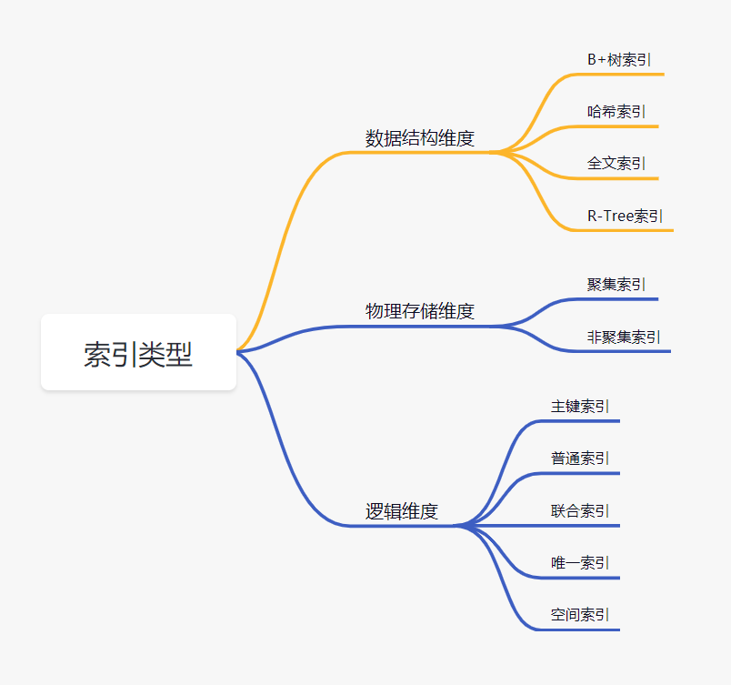
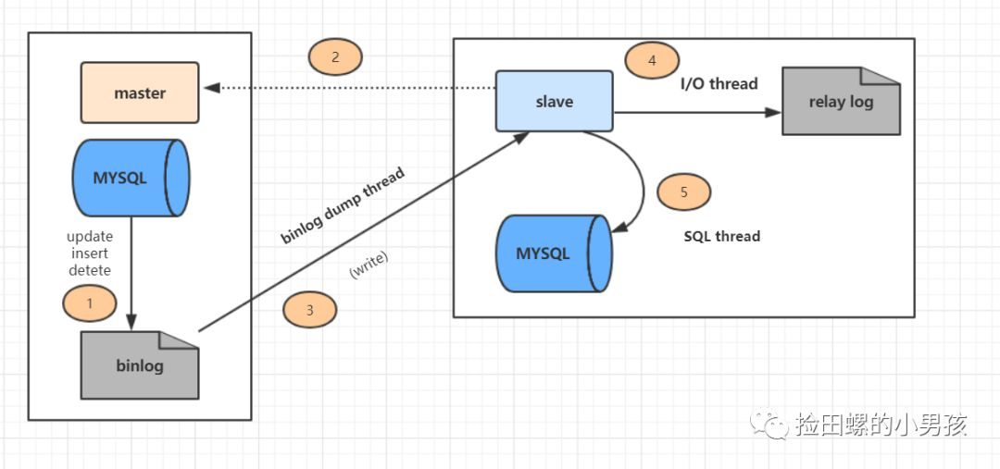
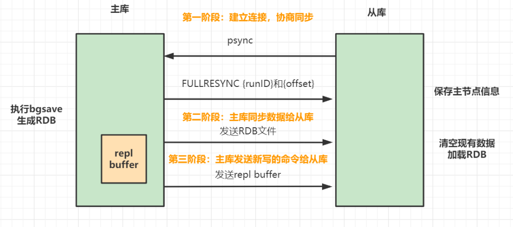
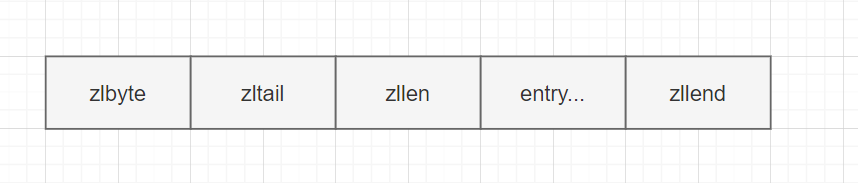
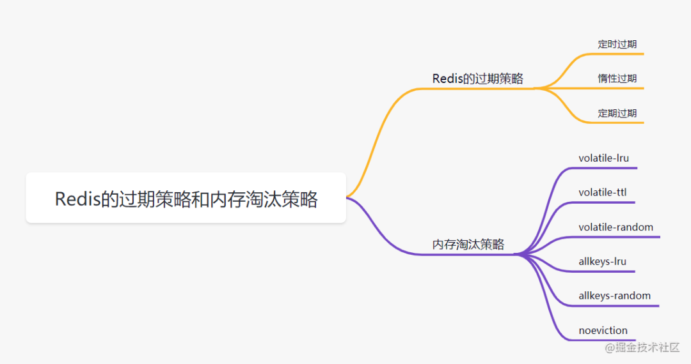

# 2022-社招后端21连问(三年工作经验一面)

## 1. Mysql索引在什么情况下会失效

- 查询条件包含or，可能导致索引失效

- 如何字段类型是字符串，where时一定用引号括起来，否则索引失效

- like通配符可能导致索引失效。

- 联合索引，查询时的条件列不是联合索引中的第一个列，索引失效。

- 在索引列上使用mysql的内置函数，索引失效。

- 对索引列运算（如，+、-、*、/），索引失效。

- 索引字段上使用（！= 或者 < >，not in）时，可能会导致索引失效。

- 索引字段上使用is null， is not null，可能导致索引失效。

- 左连接查询或者右连接查询查询关联的字段编码格式不一样，可能导致索引失效。

- mysql估计使用全表扫描要比使用索引快,则不使用索引。

## 2. MySql的存储引擎InnoDB与MyISAM的区别

- InnoDB支持事务，MyISAM不支持事务

- InnoDB支持外键，MyISAM不支持外键

- InnoDB 支持 MVCC(多版本并发控制)，MyISAM 不支持

- select count(*) from table时，MyISAM更快，因为它有一个变量保存了整个表的总行数，可以直接读取，InnoDB就需要全表扫描。

- Innodb不支持全文索引，而MyISAM支持全文索引（5.7以后的InnoDB也支持全文索引）

- InnoDB支持表、行级锁，而MyISAM支持表级锁。

- InnoDB表必须有主键，而MyISAM可以没有主键

- Innodb表需要更多的内存和存储，而MyISAM可被压缩，存储空间较小。

- Innodb按主键大小有序插入，MyISAM记录插入顺序是，按记录插入顺序保存。

## 3. mysql在项目中的优化场景，慢查询解决等

我们面对慢查询，首先想到的就是**加索引**。你可以给面试官描述一下，一个加了索引的SQL，是怎么执行查找的。

还有就是order by，group by原理，深分页等等，都跟慢查询息息相关。

最后就是慢查询的排查解决手段：

打开慢查询日志`slow_query_log`，确认SQL语句是否占用过多资源，用`explain`查询执行计划、对`group by、order by、join`等语句优化，如果数据量实在太大，是否考虑分库分表等等。

## 4. Mysql有什么索引，索引模型是什么



数据结构维度来讲的话，一般使用都是B+树索引。

## 5. B-树与B+树的区别？为什么不用红黑树

**B-树与B+树的区别：**

- B-树内部节点是保存数据的；而B+树内部节点是不保存数据的，只作索引作用，它的叶子节点才保存数据。

- B+树相邻的叶子节点之间是通过链表指针连起来的，B-树却不是。

- 查找过程中，B-树在找到具体的数值以后就结束，而B+树则需要通过索引找到叶子结点中的数据才结束

- B-树中任何一个关键字出现且只出现在一个结点中，而B+树可以出现多次。

**为什么索引结构默认使用B+树，而不是B-Tree，Hash哈希，二叉树，红黑树？**

- Hash哈希，只适合等值查询，不适合范围查询。

- 一般二叉树，可能会特殊化为一个链表，相当于全表扫描。

- 红黑树，是一种特化的平衡二叉树，MySQL 数据量很大的时候，索引的体积也会很大，内存放不下的而从磁盘读取，树的层次太高的话，读取磁盘的次数就多了。

- B-Tree，叶子节点和非叶子节点都保存数据，相同的数据量，B+树更矮壮，也是就说，相同的数据量，B+树数据结构，查询磁盘的次数会更少。

## 6. Mysql主从同步怎么做

大家要熟悉MySQL**主从复制原理**哈：

详细的主从复制过程如图：



上图主从复制过程分了五个步骤进行：

1. 主库的更新SQL(update、insert、delete)被写到binlog

2. 从库发起连接，连接到主库。

3. 此时主库创建一个`binlog dump thread`，把`binlog`的内容发送到从库。

4. 从库启动之后，创建一个`I/O`线程，读取主库传过来的`binlog`内容并写入到`relay log`

5. 从库还会创建一个SQL线程，从`relay log`里面读取内容，从`ExecMasterLog_Pos`位置开始执行读取到的更新事件，将更新内容写入到`slave`的db

主从同步这块呢，还涉及到**如何保证主从一致的**、**数据库主从延迟的原因与解决方案**、**数据库的高可用方案**。

## 7. 乐观锁与悲观锁的区别？

**悲观锁：**

悲观锁她专一且缺乏安全感了，她的心只属于当前事务，每时每刻都担心着它心爱的数据可能被别的事务修改，所以一个事务拥有（获得）悲观锁后，其他任何事务都不能对数据进行修改啦，只能等待锁被释放才可以执行。

`select ...for update`就是悲观锁一种实现。

**乐观锁：**

乐观锁的“乐观情绪”体现在，它认为数据的变动不会太频繁。因此，它允许多个事务同时对数据进行变动。实现方式：乐观锁一般会使用版本号机制或CAS算法实现。

## 8. 聊聊binlog日志

binlog是归档日志，属于**MySQL Server**层的日志。可以实现**主从复制和数据恢复**两个作用。当需要恢复数据时，可以取出某个时间范围内的binlog进行重放恢复即可。

binlog 日志有三种格式，分别是`statement，row和mixed`。

如果是`statement`格式，binlog记录的是**SQL的原文**，他可能会导致主库不一致(主库和从库选的索引不一样时)。我们来分析一下。假设主库执行删除这个SQL（其中`a和create_time`都有索引）如下：

```sql
delete from t where a > '666' and create_time<'2022-03-01' limit 1;
```

我们知道，数据选择了`a`索引和选择`create_time`索引，最后`limit 1`出来的数据一般是不一样的。所以就会存在这种情况：在binlog = `statement`格式时，主库在执行这条SQL时，使用的是索引a，而从库在执行这条SQL时，使用了索引`create_time`。最后主从数据不一致了。

**如何解决这个问题呢？**

可以把binlog格式修改为`row`。`row`格式的`binlog`日志，记录的不是**SQL原文**，而是两个`event:Table_map 和 Delete_rows`。Table_map event说明要操作的表，Delete_rows event用于定义要删除的行为，记录删除的具体行数。`row`格式的binlog记录的就是要删除的主键ID信息，因此不会出现主从不一致的问题。

但是如果SQL删除10万行数据，使用row格式就会很占空间的，10万条数据都在binlog里面，写binlog的时候也很耗IO。但是`statement`格式的binlog可能会导致数据不一致，因此设计MySQL的大叔想了一个折中的方案，`mixed`格式的binlog。所谓的mixed格式其实就是`row`和`statement`格式混合使用，当MySQL判断可能数据不一致时，就用`row`格式，否则使用就用`statement`格式。

## 9. Redis 持久化有哪几种方式，怎么选？

既然它是基于内存的，如果Redis服务器挂了，数据就会丢失。为了避免数据丢失了，Redis提供了两种持久化方式，**RDB和AOF**。

### 9.1 AOF 持久化

AOF（append only file） 持久化，采用日志的形式来记录每个写操作，追加到AOF文件的末尾。**Redis默认情况是不开启AOF的**。重启时再重新执行AOF文件中的命令来恢复数据。它主要解决数据持久化的实时性问题。

AOF是**执行完命令后才记录日志的**。为什么不先记录日志再执行命令呢？这是因为Redis在向AOF记录日志时，不会先对这些命令进行语法检查，如果先记录日志再执行命令，日志中可能记录了错误的命令，Redis使用日志回复数据时，可能会出错。

正是因为执行完命令后才记录日志，所以不会阻塞当前的写操作。但是会存在**两个风险**：

1. 执行完命令还没记录日志时，宕机了会导致数据丢失

2. AOF不会阻塞当前命令，但是可能会阻塞下一个操作。

这两个风险最好的解决方案是折中妙用**AOF机制的三种写回策略** `appendfsync`：

1. always，**同步写回**，每个子命令执行完，都立即将日志写回磁盘。

2. everysec，每个命令执行完，只是先把日志写到AOF内存缓冲区，每隔一秒同步到磁盘。

3. no：只是先把日志写到AOF内存缓冲区，由操作系统去决定何时写入磁盘。

`always`同步写回，可以基本保证数据不丢失，`no`策略则性能高但是数据可能会丢失，一般可以考虑折中选择`everysec`。

如果接受的命令越来越多，AOF文件也会越来越大，文件过大还是会带来性能问题。日志文件过大怎么办呢？**AOF重写机制**！就是随着时间推移，AOF文件会有一些冗余的命令如：无效命令、过期数据的命令等等，AOF重写机制就是把它们合并为一个命令（类似批处理命令），从而达到**精简压缩空间**的目的。

**AOF重写**会阻塞嘛？AOF日志是由主线程会写的，而重写则不一样，重写过程是由后台子进程**bgrewriteaof**完成。

- **AOF的优点**：数据的一致性和完整性更高，秒级数据丢失。

- **缺点**：相同的数据集，AOF文件体积大于RDB文件。数据恢复也比较慢。

### 9.2 RDB

因为AOF持久化方式，如果操作日志非常多的话，**Redis恢复就很慢**。有没有在宕机快速恢复的方法呢，有的，RDB！

**RDB**，就是把内存数据以**快照**的形式保存到磁盘上。和AOF相比，它记录的是某一时刻的数据，而不是操作。

> 什么是快照？可以这样理解，给当前时刻的数据，拍一张照片，然后保存下来。

RDB持久化，是指在指定的时间间隔内，执行指定次数的写操作，将内存中的数据集快照写入磁盘中，它是Redis默认的持久化方式。执行完操作后，在指定目录下会生成一个dump.rdb文件，Redis 重启的时候，通过加载dump.rdb文件来恢复数据。RDB触发机制主要有以下几种：


RDB通过`bgsave`命令的执行全量快照，可以**避免阻塞主线程**。basave命令会fork一个子进程，然后该子进程会负责创建RDB文件，而服务器进程会继续处理命令请求

**快照时，数据能修改嘛？**  Redis接住操作系统的写时复制技术（**copy-on-write，COW**）,在执行快照的同时，正常处理写操作。

虽然`bgsave`执行不会阻塞主线程，但是频繁执行全量快照也会带来性能开销。比如bgsave子进程需要通过fork操作从主线程创建出来，创建后不会阻塞主线程，但是创建过程是会阻塞主线程的。可以做**增量快照**。

- **RDB的优点**：与AOF相比，恢复大数据集的时候会更快，它适合大规模的数据恢复场景，如备份，全量复制等

- **缺点**：没办法做到实时持久化/秒级持久化。

Redis4.0开始支持**RDB和AOF的混合持久化**，就是内存快照以一定频率执行，两次快照之间，再使用AOF记录这期间的所有命令操作。

### 9.3 如何选择RDB和AOF

- 如果数据不能丢失，RDB和AOF混用

- 如果只作为缓存使用，可以承受几分钟的数据丢失的话，可以只使用RDB。

- 如果只使用AOF，优先使用everysec的写回策略。

## 10. Redis 主从同步是怎样的过程？



Redis主从同步包括三个阶段。

第一阶段：主从库间建立连接、协商同步。

> - 从库向主库发送`psync` 命令，告诉它要进行数据同步。
> 
> - 主库收到 `psync` 命令后,响应`FULLRESYNC`命令（它表示第一次复制采用的是全量复制），并带上主库`runID`和主库目前的复制进度`offset`。

第二阶段：主库把数据同步到从库，从库收到数据后，完成本地加载。

> - 主库执行`bgsave`命令，生成`RDB`文件，接着将文件发给从库。从库接收到`RDB` 文件后，会先清空当前数据库，然后加载 RDB 文件。
> 
> - 主库把数据同步到从库的过程中，新来的写操作，会记录到`replication buffer`。

第三阶段，主库把新写的命令，发送到从库。

> - 主库完成RDB发送后，会把`replication buffer`中的修改操作发给从库，从库再重新执行这些操作。这样主从库就实现同步啦。

## 11. 聊聊Redis的zset，它是怎么实现的？

`zset`是Redis常用数据类型之一，它的成员是有序排列的，一般用于排行榜类型的业务场景，比如 QQ 音乐排行榜、礼物排行榜等等。

- 它的简单格式举例：`zadd key score member [score member ...]，zrank key member`

- 它的底层内部编码：ziplist（压缩列表）、skiplist（跳跃表）

当 zset 满足以下条件时使用**压缩列表**：

- 当成员的数量小于128 个；

- 每个 member （成员）的字符串长度都小于 64 个字节。

**压缩列表**做简单介绍，它由以下五部分组成



- zlbytes 是一个无符号整数，表示当前ziplist占用的总字节数；

- zltail 指的是压缩列表尾部元素相对于压缩列表起始元素的偏移量。

- zllen 指 ziplist 中 entry 的数量。当 zllen 比2^16 - 2大时，需要完全遍历 entry 列表来获取 entry 的总数目。

- entry 用来存放具体的数据项（score和member），长度不定，可以是字节数组或整数，entry 会根据成员的数量自动扩容。-zlend 是一个单字节的特殊值，等于 255，起到标识 ziplist 内存结束点的作用。

skiplist（跳跃表）在链表的基础上，增加了多级索引，通过索引位置的几个跳转，实现数据的快速定位,其插入、删除、查找的时间复杂度均为 O(logN)。


## 12. Redis 过期策略和内存淘汰策略



### 12.1 Redis的过期策略

我们在set key的时候，可以给它设置一个过期时间，比如expire key 60。指定这key60s后过期，60s后，redis是如何处理的嘛？我们先来介绍几种过期策略哈：

一般有**定时过期、惰性过期、定期过期**三种。

- **定时过期**

每个设置过期时间的key都需要创建一个定时器，到过期时间就会立即对key进行清除。该策略可以立即清除过期的数据，对内存很友好；但是会占用大量的CPU资源去处理过期的数据，从而影响缓存的响应时间和吞吐量。

- **惰性过期**

只有当访问一个key时，才会判断该key是否已过期，过期则清除。该策略可以最大化地节省CPU资源，却对内存非常不友好。极端情况可能出现大量的过期key没有再次被访问，从而不会被清除，占用大量内存。

- **定期过期**

每隔一定的时间，会扫描一定数量的数据库的expires字典中一定数量的key，并清除其中已过期的key。该策略是前两者的一个折中方案。通过调整定时扫描的时间间隔和每次扫描的限定耗时，可以在不同情况下使得CPU和内存资源达到最优的平衡效果。

expires字典会保存所有设置了过期时间的key的过期时间数据，其中，key是指向键空间中的某个键的指针，value是该键的毫秒精度的UNIX时间戳表示的过期时间。键空间是指该Redis集群中保存的所有键。

Redis中同时使用了**惰性过期和定期过期**两种过期策略。

- 假设Redis当前存放30万个key，并且都设置了过期时间，如果你每隔100ms就去检查这全部的key，CPU负载会特别高，最后可能会挂掉。

- 因此，redis采取的是定期过期，每隔100ms就随机抽取一定数量的key来检查和删除的。

- 但是呢，最后可能会有很多已经过期的key没被删除。这时候，redis采用惰性删除。在你获取某个key的时候，redis会检查一下，这个key如果设置了过期时间并且已经过期了，此时就会删除。

但是呀，如果定期删除漏掉了很多过期的key，然后也没走惰性删除。就会有很多过期key积在内存内存，直接会导致内存爆的。或者有些时候，业务量大起来了，redis的key被大量使用，内存直接不够了，运维小哥哥也忘记加大内存了。难道redis直接这样挂掉？不会的！Redis用8种内存淘汰策略保护自己~

### 12.2 Redis 内存淘汰策略

- volatile-lru：当内存不足以容纳新写入数据时，从设置了过期时间的key中使用LRU（**最近最少使用**）算法进行淘汰；

- allkeys-lru：当内存不足以容纳新写入数据时，从所有key中使用LRU（最近最少使用）算法进行淘汰。

- volatile-lfu：4.0版本新增，当内存不足以容纳新写入数据时，在过期的key中，使用LFU（**最少访问算法**）进行删除key。

- allkeys-lfu：4.0版本新增，当内存不足以容纳新写入数据时，从所有key中使用LFU算法进行淘汰；

- volatile-random：当内存不足以容纳新写入数据时，从设置了**过期时间的key中**，随机淘汰数据；。

- allkeys-random：当内存不足以容纳新写入数据时，从所有key中随机淘汰数据。

- volatile-ttl：当内存不足以容纳新写入数据时，在设置了过期时间的key中，根据**过期时间进行淘汰，越早过期**的优先被淘汰；

- noeviction：默认策略，当内存不足以容纳新写入数据时，新写入操作会报错。