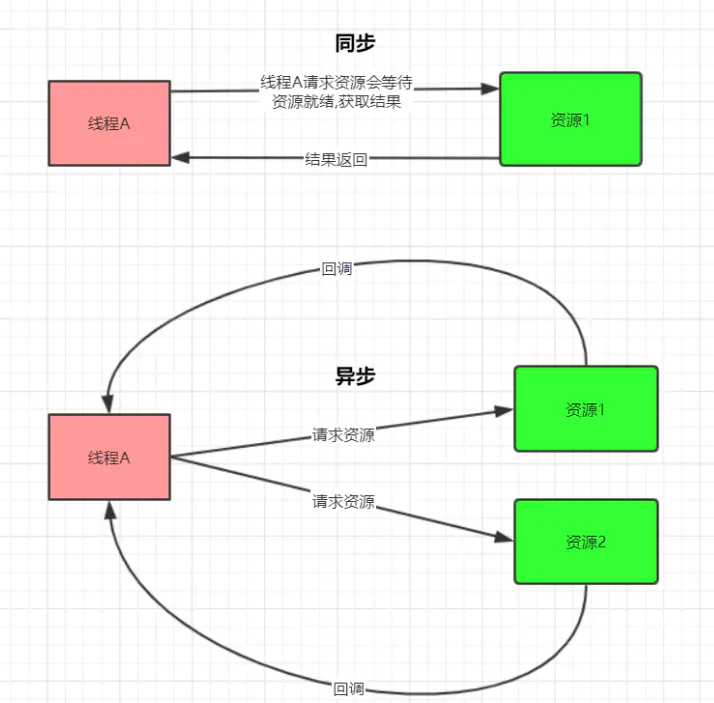

# Netty基础-Netty异步模型

[TOC]

## 1. 异步

异步的概念和同步相对，当一个异步过程调用发出后，调用者不能立刻得到结果。实际处理这个调用的组件在完成后，通过状态、通知和回调来通知调用。



Netty 中的 I/O 操作是异步的，包括 Bind、Write、Connect 等操作会简单的返回一个 ChannelFuture。调用者并不能立刻获得结果，而是通过 Future-Listener 机制，用户可以方便的主动获取或者通过通知机制获得IO 操作结果。Netty 的异步模型是建立在 future 和callback 的之上的。

callback 就是回调。重点说 Future，它的核心思想是：假设一个方法 fun，计算过程可能非常耗时，等待 fun 返回显然不合适。那么可以在调用 fun 的时候，立马返回一个 Future，后续可以通过 Future 去监控方法 fun 的处理过程(即 ： Future-Listener 机制)

## 2. Future 和 Future-Listener

### 1. Future

Future 表示异步的执行结果，可以通过它提供的方法来检测执行是否完成，ChannelFuture 是它的一个子接口。ChannelFuture 是一个接口，可以添加监听器，当监听的事件发生时，就会通知到监听器。

当 Future 对象刚刚创建时，处于非完成状态，调用者可以通过返回的 ChannelFuture 来获取操作执行的状态， 注册监听函数来执行完成后的操作。

常用方法有：

- sync 方法阻塞等待程序结果返回；
- isDone 方法来判断当前操作是否完成；
- isSuccess 方法来判断已完成的当前操作是否成功；
- getCause 方法来获取已完成的当前操作失败的原因；
- isCancelled 方法来判断已完成的当前操作是否被取消；
- addListener 方法来注册监听器，当操作已完成(isDone 方法返回完成)，将会通知指定的监听器；如果Future 对象已完成，则通知指定的监听器

### 2. Future-Listener 机制

给Future添加监听器,监听操作结果

```java
ChannelFuture future = bootstrap.bind(9999);
future.addListener(new ChannelFutureListener() { 
  @Override 
  public void operationComplete(ChannelFuture future) throws Exception{ 
    if (future.isSuccess()){ 
      System.out.println("端口绑定成功!"); 
    } else { 
      System.out.println("端口绑定失败!"); 
    } 
  } 
});
```

