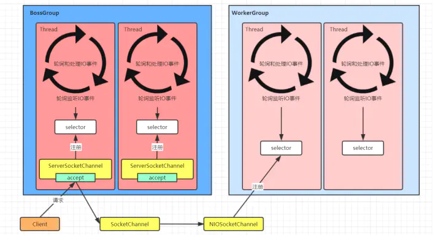
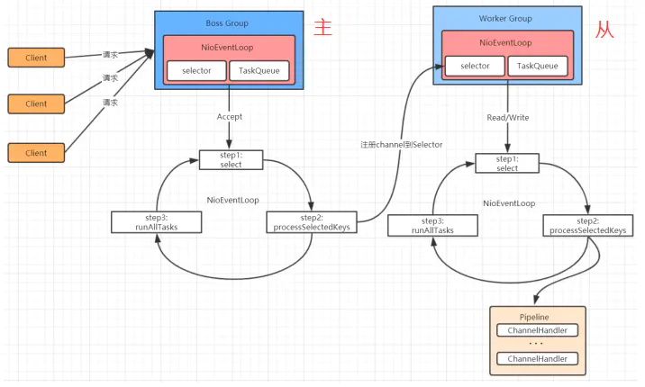

# Netty基础-Netty线程模型

<!-- START doctoc generated TOC please keep comment here to allow auto update -->
<!-- DON'T EDIT THIS SECTION, INSTEAD RE-RUN doctoc TO UPDATE -->

- [1. 简单版Netty模型](#1-%E7%AE%80%E5%8D%95%E7%89%88netty%E6%A8%A1%E5%9E%8B)
- [2. 进阶版Netty模型](#2-%E8%BF%9B%E9%98%B6%E7%89%88netty%E6%A8%A1%E5%9E%8B)
- [3. 详细版Netty模型](#3-%E8%AF%A6%E7%BB%86%E7%89%88netty%E6%A8%A1%E5%9E%8B)

<!-- END doctoc generated TOC please keep comment here to allow auto update -->

[TOC]

Netty 的设计主要基于主从 Reactor 多线程模式，并有一定的优化，逐步递进来讲一下Netty模型

## 1. 简单版Netty模型

- BossGroup 线程维护 Selector，ServerSocketChannel 注册到这个 Selector 上，只关注连接建立请求事件（主 Reactor）
 - 当接收到来自客户端的连接建立请求事件的时候，通过 ServerSocketChannel.accept 方法获得对应的 SocketChannel，并封装成 NioSocketChannel 注册到 WorkerGroup 线程中的 Selector，每个 Selector 运行在一个线程中（从 Reactor）
 - 当 WorkerGroup 线程中的 Selector 监听到自己感兴趣的 IO 事件后，就调用 Handler 进行处理

## 2. 进阶版Netty模型

- 有两组线程池：BossGroup 和 WorkerGroup，BossGroup 中的线程专门负责和客户端建立连接，WorkerGroup 中的线程专门负责处理连接上的读写
 - BossGroup 和 WorkerGroup 含有多个不断循环的执行事件处理的线程，每个线程都包含一个 Selector，用于监听注册在其上的 Channel
 - 每个 BossGroup 中的线程循环执行以下三个步骤：

1. 轮询注册在其上的 ServerSocketChannel 的 accept 事件（OP_ACCEPT 事件）
2. 处理 accept 事件，与客户端建立连接，生成一个 NioSocketChannel，并将其注册到WorkerGroup 中某个线程上的 Selector 上
3. 再去以此循环处理任务队列中的下一个事件

- 每个 WorkerGroup 中的线程循环执行以下三个步骤

1. 轮询注册在其上的 NioSocketChannel 的 read/write 事件（OP_READ/OP_WRITE 事件）
 2. 在对应的 NioSocketChannel 上处理 read/write 事件
 3. 再去以此循环处理任务队列中的下一个事件

## 3. 详细版Netty模型

- Netty 抽象出两组线程池：BossGroup 和 WorkerGroup，也可以叫做BossNioEventLoopGroup 和 WorkerNioEventLoopGroup。每个线程池中都有NioEventLoop 线程。BossGroup 中的线程专门负责和客户端建立连接，WorkerGroup 中的线程专门负责处理连接上的读写。BossGroup 和 WorkerGroup 的类型都是NioEventLoopGroup
 - NioEventLoopGroup 相当于一个事件循环组，这个组中含有多个事件循环，每个事件循环就是一个 NioEventLoop
 - NioEventLoop 表示一个不断循环的执行事件处理的线程，每个 NioEventLoop 都包含一个Selector，用于监听注册在其上的 Socket 网络连接（Channel）
 - NioEventLoopGroup 可以含有多个线程，即可以含有多个 NioEventLoop
 - 每个 BossNioEventLoop 中循环执行以下三个步骤：

1. Selector：轮询注册在其上的 ServerSocketChannel 的 accept 事件（OP_ACCEPT 事件）
2. processSelectedKeys：处理 accept 事件，与客户端建立连接，生成一个NioSocketChannel，并将其注册到某个 WorkerNioEventLoop 上的 Selector 上
3. runAllTasks：再去以此循环处理任务队列中的其他任务

- 每个 WorkerNioEventLoop 中循环执行以下三个步骤：

1. Selector：轮询注册在其上的 NioSocketChannel 的 read/write 事件（OP_READ/OP_WRITE 事件）
2. processSelectedKeys：在对应的 NioSocketChannel 上处理 read/write 事件
3. runAllTasks：再去以此循环处理任务队列中的其他任务

- 在以上两个processSelectedKeys步骤中，会使用 Pipeline（管道），Pipeline 中引用了 Channel，即通过 Pipeline 可以获取到对应的 Channel，Pipeline 中维护了很多的处理器（拦截处理器、过滤处理器、自定义处理器等）。

