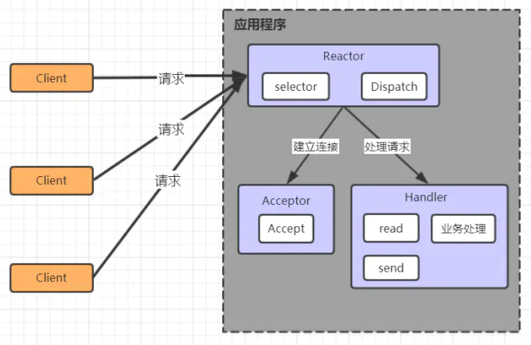
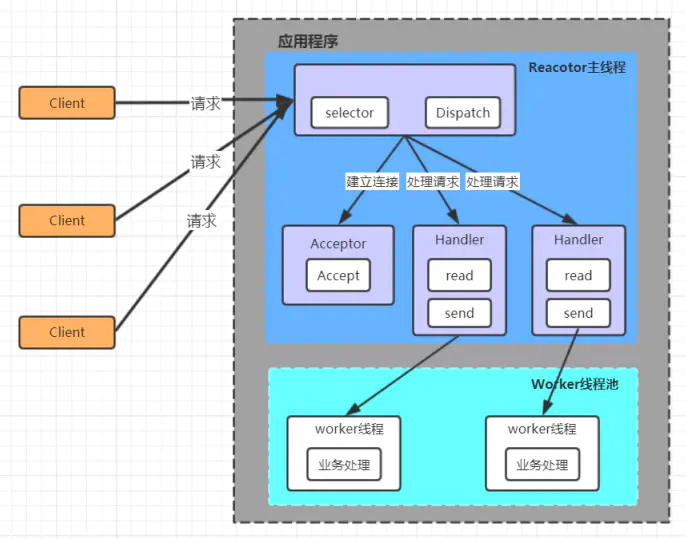
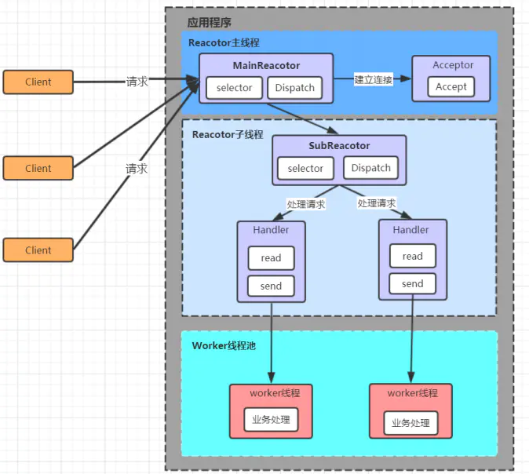

# Netty基础-Reactor模型

<!-- START doctoc generated TOC please keep comment here to allow auto update -->
<!-- DON'T EDIT THIS SECTION, INSTEAD RE-RUN doctoc TO UPDATE -->

    - [1. 线程模型基本介绍](#1-%E7%BA%BF%E7%A8%8B%E6%A8%A1%E5%9E%8B%E5%9F%BA%E6%9C%AC%E4%BB%8B%E7%BB%8D)
    - [2. 单Reactor单线程](#2-%E5%8D%95reactor%E5%8D%95%E7%BA%BF%E7%A8%8B)
    - [3. 单Reactor多线程](#3-%E5%8D%95reactor%E5%A4%9A%E7%BA%BF%E7%A8%8B)
    - [4. 主从Reactor多线程](#4-%E4%B8%BB%E4%BB%8Ereactor%E5%A4%9A%E7%BA%BF%E7%A8%8B)

<!-- END doctoc generated TOC please keep comment here to allow auto update -->

[TOC]

## 1. 线程模型基本介绍

不同的线程模式，对程序的性能有很大影响，在学习Netty线程模式之前，首先讲解下各个线程模式， 最后看看 Netty 线程模型有什么优越性。

目前存在的线程模型有：

 - 传统阻塞 I/O 服务模型
 - Reactor 模型

根据 Reactor 的数量和处理资源池线程的数量不同，有 3 种典型的实现：

- 单 Reactor 单线程
- 单 Reactor 多线程
- 主从 Reactor 多线程

## 2. 单Reactor单线程

- Selector 可以实现应用程序通过一个阻塞对象监听多路连接请求
 - Reactor 对象通过 Selector 监控客户端请求事件，收到事件后通过 Dispatch 进行分发是建立连接请求事件，则由 Acceptor 通过 Accept 处理连接请求，然后创建一个 Handler 对象处理连接完成后的后续业务处理
 - Handler 会完成 Read→业务处理→Send 的完整业务流程

优点: 模型简单，没有多线程、进程通信、竞争的问题，全部都在一个线程中完成

缺点:

1. 性能问题: 只有一个线程，无法完全发挥多核 CPU 的性能。Handler 在处理某个连接上的业务时，整个进程无法处理其他连接事件，很容易导致性能瓶颈
2. 可靠性问题: 线程意外终止或者进入死循环，会导致整个系统通信模块不可用，不能接收和处理外部消息，造成节点故障

## 3. 单Reactor多线程

- Reactor 对象通过 Selector 监控客户端请求事件, 收到事件后，通过 Dispatch 进行分发
 - 如果建立连接请求, 则右 Acceptor 通过accept 处理连接请求
 - 如果不是连接请求，则由 reactor 分发调用连接对应的 handler 来处理
 - handler 只负责响应事件，不做具体的业务处理, 通过 read 读取数据后，会分发给后面的worker 线程池的某个线程处理业务
 - worker 线程池会分配独立线程完成真正的业务，并将结果返回给 handler
 - handler 收到响应后，通过 send 将结果返回给 client

优点：
可以充分的利用多核 cpu 的处理能力
缺点：
多线程数据共享和访问比较复杂， reactor 处理所有的事件的监听和响应，在单线程运行， 在高并发场景容易出现性能瓶颈

## 4. 主从Reactor多线程

- Reactor 主线程 MainReactor 对象通过 Selector 监听客户端连接事件，收到事件后，通过Acceptor 处理客户端连接事件
 - 当 Acceptor 处理完客户端连接事件之后（与客户端建立好 Socket 连接），MainReactor 将连接分配给 SubReactor。（即：MainReactor 只负责监听客户端连接请求，和客户端建立连接之后将连接交由 SubReactor 监听后面的 IO 事件。)
 - SubReactor 将连接加入到自己的连接队列进行监听，并创建 Handler 对各种事件进行处理当连接上有新事件发生的时候，SubReactor 就会调用对应的 Handler 处理
 - Handler 通过 read 从连接上读取请求数据，将请求数据分发给 Worker 线程池进行业务处理
 - Worker 线程池会分配独立线程来完成真正的业务处理，并将处理结果返回给 Handler。Handler 通过 send 向客户端发送响应数据
 - 一个 MainReactor 可以对应多个 SubReactor，即一个 MainReactor 线程可以对应多个 SubReactor 线程

优点:

1. MainReactor 线程与 SubReactor 线程的数据交互简单职责明确，MainReactor 线程只需要接收新连接，SubReactor 线程完成后续的业务处理
2. MainReactor 线程与 SubReactor 线程的数据交互简单， MainReactor 线程只需要把新连接传给 SubReactor 线程，SubReactor 线程无需返回数据
3. 多个 SubReactor 线程能够应对更高的并发请求

缺点:

这种模式的缺点是编程复杂度较高。但是由于其优点明显，在许多项目中被广泛使用，包括Nginx、Memcached、Netty 等。这种模式也被叫做服务器的 1+M+N 线程模式，即使用该模式开发的服务器包含一个（或多个，1 只是表示相对较少）连接建立线程+M 个 IO 线程+N 个业务处理线程。这是业界成熟的服务器程序设计模式。

