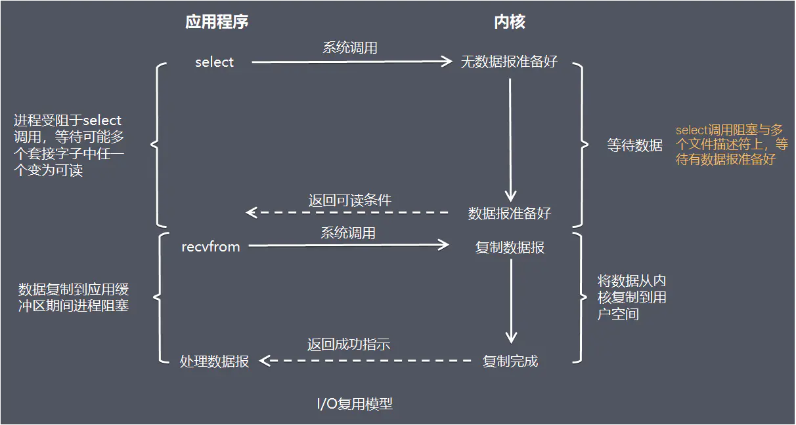
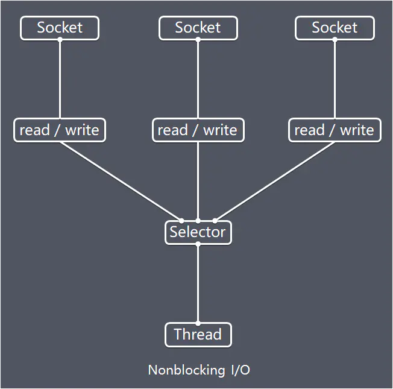
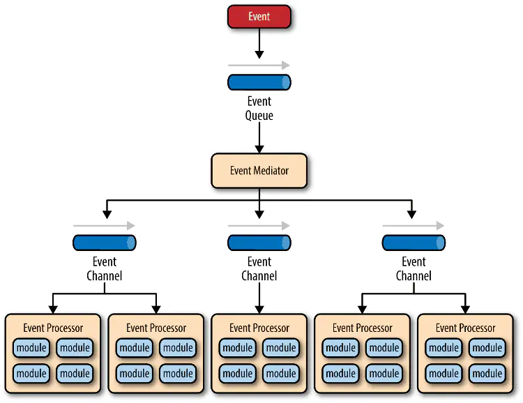
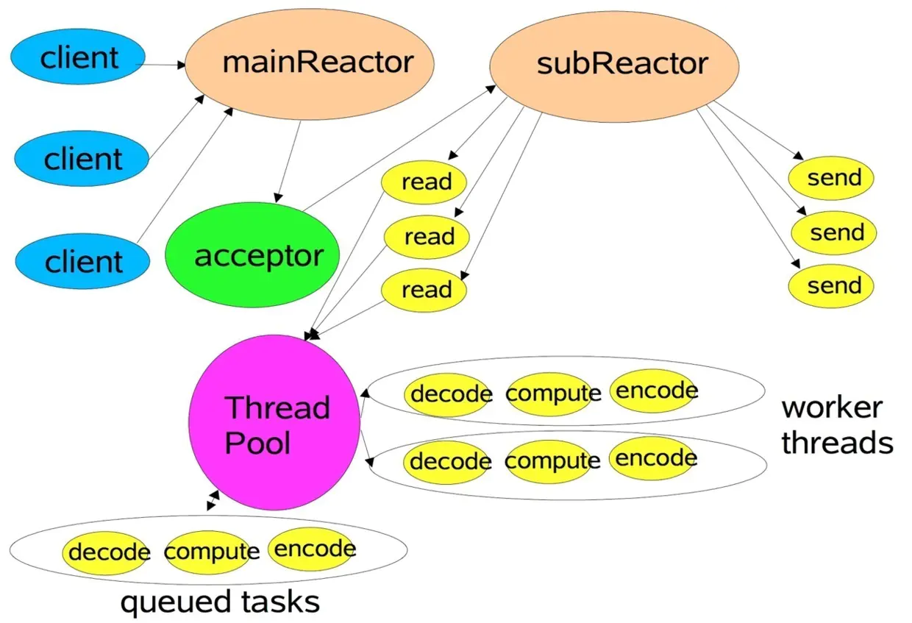

# Netty模型架构

[TOC]

## 一、Netty简介

Netty是 一个异步事件驱动的网络应用程序框架，用于快速开发可维护的高性能协议服务器和客户端。

### 1. JDK原生NIO程序的问题

JDK原生也有一套网络应用程序API，但是存在一系列问题，主要如下：

- NIO的类库和API繁杂，使用麻烦，你需要熟练掌握Selector、ServerSocketChannel、SocketChannel、ByteBuffer等
- 需要具备其它的额外技能做铺垫，例如熟悉Java多线程编程，因为NIO编程涉及到Reactor模式，你必须对多线程和网路编程非常熟悉，才能编写出高质量的NIO程序
- 可靠性能力补齐，开发工作量和难度都非常大。例如客户端面临断连重连、网络闪断、半包读写、失败缓存、网络拥塞和异常码流的处理等等，NIO编程的特点是功能开发相对容易，但是可靠性能力补齐工作量和难度都非常大
- JDK NIO的BUG，例如臭名昭著的epoll bug，它会导致Selector空轮询，最终导致CPU 100%。官方声称在JDK1.6版本的update18修复了该问题，但是直到JDK1.7版本该问题仍旧存在，只不过该bug发生概率降低了一些而已，它并没有被根本解决

### 2. Netty的特点

Netty的对JDK自带的NIO的API进行封装，解决上述问题，主要特点有：

- 设计优雅 
  - 适用于各种传输类型的统一API - 阻塞和非阻塞Socket 基于灵活且可扩展的事件模型，可以清晰地分离关注点 
  - 高度可定制的线程模型 - 单线程，一个或多个线程池 
  - 真正的无连接数据报套接字支持（自3.1起）
- 使用方便 详细记录的Javadoc，用户指南和示例 没有其他依赖项，JDK 5（Netty 3.x）或6（Netty 4.x）就足够了
- 高性能 吞吐量更高，延迟更低 减少资源消耗 最小化不必要的内存复制
- 安全 完整的SSL / TLS和StartTLS支持
- 社区活跃，不断更新 社区活跃，版本迭代周期短，发现的BUG可以被及时修复，同时，更多的新功能会被加入

### 3. Netty常见使用常见

互联网行业 在分布式系统中，各个节点之间需要远程服务调用，高性能的RPC框架必不可少，Netty作为异步高新能的通信框架,往往作为基础通信组件被这些RPC框架使用。 典型的应用有：阿里分布式服务框架Dubbo的RPC框架使用Dubbo协议进行节点间通信，Dubbo协议默认使用Netty作为基础通信组件，用于实现各进程节点之间的内部通信。

游戏行业 无论是手游服务端还是大型的网络游戏，Java语言得到了越来越广泛的应用。Netty作为高性能的基础通信组件，它本身提供了TCP/UDP和HTTP协议栈。 非常方便定制和开发私有协议栈，账号登录服务器，地图服务器之间可以方便的通过Netty进行高性能的通信

大数据领域 经典的Hadoop的高性能通信和序列化组件Avro的RPC框架，默认采用Netty进行跨界点通信，它的Netty Service基于Netty框架二次封装实现

## 二、Netty高性能设计

Netty作为异步事件驱动的网络，高性能之处主要来自于其I/O模型和线程处理模型，前者决定如何收发数据，后者决定如何处理数据

### 1. I/O模型

用什么样的通道将数据发送给对方，BIO、NIO或者AIO，I/O模型在很大程度上决定了框架的性能

#### 1. 阻塞I/O

传统阻塞型I/O(BIO)可以用下图表示：

示意图.png)

**特点**

每个请求都需要独立的线程完成数据read，业务处理，数据write的完整操作

**问题**

- 当并发数较大时，需要创建大量线程来处理连接，系统资源占用较大
- 连接建立后，如果当前线程暂时没有数据可读，则线程就阻塞在read操作上，造成线程资源浪费

#### 2. I/O复用模型



在I/O复用模型中，会用到select，这个函数也会使进程阻塞，但是和阻塞I/O所不同的的，这两个函数可以同时阻塞多个I/O操作，而且可以同时对多个读操作，多个写操作的I/O函数进行检测，直到有数据可读或可写时，才真正调用I/O操作函数

Netty的非阻塞I/O的实现关键是基于I/O复用模型，这里用Selector对象表示：



Netty的IO线程NioEventLoop由于聚合了多路复用器Selector，可以同时并发处理成百上千个客户端连接。当线程从某客户端Socket通道进行读写数据时，若没有数据可用时，该线程可以进行其他任务。线程通常将非阻塞 IO 的空闲时间用于在其他通道上执行 IO 操作，所以单独的线程可以管理多个输入和输出通道。

由于读写操作都是非阻塞的，这就可以充分提升IO线程的运行效率，避免由于频繁I/O阻塞导致的线程挂起，一个I/O线程可以并发处理N个客户端连接和读写操作，这从根本上解决了传统同步阻塞I/O一连接一线程模型，架构的性能、弹性伸缩能力和可靠性都得到了极大的提升。

#### 3. 基于buffer

传统的I/O是面向字节流或字符流的，以流式的方式顺序地从一个Stream 中读取一个或多个字节, 因此也就不能随意改变读取指针的位置。

在NIO中, 抛弃了传统的 I/O流, 而是引入了Channel和Buffer的概念. 在NIO中, 只能从Channel中读取数据到Buffer中或将数据 Buffer 中写入到 Channel。

基于buffer操作不像传统IO的顺序操作, NIO 中可以随意地读取任意位置的数据

### 2. 线程模型

数据报如何读取？读取之后的编解码在哪个线程进行，编解码后的消息如何派发，线程模型的不同，对性能的影响也非常大。

#### 1. 事件驱动模型

通常，我们设计一个事件处理模型的程序有两种思路

- 轮询方式：线程不断轮询访问相关事件发生源有没有发生事件，有发生事件就调用事件处理逻辑。
- 事件驱动方式：发生事件，主线程把事件放入事件队列，在另外线程不断循环消费事件列表中的事件，调用事件对应的处理逻辑处理事件。事件驱动方式也被称为消息通知方式，其实是设计模式中**观察者模式**的思路。

以GUI的逻辑处理为例，说明两种逻辑的不同：

- 轮询方式 线程不断轮询是否发生按钮点击事件，如果发生，调用处理逻辑
- 事件驱动方式 发生点击事件把事件放入事件队列，在另外线程消费的事件列表中的事件，根据事件类型调用相关事件处理逻辑



主要包括4个基本组件：


- 事件队列（event queue）：接收事件的入口，存储待处理事件
- 分发器（event mediator）：将不同的事件分发到不同的业务逻辑单元
- 事件通道（event channel）：分发器与处理器之间的联系渠道
- 事件处理器（event processor）：实现业务逻辑，处理完成后会发出事件，触发下一步操作

可以看出，相对传统轮询模式，事件驱动有如下优点：

- 可扩展性好，分布式的异步架构，事件处理器之间高度解耦，可以方便扩展事件处理逻辑
- 高性能，基于队列暂存事件，能方便并行异步处理事件

#### 2. Reactor线程模型

Reactor是反应堆的意思，Reactor模型，是指通过一个或多个输入同时传递给服务处理器的服务请求的**事件驱动处理模式**。 服务端程序处理传入多路请求，并将它们同步分派给请求对应的处理线程，Reactor模式也叫Dispatcher模式，即I/O多了复用统一监听事件，收到事件后分发(Dispatch给某进程)，是编写高性能网络服务器的必备技术之一。

Reactor模型中有2个关键组成：

- Reactor：Reactor在一个单独的线程中运行，负责监听和分发事件，分发给适当的处理程序来对IO事件做出反应。 它就像公司的电话接线员，它接听来自客户的电话并将线路转移到适当的联系人
- Handlers：处理程序执行I/O事件要完成的实际事件，类似于客户想要与之交谈的公司中的实际官员。Reactor通过调度适当的处理程序来响应I/O事件，处理程序执行非阻塞操作


取决于Reactor的数量和Hanndler线程数量的不同，Reactor模型有3个变种

- 单Reactor单线程
- 单Reactor多线程
- 主从Reactor多线程

可以这样理解，Reactor就是一个执行while (true) { selector.select(); ...}循环的线程，会源源不断的产生新的事件，称作反应堆很贴切。

#### 3. Netty线程模型

Netty主要**基于主从Reactors多线程模型**（如下图）做了一定的修改，其中主从Reactor多线程模型有多个Reactor：MainReactor和SubReactor：

- MainReactor负责客户端的连接请求，并将请求转交给SubReactor
- SubReactor负责相应通道的IO读写请求
- 非IO请求（具体逻辑处理）的任务则会直接写入队列，等待worker threads进行处理



特别说明的是： 虽然Netty的线程模型基于主从Reactor多线程，借用了MainReactor和SubReactor的结构，但是实际实现上，SubReactor和Worker线程在同一个线程池中：

```java
EventLoopGroup bossGroup = new NioEventLoopGroup();
EventLoopGroup workerGroup = new NioEventLoopGroup();
ServerBootstrap server = new ServerBootstrap();
server.group(bossGroup, workerGroup)
 .channel(NioServerSocketChannel.class)
```

上面代码中的bossGroup和workerGroup是Bootstrap构造方法中传入的两个对象，这两个group均是线程池

- bossGroup线程池则只是在bind某个端口后，获得其中一个线程作为MainReactor，专门处理端口的accept事件，**每个端口对应一个boss线程**
- workerGroup线程池会被各个SubReactor和worker线程充分利用

#### 4. 异步处理

异步的概念和同步相对。当一个异步过程调用发出后，调用者不能立刻得到结果。实际处理这个调用的部件在完成后，通过状态、通知和回调来通知调用者。

Netty中的I/O操作是异步的，包括bind、write、connect等操作会简单的返回一个ChannelFuture，调用者并不能立刻获得结果，通过Future-Listener机制，用户可以方便的主动获取或者通过通知机制获得IO操作结果。

当future对象刚刚创建时，处于非完成状态，调用者可以通过返回的ChannelFuture来获取操作执行的状态，注册监听函数来执行完成后的操，常见有如下操作：

- 通过isDone方法来判断当前操作是否完成
- 通过isSuccess方法来判断已完成的当前操作是否成功
- 通过getCause方法来获取已完成的当前操作失败的原因
- 通过isCancelled方法来判断已完成的当前操作是否被取消
- 通过addListener方法来注册监听器，当操作已完成(isDone方法返回完成)，将会通知指定的监听器；如果future对象已完成，则理解通知指定的监听器

例如下面的的代码中绑定端口是异步操作，当绑定操作处理完，将会调用相应的监听器处理逻辑

```java
serverBootstrap.bind(port).addListener(future -> {
    if (future.isSuccess()) {
      System.out.println(new Date() + ": 端口[" + port + "]绑定成功!");
    } else {
      System.err.println("端口[" + port + "]绑定失败!");
    }
});
```

相比传统阻塞I/O，执行I/O操作后线程会被阻塞住, 直到操作完成；异步处理的好处是不会造成线程阻塞，线程在I/O操作期间可以执行别的程序，在高并发情形下会更稳定和更高的吞吐量。

