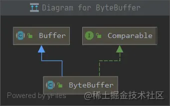
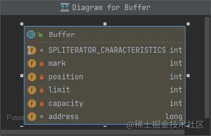
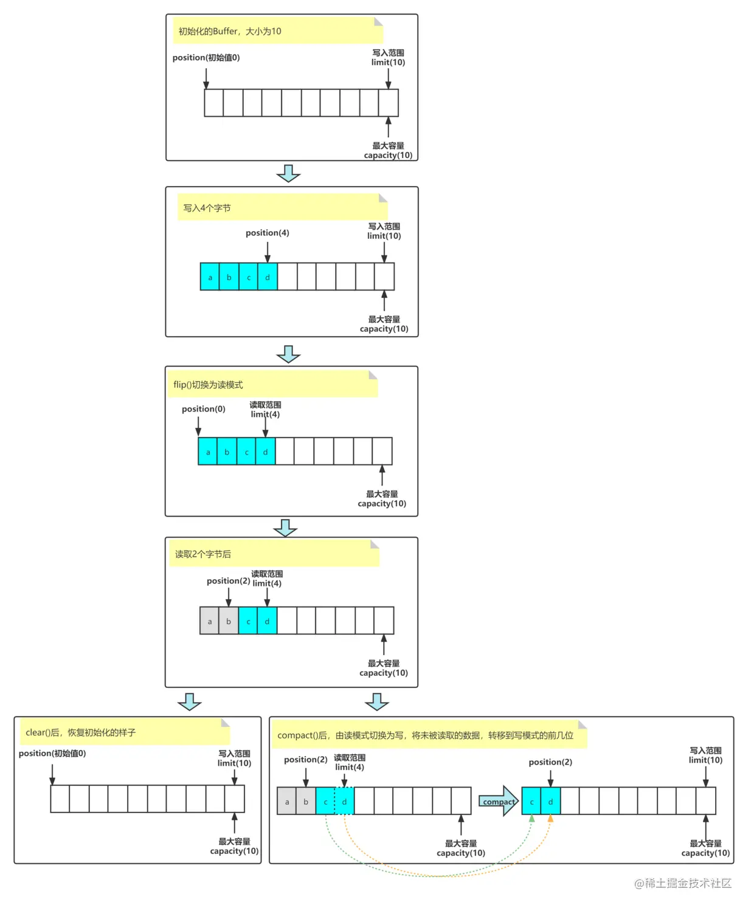
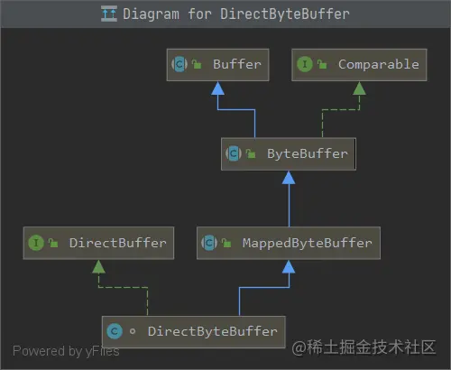
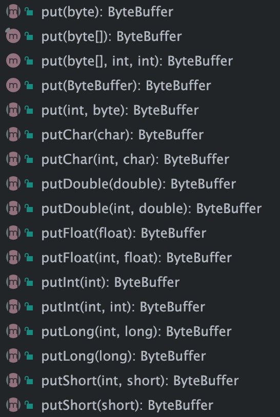
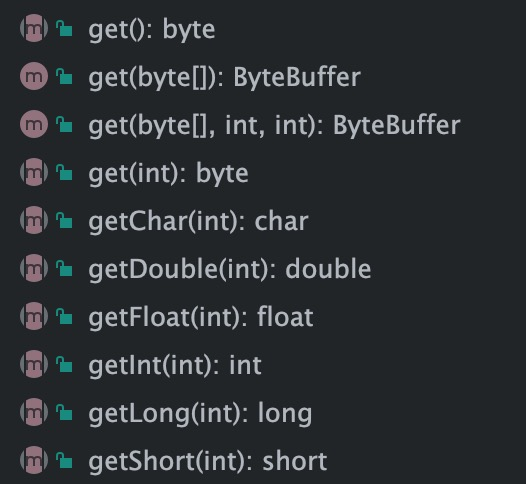

# nio之ByteBuffer

<!-- START doctoc generated TOC please keep comment here to allow auto update -->
<!-- DON'T EDIT THIS SECTION, INSTEAD RE-RUN doctoc TO UPDATE -->

- [零、使用案例](#%E9%9B%B6%E4%BD%BF%E7%94%A8%E6%A1%88%E4%BE%8B)
- [一、ByteBuffer代码分析](#%E4%B8%80bytebuffer%E4%BB%A3%E7%A0%81%E5%88%86%E6%9E%90)
    - [1. Buffer类](#1-buffer%E7%B1%BB)
    - [2. Buffer读写模型](#2-buffer%E8%AF%BB%E5%86%99%E6%A8%A1%E5%9E%8B)
    - [3. Buffer主要方法](#3-buffer%E4%B8%BB%E8%A6%81%E6%96%B9%E6%B3%95)
- [二、Comparable接口](#%E4%BA%8Ccomparable%E6%8E%A5%E5%8F%A3)
- [三、ByteBuffer](#%E4%B8%89bytebuffer)
    - [1. 初始化](#1-%E5%88%9D%E5%A7%8B%E5%8C%96)
    - [2. ByteBuffer写入](#2-bytebuffer%E5%86%99%E5%85%A5)
    - [3. ByteBuffer读取](#3-bytebuffer%E8%AF%BB%E5%8F%96)
    - [4. ByteBuffer与字符串互换](#4-bytebuffer%E4%B8%8E%E5%AD%97%E7%AC%A6%E4%B8%B2%E4%BA%92%E6%8D%A2)
    - [5. 分散读写(多个Buffer同时写入或读取)](#5-%E5%88%86%E6%95%A3%E8%AF%BB%E5%86%99%E5%A4%9A%E4%B8%AAbuffer%E5%90%8C%E6%97%B6%E5%86%99%E5%85%A5%E6%88%96%E8%AF%BB%E5%8F%96)

<!-- END doctoc generated TOC please keep comment here to allow auto update -->

## 零、使用案例

```java
import java.io.IOException;
import java.io.RandomAccessFile;
import java.nio.ByteBuffer;
import java.nio.channels.FileChannel;

/**
 * @description: ByteBuffer使用演示
 * @author: panhongtong
 * @date: 2022/4/21 08:55
 **/
public class ByteBufferDemo {

    public static void main(String[] args) {
        // 提前准备好文件，并向文件中写入内容
        try (RandomAccessFile file = new RandomAccessFile("/Users/panhongtong/mydir/text.txt", "rw")) {
            FileChannel channel = file.getChannel();
            //申请大小为10的buffer
            ByteBuffer buffer = ByteBuffer.allocate(10);
            do {
                // 向 buffer 写入
                int len = channel.read(buffer);
                System.out.println("\n读到字节数：" + len);
                if (len == -1) {
                    break;
                }
                // 切换 buffer 读模式
                buffer.flip();
                while (buffer.hasRemaining()) {
                    System.out.print((char) buffer.get() + " ");
                }
                // 切换 buffer 写模式
                buffer.clear();
            } while (true);
        } catch (IOException e) {
            e.printStackTrace();
        }
    }

}
```

输出如下：

```textile
读到字节数：10
1 2 3 4 5 6 7 8 9 0 
读到字节数：5
a b c d e 
读到字节数：-1
```

根据上面的使用案例，我们可以总结出以下使用buffer的正确姿势：

1. 向 buffer 写入数据，例如调用 channel.read(buffer)
2. 调用 flip() 方法，将buffer切换至**读模式**
3. 调用 buffer.get()方法，从 buffer 读取数据
4. 调用 clear() 或 compact() 切换至**写模式**，其中clear()会覆盖buffer内的数据，而compact()会在原数据基础上继续写
5. 循环重复 1~4 的步骤

## 一、ByteBuffer代码分析

上一文中已经基本说明了关于bytebuffer 的基础内容，本章节简单分析下其源码，助于我们理解和学习。

看下其类图：



从上图看到其继承了Buffer类，实现了Comparable接口。

### 1. Buffer类

看下buffer中有主要几个属性：



- mark：记录当前读或写的位置。
- position：下一个位置。
- limit：范围。
- capacity：Buffer的容量，创建时候指定，不能修改。
- address：直接内存的地址。

### 2. Buffer读写模型

关于整个的读写模型，直接放图了：



### 3. Buffer主要方法

**构造方法**：指定mark，position，limit，capacity等属性，如果capacity小于0，或者mark比pos大的话，则抛出异常。

```java
    Buffer(int mark, int pos, int lim, int cap) {       // package-private
        if (cap < 0)
            throw new IllegalArgumentException("Negative capacity: " + cap);
        this.capacity = cap;
        limit(lim);
        position(pos);
        if (mark >= 0) {
            if (mark > pos)
                throw new IllegalArgumentException("mark > position: ("
                                                   + mark + " > " + pos + ")");
            this.mark = mark;
        }
    }
```

**limit(lim)方法** ：指定新的范围，如果大于容量，或范围小于0，则抛出异常。如果当前位置大于设置的范围，就把范围赋值个position。如果mark大于范围，则还原mark为-1。**倒数两个判断通常只会发生在，新的limit小于原limit的情况**。

```java
    public final Buffer limit(int newLimit) {
        if ((newLimit > capacity)|| (newLimit < 0))
            throw new IllegalArgumentException();
        limit = newLimit;
        if (position > limit) position = limit;
        if (mark > limit) mark = -1;
        return this;
    }
```

**position(pos)方法**：如果新的postion大于limit或小于0，则从抛出异常。如果mark大于position，则还原mark为-1。

```java
    public final Buffer position(int newPosition) {
        if ((newPosition > limit) || (newPosition < 0))
            throw new IllegalArgumentException();
        position = newPosition;
        if (mark > position) mark = -1;
        return this;
    }
```

**mark()方法**：将当前的位置，手动设置一个mark标记，通常配置reset()方法使用。

```java
    public final Buffer mark() {
        mark = position;
        return this;
    }
```

**reset()方法**：当我们使用mark()方法对position进行标记后，使用reset方法，可以将标记后的mark赋值给position。

```java
    public final Buffer reset() {
        int m = mark;
        if (m < 0)
            throw new InvalidMarkException();
        position = m;
        return this;
    }
```

**flip()方法**：将缓冲区切换为读模式，可以结合前面的图看一下，将数据存在的最大position设置为limit，将position设置为0，丢弃mark。

```java
    public final Buffer flip() {
        limit = position;
        position = 0;
        mark = -1;
        return this;
    }
```

**rewind()方法**：此方法用于，当buffer已经读取部分数据或者全部数据后，重置buffer，使其位置重新开始，抛弃mark。

```java
    public final Buffer rewind() {
        position = 0;
        mark = -1;
        return this;
    }
```

**remaining()方法**：返回当前buffer中的剩余容量。

```java
   public final int remaining() {
        return limit - position;
    }
```

**hasRemaining()方法**：如果当前位置小于limit，就返回true，写模式下表示可以继续写入，读模式下表示仍有未读取的数据；返回false时，相反。

```java
    public final boolean hasRemaining() {
        return position < limit;
    }
```

**isReadOnly()**：是否只读

**isDirect()**：是否是直接内存

## 二、Comparable接口

ByteBuffer实现了Comparable接口，而在这个接口中，只有一个比较方法compareTo(T o)。

ByteBuffer实现了这个接口的方法:

```java
    public int compareTo(ByteBuffer that) {
        int n = this.position() + Math.min(this.remaining(), that.remaining());
        for (int i = this.position(), j = that.position(); i < n; i++, j++) {
            int cmp = compare(this.get(i), that.get(j));
            if (cmp != 0)
                return cmp;
        }
        return this.remaining() - that.remaining();
    }

    private static int compare(byte x, byte y) {
        return Byte.compare(x, y);
    }
```

将此缓冲区与另一个缓冲区进行比较。
通过按字典顺序比较它们剩余元素的序列来比较两个字节缓冲区，而不考虑每个序列在其相应缓冲区中的起始位置。

像通过调用Byte.compare(byte, byte)一样比较byte元素对。

字节缓冲区无法与任何其他类型的对象进行比较。

## 三、ByteBuffer

下面来到正主ByteBuffer的源码分析了。

### 1. 初始化

首先来看看如何初始化一个ByteBuffer，在源码中提供两种方式：**allocate**和**allocateDirect**。

**allocate(int capacity)**

```java
    public static ByteBuffer allocate(int capacity) {
        if (capacity < 0)
            throw new IllegalArgumentException();
        return new HeapByteBuffer(capacity, capacity);
    }
```

如上所示，最终会new一个HeapByteBuffer，堆中的buffer。跟踪到底层其实就是我们前面分析的Buffer类。我们重点关注分配直接内存的方式。

**allocateDirect(int capacity)**

```java
    public static ByteBuffer allocateDirect(int capacity) {
        return new DirectByteBuffer(capacity);
    }
```

如上所示会new一个DirectByteBuffer，直接内存buffer。我们看看这个类的类图：



如上图所示，其继承自MappedByteBuffer，并且实现了DirectBuffer接口。下面我们一点点分析其源码。

我们申请直接内存时候，会通过父类的构造，而其正是一个MappedByteBuffer。不停的使用其父类的构造方法，当然最终，也是一个ByteBuffer。

```java
 DirectByteBuffer(int cap) {                   // package-private

        super(-1, 0, cap, cap);
        ... ...
}
```

```java
    MappedByteBuffer(int mark, int pos, int lim, int cap) { // package-private
        super(mark, pos, lim, cap);
        this.fd = null;
    }
```

```java
   ByteBuffer(int mark, int pos, int lim, int cap) { // package-private
        this(mark, pos, lim, cap, null, 0);
    }
```

> **什么是MappedByteBuffer**？首先看下这个类的注释说明：
> 
> 直接字节缓冲区，其内容是文件的内存映射区域。
> 映射字节缓冲区是通过FileChannel.map方法创建的。 此类使用特定于内存映射文件区域的操作扩展了ByteBuffer类。
> 映射的字节缓冲区及其表示的文件映射在缓冲区本身被垃圾收集之前一直有效。
> 映射字节缓冲区的内容可以随时更改，例如，如果该程序或其他程序更改了映射文件的相应区域的内容。 此类更改是否发生以及何时发生取决于操作系统，因此未指定。
> 映射字节缓冲区的全部或部分可能随时无法访问，例如，如果映射文件被截断。 
> 强烈建议采取适当的预防措施，以避免该程序或同时运行的程序对映射文件的操作，但读取或写入文件的内容除外。
> 映射字节缓冲区的其他行为与普通的直接字节缓冲区没有什么不同。

下面继续跟踪直接内存的构造方法：

```java
 DirectByteBuffer(int cap) {                   // package-private
        // 构造一个MappedByteBuffer
        super(-1, 0, cap, cap);
        // 内存是否按照页分配对齐
        boolean pa = VM.isDirectMemoryPageAligned();
        // 初始化页的大小
        int ps = Bits.pageSize();
        // 如果内存是与页分配对齐，则大小是指定cap+默认页的大小，否则就是cap
        long size = Math.max(1L, (long)cap + (pa ? ps : 0));
        // 这个是计算分配直接内存大小的方法，这个方法里面允许我们使用-XX:MaxDirectMemorySize参数指定堆外内存的最大值，
        // 并且根据当前已使用堆外内存的大小，适当减少、增加该数值
        Bits.reserveMemory(size, cap);

        long base = 0;
        try {
            // 真正分配堆外内存，如果内存不足会抛出OOM异常
            base = unsafe.allocateMemory(size);
        } catch (OutOfMemoryError x) {
            // 释放内存
            Bits.unreserveMemory(size, cap);
            throw x;
        }
        // 保存一下分配的堆外内存值
        unsafe.setMemory(base, size, (byte) 0);
        //如果内存是按照页对其分配，并且分配的内存除以每个页的大小能够整除没有余数，计算直接内存的地址
        if (pa && (base % ps != 0)) {
            // 四舍五入到页的边界
            address = base + ps - (base & (ps - 1));
        } else {
            address = base;
        }
        // 创建一个处理直接内存的清理守护线程，这是一个PhantomReference虚引用，当发生full gc，释放直接内存
        cleaner = Cleaner.create(this, new Deallocator(base, size, cap));
        att = null;
    }
```

### 2. ByteBuffer写入

通常有两种方法写入数据：

1. 调用 channel 的 read 方法

```java
int readBytes = channel.read(buf);
```

2. 调用 buffer 自己的 put 方法



如上图所示，支持给中类型的写入，以及指定index位置的写入等等，此处不一一举例了。

### 3. ByteBuffer读取

读取数据同样有两种方式：

1. 调用 channel 的 write 方法

```java
int writeBytes = channel.write(buf);
```

2. 调用 buffer 自己的 get 方法



如上图所示同样支持各种类型的读取，以及指定范围的读取。

**注意：**

- get()方法会让buffer的position向后移动，如果想要读取重复数据，可使用rewind()重置position。
- get(int) 指定索引位置的方法不会使得position向后移动。

其他的方法与Buffer是相同的，前面已经都讲解过了。

### 4. ByteBuffer与字符串互换

```java
public class StringToBuffer {
    public static void main(String[] args) {
        //字符串转byteBuffer
        ByteBuffer buffer1 = StandardCharsets.UTF_8.encode("你好");
        System.out.println(buffer1);

        //byteBuffer装字符串
        CharBuffer buffer2 = StandardCharsets.UTF_8.decode(buffer1);
        System.out.println(buffer2.getClass());
        System.out.println(buffer2.toString());
    }
}
```

输出结果：

```textile
java.nio.HeapByteBuffer[pos=0 lim=6 cap=11]
class java.nio.HeapCharBuffer
你好
```

### 5. 分散读写(多个Buffer同时写入或读取)

有一个文件叫做text.txt，内容如下：

```textile
onetwothree
```

代码如下：

```java
import java.io.IOException;
import java.io.RandomAccessFile;
import java.nio.ByteBuffer;
import java.nio.channels.FileChannel;

/**
 * @description: 分散读写
 * @date: 2022/4/22 10:36
 **/
public class ScatteringReadWrite {

    public static void main(String[] args) {
        scatteringRead();
        System.out.println("---------------------");
        scatteringWrite();
    }

    /**
     * 分散读
     */
    static void scatteringRead() {
        try (RandomAccessFile file = new RandomAccessFile("/Users/panhongtong/mydir/text.txt", "rw")) {
            FileChannel channel = file.getChannel();
            ByteBuffer a = ByteBuffer.allocate(3);
            ByteBuffer b = ByteBuffer.allocate(3);
            ByteBuffer c = ByteBuffer.allocate(5);
            channel.read(new ByteBuffer[]{a, b, c});
            a.flip();
            b.flip();
            c.flip();
            System.out.println(print(a));
            System.out.println(print(b));
            System.out.println(print(c));
        } catch (IOException e) {
            e.printStackTrace();
        }
    }

    /**
     * 分散写
     */
    static void scatteringWrite() {
        try (RandomAccessFile file = new RandomAccessFile("/Users/panhongtong/mydir/text.txt", "rw")) {
            FileChannel channel = file.getChannel();
            ByteBuffer d = ByteBuffer.allocate(4);
            ByteBuffer e = ByteBuffer.allocate(4);
            channel.position(11);

            d.put(new byte[]{'f', 'o', 'u', 'r'});
            e.put(new byte[]{'f', 'i', 'v', 'e'});
            d.flip();
            e.flip();
            System.out.println(print(d));
            System.out.println(print(e));
            channel.write(new ByteBuffer[]{d, e});
        } catch (IOException e) {
            e.printStackTrace();
        }
    }

    static String print(ByteBuffer b){
        StringBuilder stringBuilder = new StringBuilder();
        for(int i =0 ; i< b.limit();i++){
            stringBuilder.append((char)b.get(i));
        }
        return stringBuilder.toString();
    }

}
```

输出结果：

```textile
one
two
three
---------------------
four
five
```

最后文件内容为：

```textile
onetwothreefourfive
```

> **注意：Buffer是非线程安全的**