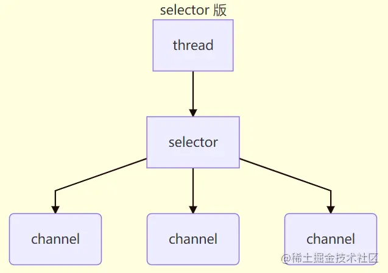
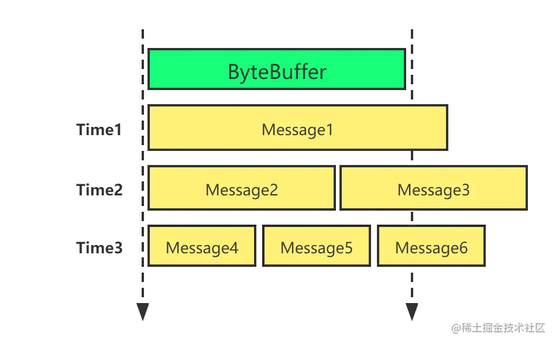

# nio之网络编程

<!-- START doctoc generated TOC please keep comment here to allow auto update -->
<!-- DON'T EDIT THIS SECTION, INSTEAD RE-RUN doctoc TO UPDATE -->

- [一、阻塞与非阻塞](#%E4%B8%80%E9%98%BB%E5%A1%9E%E4%B8%8E%E9%9D%9E%E9%98%BB%E5%A1%9E)
    - [1.1 阻塞](#11-%E9%98%BB%E5%A1%9E)
        - [1.1.1 阻塞模式会存在哪些问题？](#111-%E9%98%BB%E5%A1%9E%E6%A8%A1%E5%BC%8F%E4%BC%9A%E5%AD%98%E5%9C%A8%E5%93%AA%E4%BA%9B%E9%97%AE%E9%A2%98)
        - [1.1.2 测试代码](#112-%E6%B5%8B%E8%AF%95%E4%BB%A3%E7%A0%81)
    - [1.2 非阻塞](#12-%E9%9D%9E%E9%98%BB%E5%A1%9E)
        - [1.2.1 相比阻塞改变了什么？](#121-%E7%9B%B8%E6%AF%94%E9%98%BB%E5%A1%9E%E6%94%B9%E5%8F%98%E4%BA%86%E4%BB%80%E4%B9%88)
        - [1.2.2 非阻塞模型存在哪些问题？](#122-%E9%9D%9E%E9%98%BB%E5%A1%9E%E6%A8%A1%E5%9E%8B%E5%AD%98%E5%9C%A8%E5%93%AA%E4%BA%9B%E9%97%AE%E9%A2%98)
        - [1.2.3 测试代码](#123-%E6%B5%8B%E8%AF%95%E4%BB%A3%E7%A0%81)
- [二、多路复用](#%E4%BA%8C%E5%A4%9A%E8%B7%AF%E5%A4%8D%E7%94%A8)
    - [2.1 Selector](#21-selector)
    - [2.2 处理accept事件](#22-%E5%A4%84%E7%90%86accept%E4%BA%8B%E4%BB%B6)
    - [2.3 处理read事件](#23-%E5%A4%84%E7%90%86read%E4%BA%8B%E4%BB%B6)
    - [2.4 关注消息边界](#24-%E5%85%B3%E6%B3%A8%E6%B6%88%E6%81%AF%E8%BE%B9%E7%95%8C)
    - [2.5 处理write事件](#25-%E5%A4%84%E7%90%86write%E4%BA%8B%E4%BB%B6)

<!-- END doctoc generated TOC please keep comment here to allow auto update -->

[TOC]

## 一、阻塞与非阻塞

### 1.1 阻塞

#### 1.1.1 阻塞模式会存在哪些问题？

1）在阻塞模式下，以下的方法都会导致线程暂停

- ServerSocketChannel.accept 会在没有连接建立时让线程暂停
- SocketChannel.read 会在没有数据可读时让线程暂停
- 阻塞的表现其实就是线程暂停了，暂停期间不会占用 cpu，但线程处于闲置状态

2）单线程下，阻塞方法之间相互影响，几乎不能正常工作，需要多线程支持

3）多线程下，有新的问题，体现在以下方面

- 32 位 jvm 一个线程最大堆栈是 320k，64 位 jvm 一个线程 最大堆栈是1024k，如果连接数过多，必然导致 OOM，并且线程太多，反而会因为频繁上下文切换导致性能降低。
- 可以采用线程池技术来减少线程数和线程上下文切换，但治标不治本，如果有很多连接建立，但长时间 inactive（不活跃），会阻塞线程池中所有线程，因此不适合长连接，只适合短连接

#### 1.1.2 测试代码

服务端代码

```java
import java.io.IOException;
import java.net.InetSocketAddress;
import java.nio.ByteBuffer;
import java.nio.channels.ServerSocketChannel;
import java.nio.channels.SocketChannel;
import java.util.ArrayList;
import java.util.List;

/**
 * @description: bio测试
 * @date: 2022/4/24 11:08
 **/
public class BioServerTest {

    public static void main(String[] args) throws IOException {
        // 使用 nio 来理解阻塞模式, 单线程
        // 0. ByteBuffer
        ByteBuffer buffer = ByteBuffer.allocate(16);
        // 1. 创建了服务器
        try (ServerSocketChannel ssc = ServerSocketChannel.open()) {
            // 2. 绑定监听端口
            ssc.bind(new InetSocketAddress(8080));
            // 3. 连接集合
            List<SocketChannel> channels = new ArrayList<>();
            while (true) {
                // 4. accept 建立与客户端连接， SocketChannel 用来与客户端之间通信
                System.out.println("connecting...");
                // 阻塞方法，线程停止运行
                SocketChannel sc = ssc.accept();
                System.out.println("connected... " + sc);
                channels.add(sc);
                for (SocketChannel channel : channels) {
                    // 5. 接收客户端发送的数据
                    System.out.println("before read..." + channel);
                    try {
                        // 阻塞方法，线程停止运行
                        channel.read(buffer);
                    } catch (IOException e) {
                        e.printStackTrace();
                    }
                    buffer.flip();
                    System.out.println(print(buffer));
                    buffer.clear();
                    System.out.println("after read..." + channel);
                }
            }
        }
    }

    static String print(ByteBuffer b) {
        StringBuilder stringBuilder = new StringBuilder();
        for (int i = 0; i < b.limit(); i++) {
            stringBuilder.append((char) b.get(i));
        }
        return stringBuilder.toString();
    }

}
```

客户端代码：

```java
import java.net.InetSocketAddress;
import java.nio.channels.SocketChannel;

/**
 * @description: socket测试客户端
 * @date: 2022/4/24 11:12
 **/
public class SocketClientTest {

    public static void main(String[] args) throws Exception {
        SocketChannel sc = SocketChannel.open();
        sc.connect(new InetSocketAddress("localhost", 8080));
        System.out.println("waiting...");
        //模拟长连接一直存在
        while (true) {
        }
    }

}
```

启动服务端看结果，一直在connecting，此时线程阻塞了：

```
connecting...
```

启动客户端看结果，此时连接成功，又阻塞到收到消息之前：

```
connecting...
connected... java.nio.channels.SocketChannel[connected local=/127.0.0.1:8080 remote=/127.0.0.1:64800]
before read...java.nio.channels.SocketChannel[connected local=/127.0.0.1:8080 remote=/127.0.0.1:64800]
```

### 1.2 非阻塞

#### 1.2.1 相比阻塞改变了什么？

非阻塞模式下，相关方法都不会让线程暂停

- 在 ServerSocketChannel.accept 在没有连接建立时，会返回 null，继续运行
- SocketChannel.read 在没有数据可读时，会返回 0，但线程不必阻塞，可以去执行其它 SocketChannel 的 read 或是去执行 ServerSocketChannel.accept
- 写数据时，线程只是等待数据写入 Channel 即可，无需等 Channel 通过网络把数据发送出去

#### 1.2.2 非阻塞模型存在哪些问题？

1）但非阻塞模式下，即使没有连接建立，和可读数据，线程仍然在不断运行，白白浪费了 cpu

2）数据复制过程中，线程实际还是阻塞的（AIO 改进的地方）

#### 1.2.3 测试代码

服务端代码

```java
import java.io.IOException;
import java.net.InetSocketAddress;
import java.nio.ByteBuffer;
import java.nio.channels.ServerSocketChannel;
import java.nio.channels.SocketChannel;
import java.util.ArrayList;
import java.util.List;

/**
 * @description: nio服务端
 * @date: 2022/4/24 14:18
 **/
public class NonIoServerTest {

    public static void main(String[] args) throws IOException {
        // 使用 nio 来理解非阻塞模式, 单线程
        // 0. ByteBuffer
        ByteBuffer buffer = ByteBuffer.allocate(16);
        // 1. 创建了服务器
        try (ServerSocketChannel ssc = ServerSocketChannel.open()) {
            // 非阻塞模式
            ssc.configureBlocking(false);
            // 2. 绑定监听端口
            ssc.bind(new InetSocketAddress(8080));
            // 3. 连接集合
            List<SocketChannel> channels = new ArrayList<>();
            while (true) {
                // 4. accept 建立与客户端连接， SocketChannel 用来与客户端之间通信
                // 非阻塞，线程还会继续运行，如果没有连接建立，但sc是null
                SocketChannel sc = ssc.accept();
                if (sc != null) {
                    System.out.println("connected... " + sc);
                    // 非阻塞模式
                    sc.configureBlocking(false);
                    channels.add(sc);
                }
                for (SocketChannel channel : channels) {
                    // 5. 接收客户端发送的数据
                    // 非阻塞，线程仍然会继续运行，如果没有读到数据，read 返回 0
                    int read = channel.read(buffer);
                    if (read > 0) {
                        buffer.flip();
                        System.out.println(print(buffer));
                        buffer.clear();
                        System.out.println("after read..." + channel);
                    }
                }
                // 用于查非阻塞状态，连接客户端时可关闭，便于观看结果
                System.out.println("wait connecting...");
                Thread.sleep(2000);
            }
        } catch (InterruptedException e) {
            e.printStackTrace();
            Thread.currentThread().interrupt();
        }
    }

    static String print(ByteBuffer b) {
        StringBuilder stringBuilder = new StringBuilder();
        for (int i = 0; i < b.limit(); i++) {
            stringBuilder.append((char) b.get(i));
        }
        return stringBuilder.toString();
    }
}
```

启动服务端结果如下，不断刷新:

```
wait connecting...
wait connecting...
wait connecting...
wait connecting...
wait connecting...
wait connecting...
wait connecting...
wait connecting...
wait connecting...
... ...
```

启动客户端,看服务端结果：

```
connected... java.nio.channels.SocketChannel[connected local=/127.0.0.1:8080 remote=/127.0.0.1:61254]
```

## 二、多路复用

**单线程可以配合 Selector 完成对多个 Channel 可读写事件的监控，这称之为多路复用。**

- 多路复用**仅针对网络 IO**，普通文件 IO 没法利用多路复用
- 如果使用非阻塞模式，而不使用selector，则线程大部分时间都在做无用功，使用Selector 能够保证以下三点：
    - 有可连接事件时才去连接
    - 有可读事件才去读取
    - 有可写事件才去写入（ 限于网络传输能力，Channel 未必时时可写，一旦 Channel 可写，会触发 Selector 的可写事件）

### 2.1 Selector



上述方案的好处：

- 一个线程配合 selector 就可以监控多个 channel 的事件，事件发生线程才去处理。避免非阻塞模式下所做无用功。
- 让这个线程能够被充分利用
- 节约了线程的数量
- 减少了线程上下文切换

**如何使用Selector？**

如下代码及注释描述：

```java
import java.io.IOException;
import java.nio.channels.SelectionKey;
import java.nio.channels.Selector;
import java.nio.channels.SocketChannel;

/**
 * @description: Selector demo
 * @date: 2022/4/24 14:40
 **/
public class SelectorTest {

    public static void main(String[] args) throws IOException {
        try (// 创建Selector
             Selector selector = Selector.open();

             // 绑定channel事件（SelectionKey当中有四种事件：OP_ACCEPT，OP_CONNECT, OP_READ, OP_WRITE）
             SocketChannel channel = SocketChannel.open();) {

            channel.configureBlocking(false);
            SelectionKey selectionKey = channel.register(selector, SelectionKey.OP_ACCEPT);

            // 监听channel事件，返回值是发生事件的channel数
            // 监听方法1，阻塞直到绑定事件发生
            int count1 = selector.select();
            // 监听方法2，阻塞直到绑定事件发生，或是超时（时间单位为 ms）
            int count2 = selector.select(1000);
            // 监听方法3，不会阻塞，也就是不管有没有事件，立刻返回，自己根据返回值检查是否有事件
            int count3 = selector.selectNow();
        }

    }
}
```

### 2.2 处理accept事件

服务端如下所示：

```java
package com.collect.netty.nio;

import java.io.IOException;
import java.net.InetSocketAddress;
import java.nio.channels.SelectionKey;
import java.nio.channels.Selector;
import java.nio.channels.ServerSocketChannel;
import java.nio.channels.SocketChannel;
import java.util.Iterator;
import java.util.Set;

/**
 * @description: Selector demo
 * @date: 2022/4/24 14:31
 **/
public class AcceptEventServerTest {

    public static void main(String[] args) {
        try (ServerSocketChannel channel = ServerSocketChannel.open();
             Selector selector = Selector.open();
        ) {
            channel.bind(new InetSocketAddress(8080));
            System.out.println(channel);
            channel.configureBlocking(false);
            channel.register(selector, SelectionKey.OP_ACCEPT);

            while (true) {
                int count = selector.select();
//                int count = selector.selectNow();
                System.out.println("select count: " + count);
//                if(count <= 0) {
//                    continue;
//                }

                // 获取所有事件
                Set<SelectionKey> keys = selector.selectedKeys();

                // 遍历所有事件，逐一处理
                Iterator<SelectionKey> iter = keys.iterator();
                while (iter.hasNext()) {
                    SelectionKey key = iter.next();
                    // 判断事件类型
                    if (key.isAcceptable()) {
                        ServerSocketChannel c = (ServerSocketChannel) key.channel();
                        // 必须处理
                        SocketChannel sc = c.accept();
                        System.out.println(sc);
                    }
                    // 处理完毕，必须将事件移除
                    iter.remove();
                }
            }
        } catch (IOException e) {
            e.printStackTrace();
        }
    }
}


```

客户端如下：

```java
import java.io.IOException;
import java.net.Socket;

/**
 * @description: 测试客户端
 * @date: 2022/4/24 14:34
 **/
public class ClientTest {

    public static void main(String[] args) {
        // accept事件
        try (Socket socket = new Socket("localhost", 8080)) {
            System.out.println(socket);
            // read事件
            socket.getOutputStream().write("world".getBytes());
            System.in.read();
        } catch (IOException e) {
            e.printStackTrace();
        }
    }
}
```

服务端打印结果：

```
sun.nio.ch.ServerSocketChannelImpl[/0:0:0:0:0:0:0:0:8080]
select count: 1
java.nio.channels.SocketChannel[connected local=/127.0.0.1:8080 remote=/127.0.0.1:60469]
```

上述代码中服务端注释掉了使用selector.selectNow()的方法，如果使用该方法，需要自己去判断返回值是否为0。

**事件发生后，要么处理，要么取消（cancel），不能什么都不做，否则下次该事件仍会触发，这是因为 nio 底层使用的是水平触发。**

> 关于水平触发可以点[这里](https://gitee.com/hongyidashi/collect/blob/master/note/os/diagram/IO%E5%A4%9A%E8%B7%AF%E5%A4%8D%E7%94%A8.md#%E4%B8%83epoll)

### 2.3 处理read事件

此处仍然使用代码的方式讲解，客户端与前面的客户端相同，只是此处会同时启动两个客户端，其中发送的内容分别是“hello” 和 “world”。

服务端代码如下所示：

```java
import java.io.IOException;
import java.net.InetSocketAddress;
import java.nio.ByteBuffer;
import java.nio.channels.SelectionKey;
import java.nio.channels.Selector;
import java.nio.channels.ServerSocketChannel;
import java.nio.channels.SocketChannel;
import java.util.Iterator;
import java.util.Set;

/**
 * @description: 读事件
 * @date: 2022/4/24 14:54
 **/
public class ReadEventServerTest {
    public static void main(String[] args) {
        try (ServerSocketChannel channel = ServerSocketChannel.open();
             Selector selector = Selector.open();) {

            channel.bind(new InetSocketAddress(8080));
            System.out.println(channel);
            channel.configureBlocking(false);
            channel.register(selector, SelectionKey.OP_ACCEPT);

            while (true) {
                int count = selector.select();
                System.out.println("select count:" + count);

                // 获取所有事件
                Set<SelectionKey> keys = selector.selectedKeys();

                // 遍历所有事件，逐一处理
                Iterator<SelectionKey> iter = keys.iterator();
                while (iter.hasNext()) {
                    SelectionKey key = iter.next();
                    // 判断事件类型
                    if (key.isAcceptable()) {
                        ServerSocketChannel c = (ServerSocketChannel) key.channel();
                        // 必须处理
                        SocketChannel sc = c.accept();
                        sc.configureBlocking(false);
                        sc.register(selector, SelectionKey.OP_READ);
                        System.out.println("连接已建立:" + sc);
                    } else if (key.isReadable()) {
                        SocketChannel sc = (SocketChannel) key.channel();
                        ByteBuffer buffer = ByteBuffer.allocate(128);
                        int read = sc.read(buffer);
                        if (read == -1) {
                            key.cancel();
                            sc.close();
                        } else {
                            buffer.flip();
                            System.out.println(print(buffer));
                        }
                    }
                    // 处理完毕，必须将事件移除
                    iter.remove();
                }
            }
        } catch (IOException e) {
            e.printStackTrace();
        }
    }

    static String print(ByteBuffer b) {
        StringBuilder stringBuilder = new StringBuilder();
        for (int i = 0; i < b.limit(); i++) {
            stringBuilder.append((char) b.get(i));
        }
        return stringBuilder.toString();
    }
}
```

启动服务端，并先后启动两个客户端，看结果，首先服务端channel自己注册到selector，客户端1发送accept事件，服务端接收到后，继续while循环，监听到read事件，打印内容为“hello”，客户端2步骤相同

```
sun.nio.ch.ServerSocketChannelImpl[/0:0:0:0:0:0:0:0:8080]
select count:1
连接已建立:java.nio.channels.SocketChannel[connected local=/127.0.0.1:8080 remote=/127.0.0.1:61693]
select count:1
hello
select count:1
连接已建立:java.nio.channels.SocketChannel[connected local=/127.0.0.1:8080 remote=/127.0.0.1:51495]
select count:1
world
```

**注意：最后的iter.remove()，为什么要移除？** 因为 select 在事件发生后，就会将相关的 key 放入 selectedKeys 集合，但不会在处理完后从 selectedKeys
集合中移除，需要我们自己编码删除。例如

- 第一次触发了 ssckey 上的 accept 事件，没有移除 ssckey
- 第二次触发了 ssckey 上的 read 事件，但这时 selectedKeys 中还有上次的 ssckey ，在处理时因为没有真正的 serverSocket 连上了，就会导致空指针异常

**上述代码中cancel有什么作用？** cancel 会取消注册在 selector 上的 channel，并从 keys 集合中删除 key 后续不会再监听事件

### 2.4 关注消息边界

首先看如下的代码是否有问题，客户端代码如下：

```java
import java.io.IOException;
import java.io.OutputStream;
import java.net.Socket;

/**
 * @description: 边界测试-客户端
 * @date: 2022/4/25 09:55
 **/
public class BoundaryClientTest {
    public static void main(String[] args) throws IOException {
        Socket max = new Socket("localhost", 9000);
        OutputStream out = max.getOutputStream();
        out.write("hello".getBytes());
        out.write("world".getBytes());
        out.write("你好".getBytes());
        out.write("世界".getBytes());
        max.close();
    }
}
```

服务端代码如下：

```java
import java.io.IOException;
import java.io.InputStream;
import java.net.ServerSocket;
import java.net.Socket;

/**
 * @description: 边界测试-服务端
 * @date: 2022/4/25 09:54
 **/
public class BoundaryServerTest {
    public static void main(String[] args) throws IOException {
        try (ServerSocket ss = new ServerSocket(9000)) {
            while (true) {
                Socket s = ss.accept();
                InputStream in = s.getInputStream();
                // 每次读取4个字节
                byte[] arr = new byte[4];
                while (true) {
                    int read = in.read(arr);
                    // 读取长度是-1，则不读取了
                    if (read == -1) {
                        break;
                    }
                    System.out.println(new String(arr, 0, read));
                }
            }
        }
    }
}
```

结果：

```
hell
owor
ld�
�好
世�
��
```

**为什么会产生上述的问题？** 这里面涉及到消息边界的问题。消息的长短是不同的，当我们指定相同长度的ByteBuffer去接收消息时，必然存在不同时间段存在很多种情况，如下所示：



**由于buffer长度固定，必然存在消息被截断的情况，那么如何解决这些问题呢？**

1）一种思路是固定消息长度，数据包大小一样，服务器按预定长度读取，缺点是浪费带宽

2）另一种思路是按分隔符拆分，缺点是效率低

3）TLV 格式，即 Type 类型、Length 长度、Value 数据，类型和长度已知的情况下，就可以方便获取消息大小，分配合适的 buffer，缺点是 buffer 需要提前分配，如果内容过大，则影响 server 吞吐量

- Http 1.1 是 TLV 格式
- Http 2.0 是 LTV 格式

通过面给出的答案都不是最好的解决方案，重点的问题在于**如何分配Bytebuffer的大小？**

buffer是给一个channel独立使用的，不能被多个channel共同使用，因为存在粘包、半包的问题。

buffer的大小又不能太大，如果要支持很大的连接数，同时又设置很大的buffer，则必然需要庞大的内存。

所以我们需要设置一个**大小可变的ByteBuffer**。

目前有两种较为简单实现方案，其都有其优缺点：

1）预先分配一个较小的buffer，例如4k，如果发现不能装下全部内容，则创建一个更大的buffer，比如8k，将已写入的4k拷贝到新分配的8k buffer，将剩下的内容继续写入。

其优点是消息必然是连续的，但是不断的分配和拷贝，必然会对性能造成较大的影响。

2）使用多个数组的形式组成buffer，当一个数组存不下数据内容，就将剩余数据放入下一个数组当中。在netty中的CompositeByteBuf类，就是这种方式。

其缺点是数据不连续，需要再次解析整合，优点是解决了上一个方案的造成性能损耗的问题。

### 2.5 处理write事件

**什么是两阶段策略？**

其出现原因有如下两个：

1. 在非阻塞模式下，我们无法保证将buffer中的所有数据全部写入channel当中，所以我们需要追踪写入后的返回值，也就是实际写入字节的数值。

```java
int write=channel.write(buffer);
```

2. 我们可以使所有的selector监听channel的可写事件，每个channel都会有一个key用来跟踪buffer，这样会占用过多的内存。（关于此点不太理解的，下面可以通过代码来理解）

鉴于以上问题，出现的两阶段策略：

1. 当第一次写入消息时，我们才将channel注册到selector

2. 如果第一次没写完，再次添加写事件， 检查 channel 上的可写事件，如果所有的数据写完了，就取消 channel 的注册（不取消则每次都会出现写事件）。

下面通过代码的方式演示：

服务端：

```java
import java.io.IOException;
import java.net.InetSocketAddress;
import java.nio.ByteBuffer;
import java.nio.channels.*;
import java.nio.charset.Charset;
import java.util.Iterator;

/**
 * @description: 写事件
 * @date: 2022/4/25 10:08
 **/
public class WriteEventServerTest {

    public static void main(String[] args) {
        try (// 开启一个服务channel
             ServerSocketChannel ssc = ServerSocketChannel.open();
             //初始化selector
             Selector selector = Selector.open()
        ) {
            // 设置非阻塞
            ssc.configureBlocking(false);
            // 绑定端口
            ssc.bind(new InetSocketAddress(8080));


            //注册服务端到selector
            ssc.register(selector, SelectionKey.OP_ACCEPT);

            while (true) {
                // 监听事件，此处会阻塞
                selector.select();

                // 获取所有事件key，遍历
                Iterator<SelectionKey> iter = selector.selectedKeys().iterator();
                while (iter.hasNext()) {
                    SelectionKey key = iter.next();
                    // 不管处理成功与否，移除key
                    iter.remove();
                    // 如果是建立连接事件
                    if (key.isAcceptable()) {
                        // 处理accept事件
                        SocketChannel sc = ssc.accept();
                        // 设置非阻塞
                        sc.configureBlocking(false);
                        // 此处是第一阶段
                        // 注册一个read事件到selector
                        SelectionKey sckey = sc.register(selector, SelectionKey.OP_READ);
                        // 1. 向客户端发送内容
                        StringBuilder sb = new StringBuilder();
                        for (int i = 0; i < 30000000; i++) {
                            sb.append("a");
                        }
                        // 字符串转buffer
                        ByteBuffer buffer = Charset.defaultCharset().encode(sb.toString());
                        // 2. 写入数据到客户端channel
                        int write = sc.write(buffer);
                        // 3. write 表示实际写了多少字节
                        System.out.println("实际写入字节:" + write);
                        // 4. 如果有剩余未读字节，才需要关注写事件
                        // 此处是第二阶段
                        if (buffer.hasRemaining()) {
                            // 在原有关注事件的基础上，多关注 写事件
                            sckey.interestOps(sckey.interestOps() + SelectionKey.OP_WRITE);
                            // 把 buffer 作为附件加入 sckey
                            sckey.attach(buffer);
                        }
                    } else if (key.isWritable()) {
                        // 检索key中的附件buffer
                        ByteBuffer buffer = (ByteBuffer) key.attachment();
                        // 获取客户端channel
                        SocketChannel sc = (SocketChannel) key.channel();
                        // 根据上次的position继续写
                        int write = sc.write(buffer);
                        System.out.println("实际写入字节:" + write);
                        // 如果写完了，需要将绑定的附件buffer去掉，并且去掉写事件
                        // 如果没写完将会继续while，执行写事件，知道完成为止
                        if (!buffer.hasRemaining()) {
                            key.interestOps(key.interestOps() - SelectionKey.OP_WRITE);
                            key.attach(null);
                        }
                    }
                }
            }
        } catch (ClosedChannelException e) {
            e.printStackTrace();
        } catch (IOException e) {
            e.printStackTrace();
            Thread.currentThread().interrupt();
        }

    }

}
```

客户端：

```java
import java.io.IOException;
import java.net.InetSocketAddress;
import java.nio.ByteBuffer;
import java.nio.channels.ClosedChannelException;
import java.nio.channels.SelectionKey;
import java.nio.channels.Selector;
import java.nio.channels.SocketChannel;
import java.util.Iterator;

/**
 * @description: 写事件
 * @date: 2022/4/25 10:54
 **/
public class WriteEventClientTest {

    public static void main(String[] args) {
        try (// 开启selector
             Selector selector = Selector.open();
             // 开启客户端channel
             SocketChannel sc = SocketChannel.open();) {

            //设置非阻塞
            sc.configureBlocking(false);
            // 注册一个连接事件和读事件
            sc.register(selector, SelectionKey.OP_CONNECT | SelectionKey.OP_READ);
            //连接到服务端
            sc.connect(new InetSocketAddress("localhost", 8080));
            int count = 0;
            while (true) {
                //此处监测事件，阻塞
                selector.select();
                //获取时间key集合，并遍历
                Iterator<SelectionKey> iter = selector.selectedKeys().iterator();
                while (iter.hasNext()) {
                    SelectionKey key = iter.next();
                    //无论成功与否，都要移除
                    iter.remove();
                    //连接
                    if (key.isConnectable()) {
                        System.out.println(sc.finishConnect());
                    } else if (key.isReadable()) {
                        //分配内存buffer
                        ByteBuffer buffer = ByteBuffer.allocate(1024 * 1024);
                        //读数据到buffer
                        count += sc.read(buffer);
                        //清空buffer
                        buffer.clear();
                        //打印总字节数
                        System.out.println(count);
                    }
                }
            }
        } catch (ClosedChannelException e) {
            e.printStackTrace();
        } catch (IOException e) {
            e.printStackTrace();
            Thread.currentThread().interrupt();
        }
    }

}
```

