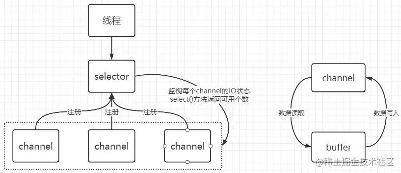
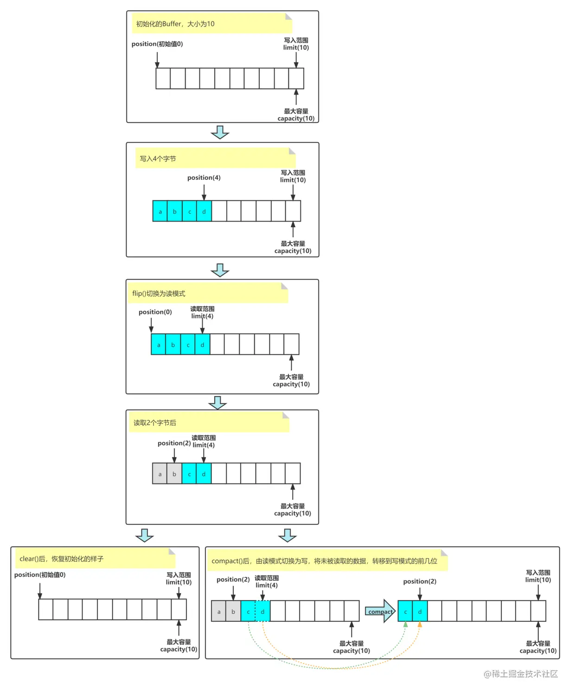
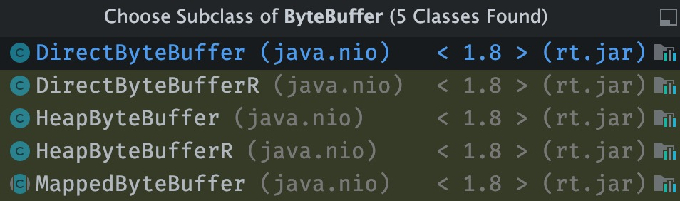
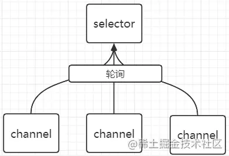

# nio基础之三大核心简介

<!-- START doctoc generated TOC please keep comment here to allow auto update -->
<!-- DON'T EDIT THIS SECTION, INSTEAD RE-RUN doctoc TO UPDATE -->

- [零、开篇](#%E9%9B%B6%E5%BC%80%E7%AF%87)
- [一、Channel简介](#%E4%B8%80channel%E7%AE%80%E4%BB%8B)
- [二、Buffer简介](#%E4%BA%8Cbuffer%E7%AE%80%E4%BB%8B)
  - [1. buffer属性](#1-buffer%E5%B1%9E%E6%80%A7)
  - [2. 主要方法](#2-%E4%B8%BB%E8%A6%81%E6%96%B9%E6%B3%95)
    - [2.1 创建 Buffer](#21-%E5%88%9B%E5%BB%BA-buffer)
    - [2.2 写入](#22-%E5%86%99%E5%85%A5)
    - [2.3 读取](#23-%E8%AF%BB%E5%8F%96)
    - [2.4 读写模式切换](#24-%E8%AF%BB%E5%86%99%E6%A8%A1%E5%BC%8F%E5%88%87%E6%8D%A2)
    - [2.5 直接内存和堆内存](#25-%E7%9B%B4%E6%8E%A5%E5%86%85%E5%AD%98%E5%92%8C%E5%A0%86%E5%86%85%E5%AD%98)
- [三、Selector简介](#%E4%B8%89selector%E7%AE%80%E4%BB%8B)

<!-- END doctoc generated TOC please keep comment here to allow auto update -->

## 零、开篇

NIO，Non-Block IO ，从 Java 1.4 版本开始引入的非阻塞 IO ，是一种非阻塞 + 同步的通信模式，也是 I/O 多路复用的基础，基于缓冲区（Buffer）的模式。

通过下图简单展示三大核心(Channel通道，Buffer缓冲，Selector选择器)之间的关系：



## 一、Channel简介

读写数据的**双向通道**，可以从 channel 将数据读入 buffer，也可以将 buffer 的数据写入 channel。

jdk中定义了一个java.nio.channels.channel接口，主要提供了**开启连接**和**关闭连接**的方法。

```java
package java.nio.channels;

import java.io.IOException;
import java.io.Closeable;

public interface Channel extends Closeable {

    public boolean isOpen();

    public void close() throws IOException;
}
```

在jdk中对于channel接口提供了很多实现类，最主要的是以下四个：

- **SocketChannel** ：一个客户端用来发起 TCP 的 Channel 。
- **ServerSocketChannel** ：一个服务端用来监听新进来的连接的 TCP 的 Channel 。对于每一个新进来的连接，都会创建一个对应的 SocketChannel 。
- **DatagramChannel** ：通过 UDP 读写数据。
- **FileChannel** ：从文件中，读写数据。

## 二、Buffer简介

buffer 则用来缓冲读写数据，jdk提供java.nio.buffer抽象类，其属性和构造如下代码所示：

```java
package java.nio;

import java.util.Spliterator;

public abstract class Buffer {

    /**
     * The characteristics of Spliterators that traverse and split elements
     * maintained in Buffers.
     */
    static final int SPLITERATOR_CHARACTERISTICS =
        Spliterator.SIZED | Spliterator.SUBSIZED | Spliterator.ORDERED;

    // Invariants: mark <= position <= limit <= capacity
    private int mark = -1;
    private int position = 0;
    private int limit;
    private int capacity;

    // Used only by direct buffers
    // NOTE: hoisted here for speed in JNI GetDirectBufferAddress
    long address;

    // Creates a new buffer with the given mark, position, limit, and capacity,
    // after checking invariants.
    //
    Buffer(int mark, int pos, int lim, int cap) {       // package-private
        if (cap < 0)
            throw new IllegalArgumentException("Negative capacity: " + cap);
        this.capacity = cap;
        limit(lim);
        position(pos);
        if (mark >= 0) {
            if (mark > pos)
                throw new IllegalArgumentException("mark > position: ("
                                                   + mark + " > " + pos + ")");
            this.mark = mark;
        }
    }
}

```

### 1. buffer属性

如上代码所示，**Buffer有四个属性，他们在Buffer读和写的情况下具有不同的含义**：

- **mark**：记录当前读或写的位置
- **position**：下一个位置
- **limit**：范围
- **capacity**：Buffer的容量，创建时候指定，不能修改。

主要模式切换如下所示：



### 2. 主要方法

每个buffer的实现类都实现了以下主要方法，下面以ByteBuffer的源码举例：

#### 2.1 创建 Buffer

```java
/**
 * 创建并指定大小
 **/
public static ByteBuffer allocate(int capacity) {
        if (capacity < 0)
            throw new IllegalArgumentException();
        return new HeapByteBuffer(capacity, capacity);
}

/**
 * 数组转成Buffer对象
 **/
public static ByteBuffer wrap(byte[] array, int offset, int length){
    try {
            return new HeapByteBuffer(array, offset, length);
        } catch (IllegalArgumentException x) {
            throw new IndexOutOfBoundsException();
        }
}
```

#### 2.2 写入

```java
// 写入 byte
public abstract ByteBuffer put(byte b); 
public abstract ByteBuffer put(int index, byte b);
// 写入 byte 数组
public final ByteBuffer put(byte[] src) { ... }
public ByteBuffer put(byte[] src, int offset, int length) {...}
```

从channel将数据写入buffer，该方法返回数据大小：

```java
int num = channel.read(buffer);
```

#### 2.3 读取

```java
// 读取 byte
public abstract byte get();
public abstract byte get(int index);
// 读取 byte 数组
public ByteBuffer get(byte[] dst, int offset, int length) {...}
public ByteBuffer get(byte[] dst) {...}
```

从buffer中的数据写入到channel中，该方法返回数据大小：

```java
int num = channel.write(buffer);
```

#### 2.4 读写模式切换

ByteBuffer是继承buffer的，其读写切换要基于Buffer的方法：

- 切换成读模式：

```java
    public final Buffer flip() {
        limit = position;
        position = 0;
        mark = -1;
        return this;
    }
```

- 切换成写模式：
  
  clear()方法
  
  这个方法会将buffer的起始位置设为0，其实表面是将buffer清空了，实际是不在记录buffer的读写位置，此时写入数据，原数据将会被覆盖。

```java
    public final Buffer clear() {
        position = 0;
        limit = capacity;
        mark = -1;
        return this;
    }
```

    compact()方法    

如果想在之前的数据后面继续写可以使用compact()方法：

```java
public abstract ByteBuffer compact();
```

#### 2.5 直接内存和堆内存

ByteBuffer它有两种实现，我们应该知道了解，分别是基于**堆内存**和基于**直接内存**的：



以下两种buffer需要记住：

```java
public class ByteBufferReadWrite {
    public static void main(String[] args) 
        ByteBuffer buffer1 = ByteBuffer.allocate(16);
        ByteBuffer buffer2 = ByteBuffer.allocateDirect(16);
        //java.nio.HeapByteBuffer[pos=0 lim=16 cap=16]
        //java 堆内存，读写效率低，受gc影响
        System.out.println(buffer1);
        //java.nio.DirectByteBuffer[pos=0 lim=16 cap=16]
        //直接内存 读写效率高（少一次拷贝），不受gc影响，分配的效率低，注意关闭，否则会造成内存泄漏
        System.out.println(buffer2);
    }
}

```

执行结果：

```textile
java.nio.HeapByteBuffer[pos=0 lim=0 cap=16]
java.nio.DirectByteBuffer[pos=0 lim=16 cap=16]
```

**常见buffer有：**

- ByteBuffer
  - MappedByteBuffer
  - DirectByteBuffer
  - HeapByteBuffer
- ShortBuffer
- IntBuffer
- LongBuffer
- FloatBuffer
- DoubleBuffer
- CharBuffer

## 三、Selector简介

Selector被称为**多路复用器**，用于**轮询**NIO的channel是否处于可读或者可写的状态，其位于jdk的java.nio.channels.Selector。

selector 的作用就是配合一个线程来管理多个 channel，获取这些 channel 上发生的事件，这些 channel 工作在非阻塞模式下，不会让线程吊死在一个 channel 上。适合连接数特别多，但流量低的场景。

调用 selector 的 select() 会阻塞直到 channel 发生了读写就绪事件，这些事件发生，select 方法就会返回这些事件交给 thread 来处理。



轮询步骤：

- 每个channel需要注册到selector上。
- selector轮询每个channel，当有channel发生读写操作，这个channel处于就绪状态，会被轮询到，等到就绪状态的channel集合，进行后续的IO操作。

代码举例：

```java
//创建selector
Selector selector = Selector.open();
//注册channel
channel.configureBlocking(false); // 必须是非阻塞
/*
第二个参数有以下四种类型：
Connect ：连接完成事件( TCP 连接 )，仅适用于客户端，对应 SelectionKey.OP_CONNECT 
Accept：接受新连接事件，仅适用于服务端，对应 SelectionKey.OP_ACCEPT 。
Read ：读事件，适用于两端，对应SelectionKey.OP_READ ，表示 Buffer 可读。
Write ：写事件，适用于两端，对应SelectionKey.OP_WRITE ，表示 Buffer 可写。
*/
SelectionKey key = channel.register(selector, SelectionKey.OP_READ);
```