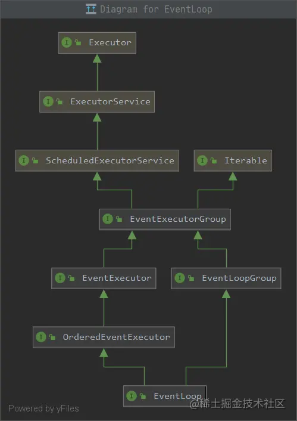

# 初识Netty-EventLoop介绍

<!-- START doctoc generated TOC please keep comment here to allow auto update -->
<!-- DON'T EDIT THIS SECTION, INSTEAD RE-RUN doctoc TO UPDATE -->

- [一、简单使用](#%E4%B8%80%E7%AE%80%E5%8D%95%E4%BD%BF%E7%94%A8)
- [二、主要组件](#%E4%BA%8C%E4%B8%BB%E8%A6%81%E7%BB%84%E4%BB%B6)
    - [2.1 EventLoop](#21-eventloop)
    - [2.2 EventLoopGroup](#22-eventloopgroup)
    - [2.3 常用EventLoopGroup](#23-%E5%B8%B8%E7%94%A8eventloopgroup)
    - [2.4 EventLoopGroup代码使用示例](#24-eventloopgroup%E4%BB%A3%E7%A0%81%E4%BD%BF%E7%94%A8%E7%A4%BA%E4%BE%8B)

<!-- END doctoc generated TOC please keep comment here to allow auto update -->

[TOC]

## 一、简单使用

下面我们先简单看下如何使用Netty完成hello world。

在java中使用Netty，必然要引入其依赖。关于Netty的版本变更如下：

- 2.x 2004
- 3.x 2008
- 4.x 2013
- 5.x 已废弃（没有明显的性能提升，维护成本高）

如上所示，5.x没有太大的意义，所以我们这里也是用maven4.x的版本，首先在项目中引入maven依赖：

```xml

<dependency>
    <groupId>io.netty</groupId>
    <artifactId>netty-all</artifactId>
    <version>4.1.52.Final</version>
</dependency>
```

服务端代码：

```java
import io.netty.bootstrap.ServerBootstrap;
import io.netty.channel.ChannelHandlerContext;
import io.netty.channel.ChannelInitializer;
import io.netty.channel.SimpleChannelInboundHandler;
import io.netty.channel.nio.NioEventLoopGroup;
import io.netty.channel.socket.nio.NioServerSocketChannel;
import io.netty.channel.socket.nio.NioSocketChannel;
import io.netty.handler.codec.string.StringDecoder;

/**
 * @description: HelloWorld
 * @date: 2022/4/25 23:50
 **/
public class HelloWorldServer {

    public static void main(String[] args) {
        new ServerBootstrap()
                // 1、创建 NioEventLoopGroup，可以简单理解为 `线程池 + Selector`
                .group(new NioEventLoopGroup())
                // 2、选择服务 ServerSocketChannel 实现类，这里选择Nio
                .channel(NioServerSocketChannel.class)
                // 3、此处是给客户端SocketChannel使用，ChannelInitializer执行一次，待客户端建立连接后，执行initChannel，添加更多的处理器
                .childHandler(new ChannelInitializer<NioSocketChannel>() {
                    @Override
                    protected void initChannel(NioSocketChannel ch) {
                        // 5、客户端SocketChannel处理器，解码：ByteBuffer -> String
                        ch.pipeline().addLast(new StringDecoder());
                        // 6、客户端SocketChannel业务处理器，使用上一个处理器的结果
                        ch.pipeline().addLast(new SimpleChannelInboundHandler<String>() {
                            @Override
                            protected void channelRead0(ChannelHandlerContext ctx, String msg) {
                                System.out.println(msg);
                            }
                        });
                    }
                })
                // 4、服务端ServerSocketChannel绑定监听端口
                .bind(8080);
    }

}
```

客户端代码：

```java
import io.netty.bootstrap.Bootstrap;
import io.netty.channel.Channel;
import io.netty.channel.ChannelInitializer;
import io.netty.channel.nio.NioEventLoopGroup;
import io.netty.channel.socket.nio.NioSocketChannel;
import io.netty.handler.codec.string.StringEncoder;

import java.util.Date;

/**
 * @description: HelloWorld
 * @date: 2022/4/25 23:54
 **/
public class HelloWorldClient {

    public static void main(String[] args) throws InterruptedException {
        new Bootstrap()
                // 1、创建 NioEventLoopGroup，可以简单理解为 `线程池 + Selector`
                .group(new NioEventLoopGroup())
                // 2、选择服务 ServerSocketChannel 实现类，这里选择Nio
                .channel(NioSocketChannel.class)
                // 3、此处是给客户端SocketChannel使用，ChannelInitializer执行一次，待客户端建立连接后，执行initChannel，添加更多的处理器
                .handler(new ChannelInitializer<Channel>() {
                    @Override
                    protected void initChannel(Channel ch) {
                        // 8、消息会经过通道 handler 处理，这里是将 String => ByteBuf 发出
                        ch.pipeline().addLast(new StringEncoder());
                    }
                })
                // 4、指定要连接的服务器端口
                .connect("127.0.0.1", 8080)
                // 5、同步方法，等待connect()连接完毕
                .sync()
                // 6、获取channel对象，即通道，可读写操作
                .channel()
                // 7、写入消息并清空缓冲区
                .writeAndFlush(new Date() + ": hello world!");
    }

}
```

结果：

```
Mon Apr 25 23:55:54 CST 2022: hello world!
```

可以使用以下方式快速理解和记忆：

- 把 channel 理解为数据的通道
- 把 msg 理解为流动的数据，最开始输入是 ByteBuf，但经过 pipeline 的加工，会变成其它类型对象，最后输出又变成 ByteBuf
- 把 handler 理解为数据的处理工序
    - 工序有多道，合在一起就是 pipeline，pipeline 负责发布事件（读、读取完成...）传播给每个 handler， handler 对自己感兴趣的事件进行处理（重写了相应事件处理方法）
    - handler 分 Inbound 和 Outbound 两类
- 把 eventLoop 理解为处理数据的工人
    - 工人可以管理多个 channel 的 io 操作，并且一旦工人负责了某个 channel，就要负责到底（绑定）
    - 工人既可以执行 io 操作，也可以进行任务处理，每位工人有任务队列，队列里可以堆放多个 channel 的待处理任务，任务分为普通任务、定时任务
    - 工人按照 pipeline 顺序，依次按照 handler 的规划（代码）处理数据，可以为每道工序指定不同的工人

## 二、主要组件

### 2.1 EventLoop

根据其名称直译叫做“事件循环”对象，其用于处理channel的IO操作。

EventLoop 本质是一个单线程执行器（同时维护了一个 Selector），里面有 run 方法处理 Channel 上源源不断的 io 事件。

其依赖关系如下：



如上如所示，其继承关系较复杂。

- 一条线是继承自 j.u.c.ScheduledExecutorService 因此包含了线程池中所有的方法。
- 另一条线是继承自 netty 自己的 OrderedEventExecutor。

### 2.2 EventLoopGroup

事件循环组。

EventLoopGroup 是一组 EventLoop，Channel 一般会调用 EventLoopGroup 的 register 方法来绑定其中一个 EventLoop，后续这个 Channel 上的 io 事件都由此
EventLoop 来处理（保证了 io 事件处理时的线程安全）

- 继承自 netty 自己的 EventExecutorGroup
    - 实现了 Iterable 接口提供遍历 EventLoop 的能力
    - 另有 next 方法获取集合中下一个 EventLoop

### 2.3 常用EventLoopGroup

主要有以下两种EventLoopGroup：

1. NioEventLoopGroup：处理IO事件，普通任务，定时任务
2. DefaultEventLoopGroup：处理普通任务，定时任务

这里先给出一个结论，EventLoopGroup当中的每一个EventLoop，和客户端Channel实际是绑定的：简单来说，就是一个channel发送的内容，会被同一个线程处理，后面代码会体现。

### 2.4 EventLoopGroup代码使用示例

下面以NioEventLoopGroup为例，介绍简单使用：

**遍历EventLoopGroup**

```java
    static void traverseEventLoopGroup(){
        // 构造方法可以指定线程数，默认不设置会首先根据Netty的环境变量，否则根据线程核心数*2，最小为1
        NioEventLoopGroup nioEventLoopGroup=new NioEventLoopGroup(2);

        // 使用期next方法 获取内部的EventLoop
        System.out.println(nioEventLoopGroup.next());
        System.out.println(nioEventLoopGroup.next());
        System.out.println(nioEventLoopGroup.next());

        System.out.println("-------------------------------------");

        // for循环获取内部的EventLoop
        for(EventExecutor group:nioEventLoopGroup){
        System.out.println(group);
        }
        }
```

结果：

```
io.netty.channel.nio.NioEventLoop@3fb4f649
io.netty.channel.nio.NioEventLoop@33833882
io.netty.channel.nio.NioEventLoop@3fb4f649
-------------------------------------
io.netty.channel.nio.NioEventLoop@3fb4f649
io.netty.channel.nio.NioEventLoop@33833882
```

**执行普通任务 和 定时任务**

```java
    static void executeTask(){
        // 构造方法可以指定线程数，默认不设置会首先根据Netty的环境变量，否则根据线程核心数*2，最小为1
        NioEventLoopGroup nioEventLoopGroup=new NioEventLoopGroup(2);

        // 执行普通任务
        nioEventLoopGroup.next().execute(TestEventLoopGroup::print);

        // 执行定时任务,延后一秒打印
        System.out.println(LocalDateTime.now());
        nioEventLoopGroup.next().schedule(TestEventLoopGroup::print,1000,TimeUnit.MILLISECONDS);
        }

private static void print(){
        System.out.println(LocalDateTime.now()+" "+Thread.currentThread());
        }
```

结果：

```
2022-04-26T08:45:17.823
2022-04-26T08:45:17.823 Thread[nioEventLoopGroup-2-1,10,main]
2022-04-26T08:45:18.826 Thread[nioEventLoopGroup-2-2,10,main]
```

**执行IO任务**

其实所谓IO任务就是，客户端和服务端的通信，在此例子的基础上，我们在添加一个**职责划分**的概念。

**职责划分1** 何为职责划分？就是在我们创建EventLoopGroup时，指定两个，不使用单一的一个，让职责更加明确，其构造方法如下所示：

```java
    /**
 * 为父级（接受者）和子级（客户端）设置EventLoopGroup 。
 */
public ServerBootstrap group(EventLoopGroup parentGroup,EventLoopGroup childGroup){
        super.group(parentGroup);
        if(this.childGroup!=null){
        throw new IllegalStateException("childGroup set already");
        }
        this.childGroup=ObjectUtil.checkNotNull(childGroup,"childGroup");
        return this;
        }
```

在上面的构造当中，第一个参数负责ServerSocketChannel的accept操作，而第二个参数负责SocketChannel的读写。

关于第一个参数是否需要指定线程数据呢？实际只需要指定为1即可，因为ServerSocketChannel只有一个，只会绑定一个EventLoop。

第二个参数是工作线程，根据实际工作需要设置，默认不设置会首先根据Netty的环境变量，否则根据线程核心数*2，最小为1。

下面进行代码的演示，模拟两个EventLoop处理事件。

根据前面的分析，这里我们设置两个EventLoopGroup，第一个给1或者不设置，第二个需要注意了，如果给1的话，那表示只会有一个线程在进行SocketChannel的读写操作，并不是两个线程同时操作，所以下面我们给第二个参数的线程数设置为2。

服务端代码：

```java
import io.netty.bootstrap.ServerBootstrap;
import io.netty.channel.ChannelHandlerContext;
import io.netty.channel.ChannelInitializer;
import io.netty.channel.SimpleChannelInboundHandler;
import io.netty.channel.nio.NioEventLoopGroup;
import io.netty.channel.socket.nio.NioServerSocketChannel;
import io.netty.channel.socket.nio.NioSocketChannel;
import io.netty.handler.codec.string.StringDecoder;

/**
 * @description: EventLoopGroup
 * @date: 2022/4/26 09:12
 **/
public class EventLoopGroupTestServer {

    public static void main(String[] args) throws InterruptedException {
        new ServerBootstrap()
                .group(new NioEventLoopGroup(1), new NioEventLoopGroup(2))
                .channel(NioServerSocketChannel.class)
                .childHandler(new ChannelInitializer<NioSocketChannel>() {
                    @Override
                    protected void initChannel(NioSocketChannel ch) {
                        ch.pipeline().addLast(new StringDecoder());
                        ch.pipeline().addLast(new SimpleChannelInboundHandler<String>() {
                            @Override
                            protected void channelRead0(ChannelHandlerContext channelHandlerContext, String s) throws Exception {
                                System.out.println(Thread.currentThread().getName() + ": " + s);
                            }
                        });
                    }
                }).bind(8080).sync();
    }

}
```

分别依次启动三个客户端，每个客户端发送两个不同的字符串消息(分别是aaa,bbb,ccc)，下面只提供aaa，看结果。 客户端代码：

```java
import io.netty.bootstrap.Bootstrap;
import io.netty.channel.Channel;
import io.netty.channel.ChannelInitializer;
import io.netty.channel.nio.NioEventLoopGroup;
import io.netty.channel.socket.nio.NioSocketChannel;
import io.netty.handler.codec.string.StringEncoder;

/**
 * @description: EventLoopGroup
 * @date: 2022/4/26 09:13
 **/
public class EventLoopGroupTestClient {

    public static void main(String[] args) throws InterruptedException {
        Channel channel = new Bootstrap()
                .group(new NioEventLoopGroup(1))
                .handler(new ChannelInitializer<NioSocketChannel>() {
                    @Override
                    protected void initChannel(NioSocketChannel ch) throws Exception {
                        System.out.println("init...");
                        ch.pipeline().addLast(new StringEncoder());
                    }
                })
                .channel(NioSocketChannel.class).connect("localhost", 8080)
                .sync()
                .channel();

        channel.writeAndFlush("aaa");
        Thread.sleep(1000);
        channel.writeAndFlush("aaa");
    }

}
```

结果：

```
nioEventLoopGroup-3-1: aaa
nioEventLoopGroup-3-1: aaa
nioEventLoopGroup-3-2: bbb
nioEventLoopGroup-3-2: bbb
nioEventLoopGroup-3-1: ccc
nioEventLoopGroup-3-1: ccc
```

根据结果我们得到结论：

> 客户端SocketChannel会和EventLoop进行绑定，后面发送的消息，依然由其处理。 下一个客户端连接后，会默认轮询到下一个EventLoop。
> 第三个客户端来的时候，又会连接第一EventLoop，其内部是多路复用，一个EventLoop管理多个channel。

**职责划分2** 前面讲了一种职责划分，是在ServerSocketChannel和SocketChannel的划分。

针对SocketChannel还可以进一步的划分，实现方式就是我们可以指定另外一个EventLoopGroup，具体如下所示：

```java
import io.netty.bootstrap.ServerBootstrap;
import io.netty.channel.ChannelHandlerContext;
import io.netty.channel.ChannelInitializer;
import io.netty.channel.DefaultEventLoopGroup;
import io.netty.channel.SimpleChannelInboundHandler;
import io.netty.channel.nio.NioEventLoopGroup;
import io.netty.channel.socket.nio.NioServerSocketChannel;
import io.netty.channel.socket.nio.NioSocketChannel;
import io.netty.handler.codec.string.StringDecoder;

/**
 * @description: EventLoopGroup
 * @date: 2022/4/26 09:21
 **/
public class EventLoopGroupTestServer2 {

    public static void main(String[] args) throws InterruptedException {
        // 定义一个defaultEventLoopGroup，对职责进一步划分
        DefaultEventLoopGroup defaultEventLoopGroup = new DefaultEventLoopGroup();

        new ServerBootstrap()
                .group(new NioEventLoopGroup(1), new NioEventLoopGroup(2))
                .channel(NioServerSocketChannel.class)
                .childHandler(new ChannelInitializer<NioSocketChannel>() {
                    @Override
                    protected void initChannel(NioSocketChannel ch) {
                        // 解码处理器
                        ch.pipeline().addLast(new StringDecoder());
                        ch.pipeline().addLast(new SimpleChannelInboundHandler<String>() {
                            @Override
                            protected void channelRead0(ChannelHandlerContext channelHandlerContext, String s) throws Exception {
                                System.out.println(Thread.currentThread().getName() + ": " + s);
                                // 要想使下了一个处理器，能够收到此处理器的结果，需要使用西面这个方法传递
                                channelHandlerContext.fireChannelRead(s);
                            }
                            // 添加另一个处理器，使用额外的EventLoopGroup
                        }).addLast(defaultEventLoopGroup, "otherHandler", new SimpleChannelInboundHandler<String>() {
                            @Override
                            protected void channelRead0(ChannelHandlerContext channelHandlerContext, String s) throws Exception {
                                System.out.println(Thread.currentThread().getName() + ": " + s);
                            }
                        });
                    }
                }).bind(8080).sync();
    }

}
```

注意使用 channelHandlerContext.fireChannelRead(s)在处理器传递。

客户端随便发送个消息，我们看看两个处理器的打印内容：

```
nioEventLoopGroup-4-2: aaa
defaultEventLoopGroup-2-2: aaa
nioEventLoopGroup-4-2: aaa
defaultEventLoopGroup-2-2: aaa
```

两个处理内容分别通过不同的EventLoop处理，分别是原本的nio和后创建的default。

并且，同一个客户端再次发送内容，此处两个线程仍然会是和channel进行绑定。不具体演示了。

我们最后看下上述的**两个处理器如何切换不同的线程处理的？**

通过 channelHandlerContext.fireChannelRead(s)向下跟踪，到以下代码处：

```java
static void invokeChannelRead(final AbstractChannelHandlerContext next,Object msg){
final Object m=next.pipeline.touch(ObjectUtil.checkNotNull(msg,"msg"),next);

        // 下一个 handler 的事件循环是否与当前的事件循环是同一个线程，此处就是EventLoop
        EventExecutor executor=next.executor();

        // 是，直接调用
        if(executor.inEventLoop()){
        next.invokeChannelRead(m);
        }
        // 不是，将要执行的代码作为任务提交给下一个事件循环处理（换人）
        else{
        executor.execute(new Runnable(){
@Override
public void run(){
        next.invokeChannelRead(m);
        }
        });
        }
        }
```

