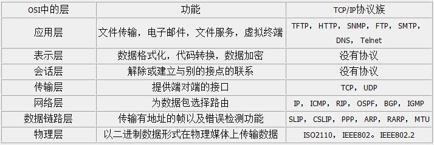
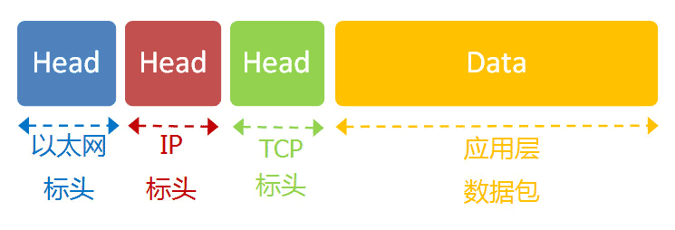

# NIO系列 - TCP

[TOC]

在介绍NIO之前有必要了解下TCP协议，因为目前多数应用都是给予应用层进行操作，导致隐藏了大量的网路细节，知道这些细节以及原理对我们的问题排查很有益处。

## 一、TCP 特性

TCP 是一种**面向连接的**协议，它给用户进程提供**可靠的全双工的**字节流。确保数据包的可靠，有序，以及支持流量控制。关于TCP 为何要做这些，我们从以下几个方面入手：

> 1. IP网络层为何不保证数据包的可靠性
> 2. TCP协议如何保证包可达、有序
> 3. TCP协议如何支持流量控制
> 4. TCP几种状态以及应用

## 二、IP网络层为何不保证数据包的可靠性

我们先看下OSI的网络分层，在以下分层中，TCP 位于传输层，它保证的是协议的可靠性和连续性。具体的收发报是有底层的链路层以及物理层所决定的，所以TCP 所做的工作，也是基于底层的优化和改进。

客户端与服务器之间的通信使用应用协议，传输层的通信采用TCP协议，而TCP 协议又采用了更低的一层IP协议，IP则使用某种形式的数据链路层通信。

我们知道网络的中的数据，最终通过多个路由器连接传送的。最底层的以太网协议规定了电子信号如何组成数据包，解决了局域网的点对点通信问题，但无法解决多个局域网的的互通问题。

而网络层采用的IP协议，就是定义了一套自己的地址规则，主要解决寻址和路由的功能，根据对方的IP地址，寻找最佳路径传输信息。局域网通过路由器连接，路由器基于IP协议，指导数据包向某个路由借口转发。但IP协议不保证包一定到达以及完整性，特别是网络拥堵的时候，会丢弃一些数据包，保证数据的传送效率。

而保证数据包的完整、有序以及可靠，这就是TCP 协议要来做的事情了。

## 三、TCP 协议

### 1. TCP 包组成

很多网络有一个最大传送单元，它是链路层中的网络对数据帧的一个限制，以以太网为例，MTU为1500个字节。一个IP数据报在以太网中 传输，如果它的长度大于该MTU值，就要进行分片传输，使得每片数据报的长度小于MTU。

另外一个数据包还包含头信息，除了自己的Tcp包头，还有IP头信息和以太网头信息。IP 数据包在以太网数据包的负载里面，最少需要20字节，所以 IP 数据包的负载最多为1480字节。

**那么tcp的一个包大小是多少呐？**

> 我们需要基于MSS这个值来确定，MSS是TCP里的一个概念（首部的选项字段中）。MSS是TCP数据包每次能够传输的最大数据分段，TCP报文段的长度大于MSS时，要进行分段传输。 如果不设置，则MSS的默认值就为536个字节 。也就是说一个tcp包的在500字节左右。

### 2. 如何保证可靠性

上述也说了，底层的路由转发包，并不保证包的可靠性以及有序性。

首先为了保证包的完整性，TCP 会基于 MSS 确定包的大小 ，为大于 MSS 的包进行分包处理，默认 MSS 大小为563byte，其大小小于 MUT，以防止在网络层被分片处理。

其次增加**SEQ**和**ACK**,同时采用**超时重发**的机制来保证包的可靠性。

- **SEQ**

为了保证有序性，TCP 为每个包编配一个Sequence number ,简称 SEQ 。以便接收的一方按照顺序还原。万一发生丢包，也可以知道丢失的是哪一个包。一般第一个包的编号是一个随机数，也可以从1开始。

- **ACK**

那么有编号了，如何确保包一定到达？

基于ACK 进行确认。对于接收方来说，每次接受一个包必须返回ack信息，发送端从而确认这个包已经传送到。另外，接收方要对每一条报文做校验。如果校验发现出错，则不发送确认报文，从而触发发送方超时重传。

ACK 包含以下信息：

> - 期待要收到下一个数据包的编号 next SEQ
> - 接收方的接收窗口的剩余容量

- **超时重传**

我们知道网络极其不稳定，数据包即便增加了SEQ和ACK，能够保证其有序性，但依然不能保证丢包或者超时的问题。如果发送端发送数据，或者接收端回复ACK的消息在网络中丢失或者超时怎么处理？

RTO ，超时重传时间。要知道包是否出现超时，需要有一个评估方式，而RTT是对一个给定连接的往返时间的测量。由于网络流量的变化，这个时间会相应地发生改变，TCP需要跟踪这些变化并动态调整超时时间RTO。

发送方如果一定时间内没收到报文的ACK，就认为该报文丢失在网络中了，自动重发该报文。这种机制称之为超时重传。

在这期间，如果接收端的消息，由于丢失，接收端没有收到ack消息，发送端会向接收端重发这个包。如果因为超时原因，发送端在超时定时器之后收到了这个包的ack信息，而且发送端已经重复发送了这个消息，此时发送端不会处理，直接丢弃该ack 。而接收端接收到了之后会再次回复ack 信息。

## 四、流量控制

上述中我们知道了TCP协议可以保证数据的可靠性，但是也得兼顾效率。兼顾效率的话需要考虑以下三个方面:

> 1. 支持批量发包
> 2. 能够基于网络的状况，支持拥堵控制
> 3. 能够了解接收端的状况，防止接收端处理不过来

基于以上三个需求，做了以下处理。

### 1. 滑动窗口

如果TCP 中的包，都需要发送一个确认一个的话，效率太低了，单次发送和确认一个包，虽然保证了可靠性，但无法保证其效率。此时需要一个批量发送和确认的方式，这就是滑动窗口所做的事情。

发送滑动窗口：

> 1. 发送窗口从左向右移动，在这个发送窗口之前的数据必然是已经发送而且得到接收方确认的数据；
> 2. 落在发送窗口之内的数据是发送方可以发送的数据；
> 3. 在发送窗口之后的数据是不能发送的数据。

如果发生超时或者丢失现象。那么有两种解决方案:

> 1. 回退N，丢失的包号之后所有包都重发；
>
> 2. 选择重传ARQ，只发丢失的，避免重复的（效率高，防止发送重复的）。

滑动窗口还有一个作用是让发送端知道接收端的处理状况。

假设TCP接收方的缓存已经满了，无法处理更多的，而发送方是不知道的；但如果每次会给对方告知当前滑动窗口的大小值 ，此时发送端就不会再发送数据了。

> 1. 接收方接收到数据同样马上发送确认，但是同时对发送方宣布窗口大小为0，这样发送方就暂时不会发送数据；
> 2. 报文到达时不马上发送确认，直到缓存有足够的空间，这样就可以避免发送方滑动窗口。但是这也存在一个问题：接收方延迟发送确认的时间不应该超过超时时间，如果过长会导致发送方误以为数据丢失重新发送数据。

### 2. 拥堵控制

我们知道网络状况有好有坏，好的时候，可以多发些包，坏的时候，如果发包速率不变的话，除了会加重网路负担以外，还会造成包的过多丢失，除非更多的超时重发，但这无疑识降低了通信效率。

基于此，TCP通信双方维护一个叫做**拥塞窗口**（cwnd，congesion window）的值，这个值取决于网络中的拥塞率，发送方的发送窗口的值就等于拥塞窗口的大小。只要网络中没有出现拥塞，拥塞窗口的值就可以增大一些，这样发送方可以发送到网络中的数据就多一些。反之，拥塞窗口的值就减小，从而避免加剧网络的拥塞率。

TCP目前拥塞控制主要有以下4种算法：

> 1. 慢启动
> 2. 拥塞避免
> 3. 快速重传
> 4. 快恢复

具体的算法实现方式就不再介绍了，大概实现的功能就是，基于当前的网络状况，找到一个合适的发送速率，防止给网络造成过大的负担。比如说慢启动，就是开始的时候，发送得较慢，然后根据丢包的情况，调整速率：如果不丢包，就加快发送速度；如果丢包，就降低发送速度。

## 五、TCP 状态

我们知道TCP 建立连接的时候，有三次握手，断开链接的时候又四次握手交互。那么其中的状态是有哪些？

流程梳理后如下：

从上面可以看到，连接建立成功的时候，其状态是 ESTABLISHED 的。当接受端的状态为SYN—RECV的时候，表示接受端，已经回复第二次握手信息了，等待发送端再次确认。如果网络中遭受到大量的SYN攻击，会存在大量的SYN_RECV状态。此时可以定位这些问题IP ，通过防火墙过滤就能解决大量的假连接问题。

## 六、消失的连接——TIME_WAIT

在网络中，某一端主动关闭而没有通过四次握手关闭，此时tcp已经建立的通道是否还在，多久会关闭？此时的TCP状态为TIME_WAIT ，可以想象，现实中经常出现这种状况，多数的关闭连接都是主动关闭而非通过协商通信关闭。那么此时关闭，若果再重连还能重连上之前的tcp通道么，还是需要重现创建。

任何TCP实现必须为MSL选择一个值，默认是2分钟或者30秒，TIME_WAIT默认是2倍的MSL，持续时间在1-4分钟之间。MSL是IP数据包能在网络中存活的最长时间。

> TIME_WAIT 存在的两个理由： 
>
> 1、可靠的实现TCP全双工连接的终止；
>
> 2、允许老的重复分节在网络中消失。

TCP必须防止某个连接的老的重复分组在该连接已经终止后再现，从而被误解成属于同一连接的化身，如果 time_wait 足够长，是2倍的MSL的，那么足够让某个方向上的分组最多存活MSL秒就被丢弃。

从TIME_WAIT状态到CLOSED状态，有一个超时设置，这个超时设置是 2*MSL（RFC793定义了MSL为2分钟，Linux设置成了30s），如此超过了这个时间，当前的tcp通道就会被定义为关闭。

