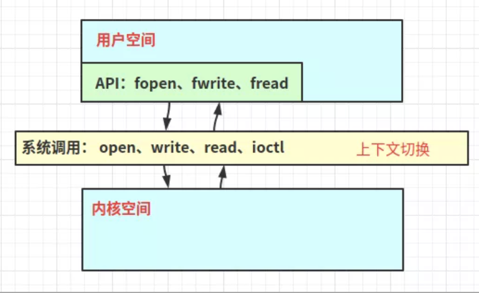
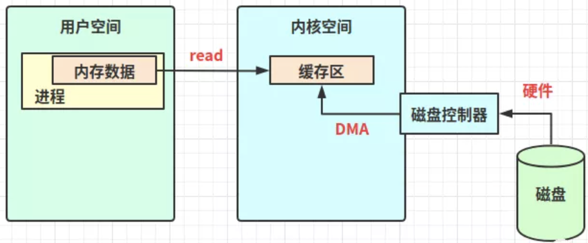
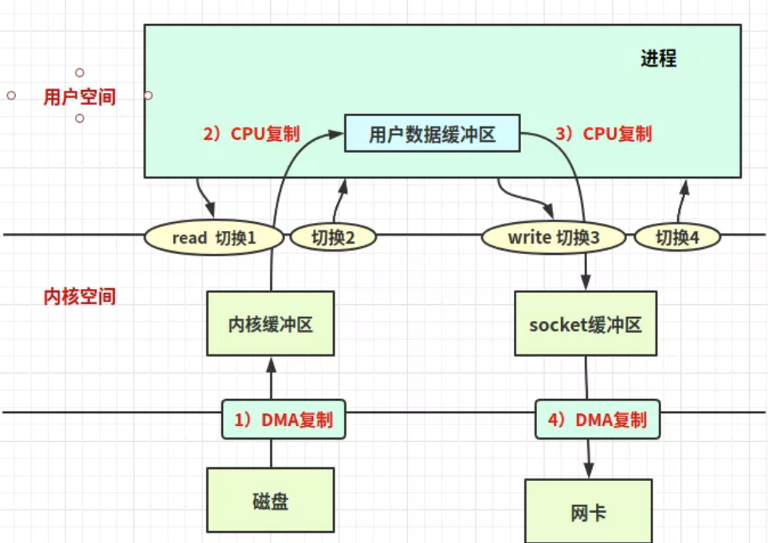
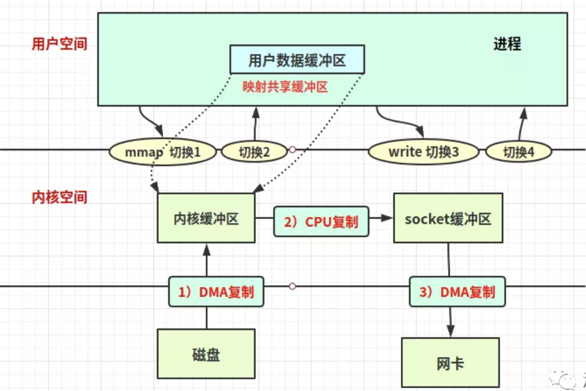
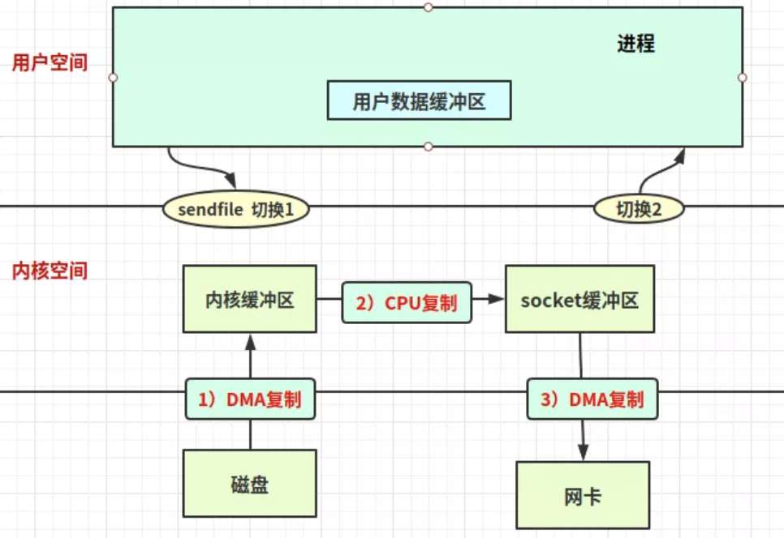
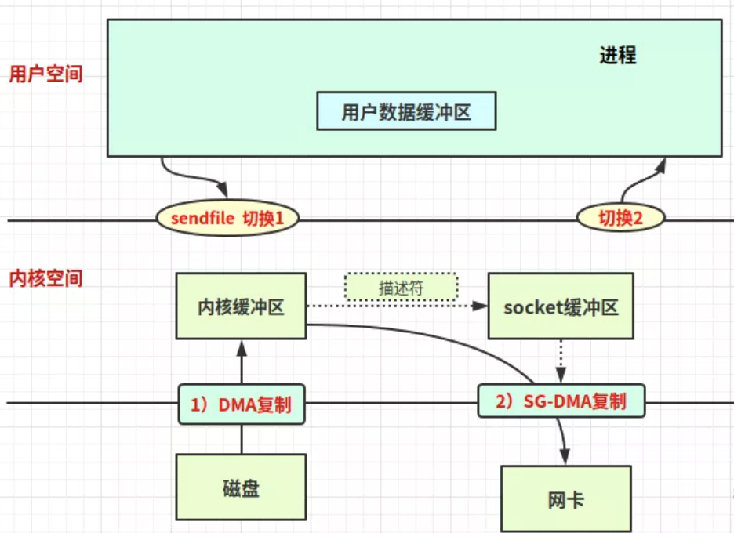
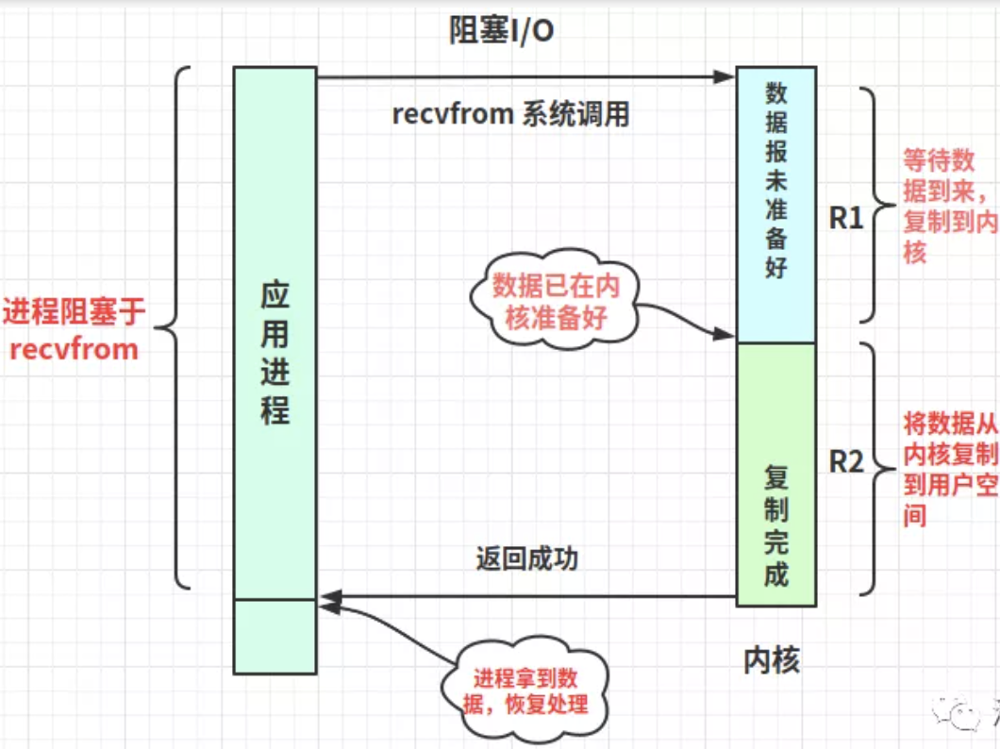
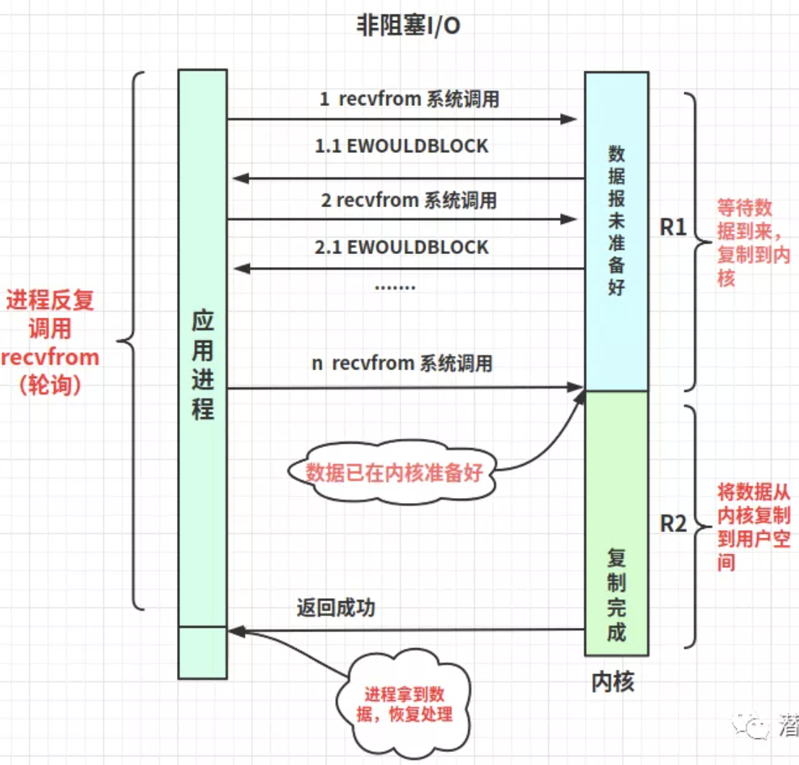
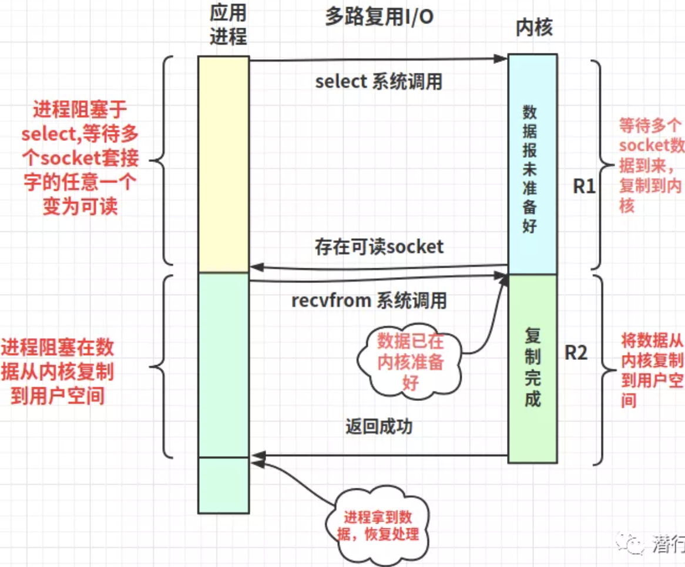
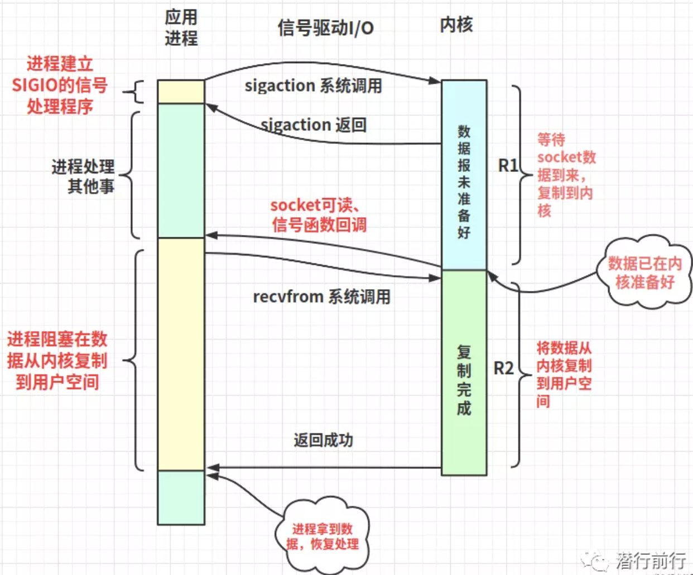

# I/O 知识点

目录
+ [零拷贝技术](#零拷贝技术)
  - [零拷贝的好处](#零拷贝的好处)
  - [内核空间和用户空间](#内核空间和用户空间)
  - [缓冲区和虚拟内存](#缓冲区和虚拟内存)
  - [传统的IO](#传统的IO)
  - [零拷贝的实现](#零拷贝的实现)
  - [java提供的零拷贝方式](#java提供的零拷贝方式)
+ [linux网络IO](#linux网络IO)
  - [linux网络IO-基本概念](#linux网络IO-基本概念)
  - [网络IO的读写过程](#网络IO的读写过程)
  - [linux五种网络IO模型](#linux五种网络IO模型)
  

## 零拷贝技术
零拷贝就是没有把数据从一个存储区域拷贝到另一个存储区域，在java NIO、netty、kafka遇到的零拷贝，并不是不复制数据，而是减少不必要的数据拷贝次数，从而提升代码性能。

**以下内容基于Linux系统**

### 零拷贝的好处
1. 减少或避免不必要的CPU数据拷贝，减轻CPU负担；
2. 零拷贝机制能减少 [**用户空间和操作系统内核空间**](#内核空间和用户空间) 的上下文切换；
3. 减少内存的占用

### 内核空间和用户空间
内核空间：Linux自身使用的空间；主要提供进程调度、内存分配、连接硬件资源等功能；  
用户空间：提供给各个程序进程的空间；用户空间**不具有访问内核空间资源的权限**，如果应用程序需要使用到内核空间的资源，则需要通过系统调用来完成：**从用户空间切换到内核空间，完成相关操作后再从内核空间切换回用户空间**。



### 缓冲区和虚拟内存
1. 缓冲区：是所有I/O的基础，I/O 无非就是把数据移进或移出缓冲区：
  - 进程发起read请求，内核先检查内核空间缓冲区是否存在进程所需数据，如果已经存在，则直接copy数据到进程的内存区。如果没有，系统则向磁盘请求数据，通过DMA写入内核的read缓冲冲区，接着再将内核缓冲区数据copy到进程的内存区；
  - 进程发起write请求，则是把进程的内存区数据copy到内核的write缓冲区，然后再通过DMA把内核缓冲区数据刷回磁盘或者网卡中。  
  
2. 虚拟内存：现代操作系统都使用虚拟内存，有如下两个好处：
  - 一个以上的虚拟地址可以指向同一个物理内存地址；
  - 虚拟内存空间可大于实际可用的物理地址。
3. 直接内存访问（Direct Memory Access）（DMA），DMA允许外设设备和内存存储器之间直接进行IO数据传输，其过程不需要CPU的参与；利用虚拟内存的第一点特性可以把内核空间地址和用户空间的虚拟地址映射到同一个物理地址，这样DMA就可以填充(读写)对内核和用户空间进程同时可见的缓冲区了；大致如下：  
  

### <span id="传统的IO">传统的IO</span>
如java在linux系统上，读取一个磁盘文件，并发送到远程端的服务：
1. 发出read系统调用，会导致用户空间到内核空间的上下文切换，然后再通过DMA将文件中的数据从磁盘上读取到内核空间缓冲区；
2. 接着将内核空间缓冲区的数据拷贝到用户空间进程内存，然后read系统调用返回。而系统调用的返回又会导致一次内核空间到用户空间的上下文切换；
3. write系统调用，则再次导致用户空间到内核空间的上下文切换，将用户空间的进程里的内存数据复制到内核空间的socket缓冲区（也是内核缓冲区，不过是给socket使用的），然后write系统调用返回，再次触发上下文切换
4. 至于socket缓冲区到网卡的数据传输则是独立异步的过程，也就是说write系统调用的返回并不保证数据被传输到网卡。

过程图如下：


上述过程中，**一共有4次用户空间与内核空间的上下文切换。4次数据copy，分别是2次DMA数据复制，2次CPU数据复制**

### 零拷贝的实现
#### 使用mmap+write实现的零拷贝
~~mmap即内存映射(我猜的，应该是，不是别打我)~~
1. 发出mmap系统调用，导致用户空间到内核空间的上下文切换。然后通过DMA引擎将磁盘文件中的数据复制到内核空间缓冲区；
2. mmap系统调用返回，导致内核空间到用户空间的上下文切换；
3. 这里不需要将数据从内核空间复制到用户空间，因为用户空间和内核空间共享了这个缓冲区；
4. 发出write系统调用，导致用户空间到内核空间的上下文切换。将数据从内核空间缓冲区复制到内核空间socket缓冲区；write系统调用返回，导致内核空间到用户空间的上下文切换；
5. 异步，DMA引擎将socket缓冲区中的数据copy到网卡。

过程图如下：


上述过程中，**通过mmap实现的零拷贝I/O进行了4次用户空间与内核空间的上下文切换，以及3次数据copy；分别是2次DMA拷贝和1次CPU拷贝**

#### sendfile实现的零拷贝
1. 发出sendfile系统调用，导致用户空间到内核空间的上下文切换，然后通过DMA引擎将磁盘文件中的内容复制到内核空间缓冲区中，接着再将数据从内核空间缓冲区复制到socket相关的缓冲区；
2. sendfile系统调用返回，导致内核空间到用户空间的上下文切换。DMA异步将内核空间socket缓冲区中的数据传递到网卡。

过程图如下：


上述过程中，**通过sendfile实现的零拷贝I/O进行了2次用户空间与内核空间的上下文切换，以及3次数据copy；分别是2次DMA拷贝和1次CPU拷贝**

#### 带有DMA收集拷贝功能的sendfile实现的零拷贝
从Linux 2.4版本开始，操作系统提供scatter和gather的SG-DMA方式，直接从内核空间缓冲区中将数据读取到网卡，无需将内核空间缓冲区的数据再复制一份到socket缓冲区

1. 发出sendfile系统调用，导致用户空间到内核空间的上下文切换。通过DMA引擎将磁盘文件中的内容复制到内核空间缓冲区；
2. 这里没把数据复制到socket缓冲区；取而代之的是，相应的描述符信息被复制到socket缓冲区。该描述符包含了两种的信息：A)内核缓冲区的内存地址、B)内核缓冲区的偏移量；
3. sendfile系统调用返回，导致内核空间到用户空间的上下文切换。DMA根据socket缓冲区的描述符提供的地址和偏移量直接将内核缓冲区中的数据复制到网卡。

过程图如下：


上述过程中，**带有DMA收集拷贝功能的sendfile实现的I/O使用了2次用户空间与内核空间的上下文切换，以及2次数据copy，而且这2次的数据copy都是非CPU拷贝。这样一来我们就实现了最理想的零拷贝I/O传输了，不需要任何一次的CPU拷贝，以及最少的上下文切换**

### <span id="java提供的零拷贝方式">java提供的零拷贝方式</span>
1. java NIO的零拷贝实现是基于mmap+write方式；
2. FileChannel的map方法产生的MappedByteBuffer FileChannel提供了map()方法，该方法可以在一个打开的文件和MappedByteBuffer之间建立一个虚拟内存映射，MappedByteBuffer继承于ByteBuffer；该缓冲器的内存是一个文件的内存映射区域。map方法底层是通过mmap实现的，因此将文件内存从磁盘读取到内核缓冲区后，用户空间和内核空间共享该缓冲区。

用法如下：
```java
public void main(String[] args){
    try {
        FileChannel readChannel = FileChannel.open(Paths.get("./cscw.txt"), StandardOpenOption.READ);
        FileChannel writeChannel = FileChannel.open(Paths.get("./siting.txt"), StandardOpenOption.WRITE, StandardOpenOption.CREATE);
        MappedByteBuffer data = readChannel.map(FileChannel.MapMode.READ_ONLY, 0, 1024 * 1024 * 40);
        //数据传输
        writeChannel.write(data);
        readChannel.close();
        writeChannel.close();
    }catch (Exception e){
        System.out.println(e.getMessage());
    }
}
```

## linux网络IO

### linux网络IO-基本概念
- 进程(线程)切换：所有系统都有调度进程的能力，它可以挂起一个当前正在运行的进程，并恢复之前挂起的进程；
- 进程(线程)的阻塞：运行中的进程，有时会等待其他事件的执行完成，比如等待锁，请求I/O的读写；进程在等待过程会被系统自动执行阻塞，此时进程不占用CPU；
- 文件描述符：在Linux，文件描述符是一个用于表述指向文件引用的抽象化概念，它是一个非负整数；当程序打开一个现有文件或者创建一个新文件时，内核向进程返回一个文件描述符；
- linux信号处理：Linux进程运行中可以接受来自系统或者进程的信号值，然后根据信号值去运行相应捕捉函数；信号相当于是硬件中断的软件模拟。

### 网络IO的读写过程
1. 当在[用户空间](#内核空间和用户空间)发起对socket套接字的读操作时，会导致上下文切换，用户进程阻塞（R1）等待网络数据流到来，从网卡复制到内核；（R2）然后从内核缓冲区向用户进程缓冲区复制；此时进程切换恢复，处理拿到的数据；
2. 这里给socket读操作的第一阶段起个别名R1，第二阶段称为R2；
3. 当在用户空间发起对socket的send操作时，导致上下文切换，用户进程阻塞等待数据从用户进程缓冲区复制到内核缓冲区；数据copy完成，此时进程切换恢复。
4. 脑子里没概念的可以回去看看[图](#传统的IO)

### linux五种网络IO模型

#### BIO(阻塞式I/O blocking IO)
- 最基础的I/O模型就是阻塞I/O模型，也是最简单的模型。所有的操作都是顺序执行的；
- 阻塞IO模型中，用户空间的应用程序执行一个系统调用（recvform），会导致应用程序被阻塞，直到内核缓冲区的数据准备好，并且将数据从内核复制到用户进程；最后进程才被系统唤醒处理数据；
- 在R1、R2连续两个阶段，整个进程都被阻塞。  



#### NIO(非阻塞式I/O nonblocking IO)
- 非阻塞IO也是一种同步IO，它是基于轮询（polling）机制实现；在这种模型中，套接字(socket)是以非阻塞的形式打开的，就是说I/O操作不会立即完成，但是I/O操作会返回一个错误代码(EWOULDBLOCK)，提示操作未完成；
- 轮询检查内核数据，如果数据未准备好，则返回EWOULDBLOCK；进程再继续发起recvfrom调用，当然也可以暂停去做其他事；
- 直到内核数据准备好，再拷贝数据到用户空间，然后进程拿到非错误码数据，接着进行数据处理。需要注意，拷贝数据整个过程，进程仍然是属于阻塞的状态；
- 进程在R2阶段阻塞，虽然在R1阶段没有被阻塞，但是需要不断轮询。



#### 多路复用I/O (IO multiplexing)
- 一般后端服务都会存在大量的socket连接，如果一次能查询多个套接字的读写状态，若有任意一个准备好，那就去处理它，效率会高很多。这就是“I/O多路复用”，多路是指多个socket套接字，复用是指复用同一个进程；
- linux提供了select、poll、epoll等多路复用I/O的实现方式；select或poll、epoll是阻塞调用；
- 与阻塞IO不同，select不会等到socket数据全部到达再处理，而是有了一部分socket数据准备好就会恢复用户进程来处理。怎么知道有一部分数据在内核准备好了呢？答案：系统知道就行；
- 进程在R1、R2阶段也是阻塞；不过在R1阶段有个技巧，在多进程、多线程编程的环境下，我们可以只分配一个进程（线程）去阻塞调用select，其他线程不就可以解放了吗？



#### SIGIO (信号驱动式I/O)
- 需要提供一个信号捕捉函数，并和socket套接字关联；发起sigaction调用之后进程就能解放去处理其他事；
- 当数据在内核准备好后，进程会收到一个SIGIO信号，继而中断去运行信号捕捉函数，调用recvfrom把数据从内核读取到用户空间，再处理数据；
- 可以看出用户进程是不会阻塞在R1阶段，但R2还是会阻塞等待。



#### AIO(异步IO POSIX的aio_系列函数)
- 相对同步IO，异步IO在用户进程发起异步读（aio_read）系统调用之后，无论内核缓冲区数据是否准备好，都不会阻塞当前进程；在aio_read系统调用返回后进程就可以处理其他逻辑；
- socket数据在内核就绪时，系统直接把数据从内核复制到用户空间，然后再使用信号通知用户进程；
- R1、R2两阶段时进程都是非阻塞的。


