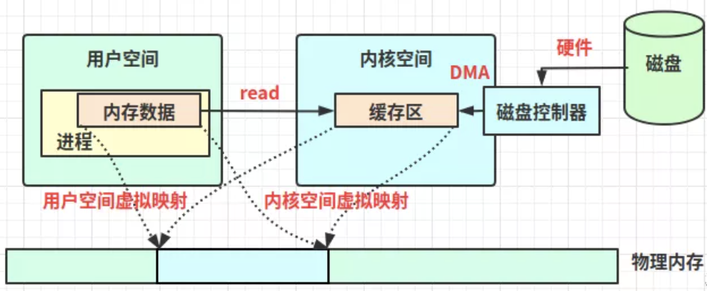

# I/O 知识点

目录
+ [零拷贝技术](#零拷贝技术)
  - [零拷贝的好处](#零拷贝的好处)
  - [内核空间和用户空间](#内核空间和用户空间)
  - [缓冲区和虚拟内存](#缓冲区和虚拟内存)
  - [传统的I/O](#传统的I/O)
  - [实现的零拷贝](#实现的零拷贝)
  - [java提供的零拷贝方式](#java提供的零拷贝方式)
  

## 零拷贝技术
零拷贝就是没有把数据从一个存储区域拷贝到另一个存储区域，在java NIO、netty、kafka遇到的零拷贝，并不是不复制数据，而是减少不必要的数据拷贝次数，从而提升代码性能。

**以下内容基于Linux系统**

### 零拷贝的好处
1. 减少或避免不必要的CPU数据拷贝，减轻CPU负担；
2. 零拷贝机制能减少 [**用户空间和操作系统内核空间**](#内核空间和用户空间) 的上下文切换；
3. 减少内存的占用

### 内核空间和用户空间
内核空间：Linux自身使用的空间；主要提供进程调度、内存分配、连接硬件资源等功能；
用户空间：提供给各个程序进程的空间；用户空间**不具有访问内核空间资源的权限**，如果应用程序需要使用到内核空间的资源，则需要通过系统调用来完成：**从用户空间切换到内核空间，完成相关操作后再从内核空间切换回用户空间**。

### 缓冲区和虚拟内存
1. 缓冲区：是所有I/O的基础，I/O 无非就是把数据移进或移出缓冲区：
  - 进程发起read请求，内核先检查内核空间缓冲区是否存在进程所需数据，如果已经存在，则直接copy数据到进程的内存区。如果没有，系统则向磁盘请求数据，通过DMA写入内核的read缓冲冲区，接着再将内核缓冲区数据copy到进程的内存区；
  - 进程发起write请求，则是把进程的内存区数据copy到内核的write缓冲区，然后再通过DMA把内核缓冲区数据刷回磁盘或者网卡中。  
  
2. 虚拟内存：现代操作系统都使用虚拟内存，有如下两个好处：
  - 一个以上的虚拟地址可以指向同一个物理内存地址；
  - 虚拟内存空间可大于实际可用的物理地址。
3. 直接内存访问（Direct Memory Access）（DMA），DMA允许外设设备和内存存储器之间直接进行IO数据传输，其过程不需要CPU的参与；利用虚拟内存的第一点特性可以把内核空间地址和用户空间的虚拟地址映射到同一个物理地址，这样DMA就可以填充(读写)对内核和用户空间进程同时可见的缓冲区了；大致如下：  
  

### 传统的I/O
如java在linux系统上，读取一个磁盘文件，并发送到远程端的服务：
1. 发出read系统调用，会导致用户空间到内核空间的上下文切换，然后再通过DMA将文件中的数据从磁盘上读取到内核空间缓冲区；
2. 接着将内核空间缓冲区的数据拷贝到用户空间进程内存，然后read系统调用返回。而系统调用的返回又会导致一次内核空间到用户空间的上下文切换；
3. write系统调用，则再次导致用户空间到内核空间的上下文切换，将用户空间的进程里的内存数据复制到内核空间的socket缓冲区（也是内核缓冲区，不过是给socket使用的），然后write系统调用返回，再次触发上下文切换
4. 至于socket缓冲区到网卡的数据传输则是独立异步的过程，也就是说write系统调用的返回并不保证数据被传输到网卡。

过程图如下：

上述过程中，**一共有4次用户空间与内核空间的上下文切换。4次数据copy，分别是2次DMA数据复制，2次CPU数据复制**

### 实现的零拷贝
#### 使用mmap+write实现的零拷贝
~~mmap即内存映射(我猜的，应该是，不是别打我)~~
1. 发出mmap系统调用，导致用户空间到内核空间的上下文切换。然后通过DMA引擎将磁盘文件中的数据复制到内核空间缓冲区；
2. mmap系统调用返回，导致内核空间到用户空间的上下文切换；
3. 这里不需要将数据从内核空间复制到用户空间，因为用户空间和内核空间共享了这个缓冲区；
4. 发出write系统调用，导致用户空间到内核空间的上下文切换。将数据从内核空间缓冲区复制到内核空间socket缓冲区；write系统调用返回，导致内核空间到用户空间的上下文切换；
5. 异步，DMA引擎将socket缓冲区中的数据copy到网卡。

过程图如下：

上述过程中，**通过mmap实现的零拷贝I/O进行了4次用户空间与内核空间的上下文切换，以及3次数据copy；分别是2次DMA拷贝和1次CPU拷贝**

#### sendfile实现的零拷贝
1. 发出sendfile系统调用，导致用户空间到内核空间的上下文切换，然后通过DMA引擎将磁盘文件中的内容复制到内核空间缓冲区中，接着再将数据从内核空间缓冲区复制到socket相关的缓冲区；
2. sendfile系统调用返回，导致内核空间到用户空间的上下文切换。DMA异步将内核空间socket缓冲区中的数据传递到网卡。

过程图如下：

上述过程中，**通过sendfile实现的零拷贝I/O进行了2次用户空间与内核空间的上下文切换，以及3次数据copy；分别是2次DMA拷贝和1次CPU拷贝**

#### 带有DMA收集拷贝功能的sendfile实现的零拷贝
从Linux 2.4版本开始，操作系统提供scatter和gather的SG-DMA方式，直接从内核空间缓冲区中将数据读取到网卡，无需将内核空间缓冲区的数据再复制一份到socket缓冲区

1. 发出sendfile系统调用，导致用户空间到内核空间的上下文切换。通过DMA引擎将磁盘文件中的内容复制到内核空间缓冲区；
2. 这里没把数据复制到socket缓冲区；取而代之的是，相应的描述符信息被复制到socket缓冲区。该描述符包含了两种的信息：A)内核缓冲区的内存地址、B)内核缓冲区的偏移量；
3. sendfile系统调用返回，导致内核空间到用户空间的上下文切换。DMA根据socket缓冲区的描述符提供的地址和偏移量直接将内核缓冲区中的数据复制到网卡。

过程图如下：

上述过程中，**带有DMA收集拷贝功能的sendfile实现的I/O使用了2次用户空间与内核空间的上下文切换，以及2次数据copy，而且这2次的数据copy都是非CPU拷贝。这样一来我们就实现了最理想的零拷贝I/O传输了，不需要任何一次的CPU拷贝，以及最少的上下文切换**

### java提供的零拷贝方式
1. java NIO的零拷贝实现是基于mmap+write方式；
2. FileChannel的map方法产生的MappedByteBuffer FileChannel提供了map()方法，该方法可以在一个打开的文件和MappedByteBuffer之间建立一个虚拟内存映射，MappedByteBuffer继承于ByteBuffer；该缓冲器的内存是一个文件的内存映射区域。map方法底层是通过mmap实现的，因此将文件内存从磁盘读取到内核缓冲区后，用户空间和内核空间共享该缓冲区。

用法如下：TODO