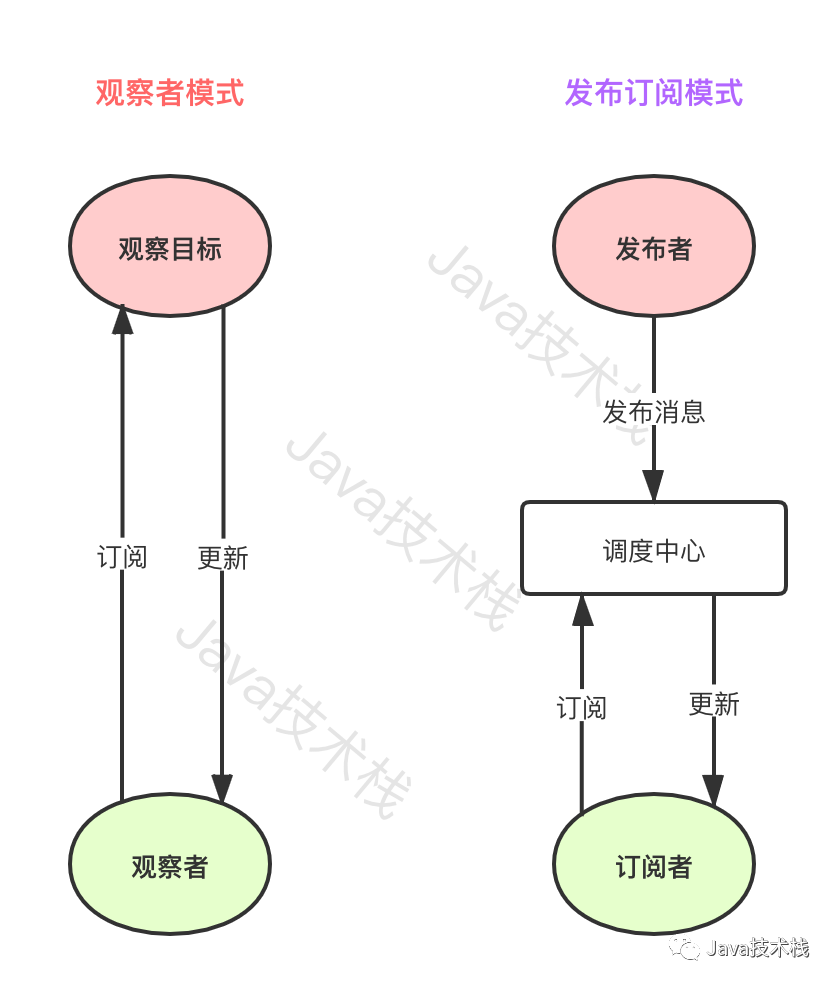
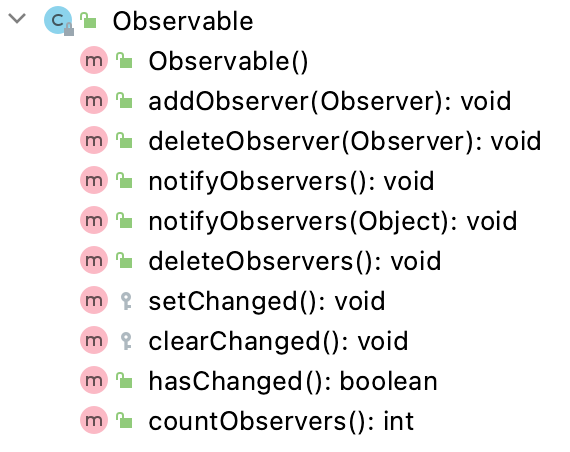
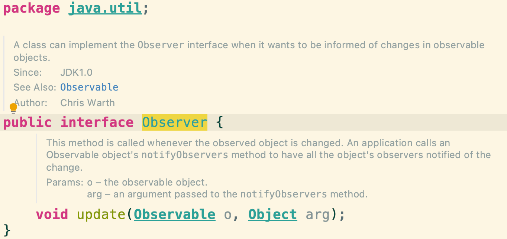
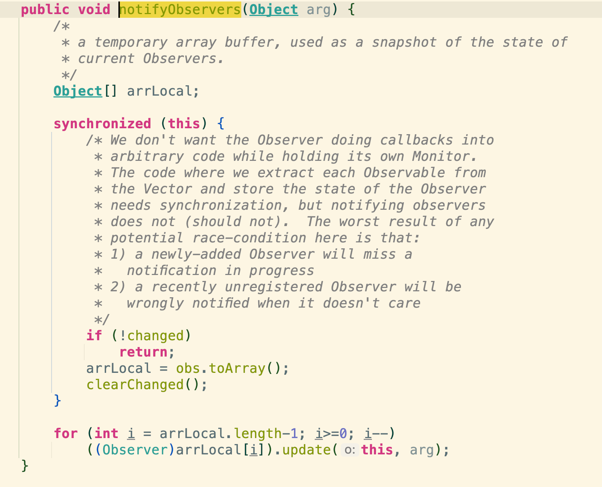
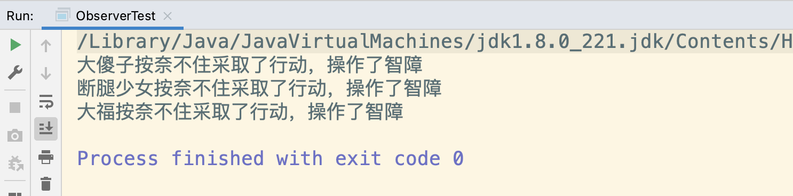

#  JDK自带的观察者模式实现

[TOC]

<!-- START doctoc generated TOC please keep comment here to allow auto update -->
<!-- DON'T EDIT THIS SECTION, INSTEAD RE-RUN doctoc TO UPDATE -->

- [JDK自带的观察者模式实现](#jdk%E8%87%AA%E5%B8%A6%E7%9A%84%E8%A7%82%E5%AF%9F%E8%80%85%E6%A8%A1%E5%BC%8F%E5%AE%9E%E7%8E%B0)
    - [什么是观察者模式](#%E4%BB%80%E4%B9%88%E6%98%AF%E8%A7%82%E5%AF%9F%E8%80%85%E6%A8%A1%E5%BC%8F)
    - [发布-订阅模式](#%E5%8F%91%E5%B8%83-%E8%AE%A2%E9%98%85%E6%A8%A1%E5%BC%8F)
    - [JDK自带的观察者模式轮子](#jdk%E8%87%AA%E5%B8%A6%E7%9A%84%E8%A7%82%E5%AF%9F%E8%80%85%E6%A8%A1%E5%BC%8F%E8%BD%AE%E5%AD%90)
    - [观察者模式使用](#%E8%A7%82%E5%AF%9F%E8%80%85%E6%A8%A1%E5%BC%8F%E4%BD%BF%E7%94%A8)
        - [新增观察目标类](#%E6%96%B0%E5%A2%9E%E8%A7%82%E5%AF%9F%E7%9B%AE%E6%A0%87%E7%B1%BB)
        - [新增观察者类](#%E6%96%B0%E5%A2%9E%E8%A7%82%E5%AF%9F%E8%80%85%E7%B1%BB)
        - [新增测试类](#%E6%96%B0%E5%A2%9E%E6%B5%8B%E8%AF%95%E7%B1%BB)
    - [总结](#%E6%80%BB%E7%BB%93)

<!-- END doctoc generated TOC please keep comment here to allow auto update -->

## 什么是观察者模式

观察者模式（Observer Pattern）定义了对象间的一种一对多的依赖关系，这样只要一个对象的状态发生改变，其依赖的所有相关对象都会得到通知并自动更新。

在观察者模式中，发生改变的对象叫做**观察目标**，而被通知更新的对象称为**观察者**，一个观察目标对应多个观察者，观察者一般是一个列表集合，可以根据需要动态增加和删除，易于扩展。

使用观察者模式的优点在于观察目标和观察者之间是抽象松耦合关系，降低了两者之间的耦合关系。

## 发布-订阅模式

观察者模式很多地方也叫**发布－订阅**模式（Publish/Subscribe），其实也可以这么理解，不过两者之间还是略有不同。

观察者模式中的观察者是直接绑定观察目标，观察目标要维护一套观察者列表，两者是有一个基于接口的组合依赖关系的，所以说观察者模式虽然是松耦合的，但并不是完全解耦的。

而**发布－订阅**模式中的发布者和订阅者两者并没有任何联系，发布者通过中间方发布一个主题（Topic），订阅者通过中间方（调度中心）订阅一个主题（Topic），发布者状态的变更也并不会直接通知订阅者，而要通过中间方进行通知，或者订阅者自行从中间方拉取，所以说**发布－订阅**模式是完全解耦的。

一图搞懂它们的关系：



## JDK自带的观察者模式轮子

因观察者模式应用比较广泛，所以 JDK 工具包从 1.0 版本里面自带了观察者模式模板套装，我们根据其模板很方便就能实现观察者模式，不需要再重复造轮子了。

**观察者目标类：**

> java.util.Observable



里面两个最重要的变量：

- **changed**：观察目标状态是否变更，默认为：false；
- **obs**：观察者列表（observers），一个线程安全的列表集合：Vector，默认为空集合；

里面的重要的方法都是和观察目标状态和观察者相关的，一看就清楚，这里就不介绍了。

**观察者接口：**

> java.util.Observer



## 观察者模式使用

### 新增观察目标类

```java
import java.util.Observable;

/**
 * 描述: 观察者模式demo - 被观察者
 *
 * @author: panhongtong
 * @date: 2021-04-10 22:45
 **/
public class TestObservable extends Observable {

    private String name;

    public void reName(String name) {
        // 命名
        this.name = name;
        // 改变状态
        this.setChanged();
        // 通知所有观察者
        this.notifyObservers();
    }

    public String getName() {
        return name;
    }

}
```

这里的逻辑一看就懂，就是如果有人调用了`reName()`方法，就会改变状态，然后通知观察者。

可以简单看一下`notifyObservers()`的源码：



先获取同步锁，判断状态是否更新，如已更新则清空观察目标状态，然后再使用 for 循环遍历所有观察者一一调用观察者的更新方法通知观察者更新。

### 新增观察者类

```java
import java.util.Observable;
import java.util.Observer;

/**
 * 描述: 观察者模式demo - 被观察者
 *
 * @author: panhongtong
 * @date: 2021-04-10 22:48
 **/
public class TestObserver implements Observer {

    private String name;

    @Override
    public void update(Observable o, Object arg) {
        acction(o);
    }

    private void acction(Observable o) {
        TestObservable observable = (TestObservable) o;
        System.out.println(name + "按奈不住采取了行动，操作了" + observable.getName());
    }

    public TestObserver(String name) {
        this.name = name;
    }
}
```

这个逻辑也很简单，观察目标通知观察者时会调用观察者的`update()`方法。

### 新增测试类

```java
/**
 * 描述: 测试类
 *
 * @author: panhongtong
 * @date: 2021-04-10 22:52
 **/
public class ObserverTest {
    public static void main(String[] args) {
        // 创建一个观察目标
        TestObservable observable = new TestObservable();

        // 添加观察者
        observable.addObserver(new TestObserver("大福"));
        observable.addObserver(new TestObserver("断腿少女"));
        observable.addObserver(new TestObserver("大傻子"));

        // 操作
        observable.reName("智障");
    }
}
```

朴实无华，输出如下：



## 总结

观察者模式的优点是为了给观察目标和观察者解耦，而缺点也很明显，从上面的例子也可以看出，如果观察者对象太多的话，有可能会造成内存泄露（？）。

另外，从性能上面考虑，所有观察者的更新都是在一个循环中排队进行的，所以观察者的更新操作可以考虑做成线程异步（或者可以使用线程池）的方式，以提升整体效率。

