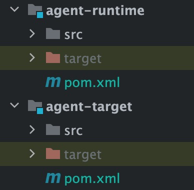
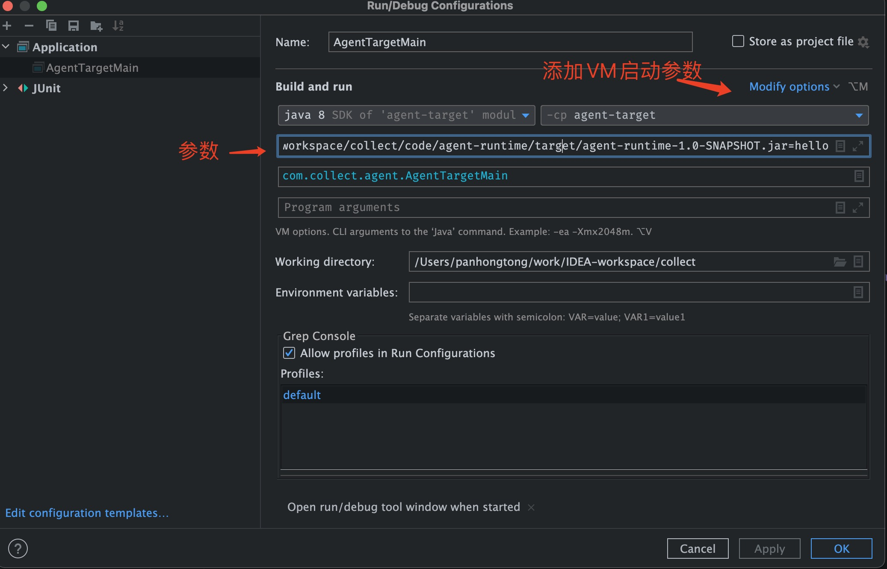
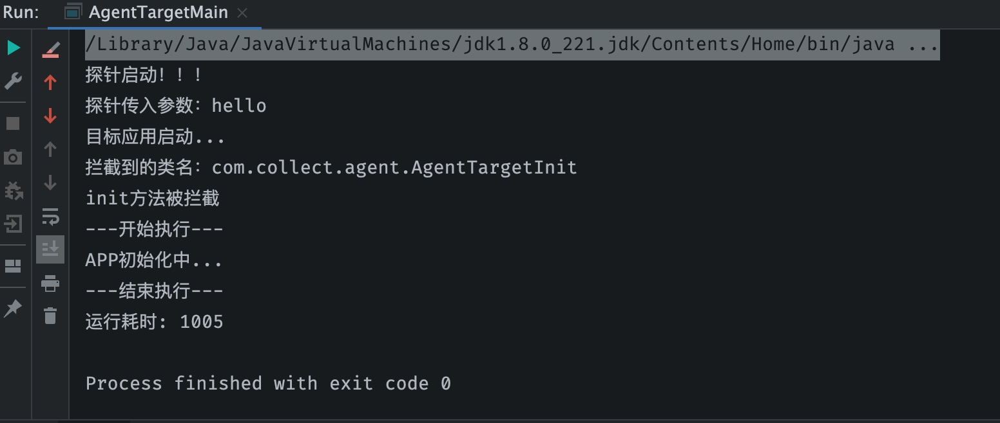

# JavaAgent-探针技术

<!-- START doctoc generated TOC please keep comment here to allow auto update -->
<!-- DON'T EDIT THIS SECTION, INSTEAD RE-RUN doctoc TO UPDATE -->

- [零、开篇](#%E9%9B%B6%E5%BC%80%E7%AF%87)
- [一、Java Agent 技术简介](#%E4%B8%80java-agent-%E6%8A%80%E6%9C%AF%E7%AE%80%E4%BB%8B)
- [二、Java Agent 功能介绍](#%E4%BA%8Cjava-agent-%E5%8A%9F%E8%83%BD%E4%BB%8B%E7%BB%8D)
- [三、Java Agent 实现原理](#%E4%B8%89java-agent-%E5%AE%9E%E7%8E%B0%E5%8E%9F%E7%90%86)
- [四、Java Agent 案例](#%E5%9B%9Bjava-agent-%E6%A1%88%E4%BE%8B)
  - [1. agent-target](#1-agent-target)
  - [2. runtime-agent](#2-runtime-agent)

<!-- END doctoc generated TOC please keep comment here to allow auto update -->

## 零、开篇

Java 中的 Agent 技术可以让我们无侵入性的去进行代理，最常用于程序调试、热部署、性能诊断分析等场景，现如今比较火热的分布式链路追踪项目Skywalking，就是通过探针技术去捕获日志，将数据上报OAP观察分析平台。

## 一、Java Agent 技术简介

Java Agent 直译为 Java 代理，也常常被称为 Java 探针技术。

Java Agent 是在 JDK1.5 引入的，是一种可以动态修改 Java 字节码的技术。Java 中的类编译后形成字节码被 JVM 执行，在 JVM 在执行这些字节码之前获取这些字节码的信息，并且通过字节码转换器对这些字节码进行修改，以此来完成一些额外的功能。

Java Agent 是一个不能独立运行 jar 包，它通过依附于目标程序的 JVM 进程，进行工作。启动时只需要在目标程序的启动参数中添加-javaagent 参数添加 ClassFileTransformer 字节码转换器，相当于在main方法前加了一个拦截器。

## 二、Java Agent 功能介绍

Java Agent 主要有以下功能

- Java Agent 能够在加载 Java 字节码之前拦截并对字节码进行修改;
- Java Agent 能够在 Jvm 运行期间修改已经加载的字节码;

Java Agent 的应用场景

- IDE 的调试功能，例如 Eclipse、IntelliJ IDEA ；
- 热部署功能，例如 JRebel、XRebel、spring-loaded；
- 各种线上诊断工具，例如 Btrace、Greys，还有阿里的 Arthas；
- 各种性能分析工具，例如 Visual VM、JConsole 等；
- 全链路性能检测工具，例如 Skywalking、Pinpoint等；


## 三、Java Agent 实现原理

在了解Java Agent的实现原理之前，需要对Java类加载机制有一个较为清晰的认知。一种是在man方法执行之前，通过premain来执行，另一种是程序运行中修改，需通过JVM中的Attach实现，Attach的实现原理是基于JVMTI。

主要是在类加载之前，进行拦截，对字节码修改

下面我们分别介绍一下这些关键术语：

- **JVMTI** 就是JVM Tool Interface，是 JVM 暴露出来给用户扩展使用的接口集合，JVMTI 是基于事件驱动的，JVM每执行一定的逻辑就会触发一些事件的回调接口，通过这些回调接口，用户可以自行扩展
  
  JVMTI是实现 Debugger、Profiler、Monitor、Thread Analyser 等工具的统一基础，在主流 Java 虚拟机中都有实现

- **JVMTIAgent**是一个动态库，利用JVMTI暴露出来的一些接口来干一些我们想做、但是正常情况下又做不到的事情，不过为了和普通的动态库进行区分，它一般会实现如下的一个或者多个函数：
  
  - Agent_OnLoad函数，如果agent是在启动时加载的，通过JVM参数设置
  - Agent_OnAttach函数，如果agent不是在启动时加载的，而是我们先attach到目标进程上，然后给对应的目标进程发送load命令来加载，则在加载过程中会调用Agent_OnAttach函数
  - Agent_OnUnload函数，在agent卸载时调用

- **javaagent** 依赖于instrument的JVMTIAgent（Linux下对应的动态库是libinstrument.so），还有个别名叫JPLISAgent(Java Programming Language Instrumentation Services Agent)，专门为Java语言编写的插桩服务提供支持的

- **instrument** 实现了Agent_OnLoad和Agent_OnAttach两方法，也就是说在使用时，agent既可以在启动时加载，也可以在运行时动态加载。其中启动时加载还可以通过类似-javaagent:jar包路径的方式来间接加载instrument agent，运行时动态加载依赖的是JVM的attach机制，通过发送load命令来加载agent

- **JVM Attach** 是指 JVM 提供的一种进程间通信的功能，能让一个进程传命令给另一个进程，并进行一些内部的操作，比如进行线程 dump，那么就需要执行 jstack 进行，然后把 pid 等参数传递给需要 dump 的线程来执行

## 四、Java Agent 案例

我们就以打印方法的执行时间为例，通过Java Agent来实现。

首先我们需要构建两个Maven的项目，一个用于实现外挂的Agent，一个用于实现测试目标程序。



我们在应用中导入项目公共依赖的包

```xml
    <dependencies>
        <dependency>
            <groupId>org.javassist</groupId>
            <artifactId>javassist</artifactId>
            <version>3.28.0-GA</version>
        </dependency>
    </dependencies>
```

### 1. agent-target

首先我们去构建测试的目标程序（agent-target）

```java
/**
 * @description: 启动类
 * @date: 2022/4/19 10:40
 **/
public class AgentTargetMain {
    public static void main(String[] args) {
        System.out.println("目标应用启动...");
        AgentTargetInit.init();
    }
}

/**
 * @description: 模拟的应用初始化的类
 * @date: 2022/4/19 10:41
 **/
public class AgentTargetInit {
    public static void init() {
        try {
            System.out.println("APP初始化中...");
            Thread.sleep(1000);
        } catch (InterruptedException e) {
            e.printStackTrace();
        }
    }
}
```

然后我们启动程序，测试是否能正常执行。

### 2. runtime-agent

然后我们开始构建探针程序，探针程序中我们需要编写，改变原有class的Transformer，通过自定义的Transformer类完成输出方法执行时间的功能

首先构检Agent程序的入口

```java
import java.lang.instrument.Instrumentation;

/**
 * @description: 代理入口
 * @date: 2022/4/19 10:50
 **/
public class RunTimeAgent {
    public static void premain(String arg, Instrumentation instrumentation) {
        System.out.println("探针启动！！！");
        System.out.println("探针传入参数：" + arg);
        instrumentation.addTransformer(new RunTimeTransformer());
    }
}
```

这里每个类加载的时候都会走这个方法，我们可以通过className进行指定类的拦截，然后借助javassist这个工具，进行对Class的处理，这里的思想和反射类似，但是要比反射功能更加强大，可以动态修改字节码。

javassist是一个开源的分析、编辑和创建Java字节码的类库。

```java
import javassist.ClassPool;
import javassist.CtClass;
import javassist.CtMethod;

import java.lang.instrument.ClassFileTransformer;
import java.lang.instrument.IllegalClassFormatException;
import java.security.ProtectionDomain;

/**
 * @description: 转换器
 * @date: 2022/4/19 10:44
 **/
public class RunTimeTransformer implements ClassFileTransformer {

    private static final String INJECTED_CLASS = "com.collect.agent.AgentTargetInit";

    @Override
    public byte[] transform(ClassLoader loader, String className, Class<?> classBeingRedefined, ProtectionDomain protectionDomain, byte[] classfileBuffer) throws IllegalClassFormatException {
        String realClassName = className.replace("/", ".");
        if (realClassName.equals(INJECTED_CLASS)) {
            System.out.println("拦截到的类名：" + realClassName);
            CtClass ctClass;
            try {
                // 使用javassist,获取字节码类
                ClassPool classPool = ClassPool.getDefault();
                ctClass = classPool.get(realClassName);

                // 得到该类所有的方法实例，也可选择方法，进行增强
                CtMethod[] declaredMethods = ctClass.getDeclaredMethods();
                for (CtMethod method : declaredMethods) {
                    System.out.println(method.getName() + "方法被拦截");
                    method.addLocalVariable("time", CtClass.longType);
                    method.insertBefore("System.out.println(\"---开始执行---\");");
                    method.insertBefore("time = System.currentTimeMillis();");
                    method.insertAfter("System.out.println(\"---结束执行---\");");
                    method.insertAfter("System.out.println(\"运行耗时: \" + (System.currentTimeMillis() - time));");
                }
                return ctClass.toBytecode();
            } catch (Throwable e) { //这里要用Throwable，不要用Exception
                e.printStackTrace();
            }
        }
        return classfileBuffer;
    }
}
```

我们还需要在Maven中配置，编译打包的插件，这样我们就可以很轻松的借助Maven生成Agent的jar包

```xml
    <build>
        <plugins>
            <plugin>
                <groupId>org.apache.maven.plugins</groupId>
                <artifactId>maven-compiler-plugin</artifactId>
                <version>3.5.1</version>
                <!-- 指定maven编译的jdk版本。若不指定,maven3默认用jdk 1.5 maven2默认用jdk1.3 -->
                <configuration>
                    <source>8</source>
                    <target>8</target>
                </configuration>
            </plugin>

            <plugin>
                <groupId>org.apache.maven.plugins</groupId>
                <artifactId>maven-jar-plugin</artifactId>
                <version>3.2.0</version>
                <configuration>
                    <archive>
                        <!--自动添加META-INF/MANIFEST.MF -->
                        <manifest>
                            <addClasspath>true</addClasspath>
                        </manifest>
                        <manifestEntries>
                            <Menifest-Version>1.0</Menifest-Version>
                            <!--Agent入口类-->
                            <Premain-Class>com.collect.agent.RunTimeAgent</Premain-Class>
                            <Can-Redefine-Classes>true</Can-Redefine-Classes>
                            <Can-Retransform-Classes>true</Can-Retransform-Classes>
                        </manifestEntries>
                    </archive>
                </configuration>
            </plugin>
        </plugins>
    </build>
```

否则我们需要在resources下创建META-INF/MANIFEST.MF文件，文件内容如下，我们可以看出这个与Maven中的配置是一致的，然后通过配置编译器，借助编译器打包成jar包，需指定该文件

```textile
Manifest-Version: 1.0
Premain-Class: com.zhj.agent.RunTimeAgent
Can-Redefine-Classes: true
Can-Retransform-Classes: true
```

告示文件MANIFEST.MF参数说明：

- Manifest-Version：文件版本

- Premain-Class：包含 premain 方法的类（类的全路径名）main方法运行前代理

- Agent-Class：包含 agentmain 方法的类（类的全路径名）main开始后可以修改类结构

- Boot-Class-Path（可选）：设置引导类加载器搜索的路径列表。查找类的特定于平台的机制失败后，引导类加载器会搜索这些路径。按列出的顺序搜索路径。列表中的路径由一个或多个空格分开。

- Can-Redefine-Classes true（可选）：表示能重定义此代理所需的类，默认值为 false

- Can-Retransform-Classes true（可选）：表示能重转换此代理所需的类，默认值为 false 

- Can-Set-Native-Method-Prefix true（可选）：表示能设置此代理所需的本机方法前缀，默认值为 false

- ...

最后通过Maven生成Agent的jar包，然后修改测试目标程序的启动器，添加JVM参数即可

参数示例：-javaagent:{你jar包的路径}\runtime-agent-1.0-SNAPSHOT.jar=hello



最终效果：


