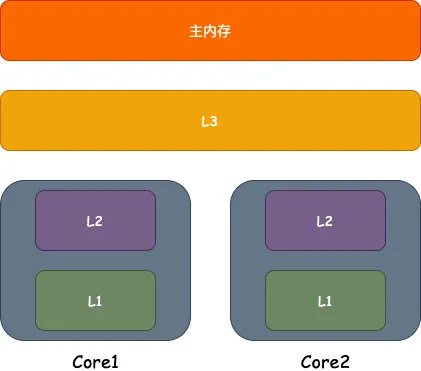
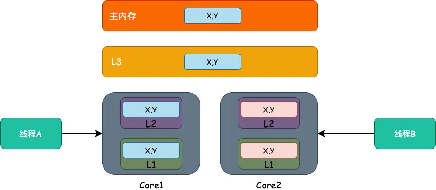
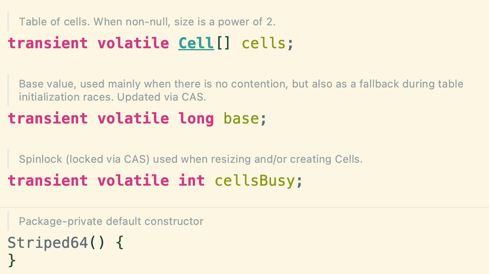
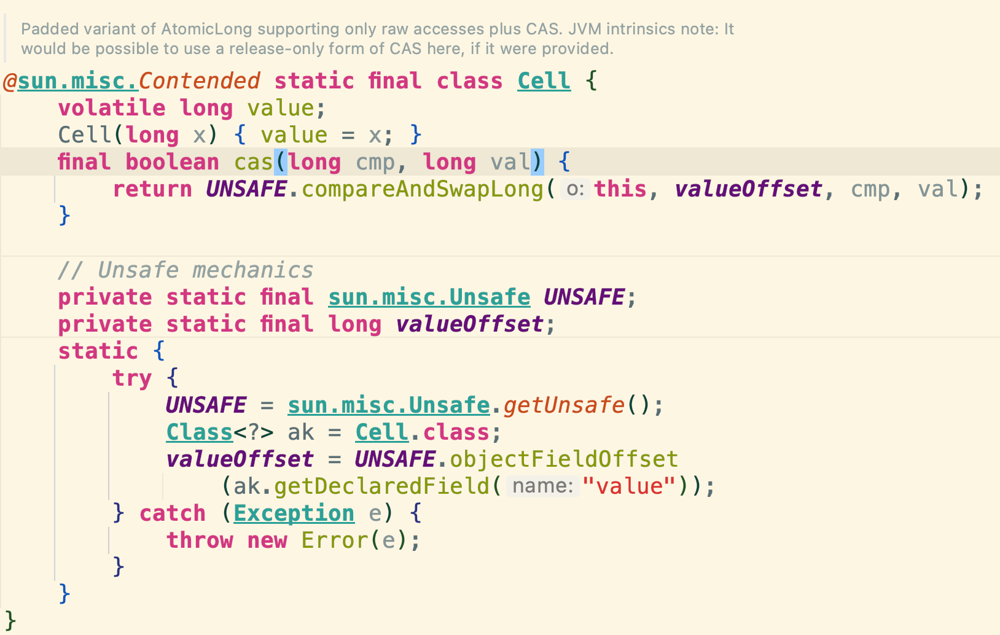

# 伪共享

目录

+ [什么是伪共享](#什么是伪共享)
+ [如何避免](#如何避免)
+ [实际应用](#实际应用)

## 什么是伪共享

首先，要知道CPU的速度远远快于内存，所以一般现在的CPU都加入了高速缓存；加入了缓存，就必然会导致缓存一致性的问题，由此，又引入了 [缓存一致性协议](../computer/diagram/CPU缓存一致性.md)
。

CPU缓存，顾名思义，越贴近CPU的缓存速度越快，容量越小，造价成本也越高，而高速缓存一般可以分为L1、L2、L3三级缓存，按照性能的划分：L1>L2>L3。  


而数据在缓存内部都是按照行来存储的，叫做**缓存行**。存行一般都是2的整数幂个字节，一般来说范围在32-256个字节之间，现在最为常见的缓存行的大小在64个字节。  
所以，按照这个存储方式，缓存中的数据并不是一个个单独的变量的存储方式，而是多个变量会放到一行中。  
我们常说的一个例子就是数组和链表，数组的内存地址是连续的，当我们去读取数组中的元素时，CPU会把数组中后续的若干个元素也加载到缓存中，以此提高效率，但是链表则不会，也就是说，**内存地址连续的变量才有可能被放到一个缓存行中**。

在多个线程并发修改一个缓存行中的多个变量时，由于只能同时有一个线程去操作缓存行，将会导致性能的下降，这个问题就称之为**伪共享**。

为什么只有一个线程能去操作？我们举个实际的栗子来说明这种情况：  
假设缓存中有`x,y`两个变量，他们同时已经在不同的三级缓存之中；  
这时有两个线程A和B同时去修改位于`Core1`和`Core2`的变量`x`和`y`；  
如果线程A去修改`Core1`的缓存中的`x`变量，由于缓存一致性协议，`Core2`中对应的缓存了`x,y`变量的缓存行将会失效，他会被强制从主内存中重新去加载变量。

这样的话，频繁的访问主内存，缓存基本都失效了，将会导致性能的下降，这就是伪共享的问题。  


## 如何避免

一个可行的方法就是**填充**，如果这一行只有我这一个数据那不就好了吗？  
确实就是这样，解决方式通常有以下两种：

### 字节填充

在JDK8之前，可以通过填充字节的方式来避免伪共享的问题，如下代码所示：

```java
public class DemoCode {
    public volatile long value = 0;
    public long p1, p2, p3, p4, p5;
}
```

一般而言，缓存行有64字节，一个long是8个字节，填充5个long之后，一共就是48个字节。而 Java 中对象头在32位系统下占用8个字节，64位系统下占用16个字节，这样填充5个long型即可填满64字节，也就是一个缓存行。

### @Contented注解

JDK8以及之后的版本 Java 提供了 `@Contented` 注解，通过@Contented注解就可以解决伪共享的问题：

```java
import sun.misc.Contended;

@Contended
public class DemoCode {
    public volatile long value = 0;
}
```

使用`@Contented`注解后会增加128字节的padding，并且需要开启`-XX:-RestrictContended`选项后才能生效。

**推荐尽量使用注解的方式来实现**

虽然解决了伪共享问题，但是这种填充的方式也浪费了缓存资源，明明只有8B的大小，硬是使用了64B缓存空间，造成了缓存资源的浪费；而且我们知道，缓存又小又贵，时间和空间的取舍要自己酌情考虑。

## 实际应用

在Java中提供了多个原子变量的操作类，就是比如`AtomicLong`、`AtomicInteger`这些，通过CAS的方式去更新变量，但是失败会无限自旋尝试，导致CPU资源的浪费。  
为了解决高并发下的这个缺点，JDK8中新增了`LongAdder`类，他的使用就是对解决伪共享的实际应用。  
`LongAdder`继承自`Striped64`，内部维护了一个`Cell数组`，核心思想就是把单个变量的竞争拆分，多线程下如果一个Cell竞争失败，转而去其他Cell再次CAS重试。  


解决伪共享的真正的核心就在`Cell数组`，可以看到，Cell数组使用了`@Contented`注解。  
在上面我们提到数组的内存地址都是连续的，所以数组内的元素经常会被放入一个缓存行，这样的话就会带来伪共享的问题，影响性能。  
这里使用`@Contented`进行填充，就避免了伪共享的问题，使得数组中的元素不再共享一个缓存行。  
