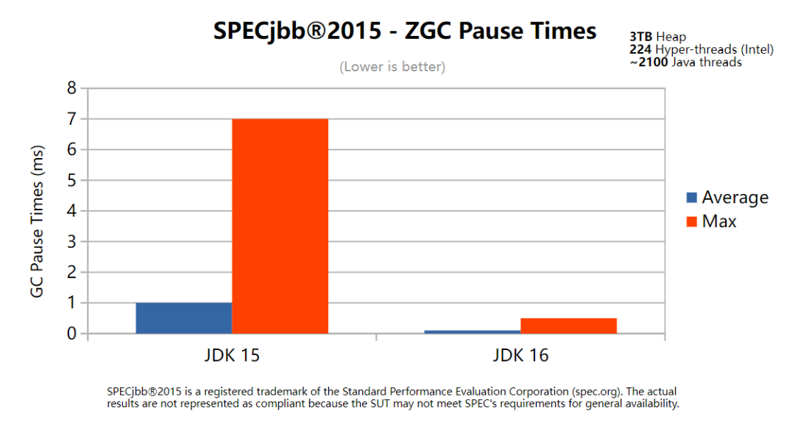
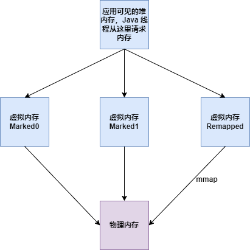
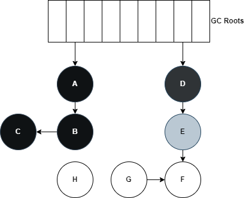
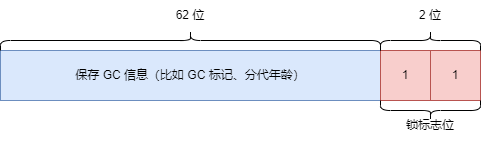
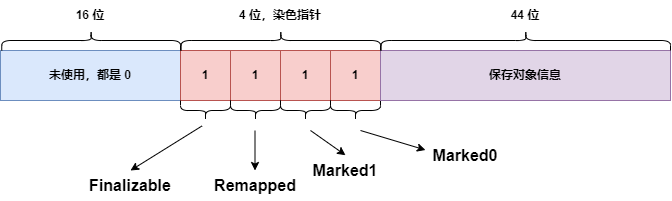
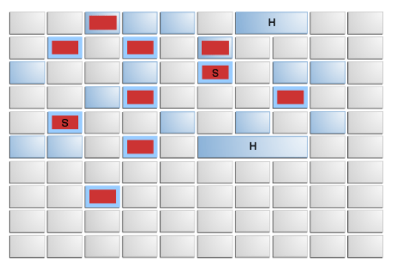
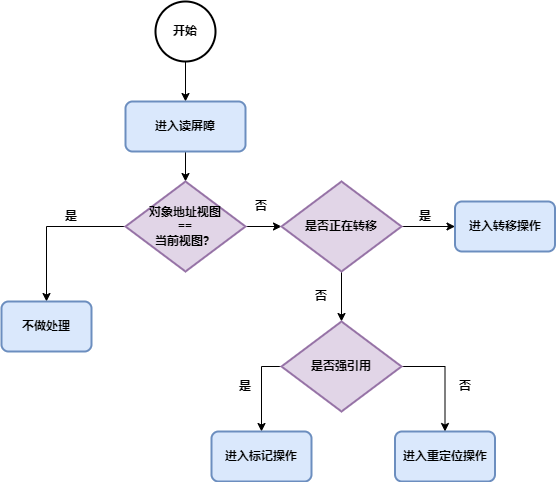

# 12张图带你彻底理解ZGC

## 零、开篇

ZGC（Z Garbage Collector） 是一款性能比 G1 更加优秀的垃圾收集器。ZGC 第一次出现是在  JDK 11 中以实验性的特性引入，这也是 JDK 11 中最大的亮点。在 JDK 15 中 ZGC 不再是实验功能，可以正式投入生产使用了，使用 –XX:+UseZGC 可以启用 ZGC。

ZGC 有 3 个重要特性：

- 暂停时间不会超过 10 ms。

> JDK 16 发布后，GC 暂停时间已经缩小到 1 ms 以内，并且时间复杂度是 o(1)，这也就是说 GC 停顿时间是一个固定值了，并不会受堆内存大小影响。
> 
> 下面图片来自:https://malloc.se/blog/zgc-jdk16



- 最大支持 16TB 的大堆，最小支持 8MB 的小堆。

- 跟 G1 相比，对应用程序吞吐量的影响小于 15 %。

## 一、内存多重映射

内存多重映射，就是使用 mmap 把不同的虚拟内存地址映射到同一个物理内存地址上。如下图：



ZGC 为了更灵活高效地管理内存，使用了内存多重映射，把同一块儿物理内存映射为 Marked0、Marked1 和 Remapped 三个虚拟内存。  

当应用程序创建对象时，会在堆上申请一个虚拟地址，这时 ZGC 会为这个对象在 Marked0、Marked1 和 Remapped 这三个视图空间分别申请一个虚拟地址，这三个虚拟地址映射到同一个物理地址。

Marked0、Marked1 和 Remapped 这三个虚拟内存作为 ZGC 的三个视图空间，在同一个时间点内只能有一个有效。ZGC 就是通过这三个视图空间的切换，来完成并发的垃圾回收。

## 二、染色指针

### 2.1 三色标记回顾

我们知道 G1 垃圾收集器使用了三色标记，这里先做一个[**回顾**](三色标记.md)。下面是一个三色标记过程中的对象引用示例图：



总共有三种颜色，说明如下：

- 白色：本对象还没有被标记线程访问过。

- 灰色：本对象已经被访问过，但是本对象引用的其他对象还没有被全部访问。

- 黑色：本对象已经被访问过，并且本对象引用的其他对象也都被访问过了。

三色标记的过程如下：

1. 初始阶段，所有对象都是白色。

2. 将 GC Roots 直接引用的对象标记为灰色。

3. 处理灰色对象，把当前灰色对象引用的所有对象都变成灰色，之后将当前灰色对象变成黑色。

4. 重复步骤 3，直到不存在灰色对象为止。

三色标记结束后，白色对象就是没有被引用的对象（比如上图中的 H  和 G），可以被回收了。

### 2.2 染色指针

ZGC 出现之前， GC 信息保存在对象头的 Mark Word 中。比如 64 位的 JVM，对象头的 Mark Word 中保存的信息如下图：



前 62位保存了 GC 信息，最后两位保存了锁标志。

ZGC 的一大创举是将 GC 信息保存在了染色指针上。**染色指针是一种将少量信息直接存储在指针上的技术**。在 64 位 JVM  中，对象指针是 64 位，如下图：



在这个 64 位的指针上，高 16 位都是 0，暂时不用来寻址。剩下的 48 位支持的内存可以达到 256 TB（2 ^48），这可以满足多数大型服务器的需要了。不过 ZGC 并没有把 48 位都用来保存对象信息，而是用高 4 位保存了四个标志位，这样 ZGC 可以管理的最大内存可以达到 16 TB（2 ^ 44）。

通过这四个标志位，JVM 可以从指针上直接看到对象的三色标记状态（Marked0、Marked1）、是否进入了重分配集（Remapped）、是否需要通过 finalize 方法来访问到（Finalizable）。

无需进行对象访问就可以获得 GC 信息，这大大提高了 GC 效率。

## 三、内存布局

首先我们回顾一下 G1 垃圾收集器的内存布局。G1把整个堆分成了大小相同的 region，每个堆大约可以有 2048 个region，每个 region 大小为 1~32 MB （必须是 2 的次方）。如下图：



跟 G1 类似，ZGC 的堆内存也是基于 Region 来分布，不过 ZGC 是不区分新生代老年代的。不同的是，ZGC 的 Region 支持动态地创建和销毁，并且 Region 的大小不是固定的，包括三种类型的 Region ：

- Small Region：2MB，主要用于放置小于 256 KB 的小对象。

- Medium Region：32MB，主要用于放置大于等于 256 KB 小于 4 MB 的对象。

- Large Region：N * 2MB。这个类型的 Region 是可以动态变化的，不过必须是 2MB 的整数倍，最小支持 4 MB。每个 Large Region 只放置一个大对象，并且是不会被重分配的。

## 四、读屏障

读屏障类似于 Spring AOP 的前置增强，是 JVM 向应用代码中插入一小段代码，当应用线程从堆中读取对象的引用时，会先执行这段代码。**注意：只有从堆内存中读取对象的引用时，才会执行这个代码**。下面代码只有第一行需要加入读屏障。

```java
Object o = obj.FieldA
Object p = o //不是从堆中读取引用
o.dosomething() //不是从堆中读取引用
int i =  obj.FieldB //不是引用类型
```

读屏障在解释执行时通过 load 相关的字节码指令加载数据。作用是在对象标记和转移过程中，判断对象的引用地址是否满足条件，并作出相应动作。如下图：



标记、转移和重定位这些过程请看下一节。

> 读屏障会对应用程序的性能有一定影响，据测试，对性能的最高影响达到 4%，但提高了 GC 并发能力，降低了 STW。