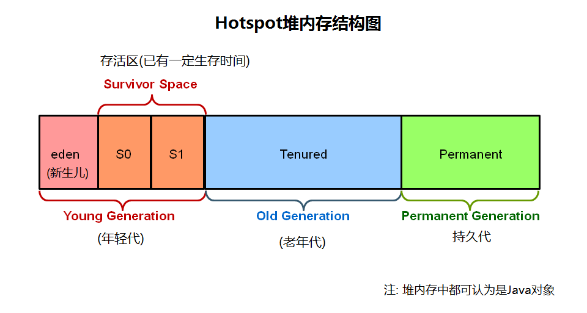
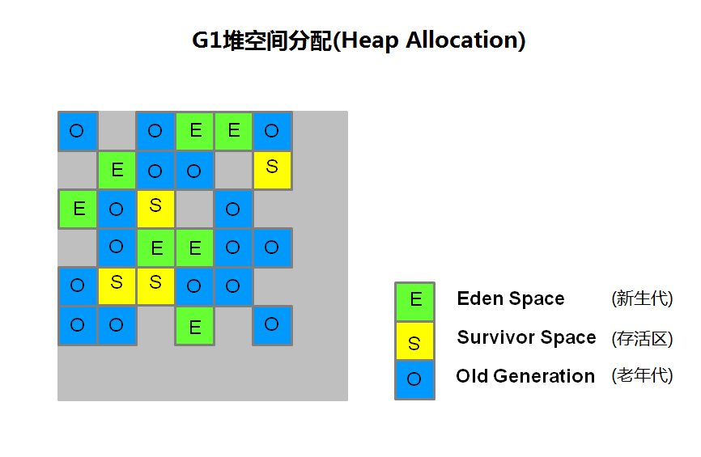
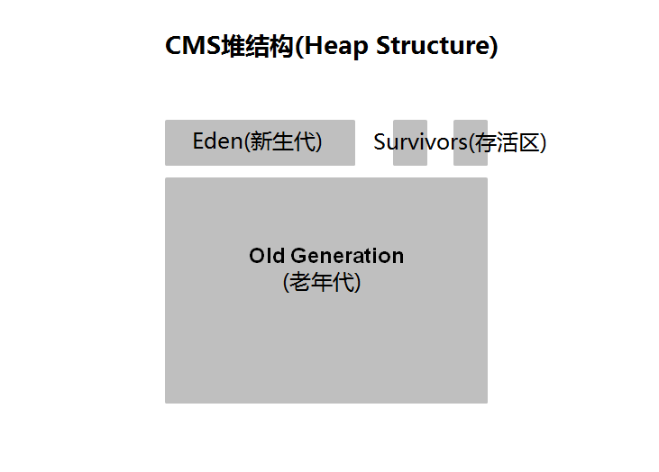
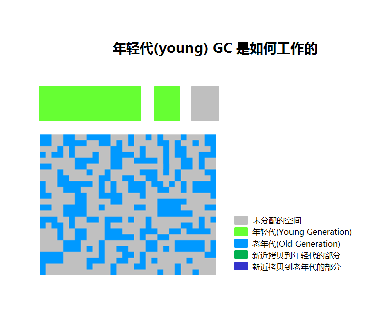
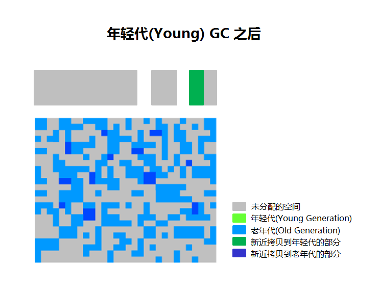
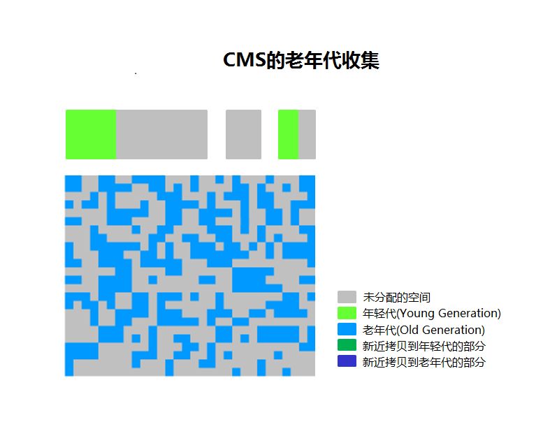
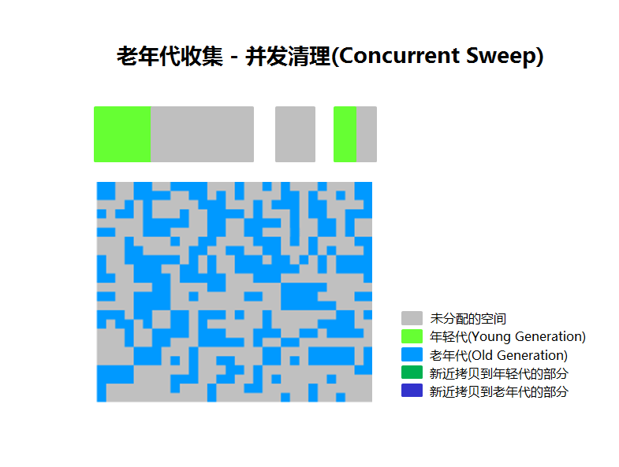
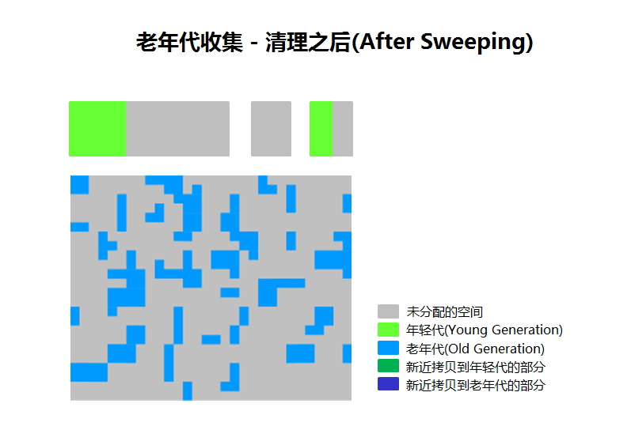
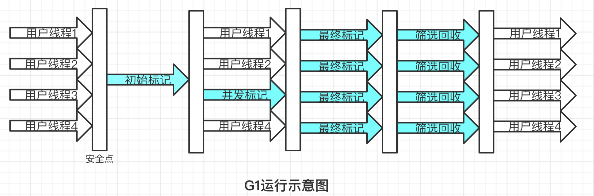

# G1垃圾收集器

目录
+ [G1垃圾收集器入门](#G1垃圾收集器入门)
  - [G1介绍](#G1介绍)
  - [G1操作概述](#G1操作概述)
  - [G1的内存占用](#G1的内存占用)
  - [推荐使用G1的场景](#推荐使用G1的场景)
+ [CMS的GC概述](#CMS的GC概述)
  - [分代GC与CMS](#分代GC与CMS)
+ [G1垃圾收集器深入](#G1垃圾收集器深入)
  - [G1运行过程](#G1运行过程)

## G1垃圾收集器入门
本节先对G1有个基本的认识，避免沉溺于细节。。

### G1介绍
G1 (Garbage-First)是一款面向服务器的垃圾收集器，主要针对配备多颗处理器及大容量内存的机器。以极高概率满足GC停顿时间要求的同时，还具备高吞吐量性能特征。在Oracle JDK 7 update 4 及以上版本中得到完全支持，专为以下应用程序设计：
- 可以像CMS收集器一样，GC操作与应用的线程一起并发执行；
- 紧凑的空闲内存区间且没有很长的GC停顿时间；
- 需要可预测的GC暂停耗时；
- 不想牺牲太多吞吐量性能；
- 启动后不需要请求更大的Java堆。

G1的长期目标是取代CMS(Concurrent Mark-Sweep Collector，并发标记-清除)。G1和CMS的一个区别是：G1是一款压缩型的收集器。

G1通过有效的压缩完全避免了对细微空闲内存空间的分配，不用依赖于regions，这不仅大大简化了收集器，而且还消除了潜在的内存碎片问题。除压缩以外，G1的垃圾收集停顿也比CMS容易估计，也允许用户自定义所希望的停顿参数(pause targets)。

### G1操作概述
上一代的垃圾收集器(串行serial，并行parallel，以及CMS)都把堆内存划分为固定大小的三个部分：年轻代(young generation)，年老代(old generation)，以及持久代(permanent generation)：  

内存中的每个对象都存放在这三个区域中的一个，而 G1 收集器采用一种不同的方式来管理堆内存：  

堆内存被划分为多个大小相等的 heap 区，每个heap区都是逻辑上连续的一段内存(virtual memory)。其中一部分区域被当成老一代收集器相同的角色(eden, survivor, old)，但每个角色的区域个数都不是固定的，这在内存使用上提供了更多的灵活性。

G1执行垃圾回收的处理方式与CMS相似：G1在全局标记阶段(global marking phase)并发执行，以确定堆内存中哪些对象是存活的。标记阶段完成后，G1就可以知道哪些heap区的empty空间最大。它会首先回收这些区，常会得到大量的自由空间，这也是为什么这种垃圾收集方法叫做Garbage-First(垃圾优先)的原因。顾名思义，G1将精力集中放在可能布满可收回对象的区域，可回收对象(reclaimable objects)也就是所谓的垃圾。G1使用暂停预测模型(pause prediction model)来达到用户定义的目标暂停时间，并根据目标暂停时间来选择此次进行垃圾回收的heap区域数量。(简单来说就是：**能够判断哪块内存回收价值高，并且能根据用户需求平衡暂停时间和吞吐量**。~~我应该没理解错吧，应该~~)

被G1标记为适合回收的heap区将使用转移(evacuation)的方式进行垃圾回收。G1将一个或多个heap区域中的对象拷贝到其他的单个区域中，并在此过程中压缩和释放内存。在多核CPU上转移是并行执行的(parallel on multi-processors)，这样能减少停顿时间并增加吞吐量。因此，每次垃圾收集时，G1都会持续不断地减少碎片，并且在用户给定的暂停时间内执行。CMS垃圾收集器(Concurrent Mark Sweep,并发标记清理)不进行压缩，ParallelOld 垃圾收集会对整个堆执行压缩，从而导致相当长的暂停时间。

G1并不是一款实时垃圾收集器(real-time collector)。能以极高的概率在设定的目标暂停时间内完成，但**不保证绝对**在这个时间内完成(这好理解，如果爷定个1ms你玩个锤子)。G1会根据用户指定的目标时间来预估能回收多少个heap区，因此，收集器有一个相当精确的heap区耗时计算模型，并根据该模型来确定在给定时间内去回收哪些heap区。(大致可以理解为：**用户要求暂停的时间越短，能回收的区域就越少**)

G1分为两个阶段：并发阶段(concurrent，与应用线程一起运行，如：细化 refinement、标记 marking、清理 cleanup) 和 并行阶段(parallel，多线程执行，如：停止所有JVM线程，stop the world)。而 FullGC(完整垃圾收集)仍然是单线程的，但如果进行适当的调优，则应用程序应该能够避免 full GC。

### G1的内存占用
如果从 ParallelOldGC 或者 CMS收集器迁移到 G1，可能会看到JVM进程占用更多的内存(a larger JVM process size)。这在很大程度上与 “accounting” 数据结构有关，如 Remembered Sets 和 Collection Sets：
- Remembered Sets 简称 RSets，跟踪指向某个heap区内的对象引用。堆内存中的每个区都有一个 RSet，RSet 使heap区能并行独立地进行垃圾集合。RSets的总体影响小于5%。
- Collection Sets 简称 CSets，收集集合，在一次GC中将执行垃圾回收的heap区。GC时在CSet中的所有存活数据(live data)都会被转移(复制/移动)。集合中的heap区可以是 Eden，survivor，和/或 old generation。CSets所占用的JVM内存小于1%。

### 推荐使用G1的场景
G1的首要目标是为需要**大量内存**的系统提供一个**保证GC低延迟**的解决方案。也就是说堆内存在6GB及以上，稳定和可预测的暂停时间小于0.5秒。

如果应用程序具有如下的一个或多个特征，那么将垃圾收集器从CMS或ParallelOldGC切换到G1将会大大提升性能：
- Full GC 次数太频繁或者消耗时间太长；
- 对象分配的频率或代数提升(promotion)显著变化；
- 受够了太长的垃圾回收或内存整理时间(超过0.5~1秒)

如果正在使用CMS或Parallel Old GC，而应用程序的垃圾收集停顿时间并不长，那么继续使用现在的垃圾收集器是个好主意。使用最新的JDK时并不要求切换到G1收集器。

## CMS的GC概述
### 分代GC与CMS
并发标记清理(CMS, Concurrent Mark Sweep)收集器(也称为多并发低暂停的收集器)回收老年代内存(tenured generation)。它将垃圾回收中的绝大部分工作与应用程序的线程一起并发执行，以期能最小化暂停时间。通常多并发低暂停收集器收集器不复制或也不压缩存活的对象。垃圾回收不移动存活的对象，如果产生内存碎片问题，就会分配/占用更大的堆内存空间。

注意：年轻代使用的CMS收集器也和并行收集器采用一样的算法。

CMS 垃圾收集（老年代堆内存）阶段划分：  

阶段 | 说明
:---:|:---:
(1) 初始标记 (Initial Mark) | (Stop the World Event,所有应用线程暂停) 在老年代(old generation)中的对象，如果从年轻代(young generation)中能访问到，则被 “标记,marked” 为可达的(reachable)。对象在旧一代“标志”可以包括这些对象可能可以从年轻一代。暂停时间一般持续时间较短,相对小的收集暂停时间。
(2) 并发标记 (Concurrent Marking)|在Java应用程序线程运行的同时遍历老年代(tenured generation)的可达对象图。扫描从被标记的对象开始,直到遍历完从root可达的所有对象。调整器(mutators)在并发阶段的2、3、5阶段执行，在这些阶段中新分配的所有对象(包括被提升的对象)都立刻标记为存活状态。
(3) 再次标记(Remark)|(Stop the World Event, 所有应用线程暂停) 查找在并发标记阶段漏过的对象，这些对象是在并发收集器完成对象跟踪之后由应用线程更新的。
(4) 并发清理(Concurrent Sweep)|回收在标记阶段(marking phases)确定为不可及的对象。死对象的回收将此对象占用的空间增加到一个空闲列表(free list)，供以后的分配使用。死对象的合并可能在此时发生。请注意，存活的对象并没有被移动。
(5) 重置(Resetting)|清理数据结构，为下一个并发收集做准备。

图解CMS的GC步骤：
1. CMS的堆内存结构(Heap Structure)  

年轻代(Young generation)分为 1个新生代空间(Eden)和2个存活区(survivor spaces)。老年代(Old generation)是一大块连续的空间， 垃圾回收(Object collection)就地解决(is done in place)，除了 Full GC，否则不会进行压缩(compaction)。

2. CMS年轻代(Young) GC 的工作方式  
年轻代(young generation)用高亮的绿色表示，老年代(old generation)用蓝色表示。如果程序运行了一段时间，那么 CMS 看起来就像下图这个样子。对象散落在老年代中的各处地方。  
  

3. 年轻代垃圾回收(Young Generation Collection)
Eden区和survivor区中的存活对象被拷贝到另一个空的 survivor 区。存活时间更长，达到阀值的对象会被提升到老年代(promoted to old generation)。  

4. 年轻代(Young) GC 之后
年轻代(Young)进行一次垃圾回收之后，Eden 区被清理干净(cleared)，两个 survivor 区中的一个也被清理干净了。如下图所示：

图中新提升的对象用深蓝色来标识。绿色的部分是年轻代中存活的对象，但还没被提升到老年代中。

5. CMS的老年代回收(Old Generation Collection)
两次stop the world事件发生在：初始标记(initial mark)以及重新标记(remark)阶段。当老年代达到一定的占有率时，CMS垃圾回收器就开始工作。  

(1)初始标记(Initial mark)阶段的停顿时间很短，在此阶段存活的(live,reachable,可及的) 对象被记下来。
(2)并发标记(Concurrent marking)在程序继续运行的同时找出存活的对象。
(3)重新标记(remark phase)，查找在第(2)阶段(concurrent marking)中错过的对象。

6. 老年代回收 – 并发清理(Concurrent Sweep)
在前面阶段未被标记的对象将会就地释放(deallocated in place)。此处没有压缩(compaction)。  

7. 老年代回收 – 清理之后(After Sweeping)
在第(4)步(Sweeping phase)之后, 可以看到很多内存被释放了。还应该注意到，这里并没有执行内存压缩整理(no compaction)。  

8. 最后，CMS 收集器进入(move through)第(5)阶段，重置(resetting phase)，然后等候下一次的GC阀值到来(GC threshold)。

## G1垃圾收集器深入
以下内容多出自于《深入理解Java虚拟机》

### G1运行过程
话不多说先上图：  

G1垃圾收集器的运行过程大致可以划分为以下四个步骤（在不考虑用户线程运行过程中的动作的情况下）：
1. 初始标记：仅仅只是标记一下 GC Roots 能直接关联到的对象，并且修改 TAMS 指针的值，让下一阶段用户线程并发运行时，能正确地在可用的 Region 中分配新的对象。这个阶段需要停顿线程，但耗时很短。
2. 并发标记：从 GC Roots 开始对堆中对象进行可达性分析，递归扫描整个堆里面的对象图，找出要回收的对象，这段耗时较长，但可并发执行。扫描完成后还要重新处理 SATB 记录下的在并发时有引用变动的对象。
3. 最终标记：对用户线程做一个短暂的暂停，用于处理并发阶段结束后仍遗留下来的最后那少量的 SATB 记录。
4. 筛选回收：负责更新 Region 的统计数据，对各个 Region 的回收价值和成本进行排序，根据用户期望的停顿时间来制定回收计划，可以自由选择任意多个 Region 构成回收集，然后把决定回收的那一部分 Region 的存活对象复制到空的 Region 中，再清理掉整个旧的 Region。这里的操作设计到存活对象的移动，是必须暂停用户线程的，由多条收集器线程并行完成的。