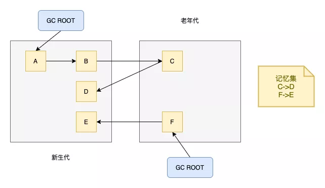
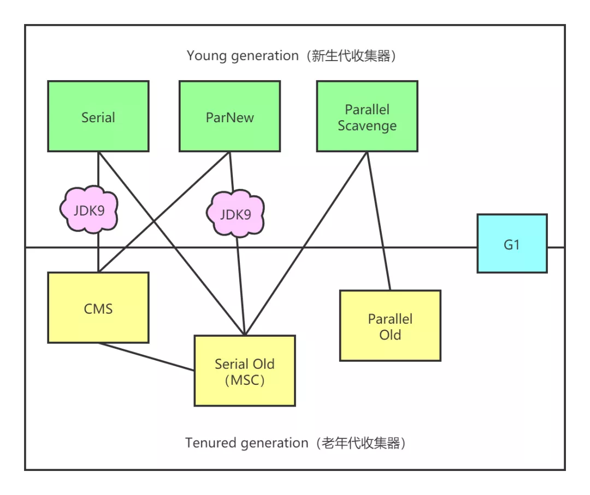
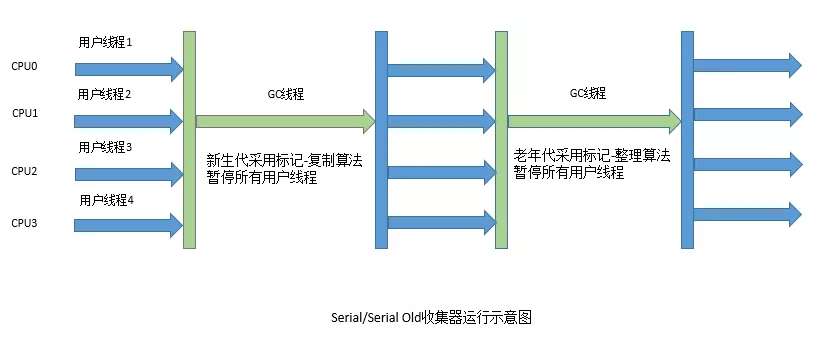
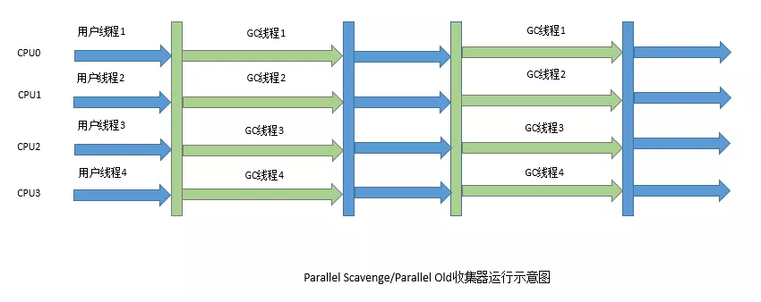
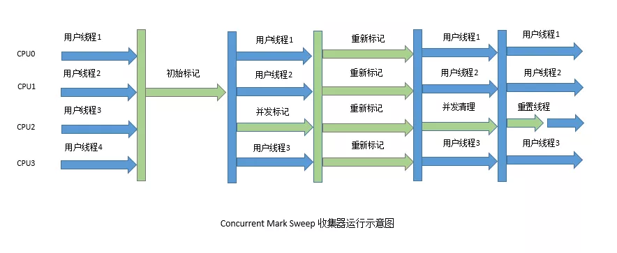

# Stop The World 是何时发生的

<!-- START doctoc generated TOC please keep comment here to allow auto update -->
<!-- DON'T EDIT THIS SECTION, INSTEAD RE-RUN doctoc TO UPDATE -->

- [一、垃圾回收流程的一些流程](#%E4%B8%80%E5%9E%83%E5%9C%BE%E5%9B%9E%E6%94%B6%E6%B5%81%E7%A8%8B%E7%9A%84%E4%B8%80%E4%BA%9B%E6%B5%81%E7%A8%8B)
    - [1. 哪些对象是垃圾？](#1-%E5%93%AA%E4%BA%9B%E5%AF%B9%E8%B1%A1%E6%98%AF%E5%9E%83%E5%9C%BE)
    - [2. 分代和跨代引用](#2-%E5%88%86%E4%BB%A3%E5%92%8C%E8%B7%A8%E4%BB%A3%E5%BC%95%E7%94%A8)
    - [3. 卡表](#3-%E5%8D%A1%E8%A1%A8)
    - [4. 如何更新卡表？](#4-%E5%A6%82%E4%BD%95%E6%9B%B4%E6%96%B0%E5%8D%A1%E8%A1%A8)
- [二、三色标记法](#%E4%BA%8C%E4%B8%89%E8%89%B2%E6%A0%87%E8%AE%B0%E6%B3%95)
    - [1.  执行思路](#1--%E6%89%A7%E8%A1%8C%E6%80%9D%E8%B7%AF)
    - [2.  三色标记法问题](#2--%E4%B8%89%E8%89%B2%E6%A0%87%E8%AE%B0%E6%B3%95%E9%97%AE%E9%A2%98)
- [三、垃圾收集器](#%E4%B8%89%E5%9E%83%E5%9C%BE%E6%94%B6%E9%9B%86%E5%99%A8)
    - [1. Serial收集器](#1-serial%E6%94%B6%E9%9B%86%E5%99%A8)
    - [2. ParNew收集器](#2-parnew%E6%94%B6%E9%9B%86%E5%99%A8)
    - [3. Parallel Scavenge收集器](#3-parallel-scavenge%E6%94%B6%E9%9B%86%E5%99%A8)
    - [4. Serial Old收集器](#4-serial-old%E6%94%B6%E9%9B%86%E5%99%A8)
    - [5. Parallel Old收集器](#5-parallel-old%E6%94%B6%E9%9B%86%E5%99%A8)
    - [6. CMS收集器](#6-cms%E6%94%B6%E9%9B%86%E5%99%A8)
- [四、总结](#%E5%9B%9B%E6%80%BB%E7%BB%93)

<!-- END doctoc generated TOC please keep comment here to allow auto update -->

[TOC]

## 一、垃圾回收流程的一些流程

### 1. 哪些对象是垃圾？

当我们进行垃圾回收的时候，首先需要判断哪些对象是存活的？

常用的方法有如下两种

1. 引用计数法
2. 可达性分析法

Python判断对象存活的算法用的是引用计数法，而Java则使用的是可达性分析法。

**「通过GC ROOT可达的对象，不能被回收，不可达的对象则可以被回收，搜索走过的路径叫做引用链」**

不可达对象会进行2次标记的过程，通过GC ROOT不可达，会被第一次标记。如果需要执行finalize()方法，则这个对象会被放入一个队列中执行finalize()，如果在finalize()方法中成功和引用链上的其他对象关联，则会被移除可回收对象集合（**「一般你不建议你使用finalize方法」**），否则被回收

**「常见的GC ROOT有如下几种」**

1. 虚拟机栈（栈帧中的本地变量表）中引用的对象
2. 方法区中类静态属性引用的对象
3. 方法区中常量引用的对象
4. 本地方法栈中JNI（Native方法）引用的对象

**「照这样看，程序中的GC ROOT有很多，每次垃圾回收都要对GC ROOT的引用链分析一遍，感觉耗费的时间很长啊，有没有可能减少每次扫描的GC ROOT？」**

### 2. 分代和跨代引用

其实当前虚拟机大多数都遵循了“分代收集”理论进行设计，它的实现基于2个分代假说之上

1. 绝大多数对象都是朝生夕灭的
2. 熬过多次垃圾收集过程的对象就越难以消亡

因此堆一般被分为新生代和老年代，针对新生代的GC叫MinorGC，针对老年代的GC叫OldGC。但是分代后有一个问题，为了找到新生代的存活对象，不得不遍历老年代，反过来也一样



当进行MinorGC的时候，如果我们只遍历新生代，那么可以判定ABCD为存活对象。但是E不会被判断为存活对象，所以就会有问题。

为了解决这种跨代引用的对象，最笨的办法就是遍历老年代的对象，找出这些跨代引用的对象。但这种方式对性能影响较大

这时就不得不提到第三个假说

**「跨代引用相对于同代引用来说仅占极少数。」**

根据这条假说，我们就不需要为了少量的跨代引用去扫描整个老年代。**「为了避免遍历老年代的性能开销，垃圾回收器会引入一种记忆集的技术，记忆集就是用来记录跨代引用的表」**

如新生代的记忆集就保存了老年代持有新生代的引用关系

所以在进行MinorGC的时候，只需要将包含跨代引用的内存区域加入GC ROOT一起扫描就行了

### 3. 卡表

前面我们说到垃圾收集器用记忆集来记录跨代引用。其实你可以把记忆集理解为接口，卡表理解为实现，类比Map和HashMap。

卡表最简单的形式可以只是一个字节数组， 而HotSpot虚拟机确实也是这样做的。以下这行代码是HotSpot默认的卡表标记逻辑：

```
CARD_TABLE [this address >> 9] = 0;
```


HotSpot用一个数组元素来保存对应的内存地址是有跨代引用的对象（从this address右移9位可以看出每个元素映射了512字节的内存）

当数组元素值为0时表明对应的内存地址不存在跨代引用对象，否则存在（称为卡表中这个元素变脏）

### 4. 如何更新卡表？

**「将卡表元素变脏的过程，HotSpot是通过写屏障来实现的」**，即当其他代对象引用当前分代对象的时候，在引用赋值阶段更新卡表，具体实现方式类似于AOP

```
void oop_field_store(oop* field, oop new_value) { 
// 引用字段赋值操作
*field = new_value;
// 写后屏障，在这里完成卡表状态更新 
post_write_barrier(field, new_value);
}
```

## 二、三色标记法

### 1.  执行思路

**「如何判断一个对象可达呢？这就不得不提到三色标记法」**

白色：刚开始遍历的时候所有对象都是白色的 

灰色：被垃圾回收器访问过，但至少还有一个引用未被访问 

黑色：被垃圾回收器访问过，并且这个对象的所有引用都被访问过，是安全存活的对象（GC ROOT会被标记为黑色）


以上图为例，三色标记法的执行流程如下

1. 先将GC ROOT引用的对象B和E标记为灰色
2. 接着将B和E引用的对象A，C和F标记为灰色，此时B和E标记为黑色
3. 依次类推，最终被标记为白色的对象需要被回收

### 2.  三色标记法问题

可达性分析算法根节点枚举这一步必须要在一个能保障一致性的快照中分析，所以要暂停用户线程（Stop The World ，STW），在各种优化技巧的加持下，停顿时间已经非常短了。

在从根节点扫描的过程则不需要STW，但是也会发生一些问题。由于此时垃圾回收线程和用户线程一直运行，所以引用关系会发生变化

1. 应该被回收的对象被标记为不被回收
2. 不应该被回收的对象标记为应该回收

第一种情况影响不大，大不了后续回收即可。但是第二种情况则会造成致命错误

所以经过研究表明，只有同时满足两个条件才会发生第二种情况

1. 插入了一条或者多条黑色到白色对象的引用
2. 删除了全部从灰色到白色对象的引用

为了解决这个问题，我们破坏2个条件中任意一个不就行了，由此产生了2中解决方案，**「增量更新」**和**「原始快照」**。CMS使用的是增量更新，G1使用的是原始快照

**「增量更新要破坏的是第一个条件」**， 当黑色对象插入新的指向白色对象的引用关系时， 就将这个新插入的引用记录下来， 等并发扫描结束之后， 再将这些记录过的引用关系中的黑色对象为根， 重新扫描一次。这可以简化理解为， 黑色对象一旦新插入了指向白色对象的引用之后， 它就变回灰色对象了

**「原始快照要破坏的是第二个条件」**， 当灰色对象要删除指向白色对象的引用关系时， 就将这个要删除的引用记录下来， 在并发扫描结束之后， 再将这些记录过的引用关系中的灰色对象为根， 重新扫描一次。这也可以简化理解为， 无论引用关系删除与否， 都会按照刚刚开始扫描那一刻的对象图快照来进行搜索。

## 三、垃圾收集器



图中展示了七种作用于不同分代的收集器，如果两个收集器之间存在连线，就说明它们可以搭配使用。在JDK8时将Serial+CMS，ParNew+Serial Old这两个组合声明为废弃，并在JDK9中完全取消了这些组合的支持

并行和并发都是并发编程中的专业名词，在谈论垃圾收集器的上下文语境中， 它们可以理解为

**「并行（Parallel）」**：指多条垃圾收集线程并行工作，但此时用户线程仍然处于等待状态

**「并发（Concurrent」**）：指用户线程与垃圾收集线程同时执行

JDK8默认组合为：**Parallel Scavenge + Parallel Old**

### 1. Serial收集器

**「新生代，标记-复制算法，单线程。进行垃圾收集时，必须暂停其他所有工作线程，直到它收集结束」**



### 2. ParNew收集器

**「ParNew本质上是Serial收集器的多线程并行版本」**


### 3. Parallel Scavenge收集器

**「新生代，标记复制算法，多线程，主要关注吞吐量」**

吞吐量=运行用户代码时间/(运行用户代码时间+运行垃圾收集时间)

### 4. Serial Old收集器

**「老年代，标记-整理算法，单线程，是Serial收集器的老年代版本」**

用处有如下2个：

1. 在JDK5以及之前的版本中与Parallel Scavenge收集器搭配使用
2. 作为CMS收集器发生失败时的后备预案，在并发收集发生Concurrent Mode Failure时使用

### 5. Parallel Old收集器

**「老年代，标记-整理算法，多线程，是Parallel Scavenge收集器的老年代版本」**

在注重吞吐量或者处理器资源较为稀缺的场合，都可以优先考虑Parallel Scavenge加Parallel Old收集器这个组合



### 6. CMS收集器

**「老年代，标记-清除算法，多线程，主要关注延迟」**

运作过程分为4个步骤

1. 初始标记（CMS initial mark）
2. 并发标记（CMS concurrent mark）
3. 重新标记（CMS remark）
4. 并发清除（CMS concurrent sweep）



1. 初始标记：标记一下GC Roots能直接关联到的对象，速度很快（这一步会发生STW）
2. 并发标记：从GC Roots的直接关联对象开始遍历整个对象图的过程，这个过程耗时较长但是不需要停顿用户线程，可以与垃圾收集一起并发运行
3. 重新标记：为了修正并发标记期间，因用户程序继续运作而导致标记产生变动的那一部分对象的标记记录（**「就是三色标记法中的增量更新」**，这一步也会发生STW）
4. 并发清除：清理删除掉标记阶段判断的已经死亡的对象，由于不需要移动存活对象，所以看这个阶段也是可以与用户线程同时并发的

## 四、总结

| 收集器                            | 收集对象和算法   | 收集器类型         | 说明                                               | 适用场景                                                     |
| :-------------------------------- | :--------------- | :----------------- | :------------------------------------------------- | :----------------------------------------------------------- |
| Serial                            | 新生代，复制算法 | 单线程             |                                                    | 简单高效；适合内存不大的情况                                 |
| ParNew                            | 新生代，复制算法 | 并行的多线程收集器 | ParNew垃圾收集器是Serial收集器的多线程版本         | 搭配CMS垃圾回收器的首选                                      |
| Parallel Scavenge吞吐量优先收集器 | 新生代，复制算法 | 并行的多线程收集器 | 类似ParNew，更加关注吞吐量，达到一个可控制的吞吐量 | 本身是Server级别多CPU机器上的默认GC方式，主要适合后台运算不需要太多交互的任务 |

------

| 收集器       | 收集对象和算法                      | 收集器类型         | 说明                                                         | 适用场景                                                     |
| :----------- | :---------------------------------- | :----------------- | :----------------------------------------------------------- | :----------------------------------------------------------- |
| Serial Old   | 老年代，标记整理算法                | 单线程             |                                                              | Client模式下虚拟机使用                                       |
| Parallel Old | 老年代，标记整理算法                | 并行的多线程收集器 | Paraller Scavenge收集器的老年代版本，为了配置Parallel Svavenge的面向吞吐量的特性而开发的对应组合 | 在注重吞吐量以及CPU资源敏感的场合采用                        |
| CMS          | 老年代，标记清除算法                | 并行与并发收集器   | 尽可能的缩短垃圾收集时用户线程停止时间；缺点在于，1.内存碎片，2.需要更多CPU资源，3.浮动垃圾问题，需要更大的堆空间 | 重视服务的相应速度，系统停顿时间和用户体验的互联网网站或者B/S系统。互联网后端目前cms是主流的垃圾回收器 |
| G1           | 跨新生代和老年代；标记整理+化整为零 |                    | 并行与并发收集器                                             | JDK1.7才正式引入，采用分区回收的思维，基本不牺牲吞吐量的前提下完成低停顿的内存回收；可预测的停顿是其最大的优势 |

