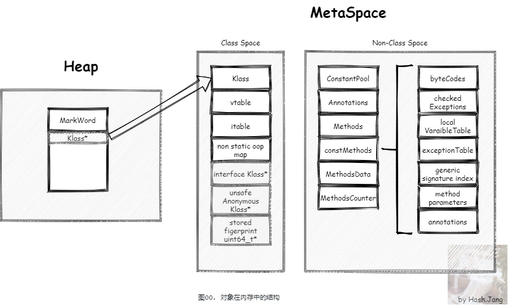
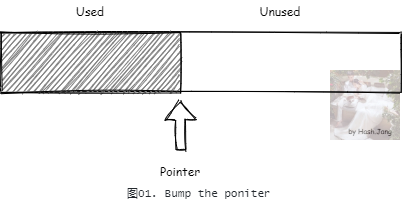
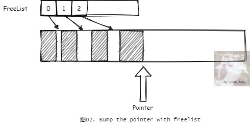
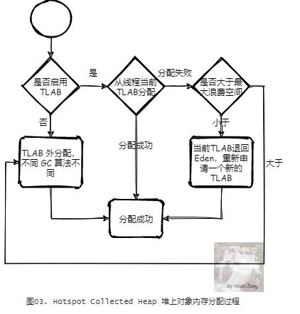
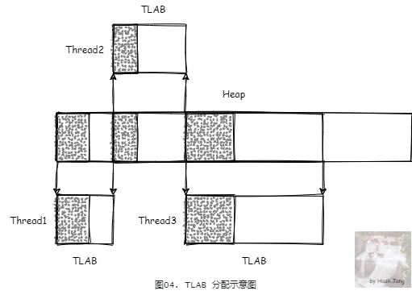
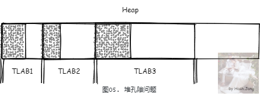
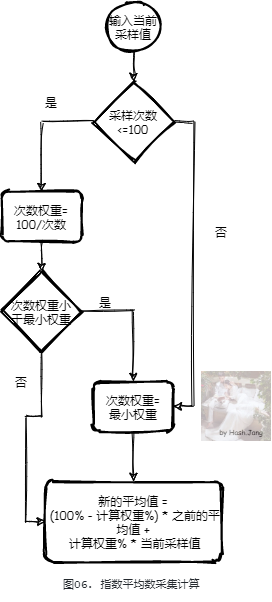
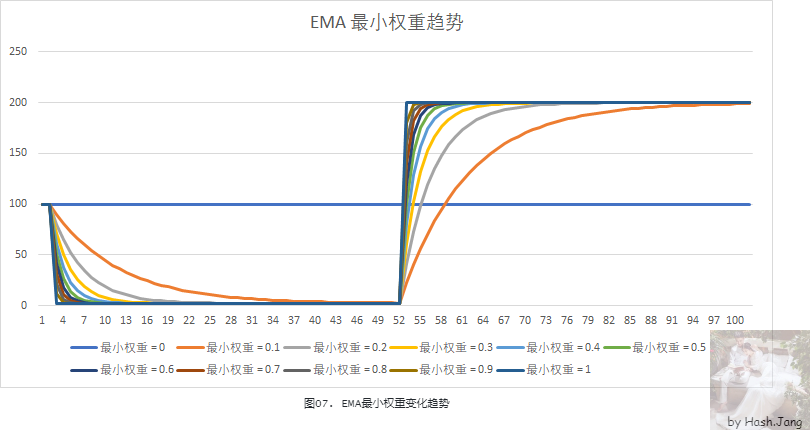
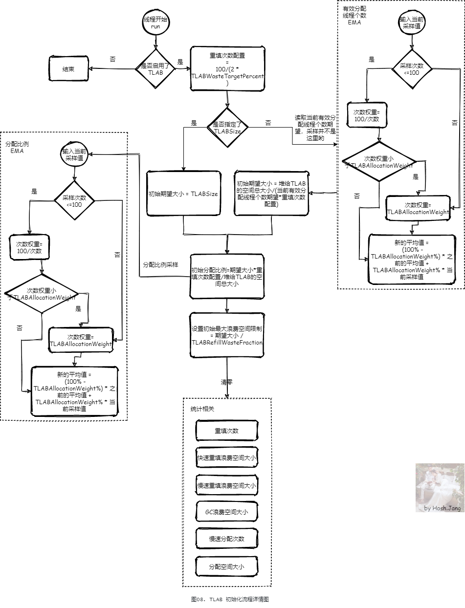

# TLAB

目录
+ [分配内存实现思路](#分配内存实现思路)
+ [JVM对象堆内存分配流程简述](#JVM对象堆内存分配流程简述)
+ [TLAB的生命周期](#TLAB的生命周期)
+ [TLAB存在的问题](#TLAB存在的问题)
   - [内存孔隙](#内存孔隙)
   - [分配的内存并不稳定](#分配的内存并不稳定)
+ [JVM中的期望计算EMA](#JVM中的期望计算EMA)
+ [TLAB基本流程](#TLAB基本流程)
   - [如何设计每个线程的TLAB大小](#如何设计每个线程的TLAB大小)
   - [TLAB初始化](#TLAB初始化)

## 分配内存实现思路
我们经常会 new 一个对象，这个对象是需要占用空间的，第一次 new 一个对象占用的空间如 图00 所示：  

这里先只关心堆内部的存储，元空间中的存储，暂不讨论。  
堆内部的存储包括对象头，对象体以及内存对齐填充，那么这块空间是如何分配的呢？  
首先，对象所需的内存大小，在对象的类被解析加载进入元空间之后，就可以在分配内存创建前计算出来。假设现在我们自己来设计堆内存分配，一种最简单的实现方式就是线性分配，也被称为撞针分配（bump-the-pointer）：  
  

每次需要分配内存时，先计算出需要的内存大小，然后 CAS 更新如 图01 中所示的内存分配指针，标记分配的内存。但是内存一般不是这么整齐的，可能有些内存在分配有些内存就被释放回收了。所以一般不会只靠撞针分配。一种思路是在撞针分配的基础上，加上一个 FreeList(空闲列表)：

简单的实现是将释放的对象内存加入 FreeList，下次分配对象的时候，优先从 FreeList 中寻找合适的内存大小进行分配，之后再在主内存中撞针分配。

这样虽然一定程度上解决了问题，但是目前大多数应用是多线程的，所以内存分配是多线程的，都从主内存中分配，CAS 更新重试过于频繁导致效率低下。目前的应用，一般根据不同业务区分了不同的线程池，在这种情况下，一般每个线程分配内存的特性是比较稳定的。这里的比较稳定指的是，每次分配对象的大小，每轮 GC 分配区间内的分配对象的个数以及总大小。所以，我们可以考虑每个线程分配内存后，就将这块内存保留起来，用于下次分配，这样就不用每次从主内存中分配了。如果能估算每轮 GC 内每个线程使用的内存大小，则可以提前分配好内存给线程，这样就更能提高分配效率。这种内存分配的实现方式，在 JVM 中就是 TLAB （Thread Local Allocate Buffer）。

## JVM对象堆内存分配流程简述
  

这里不考虑**栈上分配**，考虑的是无法栈上分配需要共享的对象。

对于 HotSpot JVM 实现，所有的 GC 算法的实现都是一种对于堆内存的管理，也就是都实现了一种堆的抽象，它们都实现了接口 CollectedHeap。当分配一个对象堆内存空间时，在 CollectedHeap 上首先都会检查是否启用了 TLAB，如果启用了，则会尝试 TLAB 分配；如果当前线程的 TLAB 大小足够，那么从线程当前的 TLAB 中分配；如果不够，但是当前 TLAB 剩余空间小于**最大浪费空间限制（这是一个动态的值，后面提）**，则从堆上（一般是 Eden 区） 重新申请一个新的 TLAB 进行分配。否则，直接在 TLAB 外进行分配。TLAB 外的分配策略，不同的 GC 算法不同。  
例如G1：
- 如果是 Humongous 对象（对象在超过 Region 一半大小的时候），直接在 Humongous 区域分配（老年代的连续区域）
- 根据 Mutator 状况在当前分配下标的 Region 内分配

## TLAB的生命周期

TLAB 是线程私有的，线程初始化的时候，会创建并初始化 TLAB。同时，在 GC 扫描对象发生之后，线程第一次尝试分配对象的时候，也会创建并初始化 TLAB。 TLAB 生命周期停止（TLAB 声明周期停止不代表内存被回收，只是代表这个 TLAB 不再被这个线程私有管理）在：
- 当前 TLAB 不够分配，并且剩余空间小于最大浪费空间限制，那么这个 TLAB 会被退回 Eden，重新申请一个新的
- 发生 GC 的时候，TLAB 被回收

## TLAB存在的问题
TLAB 要解决的问题很明显，尽量避免从堆上直接分配内存从而避免频繁的锁争用。引入 TLAB 之后，TLAB 的设计上，也有很多值得考虑的问题。

### 内存孔隙
引入 TLAB 后，会有内存孔隙问题，还可能影响 GC 扫描性能。  
出现孔隙的情况：
- 当前 TLAB 不够分配时，如果剩余空间小于最大浪费空间限制，那么这个 TLAB 会被退回 Eden，重新申请一个新的。这个剩余空间就会成为孔隙。
- 当发生 GC 的时候，TLAB 没有用完，没有分配的内存也会成为孔隙。

如果不管这些孔隙，由于 TLAB 仅线程内知道哪些被分配了，在 GC 扫描发生时返回 Eden 区，如果不填充的话，外部并不知道哪一部分被使用哪一部分没有，需要做额外的检查，那么会影响 GC 扫描效率。所以 TLAB 回归 Eden 的时候，会将剩余可用的空间用一个 dummy object 填充满。如果填充已经确认会被回收的对象，也就是 dummy object， GC 会直接标记之后跳过这块内存，增加扫描效率。但是同时，由于需要填充这个 dummy object，所以需要预留出这个对象的对象头的空间。

### 分配的内存并不稳定
如果我们能提前知道在这一轮内每个线程会分配多少内存，那么我们可以直接提前分配好。但是，这简直是痴人说梦。每个线程在每一轮 GC 的分配情况可能都是不一样的：
- **不同的线程业务场景不同导致分配对象大小不同**。我们一般会按照业务区分不同的线程池，做好线程池隔离。对于用户请求，每次分配的对象可能比较小。对于后台分析请求，每次分配的对象相对大一些。
- **不同时间段内线程压力并不均匀**。业务是有高峰有低谷的，高峰时间段内肯定分配对象更多。
- **同一时间段同一线程池内的线程的业务压力也不一定不能做到很均匀**。很可能只有几个线程很忙，其他线程很闲。

---

所以，综合考虑以上情况，我们应该这么实现 TLAB：
- 不能一下子就给一个线程申请一个比较大的 TLAB，而是考虑这个线程 TLAB 分配满之后再申请新的，这样更加灵活。
- 每次申请 TLAB 的大小是变化的，并不是固定的。
- 每次申请 TLAB 的大小需要考虑当前 GC 轮次内会分配对象的线程的个数期望。
- 每次申请 TLAB 的大小需要考虑所有线程期望 TLAB 分配满重新申请新的 TLAB 次数。

## JVM中的期望计算EMA
**前排提醒：这部分内容建议简单了解即可**  

在上面提到的 TLAB 大小设计的时候，我们经常提到期望。这个期望是根据历史数据计算得出的，也就是每次输入采样值，根据历史采样值得出最新的期望值。不仅 TLAB 用到了这种期望计算，GC 和 JIT 等等 JVM 机制中都用到了。这里我们来看一种 TLAB 中经常用到的 EMA（Exponential Moving Average 指数平均数） 算法：  

EMA 算法的核心在于设置合适的**最小权重**，我们假设一个场景：首先采样100个 100（算法中的前 100 个是为了排除不稳定的干扰，我们这里直接忽略前 100 个采样），之后采样 50 个 2，最后采样 50 个 200，对于不同的**最小权重**，来看一下变化曲线：

可以看出，最小权重越大，变化得越快，受历史数据影响越小。根据应用设置合适的最小权重，可以让你的期望更加理想。

## TLAB基本流程
### 如何设计每个线程的TLAB大小
**前排提醒：这部分内容建议也简单了解即可**

之前我们提到了引入 TLAB 要面临的问题以及解决方式，根据这些我们可以这么设计 TLAB。

首先，TLAB 的初始大小，应该和每个 GC 内需要对象分配的线程个数相关。但是，要分配的线程个数并不一定是稳定的，可能这个时间段线程数多，下个阶段线程数就不那么多了，所以，**需要用 EMA 的算法采集每个 GC 内需要对象分配的线程个数来计算这个个数期望**。

接着，我们最理想的情况下，是每个 GC 内，所有用来分配对象的内存都处于对应线程的 TLAB 中。每个 GC 内用来分配对象的内存从 JVM 设计上来讲，其实就是 Eden 区大小。在 **最理想的情况下，最好只有Eden 区满了的时候才会 GC，不会有其他原因导致的 GC**，这样是最高效的情况。Eden 区被用光，如果全都是 TLAB 内分配，也就是 **Eden 区被所有线程的 TLAB 占满了**，这样分配是最快的。

然后，每轮 GC 分配内存的线程个数以及大小是不一定的，如果一下子分配一大块会造成浪费，如果太小则会频繁从 Eden 申请 TLAB，降低效率。这个大小比较难以控制，但是我们可以限制**每个线程究竟在一轮 GC 内，最多从 Eden 申请多少次 TLAB**，这样对于用户来说更好控制。

最后，每个线程分配的内存大小，在每轮 GC 并不一定稳定，只用初始大小来指导之后的 TLAB 大小，显然不够。我们换个思路，每个线程分配的内存和历史有一定关系因此我们可以从历史分配中推测，所以**每个线程也需要采用 EMA 的算法采集这个线程每次 GC 分配的内存**，用于指导下次期望的 TLAB 的大小。

综上所述，我们可以得出这样一个**近似的 TLAB 计算公式**：  

每个线程 `TLAB初始大小` = `Eden区大小` / (`线程单个GC轮次内最多从Eden申请多少次TLAB` * `当前GC分配线程个数EMA`)

GC 后，重新计算 `TLAB大小` = `Eden区大小` / (`线程单个GC轮次内最多从Eden申请多少次TLAB` * `当前GC分配线程个数 EMA`)

### TLAB初始化
**线程初始化的时候**，如果 JVM 启用了 TLAB（默认是启用的， 可以通过 `-XX:-UseTLAB` 关闭），则会初始化 TLAB，在发生对象分配时，会根据**期望大小**申请 TLAB 内存。同时，在 **GC 扫描对象发生之后，线程第一次尝试分配对象的时候**，也会重新申请 TLAB 内存。我们先只关心初始化，初始化的流程图如 图08 所示：  

