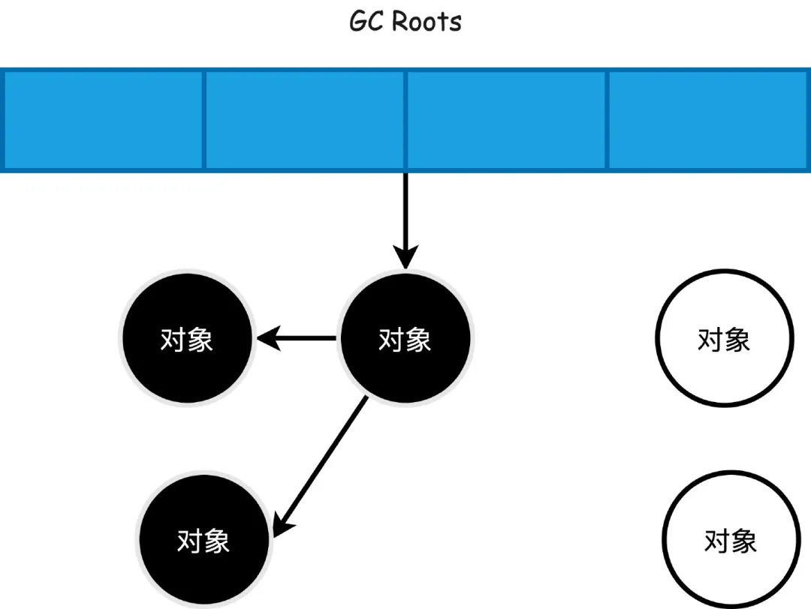
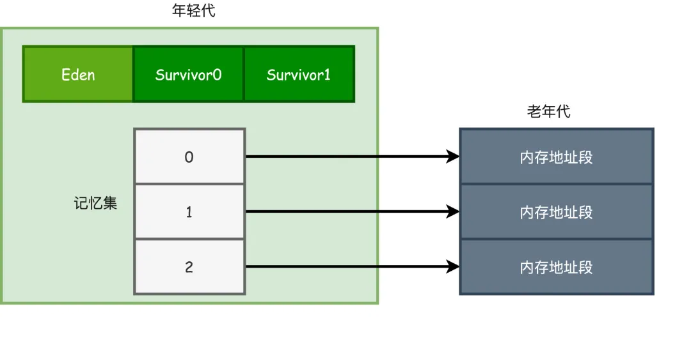
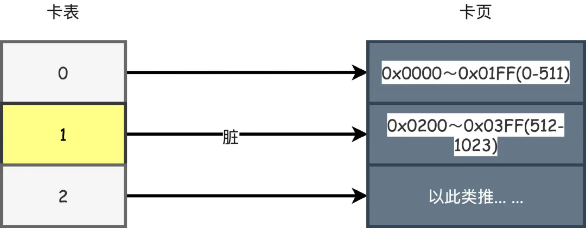
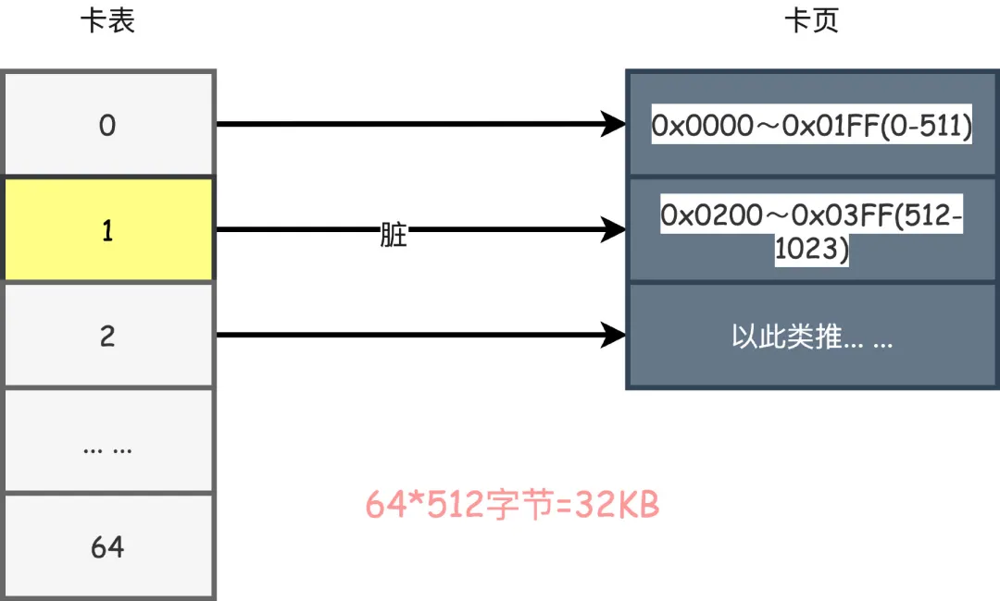
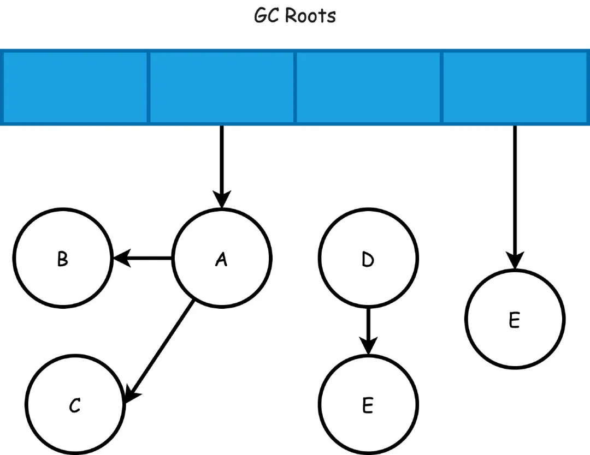
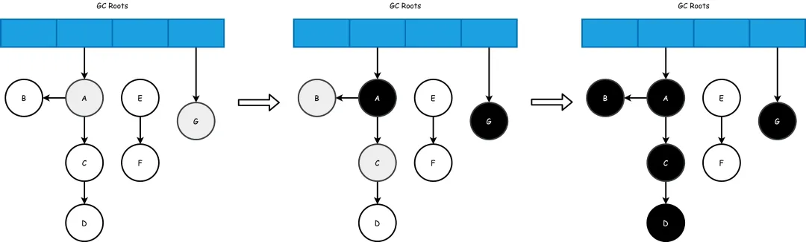
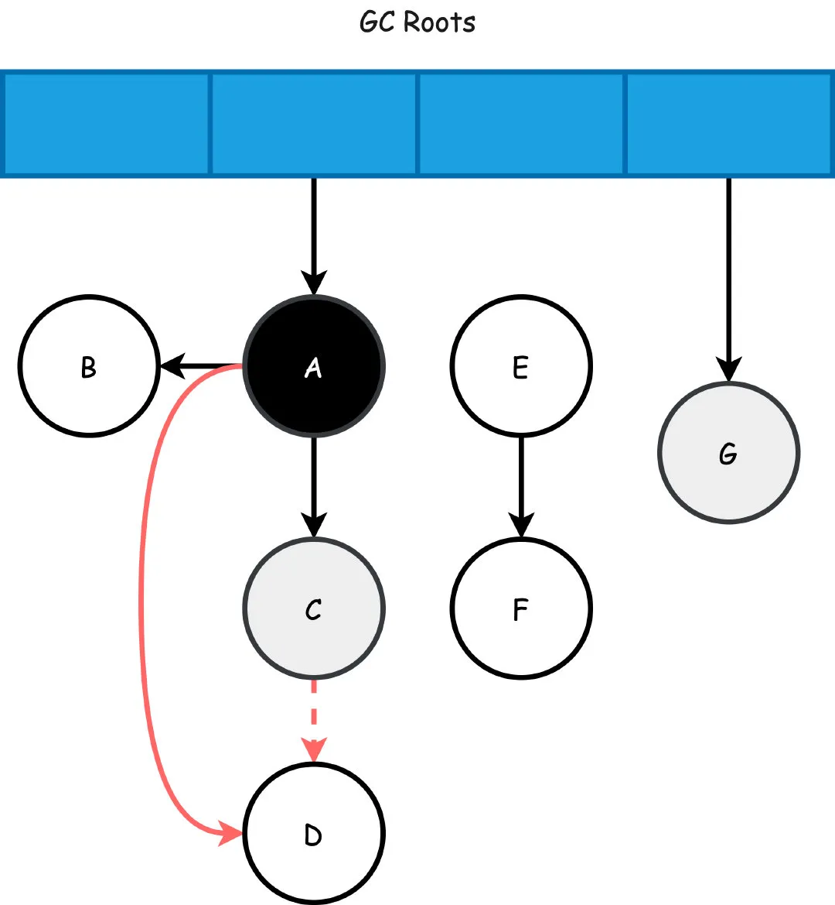

# 三色标记

<!-- START doctoc generated TOC please keep comment here to allow auto update -->
<!-- DON'T EDIT THIS SECTION, INSTEAD RE-RUN doctoc TO UPDATE -->

- [1. 引用计数&可达性分析](#1-%E5%BC%95%E7%94%A8%E8%AE%A1%E6%95%B0%E5%8F%AF%E8%BE%BE%E6%80%A7%E5%88%86%E6%9E%90)
- [2. 分代收集](#2-%E5%88%86%E4%BB%A3%E6%94%B6%E9%9B%86)
- [3. 卡表](#3-%E5%8D%A1%E8%A1%A8)
- [4. 卡表的问题](#4-%E5%8D%A1%E8%A1%A8%E7%9A%84%E9%97%AE%E9%A2%98)
    - [1. 写屏障](#1-%E5%86%99%E5%B1%8F%E9%9A%9C)
    - [2. 伪共享](#2-%E4%BC%AA%E5%85%B1%E4%BA%AB)
- [5. 三色标记法](#5-%E4%B8%89%E8%89%B2%E6%A0%87%E8%AE%B0%E6%B3%95)
- [6. 三色标记的问题](#6-%E4%B8%89%E8%89%B2%E6%A0%87%E8%AE%B0%E7%9A%84%E9%97%AE%E9%A2%98)

<!-- END doctoc generated TOC please keep comment here to allow auto update -->

[TOC]

## 1. 引用计数&可达性分析

要进行垃圾回收GC，那么我们首先就要决定到底怎么判断对象是否存活？一般来说有两种方式。

**引用计数**，给对象添加一个计数器，每当有地方引用它计数器就+1，反之引用失效时就-1，那么计数器值为0的对象就是可以回收的对象，但是有一个问题就是循环引用的话无法解决。

对于现在的虚拟机来说，主要用的算法是**可达性分析算法**。

首先定义GC ROOTS根对象集合，通过GC ROOTS向下搜索，搜索的过程走过的路径称作**引用链**，如果某个对象到GC ROOTS没有任何引用链，那么就是对象不可达，是可以被回收的对象。

不可达对象需要进行两次标记，第一次发现没有引用链相连，会被第一次标记，如果需要执行finalize()方法，之后这个对象会被放进队列中等待执行finalize()，如果在finalize()中成功和引用链上的其他对象关联，就会被移出可回收对象集合。（但是不建议使用finalize()方法）



## 2. 分代收集

有了如何判断对象存活的基础，接下来的问题就是怎么进行垃圾收集GC，现在商用的虚拟机基本上都是分代收集的实现，它的实现建立于两个假说：

1. 绝大多数对象都是朝生夕死的
2. 熬过越多次垃圾回收的对象越难死亡

基于这两个假说，就产生了现在我们常见的年轻代和老年代。

因为分代了，所以GC也就分代了。

年轻代用于存放那些死的快的对象，年轻代GC我们称之为MinorGC，每次年轻代内存不够我们就触发MinorGC，以后还有存活的对象我们就根据经历过MinorGC次数和动态年龄判断来决定是否晋升老年代。

老年代则存放老不死的对象，这里GC称之为OldGC，现在也有很多人把他叫做FullGC，实际上这并不准确，FullGC应该泛指年轻代和老年代的的GC。

按照我们上文所说的使用可达性分析算法来判断对象的存活，那么假如我们进行MinorGC，会不会有对象被老年代引用着？进行OldGC会不会又有对象被年轻代引用着？

如果是的话，那我们进行MinorGC的时候不光要管GC Roots，还有再去遍历老年代，这个性能问题就很大了。

因此，又来了一个假说。。。

**跨代引用相对于同代引用来说仅占极少数**。

由此就产生了一个新的解决方案，我们不用去扫描整个老年代了，只要在年轻代建立一个数据结构，叫做记忆集Remembered Set，他把老年代划分为N个区域，标志出哪个区域会存在跨代引用。

以后在进行MinorGC的时候，只要把这些包含了跨代引用的内存区域加入GC Roots一起扫描就行了。



## 3. 卡表

说完这些，才到了第一个话题：**卡表**。

卡表实际上就是记忆集的一种实现方式，如果说记忆集是接口的话，那么卡表就是他的实现类。

对于HotSpot虚拟机来说，卡表的实现方式就是一个字节数组。

```
CARD_TABLE [this address >> 9] = 0;
```

这段代码代表着卡表标记的的逻辑。实际上卡表就是映射了一块块的内存地址，这些内存地址块称为**卡页**，从代码可以看出每个卡页的大小就是2^9=512字节。

如果转换为16进制，数组的0，1号元素就映射为0x0000～0x01FF(0-511)、0x0200～0x03FF(512-1023)内存地址的卡页。



只要一个卡页内的对象存在一个或者多个跨代对象指针，就将该位置的卡表数组元素修改为1，表示这个位置为脏，没有则为0。

在GC的时候，就直接把值为1对应的卡页对象指针加入GC Roots一起扫描即可。

有了卡表，我们就不需要去在发生MinorGC的时候扫描整个老年代了，性能得到了极大的提升。

## 4. 卡表的问题

### 1. 写屏障

卡表的数组元素要修改成1，也就是脏的状态，对于HotSpot来说是通过写屏障来实现的，实际上就是在其他分代引用了当前分代的对象时候，在对引用进行赋值的时候进行更新，更新的方式类似AOP的切面思想。

```
void oop_field_store(oop* field, oop new_value) { 
// 引用字段赋值操作
*field = new_value;
// 写后屏障，在这里完成卡表状态更新 
post_write_barrier(field, new_value);
}
```

写屏障带来的问题就是额外的性能开销，不过这个问题不大，还能接受。

### 2. 伪共享

缓存行通常来说都是64字节，一个卡表元素1个字节，占用的卡页内存大小就是64*512=32KB的大小。

如果多线程刚好更新刚好处于这32KB范围内的对象，那么就会对性能产生影响。



怎么解决伪共享问题？

JDK7之后新增了一个参数`-XX:+UseCondCardMark`，他代表是否开启卡表更新的判断，没有被标记过才标记为脏。

```
if (CARD_TABLE [this address >> 9] != 0) 
   CARD_TABLE [this address >> 9] = 0;
```

## 5. 三色标记法

卡表解决了跨代收集和根节点枚举的性能问题。而有了这些措施实际上枚举根节点这个过程造成的STW停顿已经属于可控范围。

另外还存在一个问题就是接下来从GC Roots开始遍历，怎么才能高效的标记这些对象，这就是三色标记法的作用了。因为如果堆内的对象越多，那么显然标记产生的停顿时间就越长。

以现在我们熟知的CMS或者G1来举例，GC的前两个步骤如下：

1. 初始标记：标记GC ROOT能关联到的对象，这一步需要STW，但是停顿的时间很短。
2. 并发标记：从GCRoots的直接关联对象开始遍历整个对象图的过程，这个时间会比较长，但是现在是可以和用户线程并发执行的，这个效率的问题就是三色标记关注的问题。

在三色标记法中，把从GC Roots开始遍历的对象标记为以下三种颜色：

1. 白色，在刚开始遍历的时候，所有的对象都是白色的
2. 灰色，被垃圾回收器扫描过，但是至少还有一个引用没有被扫描
3. 黑色，被垃圾回收器扫描过，并且这个对象的引用也全部都被扫描过，是安全存活的对象

整个标记的过程如下，首先刚开始从GC Roots开始遍历的时候肯定所有的对象都是白色的。



接着A\G对象被扫描到变成灰色，然后A\G对象的引用也都被扫描，A\G对象变成黑色。

B\C对象开始被扫描变成灰色，他们的引用也被扫描完成后自己也就都变成了黑色。

而后D对象也一样会经历从灰色到黑色的过程(偷点懒，省略一张无关紧要的过程图吧)

最后剩下的E\F节点就是可以被回收的对象了。



## 6. 三色标记的问题

虽然三色标记法很高效，但是也会引申出其他的问题。

首先我们上文说过并发标记的过程是不会STW的，就是你妈在打扫卫生，而你在旁边一直丢垃圾，这也没关系，大不了最后就是还有一些垃圾没扫干净而已。

对于三色标记来说就是把应该要清理的对象标记成存活，这样本次GC就无法清理这个对象，这个被称作为浮动垃圾，解决方案就是等下次GC的时候再清理，这次扫不干净就等你妈下次打扫卫生的时候再清理就行了。

与此相反，如果把存活对象标记成需要清理，那么就有点麻烦了，这样你的程序就该出问题了。

所以经过研究表明，只有同时满足两个条件才会发生这种对象消失的问题：

1. 插入了一条或者多条黑色到白色对象的引用
2. 删除了全部从灰色到白色对象的引用

那么，针对这个问题也有两种解决方案：**增量更新**和**原始快照**，如果对应到垃圾回收器的话，CMS使用的是增量更新，而像G1则是使用原始快照。

思路就是既然要同时满足，那么我只需要破坏其中一个条件那么不就可以了吗？

所以，先看上面我们的例子中的一个场景，假设A扫描完，刚好C成为灰色，此时C->D的引用删除，同时A->D新增了引用（同时满足两个条件了吧），这样本来按照顺序接下来D应该会变成黑色(黑色对象不应该被清理)，但是由于C->D没有引用了，A已经成为了黑色对象，他不会再被重新扫描了，所以即便新增了A->D的引用，D也只能成为白色对象，最终被无情地清理。



增量更新解决方案就是，他会把这些新插入的引用记录下来，扫描结束之后，再以黑色对象为根重新扫描一次。这样看起来不就是增量更新吗？新插入的记录再扫一次！

原始快照则是去破坏第二个条件，他把这个要删除的引用记录下来，扫描结束之后，以灰色对象为根重新扫描一次。所以就像是快照一样，不管你删没删，其实最终还是会按照之前的关系重新来一次。

