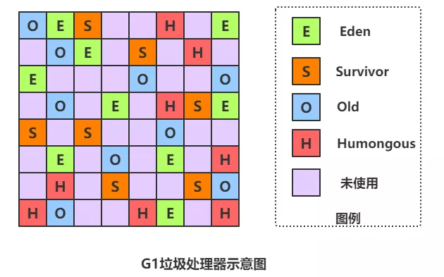

# 三色标记详解

<!-- START doctoc generated TOC please keep comment here to allow auto update -->
<!-- DON'T EDIT THIS SECTION, INSTEAD RE-RUN doctoc TO UPDATE -->

- [零、开篇](#%E9%9B%B6%E5%BC%80%E7%AF%87)
- [一、三色标记算法思想](#%E4%B8%80%E4%B8%89%E8%89%B2%E6%A0%87%E8%AE%B0%E7%AE%97%E6%B3%95%E6%80%9D%E6%83%B3)
  - [1. 算法流程](#1-%E7%AE%97%E6%B3%95%E6%B5%81%E7%A8%8B)
  - [2. 三色标记存在问题](#2-%E4%B8%89%E8%89%B2%E6%A0%87%E8%AE%B0%E5%AD%98%E5%9C%A8%E9%97%AE%E9%A2%98)
- [二、解决办法](#%E4%BA%8C%E8%A7%A3%E5%86%B3%E5%8A%9E%E6%B3%95)
  - [1. CMS回顾](#1-cms%E5%9B%9E%E9%A1%BE)
  - [2. CMS解决办法:增量更新](#2-cms%E8%A7%A3%E5%86%B3%E5%8A%9E%E6%B3%95%E5%A2%9E%E9%87%8F%E6%9B%B4%E6%96%B0)
  - [3. CMS另两个致命缺陷](#3-cms%E5%8F%A6%E4%B8%A4%E4%B8%AA%E8%87%B4%E5%91%BD%E7%BC%BA%E9%99%B7)
  - [4. G1回顾](#4-g1%E5%9B%9E%E9%A1%BE)
  - [5. G1前置知识](#5-g1%E5%89%8D%E7%BD%AE%E7%9F%A5%E8%AF%86)
  - [6. G1解决办法：SATB](#6-g1%E8%A7%A3%E5%86%B3%E5%8A%9E%E6%B3%95satb)
  - [7. SATB详细流程](#7-satb%E8%AF%A6%E7%BB%86%E6%B5%81%E7%A8%8B)
  - [8. SATB效率高于增量更新的原因？](#8-satb%E6%95%88%E7%8E%87%E9%AB%98%E4%BA%8E%E5%A2%9E%E9%87%8F%E6%9B%B4%E6%96%B0%E7%9A%84%E5%8E%9F%E5%9B%A0)
  - [9. G1会不会进行Full GC?](#9-g1%E4%BC%9A%E4%B8%8D%E4%BC%9A%E8%BF%9B%E8%A1%8Cfull-gc)

<!-- END doctoc generated TOC please keep comment here to allow auto update -->

## 零、开篇

三色标记法是一种垃圾回收法，它可以让JVM不发生或仅短时间发生STW(Stop The World)，从而达到清除JVM内存垃圾的目的。JVM中的**CMS、G1垃圾回收器**所使用垃圾回收算法即为三色标记法。

## 一、三色标记算法思想

三色标记法将对象的颜色分为了黑、灰、白，三种颜色。

**白色**：该对象没有被标记过。（对象垃圾）

**灰色**：该对象已经被标记过了，但该对象下的属性没有全被标记完。（GC需要从此对象中去寻找垃圾）

**黑色**：该对象已经被标记过了，且该对象下的属性也全部都被标记过了。（程序所需要的对象）


### 1. 算法流程

从我们`main`方法的根对象（JVM中称为`GC Root`）开始沿着他们的对象向下查找，用黑灰白的规则，标记出所有跟`GC Root`相连接的对象，扫描一遍结束后，一般需要进行一次短暂的STW(Stop The World)，再次进行扫描，此时因为黑色对象的属性都也已经被标记过了，所以只需找出灰色对象并顺着继续往下标记（且因为大部分的标记工作已经在第一次并发的时候发生了，所以灰色对象数量会很少，标记时间也会短很多）, 此时程序继续执行，`GC`线程扫描所有的内存，找出扫描之后依旧被标记为白色的对象（垃圾）,清除。

具体流程:

1. 首先创建三个集合：白、灰、黑。

2. 将所有对象放入白色集合中。

3. 然后从根节点开始遍历所有对象（注意这里并不**递归遍历**），把遍历到的对象从白色集合放入灰色集合。

4. 之后遍历灰色集合，将灰色对象引用的对象从白色集合放入灰色集合，之后将此灰色对象放入黑色集合

5. 重复 4 直到灰色中无任何对象

6. 通过write-barrier检测对象有变化，重复以上操作

7. 收集所有白色对象（垃圾）

### 2. 三色标记存在问题

1. 浮动垃圾：并发标记的过程中，若一个已经被标记成黑色或者灰色的对象，突然变成了垃圾，由于不会再对黑色标记过的对象重新扫描，所以不会被发现，那么这个对象不是白色的所以不会被清除，重新标记也不能从`GC Root`中去找到，成为了浮动垃圾，**浮动垃圾对系统的影响不大，留给下一次GC进行处理即可**。

2. 对象漏标问题（需要的对象被回收）：并发标记的过程中，一个业务线程将一个未被扫描过的白色对象断开引用成为垃圾（删除引用），同时黑色对象引用了该对象（增加引用）（这两部可以不分先后顺序）；因为黑色对象的含义为其属性都已经被标记过了，重新标记也不会从黑色对象中去找，导致该对象被程序所需要，却又要被GC回收，此问题会导致系统出现问题，而`CMS`与`G1`，两种回收器在使用三色标记法时，都采取了一些措施来应对这些问题，**CMS对增加引用环节进行处理（Increment Update），G1则对删除引用环节**

## 二、解决办法

在JVM虚拟机中有两种常见垃圾回收器使用了该算法：CMS(Concurrent Mark Sweep)、G1(Garbage First) ，为了解决三色标记法对对象漏标问题各自有各自的法：

### 1. CMS回顾

CMS(Concurrent Mark Sweep)收集器是一种以获取最短回收停顿时间为目标的收集器。目前很大一部分的Java应用集中在互联网网站或者基于浏览器的B/S系统的服务端上，这类应用通常都会较为关注服务的响应速度，希望系统停顿时间尽可能短，以给用户带来良好的交互体验。CMS收集器就非常符合这类应用的需求(但是实际由于某些问题,很少有使用CMS作为主要垃圾回收器的)。

从名字（包含“Mark Sweep”）上就可以看出CMS收集器是基于标记-清除算法实现的，它的运作过程相对于前面几种收集器来说要更复杂一些，整个过程分为四个步骤，包括：1）初始标记（CMS initial mark） 2）并发标记（CMS concurrent mark） 3）重新标记（CMS remark） 4）并发清除（CMS concurrent sweep）

其中初始标记、重新标记这两个步骤仍然需要“Stop The World”。初始标记仅仅只是标记一下GCRoots能直接关联到的对象，速度很快；

并发标记阶段就是从GC Roots的直接关联对象开始遍历整个对象图的过程，这个过程耗时较长但是不需要停顿用户线程，可以与垃圾收集线程一起并发运行；

重新标记阶段则是为了修正并发标记期间，因用户程序继续运作而导致标记产生变动的那一部分对象的标记记录，这个阶段的停顿时间通常会比初始标记阶段稍长一些，但也远比并发标记阶段的时间短；

最后是并发清除阶段，清理删除掉标记阶段判断的已经死亡的对象，由于不需要移动存活对象，所以这个阶段也是可以与用户线程同时并发的。

由于在整个过程中耗时最长的并发标记和并发清除阶段中，垃圾收集器线程都可以与用户线程一起工作，所以从总体上来说，CMS收集器的内存回收过程是与用户线程一起并发执行的。


### 2. CMS解决办法:增量更新

在应对漏标问题时，CMS使用了增量更新(Increment Update)方法来做：

在一个未被标记的对象（白色对象）被重新引用后，**引用它的对象若为黑色则要变成灰色，在下次二次标记时让GC线程继续标记它的属性对象**。

但是就算时这样，其仍然是存在漏标的问题：

1. 在一个灰色对象正在被一个GC线程回收时，当它已经被标记过的属性指向了一个白色对象（垃圾）

2. 而这个对象的属性对象本身还未全部标记结束，则为灰色不变

3. **而这个GC线程在标记完最后一个属性后，认为已经将所有的属性标记结束了，将这个灰色对象标记为黑色，被重新引用的白色对象，无法被标记**

### 3. CMS另两个致命缺陷

1. CMS采用了`Mark-Sweep`算法，最后会产生许多内存碎片，当到一定数量时，CMS无法清理这些碎片了，CMS会让`Serial Old`垃圾处理器来清理这些垃圾碎片，而`Serial Old`垃圾处理器是单线程操作进行清理垃圾的，效率很低。
   
   所以使用CMS就会出现一种情况，硬件升级了，却越来越卡顿，其原因就是因为进行`Serial Old GC`时，效率过低。
- 解决方案：使用`Mark-Sweep-Compact`算法，减少垃圾碎片

- 调优参数（配套使用）：
  
  ```
  -XX:+UseCMSCompactAtFullCollection  开启CMS的压缩
  -XX:CMSFullGCsBeforeCompaction 默认为0，指经过多少次CMS FullGC才进行压缩
  ```
3. 当JVM认为内存不够，再使用CMS进行并发清理内存可能会发生OOM的问题，而不得不进行`Serial Old GC`，`Serial Old`是单线程垃圾回收，效率低
- 解决方案：降低触发`CMS GC`的阈值，让浮动垃圾不那么容易占满老年代

- 调优参数：
  
  ```
  -XX:CMSInitiatingOccupancyFraction 92% 可以降低这个值，让老年代占用率达到该值就进行Serial Old GC
  ```

### 4. G1回顾

G1(Garbage First)物理内存不再分代，而是由一块一块的`Region`组成，但是逻辑分代仍然存在。G1不再坚持固定大小以及固定数量的分代区域划分，而是把连续的Java堆划分为多个大小相等的独立区域（Region），每一个Region都可以根据需要，扮演新生代的Eden空间、Survivor空间，或者老年代空间。收集器能够对扮演不同角色的Region采用不同的策略去处理，这样无论是新创建的对象还是已经存活了一段时间、熬过多次收集的旧对象都能获取很好的收集效果。

Region中还有一类特殊的Humongous区域，专门用来存储大对象。G1认为只要大小超过了一个Region容量一半的对象即可判定为大对象。每个Region的大小可以通过参数`-XX：G1HeapRegionSize`设定，取值范围为1MB～32MB，且应为2的N次幂。而对于那些超过了整个Region容量的超级大对象，将会被存放在N个连续的Humongous Region之中，G1的大多数行为都把Humongous Region作为老年代的一部分来进行看待，如图所示



### 5. G1前置知识

**Card Table（多种垃圾回收器均具备）**

- 由于在进行`YoungGC`时，我们在进行对一个对象是否被引用的过程，需要扫描整个Old区，所以JVM设计了`CardTable`，将Old区分为一个一个Card，一个Card有多个对象；如果一个Card中的对象有引用指向Young区，则将其标记为`Dirty Card`，下次需要进行`YoungGC`时，只需要去扫描`Dirty Card`即可而不用扫描所有Old区。

- Card Table 在底层数据结构以 `Bit Map`实现。


**RSet(Remembered Set)**

是辅助GC过程的一种结构，典型的空间换时间工具，和Card Table有些类似。

后面说到的CSet(Collection Set)也是辅助GC的，它记录了GC要收集的Region集合，集合里的Region可以是任意年代的。

在GC的时候，对于old->young和old->old的跨代对象引用，只要扫描对应的CSet中的RSet即可。逻辑上说每个Region都有一个RSet，RSet记录了其他Region中的对象引用本Region中对象的关系，属于points-into结构（谁引用了我的对象）。

而Card Table则是一种points-out（我引用了谁的对象）的结构，每个Card覆盖一定范围的Heap（一般为512Bytes）。G1的RSet是在Card Table的基础上实现的：每个Region会记录下别的Region有指向自己的指针，并标记这些指针分别在哪些Card的范围内。这个RSet其实是一个Hash Table，Key是别的Region的起始地址，Value是一个集合，里面的元素是Card Table的Index。每个`Region`中都有一个`RSet`，记录其他`Region`到本`Region`的引用信息；使得垃圾回收器不需要扫描整个堆找到谁引用当前分区中的对象，只需要扫描RSet即可。

**CSet(Collection Set)**

一组可被回收的分区Region的集合，是多个对象的集合内存区域。

**新生代与老年代的比例**

`5% - 60%`，一般不使用手工指定，因为这是G1预测停顿时间的基准，这地方简要说明一下，G1可以指定一个预期的停顿时间，然后G1会根据你设定的时间来动态调整年轻代的比例，例如时间长，就将年轻代比例调小，让YGC尽早执行。

### 6. G1解决办法：SATB

SATB(Snapshot At The Beginning)，在应对漏标问题时，G1使用了`SATB`方法来做，具体流程：

1. 在开始标记的时候生成一个快照图标记存活对象。

2. 在一个引用断开后，要将此引用推到GC的堆栈里，保证白色对象（垃圾）还能被GC线程扫描到(在**write barrier**(写屏障)里把所有旧的引用所指向的对象都变成非白的)。

3. 配合`RSet`，去扫描哪些Region引用到当前的白色对象，若没有引用到当前对象，则回收。

### 7. SATB详细流程

1. SATB是维持并发GC的一种手段。G1并发的基础就是SATB。SATB可以理解成在GC开始之前对堆内存里的对象做一次快照，此时活的对像就认为是活的，从而开成一个对象图。

2. 在GC收集的时候，新生代的对象也认为是活的对象，除此之外其他不可达的对象都认为是垃圾对象。

3. 如何找到在GC过程中分配的对象呢？每个region记录着两个top-at-mark-start(TAMS)指针，分别为prevTAMS和nextTAMS。在TAMS以上的对象就是新分配的，因而被视为隐式marked。

4. 通过这种方式我们就找到了在GC过程中新分配的对象，并把这些对象认为是活的对象。

5. 解决了对象在GC过程中分配的问题，那么在GC过程中引用发生变化的问题怎么解决呢？

6. G1给出的解决办法是通过Write Barrier。Write Barrier就是对引用字段进行赋值做了额外处理。通过Write Barrier就可以了解到哪些引用对象发生了什么样的变化。

7. mark的过程就是遍历heap标记live object的过程，采用的是三色标记算法，这三种颜色为white（表示还未访问到）、gray（访问到但是它用到的引用还没有完全扫描）、back（访问到而且其用到的引用已经完全扫描完）。

8. 整个三色标记算法就是从GC roots出发遍历heap，针对可达对象先标记white为gray，然后再标记gray为black；遍历完成之后所有可达对象都是balck的，所有white都是可以回收的。

9. SATB仅仅对于在marking开始阶段进行“snapshot”(marked all reachable at mark start)，但是concurrent的时候并发修改可能造成对象漏标记。

10. 对black新引用了一个white对象，然后又从gray对象中删除了对该white对象的引用，这样会造成了该white对象漏标记。

11. 对black新引用了一个white对象，然后从gray对象删了一个引用该white对象的white对象，这样也会造成了该white对象漏标记。

12. 对black新引用了一个刚new出来的white对象，没有其他gray对象引用该white对象，这样也会造成了该white对象漏标记。

### 8. SATB效率高于增量更新的原因？

因为SATB在重新标记环节只需要去重新扫描那些被推到堆栈中的引用，并配合`RSet`来判断当前对象是否被引用来进行回收；

并且在最后`G1`并不会选择回收所有垃圾对象，而是根据`Region`的垃圾多少来判断与预估回收价值（指回收的垃圾与回收的`STW`时间的一个预估值），将一个或者多个`Region`放到`CSet`中，最后将这些`Region`中的存活对象压缩并复制到新的`Region`中，清空原来的`Region`。

### 9. G1会不会进行Full GC?

会，当内存满了的时候就会进行`Full GC`；且`JDK10`之前的`Full GC`，为单线程的，所以使用G1需要避免`Full GC`的产生。

解决方案：

- 加大内存；

- 提高CPU性能，加快GC回收速度，而对象增加速度赶不上回收速度，则Full GC可以避免；

- 降低进行Mixed GC触发的阈值，让Mixed GC提早发生（默认45%）