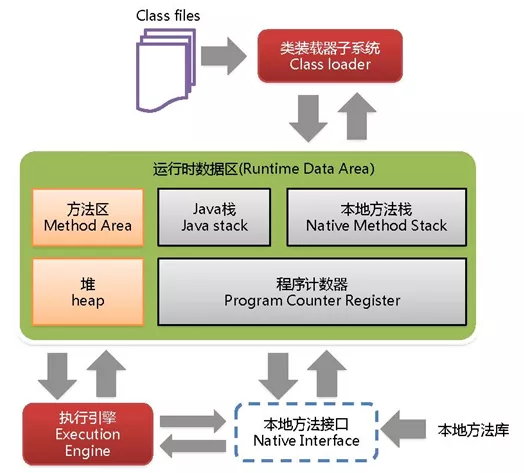
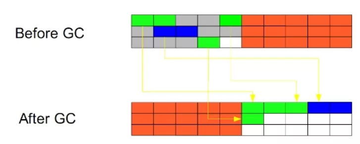
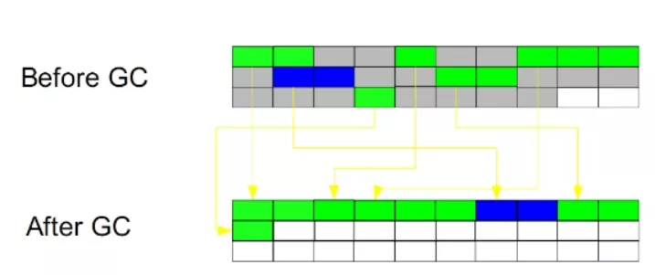

# JVM21问

[TOC]

## 1. 什么是JVM内存结构？

jvm主要分成五块内存区域，程序计数器、虚拟机栈、本地方法栈、java堆、方法区：

- 程序计数器：线程私有的，是一块很小的内存空间，作为当前线程的行号指示器，用于记录当前虚拟机正在执行的线程指令地址；
- 虚拟机栈：线程私有的，每个方法执行的时候都会创建一个栈帧，用于存储局部变量表、操作数、动态链接和方法返回等信息，当线程请求的栈深度超过了虚拟机允许的最大深度时，就会抛出StackOverFlowError；
- 本地方法栈：线程私有的，保存的是native方法的信息，当一个jvm创建的线程调用native方法后，jvm不会在虚拟机栈中为该线程创建栈帧，而是简单的动态链接并直接调用该方法；
- 堆：java堆是所有线程共享的一块内存，几乎所有对象的实例和数组都要在堆上分配内存，因此该区域经常发生垃圾回收的操作；
- 方法区：存放已被加载的类信息、常量、静态变量、即时编译器编译后的代码数据，即永久代。在jdk1.8后，防腐漆的实现从永久代变成了元空间。

## 2. 什么是JVM内存模型？

**Java 内存模型**（下文简称 **JMM**）就是在底层处理器内存模型的基础上，定义自己的多线程语义。它明确指定了一组排序规则，来保证线程间的可见性。

这一组规则被称为 **Happens-Before**, JMM 规定，要想保证 B 操作能够看到 A 操作的结果（无论它们是否在同一个线程），那么 A 和 B 之间必须满足 **Happens-Before 关系**：

- **单线程规则**：一个线程中的每个动作都 happens-before 该线程中后续的每个动作
- **监视器锁定规则**：监听器的**解锁**动作 happens-before 后续对这个监听器的**锁定**动作
- **volatile 变量规则**：对 volatile 字段的写入动作 happens-before 后续对这个字段的每个读取动作
- **线程 start 规则**：线程 **start()** 方法的执行 happens-before 一个启动线程内的任意动作
- **线程 join 规则**：一个线程内的所有动作 happens-before 任意其他线程在该线程 **join()** 成功返回之前
- **传递性**：如果 A happens-before B, 且 B happens-before C, 那么 A happens-before C

怎么理解 happens-before 呢？如果按字面意思，比如第二个规则，线程（不管是不是同一个）的解锁动作发生在锁定之前？这明显不对。happens-before 也是为了保证可见性，比如那个解锁和加锁的动作，可以这样理解，线程1释放锁退出同步块，线程2加锁进入同步块，那么线程2就能看见线程1对共享对象修改的结果。

Java 提供了几种语言结构，包括 *volatile*, *final* 和 *synchronized*, 它们旨在帮助程序员向**编译器**描述程序的并发要求，其中：

- **volatile** - 保证**可见性**和**有序性**
- **synchronized** - 保证**可见性**和**有序性**; 通过**管程（Monitor）**保证一组动作的**原子性**
- **final** - 通过禁止**在构造函数初始化**和**给 final 字段赋值**这两个动作的重排序，保证**可见性**（如果 **this 引用逃逸**就不好说可见性了）

编译器在遇到这些关键字时，会插入相应的内存屏障，保证语义的正确性。

有一点需要**注意**的是，**synchronized** **不保证**同步块内的代码禁止重排序，因为它通过锁保证同一时刻只有**一个线程**访问同步块（或临界区），也就是说同步块的代码只需满足 **as-if-serial** 语义 - 只要单线程的执行结果不改变，可以进行重排序。

所以说，Java 内存模型描述的是多线程对共享内存修改后彼此之间的可见性，另外，还确保正确同步的 Java 代码可以在不同体系结构的处理器上正确运行。

## 3. heap 和stack 有什么区别？

1. 申请方式

stack:由系统自动分配。例如，声明在函数中一个局部变量 int b; 系统自动在栈中为 b 开辟空间

heap:需要程序员自己申请，并指明大小，在 c 中 malloc 函数，对于Java 需要手动 new Object()的形式开辟

2. 申请后系统的响应

stack：只要栈的剩余空间大于所申请空间，系统将为程序提供内存，否则将报异常提示栈溢出。

heap：首先应该知道操作系统有一个记录空闲内存地址的链表，当系统收到程序的申请时，会遍历该链表，寻找第一个空间大于所申请空间的堆结点，然后将该结点从空闲结点链表中删除，并将该结点的空间分配给程序。另外，由于找到的堆结点的大小不一定正好等于申请的大小，系统会自动的将多余的那部分重新放入空闲链表中。

3. 申请大小的限制

stack：栈是向低地址扩展的数据结构，是一块连续的内存的区域。这句话的意思是栈顶的地址和栈的最大容量是系统预先规定好的，在 WINDOWS 下，栈的大小是 2M（默认值也取决于虚拟内存的大小），如果申请的空间超过栈的剩余空间时，将提示 overflow。因此，能从栈获得的空间较小。

heap：堆是向高地址扩展的数据结构，是不连续的内存区域。这是由于系统是用链表来存储的空闲内存地址的， 自然是不连续的，而链表的遍历方向是由低地址向高地址。堆的大小受限于计算机系统中有效的虚拟内存。由此可见， 堆获得的空间比较灵活，也比较大。

4. 申请效率的比较

stack：由系统自动分配，速度较快。但程序员是无法控制的。

heap：由 new 分配的内存，一般速度比较慢，而且容易产生内存碎片,不过用起来最方便。

5. heap和stack中的存储内容

stack：在函数调用时，第一个进栈的是主函数中后的下一条指令（函数调用语句的下一条可执行语句）的地址， 然后是函数的各个参数，在大多数的 C 编译器中，参数是由右往左入栈的，然后是函数中的局部变量。注意静态变量是不入栈的。

当本次函数调用结束后，局部变量先出栈，然后是参数，最后栈顶指针指向最开始存的地址，也就是主函数中的下一条指令，程序由该点继续运行。

heap：一般是在堆的头部用一个字节存放堆的大小。堆中的具体内容由程序员安排。

## 4. 什么情况下会发生栈内存溢出？

1. 栈是线程私有的，栈的生命周期和线程一样，每个方法在执行的时候就会创建一个栈帧，它包含局部变量表、操作数栈、动态链接、方法出口等信息，局部变量表又包括基本数据类型和对象的引用；
2. 当线程请求的栈深度超过了虚拟机允许的最大深度时，会抛出StackOverFlowError异常，方法递归调用肯可能会出现该问题；
3. 调整参数-xss去调整jvm栈的大小

## 5. 谈谈对 OOM 的认识？如何排查 OOM 的问题？

除了程序计数器，其他内存区域都有 OOM 的风险。

- 栈一般经常会发生 StackOverflowError，比如 32 位的 windows 系统单进程限制 2G 内存，无限创建线程就会发生栈的 OOM
- Java 8 常量池移到堆中，溢出会出 java.lang.OutOfMemoryError: Java heap space，设置最大元空间大小参数无效；
- 堆内存溢出，报错同上，这种比较好理解，GC 之后无法在堆中申请内存创建对象就会报错；
- 方法区 OOM，经常会遇到的是动态生成大量的类、jsp 等；
- 直接内存 OOM，涉及到 -XX:MaxDirectMemorySize 参数和 Unsafe 对象对内存的申请。

排查 OOM 的方法：

- 增加两个参数 -XX:+HeapDumpOnOutOfMemoryError -XX:HeapDumpPath=/tmp/heapdump.hprof，当 OOM 发生时自动 dump 堆内存信息到指定目录；
- 同时 jstat 查看监控 JVM 的内存和 GC 情况，先观察问题大概出在什么区域；
- 使用 MAT 工具载入到 dump 文件，分析大对象的占用情况，比如 HashMap 做缓存未清理，时间长了就会内存溢出，可以把改为弱引用 。

## 6. 谈谈 JVM 中的常量池？

JVM常量池主要分为**Class文件常量池、运行时常量池，全局字符串常量池，以及基本类型包装类对象常量池**。

- **Class文件常量池**。class文件是一组以字节为单位的二进制数据流，在java代码的编译期间，我们编写的java文件就被编译为.class文件格式的二进制数据存放在磁盘中，其中就包括class文件常量池。
- **运行时常量池**：运行时常量池相对于class常量池一大特征就是具有动态性，java规范并不要求常量只能在运行时才产生，也就是说运行时常量池的内容并不全部来自class常量池，在运行时可以通过代码生成常量并将其放入运行时常量池中，这种特性被用的最多的就是String.intern()。
- **全局字符串常量池**：字符串常量池是JVM所维护的一个字符串实例的引用表，在HotSpot VM中，它是一个叫做StringTable的全局表。在字符串常量池中维护的是字符串实例的引用，底层C++实现就是一个Hashtable。这些被维护的引用所指的字符串实例，被称作”被驻留的字符串”或”interned string”或通常所说的”进入了字符串常量池的字符串”。
- 基本类型包装类对象常量池：java中基本类型的包装类的大部分都实现了常量池技术，这些类是Byte,Short,Integer,Long,Character,Boolean,另外两种浮点数类型的包装类则没有实现。另外上面这5种整型的包装类也只是在对应值小于等于127时才可使用对象池，也即对象不负责创建和管理大于127的这些类的对象。

## 7. 如何判断一个对象是否存活？

判断一个对象是否存活，分为两种算法1：引用计数法；2：可达性分析算法；

**引用计数法**：给每一个对象设置一个引用计数器，当有一个地方引用该对象的时候，引用计数器就+1，引用失效时，引用计数器就-1；当引用计数器为0的时候，就说明这个对象没有被引用，也就是垃圾对象，等待回收；

缺点：无法解决循环引用的问题，当A引用B，B也引用A的时候，此时AB对象的引用都不为0，此时也就无法垃圾回收，所以一般主流虚拟机都不采用这个方法；

**可达性分析法**：从一个被称为GC Roots的对象向下搜索，如果一个对象到GC Roots没有任何引用链相连接时，说明此对象不可用，在java中可以作为GC Roots的对象有以下几种：

- 虚拟机栈中引用的对象
- 方法区类静态属性引用的变量
- 方法区常量池引用的对象
- 本地方法栈JNI引用的对象

但一个对象满足上述条件的时候，不会马上被回收，还需要进行两次标记：

第一次标记：判断当前对象是否有finalize()方法并且该方法没有被执行过，若不存在则标记为垃圾对象，等待回收；若有的话，则进行第二次标记；

第二次标记：将当前对象放入F-Queue队列，并生成一个finalize线程去执行该方法，虚拟机不保证该方法一定会被执行，这是因为如果线程执行缓慢或进入了死锁，会导致回收系统的崩溃；如果执行了finalize方法之后仍然没有与GC Roots有直接或者间接的引用，则该对象会被回收；

## 8. 强引用、软引用、弱引用、虚引用是什么，有什么区别？

- 强引用，就是普通的对象引用关系，如 String s = new String("ConstXiong")
- 软引用，用于维护一些可有可无的对象。只有在内存不足时，系统则会回收软引用对象，如果回收了软引用对象之后仍然没有足够的内存，才会抛出内存溢出异常。SoftReference 实现
- 弱引用，相比软引用来说，要更加无用一些，它拥有更短的生命周期，当 JVM 进行垃圾回收时，无论内存是否充足，都会回收被弱引用关联的对象。WeakReference 实现
- 虚引用是一种形同虚设的引用，在现实场景中用的不是很多，它主要用来跟踪对象被垃圾回收的活动。PhantomReference 实现

## 9. 被引用的对象就一定能存活吗？

不一定，看 Reference 类型，弱引用在 GC 时会被回收，软引用在内存不足的时候，即 OOM 前会被回收，但如果没有在 Reference Chain 中的对象就一定会被回收。

## 10. Java中的垃圾回收算法有哪些？

java中有四种垃圾回收算法，分别是标记清除法、标记整理法、复制算法、分代收集算法；

**标记清除法**：

第一步：利用可达性去遍历内存，把存活对象和垃圾对象进行标记；

第二步：在遍历一遍，将所有标记的对象回收掉；

特点：效率不行，标记和清除的效率都不高；标记和清除后会产生大量的不连续的空间分片，可能会导致之后程序运行的时候需分配大对象而找不到连续分片而不得不触发一次GC；

**标记整理法**：

第一步：利用可达性去遍历内存，把存活对象和垃圾对象进行标记；

第二步：将所有的存活的对象向一段移动，将端边界以外的对象都回收掉；

特点：适用于存活对象多，垃圾少的情况；需要整理的过程，无空间碎片产生；

**复制算法**：

将内存按照容量大小分为大小相等的两块，每次只使用一块，当一块使用完了，就将还存活的对象移到另一块上，然后在把使用过的内存空间移除；

特点：不会产生空间碎片；内存使用率极低；

**分代收集算法**：

根据内存对象的存活周期不同，将内存划分成几块，java虚拟机一般将内存分成新生代和老生代，在新生代中，有大量对象死去和少量对象存活，所以采用复制算法，只需要付出少量存活对象的复制成本就可以完成收集；老年代中因为对象的存活率极高，没有额外的空间对他进行分配担保，所以采用标记清理或者标记整理算法进行回收；

## 11. 有哪几种垃圾回收器，各自的优缺点是什么？

垃圾回收器主要分为以下几种：Serial、ParNew、Parallel Scavenge、Serial Old、Parallel Old、CMS、G1；

- Serial:单线程的收集器，收集垃圾时，必须stop the world，使用复制算法。它的最大特点是在进行垃圾回收时，需要对所有正在执行的线程暂停（stop the world），对于有些应用是难以接受的，但是如果应用的实时性要求不是那么高，只要停顿的时间控制在N毫秒之内，大多数应用还是可以接受的，是client级别的默认GC方式。
- ParNew:Serial收集器的多线程版本，也需要stop the world，复制算法。
- Parallel Scavenge:新生代收集器，复制算法的收集器，并发的多线程收集器，目标是达到一个可控的吞吐量，和ParNew的最大区别是GC自动调节策略；虚拟机会根据系统的运行状态收集性能监控信息，动态设置这些参数，以提供最优停顿时间和最高的吞吐量。
- Serial Old:Serial收集器的老年代版本，单线程收集器，使用标记整理算法。
- Parallel Old：是Parallel Scavenge收集器的老年代版本，使用多线程，标记-整理算法。
- CMS:是一种以获得最短回收停顿时间为目标的收集器，标记清除算法，运作过程：初始标记，并发标记，重新标记，并发清除，收集结束会产生大量空间碎片。
- G1:标记整理算法实现，运作流程主要包括以下：初始标记，并发标记，最终标记，筛选回收。不会产生空间碎片，可以精确地控制停顿；G1将整个堆分为大小相等的多个Region（区域），G1跟踪每个区域的垃圾大小，在后台维护一个优先级列表，每次根据允许的收集时间，优先回收价值最大的区域，已达到在有限时间内获取尽可能高的回收效率。

