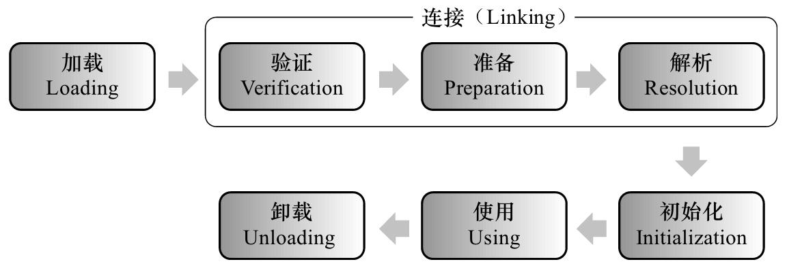
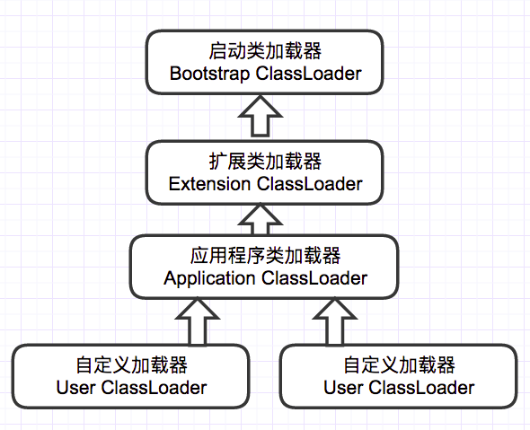
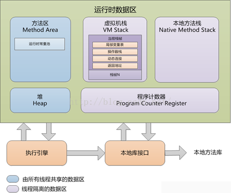
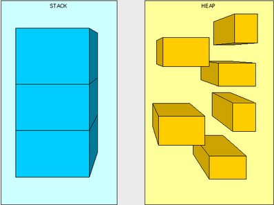

# JVM概念深入

<!-- START doctoc generated TOC please keep comment here to allow auto update -->
<!-- DON'T EDIT THIS SECTION, INSTEAD RE-RUN doctoc TO UPDATE -->

- [一、JVM类加载机制详解](#%E4%B8%80jvm%E7%B1%BB%E5%8A%A0%E8%BD%BD%E6%9C%BA%E5%88%B6%E8%AF%A6%E8%A7%A3)
    - [1. 加载](#1-%E5%8A%A0%E8%BD%BD)
    - [2. 验证](#2-%E9%AA%8C%E8%AF%81)
    - [3. 准备](#3-%E5%87%86%E5%A4%87)
    - [4. 解析](#4-%E8%A7%A3%E6%9E%90)
    - [5. 初始化](#5-%E5%88%9D%E5%A7%8B%E5%8C%96)
    - [6. 类加载器](#6-%E7%B1%BB%E5%8A%A0%E8%BD%BD%E5%99%A8)
- [二、JVM内存模型](#%E4%BA%8Cjvm%E5%86%85%E5%AD%98%E6%A8%A1%E5%9E%8B)
    - [1. 堆栈](#1-%E5%A0%86%E6%A0%88)
    - [2. 程序计数器](#2-%E7%A8%8B%E5%BA%8F%E8%AE%A1%E6%95%B0%E5%99%A8)
    - [3. 方法区](#3-%E6%96%B9%E6%B3%95%E5%8C%BA)

<!-- END doctoc generated TOC please keep comment here to allow auto update -->

[TOC]

## 一、JVM类加载机制详解

如下图所示，JVM类加载机制分为五个部分：加载，验证，准备，解析，初始化：



### 1. 加载

在加载阶段，虚拟机需要完成以下三件事情：

1. 通过一个类的全限定名来获取定义此类的二进制字节流。注意，这里的二进制字节流不一定非得要从一个Class文件获取，这里既可以从ZIP包中读取（比如从jar包和war包中读取），也可以从网络中获取，也可以在运行时计算生成（动态代理），也可以由其它文件生成（比如将JSP文件转换成对应的Class类）。

2. 将这个字节流所代表的静态存储结构转化为方法区的运行时数据结构。

3. 在Java堆中生成一个代表这个类的java.lang.Class对象，作为方法区这些数据的访问入口。

相对于类加载过程的其他阶段，加载阶段（准确地说，是加载阶段中获取类的二进制字节流的动作）是开发期可控性最强的阶段，因为加载阶段既可以使用系统提供的类加载器来完成，也可以由用户自定义的类加载器去完成，开发人员们可以通过定义自己的类加载器去控制字节流的获取方式。

### 2. 验证

这一阶段的主要目的是为了确保Class文件的字节流中包含的信息是否符合当前虚拟机的要求，并且不会危害虚拟机自身的安全。

### 3. 准备

准备阶段是正式为类变量**分配内存**并**设置类变量的初始值**阶段，即在方法区中分配这些变量所使用的内存空间。注意这里所说的初始值概念，比如一个类变量定义为：

```java
public static int v = 8080;
```

实际上变量v在准备阶段过后的初始值为0而不是8080，将v赋值为8080的`putstatic`指令是程序被编译后，存放于类构造器`<client>`方法之中，这里我们后面会解释。

但是注意如果声明为：

```java
public static final int v = 8080;
```

在编译阶段会为v生成`ConstantValue`属性，在准备阶段虚拟机会根据ConstantValue属性将v赋值为8080。

### 4. 解析

解析阶段是指虚拟机将常量池中的符号引用替换为直接引用的过程。符号引用就是class文件中的：

- CONSTANT_Class_info
- CONSTANT_Field_info
- CONSTANT_Method_info

等类型的常量。

下面我们解释一下符号引用和直接引用的概念：

- 符号引用与虚拟机实现的布局无关，引用的目标并不一定要已经加载到内存中。各种虚拟机实现的内存布局可以各不相同，但是它们能接受的符号引用必须是一致的，因为符号引用的字面量形式明确定义在Java虚拟机规范的Class文件格式中。
- 直接引用可以是指向目标的指针，相对偏移量或是一个能间接定位到目标的句柄。如果有了直接引用，那引用的目标必定已经在内存中存在。

### 5. 初始化

初始化阶段是类加载最后一个阶段，前面的类加载阶段之后，除了在加载阶段可以自定义类加载器以外，其它操作都由JVM主导。到了初始阶段，才开始真正执行类中定义的Java程序代码。

初始化阶段是执行类构造器`<clint>`方法的过程。`<clint>`方法是由编译器自动收集类中的类变量的赋值操作和静态语句块中的语句合并而成的。虚拟机会保证`<clint>`方法执行之前，父类的`<clint>`方法已经执行完毕。

> p.s: 如果一个类中没有对静态变量赋值也没有静态语句块，那么编译器可以不为这个类生成`<clint>()`方法。

**注意以下几种情况不会执行类初始化：**

- 通过子类引用父类的静态字段，只会触发父类的初始化，而不会触发子类的初始化。
- 定义对象数组，不会触发该类的初始化。
- 常量在编译期间会存入调用类的常量池中，本质上并没有直接引用定义常量的类，不会触发定义常量所在的类。
- 通过类名获取Class对象，不会触发类的初始化。
- 通过Class.forName加载指定类时，如果指定参数initialize为false时，也不会触发类初始化，其实这个参数是告诉虚拟机，是否要对类进行初始化。
- 通过ClassLoader默认的loadClass方法，也不会触发初始化动作。

### 6. 类加载器

虚拟机设计团队把类加载阶段中的“通过一个类的全限定名来获取描述此类的二进制字节流”这个动作放到Java虚拟机外部去实现，以便让应用程序自己决定如何去获取所需要的类。实现这个动作的代码模块被称为“类加载器”。

对于任意一个类，都需要由加载它的类加载器和这个类本身一同确立其在Java虚拟机中的唯一性。这句话可以表达得更通俗一些：比较两个类是否“相等”，只有在这两个类是由同一个类加载器加载的前提之下才有意义，否则，即使这两个类是来源于同一个Class文件，只要加载它们的类加载器不同，那这两个类就必定不相等。这里所指的“相等”，包括代表类的Class对象的equals()方法、isAssignableFrom()方法、isInstance()方法的返回结果，也包括了使用instanceof关键字做对象所属关系判定等情况。如果没有注意到类加载器的影响，在某些情况下可能会产生具有迷惑性的结果。

JVM提供了3种类加载器：

- 启动类加载器(`Bootstrap ClassLoader`)：负责加载 JAVA_HOME\lib 目录中的，或通过`-Xbootclasspath`参数指定路径中的，且被虚拟机认可（按文件名识别，如rt.jar）的类。
- 扩展类加载器(`Extension ClassLoader`)：负责加载 JAVA_HOME\lib\ext 目录中的，或通过java.ext.dirs系统变量指定路径中的类库。
- 应用程序类加载器(`Application ClassLoader`)：负责加载用户路径（classpath）上的类库。

JVM通过双亲委派模型进行类的加载，当然我们也可以通过继承java.lang.ClassLoader实现自定义的类加载器。



双亲委派模型要求除了顶层的启动类加载器外，其余的类加载器都应当有自己的父类加载器。这里类加载器之间的父子关系一般不会以继承（Inheritance）的关系来实现，而是都使用组合（Composition）关系来复用父加载器的代码。

双亲委派模型的工作过程是：如果一个类加载器收到了类加载的请求，它首先不会自己去尝试加载这个类，而是把这个请求委派给父类加载器去完成，每一个层次的类加载器都是如此，因此所有的加载请求最终都应该传送到顶层的启动类加载器中，只有当父加载器反馈自己无法完成这个加载请求（它的搜索范围中没有找到所需的类）时，子加载器才会尝试自己去加载。

采用双亲委派的一个好处是比如加载位于rt.jar包中的类`java.lang.Object`，不管是哪个加载器加载这个类，最终都是委托给顶层的启动类加载器进行加载，这样就保证了使用不同的类加载器最终得到的都是同样一个`Object`对象。

在有些情境中可能会出现要我们自己来实现一个类加载器的需求，我们直接看一下jdk中的`ClassLoader`的源码实现：

```java
protected synchronized Class<?> loadClass(String name, boolean resolve)
        throws ClassNotFoundException {
    // First, check if the class has already been loaded
    Class c = findLoadedClass(name);
    if (c == null) {
        try {
            if (parent != null) {
                c = parent.loadClass(name, false);
            } else {
                c = findBootstrapClass0(name);
            }
        } catch (ClassNotFoundException e) {
            // If still not found, then invoke findClass in order
            // to find the class.
            c = findClass(name);
        }
    }
    if (resolve) {
        resolveClass(c);
    }
    return c;
}
```

- 首先通过`Class c = findLoadedClass(name);`判断一个类是否已经被加载过。
- 如果没有被加载过执行`if (c == null)`中的程序，遵循双亲委派的模型，首先会通过递归从父加载器开始找，直到父类加载器是`Bootstrap ClassLoader`为止。
- 最后根据`resolve`的值，判断这个class是否需要解析。

而上面的`findClass()`的实现如下，直接抛出一个异常，并且方法是`protected`，很明显这是留给我们开发者自己去实现的。

```java
protected Class<?> findClass(String name) throws ClassNotFoundException {
    throw new ClassNotFoundException(name);
}
```

## 二、JVM内存模型



### 1. 堆栈

这几个存储区最主要的就是栈区和堆区，那么什么是栈什么是堆呢？说的简单点，栈里面存放的是基本的数据类型和引用，而堆里面则是存放各种对象实例的。



堆与栈分开设计是为什么呢？

- 栈存储了处理逻辑、堆存储了具体的数据，这样隔离设计更为清晰
- 堆与栈分离，使得堆可以被多个栈共享。
- 栈保存了上下文的信息，因此只能向上增长；而堆是动态分配

栈的大小可以通过-XSs设置，如果不足的话，会引起java.lang.StackOverflowError的异常。

**栈区**

线程私有，生命周期与线程相同。每个方法执行的时候都会创建一个栈帧（stack frame）用于存放 局部变量表、操作数栈、动态链接、方法出口。

**堆**

存放对象实例，所有的对象的内存都在这里分配。垃圾回收主要就是作用于这里的。

- 堆得内存由-Xms指定，默认是物理内存的1/64；最大的内存由-Xmx指定，默认是物理内存的1/4。
- 默认空余的堆内存小于40%时，就会增大，直到-Xmx设置的内存。具体的比例可以由-XX:MinHeapFreeRatio指定
- 空余的内存大于70%时，就会减少内存，直到-Xms设置的大小。具体由-XX:MaxHeapFreeRatio指定。

因此一般都建议把这两个参数设置成一样大，可以避免JVM在不断调整大小。

### 2. 程序计数器

线程私有，这里记录了线程执行的字节码的行号，在分支、循环、跳转、异常、线程恢复等都依赖这个计数器。

### 3. 方法区

类型信息、字段信息、方法信息、其他信息。