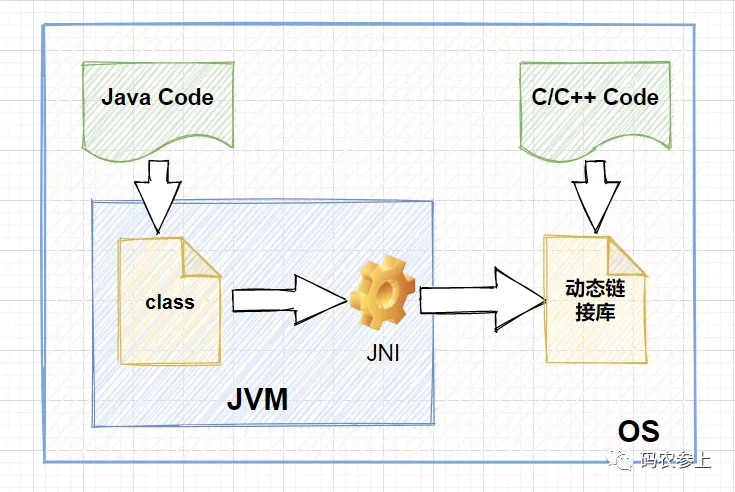
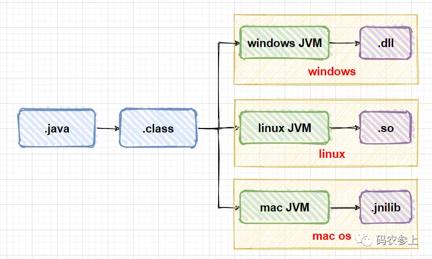
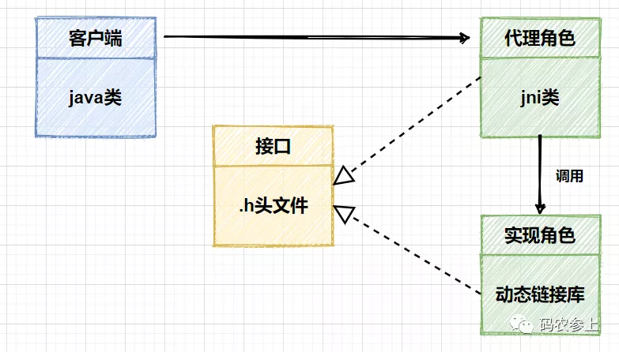

# JVM深入-JNI到底是个啥.md

<!-- START doctoc generated TOC please keep comment here to allow auto update -->
<!-- DON'T EDIT THIS SECTION, INSTEAD RE-RUN doctoc TO UPDATE -->

  - [一、引出](#%E4%B8%80%E5%BC%95%E5%87%BA)
  - [二、正文](#%E4%BA%8C%E6%AD%A3%E6%96%87)
    - [1. 准备java代码](#1-%E5%87%86%E5%A4%87java%E4%BB%A3%E7%A0%81)
    - [2. 生成头文件](#2-%E7%94%9F%E6%88%90%E5%A4%B4%E6%96%87%E4%BB%B6)
    - [3. gcc环境安装](#3-gcc%E7%8E%AF%E5%A2%83%E5%AE%89%E8%A3%85)
    - [4. 生成动态链接库](#4-%E7%94%9F%E6%88%90%E5%8A%A8%E6%80%81%E9%93%BE%E6%8E%A5%E5%BA%93)
    - [5. 理解](#5-%E7%90%86%E8%A7%A3)
  - [三、总结](#%E4%B8%89%E6%80%BB%E7%BB%93)

<!-- END doctoc generated TOC please keep comment here to allow auto update -->

[TOC]

> 本文内容并因为种种原因，未本人并未实践过

## 一、引出

在前面介绍`Unsafe`的文章中，简单的提到了java中的本地方法（`Native Method`），它可以通过JNI（`Java Native Interface`）调用其他语言中的函数来实现一些相对底层的功能，本文我们就来顺藤摸瓜，介绍一下`jni`以及它的使用。

首先回顾一下`jni`的主要功能，从jdk1.1开始`jni`标准就成为了java平台的一部分，它提供的一系列的API允许java和其他语言进行交互，实现了在java代码中调用其他语言的函数。通过`jni`的调用，能够实现这些功能：


通常情况下我们一般使用`jni`用来调用c或c++中的代码，在上一篇文章中我们用了下面的流程来描述了`native`方法的调用过程：

```
Java Code -> JNI -> C/C++ Code
```

但是准确的来说这一过程并不严谨，因为最终被执行的不是原始的c/c++代码，而是被编译连接后的动态链接库。因此我们将这个过程从单纯的代码调用层面上进行升级，将`jni`的调用过程提高到了jvm和操作系统的层面，来加点细节进行一下完善：



看到这里，可能有的小伙伴就要提出疑问了，不是说java语言是跨平台的吗，这种与操作系统本地编译的动态链接库进行的交互，会不会使java失去跨平台的可移植性？

针对这一问题，大家可以回想一下以前安装jdk的经历，在官网的下载列表中提供了各个操作系统的不同版本jdk，例如`windows`、`linux`、`mac os`版本等等，在这些jdk中，针对不同系统有着不同的jvm实现。而java语言的跨平台性恰好是和它底层的jvm密不可分的，正是依靠不同的操作系统下不同版本jvm的“翻译”工作，才能使编译后的字节码在不同的平台下畅通无阻的运行。

在不同操作系统下，c/c++或其他代码生成的动态链接库也会有差异，例如在window平台下会编译为`dll`文件，在linux平台下会编译为`so`文件，在mac os下会编译为`jnilib`文件。而不同平台下的jvm，会“约定俗成”的去加载某个固定类型的动态链接库文件，使得依赖于操作系统的功能可以被正常的调用，这一过程可以参考下面的图来进行理解：



在对`jni`的整体调用流程有了一定的了解后，对于它如何调用其他语言中的函数这一过程，你是否也会好奇它是怎样实现的，下面我们就通过手写一个java程序调用c++代码的例子，来理解它的调用过程。

## 二、正文

### 1. 准备java代码

首先定义一个包含了`native`方法的类如下，之后我们要使用这个类中的`native`方法通过`jni`调用c++编写成的动态链接库中的方法：

```java
public class JniTest {
    static{
        System.loadLibrary("MyNativeDll");
    }

    public static native void callCppMethod();

    public static void main(String[] args) {
        System.out.println("DLL path:"+System.getProperty("java.library.path"));
        callCppMethod();
    }
}
```

在代码中主要完成了以下工作：

- 在静态代码块中，调用`loadLibrary`方法加载本地的动态链接库，参数为不包含扩展名的动态链接库库文件名。在window平台下会加载`dll`文件，在linux平台下会加载`so`文件，在mac os下会加载`jnilib`文件
- 声明了一个`native`方法，`native`关键字负责通知jvm这里调用方法的是本地方法，该方法在外部被定义
- 在`main`方法中，打印加载`dll`文件的路径，并调用本地方法

### 2. 生成头文件

在使用c/c++来实现本地方法时，需要先创建`.h`头文件。简单的来说，c/c++程序通常由头文件（`.h`）和定义文件（`.c`或`.cpp`）组成，头文件包含了功能函数、数据接口的声明，而定义文件用于书写程序的实现。

在jdk8中可以直接使用`javac -h`指令生成c/c++语言中的头文件。如果你使用的是较早版本的jdk，需要在执行`javac`编译完成`class`文件后，再执行`javah -jni`生成c/c++风格的头文件（在jdk10的新特性中已经删除了`javah`这一指令）。我们使用的jdk8简化了这一步骤，使其可以一步完成，在命令行窗口下执行命令：

```
javac -h ./jni JniTest.java
```

指令中使用 `-h`参数指定放置生成的头文件的位置，最后的参数是java源文件的名称。在这个过程中完成了两件工作，首先生成`class`文件，其次在参数指定的目录下生成头文件。生成的头文件`com_cn_jni_JniTest.h`内容如下：

```c
/* DO NOT EDIT THIS FILE - it is machine generated */
#include <jni.h>
/* Header for class com_cn_jni_JniTest */

#ifndef _Included_com_cn_jni_JniTest
#define _Included_com_cn_jni_JniTest
#ifdef __cplusplus
extern "C" {
#endif
/*
 * Class:     com_cn_jni_JniTest
 * Method:    callCppMethod
 * Signature: ()V
 */
JNIEXPORT void JNICALL Java_com_cn_jni_JniTest_callCppMethod
  (JNIEnv *, jclass);

#ifdef __cplusplus
}
#endif
#endif
```

生成的头文件和大家熟悉的 java接口有些相似，只有函数的声明而没有具体实现。简单的解释一下头文件中的代码：

- `extern "C"`告诉编译器，这部分代码使用C语言规则来进行编译
- `JNIEXPORT`和`JNICALL`是`jni`中定义的两个宏，使用`JNIEXPORT`支持在外部程序代码中调用该动态库中的方法，使用`JNICALL`定义函数调用时参数的入栈出栈约定
- 函数名称由包名+类名+方法名组成，在该方法中有两个参数，通过第一个参数`JNIEnv *`的对象可以调用`jni.h`中封装好的大量函数 ，第二个参数代表着`native`方法的调用者，当java代码中定义的`native`方法是静态方法时这里的参数是`jclass`，非静态方法的参数是`jobject`

接下来我们创建一个`cpp`文件，引用头文件并实现其中的函数，也就是`native`方法将要实际执行的逻辑：

```c
#include "com_cn_jni_JniTest.h"
#include <stdio.h>
 
JNIEXPORT void JNICALL Java_com_cn_jni_JniTest_callCppMethod
  (JNIEnv *, jclass)
{
    printf("Print From Cpp: \n");
    printf("I am a cpp method ! \n");
}
```

在方法的实现中加入简单的`printf`打印语句，在完成方法的实现后，我们需要将上面的`cpp`文件编译为动态链接库，提供给java中的`native`方法调用，因此下面需要在window环境下安装`gcc`环境。

### 3. gcc环境安装

在window环境下，如果你不希望为了生成一个`dll`就去下载体积庞大的的`Visual Studio`的话，`MinGW`是一个不错的选择，简单的说它就是一个windows版本下的`gcc`。那么估计有的同学又要问了，`gcc`是什么？简单的来说就是linux系统下`C/C++`的编译器，通过它可以将源代码编译成可执行程序。首先从下面的网址下载`mingw-get-setup`的安装程序：

```
http://sourceforge.net/projects/mingw/  #32位
https://sourceforge.net/projects/mingw-w64/  #64位
```

需要注意，一定要按照系统位数安装对应的版本，否则后面生成的`dll`在运行时就可能会因位数不匹配而报错，我在实验的过程中第一次就错误安装了32位的`MinGw`，导致了在程序运行过程中报了下面错误：

```
Exception in thread "main" java.lang.UnsatisfiedLinkError: 
F:\Workspace20\unsafe-test\src\main\java\com\cn\jni\jni\MyNativeDll.dll: 
Can't load IA 32-bit .dll on a AMD 64-bit platform
```

安装完成后，将`MinGW\bin`目录加入系统环境变量`PATH`，输入下面的指令测试`gcc`是否可以使用：

```
gcc -v
```

如果能够正常输出`gcc`的版本信息，说明`gcc`安装成功。

在测试的过程中发现，如果安装的是64位的`mingw`，那么在安装完成后`gcc`就已经直接可以可用。但是如果安装的是32位的`mingw`，需要使用下面的命令单独安装`gcc`：

```
mingw-get install gcc
```

`gcc`安装完成后，如果还想安装`gdb`或`make`等其他指令进行调试或编译，同样可以使用强大的`mingw-get`命令进行独立安装。

### 4. 生成动态链接库

在`gcc`环境准备好的条件下，接下来使用下面的命令生成`dll`动态链接库：

```
gcc -m64 -Wl,--add-stdcall-alias -I"D:\Program Files\Java\jdk1.8.0_261\include" 
-I"D:\Program Files\Java\jdk1.8.0_261\include\win32" 
-shared -o MyNativeDll.dll JniTestImpl.cpp
```

简单的解释一下各个参数的含义：

- `-m64` ：将cpp代码编译为64位的应用程序
- `-Wl,--add-stdcall-alias`：`-Wl`表示将后面的参数传递给连接程序，参数`--add-stdcall-alias`表示带有标准调用后缀`@NN`的符号会被剥掉后缀后导出
- `-I`：指定头文件的路径，在生成的头文件代码中引入的`jni.h`就在这个目录下
- `-shared`：指定生成动态链接库，如果不使用这个标志那么外部程序将无法连接
- `-o`：指定目标的名称，这里将生成的动态链接库命名为`MyNativeDll.dll`
- `JniTestImpl.cpp`：被编译的源程序文件名

在指令的执行过程中，都做了什么事呢，可以参考下面这张图：


在执行过程中，以`.cpp`源代码和`.h`头文件作为源文件，先进行了预处理、编译、汇编的操作，图中省略了这一阶段产生的一些中间文件，编译完成后生成的`.o`二进制文件相对重要，依赖这个文件，最终生成动态链接库。

在执行了上面的指令后，就会在当前目录下生成一个`MyNativeDll.dll`文件，再运行之前准备好的java代码：


程序报错，这是因为在默认的载入库文件的目录下没有找到我们的`dll`文件。有两种方式可以解决：

- 直接将`dll`文件拷贝到默认的加载目录下，具体的路径可以通过`System.getProperty("java.library.path")`获取，该方法可能会获得多个目录，放在任意一个目录下即可
- 是在`VM Option`中修改启动参数，指定`dll`的存放目录：

```
-Djava.library.path=F:\Workspace20\unsafe-test\src\main\java\com\cn\jni\jni
```

再次执行，输出结果：

```
DLL path:F:\Workspace20\unsafe-test\src\main\java\com\cn\jni\jni
Print From Cpp: 
I am a cpp method !
```

可以看到程序加载`dll`的路径已经切换成了它的存放路径，并且通过`jni`调用成功，输出了在c++中的代码逻辑。

### 5. 理解

可以用下面的图来总结上面实现`jni`调用的过程：


在对`jni`的调用有了一个整体的了解后，如果大家对代理模式比较熟悉的话，也可以从代理模式的角度来理解`jni`，将`jni`调用过程中的各个角色带入到代理模式中：

- 代理角色：包含`native`方法的`jni`类
- 实现角色：c/c++或其他语言实现的动态链接库
- 客户端：调用`native`方法的java类程序
- 接口（抽象角色）：在`jni`中接口这一角色的存在感相对薄弱，因为`jni`是跨语言的，所以说无法严格的定义一个接口并让它同时应用于java和其他语言。但是通过生成的`.h`头文件，在一定程度上实现了从**接口规范**上统一了java中`native`方法和其他语言中的函数

以代理模式的概述图来进行描述：



上图在标准代理模式的基础上做了一些修改以便于理解，因为这里的接口只做规范约束作用，所以让客户端的调用过程跳过了接口，直接指向了代理角色，再由代理角色调用实现角色完成功能的调用。总的来说，`jni`起到了一个代理或中介的作用，与常见代理不同的是这里只做方法的调用，而不实现逻辑上的增强。通过这一模式，向java程序员隐藏了底层c/c++代码的实现细节，让我们专注于业务代码的编写即可。

## 三、总结

在前面对`native`方法有了一定了解的基础上，本文介绍了`jni`的相关知识。通过本文的学习，有助于我们：

- 理解java的为何能够做到跨平台，以及依赖操作系统的底层操作是如何实现的
- 了解`native`方法的调用过程，在必要时可以自己实现`jni`类接口调用
- ~~回顾一些C/C++知识~~

当然了，使用`jni`也会带来一些缺点：

- 当在某个操作系统下使用了`jni`标准，将本地代码编译生成了动态链接库后，如果要将这个程序移植到其他操作系统，需要在新的平台重新编译代码生成动态链接库
- 对其他语言的不正确使用可能会造成程序出现错误，例如之前提到的使用c语言进行内存操作时未及时回收内存可能引起的内存泄漏
- 对其他语言的依赖过高，会提高了java和其他语言的耦合性，也提高了对项目代码的维护成本

