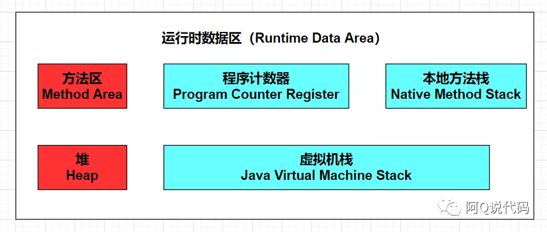

# JVM深入-JVM运行时数据区

[TOC]

## 一、运行时数据区总览

内存是非常重要的系统资源，是硬盘和`CPU`的中间仓库及桥梁，承载着操作系统和应用程序的实时运行。JVM内存布局规定了Java在运行过程中内存申请、分配、管理的策略，保证了JVM的高效稳定运行。不同的JVM对于内存的划分方式和管理机制存在着部分差异。下图就是`HotSpot`的经典的内存布局：


图中的`CodeCache`在JVM官方文档中被归于元空间，而在阿里的官方文档中被单独摘了出来，此处区别并不影响我们对它的学习。

Java虚拟机在执行Java程序的过程中，会将涉及到的数据划分到不同的内存区域去管理，而这部分区域就是我们接下来要讲的Java虚拟机的运行时数据区。



如上图所示，我们的运行时数据区分为PC寄存器、方法区、堆、本地方法栈和虚拟机栈五个部分。其中上文中所说的元空间就是方法区的具体落地实现。估计有的老铁会问：不是还有直接内存吗？其实直接内存并不属于运行时数据区的一部分，也不是java虚拟机规范中的区域，它的大小不受java堆大小的限制，是使用`Native`函数库直接分配的堆外内存，会被频繁使用。它存储着堆与本地方法相关的数据，可以避免在Java堆和`Native`堆中来回复制数据，能够提高效率。

细心的老铁应该会发现，上图中用了红蓝两种颜色来区分五个部分，其中红色的方法区和堆是线程间共享的，即它们会随着虚拟机启动而创建，随着虚拟机退出而销毁；而蓝色的部分为每个线程单独享有的，即它们与线程是一一对应的，会随着线程开始和结束而创建和销毁。在`HotSpot JVM`中，每个线程都与操作系统的本地线程直接映射：当一个java线程准备好执行之后，此时一个操作系统的本地线程也同时创建，java线程执行终止后，本地线程也会回收。操作系统负责所有线程的安排调度到任何一个可用的`CPU`上，一旦本地线程初始化成功，它就会调用Java现成的`run()`方法。

我们可以翻看官方文档了解一下`Runtime`类：

```
Every Java application has a single instance of class Runtime that allows the application to interface with the environment in which the application is running. The current runtime can be obtained from the getRuntime method.
```

**译：** 每个Java应用程序都有一个类运行时实例，该实例允许应用程序与运行应用程序的环境交互。当前运行时可以从`getRuntime`方法获得。

看到这如果大家对运行数据区还没有大致的概念的话，给大家举个小例子，大家一看便知：


如上图所示，厨师正在烹饪佳肴，我们如果把厨师炒菜比作我们的虚拟机执行代码的话，厨师就是我们后文中将要提到的执行引擎，而厨师后方的工具类和食材就相当于我们的运行时数据区。

## 二、PC寄存器（程序计数器）

这里的寄存器并不是广义上所指的物理寄存器，而是对物理寄存器的抽象模拟，把它称为PC计数器（或指令计数器）更为合适。

### 1. 介绍

Java虚拟机可以一次支持多个执行线程，每个Java虚拟机线程都有其自己的PC寄存器即为线程独有。PC寄存器会随着线程的创建而创建，会随着线程的结束而死亡。正因为程序计数器记录的是指令地址，所以它占用的内存空间较少，因此它是运行速度最快的存储区域，也是唯一一个在Java虚拟机规范中没有规定任何`OutOtMemoryError（内存溢出）`情况的区域。在任何时候，每个Java虚拟机线程都在执行单个方法的代码，即该线程的当前方法。如果线程当前正在执行的方法不是`native`，则该pc寄存器包含**当前正在执行的Java虚拟机指令的地址**；如果线程当前正在执行的方法是`native`，则Java虚拟机的pc寄存器值未定义`undefned`。

### 2. 作用

PC寄存器的作用就是用来存储指向下一条指令的地址，也就是即将要执行的指令代码，由执行引擎读取该指令并交由`cpu`执行。它是程序控制流的指示器，分支，循环，跳转，异常处理，线程恢复等基础功能都需要依赖这个计数器来完成。我们可以把PC寄存器理解为一个记录着当前线程所执行的字节码的行号指示器，也可以理解为一个游标，来告诉程序按照我指定的顺序执行。接下来用例子来演示下它所处的位置与作用。

栗子：


如图所示，PC寄存器中存储着指向“操作指令”的“指令地址”。假如现在PC寄存器中存储的指令地址是“5”，则执行引擎会取出对应的操作指令，然后做两件事：一是操作局部变量表、操作数栈等完成数据的存、取、加减等操作；二是将操作指令翻译成CPU能识别的机器指令，最后由CPU执行；此时字节码解释器就会改变PC寄存器中的值为“6”，以此类推。

### 3. 面试题分析

**1. 为什么要使用PC寄存器记录当前线程的执行地址呢？**

JVM的多线程是通过CPU时间片轮转（即线程轮流切换并分配处理器执行时间）算法来实现的。也就是说，某个线程在执行过程中可能会因为时间片耗尽而被挂起，而另一个线程获取到时间片开始执行。当被挂起的线程重新获取到时间片的时候，它要想从被挂起的地方继续执行，就必须知道它上次执行到哪个位置，这时候就需要PC寄存器来记录某个线程的字节码执行位置，如果虚拟机是单线程也就没必要用程序计数器记录每个线程的位置了。

**2. PC寄存器为什么会被设定为线程私有呢？**

由于jvm的多线程是通过线程轮流切换并分配处理器执行时间的方式来实现的，在任何一个确定的时刻，一个处理器都只会执行一条线程中的指令。因此为了能够准确的记录各个线程正在执行的当前字节码指令地址，最好的办法自然就是为每一个线程都分配一个PC寄存器。这样各条线程之间计数器互不影响，独立存储。

## 三、虚拟机栈

### 栈的介绍

由于跨平台性的设计，Java的指令都是根据栈来设计的，它遵循“先进先出、后进后出”的原则。它的优点就是跨平台、指令集小，编译器更容易实现。

在这里我们要对“栈”和“堆”做一个简单的区分，其中栈是运行时的单位，它解决的是程序运行的问题，即程序如何执行，或者说是如何处理数据；堆是存储的单位，它解决的是数据存储的问题，即数据怎么放、放在哪。我们举个简单的例子：假如你正在修理汽车，我们可以把修车的操作步骤看做是栈操作，而把汽车的零件一个个放到汽车中就可以看做是堆存储。

### 2. 虚拟机栈介绍

Java虚拟机栈，早期也叫Java栈。每个线程在创建时都会创建一个虚拟机栈，所以虚拟机栈是线程私有的，当线程结束时虚拟机栈也就结束了。JVM对虚拟机栈的操作只有进栈和出栈，所以它的访问速度仅次于程序计数器，也是一种快速有效的分配存储方式。对于虚拟机栈来说它不存在垃圾回收问题，但是虚拟机栈的大小是动态的或者固定不变的，所以它会存在栈溢出或者内存溢出问题：

- 栈溢出：如果采用固定大小的虚拟机栈，那每一个线程的虚拟机栈容量可以在线程创建的时候独立选定。如果线程请求分配的栈容量超过虚拟机栈允许的最大容量，虚拟机栈会抛出`StackOverflowError`异常。
- 内存溢出：如果虚拟机栈可以动态扩展，并且在尝试扩展的时候无法申请到足够的内存，或者在创建新的线程时没有足够的内存去创建对应的虚拟机栈，那虚拟机将会抛出`OutOfMemoryError`异常。栈的大小直接决定了函数调用的最大可达深度，我们可以通过`-Xss`参数来配置栈内存，追加字母k或K表示KB，m或M表示MB，g或G表示GB，示例:`-Xss1m`。

### 3. 栈帧的运行原理

虚拟机栈主管Java程序的运行，保存方法的局部变量（8种基本数据类型、对象的引用地址）、部分结果，并参与方法的调用和返回，那它内部到底是什么构造呢？

虚拟机栈内部保存着一个一个的栈帧（`Stack Frame`），每个栈帧与该线程正在执行的每个方法都是一一对应的。栈帧是一个内存区块，是一个数据集，维系着方法执行过程中的各种数据信息。在一条活动线程中，一个时间点上，只会有一个活动的栈帧。即只有当前正在执行的方法的栈帧（栈顶栈帧）是有效的，这个栈帧被称为当前栈帧 (`Current Frame`)，与当前栈帧相对应的方法就是当前方法(`Current Method`)，定义这个方法的类就是当前类(`Current Class`)。执行引擎运行的所有字节码指令只针对当前栈帧进行操作。执行过程如下图：


程序开始执行，首先方法1入栈，为栈帧1，此时栈帧1为当前栈帧；随后方法1调用方法2，方法2入栈，为栈帧2，此时栈帧2为当前栈帧，以此类推；当方法4入栈成为栈帧4并且执行代码，在方法4返回之际，栈帧4会传回方法4的执行结果给栈帧3，接着，虚拟机会丢弃栈帧4即栈帧4出栈，使得栈帧3重新成为当前栈帧，以此类推，直到方法1执行完成，栈帧1出栈，虚拟机栈被回收。

> Java方法有两种返回函数的方式，一种是正常的函数返回，使用return指令（包含`void`返回类型）;一种是抛出异常（指的是未处理的异常，如果是`try...catch`过了，算第一种）。不管使用哪种方式，都会导致栈帧出栈。不同线程中所包含的栈帧是不允许存在互相引用的，即不可能在一个栈帧之中引用另外一个线程的栈帧。


如图所示，栈帧由局部变量表、操作数栈、动态链接、方法返回地址和一些附加信息组成，接下来就让我们逐个来了解一下吧。

