# JVM深入-Java对象内存布局

[TOC]

<!-- START doctoc generated TOC please keep comment here to allow auto update -->
<!-- DON'T EDIT THIS SECTION, INSTEAD RE-RUN doctoc TO UPDATE -->

- [一、对象内存结构概述](#%E4%B8%80%E5%AF%B9%E8%B1%A1%E5%86%85%E5%AD%98%E7%BB%93%E6%9E%84%E6%A6%82%E8%BF%B0)
- [二、JOL 工具简介](#%E4%BA%8Cjol-%E5%B7%A5%E5%85%B7%E7%AE%80%E4%BB%8B)
- [三、对象头](#%E4%B8%89%E5%AF%B9%E8%B1%A1%E5%A4%B4)
  - [3.1 Mark Word 标记字](#31-mark-word-%E6%A0%87%E8%AE%B0%E5%AD%97)
    - [3.1.1 基于mark word的锁升级](#311-%E5%9F%BA%E4%BA%8Emark-word%E7%9A%84%E9%94%81%E5%8D%87%E7%BA%A7)
    - [3.1.2 其他信息](#312-%E5%85%B6%E4%BB%96%E4%BF%A1%E6%81%AF)
  - [3.2 Klass Pointer 类型指针](#32-klass-pointer-%E7%B1%BB%E5%9E%8B%E6%8C%87%E9%92%88)
    - [3.2.1 指针压缩原理](#321-%E6%8C%87%E9%92%88%E5%8E%8B%E7%BC%A9%E5%8E%9F%E7%90%86)
    - [3.2.2 指针压缩失效](#322-%E6%8C%87%E9%92%88%E5%8E%8B%E7%BC%A9%E5%A4%B1%E6%95%88)
  - [3.3 数组长度](#33-%E6%95%B0%E7%BB%84%E9%95%BF%E5%BA%A6)
- [四、实例数据](#%E5%9B%9B%E5%AE%9E%E4%BE%8B%E6%95%B0%E6%8D%AE)
  - [4.1 字段重排序](#41-%E5%AD%97%E6%AE%B5%E9%87%8D%E6%8E%92%E5%BA%8F)
  - [4.2 拥有父类情况](#42-%E6%8B%A5%E6%9C%89%E7%88%B6%E7%B1%BB%E6%83%85%E5%86%B5)
  - [4.3 引用数据类型](#43-%E5%BC%95%E7%94%A8%E6%95%B0%E6%8D%AE%E7%B1%BB%E5%9E%8B)
  - [4.4 静态变量](#44-%E9%9D%99%E6%80%81%E5%8F%98%E9%87%8F)
- [五、对齐填充字节](#%E4%BA%94%E5%AF%B9%E9%BD%90%E5%A1%AB%E5%85%85%E5%AD%97%E8%8A%82)
- [六、总结](#%E5%85%AD%E6%80%BB%E7%BB%93)

<!-- END doctoc generated TOC please keep comment here to allow auto update -->

> 文中代码基于 JDK 1.8.0_261，64-Bit HotSpot 运行


## 一、对象内存结构概述

在介绍对象在内存中的组成结构前，我们先简要回顾一个对象的创建过程：

1. jvm将对象所在的`class`文件加载到方法区中

2. jvm读取`main`方法入口，将`main`方法入栈，执行创建对象代码

3. 在`main`方法的栈内存中分配对象的引用，在堆中分配内存放入创建的对象，并将栈中的引用指向堆中的对象

所以当对象在实例化完成之后，是被存放在堆内存中的，这里的对象由3部分组成，如下图所示：

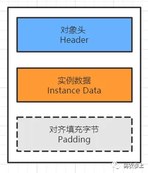

对各个组成部分的功能简要进行说明：

- 对象头：对象头存储的是对象在运行时状态的相关信息、指向该对象所属类的元数据的指针，如果对象是数组对象那么还会额外存储对象的数组长度
- 实例数据：实例数据存储的是对象的真正有效数据，也就是各个属性字段的值，如果在拥有父类的情况下，还会包含父类的字段。字段的存储顺序会受到数据类型长度、以及虚拟机的分配策略的影响
- 对齐填充字节：在java对象中，需要对齐填充字节的原因是，64位的jvm中对象的大小被要求向8字节对齐，因此当对象的长度不足8字节的整数倍时，需要在对象中进行填充操作。注意图中对齐填充部分使用了虚线，这是因为填充字节并不是固定存在的部分，这点在后面计算对象大小时具体进行说明

## 二、JOL 工具简介

在具体开始研究对象的内存结构之前，先介绍一下我们要用到的工具，`openjdk`官网提供了查看对象内存布局的工具`jol (java object layout)`，可在`maven`中引入坐标：

```xml
<dependency>
    <groupId>org.openjdk.jol</groupId>
    <artifactId>jol-core</artifactId>
    <version>0.14</version>
    <scope>provided</scope>
</dependency>
```

在代码中使用`jol`提供的方法查看jvm信息：

```java
System.out.println(VM.current().details());
```

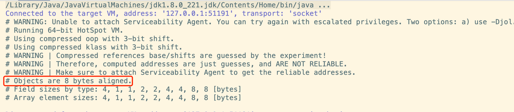

通过打印出来的信息，可以看到我们使用的是64位 jvm，并开启了指针压缩，对象默认使用8字节对齐方式。通过`jol`查看对象内存布局的方法，将在后面的例子中具体展示，下面开始对象内存布局的正式学习。

## 三、对象头

首先看一下对象头（`Object header`）的组成部分，根据普通对象和数组对象的不同，结构将会有所不同。只有当对象是数组对象才会有数组长度部分，普通对象没有该部分，如下图所示：

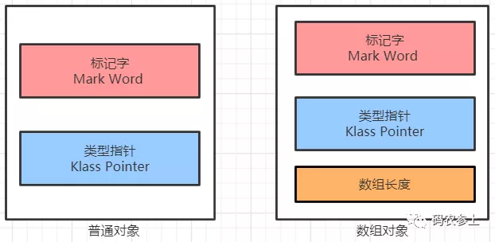

在对象头中`mark word` 占8字节，默认开启指针压缩的情况下`klass pointer` 占4字节，数组对象的数组长度占4字节。在了解了对象头的基础结构后，现在以一个不包含任何属性的空对象为例，查看一下它的内存布局，创建`User`类：

```java
public class User {
}
```

使用`jol`查看对象头的内存布局：

```java
public class HeaderDemo {
    public static void main(String[] args) {
        User user = new User();
        //查看对象的内存布局
        System.out.println(ClassLayout.parseInstance(user).toPrintable());
    }
}
```

执行代码，查看打印信息：

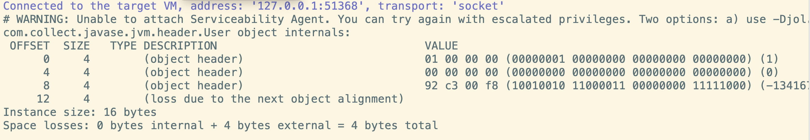

- `OFFSET`：偏移地址，单位为字节
- `SIZE`：占用内存大小，单位为字节
- `TYPE`：`Class`中定义的类型
- `DESCRIPTION`：类型描述，`Obejct header` 表示对象头，`alignment`表示对齐填充
- `VALUE`：对应内存中存储的值

当前对象共占用16字节，因为8字节标记字加4字节的类型指针，不满足向8字节对齐，因此需要填充4个字节：

```
8B (mark word) + 4B (klass pointer) + 0B (instance data) + 4B (padding)
```

### 3.1 Mark Word 标记字

在对象头中，`mark word` 一共有64个bit，用于存储对象自身的运行时数据，标记对象处于以下5种状态中的某一种：

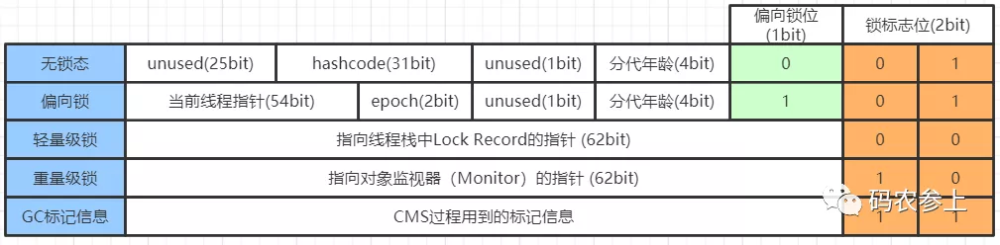

#### 3.1.1 基于mark word的锁升级

在jdk6 之前，通过`synchronized`关键字加锁时使用无差别的的重量级锁，重量级锁会造成线程的串行执行，并且使cpu在用户态和核心态之间频繁切换。随着对`synchronized`的不断优化，提出了锁升级的概念，并引入了偏向锁、轻量级锁、重量级锁。在`mark word`中，锁（`lock`）标志位占用2个bit，结合1个bit偏向锁（`biased_lock`）标志位，这样通过**倒数的3位**，就能用来标识当前对象持有的锁的状态，并判断出其余位存储的是什么信息。

基于`mark word`的锁升级的流程如下：

1. 锁对象刚创建时，没有任何线程竞争，对象处于无锁状态。在上面打印的空对象的内存布局中，根据大小端，得到最后8位是`00000001`，表示处于无锁态，并且处于不可偏向状态。这是因为在jdk中偏向锁存在延迟4秒启动，也就是说在jvm启动后4秒后创建的对象才会开启偏向锁，我们通过jvm参数取消这个延迟时间：

```
-XX:BiasedLockingStartupDelay=0
```

可以通过指定JVM运行参数是可以取消延迟，也可以采用sleep的方式看到结果：

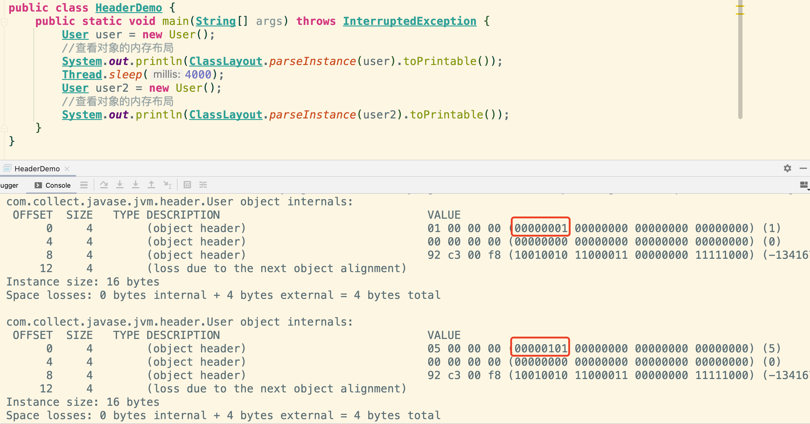

> 后续栗子采用指定JVM参数的方式取消延迟

这时最后3位为`101`，表示当前对象的锁没有被持有，并且处于可被偏向状态。

2. 在没有线程竞争的条件下，第一个获取锁的线程通过`CAS`将自己的`threadId`写入到该对象的`mark word`中，若后续该线程再次获取锁，需要比较当前线程`threadId`和对象`mark word`中的`threadId`是否一致，如果一致那么可以直接获取，并且锁对象始终保持对该线程的偏向，也就是说偏向锁不会主动释放。

使用代码进行测试同一个线程重复获取锁的过程：

```java
public static void main(String[] args) throws InterruptedException {
    User user=new User();
    synchronized (user){
      System.out.println(ClassLayout.parseInstance(user).toPrintable());
    }
    System.out.println(ClassLayout.parseInstance(user).toPrintable());
    synchronized (user){
      System.out.println(ClassLayout.parseInstance(user).toPrintable());
    }
}
```

执行结果：

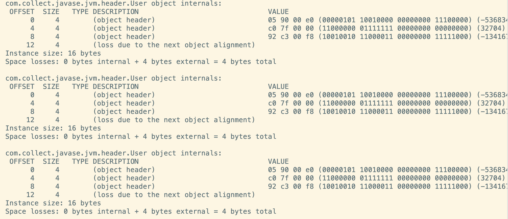

可以看到一个线程对一个对象加锁、解锁、重新获取对象的锁时，`mark word`都没有发生变化，偏向锁中的当前线程指针始终指向同一个线程。

3. 当两个或以上线程交替获取锁，但并没有在对象上并发的获取锁时，偏向锁升级为轻量级锁。在此阶段，线程采取`CAS`的自旋方式尝试获取锁，避免阻塞线程造成的cpu在用户态和内核态间转换的消耗。测试代码如下：

```java
public static void main(String[] args) throws InterruptedException {
    User user = new User();
    synchronized (user) {
      System.out.println("--MAIN--:" + ClassLayout.parseInstance(user).toPrintable());
    }

    Thread thread = new Thread(() -> {
      synchronized (user) {
        System.out.println("--THREAD--:" + ClassLayout.parseInstance(user).toPrintable());
      }
    });
    thread.start();
    thread.join();
    System.out.println("--END--:" + ClassLayout.parseInstance(user).toPrintable());
}
```

运行结果：

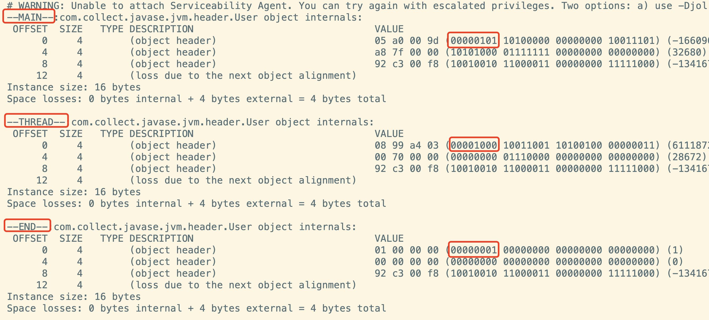

整个加锁状态的变化流程如下：

- 主线程首先对user对象加锁，首次加锁为`101`偏向锁
- 子线程等待主线程释放锁后，对user对象加锁，这时将偏向锁升级为`00`轻量级锁
- 轻量级锁解锁后，user对象无线程竞争，恢复为`001`无锁态，并且处于不可偏向状态。如果之后有线程再尝试获取user对象的锁，会直接加轻量级锁，而不是偏向锁

4. 当两个或以上线程并发的在同一个对象上进行同步时，为了避免无用自旋消耗cpu，轻量级锁会升级成重量级锁。这时`mark word`中的指针指向的是`monitor`对象（也被称为管程或监视器锁）的起始地址。测试代码如下：

```java
public static void main(String[] args) throws InterruptedException {
    User user = new User();
    new Thread(() -> {
      synchronized (user) {
        System.out.println("--THREAD1--:" + ClassLayout.parseInstance(user).toPrintable());
        try {
          TimeUnit.SECONDS.sleep(2);
        } catch (InterruptedException e) {
          e.printStackTrace();
        }
      }
    }).start();
    new Thread(() -> {
      synchronized (user) {
        System.out.println("--THREAD2--:" + ClassLayout.parseInstance(user).toPrintable());
        try {
          TimeUnit.SECONDS.sleep(2);
        } catch (InterruptedException e) {
          e.printStackTrace();
        }
      }
    }).start();
}
```

运行结果：

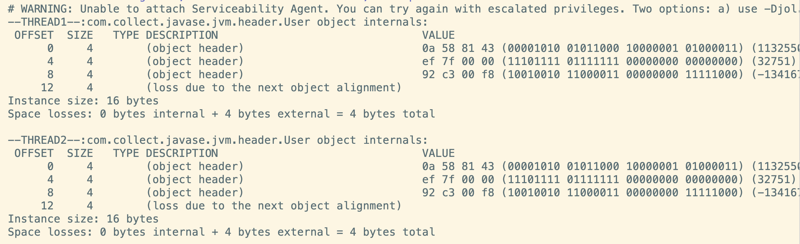

可以看到，在两个线程同时竞争user对象的锁时，会升级为`10`重量级锁。

#### 3.1.2 其他信息

对`mark word` 中其他重要信息进行说明：

- `hashcode`：无锁态下的`hashcode`采用了延迟加载技术，在第一次调用`hashCode()`方法时才会计算写入。对这一过程进行验证：

```java
public static void main(String[] args) throws InterruptedException {
    User user=new User();
    //打印内存布局
    System.out.println(ClassLayout.parseInstance(user).toPrintable());
    //计算hashCode
    System.out.println(user.hashCode());
    //再次打印内存布局
    System.out.println(ClassLayout.parseInstance(user).toPrintable());
}
```

运行结果：

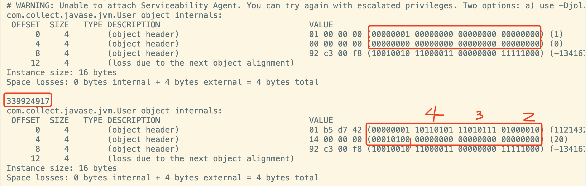

可以看到，在没有调用`hashCode()`方法前，31位的哈希值不存在，全部填充为0。在调用方法后，根据大小端，被填充的数据为：

```
10100010000101101011110110101
```

将2进制转换为10进制，对应哈希值`339924917`。需要注意，只有在调用没有被重写的`Object.hashCode()`方法或`System.identityHashCode(Object)`方法才会写入`mark word`，执行用户自定义的`hashCode()`方法不会被写入。

> 如要验证，切记这个hashcode是倒着组装的，如图顺序可组装出10100010000101101011110110101
>
> 烦死了

大家可能会注意到，当对象被加锁后，`mark word`中就没有足够空间来保存`hashCode`了，这时`hashcode`会被移动到重量级锁的`Object Monitor`中。

- `epoch`：偏向锁的时间戳

- 分代年龄（`age`）：在`jvm`的垃圾回收过程中，每当对象经过一次`Young GC`，年龄都会加1，这里4位来表示分代年龄最大值为15，这也就是为什么对象的年龄超过15后会被移到老年代的原因。在启动时可以通过添加参数来改变年龄阈值：

```
-XX:MaxTenuringThreshold
```

当设置的阈值超过15时，启动时会报错：

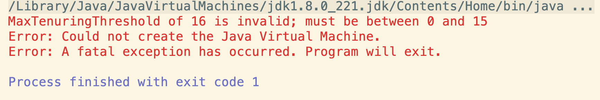

### 3.2 Klass Pointer 类型指针

`Klass Pointer`是一个指向方法区中`Class`信息的指针，虚拟机通过这个指针确定该对象属于哪个类的实例。在64位的JVM中，支持指针压缩功能，根据是否开启指针压缩，`Klass Pointer`占用的大小将会不同：

- 未开启指针压缩时，类型指针占用8B (64bit)
- 开启指针压缩情况下，类型指针占用4B (32bit)

在`jdk6`之后的版本中，指针压缩是被默认开启的，可通过启动参数开启或关闭该功能：

```
#开启指针压缩：
-XX:+UseCompressedOops
#关闭指针压缩：
-XX:-UseCompressedOops
```

还是以刚才的`User`类为例，关闭指针压缩后再次查看对象的内存布局：

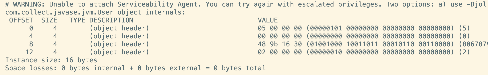

对象大小虽然还是16字节，但是组成发生了改变，8字节标记字加8字节类型指针，已经能满足对齐条件，因此不需要填充。

```
8B (mark word) + 8B (klass pointer) + 0B (instance data) + 0B (padding)
```

#### 3.2.1 指针压缩原理

在了解了指针压缩的作用后，我们来看一下指针压缩是如何实现的。首先在不开启指针压缩的情况下，一个对象的内存地址使用64位表示，这时能描述的内存地址范围是：

```
0 ~ 2^64-1
```

在开启指针压缩后，使用4个字节也就是32位，可以表示`2^32` 个内存地址，如果这个地址是真实地址的话，由于CPU寻址的最小单位是`Byte`，那么就是4GB内存。这对于我们来说是远远不够的，但是之前我们说过，java中对象默认使用了8字节对齐，也就是说1个对象占用的空间必须是8字节的整数倍，这样就创造了一个条件，使jvm在定位一个对象时不需要使用真正的内存地址，而是定位到由java进行了8字节映射后的地址（可以说是一个映射地址的编号）。

映射过程也非常简单，由于使用了8字节对齐后每个对象的地址偏移量后3位必定为0，所以在存储的时候可以将后3位0抹除（转化为`bit`是抹除了最后24位），在此基础上再去掉最高位，就完成了指针从8字节到4字节的压缩。而在实际使用时，在压缩后的指针后加3位0，就能够实现向真实地址的映射。(一脸懵逼...)

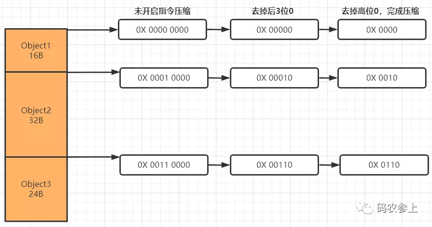

完成压缩后，现在指针的32位中的每一个`bit`，都可以代表8个字节，这样就相当于使原有的内存地址得到了8倍的扩容。所以在8字节对齐的情况下，32位最大能表示`2^32*8=32GB`内存，内存地址范围是：

```
0 ~ (2^32-1)*8
```

#### 3.2.2 指针压缩失效

由于能够表示的最大内存是32GB，所以如果配置的最大的堆内存超过这个数值时，那么指针压缩将会失效。配置jvm启动参数：

```
-Xmx32g
```

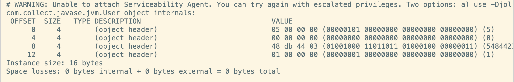

此时，指针压缩失效，指针长度恢复到8字节。那么如果业务场景内存超过32GB怎么办呢，可以通过修改默认对齐长度进行再次扩展，我们将对齐长度修改为16字节：

```
-Xmx32g -XX:ObjectAlignmentInBytes=16
```

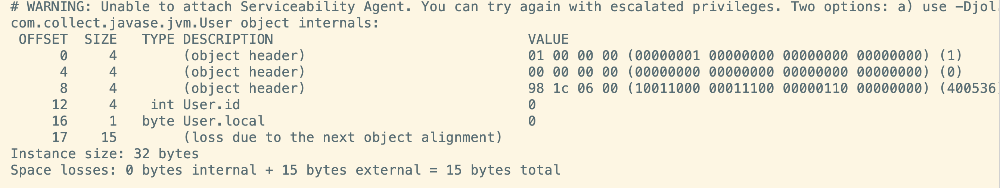

可以看到指针压缩后占4字节，同时对象向16字节进行了填充对齐，按照上面的计算，这时配置最大堆内存为64GB时指针压缩才会失效(这里给User类加了两个字段，方便看出对齐长度为16)。

对指针压缩做一下简单总结：

- 通过指针压缩，利用对齐填充的特性，通过映射方式达到了内存地址扩展的效果
- 指针压缩能够节省内存空间，同时提高了程序的寻址效率
- 堆内存设置时最好不要超过32GB，这时指针压缩将会失效，造成空间的浪费
- 此外，指针压缩不仅可以作用于对象头的类型指针，还可以作用于引用类型的字段指针，以及引用类型数组指针

### 3.3 数组长度

如果当对象是一个数组对象时，那么在对象头中有一个保存数组长度的空间，占用4字节（32bit）空间。通过下面代码进行测试：

```java
public static void main(String[] args) {
    User[] user=new User[2];
    //查看对象的内存布局
    System.out.println(ClassLayout.parseInstance(user).toPrintable());
}
```

运行结果：

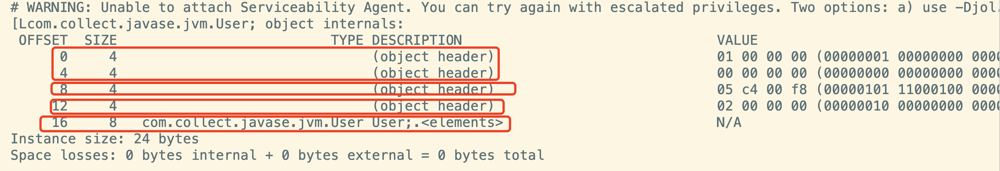

内存结构从上到下分别为：

- 8字节`mark word`
- 4字节`klass pointer`
- 4字节数组长度，值为2，表示数组中有两个元素
- 开启指针压缩后每个引用类型占4字节，数组中两个元素共占8字节

需要注意的是，在未开启指针压缩的情况下，在数组长度后会有一段对齐填充字节：

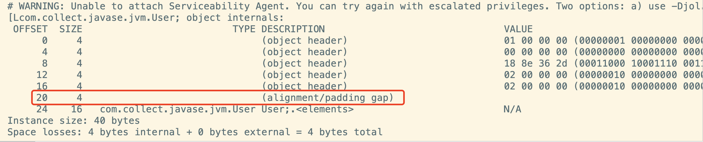

通过计算：

```
8B (mark word) + 8B (klass pointer) + 4B (array length) + 16B (instance data)=36B
```

需要向8字节进行对齐，这里选择将对齐的4字节添加在了数组长度和实例数据之间。

## 四、实例数据

实例数据（`Instance Data`）保存的是对象真正存储的有效信息，保存了代码中定义的各种数据类型的字段内容，并且如果有继承关系存在，子类还会包含从父类继承过来的字段。

- 基本数据类型：

| Type          | Bytes |
| :------------ | :---- |
| byte，boolean | 1     |
| char，short   | 2     |
| int，float    | 4     |
| long，double  | 8     |

- 引用数据类型：

未开启指针压缩情况下占8字节，开启指针压缩后占4字节。

### 4.1 字段重排序

给User类添加基本数据类型的属性字段：

```java
public class User {
    int id,age,weight;
    byte sex;
    long phone;
    char local;
}
```

查看内存布局：

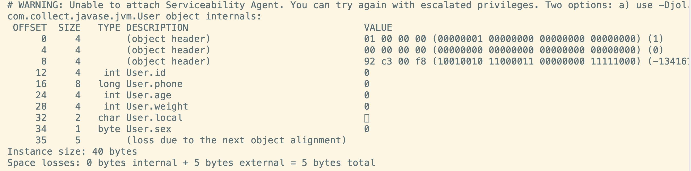

可以看到，在内存中，属性的排列顺序与在类中定义的顺序不同，这是因为jvm会采用**字段重排序**技术，对原始类型进行重新排序，以达到内存对齐的目的。具体规则遵循如下：

- 按照数据类型的长度大小，从大到小排列
- 具有相同长度的字段，会被分配在相邻位置
- 如果一个字段的长度是L个字节，那么这个字段的偏移量（`OFFSET`）需要对齐至`nL`（n为整数）

上面的前两条规则相对容易理解，这里通过举例对第3条进行解释：

因为`long`类型占8字节，所以它的偏移量必定是8n，再加上前面对象头占12字节，所以`long`类型变量的最小偏移量是16。通过打印对象内存布局可以发现，当对象头不是8字节的整数倍时（只存在`8n+4`字节情况），会按从大到小的顺序，使用4、2、1字节长度的属性进行补位。为了和对齐填充进行区分，可以称其为前置补位，如果在补位后仍然不满足8字节整数倍，会进行对齐填充。在存在前置补位的情况下，字段的排序会打破上面的第一条规则。

因此在上面的内存布局中，先使用4字节的`int`进行前置补位，再按第一条规则从大到小顺序进行排列。如果我们删除3个`int`类型的字段，再查看内存布局：

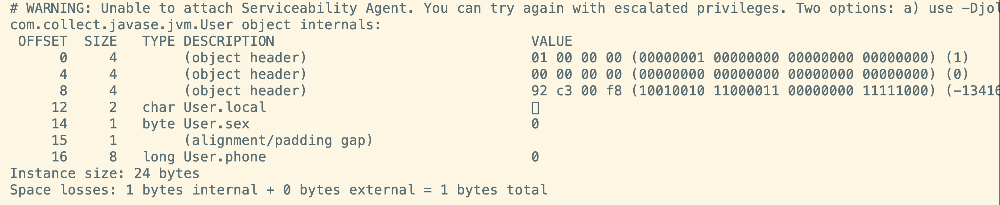

`char`和`byte`类型的变量被提到前面进行前置补位，并在`long`类型前进行了1字节的对齐填充。

### 4.2 拥有父类情况

- 当一个类拥有父类时，整体遵循在父类中定义的变量出现在子类中定义的变量之前的原则

```java
public class A {
    int i1,i2;
    long l1,l2;
    char c1,c2;
}
public class B extends A{
    boolean b1;
    double d1,d2;
}
```

查看内存结构：

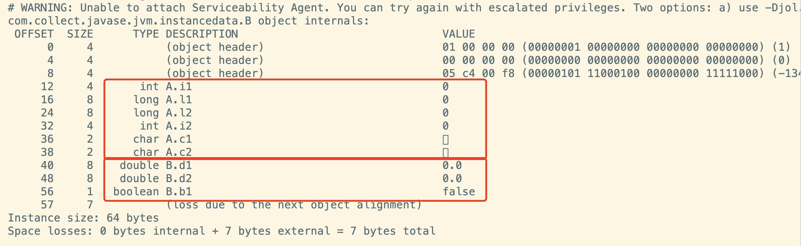

- 如果父类需要后置补位的情况，可能会将子类中类型长度较短的变量提前，但是整体还是遵循子类在父类之后的原则

```java
public class C {
    int i1,i2;
    long l1;
}
public class D extends C {
    int i1,i2;
    long l1;
}
```

查看内存结构：

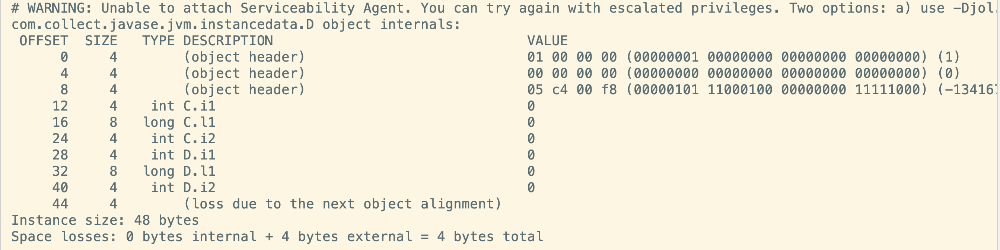

可以看到，子类中较短长度的变量被提前到父类后进行了后置补位。

- 父类的前置对齐填充会被子类继承

```java
public class E {
    long l;
}
public class F extends E{
    long l2;
    int i1;
}
```

查看内存结构：

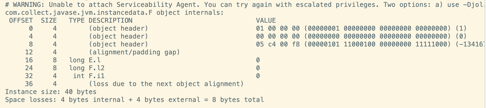

当F类没有继承E类时，正好满足8字节对齐，不需要进行对齐填充。当B类继承A类后，会继承A类的前置补位填充，因此在B类的末尾也需要对齐填充。

### 4.3 引用数据类型

在上面的例子中，仅探讨了基本数据类型的排序情况，那么如果存在引用数据类型时，排序情况是怎样的呢？在`User`类中添加引用类型：

```java
public class User {
     int id;
     String firstName;
     String lastName;
     int age;
}
```

查看内存布局：

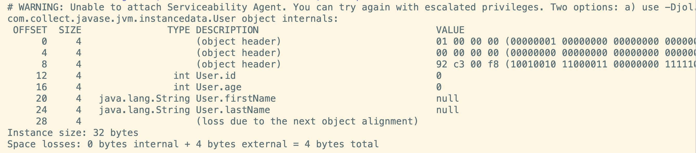

可以看到默认情况下，基本数据类型的变量排在引用数据类型前。这个顺序可以在`jvm`启动参数中进行修改：

```
-XX:FieldsAllocationStyle=0
```

重新运行，可以看到引用数据类型的排列顺序被放在了前面：

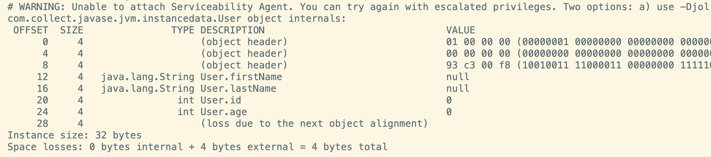

对`FieldsAllocationStyle`的不同取值简要说明：

- 0：先放入普通对象的引用指针，再放入基本数据类型变量
- 1：默认情况，表示先放入基本数据类型变量，再放入普通对象的引用指针

### 4.4 静态变量

在上面的基础上，在类中加入静态变量：

```java
public class User {
     int id;
     static byte local;
}
```

查看内存布局：

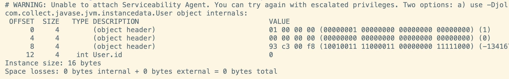

通过结果可以看到，静态变量并不在对象的内存布局中，它的大小是不计算在对象中的，因为静态变量属于类而不是属于某一个对象的。

## 五、对齐填充字节

在`Hotspot`的自动内存管理系统中，要求对象的起始地址必须是8字节的整数倍，也就是说对象的大小必须满足8字节的整数倍。因此如果实例数据没有对齐，那么需要进行对齐补全空缺，补全的`bit`位仅起占位符作用，不具有特殊含义。

在前面的例子中，我们已经对对齐填充有了充分的认识，下面再做一些补充：

- 在开启指针压缩的情况下，如果类中有`long/double`类型的变量时，会在对象头和实例数据间形成间隙（`gap`），为了节省空间，会默认把较短长度的变量放在前边，这一功能可以通过jvm参数进行开启或关闭：

```
# 开启
-XX:+CompactFields
# 关闭
-XX:-CompactFields
```

测试关闭情况，可以看到较短长度的变量没有前移填充：

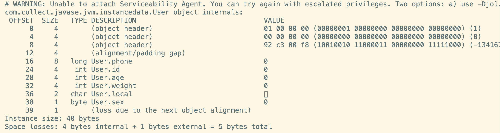

- 在前面指针压缩中，我们提到了可以改变对齐宽度，这也是通过修改下面的jvm参数配置实现的：

```
-XX:ObjectAlignmentInBytes
```

默认情况下对齐宽度为8，这个值可以修改为2~256以内2的整数幂，一般情况下都以8字节对齐或16字节对齐。

## 六、总结

本文通过使用`jol` 对java对象的结构进行调试，学习了对象内存布局的基本知识。通过学习，能够帮助我们：

- 掌握对象内存布局，基于此基础进行jvm参数调优
- 了解对象头在`synchronize` 的锁升级过程中的作用
- 熟悉 jvm 中对象的寻址过程
- 通过计算对象大小，可以在评估业务量的基础上在项目上线前预估需要使用多少内存，防止服务器频繁gc

