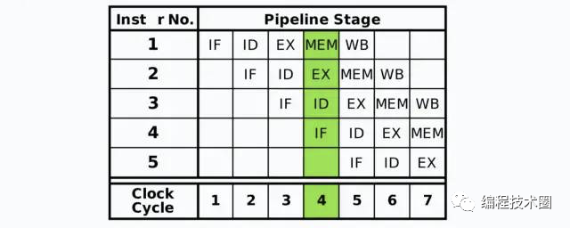
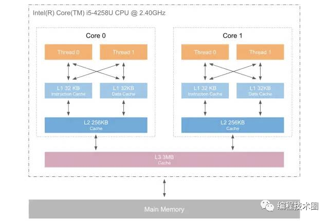
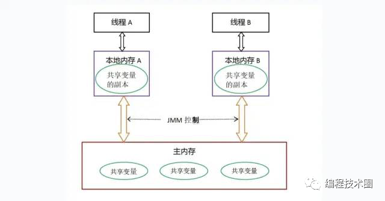
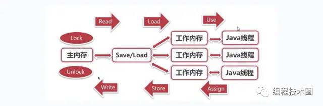

# JVM深入-Java锁机制

[TOC]

## 一、背景知识

### 1. 指令流水线

CPU的基本工作是执行存储的指令序列，即程序。程序的执行过程实际上是不断地取出指令、分析指令、执行指令的过程。

几乎所有的冯•诺伊曼型计算机的CPU，其工作都可以分为5个阶段：取指令、指令译码、执行指令、访存取数和结果写回。



现代处理器的体系结构中，采用了流水线的处理方式对指令进行处理。指令包含了很多阶段，对其进行拆解，每个阶段由专门的硬件电路、寄存器来处 理，就可以实现流水线处理。实现更高的CPU吞吐量，但是由于流水线处理本身的额外开销，可能会增加延迟。

### 2. cpu多级缓存



在计算机系统中，CPU高速缓存（CPU Cache，简称缓存）是用于减少处理器访问内存所需平均时间的部件。在金字塔式存储体系中它位于自顶向下的第二层，仅次于CPU寄存器。其容量远小于内存，但速度却可以接近处理器的频率。
当处理器发出内存访问请求时，会先查看缓存内是否有请求数据。如果存在（命中），则不经访问内存直接返回该数据；如果不存在（失效），则要先把内存中的相应数据载入缓存，再将其返回处理器。缓存之所以有效，主要是因为程序运行时对内存的访问呈现局部性（Locality）特征。这种局部性既包括空间局部性（Spatial Locality），也包括时间局部性（Temporal Locality）。有效利用这种局部性，缓存可以达到极高的命中率。

## 二、问题引入

### 1. 原子性

原子性：即一个操作或者多个操作 要么全部执行并且执行的过程不会被任何因素打断，要么就都不执行。

示例方法：{i++ （i为实例变量）}这样一个简单语句主要由三个操作组成：

- 读取变量i的值
- 进行加一操作
- 将新的值赋值给变量i

如果对实例变量i的操作不做额外的控制，那么多个线程同时调用，就会出现覆盖现象，丢失部分更新。另外，如果再考虑上工作内存和主存之间的交互，可细分为以下几个操作：

- read 从主存读取到工作内存 （非必须）
- load 赋值给工作内存的变量副本（非必须）
- use 工作内存变量的值传给执行引擎执行引擎
- 执行+1操作
- assign 把从执行引擎接收到的值赋给工作内存的变量
- store把工作内存中的一个变量的值传递给主内存（非必须）
- write 把工作内存中变量的值写到主内存中的变量（非必须）

> 吐槽一下：就是把每一步取值赋值操作都单独起了一个名字，搞得我以前一脸懵逼

### 2. 可见性

**可见性**：是指当多个线程访问同一个变量时，一个线程修改了这个变量的值，其他线程能够立即看得到修改的值

存在可见性问题的根本原因是由于缓存的存在，线程持有的是共享变量的副本，无法感知其他线程对于共享变量的更改，导致读取的值不是最新的。

```java
while (flag) {//语句1
   doSomething();//语句2
}
flag = false;//语句3
```

线程1判断flag标记，满足条件则执行语句2；线程2flag标记置为false，但由于可见性问题，线程1无法感知，就会一直循环处理语句2。

### 3. 顺序性

**顺序性**：即程序执行的顺序按照代码的先后顺序执行

由于编译重排序和指令重排序的存在，是的程序真正执行的顺序不一定是跟代码的顺序一致，这种情况在多线程情况下会出现问题：

```java
if (inited == false) { 
   context = loadContext();   //语句1
   inited = true;             //语句2
}
doSomethingwithconfig(context); //语句3
```

由于语句1和语句2没有依赖性，语句1和语句2可能 并行执行 或者 语句2先于语句1执行，如果这段代码两个线程同时执行，线程1执行了语句2，而语句1还没有执行完，这个时候线程2判断inited为true，则执行语句3，但由于context没有初始化完成，则会导致出现未知的异常。

## 三、JMM内存模型

> Java虚拟机规范定义了Java内存模型（Java Memory Model，JMM）来屏蔽各种硬件和操作系统的内存访问差异，以实现让Java程序在各种平台下都能达到一致的内存访问效果（C/C++等则直接使用物理机和OS的内存模型，使得程序须针对特定平台编写），它在多线程的情况下尤其重要。

### 1. 内存划分

JMM的主要目标是定义程序中各个变量的访问规则，即在虚拟机中将变量存储到内存和从内存中取出变量这样的底层细节。这里的变量是指共享变量，存在竞争问题的变量，如实例字段、静态字段、数组对象元素等，不包括线程私有的局部变量、方法参数等，因为私有变量不存在竞争问题。可以认为JMM包括内存划分、变量访问操作与规则两部分。



分为主内存和工作内存，每个线程都有自己的工作内存，它们共享主内存。

- 主内存（Main Memory）存储所有共享变量的值。
- 工作内存（Working Memory）存储该线程使用到的共享变量在主内存的的值的副本拷贝。

线程对共享变量的所有读写操作都在自己的工作内存中进行，不能直接读写主内存中的变量。

不同线程间也无法直接访问对方工作内存中的变量，线程间变量值的传递必须通过主内存完成。

> 这种划分与Java内存区域中堆、栈、方法区等的划分是不同层次的划分，两者基本没有关系。硬要联系的话，大致上主内存对应Java堆中对象的实例数据部分、工作内存对应栈的部分区域；从更低层次上说，主内存对应物理硬件内存、工作内存对应寄存器和高速缓存。

### 2. 内存间交互规则

关于主内存与工作内存之间的交互协议，即一个变量如何从主内存拷贝到工作内存，如何从工作内存同步到主内存中的实现细节。**Java内存模型定义了8种原子操作来完成**：



- lock: 将一个变量标识为被一个线程独占状态
- unclock: 将一个变量从独占状态释放出来，释放后的变量才可以被其他线程锁定
- read: 将一个变量的值从主内存传输到工作内存中，以便随后的load操作
- load: 把read操作从主内存中得到的变量值放入工作内存的变量的副本中
- use: 把工作内存中的一个变量的值传给执行引擎，每当虚拟机遇到一个使用到变量的指令时都会使用该指令
- assign: 把一个从执行引擎接收到的值赋给工作内存中的变量，每当虚拟机遇到一个给变量赋值的指令时，都要使用该操作
- store: 把工作内存中的一个变量的值传递给主内存，以便随后的write操作
- write: 把store操作从工作内存中得到的变量的值写到主内存中的变量

#### 定义原子操作的使用规则

1. 不允许一个线程无原因地（没有发生过任何assign操作）把数据从工作内存同步会主内存中
2. 一个新的变量只能在主内存中诞生，不允许在工作内存中直接使用一个未被初始化（load或者assign）的变量。即就是对一个变量实施use和store操作之前，必须先自行assign和load操作。
3. 一个变量在同一时刻只允许一条线程对其进行lock操作，但lock操作可以被同一线程重复执行多次，多次执行lock后，只有执行相同次数的unlock操作，变量才会被解锁。lock和unlock必须成对出现。
4. 如果对一个变量执行lock操作，将会清空工作内存中此变量的值，在执行引擎使用这个变量之前需要重新执行load或assign操作初始化变量的值。
5. 如果一个变量事先没有被lock操作锁定，则不允许对它执行unlock操作；也不允许去unlock一个被其他线程锁定的变量。
6. 对一个变量执行unlock操作之前，必须先把此变量同步到主内存中（执行store和write操作）

从上面可以看出，把变量从主内存复制到工作内存需要顺序执行read、load，从工作内存同步回主内存则需要顺序执行store、write。总结：

- read、load、use必须成对顺序出现，但不要求连续出现，assign、store、write同之；
- 变量诞生和初始化：变量只能从主内存“诞生”，且须先初始化后才能使用，即在use/store前须先load/assign；
- lock一个变量后会清空工作内存中该变量的值，使用前须先初始化；unlock前须将变量同步回主内存；
- 一个变量同一时刻只能被一线程lock，lock几次就须unlock几次；未被lock的变量不允许被执行unlock，一个线程不能去unlock其他线程lock的变量。